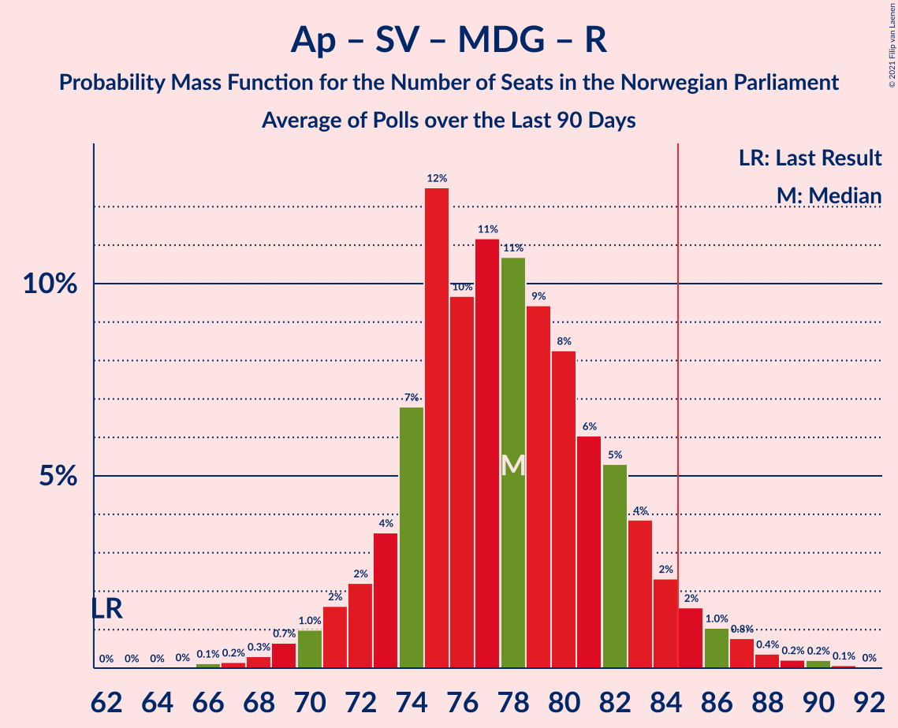

# Poll Average

<a href="#voting-intentions">Voting Intentions</a> | <a href="#seats">Seats</a> | <a href="#coalitions">Coalitions</a> | <a href="#technical-information">Technical Information</a>

## Summary

The table below lists the polls on which the average is based. They are the most recent polls (less than 90 days old) registered and analyzed so far.

| Period     | Polling firm/Commissioner(s) | Ap | H | FrP | Sp | SV | V | KrF | MDG | R |
|:----------:|:----------------------------:|:--:|:--:|:--:|:--:|:--:|:--:|:--:|:--:|:--:|
| 8–9 September 2013 | General Election | 27.4%   49 | 25.0%   45 | 15.2%   27 | 10.3%   19 | 6.0%   11 | 4.4%   8 | 4.2%   8 | 3.2%   1 | 2.4%   1 |
| N/A | Poll Average | 21–29%   39–53 | 18–25%   32–44 | 6–12%   10–22 | 14–21%   25–40 | 5–10%   8–19 | 2–5%   0–9 | 2–5%   1–8 | 3–6%   1–11 | 4–7%   2–12 |
| [6–7 July 2021](2021-07-07-Norfakta.html) | Norfakta   Klassekampen and Nationen | 21–27%   39–49 | 18–23%   31–42 | 8–13%   14–23 | 14–20%   26–36 | 7–11%   12–20 | 3–6%   2–10 | 2–5%   0–8 | 3–6%   1–9 | 5–8%   8–14 |
| [28 June–2 July 2021](2021-07-02-KantarTNS.html) | Kantar TNS   TV2 | 20–25%   37–45 | 17–22%   31–40 | 9–13%   14–22 | 17–22%   31–40 | 6–9%   9–16 | 2–4%   1–3 | 3–5%   1–8 | 4–6%   2–11 | 4–7%   6–12 |
| [28–30 June 2021](2021-06-30-IpsosMMI.html) | Ipsos MMI   Dagbladet | 21–27%   40–50 | 18–23%   34–42 | 6–9%   8–14 | 17–22%   34–41 | 5–8%   8–13 | 2–5%   2–7 | 2–4%   0–3 | 4–7%   3–10 | 4–7%   6–11 |
| [17–23 June 2021](2021-06-23-Norstat.html) | Norstat   Dagens Næringsliv | 24–30%   44–57 | 18–24%   33–43 | 8–12%   13–21 | 13–18%   23–34 | 7–11%   12–20 | 2–4%   0–2 | 2–5%   1–8 | 3–6%   1–11 | 4–7%   2–12 |
| [9–14 June 2021](2021-06-14-ResponsAnalyse.html) | Respons Analyse   Bergens Tidende and VG | 21–26%   39–49 | 19–24%   34–44 | 9–13%   15–23 | 16–21%   29–39 | 7–10%   12–19 | 2–4%   1–3 | 2–5%   1–8 | 3–5%   1–9 | 3–6%   2–11 |
| [8–13 June 2021](2021-06-13-Sentio.html) | Sentio   Amedia and Nettavisen | 21–27%   40–48 | 19–25%   34–44 | 8–12%   14–22 | 16–21%   31–39 | 6–9%   10–15 | 2–4%   1–6 | 2–5%   1–8 | 4–7%   2–12 | 4–6%   2–11 |
| [1–7 June 2021](2021-06-07-OpinionPerduco.html) | Opinion Perduco   Avisenes Nyhetsbyrå, Dagsavisen and FriFagbevegelse | 21–28%   39–50 | 20–26%   35–47 | 8–13%   14–22 | 16–22%   30–40 | 5–8%   8–14 | 1–4%   0–2 | 2–5%   1–9 | 3–6%   2–11 | 3–6%   2–11 |
| 8–9 September 2013 | General Election | 27.4%   49 | 25.0%   45 | 15.2%   27 | 10.3%   19 | 6.0%   11 | 4.4%   8 | 4.2%   8 | 3.2%   1 | 2.4%   1 |

Only polls for which at least the sample size has been published are included in the table above.

**Legend:**
+ **Top half of each row:** Voting intentions (95% confidence interval)
+ **Bottom half of each row:** Seat projections for the Norwegian Parliament (95% confidence interval)
+ **Ap:** Arbeiderpartiet
+ **H:** Høyre
+ **FrP:** Fremskrittspartiet
+ **Sp:** Senterpartiet
+ **SV:** Sosialistisk Venstreparti
+ **V:** Venstre
+ **KrF:** Kristelig Folkeparti
+ **MDG:** Miljøpartiet De Grønne
+ **R:** Rødt
+ **N/A (single party):** Party not included the published results
+ **N/A (entire row):** Calculation for this opinion poll not started yet

## Voting Intentions

### Confidence Intervals

| Party | Last Result | Median | 80% Confidence Interval | 90% Confidence Interval | 95% Confidence Interval | 99% Confidence Interval |
|:-----:|:-----------:|:------:|:-----------------------:|:-----------------------:|:-----------------------:|:-----------------------:|
| <a href="#arbeiderpartiet">Arbeiderpartiet</a> | 27.4% | 24.0% | 21.9–26.8% |21.3–27.9% | 20.8–28.7% | 19.9–30.1% |
| <a href="#høyre">Høyre</a> | 25.0% | 21.1% | 19.0–23.3% |18.5–24.0% | 18.0–24.6% | 17.2–25.8% |
| <a href="#fremskrittspartiet">Fremskrittspartiet</a> | 15.2% | 10.0% | 7.6–11.6% |6.9–12.0% | 6.5–12.4% | 5.9–13.2% |
| <a href="#senterpartiet">Senterpartiet</a> | 10.3% | 18.3% | 15.4–20.3% |14.5–20.8% | 13.9–21.3% | 12.9–22.2% |
| <a href="#sosialistisk-venstreparti">Sosialistisk Venstreparti</a> | 6.0% | 7.6% | 5.9–9.5% |5.5–10.0% | 5.2–10.4% | 4.6–11.2% |
| <a href="#venstre">Venstre</a> | 4.4% | 2.9% | 2.1–4.1% |1.9–4.5% | 1.7–4.9% | 1.4–5.5% |
| <a href="#kristelig-folkeparti">Kristelig Folkeparti</a> | 4.2% | 3.4% | 2.6–4.4% |2.4–4.7% | 2.2–4.9% | 1.9–5.5% |
| <a href="#miljøpartiet-de-grønne">Miljøpartiet De Grønne</a> | 3.2% | 4.6% | 3.5–5.7% |3.2–6.0% | 3.0–6.3% | 2.6–6.9% |
| <a href="#rødt">Rødt</a> | 2.4% | 5.2% | 4.1–6.4% |3.8–6.8% | 3.6–7.1% | 3.2–7.8% |

### Arbeiderpartiet

*For a full overview of the results for this party, see the [Arbeiderpartiet](party-arbeiderpartiet.html) page.*

| Voting Intentions | Probability | Accumulated | Special Marks |
|:-----------------:|:-----------:|:-----------:|:-------------:|
| 17.5–18.5% | 0% | 100% |  |
| 18.5–19.5% | 0.2% | 100% |  |
| 19.5–20.5% | 1.4% | 99.8% |  |
| 20.5–21.5% | 5% | 98% |  |
| 21.5–22.5% | 13% | 93% |  |
| 22.5–23.5% | 20% | 80% |  |
| 23.5–24.5% | 22% | 60% | Median |
| 24.5–25.5% | 16% | 38% |  |
| 25.5–26.5% | 10% | 22% |  |
| 26.5–27.5% | 6% | 12% | Last Result |
| 27.5–28.5% | 3% | 6% |  |
| 28.5–29.5% | 2% | 3% |  |
| 29.5–30.5% | 0.7% | 1.0% |  |
| 30.5–31.5% | 0.2% | 0.3% |  |
| 31.5–32.5% | 0% | 0.1% |  |
| 32.5–33.5% | 0% | 0% |  |

### Høyre

*For a full overview of the results for this party, see the [Høyre](party-høyre.html) page.*

| Voting Intentions | Probability | Accumulated | Special Marks |
|:-----------------:|:-----------:|:-----------:|:-------------:|
| 14.5–15.5% | 0% | 100% |  |
| 15.5–16.5% | 0.1% | 100% |  |
| 16.5–17.5% | 1.0% | 99.9% |  |
| 17.5–18.5% | 4% | 98.9% |  |
| 18.5–19.5% | 12% | 95% |  |
| 19.5–20.5% | 20% | 83% |  |
| 20.5–21.5% | 24% | 63% | Median |
| 21.5–22.5% | 20% | 40% |  |
| 22.5–23.5% | 12% | 20% |  |
| 23.5–24.5% | 5% | 8% |  |
| 24.5–25.5% | 2% | 3% | Last Result |
| 25.5–26.5% | 0.6% | 0.7% |  |
| 26.5–27.5% | 0.1% | 0.2% |  |
| 27.5–28.5% | 0% | 0% |  |

### Fremskrittspartiet

*For a full overview of the results for this party, see the [Fremskrittspartiet](party-fremskrittspartiet.html) page.*

| Voting Intentions | Probability | Accumulated | Special Marks |
|:-----------------:|:-----------:|:-----------:|:-------------:|
| 3.5–4.5% | 0% | 100% |  |
| 4.5–5.5% | 0.2% | 100% |  |
| 5.5–6.5% | 3% | 99.8% |  |
| 6.5–7.5% | 7% | 97% |  |
| 7.5–8.5% | 8% | 90% |  |
| 8.5–9.5% | 18% | 82% |  |
| 9.5–10.5% | 30% | 64% | Median |
| 10.5–11.5% | 24% | 34% |  |
| 11.5–12.5% | 9% | 11% |  |
| 12.5–13.5% | 2% | 2% |  |
| 13.5–14.5% | 0.2% | 0.2% |  |
| 14.5–15.5% | 0% | 0% | Last Result |

### Senterpartiet

*For a full overview of the results for this party, see the [Senterpartiet](party-senterpartiet.html) page.*

| Voting Intentions | Probability | Accumulated | Special Marks |
|:-----------------:|:-----------:|:-----------:|:-------------:|
| 9.5–10.5% | 0% | 100% | Last Result |
| 10.5–11.5% | 0% | 100% |  |
| 11.5–12.5% | 0.2% | 100% |  |
| 12.5–13.5% | 1.3% | 99.7% |  |
| 13.5–14.5% | 4% | 98% |  |
| 14.5–15.5% | 6% | 95% |  |
| 15.5–16.5% | 9% | 89% |  |
| 16.5–17.5% | 14% | 79% |  |
| 17.5–18.5% | 21% | 65% | Median |
| 18.5–19.5% | 22% | 43% |  |
| 19.5–20.5% | 14% | 21% |  |
| 20.5–21.5% | 6% | 7% |  |
| 21.5–22.5% | 1.4% | 2% |  |
| 22.5–23.5% | 0.2% | 0.3% |  |
| 23.5–24.5% | 0% | 0% |  |

### Sosialistisk Venstreparti

*For a full overview of the results for this party, see the [Sosialistisk Venstreparti](party-sosialistiskvenstreparti.html) page.*

| Voting Intentions | Probability | Accumulated | Special Marks |
|:-----------------:|:-----------:|:-----------:|:-------------:|
| 2.5–3.5% | 0% | 100% |  |
| 3.5–4.5% | 0.4% | 100% |  |
| 4.5–5.5% | 5% | 99.6% |  |
| 5.5–6.5% | 17% | 95% | Last Result |
| 6.5–7.5% | 27% | 78% |  |
| 7.5–8.5% | 25% | 51% | Median |
| 8.5–9.5% | 17% | 25% |  |
| 9.5–10.5% | 7% | 9% |  |
| 10.5–11.5% | 2% | 2% |  |
| 11.5–12.5% | 0.2% | 0.2% |  |
| 12.5–13.5% | 0% | 0% |  |

### Venstre

*For a full overview of the results for this party, see the [Venstre](party-venstre.html) page.*

| Voting Intentions | Probability | Accumulated | Special Marks |
|:-----------------:|:-----------:|:-----------:|:-------------:|
| 0.0–0.5% | 0% | 100% |  |
| 0.5–1.5% | 1.1% | 100% |  |
| 1.5–2.5% | 27% | 98.9% |  |
| 2.5–3.5% | 48% | 72% | Median |
| 3.5–4.5% | 19% | 24% | Last Result |
| 4.5–5.5% | 4% | 5% |  |
| 5.5–6.5% | 0.5% | 0.5% |  |
| 6.5–7.5% | 0% | 0% |  |

### Kristelig Folkeparti

*For a full overview of the results for this party, see the [Kristelig Folkeparti](party-kristeligfolkeparti.html) page.*

| Voting Intentions | Probability | Accumulated | Special Marks |
|:-----------------:|:-----------:|:-----------:|:-------------:|
| 0.5–1.5% | 0% | 100% |  |
| 1.5–2.5% | 10% | 100% |  |
| 2.5–3.5% | 49% | 90% | Median |
| 3.5–4.5% | 35% | 41% | Last Result |
| 4.5–5.5% | 6% | 6% |  |
| 5.5–6.5% | 0.4% | 0.4% |  |
| 6.5–7.5% | 0% | 0% |  |

### Miljøpartiet De Grønne

*For a full overview of the results for this party, see the [Miljøpartiet De Grønne](party-miljøpartietdegrønne.html) page.*

| Voting Intentions | Probability | Accumulated | Special Marks |
|:-----------------:|:-----------:|:-----------:|:-------------:|
| 0.5–1.5% | 0% | 100% |  |
| 1.5–2.5% | 0.3% | 100% |  |
| 2.5–3.5% | 12% | 99.7% | Last Result |
| 3.5–4.5% | 37% | 88% |  |
| 4.5–5.5% | 37% | 51% | Median |
| 5.5–6.5% | 12% | 14% |  |
| 6.5–7.5% | 1.2% | 1.3% |  |
| 7.5–8.5% | 0% | 0% |  |
| 8.5–9.5% | 0% | 0% |  |

### Rødt

*For a full overview of the results for this party, see the [Rødt](party-rødt.html) page.*

| Voting Intentions | Probability | Accumulated | Special Marks |
|:-----------------:|:-----------:|:-----------:|:-------------:|
| 1.5–2.5% | 0% | 100% | Last Result |
| 2.5–3.5% | 2% | 100% |  |
| 3.5–4.5% | 22% | 98% |  |
| 4.5–5.5% | 42% | 76% | Median |
| 5.5–6.5% | 26% | 33% |  |
| 6.5–7.5% | 7% | 8% |  |
| 7.5–8.5% | 0.9% | 1.0% |  |
| 8.5–9.5% | 0.1% | 0.1% |  |
| 9.5–10.5% | 0% | 0% |  |

## Seats

### Confidence Intervals

| Party | Last Result | Median | 80% Confidence Interval | 90% Confidence Interval | 95% Confidence Interval | 99% Confidence Interval |
|:-----:|:-----------:|:------:|:-----------------------:|:-----------------------:|:-----------------------:|:-----------------------:|
| <a href="#arbeiderpartiet">Arbeiderpartiet</a> | 49 | 44 | 41–49 |40–51 | 39–53 | 37–57 |
| <a href="#høyre">Høyre</a> | 45 | 37 | 34–42 |33–43 | 32–44 | 30–47 |
| <a href="#fremskrittspartiet">Fremskrittspartiet</a> | 27 | 17 | 12–21 |11–21 | 10–22 | 9–24 |
| <a href="#senterpartiet">Senterpartiet</a> | 19 | 34 | 28–38 |26–39 | 25–40 | 23–42 |
| <a href="#sosialistisk-venstreparti">Sosialistisk Venstreparti</a> | 11 | 13 | 10–17 |9–18 | 8–19 | 8–20 |
| <a href="#venstre">Venstre</a> | 8 | 2 | 1–6 |1–8 | 0–9 | 0–10 |
| <a href="#kristelig-folkeparti">Kristelig Folkeparti</a> | 8 | 2 | 1–7 |1–8 | 1–8 | 0–9 |
| <a href="#miljøpartiet-de-grønne">Miljøpartiet De Grønne</a> | 1 | 8 | 2–10 |2–10 | 1–11 | 1–12 |
| <a href="#rødt">Rødt</a> | 1 | 9 | 6–11 |2–12 | 2–12 | 2–14 |

### Arbeiderpartiet

*For a full overview of the results for this party, see the [Arbeiderpartiet](party-arbeiderpartiet.html) page.*

| Number of Seats | Probability | Accumulated | Special Marks |
|:---------------:|:-----------:|:-----------:|:-------------:|
| 34 | 0% | 100% |  |
| 35 | 0.1% | 99.9% |  |
| 36 | 0.3% | 99.9% |  |
| 37 | 0.4% | 99.6% |  |
| 38 | 1.2% | 99.1% |  |
| 39 | 3% | 98% |  |
| 40 | 5% | 95% |  |
| 41 | 6% | 90% |  |
| 42 | 9% | 84% |  |
| 43 | 11% | 75% |  |
| 44 | 23% | 64% | Median |
| 45 | 13% | 42% |  |
| 46 | 8% | 29% |  |
| 47 | 5% | 21% |  |
| 48 | 3% | 16% |  |
| 49 | 4% | 12% | Last Result |
| 50 | 2% | 9% |  |
| 51 | 2% | 6% |  |
| 52 | 0.9% | 4% |  |
| 53 | 2% | 4% |  |
| 54 | 0.5% | 2% |  |
| 55 | 0.4% | 1.3% |  |
| 56 | 0.3% | 0.9% |  |
| 57 | 0.4% | 0.6% |  |
| 58 | 0.1% | 0.2% |  |
| 59 | 0% | 0% |  |

### Høyre

*For a full overview of the results for this party, see the [Høyre](party-høyre.html) page.*

| Number of Seats | Probability | Accumulated | Special Marks |
|:---------------:|:-----------:|:-----------:|:-------------:|
| 28 | 0.1% | 100% |  |
| 29 | 0.2% | 99.9% |  |
| 30 | 0.3% | 99.7% |  |
| 31 | 0.9% | 99.3% |  |
| 32 | 1.5% | 98% |  |
| 33 | 3% | 97% |  |
| 34 | 9% | 94% |  |
| 35 | 12% | 85% |  |
| 36 | 13% | 73% |  |
| 37 | 12% | 60% | Median |
| 38 | 10% | 49% |  |
| 39 | 8% | 38% |  |
| 40 | 10% | 30% |  |
| 41 | 9% | 20% |  |
| 42 | 4% | 12% |  |
| 43 | 4% | 8% |  |
| 44 | 2% | 4% |  |
| 45 | 1.0% | 2% | Last Result |
| 46 | 0.4% | 0.9% |  |
| 47 | 0.2% | 0.5% |  |
| 48 | 0.2% | 0.3% |  |
| 49 | 0.1% | 0.1% |  |
| 50 | 0% | 0.1% |  |
| 51 | 0% | 0% |  |

### Fremskrittspartiet

*For a full overview of the results for this party, see the [Fremskrittspartiet](party-fremskrittspartiet.html) page.*

| Number of Seats | Probability | Accumulated | Special Marks |
|:---------------:|:-----------:|:-----------:|:-------------:|
| 8 | 0.4% | 100% |  |
| 9 | 1.4% | 99.5% |  |
| 10 | 3% | 98% |  |
| 11 | 3% | 95% |  |
| 12 | 3% | 92% |  |
| 13 | 4% | 89% |  |
| 14 | 3% | 85% |  |
| 15 | 7% | 82% |  |
| 16 | 11% | 75% |  |
| 17 | 16% | 64% | Median |
| 18 | 14% | 48% |  |
| 19 | 14% | 34% |  |
| 20 | 9% | 20% |  |
| 21 | 6% | 11% |  |
| 22 | 3% | 5% |  |
| 23 | 1.3% | 2% |  |
| 24 | 0.5% | 0.8% |  |
| 25 | 0.2% | 0.3% |  |
| 26 | 0% | 0% |  |
| 27 | 0% | 0% | Last Result |

### Senterpartiet

*For a full overview of the results for this party, see the [Senterpartiet](party-senterpartiet.html) page.*

| Number of Seats | Probability | Accumulated | Special Marks |
|:---------------:|:-----------:|:-----------:|:-------------:|
| 19 | 0% | 100% | Last Result |
| 20 | 0% | 100% |  |
| 21 | 0.2% | 100% |  |
| 22 | 0.1% | 99.8% |  |
| 23 | 0.6% | 99.7% |  |
| 24 | 0.5% | 99.1% |  |
| 25 | 1.1% | 98.6% |  |
| 26 | 4% | 97% |  |
| 27 | 3% | 94% |  |
| 28 | 2% | 91% |  |
| 29 | 3% | 88% |  |
| 30 | 4% | 85% |  |
| 31 | 5% | 82% |  |
| 32 | 7% | 77% |  |
| 33 | 11% | 70% |  |
| 34 | 12% | 59% | Median |
| 35 | 14% | 47% |  |
| 36 | 16% | 33% |  |
| 37 | 8% | 18% |  |
| 38 | 5% | 10% |  |
| 39 | 3% | 6% |  |
| 40 | 1.2% | 3% |  |
| 41 | 1.1% | 2% |  |
| 42 | 0.3% | 0.5% |  |
| 43 | 0.1% | 0.2% |  |
| 44 | 0.1% | 0.1% |  |
| 45 | 0% | 0% |  |

### Sosialistisk Venstreparti

*For a full overview of the results for this party, see the [Sosialistisk Venstreparti](party-sosialistiskvenstreparti.html) page.*

| Number of Seats | Probability | Accumulated | Special Marks |
|:---------------:|:-----------:|:-----------:|:-------------:|
| 3 | 0% | 100% |  |
| 4 | 0% | 99.9% |  |
| 5 | 0% | 99.9% |  |
| 6 | 0% | 99.9% |  |
| 7 | 0.4% | 99.9% |  |
| 8 | 3% | 99.5% |  |
| 9 | 6% | 97% |  |
| 10 | 12% | 91% |  |
| 11 | 12% | 79% | Last Result |
| 12 | 13% | 68% |  |
| 13 | 12% | 55% | Median |
| 14 | 11% | 43% |  |
| 15 | 12% | 32% |  |
| 16 | 7% | 20% |  |
| 17 | 6% | 12% |  |
| 18 | 3% | 6% |  |
| 19 | 2% | 3% |  |
| 20 | 0.7% | 1.1% |  |
| 21 | 0.3% | 0.3% |  |
| 22 | 0% | 0.1% |  |
| 23 | 0% | 0% |  |

### Venstre

*For a full overview of the results for this party, see the [Venstre](party-venstre.html) page.*

| Number of Seats | Probability | Accumulated | Special Marks |
|:---------------:|:-----------:|:-----------:|:-------------:|
| 0 | 4% | 100% |  |
| 1 | 13% | 96% |  |
| 2 | 69% | 83% | Median |
| 3 | 2% | 14% |  |
| 4 | 0.1% | 12% |  |
| 5 | 0% | 12% |  |
| 6 | 3% | 12% |  |
| 7 | 4% | 9% |  |
| 8 | 2% | 5% | Last Result |
| 9 | 2% | 3% |  |
| 10 | 0.7% | 0.8% |  |
| 11 | 0.1% | 0.1% |  |
| 12 | 0% | 0% |  |

### Kristelig Folkeparti

*For a full overview of the results for this party, see the [Kristelig Folkeparti](party-kristeligfolkeparti.html) page.*

| Number of Seats | Probability | Accumulated | Special Marks |
|:---------------:|:-----------:|:-----------:|:-------------:|
| 0 | 2% | 100% |  |
| 1 | 34% | 98% |  |
| 2 | 17% | 64% | Median |
| 3 | 30% | 47% |  |
| 4 | 0% | 17% |  |
| 5 | 0% | 17% |  |
| 6 | 2% | 17% |  |
| 7 | 8% | 15% |  |
| 8 | 5% | 7% | Last Result |
| 9 | 1.2% | 2% |  |
| 10 | 0.3% | 0.3% |  |
| 11 | 0% | 0.1% |  |
| 12 | 0% | 0% |  |

### Miljøpartiet De Grønne

*For a full overview of the results for this party, see the [Miljøpartiet De Grønne](party-miljøpartietdegrønne.html) page.*

| Number of Seats | Probability | Accumulated | Special Marks |
|:---------------:|:-----------:|:-----------:|:-------------:|
| 1 | 3% | 100% | Last Result |
| 2 | 17% | 97% |  |
| 3 | 4% | 80% |  |
| 4 | 1.5% | 76% |  |
| 5 | 0% | 74% |  |
| 6 | 2% | 74% |  |
| 7 | 18% | 73% |  |
| 8 | 28% | 55% | Median |
| 9 | 16% | 27% |  |
| 10 | 7% | 11% |  |
| 11 | 3% | 4% |  |
| 12 | 0.9% | 1.0% |  |
| 13 | 0.1% | 0.2% |  |
| 14 | 0% | 0% |  |

### Rødt

*For a full overview of the results for this party, see the [Rødt](party-rødt.html) page.*

| Number of Seats | Probability | Accumulated | Special Marks |
|:---------------:|:-----------:|:-----------:|:-------------:|
| 1 | 0.1% | 100% | Last Result |
| 2 | 9% | 99.9% |  |
| 3 | 0.1% | 91% |  |
| 4 | 0% | 91% |  |
| 5 | 0% | 91% |  |
| 6 | 1.2% | 91% |  |
| 7 | 10% | 90% |  |
| 8 | 25% | 80% |  |
| 9 | 24% | 55% | Median |
| 10 | 18% | 31% |  |
| 11 | 8% | 14% |  |
| 12 | 4% | 6% |  |
| 13 | 1.2% | 2% |  |
| 14 | 0.3% | 0.5% |  |
| 15 | 0.1% | 0.2% |  |
| 16 | 0% | 0.1% |  |
| 17 | 0% | 0% |  |

## Coalitions

### Confidence Intervals

| Coalition | Last Result | Median | Majority? | 80% Confidence Interval | 90% Confidence Interval | 95% Confidence Interval | 99% Confidence Interval |
|:---------:|:-----------:|:------:|:---------:|:-----------------------:|:-----------------------:|:-----------------------:|:-----------------------:|
| Arbeiderpartiet – Senterpartiet – Sosialistisk Venstreparti – Miljøpartiet De Grønne – Rødt | 81 | 107 | 100% | 101–111 | 100–112 | 98–113 | 95–115 |
| Arbeiderpartiet – Senterpartiet – Sosialistisk Venstreparti – Kristelig Folkeparti – Miljøpartiet De Grønne | 88 | 101 | 100% | 96–106 | 94–107 | 93–108 | 90–110 |
| Arbeiderpartiet – Senterpartiet – Sosialistisk Venstreparti – Rødt | 80 | 100 | 100% | 95–104 | 93–106 | 92–107 | 89–110 |
| Arbeiderpartiet – Senterpartiet – Sosialistisk Venstreparti – Miljøpartiet De Grønne | 80 | 98 | 99.9% | 93–102 | 91–104 | 90–105 | 87–107 |
| Høyre – Fremskrittspartiet – Senterpartiet – Venstre – Kristelig Folkeparti | 107 | 94 | 95% | 87–100 | 85–102 | 83–103 | 80–107 |
| Arbeiderpartiet – Senterpartiet – Sosialistisk Venstreparti | 79 | 91 | 97% | 87–95 | 86–97 | 84–99 | 81–101 |
| Arbeiderpartiet – Senterpartiet – Kristelig Folkeparti – Miljøpartiet De Grønne | 77 | 88 | 76% | 81–94 | 79–95 | 77–97 | 74–98 |
| Arbeiderpartiet – Senterpartiet – Kristelig Folkeparti | 76 | 81 | 18% | 76–86 | 74–87 | 73–89 | 70–91 |
| Arbeiderpartiet – Senterpartiet | 68 | 78 | 3% | 74–82 | 72–84 | 71–85 | 68–88 |
| Arbeiderpartiet – Sosialistisk Venstreparti – Miljøpartiet De Grønne – Rødt | 62 | 72 | 3% | 67–79 | 65–82 | 64–85 | 61–87 |
| Høyre – Fremskrittspartiet – Venstre – Kristelig Folkeparti – Miljøpartiet De Grønne | 89 | 67 | 0% | 60–73 | 59–75 | 58–76 | 55–79 |
| Høyre – Fremskrittspartiet – Venstre – Kristelig Folkeparti | 88 | 60 | 0% | 53–66 | 51–68 | 51–69 | 48–72 |
| Arbeiderpartiet – Sosialistisk Venstreparti | 60 | 57 | 0% | 53–64 | 51–67 | 50–69 | 48–72 |
| Høyre – Fremskrittspartiet – Venstre | 80 | 57 | 0% | 51–63 | 50–65 | 48–66 | 46–69 |
| Høyre – Fremskrittspartiet | 72 | 55 | 0% | 48–60 | 47–62 | 46–64 | 44–67 |
| Høyre – Venstre – Kristelig Folkeparti | 61 | 43 | 0% | 39–48 | 38–49 | 37–51 | 35–53 |
| Senterpartiet – Venstre – Kristelig Folkeparti | 35 | 39 | 0% | 32–44 | 30–46 | 29–47 | 27–49 |

### Arbeiderpartiet – Senterpartiet – Sosialistisk Venstreparti – Miljøpartiet De Grønne – Rødt

| Number of Seats | Probability | Accumulated | Special Marks |
|:---------------:|:-----------:|:-----------:|:-------------:|
| 81 | 0% | 100% | Last Result |
| 82 | 0% | 100% |  |
| 83 | 0% | 100% |  |
| 84 | 0% | 100% |  |
| 85 | 0% | 100% | Majority |
| 86 | 0% | 100% |  |
| 87 | 0% | 100% |  |
| 88 | 0% | 100% |  |
| 89 | 0% | 100% |  |
| 90 | 0% | 100% |  |
| 91 | 0% | 100% |  |
| 92 | 0.1% | 99.9% |  |
| 93 | 0.1% | 99.9% |  |
| 94 | 0.2% | 99.8% |  |
| 95 | 0.4% | 99.6% |  |
| 96 | 0.6% | 99.2% |  |
| 97 | 0.8% | 98.6% |  |
| 98 | 1.0% | 98% |  |
| 99 | 1.4% | 97% |  |
| 100 | 2% | 95% |  |
| 101 | 4% | 93% |  |
| 102 | 4% | 89% |  |
| 103 | 6% | 84% |  |
| 104 | 9% | 78% |  |
| 105 | 9% | 69% |  |
| 106 | 8% | 60% |  |
| 107 | 12% | 52% |  |
| 108 | 11% | 40% | Median |
| 109 | 8% | 29% |  |
| 110 | 9% | 21% |  |
| 111 | 4% | 12% |  |
| 112 | 4% | 8% |  |
| 113 | 2% | 4% |  |
| 114 | 1.0% | 2% |  |
| 115 | 0.7% | 1.0% |  |
| 116 | 0.1% | 0.3% |  |
| 117 | 0.1% | 0.2% |  |
| 118 | 0.1% | 0.1% |  |
| 119 | 0% | 0% |  |

### Arbeiderpartiet – Senterpartiet – Sosialistisk Venstreparti – Kristelig Folkeparti – Miljøpartiet De Grønne

| Number of Seats | Probability | Accumulated | Special Marks |
|:---------------:|:-----------:|:-----------:|:-------------:|
| 87 | 0% | 100% |  |
| 88 | 0.2% | 99.9% | Last Result |
| 89 | 0.2% | 99.7% |  |
| 90 | 0.3% | 99.5% |  |
| 91 | 0.6% | 99.2% |  |
| 92 | 1.1% | 98.7% |  |
| 93 | 2% | 98% |  |
| 94 | 2% | 96% |  |
| 95 | 3% | 94% |  |
| 96 | 3% | 91% |  |
| 97 | 7% | 88% |  |
| 98 | 9% | 81% |  |
| 99 | 8% | 73% |  |
| 100 | 11% | 65% |  |
| 101 | 11% | 54% | Median |
| 102 | 11% | 42% |  |
| 103 | 9% | 31% |  |
| 104 | 6% | 23% |  |
| 105 | 5% | 17% |  |
| 106 | 4% | 11% |  |
| 107 | 3% | 8% |  |
| 108 | 3% | 5% |  |
| 109 | 1.0% | 2% |  |
| 110 | 0.5% | 0.9% |  |
| 111 | 0.2% | 0.5% |  |
| 112 | 0.1% | 0.2% |  |
| 113 | 0.1% | 0.1% |  |
| 114 | 0% | 0.1% |  |
| 115 | 0% | 0% |  |

### Arbeiderpartiet – Senterpartiet – Sosialistisk Venstreparti – Rødt

| Number of Seats | Probability | Accumulated | Special Marks |
|:---------------:|:-----------:|:-----------:|:-------------:|
| 80 | 0% | 100% | Last Result |
| 81 | 0% | 100% |  |
| 82 | 0% | 100% |  |
| 83 | 0% | 100% |  |
| 84 | 0% | 100% |  |
| 85 | 0% | 100% | Majority |
| 86 | 0.1% | 100% |  |
| 87 | 0.1% | 99.9% |  |
| 88 | 0.2% | 99.8% |  |
| 89 | 0.2% | 99.6% |  |
| 90 | 0.8% | 99.4% |  |
| 91 | 0.7% | 98.5% |  |
| 92 | 1.4% | 98% |  |
| 93 | 2% | 96% |  |
| 94 | 4% | 94% |  |
| 95 | 5% | 91% |  |
| 96 | 5% | 86% |  |
| 97 | 9% | 81% |  |
| 98 | 9% | 72% |  |
| 99 | 12% | 63% |  |
| 100 | 11% | 51% | Median |
| 101 | 10% | 40% |  |
| 102 | 8% | 30% |  |
| 103 | 8% | 21% |  |
| 104 | 4% | 14% |  |
| 105 | 4% | 10% |  |
| 106 | 2% | 6% |  |
| 107 | 2% | 4% |  |
| 108 | 1.2% | 2% |  |
| 109 | 0.4% | 1.2% |  |
| 110 | 0.5% | 0.8% |  |
| 111 | 0.2% | 0.3% |  |
| 112 | 0% | 0.1% |  |
| 113 | 0% | 0.1% |  |
| 114 | 0% | 0% |  |

### Arbeiderpartiet – Senterpartiet – Sosialistisk Venstreparti – Miljøpartiet De Grønne

| Number of Seats | Probability | Accumulated | Special Marks |
|:---------------:|:-----------:|:-----------:|:-------------:|
| 80 | 0% | 100% | Last Result |
| 81 | 0% | 100% |  |
| 82 | 0% | 100% |  |
| 83 | 0% | 100% |  |
| 84 | 0% | 100% |  |
| 85 | 0.1% | 99.9% | Majority |
| 86 | 0.1% | 99.8% |  |
| 87 | 0.3% | 99.7% |  |
| 88 | 0.7% | 99.4% |  |
| 89 | 0.6% | 98.7% |  |
| 90 | 1.4% | 98% |  |
| 91 | 2% | 97% |  |
| 92 | 3% | 95% |  |
| 93 | 4% | 92% |  |
| 94 | 5% | 88% |  |
| 95 | 8% | 82% |  |
| 96 | 8% | 75% |  |
| 97 | 9% | 67% |  |
| 98 | 11% | 57% |  |
| 99 | 11% | 46% | Median |
| 100 | 12% | 36% |  |
| 101 | 9% | 24% |  |
| 102 | 5% | 15% |  |
| 103 | 3% | 9% |  |
| 104 | 3% | 6% |  |
| 105 | 2% | 4% |  |
| 106 | 1.1% | 2% |  |
| 107 | 0.4% | 0.7% |  |
| 108 | 0.2% | 0.4% |  |
| 109 | 0.1% | 0.2% |  |
| 110 | 0% | 0.1% |  |
| 111 | 0% | 0% |  |

### Høyre – Fremskrittspartiet – Senterpartiet – Venstre – Kristelig Folkeparti

| Number of Seats | Probability | Accumulated | Special Marks |
|:---------------:|:-----------:|:-----------:|:-------------:|
| 75 | 0% | 100% |  |
| 76 | 0% | 99.9% |  |
| 77 | 0.2% | 99.9% |  |
| 78 | 0.1% | 99.8% |  |
| 79 | 0.1% | 99.6% |  |
| 80 | 0.3% | 99.6% |  |
| 81 | 0.9% | 99.2% |  |
| 82 | 0.5% | 98% |  |
| 83 | 1.1% | 98% |  |
| 84 | 1.3% | 97% |  |
| 85 | 2% | 95% | Majority |
| 86 | 2% | 93% |  |
| 87 | 2% | 92% |  |
| 88 | 5% | 89% |  |
| 89 | 6% | 84% |  |
| 90 | 7% | 79% |  |
| 91 | 6% | 72% |  |
| 92 | 7% | 66% | Median |
| 93 | 7% | 59% |  |
| 94 | 7% | 52% |  |
| 95 | 7% | 46% |  |
| 96 | 10% | 39% |  |
| 97 | 6% | 29% |  |
| 98 | 6% | 23% |  |
| 99 | 4% | 17% |  |
| 100 | 4% | 13% |  |
| 101 | 3% | 9% |  |
| 102 | 1.4% | 5% |  |
| 103 | 2% | 4% |  |
| 104 | 0.8% | 2% |  |
| 105 | 0.5% | 1.3% |  |
| 106 | 0.2% | 0.8% |  |
| 107 | 0.2% | 0.5% | Last Result |
| 108 | 0.1% | 0.4% |  |
| 109 | 0.1% | 0.3% |  |
| 110 | 0.1% | 0.1% |  |
| 111 | 0.1% | 0.1% |  |
| 112 | 0% | 0% |  |

### Arbeiderpartiet – Senterpartiet – Sosialistisk Venstreparti

| Number of Seats | Probability | Accumulated | Special Marks |
|:---------------:|:-----------:|:-----------:|:-------------:|
| 79 | 0% | 100% | Last Result |
| 80 | 0.1% | 99.9% |  |
| 81 | 0.4% | 99.9% |  |
| 82 | 0.2% | 99.5% |  |
| 83 | 0.8% | 99.2% |  |
| 84 | 1.0% | 98% |  |
| 85 | 2% | 97% | Majority |
| 86 | 3% | 95% |  |
| 87 | 5% | 92% |  |
| 88 | 7% | 87% |  |
| 89 | 10% | 80% |  |
| 90 | 12% | 70% |  |
| 91 | 13% | 58% | Median |
| 92 | 11% | 44% |  |
| 93 | 10% | 33% |  |
| 94 | 8% | 23% |  |
| 95 | 6% | 15% |  |
| 96 | 3% | 10% |  |
| 97 | 2% | 7% |  |
| 98 | 2% | 5% |  |
| 99 | 2% | 3% |  |
| 100 | 0.8% | 1.5% |  |
| 101 | 0.2% | 0.7% |  |
| 102 | 0.3% | 0.5% |  |
| 103 | 0.1% | 0.2% |  |
| 104 | 0% | 0.1% |  |
| 105 | 0% | 0% |  |

### Arbeiderpartiet – Senterpartiet – Kristelig Folkeparti – Miljøpartiet De Grønne

| Number of Seats | Probability | Accumulated | Special Marks |
|:---------------:|:-----------:|:-----------:|:-------------:|
| 71 | 0% | 100% |  |
| 72 | 0.1% | 99.9% |  |
| 73 | 0.2% | 99.8% |  |
| 74 | 0.3% | 99.7% |  |
| 75 | 0.4% | 99.4% |  |
| 76 | 1.1% | 99.0% |  |
| 77 | 0.8% | 98% | Last Result |
| 78 | 2% | 97% |  |
| 79 | 2% | 96% |  |
| 80 | 2% | 94% |  |
| 81 | 3% | 92% |  |
| 82 | 4% | 89% |  |
| 83 | 4% | 85% |  |
| 84 | 5% | 81% |  |
| 85 | 6% | 76% | Majority |
| 86 | 5% | 70% |  |
| 87 | 7% | 65% |  |
| 88 | 12% | 58% | Median |
| 89 | 11% | 46% |  |
| 90 | 9% | 36% |  |
| 91 | 6% | 26% |  |
| 92 | 6% | 20% |  |
| 93 | 5% | 15% |  |
| 94 | 3% | 10% |  |
| 95 | 3% | 7% |  |
| 96 | 2% | 4% |  |
| 97 | 1.0% | 3% |  |
| 98 | 1.3% | 2% |  |
| 99 | 0.2% | 0.4% |  |
| 100 | 0.1% | 0.1% |  |
| 101 | 0% | 0.1% |  |
| 102 | 0% | 0% |  |

### Arbeiderpartiet – Senterpartiet – Kristelig Folkeparti

| Number of Seats | Probability | Accumulated | Special Marks |
|:---------------:|:-----------:|:-----------:|:-------------:|
| 68 | 0.1% | 100% |  |
| 69 | 0.2% | 99.9% |  |
| 70 | 0.3% | 99.6% |  |
| 71 | 0.4% | 99.3% |  |
| 72 | 0.7% | 98.9% |  |
| 73 | 1.1% | 98% |  |
| 74 | 2% | 97% |  |
| 75 | 3% | 95% |  |
| 76 | 5% | 92% | Last Result |
| 77 | 6% | 87% |  |
| 78 | 6% | 82% |  |
| 79 | 9% | 76% |  |
| 80 | 13% | 67% | Median |
| 81 | 10% | 54% |  |
| 82 | 11% | 44% |  |
| 83 | 8% | 33% |  |
| 84 | 7% | 24% |  |
| 85 | 4% | 18% | Majority |
| 86 | 5% | 14% |  |
| 87 | 3% | 8% |  |
| 88 | 2% | 5% |  |
| 89 | 1.1% | 3% |  |
| 90 | 0.9% | 2% |  |
| 91 | 0.3% | 0.8% |  |
| 92 | 0.2% | 0.4% |  |
| 93 | 0.2% | 0.2% |  |
| 94 | 0% | 0.1% |  |
| 95 | 0% | 0% |  |

### Arbeiderpartiet – Senterpartiet

| Number of Seats | Probability | Accumulated | Special Marks |
|:---------------:|:-----------:|:-----------:|:-------------:|
| 65 | 0% | 100% |  |
| 66 | 0.1% | 99.9% |  |
| 67 | 0.2% | 99.9% |  |
| 68 | 0.4% | 99.6% | Last Result |
| 69 | 0.5% | 99.2% |  |
| 70 | 0.9% | 98.7% |  |
| 71 | 1.1% | 98% |  |
| 72 | 3% | 97% |  |
| 73 | 4% | 94% |  |
| 74 | 4% | 90% |  |
| 75 | 6% | 86% |  |
| 76 | 10% | 79% |  |
| 77 | 12% | 69% |  |
| 78 | 10% | 58% | Median |
| 79 | 13% | 48% |  |
| 80 | 10% | 35% |  |
| 81 | 10% | 25% |  |
| 82 | 5% | 15% |  |
| 83 | 4% | 9% |  |
| 84 | 2% | 5% |  |
| 85 | 1.5% | 3% | Majority |
| 86 | 0.6% | 2% |  |
| 87 | 0.4% | 1.2% |  |
| 88 | 0.4% | 0.8% |  |
| 89 | 0.1% | 0.4% |  |
| 90 | 0.2% | 0.3% |  |
| 91 | 0% | 0% |  |

### Arbeiderpartiet – Sosialistisk Venstreparti – Miljøpartiet De Grønne – Rødt

| Number of Seats | Probability | Accumulated | Special Marks |
|:---------------:|:-----------:|:-----------:|:-------------:|
| 58 | 0.1% | 100% |  |
| 59 | 0.1% | 99.9% |  |
| 60 | 0.2% | 99.8% |  |
| 61 | 0.4% | 99.6% |  |
| 62 | 0.5% | 99.1% | Last Result |
| 63 | 0.8% | 98.6% |  |
| 64 | 1.5% | 98% |  |
| 65 | 2% | 96% |  |
| 66 | 4% | 94% |  |
| 67 | 4% | 90% |  |
| 68 | 5% | 86% |  |
| 69 | 7% | 81% |  |
| 70 | 7% | 74% |  |
| 71 | 10% | 67% |  |
| 72 | 10% | 57% |  |
| 73 | 11% | 48% |  |
| 74 | 6% | 37% | Median |
| 75 | 5% | 31% |  |
| 76 | 5% | 26% |  |
| 77 | 4% | 20% |  |
| 78 | 3% | 16% |  |
| 79 | 3% | 13% |  |
| 80 | 1.1% | 10% |  |
| 81 | 3% | 9% |  |
| 82 | 1.1% | 6% |  |
| 83 | 0.5% | 5% |  |
| 84 | 2% | 4% |  |
| 85 | 1.0% | 3% | Majority |
| 86 | 0.7% | 2% |  |
| 87 | 0.5% | 1.0% |  |
| 88 | 0.2% | 0.5% |  |
| 89 | 0.2% | 0.3% |  |
| 90 | 0.1% | 0.1% |  |
| 91 | 0.1% | 0.1% |  |
| 92 | 0% | 0% |  |

### Høyre – Fremskrittspartiet – Venstre – Kristelig Folkeparti – Miljøpartiet De Grønne

| Number of Seats | Probability | Accumulated | Special Marks |
|:---------------:|:-----------:|:-----------:|:-------------:|
| 53 | 0.1% | 100% |  |
| 54 | 0.3% | 99.8% |  |
| 55 | 0.2% | 99.5% |  |
| 56 | 1.1% | 99.3% |  |
| 57 | 0.7% | 98% |  |
| 58 | 2% | 98% |  |
| 59 | 4% | 95% |  |
| 60 | 3% | 92% |  |
| 61 | 4% | 88% |  |
| 62 | 5% | 84% |  |
| 63 | 6% | 79% |  |
| 64 | 6% | 73% |  |
| 65 | 6% | 67% |  |
| 66 | 8% | 61% | Median |
| 67 | 8% | 53% |  |
| 68 | 7% | 46% |  |
| 69 | 9% | 39% |  |
| 70 | 7% | 30% |  |
| 71 | 6% | 22% |  |
| 72 | 5% | 17% |  |
| 73 | 3% | 12% |  |
| 74 | 3% | 9% |  |
| 75 | 2% | 6% |  |
| 76 | 1.2% | 3% |  |
| 77 | 0.8% | 2% |  |
| 78 | 0.4% | 1.3% |  |
| 79 | 0.5% | 0.9% |  |
| 80 | 0.1% | 0.4% |  |
| 81 | 0.1% | 0.2% |  |
| 82 | 0% | 0.1% |  |
| 83 | 0.1% | 0.1% |  |
| 84 | 0% | 0% |  |
| 85 | 0% | 0% | Majority |
| 86 | 0% | 0% |  |
| 87 | 0% | 0% |  |
| 88 | 0% | 0% |  |
| 89 | 0% | 0% | Last Result |

### Høyre – Fremskrittspartiet – Venstre – Kristelig Folkeparti

| Number of Seats | Probability | Accumulated | Special Marks |
|:---------------:|:-----------:|:-----------:|:-------------:|
| 46 | 0.1% | 100% |  |
| 47 | 0.2% | 99.9% |  |
| 48 | 0.5% | 99.7% |  |
| 49 | 0.9% | 99.2% |  |
| 50 | 0.8% | 98% |  |
| 51 | 3% | 98% |  |
| 52 | 2% | 95% |  |
| 53 | 4% | 93% |  |
| 54 | 3% | 89% |  |
| 55 | 4% | 86% |  |
| 56 | 4% | 81% |  |
| 57 | 7% | 77% |  |
| 58 | 6% | 71% | Median |
| 59 | 9% | 64% |  |
| 60 | 7% | 56% |  |
| 61 | 9% | 49% |  |
| 62 | 9% | 39% |  |
| 63 | 6% | 30% |  |
| 64 | 6% | 24% |  |
| 65 | 5% | 19% |  |
| 66 | 5% | 14% |  |
| 67 | 3% | 9% |  |
| 68 | 2% | 6% |  |
| 69 | 1.3% | 3% |  |
| 70 | 0.7% | 2% |  |
| 71 | 0.6% | 1.5% |  |
| 72 | 0.3% | 0.8% |  |
| 73 | 0.3% | 0.5% |  |
| 74 | 0.1% | 0.2% |  |
| 75 | 0.1% | 0.1% |  |
| 76 | 0% | 0.1% |  |
| 77 | 0% | 0% |  |
| 78 | 0% | 0% |  |
| 79 | 0% | 0% |  |
| 80 | 0% | 0% |  |
| 81 | 0% | 0% |  |
| 82 | 0% | 0% |  |
| 83 | 0% | 0% |  |
| 84 | 0% | 0% |  |
| 85 | 0% | 0% | Majority |
| 86 | 0% | 0% |  |
| 87 | 0% | 0% |  |
| 88 | 0% | 0% | Last Result |

### Arbeiderpartiet – Sosialistisk Venstreparti

| Number of Seats | Probability | Accumulated | Special Marks |
|:---------------:|:-----------:|:-----------:|:-------------:|
| 45 | 0% | 100% |  |
| 46 | 0.1% | 99.9% |  |
| 47 | 0.3% | 99.8% |  |
| 48 | 0.4% | 99.6% |  |
| 49 | 1.0% | 99.2% |  |
| 50 | 2% | 98% |  |
| 51 | 3% | 96% |  |
| 52 | 4% | 94% |  |
| 53 | 7% | 90% |  |
| 54 | 8% | 83% |  |
| 55 | 12% | 75% |  |
| 56 | 10% | 63% |  |
| 57 | 10% | 53% | Median |
| 58 | 7% | 44% |  |
| 59 | 11% | 37% |  |
| 60 | 4% | 26% | Last Result |
| 61 | 4% | 21% |  |
| 62 | 3% | 18% |  |
| 63 | 3% | 15% |  |
| 64 | 2% | 12% |  |
| 65 | 2% | 10% |  |
| 66 | 1.2% | 8% |  |
| 67 | 2% | 6% |  |
| 68 | 2% | 5% |  |
| 69 | 0.9% | 3% |  |
| 70 | 0.6% | 2% |  |
| 71 | 0.4% | 1.2% |  |
| 72 | 0.3% | 0.8% |  |
| 73 | 0.3% | 0.5% |  |
| 74 | 0.1% | 0.2% |  |
| 75 | 0.1% | 0.1% |  |
| 76 | 0% | 0.1% |  |
| 77 | 0% | 0% |  |

### Høyre – Fremskrittspartiet – Venstre

| Number of Seats | Probability | Accumulated | Special Marks |
|:---------------:|:-----------:|:-----------:|:-------------:|
| 45 | 0.1% | 100% |  |
| 46 | 0.4% | 99.9% |  |
| 47 | 0.7% | 99.4% |  |
| 48 | 2% | 98.7% |  |
| 49 | 1.4% | 97% |  |
| 50 | 4% | 96% |  |
| 51 | 3% | 92% |  |
| 52 | 7% | 88% |  |
| 53 | 5% | 82% |  |
| 54 | 6% | 76% |  |
| 55 | 5% | 70% |  |
| 56 | 8% | 65% | Median |
| 57 | 8% | 57% |  |
| 58 | 8% | 49% |  |
| 59 | 10% | 41% |  |
| 60 | 7% | 32% |  |
| 61 | 8% | 25% |  |
| 62 | 4% | 17% |  |
| 63 | 4% | 13% |  |
| 64 | 3% | 9% |  |
| 65 | 2% | 5% |  |
| 66 | 1.1% | 3% |  |
| 67 | 1.1% | 2% |  |
| 68 | 0.4% | 1.1% |  |
| 69 | 0.4% | 0.7% |  |
| 70 | 0.2% | 0.3% |  |
| 71 | 0.1% | 0.2% |  |
| 72 | 0% | 0% |  |
| 73 | 0% | 0% |  |
| 74 | 0% | 0% |  |
| 75 | 0% | 0% |  |
| 76 | 0% | 0% |  |
| 77 | 0% | 0% |  |
| 78 | 0% | 0% |  |
| 79 | 0% | 0% |  |
| 80 | 0% | 0% | Last Result |

### Høyre – Fremskrittspartiet

| Number of Seats | Probability | Accumulated | Special Marks |
|:---------------:|:-----------:|:-----------:|:-------------:|
| 42 | 0% | 100% |  |
| 43 | 0.1% | 99.9% |  |
| 44 | 0.6% | 99.8% |  |
| 45 | 1.0% | 99.2% |  |
| 46 | 3% | 98% |  |
| 47 | 2% | 95% |  |
| 48 | 4% | 93% |  |
| 49 | 4% | 89% |  |
| 50 | 6% | 86% |  |
| 51 | 6% | 80% |  |
| 52 | 7% | 74% |  |
| 53 | 5% | 67% |  |
| 54 | 9% | 62% | Median |
| 55 | 9% | 53% |  |
| 56 | 8% | 44% |  |
| 57 | 8% | 36% |  |
| 58 | 7% | 29% |  |
| 59 | 5% | 22% |  |
| 60 | 6% | 16% |  |
| 61 | 3% | 10% |  |
| 62 | 3% | 7% |  |
| 63 | 1.4% | 4% |  |
| 64 | 2% | 3% |  |
| 65 | 0.7% | 2% |  |
| 66 | 0.3% | 0.8% |  |
| 67 | 0.2% | 0.6% |  |
| 68 | 0.2% | 0.4% |  |
| 69 | 0.1% | 0.1% |  |
| 70 | 0% | 0% |  |
| 71 | 0% | 0% |  |
| 72 | 0% | 0% | Last Result |

### Høyre – Venstre – Kristelig Folkeparti

| Number of Seats | Probability | Accumulated | Special Marks |
|:---------------:|:-----------:|:-----------:|:-------------:|
| 33 | 0% | 100% |  |
| 34 | 0.2% | 99.9% |  |
| 35 | 0.4% | 99.8% |  |
| 36 | 0.8% | 99.3% |  |
| 37 | 2% | 98% |  |
| 38 | 5% | 96% |  |
| 39 | 9% | 92% |  |
| 40 | 10% | 83% |  |
| 41 | 9% | 73% | Median |
| 42 | 12% | 64% |  |
| 43 | 10% | 52% |  |
| 44 | 8% | 42% |  |
| 45 | 11% | 34% |  |
| 46 | 7% | 24% |  |
| 47 | 5% | 16% |  |
| 48 | 4% | 11% |  |
| 49 | 2% | 7% |  |
| 50 | 2% | 5% |  |
| 51 | 1.4% | 3% |  |
| 52 | 0.7% | 2% |  |
| 53 | 0.3% | 0.8% |  |
| 54 | 0.2% | 0.5% |  |
| 55 | 0.2% | 0.3% |  |
| 56 | 0.1% | 0.1% |  |
| 57 | 0% | 0% |  |
| 58 | 0% | 0% |  |
| 59 | 0% | 0% |  |
| 60 | 0% | 0% |  |
| 61 | 0% | 0% | Last Result |

### Senterpartiet – Venstre – Kristelig Folkeparti

| Number of Seats | Probability | Accumulated | Special Marks |
|:---------------:|:-----------:|:-----------:|:-------------:|
| 24 | 0% | 100% |  |
| 25 | 0.1% | 99.9% |  |
| 26 | 0.3% | 99.8% |  |
| 27 | 0.6% | 99.6% |  |
| 28 | 0.9% | 99.0% |  |
| 29 | 0.8% | 98% |  |
| 30 | 3% | 97% |  |
| 31 | 2% | 95% |  |
| 32 | 3% | 93% |  |
| 33 | 2% | 90% |  |
| 34 | 3% | 88% |  |
| 35 | 3% | 85% | Last Result |
| 36 | 7% | 82% |  |
| 37 | 9% | 75% |  |
| 38 | 9% | 67% | Median |
| 39 | 12% | 57% |  |
| 40 | 9% | 46% |  |
| 41 | 9% | 36% |  |
| 42 | 7% | 27% |  |
| 43 | 6% | 20% |  |
| 44 | 5% | 14% |  |
| 45 | 4% | 10% |  |
| 46 | 3% | 6% |  |
| 47 | 1.2% | 3% |  |
| 48 | 0.8% | 2% |  |
| 49 | 0.5% | 0.9% |  |
| 50 | 0.2% | 0.4% |  |
| 51 | 0.1% | 0.2% |  |
| 52 | 0.1% | 0.1% |  |
| 53 | 0% | 0% |  |

## Technical Information

+ **Number of polls included in this average:** 7
+ **Lowest number of simulations done in a poll included in this average:** 1,048,576
+ **Total number of simulations done in the polls included in this average:** 7,340,032
+ **Error estimate:** 1.97%
