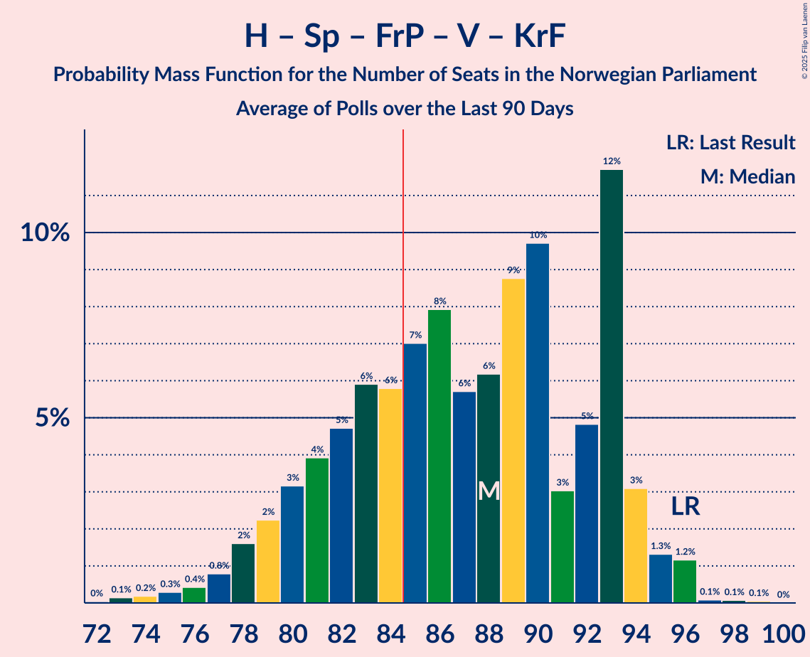

# Poll Average

<a href="#voting-intentions">Voting Intentions</a> | <a href="#seats">Seats</a> | <a href="#coalitions">Coalitions</a> | <a href="#technical-information">Technical Information</a>

## Summary

The table below lists the polls on which the average is based. They are the most recent polls (less than 90 days old) registered and analyzed so far.

| Period     | Polling firm/Commissioner(s) | Ap | H | Sp | FrP | SV | R | V | MDG | KrF | ND | Pp | K | INP | S | Hp | PF | Lib | FP | Kp |
|:----------:|:----------------------------:|:--:|:--:|:--:|:--:|:--:|:--:|:--:|:--:|:--:|:--:|:--:|:--:|:--:|:--:|:--:|:--:|:--:|:--:|:--:|
| 13 September 2021 | General Election | 26.2%   48 | 20.4%   36 | 13.5%   28 | 11.6%   21 | 7.6%   13 | 4.7%   8 | 4.6%   8 | 3.9%   3 | 3.8%   3 | 1.1%   0 | 0.6%   0 | 0.4%   0 | 0.3%   0 | 0.3%   0 | 0.2%   0 | 0.2%   1 | 0.2%   0 | 0.1%   0 | 0.0%   0 |
| N/A | Poll Average | 15–22%   30–41 | 18–25%   32–44 | 4–8%   1–13 | 22–29%   40–56 | 6–11%   9–19 | 4–8%   7–13 | 4–7%   3–12 | 2–5%   1–8 | 3–6%   1–9 | 0–1%   0 | 0–1%   0 | 0–1%   0 | 0–2%   0–2 | N/A   N/A | 0–1%   0 | N/A   N/A | N/A   N/A | N/A   N/A | N/A   N/A |
| [6 January 2025](2025-01-06-InFact.html) | InFact   Nettavisen | 18–23%   35–43 | 19–23%   33–43 | 5–8%   9–15 | 22–27%   41–50 | 6–9%   10–16 | 4–7%   8–13 | 3–6%   2–10 | 2–4%   1–8 | 2–4%   0–8 | 0–1%   0 | 0–1%   0 | 0–1%   0 | 1–2%   0–2 | N/A   N/A | 0–1%   0 | N/A   N/A | N/A   N/A | N/A   N/A | N/A   N/A |
| [10–14 December 2024](2024-12-14-Norstat.html) | Norstat   Aftenposten and NRK | 15–19%   29–38 | 18–23%   33–41 | 4–6%   1–10 | 25–30%   46–59 | 5–9%   8–14 | 5–9%   8–14 | 4–6%   3–10 | 3–5%   2–8 | 3–6%   2–9 | N/A   N/A | N/A   N/A | N/A   N/A | N/A   N/A | N/A   N/A | N/A   N/A | N/A   N/A | N/A   N/A | N/A   N/A | N/A   N/A |
| [4–9 December 2024](2024-12-09-ResponsAnalyse.html) | Respons Analyse   VG | 17–21%   32–40 | 18–23%   32–41 | 4–7%   6–12 | 21–27%   40–49 | 8–11%   12–20 | 5–8%   8–14 | 5–8%   8–13 | 2–4%   1–7 | 3–5%   1–8 | N/A   N/A | N/A   N/A | N/A   N/A | N/A   N/A | N/A   N/A | N/A   N/A | N/A   N/A | N/A   N/A | N/A   N/A | N/A   N/A |
| [3–9 December 2024](2024-12-09-OpinionPerduco.html) | Opinion Perduco   Avisens Nyhetsbyrå, Dagsavisen and FriFagbevegelse | 15–20%   31–38 | 18–23%   32–41 | 4–6%   0–11 | 23–28%   42–52 | 8–11%   12–20 | 4–7%   7–12 | 5–7%   7–13 | 2–4%   1–7 | 3–5%   2–9 | N/A   N/A | N/A   N/A | N/A   N/A | N/A   N/A | N/A   N/A | N/A   N/A | N/A   N/A | N/A   N/A | N/A   N/A | N/A   N/A |
| [3–4 December 2024](2024-12-04-Norfakta.html) | Norfakta   Klassekampen and Nationen | 16–21%   31–39 | 20–26%   35–47 | 4–7%   6–12 | 21–27%   39–50 | 7–11%   10–19 | 4–7%   1–12 | 3–6%   2–10 | 2–4%   1–6 | 3–6%   1–10 | N/A   N/A | N/A   N/A | N/A   N/A | 0–1%   0 | N/A   N/A | N/A   N/A | N/A   N/A | N/A   N/A | N/A   N/A | N/A   N/A |
| 13 September 2021 | General Election | 26.2%   48 | 20.4%   36 | 13.5%   28 | 11.6%   21 | 7.6%   13 | 4.7%   8 | 4.6%   8 | 3.9%   3 | 3.8%   3 | 1.1%   0 | 0.6%   0 | 0.4%   0 | 0.3%   0 | 0.3%   0 | 0.2%   0 | 0.2%   1 | 0.2%   0 | 0.1%   0 | 0.0%   0 |

Only polls for which at least the sample size has been published are included in the table above.

**Legend:**
+ **Top half of each row:** Voting intentions (95% confidence interval)
+ **Bottom half of each row:** Seat projections for the Norwegian Parliament (95% confidence interval)
+ **Ap:** Arbeiderpartiet
+ **H:** Høyre
+ **Sp:** Senterpartiet
+ **FrP:** Fremskrittspartiet
+ **SV:** Sosialistisk Venstreparti
+ **R:** Rødt
+ **V:** Venstre
+ **MDG:** Miljøpartiet De Grønne
+ **KrF:** Kristelig Folkeparti
+ **ND:** Norgesdemokratene
+ **Pp:** Pensjonistpartiet
+ **K:** Konservativt
+ **INP:** Industri- og Næringspartiet
+ **S:** Partiet Sentrum
+ **Hp:** Helsepartiet
+ **PF:** Pasientfokus
+ **Lib:** Liberalistene
+ **FP:** Folkets parti
+ **Kp:** Kystpartiet
+ **N/A (single party):** Party not included the published results
+ **N/A (entire row):** Calculation for this opinion poll not started yet

## Voting Intentions

### Confidence Intervals

| Party | Last Result | Median | 80% Confidence Interval | 90% Confidence Interval | 95% Confidence Interval | 99% Confidence Interval |
|:-----:|:-----------:|:------:|:-----------------------:|:-----------------------:|:-----------------------:|:-----------------------:|
| <a href="#arbeiderpartiet">Arbeiderpartiet</a> | 26.2% | 18.4% | 16.3–20.9% |15.7–21.6% | 15.3–22.1% | 14.5–23.1% |
| <a href="#høyre">Høyre</a> | 20.4% | 21.0% | 19.2–23.3% |18.7–24.0% | 18.3–24.7% | 17.5–25.9% |
| <a href="#senterpartiet">Senterpartiet</a> | 13.5% | 5.3% | 4.3–6.7% |4.0–7.1% | 3.8–7.5% | 3.4–8.1% |
| <a href="#fremskrittspartiet">Fremskrittspartiet</a> | 11.6% | 24.8% | 22.6–27.8% |22.0–28.6% | 21.6–29.3% | 20.7–30.5% |
| <a href="#sosialistisk-venstreparti">Sosialistisk Venstreparti</a> | 7.6% | 8.5% | 6.7–10.2% |6.3–10.6% | 6.0–11.0% | 5.5–11.7% |
| <a href="#rødt">Rødt</a> | 4.7% | 6.0% | 4.9–7.3% |4.6–7.7% | 4.3–8.0% | 3.9–8.6% |
| <a href="#venstre">Venstre</a> | 4.6% | 5.2% | 4.0–6.6% |3.8–6.9% | 3.6–7.2% | 3.2–7.9% |
| <a href="#miljøpartiet-de-grønne">Miljøpartiet De Grønne</a> | 3.9% | 3.2% | 2.4–4.2% |2.2–4.5% | 2.1–4.8% | 1.8–5.3% |
| <a href="#kristelig-folkeparti">Kristelig Folkeparti</a> | 3.8% | 3.9% | 3.0–4.9% |2.7–5.2% | 2.6–5.5% | 2.2–6.0% |
| <a href="#norgesdemokratene">Norgesdemokratene</a> | 1.1% | 0.3% | 0.2–0.6% |0.1–0.7% | 0.1–0.8% | 0.1–1.0% |
| <a href="#pensjonistpartiet">Pensjonistpartiet</a> | 0.6% | 0.2% | 0.1–0.5% |0.1–0.6% | 0.1–0.6% | 0.0–0.8% |
| <a href="#konservativt">Konservativt</a> | 0.4% | 0.8% | 0.5–1.1% |0.4–1.3% | 0.4–1.4% | 0.3–1.6% |
| <a href="#industri--og-næringspartiet">Industri- og Næringspartiet</a> | 0.3% | 1.0% | 0.3–1.9% |0.2–2.1% | 0.2–2.2% | 0.1–2.6% |
| <a href="#partiet-sentrum">Partiet Sentrum</a> | 0.3% | N/A | N/A |N/A | N/A | N/A |
| <a href="#helsepartiet">Helsepartiet</a> | 0.2% | 0.2% | 0.1–0.5% |0.1–0.6% | 0.1–0.6% | 0.0–0.8% |
| <a href="#pasientfokus">Pasientfokus</a> | 0.2% | N/A | N/A |N/A | N/A | N/A |
| <a href="#liberalistene">Liberalistene</a> | 0.2% | N/A | N/A |N/A | N/A | N/A |
| <a href="#folkets-parti">Folkets parti</a> | 0.1% | N/A | N/A |N/A | N/A | N/A |
| <a href="#kystpartiet">Kystpartiet</a> | 0.0% | N/A | N/A |N/A | N/A | N/A |

### Arbeiderpartiet

*For a full overview of the results for this party, see the [Arbeiderpartiet](party-arbeiderpartiet.html) page.*

| Voting Intentions | Probability | Accumulated | Special Marks |
|:-----------------:|:-----------:|:-----------:|:-------------:|
| 12.5–13.5% | 0% | 100% |  |
| 13.5–14.5% | 0.5% | 100% |  |
| 14.5–15.5% | 3% | 99.5% |  |
| 15.5–16.5% | 10% | 96% |  |
| 16.5–17.5% | 18% | 86% |  |
| 17.5–18.5% | 22% | 68% | Median |
| 18.5–19.5% | 19% | 46% |  |
| 19.5–20.5% | 14% | 27% |  |
| 20.5–21.5% | 9% | 14% |  |
| 21.5–22.5% | 4% | 5% |  |
| 22.5–23.5% | 1.1% | 1.3% |  |
| 23.5–24.5% | 0.2% | 0.2% |  |
| 24.5–25.5% | 0% | 0% |  |
| 25.5–26.5% | 0% | 0% | Last Result |

### Høyre

*For a full overview of the results for this party, see the [Høyre](party-høyre.html) page.*

| Voting Intentions | Probability | Accumulated | Special Marks |
|:-----------------:|:-----------:|:-----------:|:-------------:|
| 15.5–16.5% | 0% | 100% |  |
| 16.5–17.5% | 0.5% | 100% |  |
| 17.5–18.5% | 3% | 99.5% |  |
| 18.5–19.5% | 12% | 96% |  |
| 19.5–20.5% | 23% | 84% | Last Result |
| 20.5–21.5% | 26% | 62% | Median |
| 21.5–22.5% | 18% | 36% |  |
| 22.5–23.5% | 10% | 18% |  |
| 23.5–24.5% | 5% | 8% |  |
| 24.5–25.5% | 2% | 3% |  |
| 25.5–26.5% | 0.6% | 0.8% |  |
| 26.5–27.5% | 0.1% | 0.2% |  |
| 27.5–28.5% | 0% | 0% |  |

### Senterpartiet

*For a full overview of the results for this party, see the [Senterpartiet](party-senterpartiet.html) page.*

| Voting Intentions | Probability | Accumulated | Special Marks |
|:-----------------:|:-----------:|:-----------:|:-------------:|
| 1.5–2.5% | 0% | 100% |  |
| 2.5–3.5% | 0.8% | 100% |  |
| 3.5–4.5% | 17% | 99.2% |  |
| 4.5–5.5% | 40% | 82% | Median |
| 5.5–6.5% | 29% | 42% |  |
| 6.5–7.5% | 11% | 13% |  |
| 7.5–8.5% | 2% | 2% |  |
| 8.5–9.5% | 0.1% | 0.1% |  |
| 9.5–10.5% | 0% | 0% |  |
| 10.5–11.5% | 0% | 0% |  |
| 11.5–12.5% | 0% | 0% |  |
| 12.5–13.5% | 0% | 0% |  |
| 13.5–14.5% | 0% | 0% | Last Result |

### Fremskrittspartiet

*For a full overview of the results for this party, see the [Fremskrittspartiet](party-fremskrittspartiet.html) page.*

| Voting Intentions | Probability | Accumulated | Special Marks |
|:-----------------:|:-----------:|:-----------:|:-------------:|
| 11.5–12.5% | 0% | 100% | Last Result |
| 12.5–13.5% | 0% | 100% |  |
| 13.5–14.5% | 0% | 100% |  |
| 14.5–15.5% | 0% | 100% |  |
| 15.5–16.5% | 0% | 100% |  |
| 16.5–17.5% | 0% | 100% |  |
| 17.5–18.5% | 0% | 100% |  |
| 18.5–19.5% | 0% | 100% |  |
| 19.5–20.5% | 0.4% | 100% |  |
| 20.5–21.5% | 2% | 99.6% |  |
| 21.5–22.5% | 7% | 98% |  |
| 22.5–23.5% | 15% | 91% |  |
| 23.5–24.5% | 21% | 75% |  |
| 24.5–25.5% | 19% | 54% | Median |
| 25.5–26.5% | 14% | 35% |  |
| 26.5–27.5% | 9% | 21% |  |
| 27.5–28.5% | 6% | 12% |  |
| 28.5–29.5% | 4% | 5% |  |
| 29.5–30.5% | 1.4% | 2% |  |
| 30.5–31.5% | 0.4% | 0.4% |  |
| 31.5–32.5% | 0.1% | 0.1% |  |
| 32.5–33.5% | 0% | 0% |  |

### Sosialistisk Venstreparti

*For a full overview of the results for this party, see the [Sosialistisk Venstreparti](party-sosialistiskvenstreparti.html) page.*

| Voting Intentions | Probability | Accumulated | Special Marks |
|:-----------------:|:-----------:|:-----------:|:-------------:|
| 3.5–4.5% | 0% | 100% |  |
| 4.5–5.5% | 0.7% | 100% |  |
| 5.5–6.5% | 8% | 99.3% |  |
| 6.5–7.5% | 20% | 92% |  |
| 7.5–8.5% | 24% | 72% | Last Result, Median |
| 8.5–9.5% | 25% | 48% |  |
| 9.5–10.5% | 17% | 23% |  |
| 10.5–11.5% | 5% | 6% |  |
| 11.5–12.5% | 0.7% | 0.7% |  |
| 12.5–13.5% | 0% | 0% |  |
| 13.5–14.5% | 0% | 0% |  |

### Rødt

*For a full overview of the results for this party, see the [Rødt](party-rødt.html) page.*

| Voting Intentions | Probability | Accumulated | Special Marks |
|:-----------------:|:-----------:|:-----------:|:-------------:|
| 1.5–2.5% | 0% | 100% |  |
| 2.5–3.5% | 0.1% | 100% |  |
| 3.5–4.5% | 5% | 99.9% |  |
| 4.5–5.5% | 26% | 95% | Last Result |
| 5.5–6.5% | 40% | 69% | Median |
| 6.5–7.5% | 23% | 29% |  |
| 7.5–8.5% | 6% | 6% |  |
| 8.5–9.5% | 0.6% | 0.6% |  |
| 9.5–10.5% | 0% | 0% |  |

### Venstre

*For a full overview of the results for this party, see the [Venstre](party-venstre.html) page.*

| Voting Intentions | Probability | Accumulated | Special Marks |
|:-----------------:|:-----------:|:-----------:|:-------------:|
| 1.5–2.5% | 0% | 100% |  |
| 2.5–3.5% | 2% | 100% |  |
| 3.5–4.5% | 24% | 98% |  |
| 4.5–5.5% | 37% | 74% | Last Result, Median |
| 5.5–6.5% | 26% | 36% |  |
| 6.5–7.5% | 9% | 10% |  |
| 7.5–8.5% | 1.2% | 1.2% |  |
| 8.5–9.5% | 0.1% | 0.1% |  |
| 9.5–10.5% | 0% | 0% |  |

### Miljøpartiet De Grønne

*For a full overview of the results for this party, see the [Miljøpartiet De Grønne](party-miljøpartietdegrønne.html) page.*

| Voting Intentions | Probability | Accumulated | Special Marks |
|:-----------------:|:-----------:|:-----------:|:-------------:|
| 0.5–1.5% | 0.1% | 100% |  |
| 1.5–2.5% | 14% | 99.9% |  |
| 2.5–3.5% | 56% | 86% | Median |
| 3.5–4.5% | 26% | 30% | Last Result |
| 4.5–5.5% | 4% | 4% |  |
| 5.5–6.5% | 0.2% | 0.2% |  |
| 6.5–7.5% | 0% | 0% |  |

### Kristelig Folkeparti

*For a full overview of the results for this party, see the [Kristelig Folkeparti](party-kristeligfolkeparti.html) page.*

| Voting Intentions | Probability | Accumulated | Special Marks |
|:-----------------:|:-----------:|:-----------:|:-------------:|
| 0.5–1.5% | 0% | 100% |  |
| 1.5–2.5% | 2% | 100% |  |
| 2.5–3.5% | 31% | 98% |  |
| 3.5–4.5% | 47% | 66% | Last Result, Median |
| 4.5–5.5% | 18% | 20% |  |
| 5.5–6.5% | 2% | 2% |  |
| 6.5–7.5% | 0.1% | 0.1% |  |
| 7.5–8.5% | 0% | 0% |  |

### Norgesdemokratene

*For a full overview of the results for this party, see the [Norgesdemokratene](party-norgesdemokratene.html) page.*

| Voting Intentions | Probability | Accumulated | Special Marks |
|:-----------------:|:-----------:|:-----------:|:-------------:|
| 0.0–0.5% | 87% | 100% | Median |
| 0.5–1.5% | 13% | 13% | Last Result |
| 1.5–2.5% | 0% | 0% |  |

### Pensjonistpartiet

*For a full overview of the results for this party, see the [Pensjonistpartiet](party-pensjonistpartiet.html) page.*

| Voting Intentions | Probability | Accumulated | Special Marks |
|:-----------------:|:-----------:|:-----------:|:-------------:|
| 0.0–0.5% | 95% | 100% | Median |
| 0.5–1.5% | 5% | 5% | Last Result |
| 1.5–2.5% | 0% | 0% |  |

### Konservativt

*For a full overview of the results for this party, see the [Konservativt](party-konservativt.html) page.*

| Voting Intentions | Probability | Accumulated | Special Marks |
|:-----------------:|:-----------:|:-----------:|:-------------:|
| 0.0–0.5% | 18% | 100% | Last Result |
| 0.5–1.5% | 81% | 82% | Median |
| 1.5–2.5% | 0.8% | 0.8% |  |
| 2.5–3.5% | 0% | 0% |  |

### Industri- og Næringspartiet

*For a full overview of the results for this party, see the [Industri- og Næringspartiet](party-industri-ognæringspartiet.html) page.*

| Voting Intentions | Probability | Accumulated | Special Marks |
|:-----------------:|:-----------:|:-----------:|:-------------:|
| 0.0–0.5% | 32% | 100% | Last Result |
| 0.5–1.5% | 43% | 68% | Median |
| 1.5–2.5% | 24% | 25% |  |
| 2.5–3.5% | 0.5% | 0.5% |  |
| 3.5–4.5% | 0% | 0% |  |

### Helsepartiet

*For a full overview of the results for this party, see the [Helsepartiet](party-helsepartiet.html) page.*

| Voting Intentions | Probability | Accumulated | Special Marks |
|:-----------------:|:-----------:|:-----------:|:-------------:|
| 0.0–0.5% | 95% | 100% | Last Result, Median |
| 0.5–1.5% | 5% | 5% |  |
| 1.5–2.5% | 0% | 0% |  |

## Seats

### Confidence Intervals

| Party | Last Result | Median | 80% Confidence Interval | 90% Confidence Interval | 95% Confidence Interval | 99% Confidence Interval |
|:-----:|:-----------:|:------:|:-----------------------:|:-----------------------:|:-----------------------:|:-----------------------:|
| <a href="#arbeiderpartiet">Arbeiderpartiet</a> | 48 | 35 | 32–38 |31–39 | 30–41 | 28–43 |
| <a href="#høyre">Høyre</a> | 36 | 37 | 34–41 |33–42 | 32–44 | 31–47 |
| <a href="#senterpartiet">Senterpartiet</a> | 28 | 9 | 6–12 |5–13 | 1–13 | 0–15 |
| <a href="#fremskrittspartiet">Fremskrittspartiet</a> | 21 | 45 | 41–52 |41–54 | 40–56 | 38–59 |
| <a href="#sosialistisk-venstreparti">Sosialistisk Venstreparti</a> | 13 | 15 | 10–18 |9–19 | 9–19 | 8–20 |
| <a href="#rødt">Rødt</a> | 8 | 10 | 8–12 |7–13 | 7–13 | 1–15 |
| <a href="#venstre">Venstre</a> | 8 | 8 | 3–11 |3–12 | 3–12 | 2–13 |
| <a href="#miljøpartiet-de-grønne">Miljøpartiet De Grønne</a> | 3 | 2 | 1–6 |1–7 | 1–8 | 1–8 |
| <a href="#kristelig-folkeparti">Kristelig Folkeparti</a> | 3 | 3 | 2–8 |2–9 | 1–9 | 0–10 |
| <a href="#norgesdemokratene">Norgesdemokratene</a> | 0 | 0 | 0 |0 | 0 | 0 |
| <a href="#pensjonistpartiet">Pensjonistpartiet</a> | 0 | 0 | 0 |0 | 0 | 0 |
| <a href="#konservativt">Konservativt</a> | 0 | 0 | 0 |0 | 0 | 0 |
| <a href="#industri--og-næringspartiet">Industri- og Næringspartiet</a> | 0 | 0 | 0 |0–2 | 0–2 | 0–2 |
| <a href="#partiet-sentrum">Partiet Sentrum</a> | 0 | N/A | N/A |N/A | N/A | N/A |
| <a href="#helsepartiet">Helsepartiet</a> | 0 | 0 | 0 |0 | 0 | 0 |
| <a href="#pasientfokus">Pasientfokus</a> | 1 | N/A | N/A |N/A | N/A | N/A |
| <a href="#liberalistene">Liberalistene</a> | 0 | N/A | N/A |N/A | N/A | N/A |
| <a href="#folkets-parti">Folkets parti</a> | 0 | N/A | N/A |N/A | N/A | N/A |
| <a href="#kystpartiet">Kystpartiet</a> | 0 | N/A | N/A |N/A | N/A | N/A |

### Arbeiderpartiet

*For a full overview of the results for this party, see the [Arbeiderpartiet](party-arbeiderpartiet.html) page.*

| Number of Seats | Probability | Accumulated | Special Marks |
|:---------------:|:-----------:|:-----------:|:-------------:|
| 26 | 0.1% | 100% |  |
| 27 | 0.1% | 99.9% |  |
| 28 | 0.4% | 99.7% |  |
| 29 | 1.5% | 99.3% |  |
| 30 | 2% | 98% |  |
| 31 | 2% | 96% |  |
| 32 | 11% | 94% |  |
| 33 | 13% | 83% |  |
| 34 | 10% | 71% |  |
| 35 | 14% | 60% | Median |
| 36 | 12% | 47% |  |
| 37 | 11% | 34% |  |
| 38 | 15% | 23% |  |
| 39 | 4% | 8% |  |
| 40 | 1.1% | 4% |  |
| 41 | 2% | 3% |  |
| 42 | 0.3% | 1.0% |  |
| 43 | 0.2% | 0.6% |  |
| 44 | 0.2% | 0.5% |  |
| 45 | 0% | 0.3% |  |
| 46 | 0.1% | 0.2% |  |
| 47 | 0.1% | 0.1% |  |
| 48 | 0% | 0% | Last Result |

### Høyre

*For a full overview of the results for this party, see the [Høyre](party-høyre.html) page.*

| Number of Seats | Probability | Accumulated | Special Marks |
|:---------------:|:-----------:|:-----------:|:-------------:|
| 30 | 0.1% | 100% |  |
| 31 | 0.6% | 99.8% |  |
| 32 | 3% | 99.3% |  |
| 33 | 5% | 96% |  |
| 34 | 9% | 91% |  |
| 35 | 15% | 82% |  |
| 36 | 10% | 66% | Last Result |
| 37 | 10% | 56% | Median |
| 38 | 9% | 46% |  |
| 39 | 14% | 37% |  |
| 40 | 12% | 23% |  |
| 41 | 3% | 11% |  |
| 42 | 4% | 8% |  |
| 43 | 0.8% | 4% |  |
| 44 | 1.4% | 3% |  |
| 45 | 0.6% | 2% |  |
| 46 | 0.7% | 1.4% |  |
| 47 | 0.4% | 0.7% |  |
| 48 | 0.1% | 0.2% |  |
| 49 | 0.1% | 0.1% |  |
| 50 | 0% | 0% |  |

### Senterpartiet

*For a full overview of the results for this party, see the [Senterpartiet](party-senterpartiet.html) page.*

| Number of Seats | Probability | Accumulated | Special Marks |
|:---------------:|:-----------:|:-----------:|:-------------:|
| 0 | 1.5% | 100% |  |
| 1 | 3% | 98.5% |  |
| 2 | 0% | 95% |  |
| 3 | 0% | 95% |  |
| 4 | 0% | 95% |  |
| 5 | 0.6% | 95% |  |
| 6 | 7% | 95% |  |
| 7 | 14% | 88% |  |
| 8 | 18% | 74% |  |
| 9 | 20% | 56% | Median |
| 10 | 13% | 36% |  |
| 11 | 6% | 23% |  |
| 12 | 11% | 17% |  |
| 13 | 5% | 6% |  |
| 14 | 0.3% | 1.2% |  |
| 15 | 0.6% | 0.9% |  |
| 16 | 0.2% | 0.2% |  |
| 17 | 0% | 0% |  |
| 18 | 0% | 0% |  |
| 19 | 0% | 0% |  |
| 20 | 0% | 0% |  |
| 21 | 0% | 0% |  |
| 22 | 0% | 0% |  |
| 23 | 0% | 0% |  |
| 24 | 0% | 0% |  |
| 25 | 0% | 0% |  |
| 26 | 0% | 0% |  |
| 27 | 0% | 0% |  |
| 28 | 0% | 0% | Last Result |

### Fremskrittspartiet

*For a full overview of the results for this party, see the [Fremskrittspartiet](party-fremskrittspartiet.html) page.*

| Number of Seats | Probability | Accumulated | Special Marks |
|:---------------:|:-----------:|:-----------:|:-------------:|
| 21 | 0% | 100% | Last Result |
| 22 | 0% | 100% |  |
| 23 | 0% | 100% |  |
| 24 | 0% | 100% |  |
| 25 | 0% | 100% |  |
| 26 | 0% | 100% |  |
| 27 | 0% | 100% |  |
| 28 | 0% | 100% |  |
| 29 | 0% | 100% |  |
| 30 | 0% | 100% |  |
| 31 | 0% | 100% |  |
| 32 | 0% | 100% |  |
| 33 | 0% | 100% |  |
| 34 | 0% | 100% |  |
| 35 | 0% | 100% |  |
| 36 | 0.1% | 100% |  |
| 37 | 0.2% | 99.9% |  |
| 38 | 0.3% | 99.7% |  |
| 39 | 1.2% | 99.4% |  |
| 40 | 3% | 98% |  |
| 41 | 10% | 96% |  |
| 42 | 11% | 86% |  |
| 43 | 11% | 75% |  |
| 44 | 8% | 64% |  |
| 45 | 8% | 56% | Median |
| 46 | 9% | 47% |  |
| 47 | 6% | 39% |  |
| 48 | 9% | 32% |  |
| 49 | 5% | 23% |  |
| 50 | 3% | 18% |  |
| 51 | 3% | 15% |  |
| 52 | 3% | 12% |  |
| 53 | 3% | 9% |  |
| 54 | 2% | 6% |  |
| 55 | 0.9% | 4% |  |
| 56 | 1.0% | 3% |  |
| 57 | 0.9% | 2% |  |
| 58 | 0.5% | 1.2% |  |
| 59 | 0.3% | 0.7% |  |
| 60 | 0.2% | 0.3% |  |
| 61 | 0.1% | 0.1% |  |
| 62 | 0% | 0% |  |

### Sosialistisk Venstreparti

*For a full overview of the results for this party, see the [Sosialistisk Venstreparti](party-sosialistiskvenstreparti.html) page.*

| Number of Seats | Probability | Accumulated | Special Marks |
|:---------------:|:-----------:|:-----------:|:-------------:|
| 7 | 0.2% | 100% |  |
| 8 | 1.4% | 99.8% |  |
| 9 | 4% | 98% |  |
| 10 | 5% | 94% |  |
| 11 | 7% | 90% |  |
| 12 | 10% | 83% |  |
| 13 | 11% | 72% | Last Result |
| 14 | 10% | 61% |  |
| 15 | 19% | 52% | Median |
| 16 | 12% | 32% |  |
| 17 | 8% | 20% |  |
| 18 | 5% | 12% |  |
| 19 | 5% | 6% |  |
| 20 | 1.2% | 2% |  |
| 21 | 0.3% | 0.4% |  |
| 22 | 0.1% | 0.1% |  |
| 23 | 0% | 0% |  |

### Rødt

*For a full overview of the results for this party, see the [Rødt](party-rødt.html) page.*

| Number of Seats | Probability | Accumulated | Special Marks |
|:---------------:|:-----------:|:-----------:|:-------------:|
| 1 | 1.5% | 100% |  |
| 2 | 0% | 98.5% |  |
| 3 | 0% | 98% |  |
| 4 | 0% | 98% |  |
| 5 | 0.1% | 98% |  |
| 6 | 0.7% | 98% |  |
| 7 | 6% | 98% |  |
| 8 | 12% | 92% | Last Result |
| 9 | 21% | 80% |  |
| 10 | 19% | 59% | Median |
| 11 | 22% | 40% |  |
| 12 | 12% | 18% |  |
| 13 | 5% | 7% |  |
| 14 | 1.2% | 2% |  |
| 15 | 0.7% | 0.8% |  |
| 16 | 0.1% | 0.1% |  |
| 17 | 0% | 0% |  |

### Venstre

*For a full overview of the results for this party, see the [Venstre](party-venstre.html) page.*

| Number of Seats | Probability | Accumulated | Special Marks |
|:---------------:|:-----------:|:-----------:|:-------------:|
| 2 | 2% | 100% |  |
| 3 | 13% | 98% |  |
| 4 | 0% | 85% |  |
| 5 | 0.7% | 85% |  |
| 6 | 4% | 84% |  |
| 7 | 13% | 80% |  |
| 8 | 18% | 67% | Last Result, Median |
| 9 | 17% | 49% |  |
| 10 | 16% | 32% |  |
| 11 | 9% | 16% |  |
| 12 | 4% | 7% |  |
| 13 | 2% | 2% |  |
| 14 | 0.3% | 0.5% |  |
| 15 | 0.1% | 0.1% |  |
| 16 | 0% | 0% |  |

### Miljøpartiet De Grønne

*For a full overview of the results for this party, see the [Miljøpartiet De Grønne](party-miljøpartietdegrønne.html) page.*

| Number of Seats | Probability | Accumulated | Special Marks |
|:---------------:|:-----------:|:-----------:|:-------------:|
| 0 | 0.1% | 100% |  |
| 1 | 40% | 99.9% |  |
| 2 | 33% | 60% | Median |
| 3 | 14% | 27% | Last Result |
| 4 | 0% | 14% |  |
| 5 | 1.1% | 14% |  |
| 6 | 5% | 13% |  |
| 7 | 5% | 8% |  |
| 8 | 2% | 3% |  |
| 9 | 0.3% | 0.3% |  |
| 10 | 0% | 0% |  |

### Kristelig Folkeparti

*For a full overview of the results for this party, see the [Kristelig Folkeparti](party-kristeligfolkeparti.html) page.*

| Number of Seats | Probability | Accumulated | Special Marks |
|:---------------:|:-----------:|:-----------:|:-------------:|
| 0 | 1.0% | 100% |  |
| 1 | 3% | 99.0% |  |
| 2 | 22% | 96% |  |
| 3 | 25% | 73% | Last Result, Median |
| 4 | 0% | 48% |  |
| 5 | 0.4% | 48% |  |
| 6 | 8% | 48% |  |
| 7 | 24% | 39% |  |
| 8 | 10% | 15% |  |
| 9 | 5% | 6% |  |
| 10 | 0.6% | 0.8% |  |
| 11 | 0.2% | 0.2% |  |
| 12 | 0% | 0% |  |

### Norgesdemokratene

*For a full overview of the results for this party, see the [Norgesdemokratene](party-norgesdemokratene.html) page.*

| Number of Seats | Probability | Accumulated | Special Marks |
|:---------------:|:-----------:|:-----------:|:-------------:|
| 0 | 100% | 100% | Last Result, Median |

### Pensjonistpartiet

*For a full overview of the results for this party, see the [Pensjonistpartiet](party-pensjonistpartiet.html) page.*

| Number of Seats | Probability | Accumulated | Special Marks |
|:---------------:|:-----------:|:-----------:|:-------------:|
| 0 | 100% | 100% | Last Result, Median |

### Konservativt

*For a full overview of the results for this party, see the [Konservativt](party-konservativt.html) page.*

| Number of Seats | Probability | Accumulated | Special Marks |
|:---------------:|:-----------:|:-----------:|:-------------:|
| 0 | 100% | 100% | Last Result, Median |

### Industri- og Næringspartiet

*For a full overview of the results for this party, see the [Industri- og Næringspartiet](party-industri-ognæringspartiet.html) page.*

| Number of Seats | Probability | Accumulated | Special Marks |
|:---------------:|:-----------:|:-----------:|:-------------:|
| 0 | 92% | 100% | Last Result, Median |
| 1 | 0.1% | 8% |  |
| 2 | 7% | 7% |  |
| 3 | 0% | 0% |  |

### Partiet Sentrum

*For a full overview of the results for this party, see the [Partiet Sentrum](party-partietsentrum.html) page.*

### Helsepartiet

*For a full overview of the results for this party, see the [Helsepartiet](party-helsepartiet.html) page.*

| Number of Seats | Probability | Accumulated | Special Marks |
|:---------------:|:-----------:|:-----------:|:-------------:|
| 0 | 100% | 100% | Last Result, Median |

### Pasientfokus

*For a full overview of the results for this party, see the [Pasientfokus](party-pasientfokus.html) page.*

### Liberalistene

*For a full overview of the results for this party, see the [Liberalistene](party-liberalistene.html) page.*

### Folkets parti

*For a full overview of the results for this party, see the [Folkets parti](party-folketsparti.html) page.*

### Kystpartiet

*For a full overview of the results for this party, see the [Kystpartiet](party-kystpartiet.html) page.*

## Coalitions

### Confidence Intervals

| Coalition | Last Result | Median | Majority? | 80% Confidence Interval | 90% Confidence Interval | 95% Confidence Interval | 99% Confidence Interval |
|:---------:|:-----------:|:------:|:---------:|:-----------------------:|:-----------------------:|:-----------------------:|:-----------------------:|
| Høyre – Senterpartiet – Fremskrittspartiet – Venstre – Kristelig Folkeparti | 96 | 104 | 100% | 100–110 | 98–112 | 97–113 | 95–116 |
| Høyre – Fremskrittspartiet – Venstre – Miljøpartiet De Grønne – Kristelig Folkeparti | 71 | 98 | 100% | 92–106 | 91–108 | 90–110 | 88–114 |
| Høyre – Fremskrittspartiet – Venstre – Kristelig Folkeparti | 68 | 96 | 98.8% | 90–102 | 89–105 | 87–106 | 84–109 |
| Høyre – Fremskrittspartiet – Venstre | 65 | 91 | 90% | 85–97 | 84–99 | 84–101 | 81–103 |
| Høyre – Fremskrittspartiet | 57 | 83 | 35% | 78–89 | 76–91 | 75–93 | 73–96 |
| Arbeiderpartiet – Senterpartiet – Sosialistisk Venstreparti – Rødt – Miljøpartiet De Grønne | 100 | 71 | 0.1% | 63–77 | 61–79 | 59–80 | 56–84 |
| Arbeiderpartiet – Senterpartiet – Sosialistisk Venstreparti – Rødt | 97 | 69 | 0% | 60–76 | 57–76 | 56–77 | 53–79 |
| Arbeiderpartiet – Senterpartiet – Sosialistisk Venstreparti – Miljøpartiet De Grønne – Kristelig Folkeparti | 95 | 65 | 0% | 59–73 | 57–73 | 55–73 | 52–77 |
| Arbeiderpartiet – Sosialistisk Venstreparti – Rødt – Miljøpartiet De Grønne | 72 | 62 | 0% | 56–67 | 55–68 | 53–70 | 50–71 |
| Arbeiderpartiet – Senterpartiet – Sosialistisk Venstreparti – Miljøpartiet De Grønne | 92 | 61 | 0% | 54–66 | 52–67 | 50–69 | 47–74 |
| Arbeiderpartiet – Senterpartiet – Sosialistisk Venstreparti | 89 | 59 | 0% | 50–65 | 48–65 | 46–66 | 43–69 |
| Arbeiderpartiet – Senterpartiet – Miljøpartiet De Grønne – Kristelig Folkeparti | 82 | 51 | 0% | 46–58 | 44–58 | 43–59 | 39–63 |
| Høyre – Venstre – Kristelig Folkeparti | 47 | 50 | 0% | 46–55 | 44–57 | 43–59 | 41–62 |
| Arbeiderpartiet – Senterpartiet – Kristelig Folkeparti | 79 | 48 | 0% | 43–56 | 42–57 | 40–57 | 37–58 |
| Arbeiderpartiet – Sosialistisk Venstreparti | 61 | 50 | 0% | 44–54 | 42–55 | 40–56 | 38–58 |
| Arbeiderpartiet – Senterpartiet | 76 | 44 | 0% | 39–50 | 37–50 | 35–52 | 33–55 |
| Senterpartiet – Venstre – Kristelig Folkeparti | 39 | 22 | 0% | 17–26 | 16–27 | 14–28 | 12–29 |

### Høyre – Senterpartiet – Fremskrittspartiet – Venstre – Kristelig Folkeparti

| Number of Seats | Probability | Accumulated | Special Marks |
|:---------------:|:-----------:|:-----------:|:-------------:|
| 92 | 0% | 100% |  |
| 93 | 0.1% | 99.9% |  |
| 94 | 0.2% | 99.8% |  |
| 95 | 0.4% | 99.6% |  |
| 96 | 0.7% | 99.2% | Last Result |
| 97 | 2% | 98% |  |
| 98 | 2% | 96% |  |
| 99 | 4% | 94% |  |
| 100 | 3% | 91% |  |
| 101 | 6% | 87% |  |
| 102 | 6% | 81% | Median |
| 103 | 13% | 75% |  |
| 104 | 14% | 62% |  |
| 105 | 10% | 48% |  |
| 106 | 9% | 37% |  |
| 107 | 7% | 29% |  |
| 108 | 7% | 22% |  |
| 109 | 4% | 15% |  |
| 110 | 3% | 11% |  |
| 111 | 3% | 8% |  |
| 112 | 2% | 5% |  |
| 113 | 1.0% | 3% |  |
| 114 | 0.7% | 2% |  |
| 115 | 0.6% | 1.5% |  |
| 116 | 0.4% | 0.9% |  |
| 117 | 0.3% | 0.5% |  |
| 118 | 0.1% | 0.1% |  |
| 119 | 0% | 0% |  |

### Høyre – Fremskrittspartiet – Venstre – Miljøpartiet De Grønne – Kristelig Folkeparti

| Number of Seats | Probability | Accumulated | Special Marks |
|:---------------:|:-----------:|:-----------:|:-------------:|
| 71 | 0% | 100% | Last Result |
| 72 | 0% | 100% |  |
| 73 | 0% | 100% |  |
| 74 | 0% | 100% |  |
| 75 | 0% | 100% |  |
| 76 | 0% | 100% |  |
| 77 | 0% | 100% |  |
| 78 | 0% | 100% |  |
| 79 | 0% | 100% |  |
| 80 | 0% | 100% |  |
| 81 | 0% | 100% |  |
| 82 | 0% | 100% |  |
| 83 | 0% | 100% |  |
| 84 | 0% | 100% |  |
| 85 | 0.1% | 100% | Majority |
| 86 | 0.1% | 99.9% |  |
| 87 | 0.1% | 99.8% |  |
| 88 | 0.7% | 99.6% |  |
| 89 | 1.1% | 99.0% |  |
| 90 | 2% | 98% |  |
| 91 | 2% | 96% |  |
| 92 | 11% | 94% |  |
| 93 | 5% | 83% |  |
| 94 | 6% | 78% |  |
| 95 | 5% | 71% | Median |
| 96 | 9% | 67% |  |
| 97 | 7% | 58% |  |
| 98 | 8% | 51% |  |
| 99 | 6% | 43% |  |
| 100 | 5% | 37% |  |
| 101 | 5% | 32% |  |
| 102 | 4% | 27% |  |
| 103 | 4% | 23% |  |
| 104 | 4% | 18% |  |
| 105 | 3% | 15% |  |
| 106 | 2% | 11% |  |
| 107 | 2% | 9% |  |
| 108 | 2% | 7% |  |
| 109 | 1.2% | 5% |  |
| 110 | 1.3% | 4% |  |
| 111 | 0.9% | 2% |  |
| 112 | 0.6% | 2% |  |
| 113 | 0.4% | 0.9% |  |
| 114 | 0.3% | 0.5% |  |
| 115 | 0.1% | 0.2% |  |
| 116 | 0% | 0.1% |  |
| 117 | 0% | 0.1% |  |
| 118 | 0% | 0% |  |

### Høyre – Fremskrittspartiet – Venstre – Kristelig Folkeparti

| Number of Seats | Probability | Accumulated | Special Marks |
|:---------------:|:-----------:|:-----------:|:-------------:|
| 68 | 0% | 100% | Last Result |
| 69 | 0% | 100% |  |
| 70 | 0% | 100% |  |
| 71 | 0% | 100% |  |
| 72 | 0% | 100% |  |
| 73 | 0% | 100% |  |
| 74 | 0% | 100% |  |
| 75 | 0% | 100% |  |
| 76 | 0% | 100% |  |
| 77 | 0% | 100% |  |
| 78 | 0% | 100% |  |
| 79 | 0% | 100% |  |
| 80 | 0% | 100% |  |
| 81 | 0% | 100% |  |
| 82 | 0% | 100% |  |
| 83 | 0.1% | 100% |  |
| 84 | 1.1% | 99.9% |  |
| 85 | 0.2% | 98.8% | Majority |
| 86 | 0.4% | 98.6% |  |
| 87 | 1.0% | 98% |  |
| 88 | 2% | 97% |  |
| 89 | 3% | 96% |  |
| 90 | 3% | 92% |  |
| 91 | 10% | 90% |  |
| 92 | 6% | 80% |  |
| 93 | 7% | 74% | Median |
| 94 | 9% | 67% |  |
| 95 | 7% | 58% |  |
| 96 | 7% | 51% |  |
| 97 | 8% | 43% |  |
| 98 | 7% | 36% |  |
| 99 | 5% | 28% |  |
| 100 | 6% | 23% |  |
| 101 | 5% | 17% |  |
| 102 | 3% | 13% |  |
| 103 | 3% | 10% |  |
| 104 | 2% | 7% |  |
| 105 | 1.4% | 5% |  |
| 106 | 1.4% | 4% |  |
| 107 | 1.0% | 2% |  |
| 108 | 0.5% | 1.3% |  |
| 109 | 0.3% | 0.7% |  |
| 110 | 0.2% | 0.5% |  |
| 111 | 0.2% | 0.2% |  |
| 112 | 0% | 0.1% |  |
| 113 | 0% | 0% |  |

### Høyre – Fremskrittspartiet – Venstre

| Number of Seats | Probability | Accumulated | Special Marks |
|:---------------:|:-----------:|:-----------:|:-------------:|
| 65 | 0% | 100% | Last Result |
| 66 | 0% | 100% |  |
| 67 | 0% | 100% |  |
| 68 | 0% | 100% |  |
| 69 | 0% | 100% |  |
| 70 | 0% | 100% |  |
| 71 | 0% | 100% |  |
| 72 | 0% | 100% |  |
| 73 | 0% | 100% |  |
| 74 | 0% | 100% |  |
| 75 | 0% | 100% |  |
| 76 | 0% | 100% |  |
| 77 | 0% | 100% |  |
| 78 | 0% | 100% |  |
| 79 | 0% | 100% |  |
| 80 | 0.1% | 99.9% |  |
| 81 | 1.1% | 99.9% |  |
| 82 | 0.4% | 98.7% |  |
| 83 | 0.6% | 98% |  |
| 84 | 8% | 98% |  |
| 85 | 2% | 90% | Majority |
| 86 | 5% | 88% |  |
| 87 | 5% | 83% |  |
| 88 | 6% | 78% |  |
| 89 | 6% | 72% |  |
| 90 | 9% | 66% | Median |
| 91 | 7% | 57% |  |
| 92 | 12% | 50% |  |
| 93 | 9% | 38% |  |
| 94 | 7% | 29% |  |
| 95 | 6% | 22% |  |
| 96 | 4% | 16% |  |
| 97 | 4% | 12% |  |
| 98 | 2% | 8% |  |
| 99 | 2% | 6% |  |
| 100 | 1.2% | 4% |  |
| 101 | 1.2% | 3% |  |
| 102 | 0.6% | 2% |  |
| 103 | 0.5% | 0.9% |  |
| 104 | 0.3% | 0.5% |  |
| 105 | 0.1% | 0.2% |  |
| 106 | 0.1% | 0.1% |  |
| 107 | 0% | 0% |  |

### Høyre – Fremskrittspartiet

| Number of Seats | Probability | Accumulated | Special Marks |
|:---------------:|:-----------:|:-----------:|:-------------:|
| 57 | 0% | 100% | Last Result |
| 58 | 0% | 100% |  |
| 59 | 0% | 100% |  |
| 60 | 0% | 100% |  |
| 61 | 0% | 100% |  |
| 62 | 0% | 100% |  |
| 63 | 0% | 100% |  |
| 64 | 0% | 100% |  |
| 65 | 0% | 100% |  |
| 66 | 0% | 100% |  |
| 67 | 0% | 100% |  |
| 68 | 0% | 100% |  |
| 69 | 0% | 100% |  |
| 70 | 0% | 100% |  |
| 71 | 0% | 100% |  |
| 72 | 0.2% | 99.9% |  |
| 73 | 0.4% | 99.8% |  |
| 74 | 0.7% | 99.4% |  |
| 75 | 1.4% | 98.7% |  |
| 76 | 2% | 97% |  |
| 77 | 3% | 95% |  |
| 78 | 6% | 92% |  |
| 79 | 6% | 86% |  |
| 80 | 6% | 80% |  |
| 81 | 14% | 74% |  |
| 82 | 9% | 60% | Median |
| 83 | 11% | 51% |  |
| 84 | 6% | 40% |  |
| 85 | 7% | 35% | Majority |
| 86 | 6% | 28% |  |
| 87 | 6% | 22% |  |
| 88 | 5% | 17% |  |
| 89 | 3% | 12% |  |
| 90 | 3% | 9% |  |
| 91 | 1.3% | 6% |  |
| 92 | 1.3% | 5% |  |
| 93 | 1.3% | 3% |  |
| 94 | 0.9% | 2% |  |
| 95 | 0.5% | 1.2% |  |
| 96 | 0.4% | 0.7% |  |
| 97 | 0.1% | 0.3% |  |
| 98 | 0.1% | 0.2% |  |
| 99 | 0.1% | 0.1% |  |
| 100 | 0% | 0% |  |

### Arbeiderpartiet – Senterpartiet – Sosialistisk Venstreparti – Rødt – Miljøpartiet De Grønne

| Number of Seats | Probability | Accumulated | Special Marks |
|:---------------:|:-----------:|:-----------:|:-------------:|
| 54 | 0% | 100% |  |
| 55 | 0.2% | 99.9% |  |
| 56 | 0.3% | 99.7% |  |
| 57 | 0.3% | 99.4% |  |
| 58 | 0.7% | 99.1% |  |
| 59 | 0.9% | 98% |  |
| 60 | 1.3% | 97% |  |
| 61 | 2% | 96% |  |
| 62 | 3% | 94% |  |
| 63 | 3% | 92% |  |
| 64 | 4% | 89% |  |
| 65 | 4% | 85% |  |
| 66 | 5% | 81% |  |
| 67 | 5% | 77% |  |
| 68 | 6% | 71% |  |
| 69 | 7% | 66% |  |
| 70 | 6% | 59% |  |
| 71 | 7% | 53% | Median |
| 72 | 10% | 46% |  |
| 73 | 6% | 36% |  |
| 74 | 5% | 30% |  |
| 75 | 5% | 25% |  |
| 76 | 4% | 20% |  |
| 77 | 9% | 16% |  |
| 78 | 1.4% | 7% |  |
| 79 | 3% | 5% |  |
| 80 | 0.8% | 3% |  |
| 81 | 0.3% | 2% |  |
| 82 | 0.1% | 1.4% |  |
| 83 | 0.2% | 1.3% |  |
| 84 | 1.0% | 1.1% |  |
| 85 | 0% | 0.1% | Majority |
| 86 | 0% | 0% |  |
| 87 | 0% | 0% |  |
| 88 | 0% | 0% |  |
| 89 | 0% | 0% |  |
| 90 | 0% | 0% |  |
| 91 | 0% | 0% |  |
| 92 | 0% | 0% |  |
| 93 | 0% | 0% |  |
| 94 | 0% | 0% |  |
| 95 | 0% | 0% |  |
| 96 | 0% | 0% |  |
| 97 | 0% | 0% |  |
| 98 | 0% | 0% |  |
| 99 | 0% | 0% |  |
| 100 | 0% | 0% | Last Result |

### Arbeiderpartiet – Senterpartiet – Sosialistisk Venstreparti – Rødt

| Number of Seats | Probability | Accumulated | Special Marks |
|:---------------:|:-----------:|:-----------:|:-------------:|
| 50 | 0.1% | 100% |  |
| 51 | 0.1% | 99.8% |  |
| 52 | 0.2% | 99.8% |  |
| 53 | 0.4% | 99.6% |  |
| 54 | 0.5% | 99.2% |  |
| 55 | 1.1% | 98.7% |  |
| 56 | 1.3% | 98% |  |
| 57 | 1.4% | 96% |  |
| 58 | 2% | 95% |  |
| 59 | 2% | 93% |  |
| 60 | 3% | 91% |  |
| 61 | 3% | 88% |  |
| 62 | 4% | 85% |  |
| 63 | 5% | 81% |  |
| 64 | 4% | 77% |  |
| 65 | 5% | 72% |  |
| 66 | 5% | 68% |  |
| 67 | 6% | 63% |  |
| 68 | 6% | 57% |  |
| 69 | 5% | 52% | Median |
| 70 | 9% | 46% |  |
| 71 | 7% | 37% |  |
| 72 | 5% | 30% |  |
| 73 | 3% | 25% |  |
| 74 | 5% | 22% |  |
| 75 | 3% | 17% |  |
| 76 | 10% | 14% |  |
| 77 | 1.2% | 3% |  |
| 78 | 0.9% | 2% |  |
| 79 | 0.5% | 1.0% |  |
| 80 | 0.2% | 0.5% |  |
| 81 | 0.2% | 0.3% |  |
| 82 | 0.1% | 0.1% |  |
| 83 | 0% | 0% |  |
| 84 | 0% | 0% |  |
| 85 | 0% | 0% | Majority |
| 86 | 0% | 0% |  |
| 87 | 0% | 0% |  |
| 88 | 0% | 0% |  |
| 89 | 0% | 0% |  |
| 90 | 0% | 0% |  |
| 91 | 0% | 0% |  |
| 92 | 0% | 0% |  |
| 93 | 0% | 0% |  |
| 94 | 0% | 0% |  |
| 95 | 0% | 0% |  |
| 96 | 0% | 0% |  |
| 97 | 0% | 0% | Last Result |

### Arbeiderpartiet – Senterpartiet – Sosialistisk Venstreparti – Miljøpartiet De Grønne – Kristelig Folkeparti

| Number of Seats | Probability | Accumulated | Special Marks |
|:---------------:|:-----------:|:-----------:|:-------------:|
| 49 | 0% | 100% |  |
| 50 | 0% | 99.9% |  |
| 51 | 0.2% | 99.9% |  |
| 52 | 0.3% | 99.7% |  |
| 53 | 0.6% | 99.4% |  |
| 54 | 0.8% | 98.8% |  |
| 55 | 1.1% | 98% |  |
| 56 | 1.3% | 97% |  |
| 57 | 2% | 96% |  |
| 58 | 2% | 94% |  |
| 59 | 3% | 92% |  |
| 60 | 5% | 89% |  |
| 61 | 4% | 84% |  |
| 62 | 6% | 80% |  |
| 63 | 8% | 74% |  |
| 64 | 7% | 66% | Median |
| 65 | 13% | 59% |  |
| 66 | 7% | 46% |  |
| 67 | 6% | 39% |  |
| 68 | 7% | 32% |  |
| 69 | 5% | 25% |  |
| 70 | 6% | 20% |  |
| 71 | 2% | 15% |  |
| 72 | 2% | 13% |  |
| 73 | 8% | 10% |  |
| 74 | 0.8% | 2% |  |
| 75 | 0.2% | 2% |  |
| 76 | 0.2% | 1.4% |  |
| 77 | 1.1% | 1.2% |  |
| 78 | 0% | 0.1% |  |
| 79 | 0% | 0.1% |  |
| 80 | 0% | 0% |  |
| 81 | 0% | 0% |  |
| 82 | 0% | 0% |  |
| 83 | 0% | 0% |  |
| 84 | 0% | 0% |  |
| 85 | 0% | 0% | Majority |
| 86 | 0% | 0% |  |
| 87 | 0% | 0% |  |
| 88 | 0% | 0% |  |
| 89 | 0% | 0% |  |
| 90 | 0% | 0% |  |
| 91 | 0% | 0% |  |
| 92 | 0% | 0% |  |
| 93 | 0% | 0% |  |
| 94 | 0% | 0% |  |
| 95 | 0% | 0% | Last Result |

### Arbeiderpartiet – Sosialistisk Venstreparti – Rødt – Miljøpartiet De Grønne

| Number of Seats | Probability | Accumulated | Special Marks |
|:---------------:|:-----------:|:-----------:|:-------------:|
| 48 | 0% | 100% |  |
| 49 | 0.3% | 99.9% |  |
| 50 | 0.2% | 99.6% |  |
| 51 | 0.5% | 99.5% |  |
| 52 | 1.0% | 98.9% |  |
| 53 | 1.2% | 98% |  |
| 54 | 1.4% | 97% |  |
| 55 | 2% | 95% |  |
| 56 | 5% | 93% |  |
| 57 | 4% | 88% |  |
| 58 | 6% | 84% |  |
| 59 | 6% | 78% |  |
| 60 | 8% | 72% |  |
| 61 | 7% | 64% |  |
| 62 | 11% | 56% | Median |
| 63 | 10% | 46% |  |
| 64 | 9% | 36% |  |
| 65 | 11% | 27% |  |
| 66 | 4% | 15% |  |
| 67 | 5% | 11% |  |
| 68 | 2% | 6% |  |
| 69 | 1.4% | 4% |  |
| 70 | 0.9% | 3% |  |
| 71 | 1.3% | 2% |  |
| 72 | 0.3% | 0.5% | Last Result |
| 73 | 0.1% | 0.2% |  |
| 74 | 0% | 0.1% |  |
| 75 | 0% | 0% |  |

### Arbeiderpartiet – Senterpartiet – Sosialistisk Venstreparti – Miljøpartiet De Grønne

| Number of Seats | Probability | Accumulated | Special Marks |
|:---------------:|:-----------:|:-----------:|:-------------:|
| 44 | 0% | 100% |  |
| 45 | 0.1% | 99.9% |  |
| 46 | 0.1% | 99.8% |  |
| 47 | 0.4% | 99.7% |  |
| 48 | 0.5% | 99.3% |  |
| 49 | 1.2% | 98.8% |  |
| 50 | 1.0% | 98% |  |
| 51 | 1.4% | 97% |  |
| 52 | 2% | 95% |  |
| 53 | 2% | 94% |  |
| 54 | 3% | 91% |  |
| 55 | 4% | 88% |  |
| 56 | 5% | 84% |  |
| 57 | 6% | 79% |  |
| 58 | 4% | 73% |  |
| 59 | 6% | 69% |  |
| 60 | 9% | 63% |  |
| 61 | 8% | 54% | Median |
| 62 | 9% | 47% |  |
| 63 | 10% | 38% |  |
| 64 | 5% | 28% |  |
| 65 | 5% | 23% |  |
| 66 | 10% | 18% |  |
| 67 | 4% | 8% |  |
| 68 | 1.3% | 4% |  |
| 69 | 0.5% | 3% |  |
| 70 | 0.4% | 2% |  |
| 71 | 0.4% | 2% |  |
| 72 | 0.1% | 1.3% |  |
| 73 | 0.2% | 1.2% |  |
| 74 | 1.0% | 1.1% |  |
| 75 | 0% | 0% |  |
| 76 | 0% | 0% |  |
| 77 | 0% | 0% |  |
| 78 | 0% | 0% |  |
| 79 | 0% | 0% |  |
| 80 | 0% | 0% |  |
| 81 | 0% | 0% |  |
| 82 | 0% | 0% |  |
| 83 | 0% | 0% |  |
| 84 | 0% | 0% |  |
| 85 | 0% | 0% | Majority |
| 86 | 0% | 0% |  |
| 87 | 0% | 0% |  |
| 88 | 0% | 0% |  |
| 89 | 0% | 0% |  |
| 90 | 0% | 0% |  |
| 91 | 0% | 0% |  |
| 92 | 0% | 0% | Last Result |

### Arbeiderpartiet – Senterpartiet – Sosialistisk Venstreparti

| Number of Seats | Probability | Accumulated | Special Marks |
|:---------------:|:-----------:|:-----------:|:-------------:|
| 41 | 0.1% | 100% |  |
| 42 | 0.2% | 99.9% |  |
| 43 | 0.3% | 99.6% |  |
| 44 | 0.3% | 99.3% |  |
| 45 | 0.7% | 99.0% |  |
| 46 | 1.4% | 98% |  |
| 47 | 1.4% | 97% |  |
| 48 | 3% | 96% |  |
| 49 | 2% | 93% |  |
| 50 | 2% | 91% |  |
| 51 | 2% | 89% |  |
| 52 | 2% | 87% |  |
| 53 | 6% | 84% |  |
| 54 | 4% | 79% |  |
| 55 | 5% | 75% |  |
| 56 | 4% | 70% |  |
| 57 | 5% | 66% |  |
| 58 | 6% | 61% |  |
| 59 | 7% | 55% | Median |
| 60 | 9% | 48% |  |
| 61 | 10% | 39% |  |
| 62 | 5% | 29% |  |
| 63 | 5% | 24% |  |
| 64 | 5% | 19% |  |
| 65 | 10% | 14% |  |
| 66 | 3% | 4% |  |
| 67 | 1.0% | 2% |  |
| 68 | 0.3% | 0.9% |  |
| 69 | 0.3% | 0.6% |  |
| 70 | 0.1% | 0.3% |  |
| 71 | 0.2% | 0.2% |  |
| 72 | 0.1% | 0.1% |  |
| 73 | 0% | 0% |  |
| 74 | 0% | 0% |  |
| 75 | 0% | 0% |  |
| 76 | 0% | 0% |  |
| 77 | 0% | 0% |  |
| 78 | 0% | 0% |  |
| 79 | 0% | 0% |  |
| 80 | 0% | 0% |  |
| 81 | 0% | 0% |  |
| 82 | 0% | 0% |  |
| 83 | 0% | 0% |  |
| 84 | 0% | 0% |  |
| 85 | 0% | 0% | Majority |
| 86 | 0% | 0% |  |
| 87 | 0% | 0% |  |
| 88 | 0% | 0% |  |
| 89 | 0% | 0% | Last Result |

### Arbeiderpartiet – Senterpartiet – Miljøpartiet De Grønne – Kristelig Folkeparti

| Number of Seats | Probability | Accumulated | Special Marks |
|:---------------:|:-----------:|:-----------:|:-------------:|
| 36 | 0% | 100% |  |
| 37 | 0.1% | 99.9% |  |
| 38 | 0.2% | 99.9% |  |
| 39 | 0.2% | 99.7% |  |
| 40 | 0.5% | 99.5% |  |
| 41 | 0.5% | 98.9% |  |
| 42 | 0.6% | 98% |  |
| 43 | 2% | 98% |  |
| 44 | 2% | 96% |  |
| 45 | 2% | 94% |  |
| 46 | 6% | 92% |  |
| 47 | 6% | 87% |  |
| 48 | 9% | 81% |  |
| 49 | 8% | 71% | Median |
| 50 | 9% | 64% |  |
| 51 | 9% | 54% |  |
| 52 | 11% | 45% |  |
| 53 | 7% | 35% |  |
| 54 | 7% | 27% |  |
| 55 | 5% | 21% |  |
| 56 | 3% | 16% |  |
| 57 | 2% | 13% |  |
| 58 | 8% | 11% |  |
| 59 | 0.7% | 3% |  |
| 60 | 0.5% | 2% |  |
| 61 | 0.3% | 2% |  |
| 62 | 0.1% | 1.2% |  |
| 63 | 1.0% | 1.1% |  |
| 64 | 0% | 0.1% |  |
| 65 | 0% | 0% |  |
| 66 | 0% | 0% |  |
| 67 | 0% | 0% |  |
| 68 | 0% | 0% |  |
| 69 | 0% | 0% |  |
| 70 | 0% | 0% |  |
| 71 | 0% | 0% |  |
| 72 | 0% | 0% |  |
| 73 | 0% | 0% |  |
| 74 | 0% | 0% |  |
| 75 | 0% | 0% |  |
| 76 | 0% | 0% |  |
| 77 | 0% | 0% |  |
| 78 | 0% | 0% |  |
| 79 | 0% | 0% |  |
| 80 | 0% | 0% |  |
| 81 | 0% | 0% |  |
| 82 | 0% | 0% | Last Result |

### Høyre – Venstre – Kristelig Folkeparti

| Number of Seats | Probability | Accumulated | Special Marks |
|:---------------:|:-----------:|:-----------:|:-------------:|
| 38 | 0% | 100% |  |
| 39 | 0% | 99.9% |  |
| 40 | 0.1% | 99.9% |  |
| 41 | 1.1% | 99.8% |  |
| 42 | 0.5% | 98.7% |  |
| 43 | 1.5% | 98% |  |
| 44 | 2% | 97% |  |
| 45 | 4% | 95% |  |
| 46 | 10% | 91% |  |
| 47 | 7% | 81% | Last Result |
| 48 | 7% | 74% | Median |
| 49 | 8% | 67% |  |
| 50 | 17% | 59% |  |
| 51 | 10% | 41% |  |
| 52 | 8% | 31% |  |
| 53 | 6% | 24% |  |
| 54 | 7% | 18% |  |
| 55 | 3% | 11% |  |
| 56 | 3% | 8% |  |
| 57 | 2% | 5% |  |
| 58 | 0.7% | 3% |  |
| 59 | 2% | 3% |  |
| 60 | 0.5% | 1.1% |  |
| 61 | 0.1% | 0.7% |  |
| 62 | 0.1% | 0.6% |  |
| 63 | 0.4% | 0.5% |  |
| 64 | 0% | 0.1% |  |
| 65 | 0% | 0% |  |

### Arbeiderpartiet – Senterpartiet – Kristelig Folkeparti

| Number of Seats | Probability | Accumulated | Special Marks |
|:---------------:|:-----------:|:-----------:|:-------------:|
| 33 | 0% | 100% |  |
| 34 | 0% | 99.9% |  |
| 35 | 0.1% | 99.9% |  |
| 36 | 0.3% | 99.8% |  |
| 37 | 0.3% | 99.6% |  |
| 38 | 0.6% | 99.2% |  |
| 39 | 0.6% | 98.6% |  |
| 40 | 1.2% | 98% |  |
| 41 | 2% | 97% |  |
| 42 | 2% | 95% |  |
| 43 | 4% | 93% |  |
| 44 | 6% | 89% |  |
| 45 | 8% | 83% |  |
| 46 | 7% | 76% |  |
| 47 | 10% | 69% | Median |
| 48 | 9% | 59% |  |
| 49 | 9% | 50% |  |
| 50 | 9% | 41% |  |
| 51 | 6% | 32% |  |
| 52 | 5% | 25% |  |
| 53 | 5% | 20% |  |
| 54 | 3% | 16% |  |
| 55 | 3% | 13% |  |
| 56 | 2% | 10% |  |
| 57 | 7% | 8% |  |
| 58 | 0.3% | 0.7% |  |
| 59 | 0.1% | 0.3% |  |
| 60 | 0.1% | 0.2% |  |
| 61 | 0.1% | 0.1% |  |
| 62 | 0% | 0.1% |  |
| 63 | 0% | 0% |  |
| 64 | 0% | 0% |  |
| 65 | 0% | 0% |  |
| 66 | 0% | 0% |  |
| 67 | 0% | 0% |  |
| 68 | 0% | 0% |  |
| 69 | 0% | 0% |  |
| 70 | 0% | 0% |  |
| 71 | 0% | 0% |  |
| 72 | 0% | 0% |  |
| 73 | 0% | 0% |  |
| 74 | 0% | 0% |  |
| 75 | 0% | 0% |  |
| 76 | 0% | 0% |  |
| 77 | 0% | 0% |  |
| 78 | 0% | 0% |  |
| 79 | 0% | 0% | Last Result |

### Arbeiderpartiet – Sosialistisk Venstreparti

| Number of Seats | Probability | Accumulated | Special Marks |
|:---------------:|:-----------:|:-----------:|:-------------:|
| 36 | 0.1% | 100% |  |
| 37 | 0.2% | 99.9% |  |
| 38 | 0.2% | 99.7% |  |
| 39 | 0.9% | 99.4% |  |
| 40 | 1.4% | 98.5% |  |
| 41 | 2% | 97% |  |
| 42 | 3% | 95% |  |
| 43 | 2% | 92% |  |
| 44 | 3% | 90% |  |
| 45 | 4% | 88% |  |
| 46 | 6% | 84% |  |
| 47 | 6% | 78% |  |
| 48 | 7% | 72% |  |
| 49 | 8% | 65% |  |
| 50 | 9% | 57% | Median |
| 51 | 15% | 48% |  |
| 52 | 9% | 33% |  |
| 53 | 14% | 25% |  |
| 54 | 4% | 10% |  |
| 55 | 4% | 7% |  |
| 56 | 1.5% | 3% |  |
| 57 | 0.7% | 1.3% |  |
| 58 | 0.3% | 0.6% |  |
| 59 | 0.1% | 0.4% |  |
| 60 | 0.2% | 0.2% |  |
| 61 | 0.1% | 0.1% | Last Result |
| 62 | 0% | 0% |  |

### Arbeiderpartiet – Senterpartiet

| Number of Seats | Probability | Accumulated | Special Marks |
|:---------------:|:-----------:|:-----------:|:-------------:|
| 29 | 0% | 100% |  |
| 30 | 0.1% | 99.9% |  |
| 31 | 0.1% | 99.8% |  |
| 32 | 0.2% | 99.7% |  |
| 33 | 0.5% | 99.5% |  |
| 34 | 0.8% | 99.0% |  |
| 35 | 1.2% | 98% |  |
| 36 | 1.5% | 97% |  |
| 37 | 2% | 96% |  |
| 38 | 2% | 93% |  |
| 39 | 4% | 91% |  |
| 40 | 6% | 87% |  |
| 41 | 10% | 81% |  |
| 42 | 10% | 71% |  |
| 43 | 8% | 62% |  |
| 44 | 9% | 53% | Median |
| 45 | 9% | 45% |  |
| 46 | 9% | 35% |  |
| 47 | 4% | 27% |  |
| 48 | 8% | 23% |  |
| 49 | 1.5% | 15% |  |
| 50 | 9% | 14% |  |
| 51 | 1.2% | 5% |  |
| 52 | 2% | 3% |  |
| 53 | 0.2% | 1.5% |  |
| 54 | 0.7% | 1.3% |  |
| 55 | 0.2% | 0.6% |  |
| 56 | 0.2% | 0.4% |  |
| 57 | 0.2% | 0.2% |  |
| 58 | 0% | 0.1% |  |
| 59 | 0% | 0% |  |
| 60 | 0% | 0% |  |
| 61 | 0% | 0% |  |
| 62 | 0% | 0% |  |
| 63 | 0% | 0% |  |
| 64 | 0% | 0% |  |
| 65 | 0% | 0% |  |
| 66 | 0% | 0% |  |
| 67 | 0% | 0% |  |
| 68 | 0% | 0% |  |
| 69 | 0% | 0% |  |
| 70 | 0% | 0% |  |
| 71 | 0% | 0% |  |
| 72 | 0% | 0% |  |
| 73 | 0% | 0% |  |
| 74 | 0% | 0% |  |
| 75 | 0% | 0% |  |
| 76 | 0% | 0% | Last Result |

### Senterpartiet – Venstre – Kristelig Folkeparti

| Number of Seats | Probability | Accumulated | Special Marks |
|:---------------:|:-----------:|:-----------:|:-------------:|
| 10 | 0.1% | 100% |  |
| 11 | 0.3% | 99.9% |  |
| 12 | 0.7% | 99.6% |  |
| 13 | 0.6% | 98.8% |  |
| 14 | 1.0% | 98% |  |
| 15 | 2% | 97% |  |
| 16 | 3% | 96% |  |
| 17 | 3% | 93% |  |
| 18 | 8% | 89% |  |
| 19 | 7% | 81% |  |
| 20 | 8% | 75% | Median |
| 21 | 13% | 67% |  |
| 22 | 18% | 53% |  |
| 23 | 8% | 36% |  |
| 24 | 8% | 27% |  |
| 25 | 7% | 19% |  |
| 26 | 5% | 12% |  |
| 27 | 4% | 7% |  |
| 28 | 2% | 3% |  |
| 29 | 0.9% | 1.3% |  |
| 30 | 0.2% | 0.4% |  |
| 31 | 0.2% | 0.2% |  |
| 32 | 0% | 0% |  |
| 33 | 0% | 0% |  |
| 34 | 0% | 0% |  |
| 35 | 0% | 0% |  |
| 36 | 0% | 0% |  |
| 37 | 0% | 0% |  |
| 38 | 0% | 0% |  |
| 39 | 0% | 0% | Last Result |

## Technical Information

+ **Number of polls included in this average:** 5
+ **Lowest number of simulations done in a poll included in this average:** 2,097,152
+ **Total number of simulations done in the polls included in this average:** 10,485,760
+ **Error estimate:** 2.91%
