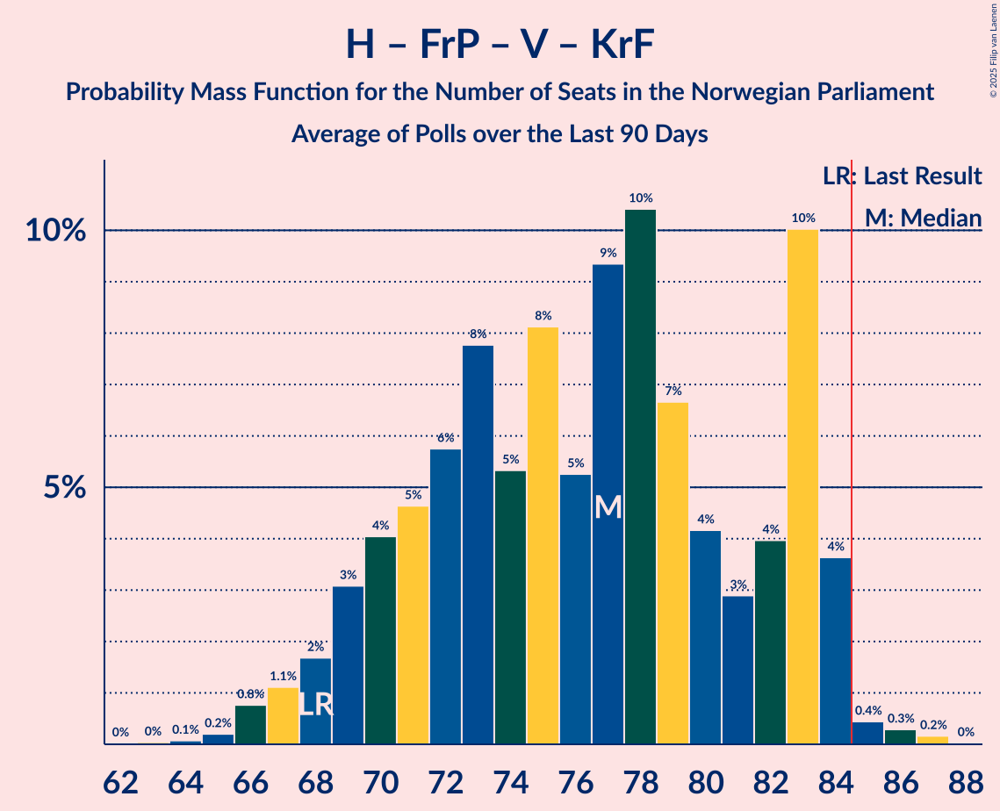

# Poll Average

<a href="#voting-intentions">Voting Intentions</a> | <a href="#seats">Seats</a> | <a href="#coalitions">Coalitions</a> | <a href="#technical-information">Technical Information</a>

## Summary

The table below lists the polls on which the average is based. They are the most recent polls (less than 90 days old) registered and analyzed so far.

| Period     | Polling firm/Commissioner(s) | Ap | H | FrP | Sp | SV | V | KrF | MDG | R |
|:----------:|:----------------------------:|:--:|:--:|:--:|:--:|:--:|:--:|:--:|:--:|:--:|
| 8–9 September 2013 | General Election | 27.4%   49 | 25.0%   45 | 15.2%   27 | 10.3%   19 | 6.0%   11 | 4.4%   8 | 4.2%   8 | 3.2%   1 | 2.4%   1 |
| N/A | Poll Average | 18–24%   32–44 | 18–28%   33–50 | 8–14%   13–27 | 16–24%   29–44 | 6–10%   10–17 | 2–6%   1–10 | 2–5%   0–9 | 3–6%   2–11 | 3–7%   1–13 |
| [1–2 December 2020](2020-12-02-Norfakta.html) | Norfakta   Klassekampen and Nationen | 18–24%   33–44 | 20–26%   36–48 | 10–15%   19–27 | 17–23%   32–43 | 6–9%   10–17 | 2–4%   1–8 | 2–4%   0–3 | 3–6%   2–11 | 3–6%   2–10 |
| [25–30 November 2020](2020-11-30-ResponsAnalyse.html) | Respons Analyse   VG | 18–23%   32–42 | 20–26%   35–46 | 9–13%   15–23 | 18–23%   33–44 | 7–10%   11–18 | 3–6%   2–9 | 3–5%   1–9 | 3–6%   2–10 | 3–5%   1–9 |
| [24–30 November 2020](2020-11-30-KantarTNS.html) | Kantar TNS   TV2 | 18–23%   31–43 | 18–23%   31–42 | 7–11%   12–19 | 19–25%   36–46 | 6–10%   11–18 | 3–6%   2–10 | 2–5%   1–8 | 3–6%   1–10 | 5–8%   8–15 |
| [24–29 November 2020](2020-11-29-Sentio.html) | Sentio   Amedia and Nettavisen | 20–25%   37–46 | 24–29%   42–54 | 7–11%   13–20 | 16–21%   29–38 | 6–9%   10–16 | 2–4%   1–7 | 2–5%   1–8 | 3–5%   1–9 | 3–5%   2–10 |
| [16–18 November 2020](2020-11-18-IpsosMMI.html) | Ipsos MMI   Dagbladet | 19–25%   34–45 | 18–24%   31–43 | 10–15%   16–26 | 16–22%   29–41 | 6–10%   9–17 | 3–6%   2–11 | 2–5%   1–9 | 4–7%   3–13 | 2–5%   1–8 |
| [9–15 November 2020](2020-11-15-Norstat.html) | Norstat   Aftenposten and NRK | 18–24%   34–44 | 19–25%   34–46 | 11–15%   18–28 | 17–22%   31–42 | 6–9%   10–17 | 2–4%   1–8 | 2–4%   0–8 | 3–6%   2–10 | 3–5%   2–10 |
| [3–9 November 2020](2020-11-09-OpinionPerduco.html) | Opinion Perduco   Avisenes Nyhetsbyrå, Dagsavisen and FriFagbevegelse | 18–23%   31–43 | 22–27%   38–49 | 9–13%   15–23 | 15–20%   27–37 | 6–10%   11–17 | 2–5%   2–8 | 3–6%   1–9 | 4–7%   2–11 | 3–6%   2–10 |
| 8–9 September 2013 | General Election | 27.4%   49 | 25.0%   45 | 15.2%   27 | 10.3%   19 | 6.0%   11 | 4.4%   8 | 4.2%   8 | 3.2%   1 | 2.4%   1 |

Only polls for which at least the sample size has been published are included in the table above.

**Legend:**
+ **Top half of each row:** Voting intentions (95% confidence interval)
+ **Bottom half of each row:** Seat projections for the Norwegian Parliament (95% confidence interval)
+ **Ap:** Arbeiderpartiet
+ **H:** Høyre
+ **FrP:** Fremskrittspartiet
+ **Sp:** Senterpartiet
+ **SV:** Sosialistisk Venstreparti
+ **V:** Venstre
+ **KrF:** Kristelig Folkeparti
+ **MDG:** Miljøpartiet De Grønne
+ **R:** Rødt
+ **N/A (single party):** Party not included the published results
+ **N/A (entire row):** Calculation for this opinion poll not started yet

## Voting Intentions

### Confidence Intervals

| Party | Last Result | Median | 80% Confidence Interval | 90% Confidence Interval | 95% Confidence Interval | 99% Confidence Interval |
|:-----:|:-----------:|:------:|:-----------------------:|:-----------------------:|:-----------------------:|:-----------------------:|
| <a href="#arbeiderpartiet">Arbeiderpartiet</a> | 27.4% | 21.0% | 19.1–23.1% |18.6–23.7% | 18.2–24.2% | 17.4–25.2% |
| <a href="#høyre">Høyre</a> | 25.0% | 22.7% | 19.7–26.3% |19.0–27.2% | 18.4–27.9% | 17.4–29.1% |
| <a href="#fremskrittspartiet">Fremskrittspartiet</a> | 15.2% | 11.1% | 8.5–13.3% |8.0–13.8% | 7.6–14.3% | 7.0–15.2% |
| <a href="#senterpartiet">Senterpartiet</a> | 10.3% | 19.5% | 17.2–22.2% |16.7–23.0% | 16.2–23.6% | 15.4–24.9% |
| <a href="#sosialistisk-venstreparti">Sosialistisk Venstreparti</a> | 6.0% | 7.7% | 6.4–9.0% |6.1–9.4% | 5.9–9.7% | 5.4–10.4% |
| <a href="#venstre">Venstre</a> | 4.4% | 3.6% | 2.6–4.9% |2.4–5.3% | 2.2–5.6% | 1.9–6.3% |
| <a href="#kristelig-folkeparti">Kristelig Folkeparti</a> | 4.2% | 3.4% | 2.5–4.5% |2.3–4.9% | 2.1–5.1% | 1.7–5.7% |
| <a href="#miljøpartiet-de-grønne">Miljøpartiet De Grønne</a> | 3.2% | 4.5% | 3.5–5.7% |3.3–6.1% | 3.1–6.4% | 2.8–7.1% |
| <a href="#rødt">Rødt</a> | 2.4% | 4.1% | 3.1–6.1% |2.8–6.8% | 2.6–7.3% | 2.2–8.2% |

### Arbeiderpartiet

*For a full overview of the results for this party, see the [Arbeiderpartiet](party-arbeiderpartiet.html) page.*

| Voting Intentions | Probability | Accumulated | Special Marks |
|:-----------------:|:-----------:|:-----------:|:-------------:|
| 14.5–15.5% | 0% | 100% |  |
| 15.5–16.5% | 0.1% | 100% |  |
| 16.5–17.5% | 0.7% | 99.9% |  |
| 17.5–18.5% | 4% | 99.2% |  |
| 18.5–19.5% | 12% | 95% |  |
| 19.5–20.5% | 22% | 83% |  |
| 20.5–21.5% | 25% | 61% | Median |
| 21.5–22.5% | 19% | 36% |  |
| 22.5–23.5% | 11% | 17% |  |
| 23.5–24.5% | 4% | 6% |  |
| 24.5–25.5% | 1.3% | 2% |  |
| 25.5–26.5% | 0.3% | 0.3% |  |
| 26.5–27.5% | 0% | 0% | Last Result |

### Høyre

*For a full overview of the results for this party, see the [Høyre](party-høyre.html) page.*

| Voting Intentions | Probability | Accumulated | Special Marks |
|:-----------------:|:-----------:|:-----------:|:-------------:|
| 14.5–15.5% | 0% | 100% |  |
| 15.5–16.5% | 0.1% | 100% |  |
| 16.5–17.5% | 0.6% | 99.9% |  |
| 17.5–18.5% | 2% | 99.3% |  |
| 18.5–19.5% | 6% | 97% |  |
| 19.5–20.5% | 10% | 91% |  |
| 20.5–21.5% | 13% | 81% |  |
| 21.5–22.5% | 16% | 68% |  |
| 22.5–23.5% | 15% | 52% | Median |
| 23.5–24.5% | 12% | 37% |  |
| 24.5–25.5% | 9% | 25% | Last Result |
| 25.5–26.5% | 7% | 16% |  |
| 26.5–27.5% | 5% | 8% |  |
| 27.5–28.5% | 2% | 4% |  |
| 28.5–29.5% | 0.9% | 1.1% |  |
| 29.5–30.5% | 0.2% | 0.2% |  |
| 30.5–31.5% | 0% | 0% |  |

### Fremskrittspartiet

*For a full overview of the results for this party, see the [Fremskrittspartiet](party-fremskrittspartiet.html) page.*

| Voting Intentions | Probability | Accumulated | Special Marks |
|:-----------------:|:-----------:|:-----------:|:-------------:|
| 4.5–5.5% | 0% | 100% |  |
| 5.5–6.5% | 0.1% | 100% |  |
| 6.5–7.5% | 2% | 99.9% |  |
| 7.5–8.5% | 9% | 98% |  |
| 8.5–9.5% | 13% | 89% |  |
| 9.5–10.5% | 15% | 76% |  |
| 10.5–11.5% | 20% | 61% | Median |
| 11.5–12.5% | 20% | 41% |  |
| 12.5–13.5% | 14% | 21% |  |
| 13.5–14.5% | 6% | 7% |  |
| 14.5–15.5% | 1.4% | 2% | Last Result |
| 15.5–16.5% | 0.2% | 0.2% |  |
| 16.5–17.5% | 0% | 0% |  |

### Senterpartiet

*For a full overview of the results for this party, see the [Senterpartiet](party-senterpartiet.html) page.*

| Voting Intentions | Probability | Accumulated | Special Marks |
|:-----------------:|:-----------:|:-----------:|:-------------:|
| 9.5–10.5% | 0% | 100% | Last Result |
| 10.5–11.5% | 0% | 100% |  |
| 11.5–12.5% | 0% | 100% |  |
| 12.5–13.5% | 0% | 100% |  |
| 13.5–14.5% | 0.1% | 100% |  |
| 14.5–15.5% | 0.6% | 99.9% |  |
| 15.5–16.5% | 3% | 99.3% |  |
| 16.5–17.5% | 10% | 96% |  |
| 17.5–18.5% | 17% | 86% |  |
| 18.5–19.5% | 20% | 69% |  |
| 19.5–20.5% | 19% | 49% | Median |
| 20.5–21.5% | 14% | 30% |  |
| 21.5–22.5% | 9% | 16% |  |
| 22.5–23.5% | 5% | 7% |  |
| 23.5–24.5% | 2% | 3% |  |
| 24.5–25.5% | 0.6% | 0.8% |  |
| 25.5–26.5% | 0.2% | 0.2% |  |
| 26.5–27.5% | 0% | 0% |  |

### Sosialistisk Venstreparti

*For a full overview of the results for this party, see the [Sosialistisk Venstreparti](party-sosialistiskvenstreparti.html) page.*

| Voting Intentions | Probability | Accumulated | Special Marks |
|:-----------------:|:-----------:|:-----------:|:-------------:|
| 3.5–4.5% | 0% | 100% |  |
| 4.5–5.5% | 1.0% | 100% |  |
| 5.5–6.5% | 11% | 99.0% | Last Result |
| 6.5–7.5% | 33% | 88% |  |
| 7.5–8.5% | 35% | 55% | Median |
| 8.5–9.5% | 16% | 19% |  |
| 9.5–10.5% | 3% | 4% |  |
| 10.5–11.5% | 0.3% | 0.3% |  |
| 11.5–12.5% | 0% | 0% |  |

### Venstre

*For a full overview of the results for this party, see the [Venstre](party-venstre.html) page.*

| Voting Intentions | Probability | Accumulated | Special Marks |
|:-----------------:|:-----------:|:-----------:|:-------------:|
| 0.5–1.5% | 0.1% | 100% |  |
| 1.5–2.5% | 9% | 99.9% |  |
| 2.5–3.5% | 40% | 91% |  |
| 3.5–4.5% | 34% | 51% | Last Result, Median |
| 4.5–5.5% | 14% | 16% |  |
| 5.5–6.5% | 3% | 3% |  |
| 6.5–7.5% | 0.2% | 0.2% |  |
| 7.5–8.5% | 0% | 0% |  |

### Kristelig Folkeparti

*For a full overview of the results for this party, see the [Kristelig Folkeparti](party-kristeligfolkeparti.html) page.*

| Voting Intentions | Probability | Accumulated | Special Marks |
|:-----------------:|:-----------:|:-----------:|:-------------:|
| 0.0–0.5% | 0% | 100% |  |
| 0.5–1.5% | 0.2% | 100% |  |
| 1.5–2.5% | 11% | 99.8% |  |
| 2.5–3.5% | 44% | 89% | Median |
| 3.5–4.5% | 35% | 45% | Last Result |
| 4.5–5.5% | 9% | 9% |  |
| 5.5–6.5% | 0.7% | 0.8% |  |
| 6.5–7.5% | 0% | 0% |  |

### Miljøpartiet De Grønne

*For a full overview of the results for this party, see the [Miljøpartiet De Grønne](party-miljøpartietdegrønne.html) page.*

| Voting Intentions | Probability | Accumulated | Special Marks |
|:-----------------:|:-----------:|:-----------:|:-------------:|
| 0.5–1.5% | 0% | 100% |  |
| 1.5–2.5% | 0.1% | 100% |  |
| 2.5–3.5% | 10% | 99.9% | Last Result |
| 3.5–4.5% | 43% | 90% |  |
| 4.5–5.5% | 35% | 47% | Median |
| 5.5–6.5% | 11% | 12% |  |
| 6.5–7.5% | 2% | 2% |  |
| 7.5–8.5% | 0.2% | 0.2% |  |
| 8.5–9.5% | 0% | 0% |  |

### Rødt

*For a full overview of the results for this party, see the [Rødt](party-rødt.html) page.*

| Voting Intentions | Probability | Accumulated | Special Marks |
|:-----------------:|:-----------:|:-----------:|:-------------:|
| 0.5–1.5% | 0% | 100% |  |
| 1.5–2.5% | 2% | 100% | Last Result |
| 2.5–3.5% | 23% | 98% |  |
| 3.5–4.5% | 43% | 75% | Median |
| 4.5–5.5% | 18% | 32% |  |
| 5.5–6.5% | 7% | 14% |  |
| 6.5–7.5% | 5% | 7% |  |
| 7.5–8.5% | 2% | 2% |  |
| 8.5–9.5% | 0.2% | 0.2% |  |
| 9.5–10.5% | 0% | 0% |  |

## Seats

### Confidence Intervals

| Party | Last Result | Median | 80% Confidence Interval | 90% Confidence Interval | 95% Confidence Interval | 99% Confidence Interval |
|:-----:|:-----------:|:------:|:-----------------------:|:-----------------------:|:-----------------------:|:-----------------------:|
| <a href="#arbeiderpartiet">Arbeiderpartiet</a> | 49 | 39 | 34–43 |33–44 | 32–44 | 30–46 |
| <a href="#høyre">Høyre</a> | 45 | 41 | 35–47 |34–49 | 33–50 | 31–53 |
| <a href="#fremskrittspartiet">Fremskrittspartiet</a> | 27 | 19 | 15–24 |14–25 | 13–27 | 12–28 |
| <a href="#senterpartiet">Senterpartiet</a> | 19 | 36 | 32–41 |31–43 | 29–44 | 27–45 |
| <a href="#sosialistisk-venstreparti">Sosialistisk Venstreparti</a> | 11 | 13 | 11–16 |10–17 | 10–17 | 9–19 |
| <a href="#venstre">Venstre</a> | 8 | 2 | 2–8 |2–9 | 1–10 | 1–11 |
| <a href="#kristelig-folkeparti">Kristelig Folkeparti</a> | 8 | 2 | 1–8 |1–8 | 0–9 | 0–10 |
| <a href="#miljøpartiet-de-grønne">Miljøpartiet De Grønne</a> | 1 | 8 | 2–10 |2–11 | 2–11 | 1–13 |
| <a href="#rødt">Rødt</a> | 1 | 7 | 2–10 |1–12 | 1–13 | 1–15 |

### Arbeiderpartiet

*For a full overview of the results for this party, see the [Arbeiderpartiet](party-arbeiderpartiet.html) page.*

| Number of Seats | Probability | Accumulated | Special Marks |
|:---------------:|:-----------:|:-----------:|:-------------:|
| 28 | 0.1% | 100% |  |
| 29 | 0.2% | 99.9% |  |
| 30 | 0.5% | 99.7% |  |
| 31 | 0.8% | 99.2% |  |
| 32 | 2% | 98% |  |
| 33 | 4% | 97% |  |
| 34 | 3% | 93% |  |
| 35 | 6% | 90% |  |
| 36 | 7% | 83% |  |
| 37 | 10% | 76% |  |
| 38 | 11% | 66% |  |
| 39 | 13% | 56% | Median |
| 40 | 12% | 42% |  |
| 41 | 11% | 30% |  |
| 42 | 7% | 19% |  |
| 43 | 6% | 12% |  |
| 44 | 4% | 6% |  |
| 45 | 1.3% | 2% |  |
| 46 | 0.4% | 0.7% |  |
| 47 | 0.2% | 0.3% |  |
| 48 | 0.1% | 0.1% |  |
| 49 | 0% | 0.1% | Last Result |
| 50 | 0% | 0% |  |

### Høyre

*For a full overview of the results for this party, see the [Høyre](party-høyre.html) page.*

| Number of Seats | Probability | Accumulated | Special Marks |
|:---------------:|:-----------:|:-----------:|:-------------:|
| 28 | 0.1% | 100% |  |
| 29 | 0.1% | 99.9% |  |
| 30 | 0.2% | 99.8% |  |
| 31 | 0.5% | 99.6% |  |
| 32 | 1.1% | 99.1% |  |
| 33 | 3% | 98% |  |
| 34 | 4% | 95% |  |
| 35 | 6% | 91% |  |
| 36 | 6% | 85% |  |
| 37 | 6% | 80% |  |
| 38 | 7% | 74% |  |
| 39 | 7% | 67% |  |
| 40 | 9% | 60% |  |
| 41 | 9% | 51% | Median |
| 42 | 7% | 41% |  |
| 43 | 7% | 34% |  |
| 44 | 6% | 27% |  |
| 45 | 5% | 21% | Last Result |
| 46 | 4% | 16% |  |
| 47 | 3% | 12% |  |
| 48 | 4% | 10% |  |
| 49 | 2% | 5% |  |
| 50 | 1.0% | 4% |  |
| 51 | 1.1% | 2% |  |
| 52 | 0.5% | 1.4% |  |
| 53 | 0.5% | 0.9% |  |
| 54 | 0.2% | 0.5% |  |
| 55 | 0.1% | 0.2% |  |
| 56 | 0.1% | 0.1% |  |
| 57 | 0% | 0% |  |

### Fremskrittspartiet

*For a full overview of the results for this party, see the [Fremskrittspartiet](party-fremskrittspartiet.html) page.*

| Number of Seats | Probability | Accumulated | Special Marks |
|:---------------:|:-----------:|:-----------:|:-------------:|
| 11 | 0.2% | 100% |  |
| 12 | 0.8% | 99.7% |  |
| 13 | 3% | 99.0% |  |
| 14 | 3% | 96% |  |
| 15 | 6% | 93% |  |
| 16 | 10% | 87% |  |
| 17 | 10% | 77% |  |
| 18 | 9% | 67% |  |
| 19 | 11% | 58% | Median |
| 20 | 13% | 47% |  |
| 21 | 8% | 34% |  |
| 22 | 7% | 27% |  |
| 23 | 7% | 19% |  |
| 24 | 4% | 12% |  |
| 25 | 3% | 8% |  |
| 26 | 2% | 5% |  |
| 27 | 2% | 3% | Last Result |
| 28 | 0.6% | 0.8% |  |
| 29 | 0.2% | 0.2% |  |
| 30 | 0% | 0% |  |

### Senterpartiet

*For a full overview of the results for this party, see the [Senterpartiet](party-senterpartiet.html) page.*

| Number of Seats | Probability | Accumulated | Special Marks |
|:---------------:|:-----------:|:-----------:|:-------------:|
| 19 | 0% | 100% | Last Result |
| 20 | 0% | 100% |  |
| 21 | 0% | 100% |  |
| 22 | 0% | 100% |  |
| 23 | 0% | 100% |  |
| 24 | 0% | 100% |  |
| 25 | 0% | 100% |  |
| 26 | 0.1% | 100% |  |
| 27 | 0.4% | 99.8% |  |
| 28 | 0.6% | 99.4% |  |
| 29 | 2% | 98.8% |  |
| 30 | 2% | 97% |  |
| 31 | 3% | 95% |  |
| 32 | 6% | 92% |  |
| 33 | 9% | 86% |  |
| 34 | 12% | 77% |  |
| 35 | 11% | 65% |  |
| 36 | 14% | 54% | Median |
| 37 | 8% | 41% |  |
| 38 | 7% | 33% |  |
| 39 | 5% | 26% |  |
| 40 | 5% | 20% |  |
| 41 | 5% | 15% |  |
| 42 | 3% | 10% |  |
| 43 | 3% | 7% |  |
| 44 | 2% | 4% |  |
| 45 | 1.3% | 2% |  |
| 46 | 0.3% | 0.5% |  |
| 47 | 0.1% | 0.2% |  |
| 48 | 0% | 0% |  |

### Sosialistisk Venstreparti

*For a full overview of the results for this party, see the [Sosialistisk Venstreparti](party-sosialistiskvenstreparti.html) page.*

| Number of Seats | Probability | Accumulated | Special Marks |
|:---------------:|:-----------:|:-----------:|:-------------:|
| 8 | 0.2% | 100% |  |
| 9 | 1.0% | 99.8% |  |
| 10 | 4% | 98.7% |  |
| 11 | 8% | 95% | Last Result |
| 12 | 18% | 86% |  |
| 13 | 18% | 68% | Median |
| 14 | 22% | 50% |  |
| 15 | 15% | 28% |  |
| 16 | 7% | 13% |  |
| 17 | 4% | 6% |  |
| 18 | 2% | 2% |  |
| 19 | 0.4% | 0.5% |  |
| 20 | 0.1% | 0.2% |  |
| 21 | 0% | 0% |  |

### Venstre

*For a full overview of the results for this party, see the [Venstre](party-venstre.html) page.*

| Number of Seats | Probability | Accumulated | Special Marks |
|:---------------:|:-----------:|:-----------:|:-------------:|
| 0 | 0.3% | 100% |  |
| 1 | 4% | 99.7% |  |
| 2 | 58% | 96% | Median |
| 3 | 5% | 38% |  |
| 4 | 0.6% | 33% |  |
| 5 | 0% | 33% |  |
| 6 | 0.9% | 33% |  |
| 7 | 12% | 32% |  |
| 8 | 12% | 20% | Last Result |
| 9 | 5% | 8% |  |
| 10 | 2% | 3% |  |
| 11 | 0.9% | 1.0% |  |
| 12 | 0.1% | 0.1% |  |
| 13 | 0% | 0% |  |

### Kristelig Folkeparti

*For a full overview of the results for this party, see the [Kristelig Folkeparti](party-kristeligfolkeparti.html) page.*

| Number of Seats | Probability | Accumulated | Special Marks |
|:---------------:|:-----------:|:-----------:|:-------------:|
| 0 | 4% | 100% |  |
| 1 | 31% | 96% |  |
| 2 | 19% | 65% | Median |
| 3 | 21% | 47% |  |
| 4 | 0% | 25% |  |
| 5 | 0% | 25% |  |
| 6 | 2% | 25% |  |
| 7 | 12% | 24% |  |
| 8 | 8% | 12% | Last Result |
| 9 | 3% | 4% |  |
| 10 | 0.5% | 0.7% |  |
| 11 | 0.1% | 0.1% |  |
| 12 | 0% | 0% |  |

### Miljøpartiet De Grønne

*For a full overview of the results for this party, see the [Miljøpartiet De Grønne](party-miljøpartietdegrønne.html) page.*

| Number of Seats | Probability | Accumulated | Special Marks |
|:---------------:|:-----------:|:-----------:|:-------------:|
| 1 | 2% | 100% | Last Result |
| 2 | 18% | 98% |  |
| 3 | 7% | 81% |  |
| 4 | 1.2% | 73% |  |
| 5 | 0% | 72% |  |
| 6 | 0.3% | 72% |  |
| 7 | 11% | 72% |  |
| 8 | 30% | 61% | Median |
| 9 | 16% | 31% |  |
| 10 | 9% | 14% |  |
| 11 | 3% | 5% |  |
| 12 | 2% | 2% |  |
| 13 | 0.5% | 0.6% |  |
| 14 | 0.1% | 0.1% |  |
| 15 | 0.1% | 0.1% |  |
| 16 | 0% | 0% |  |

### Rødt

*For a full overview of the results for this party, see the [Rødt](party-rødt.html) page.*

| Number of Seats | Probability | Accumulated | Special Marks |
|:---------------:|:-----------:|:-----------:|:-------------:|
| 1 | 6% | 100% | Last Result |
| 2 | 37% | 94% |  |
| 3 | 0% | 56% |  |
| 4 | 0% | 56% |  |
| 5 | 0% | 56% |  |
| 6 | 1.2% | 56% |  |
| 7 | 14% | 55% | Median |
| 8 | 18% | 41% |  |
| 9 | 9% | 23% |  |
| 10 | 5% | 15% |  |
| 11 | 4% | 10% |  |
| 12 | 2% | 6% |  |
| 13 | 2% | 3% |  |
| 14 | 0.7% | 1.4% |  |
| 15 | 0.6% | 0.7% |  |
| 16 | 0.1% | 0.1% |  |
| 17 | 0% | 0% |  |

## Coalitions

### Confidence Intervals

| Coalition | Last Result | Median | Majority? | 80% Confidence Interval | 90% Confidence Interval | 95% Confidence Interval | 99% Confidence Interval |
|:---------:|:-----------:|:------:|:---------:|:-----------------------:|:-----------------------:|:-----------------------:|:-----------------------:|
| Høyre – Fremskrittspartiet – Senterpartiet – Venstre – Kristelig Folkeparti | 107 | 103 | 100% | 98–110 | 96–112 | 95–113 | 92–115 |
| Arbeiderpartiet – Senterpartiet – Sosialistisk Venstreparti – Miljøpartiet De Grønne – Rødt | 81 | 101 | 100% | 95–108 | 93–110 | 91–112 | 89–115 |
| Arbeiderpartiet – Senterpartiet – Sosialistisk Venstreparti – Kristelig Folkeparti – Miljøpartiet De Grønne | 88 | 98 | 100% | 93–104 | 91–105 | 90–107 | 88–109 |
| Arbeiderpartiet – Senterpartiet – Sosialistisk Venstreparti – Rødt | 80 | 94 | 96% | 87–102 | 85–105 | 83–107 | 81–111 |
| Arbeiderpartiet – Senterpartiet – Sosialistisk Venstreparti – Miljøpartiet De Grønne | 80 | 95 | 99.3% | 90–101 | 88–102 | 87–103 | 84–105 |
| Arbeiderpartiet – Senterpartiet – Sosialistisk Venstreparti | 79 | 88 | 83% | 83–94 | 81–95 | 80–97 | 77–100 |
| Arbeiderpartiet – Senterpartiet – Kristelig Folkeparti – Miljøpartiet De Grønne | 77 | 85 | 54% | 79–91 | 77–92 | 76–93 | 74–96 |
| Arbeiderpartiet – Senterpartiet – Kristelig Folkeparti | 76 | 78 | 7% | 73–84 | 71–85 | 70–86 | 68–89 |
| Høyre – Fremskrittspartiet – Venstre – Kristelig Folkeparti – Miljøpartiet De Grønne | 89 | 75 | 3% | 66–81 | 63–83 | 61–85 | 58–87 |
| Arbeiderpartiet – Senterpartiet | 68 | 75 | 0.6% | 70–80 | 68–81 | 66–82 | 63–85 |
| Høyre – Fremskrittspartiet – Venstre – Kristelig Folkeparti | 88 | 68 | 0% | 60–74 | 58–76 | 56–77 | 53–79 |
| Høyre – Fremskrittspartiet – Venstre | 80 | 64 | 0% | 57–70 | 55–72 | 54–73 | 50–76 |
| Høyre – Fremskrittspartiet | 72 | 61 | 0% | 52–67 | 50–69 | 49–70 | 46–72 |
| Arbeiderpartiet – Sosialistisk Venstreparti | 60 | 52 | 0% | 48–56 | 46–57 | 45–58 | 43–60 |
| Høyre – Venstre – Kristelig Folkeparti | 61 | 48 | 0% | 42–54 | 40–57 | 39–58 | 37–60 |
| Senterpartiet – Venstre – Kristelig Folkeparti | 35 | 43 | 0% | 37–51 | 36–53 | 35–54 | 33–58 |

### Høyre – Fremskrittspartiet – Senterpartiet – Venstre – Kristelig Folkeparti

| Number of Seats | Probability | Accumulated | Special Marks |
|:---------------:|:-----------:|:-----------:|:-------------:|
| 90 | 0.1% | 100% |  |
| 91 | 0.2% | 99.8% |  |
| 92 | 0.3% | 99.7% |  |
| 93 | 0.4% | 99.4% |  |
| 94 | 0.5% | 99.0% |  |
| 95 | 2% | 98.5% |  |
| 96 | 3% | 97% |  |
| 97 | 3% | 94% |  |
| 98 | 5% | 92% |  |
| 99 | 6% | 87% |  |
| 100 | 6% | 81% | Median |
| 101 | 10% | 75% |  |
| 102 | 9% | 66% |  |
| 103 | 9% | 57% |  |
| 104 | 8% | 48% |  |
| 105 | 7% | 40% |  |
| 106 | 8% | 33% |  |
| 107 | 7% | 26% | Last Result |
| 108 | 5% | 19% |  |
| 109 | 3% | 14% |  |
| 110 | 3% | 10% |  |
| 111 | 2% | 7% |  |
| 112 | 2% | 5% |  |
| 113 | 1.3% | 3% |  |
| 114 | 0.8% | 1.5% |  |
| 115 | 0.2% | 0.7% |  |
| 116 | 0.3% | 0.5% |  |
| 117 | 0.1% | 0.2% |  |
| 118 | 0.1% | 0.1% |  |
| 119 | 0% | 0% |  |

### Arbeiderpartiet – Senterpartiet – Sosialistisk Venstreparti – Miljøpartiet De Grønne – Rødt

| Number of Seats | Probability | Accumulated | Special Marks |
|:---------------:|:-----------:|:-----------:|:-------------:|
| 81 | 0% | 100% | Last Result |
| 82 | 0% | 100% |  |
| 83 | 0% | 100% |  |
| 84 | 0% | 100% |  |
| 85 | 0% | 100% | Majority |
| 86 | 0.1% | 100% |  |
| 87 | 0.2% | 99.9% |  |
| 88 | 0.2% | 99.7% |  |
| 89 | 0.3% | 99.5% |  |
| 90 | 0.8% | 99.2% |  |
| 91 | 1.1% | 98% |  |
| 92 | 2% | 97% |  |
| 93 | 2% | 95% |  |
| 94 | 3% | 93% |  |
| 95 | 5% | 91% |  |
| 96 | 5% | 86% |  |
| 97 | 7% | 81% |  |
| 98 | 8% | 74% |  |
| 99 | 6% | 66% |  |
| 100 | 7% | 60% |  |
| 101 | 10% | 53% |  |
| 102 | 7% | 42% |  |
| 103 | 6% | 35% | Median |
| 104 | 7% | 30% |  |
| 105 | 5% | 23% |  |
| 106 | 4% | 18% |  |
| 107 | 3% | 14% |  |
| 108 | 2% | 11% |  |
| 109 | 3% | 10% |  |
| 110 | 2% | 6% |  |
| 111 | 2% | 4% |  |
| 112 | 0.8% | 3% |  |
| 113 | 0.9% | 2% |  |
| 114 | 0.7% | 1.2% |  |
| 115 | 0.2% | 0.6% |  |
| 116 | 0.2% | 0.4% |  |
| 117 | 0% | 0.2% |  |
| 118 | 0.1% | 0.2% |  |
| 119 | 0% | 0.1% |  |
| 120 | 0% | 0% |  |

### Arbeiderpartiet – Senterpartiet – Sosialistisk Venstreparti – Kristelig Folkeparti – Miljøpartiet De Grønne

| Number of Seats | Probability | Accumulated | Special Marks |
|:---------------:|:-----------:|:-----------:|:-------------:|
| 85 | 0.1% | 100% | Majority |
| 86 | 0.1% | 99.9% |  |
| 87 | 0.2% | 99.8% |  |
| 88 | 0.6% | 99.6% | Last Result |
| 89 | 0.8% | 99.0% |  |
| 90 | 2% | 98% |  |
| 91 | 3% | 97% |  |
| 92 | 4% | 94% |  |
| 93 | 3% | 90% |  |
| 94 | 4% | 87% |  |
| 95 | 7% | 83% |  |
| 96 | 9% | 76% |  |
| 97 | 10% | 67% |  |
| 98 | 8% | 57% | Median |
| 99 | 8% | 49% |  |
| 100 | 8% | 41% |  |
| 101 | 8% | 33% |  |
| 102 | 6% | 25% |  |
| 103 | 5% | 19% |  |
| 104 | 5% | 13% |  |
| 105 | 4% | 9% |  |
| 106 | 2% | 4% |  |
| 107 | 1.1% | 3% |  |
| 108 | 0.7% | 1.5% |  |
| 109 | 0.4% | 0.8% |  |
| 110 | 0.2% | 0.4% |  |
| 111 | 0.1% | 0.2% |  |
| 112 | 0% | 0.1% |  |
| 113 | 0% | 0.1% |  |
| 114 | 0% | 0% |  |

### Arbeiderpartiet – Senterpartiet – Sosialistisk Venstreparti – Rødt

| Number of Seats | Probability | Accumulated | Special Marks |
|:---------------:|:-----------:|:-----------:|:-------------:|
| 77 | 0% | 100% |  |
| 78 | 0.1% | 99.9% |  |
| 79 | 0.1% | 99.9% |  |
| 80 | 0.1% | 99.7% | Last Result |
| 81 | 0.3% | 99.6% |  |
| 82 | 0.6% | 99.3% |  |
| 83 | 1.2% | 98.6% |  |
| 84 | 1.2% | 97% |  |
| 85 | 2% | 96% | Majority |
| 86 | 3% | 94% |  |
| 87 | 3% | 92% |  |
| 88 | 5% | 88% |  |
| 89 | 6% | 83% |  |
| 90 | 5% | 77% |  |
| 91 | 8% | 73% |  |
| 92 | 5% | 65% |  |
| 93 | 8% | 60% |  |
| 94 | 8% | 52% |  |
| 95 | 7% | 44% | Median |
| 96 | 6% | 38% |  |
| 97 | 6% | 31% |  |
| 98 | 4% | 25% |  |
| 99 | 4% | 21% |  |
| 100 | 2% | 17% |  |
| 101 | 4% | 14% |  |
| 102 | 2% | 11% |  |
| 103 | 1.3% | 9% |  |
| 104 | 2% | 8% |  |
| 105 | 0.9% | 6% |  |
| 106 | 1.1% | 5% |  |
| 107 | 1.2% | 4% |  |
| 108 | 0.8% | 2% |  |
| 109 | 0.7% | 2% |  |
| 110 | 0.3% | 1.0% |  |
| 111 | 0.4% | 0.7% |  |
| 112 | 0.2% | 0.3% |  |
| 113 | 0% | 0.1% |  |
| 114 | 0% | 0% |  |

### Arbeiderpartiet – Senterpartiet – Sosialistisk Venstreparti – Miljøpartiet De Grønne

| Number of Seats | Probability | Accumulated | Special Marks |
|:---------------:|:-----------:|:-----------:|:-------------:|
| 80 | 0% | 100% | Last Result |
| 81 | 0% | 100% |  |
| 82 | 0.1% | 99.9% |  |
| 83 | 0.2% | 99.8% |  |
| 84 | 0.3% | 99.6% |  |
| 85 | 0.5% | 99.3% | Majority |
| 86 | 0.8% | 98.8% |  |
| 87 | 1.0% | 98% |  |
| 88 | 3% | 97% |  |
| 89 | 4% | 94% |  |
| 90 | 4% | 91% |  |
| 91 | 6% | 86% |  |
| 92 | 6% | 81% |  |
| 93 | 9% | 75% |  |
| 94 | 8% | 66% |  |
| 95 | 9% | 58% |  |
| 96 | 10% | 48% | Median |
| 97 | 8% | 38% |  |
| 98 | 8% | 30% |  |
| 99 | 6% | 22% |  |
| 100 | 6% | 16% |  |
| 101 | 3% | 10% |  |
| 102 | 3% | 7% |  |
| 103 | 2% | 4% |  |
| 104 | 0.6% | 2% |  |
| 105 | 0.5% | 0.9% |  |
| 106 | 0.2% | 0.5% |  |
| 107 | 0.1% | 0.2% |  |
| 108 | 0.1% | 0.1% |  |
| 109 | 0% | 0% |  |

### Arbeiderpartiet – Senterpartiet – Sosialistisk Venstreparti

| Number of Seats | Probability | Accumulated | Special Marks |
|:---------------:|:-----------:|:-----------:|:-------------:|
| 74 | 0% | 100% |  |
| 75 | 0.2% | 99.9% |  |
| 76 | 0.2% | 99.7% |  |
| 77 | 0.4% | 99.6% |  |
| 78 | 0.5% | 99.2% |  |
| 79 | 0.9% | 98.7% | Last Result |
| 80 | 2% | 98% |  |
| 81 | 2% | 96% |  |
| 82 | 2% | 94% |  |
| 83 | 3% | 92% |  |
| 84 | 5% | 88% |  |
| 85 | 6% | 83% | Majority |
| 86 | 9% | 77% |  |
| 87 | 10% | 69% |  |
| 88 | 9% | 58% | Median |
| 89 | 9% | 49% |  |
| 90 | 9% | 40% |  |
| 91 | 8% | 31% |  |
| 92 | 7% | 23% |  |
| 93 | 5% | 16% |  |
| 94 | 4% | 11% |  |
| 95 | 2% | 7% |  |
| 96 | 1.3% | 4% |  |
| 97 | 1.0% | 3% |  |
| 98 | 0.9% | 2% |  |
| 99 | 0.4% | 1.0% |  |
| 100 | 0.3% | 0.6% |  |
| 101 | 0.2% | 0.2% |  |
| 102 | 0% | 0.1% |  |
| 103 | 0% | 0% |  |

### Arbeiderpartiet – Senterpartiet – Kristelig Folkeparti – Miljøpartiet De Grønne

| Number of Seats | Probability | Accumulated | Special Marks |
|:---------------:|:-----------:|:-----------:|:-------------:|
| 71 | 0.1% | 100% |  |
| 72 | 0.1% | 99.9% |  |
| 73 | 0.3% | 99.8% |  |
| 74 | 0.4% | 99.5% |  |
| 75 | 0.6% | 99.1% |  |
| 76 | 1.1% | 98% |  |
| 77 | 2% | 97% | Last Result |
| 78 | 2% | 95% |  |
| 79 | 3% | 93% |  |
| 80 | 4% | 89% |  |
| 81 | 7% | 86% |  |
| 82 | 9% | 79% |  |
| 83 | 6% | 70% |  |
| 84 | 9% | 63% |  |
| 85 | 7% | 54% | Median, Majority |
| 86 | 10% | 47% |  |
| 87 | 8% | 37% |  |
| 88 | 7% | 29% |  |
| 89 | 5% | 22% |  |
| 90 | 6% | 16% |  |
| 91 | 3% | 11% |  |
| 92 | 3% | 7% |  |
| 93 | 2% | 4% |  |
| 94 | 1.0% | 2% |  |
| 95 | 0.4% | 1.3% |  |
| 96 | 0.5% | 0.8% |  |
| 97 | 0.2% | 0.3% |  |
| 98 | 0.1% | 0.1% |  |
| 99 | 0% | 0.1% |  |
| 100 | 0% | 0% |  |

### Arbeiderpartiet – Senterpartiet – Kristelig Folkeparti

| Number of Seats | Probability | Accumulated | Special Marks |
|:---------------:|:-----------:|:-----------:|:-------------:|
| 65 | 0% | 100% |  |
| 66 | 0.1% | 99.9% |  |
| 67 | 0.3% | 99.8% |  |
| 68 | 0.4% | 99.5% |  |
| 69 | 0.6% | 99.1% |  |
| 70 | 2% | 98.5% |  |
| 71 | 2% | 97% |  |
| 72 | 2% | 95% |  |
| 73 | 6% | 92% |  |
| 74 | 7% | 86% |  |
| 75 | 7% | 79% |  |
| 76 | 5% | 72% | Last Result |
| 77 | 10% | 67% | Median |
| 78 | 9% | 56% |  |
| 79 | 9% | 48% |  |
| 80 | 10% | 39% |  |
| 81 | 7% | 29% |  |
| 82 | 7% | 21% |  |
| 83 | 4% | 15% |  |
| 84 | 4% | 11% |  |
| 85 | 3% | 7% | Majority |
| 86 | 2% | 4% |  |
| 87 | 1.2% | 2% |  |
| 88 | 0.4% | 1.0% |  |
| 89 | 0.3% | 0.5% |  |
| 90 | 0.1% | 0.2% |  |
| 91 | 0% | 0.1% |  |
| 92 | 0% | 0.1% |  |
| 93 | 0% | 0% |  |

### Høyre – Fremskrittspartiet – Venstre – Kristelig Folkeparti – Miljøpartiet De Grønne

| Number of Seats | Probability | Accumulated | Special Marks |
|:---------------:|:-----------:|:-----------:|:-------------:|
| 54 | 0% | 100% |  |
| 55 | 0.1% | 99.9% |  |
| 56 | 0.1% | 99.9% |  |
| 57 | 0.2% | 99.8% |  |
| 58 | 0.4% | 99.6% |  |
| 59 | 0.4% | 99.2% |  |
| 60 | 0.7% | 98.7% |  |
| 61 | 0.9% | 98% |  |
| 62 | 1.3% | 97% |  |
| 63 | 1.2% | 96% |  |
| 64 | 1.1% | 95% |  |
| 65 | 2% | 94% |  |
| 66 | 2% | 91% |  |
| 67 | 3% | 90% |  |
| 68 | 4% | 87% |  |
| 69 | 3% | 83% |  |
| 70 | 5% | 81% |  |
| 71 | 5% | 76% |  |
| 72 | 7% | 71% | Median |
| 73 | 7% | 64% |  |
| 74 | 7% | 57% |  |
| 75 | 8% | 50% |  |
| 76 | 9% | 43% |  |
| 77 | 5% | 34% |  |
| 78 | 7% | 30% |  |
| 79 | 4% | 23% |  |
| 80 | 5% | 19% |  |
| 81 | 4% | 13% |  |
| 82 | 3% | 9% |  |
| 83 | 2% | 7% |  |
| 84 | 2% | 4% |  |
| 85 | 1.0% | 3% | Majority |
| 86 | 0.7% | 2% |  |
| 87 | 0.6% | 1.0% |  |
| 88 | 0.2% | 0.4% |  |
| 89 | 0.1% | 0.2% | Last Result |
| 90 | 0% | 0.1% |  |
| 91 | 0% | 0.1% |  |
| 92 | 0% | 0% |  |

### Arbeiderpartiet – Senterpartiet

| Number of Seats | Probability | Accumulated | Special Marks |
|:---------------:|:-----------:|:-----------:|:-------------:|
| 60 | 0.1% | 100% |  |
| 61 | 0.1% | 99.9% |  |
| 62 | 0.1% | 99.9% |  |
| 63 | 0.4% | 99.7% |  |
| 64 | 0.3% | 99.3% |  |
| 65 | 0.7% | 99.0% |  |
| 66 | 2% | 98% |  |
| 67 | 1.2% | 96% |  |
| 68 | 2% | 95% | Last Result |
| 69 | 3% | 93% |  |
| 70 | 4% | 90% |  |
| 71 | 5% | 87% |  |
| 72 | 7% | 81% |  |
| 73 | 8% | 74% |  |
| 74 | 10% | 66% |  |
| 75 | 9% | 56% | Median |
| 76 | 8% | 47% |  |
| 77 | 12% | 39% |  |
| 78 | 9% | 27% |  |
| 79 | 7% | 18% |  |
| 80 | 4% | 11% |  |
| 81 | 2% | 7% |  |
| 82 | 2% | 4% |  |
| 83 | 1.1% | 2% |  |
| 84 | 0.6% | 1.2% |  |
| 85 | 0.4% | 0.6% | Majority |
| 86 | 0.1% | 0.2% |  |
| 87 | 0% | 0.1% |  |
| 88 | 0% | 0% |  |

### Høyre – Fremskrittspartiet – Venstre – Kristelig Folkeparti

| Number of Seats | Probability | Accumulated | Special Marks |
|:---------------:|:-----------:|:-----------:|:-------------:|
| 50 | 0% | 100% |  |
| 51 | 0.1% | 99.9% |  |
| 52 | 0.1% | 99.8% |  |
| 53 | 0.2% | 99.7% |  |
| 54 | 0.2% | 99.4% |  |
| 55 | 0.8% | 99.2% |  |
| 56 | 1.1% | 98% |  |
| 57 | 1.0% | 97% |  |
| 58 | 2% | 96% |  |
| 59 | 2% | 94% |  |
| 60 | 4% | 92% |  |
| 61 | 2% | 89% |  |
| 62 | 4% | 86% |  |
| 63 | 4% | 83% |  |
| 64 | 6% | 78% | Median |
| 65 | 8% | 73% |  |
| 66 | 6% | 65% |  |
| 67 | 7% | 59% |  |
| 68 | 10% | 52% |  |
| 69 | 7% | 41% |  |
| 70 | 6% | 34% |  |
| 71 | 7% | 28% |  |
| 72 | 6% | 21% |  |
| 73 | 4% | 15% |  |
| 74 | 4% | 11% |  |
| 75 | 2% | 7% |  |
| 76 | 2% | 5% |  |
| 77 | 1.5% | 3% |  |
| 78 | 0.9% | 2% |  |
| 79 | 0.5% | 1.0% |  |
| 80 | 0.2% | 0.4% |  |
| 81 | 0.1% | 0.3% |  |
| 82 | 0.1% | 0.1% |  |
| 83 | 0.1% | 0.1% |  |
| 84 | 0% | 0% |  |
| 85 | 0% | 0% | Majority |
| 86 | 0% | 0% |  |
| 87 | 0% | 0% |  |
| 88 | 0% | 0% | Last Result |

### Høyre – Fremskrittspartiet – Venstre

| Number of Seats | Probability | Accumulated | Special Marks |
|:---------------:|:-----------:|:-----------:|:-------------:|
| 47 | 0% | 100% |  |
| 48 | 0.1% | 99.9% |  |
| 49 | 0.2% | 99.9% |  |
| 50 | 0.3% | 99.7% |  |
| 51 | 0.4% | 99.4% |  |
| 52 | 0.5% | 98.9% |  |
| 53 | 0.8% | 98% |  |
| 54 | 1.2% | 98% |  |
| 55 | 2% | 96% |  |
| 56 | 2% | 94% |  |
| 57 | 4% | 92% |  |
| 58 | 3% | 89% |  |
| 59 | 4% | 85% |  |
| 60 | 4% | 82% |  |
| 61 | 5% | 78% |  |
| 62 | 7% | 72% | Median |
| 63 | 9% | 65% |  |
| 64 | 8% | 57% |  |
| 65 | 8% | 49% |  |
| 66 | 9% | 40% |  |
| 67 | 8% | 32% |  |
| 68 | 5% | 24% |  |
| 69 | 4% | 19% |  |
| 70 | 6% | 15% |  |
| 71 | 3% | 9% |  |
| 72 | 3% | 6% |  |
| 73 | 1.3% | 3% |  |
| 74 | 0.6% | 2% |  |
| 75 | 0.4% | 1.2% |  |
| 76 | 0.5% | 0.7% |  |
| 77 | 0.2% | 0.3% |  |
| 78 | 0.1% | 0.1% |  |
| 79 | 0.1% | 0.1% |  |
| 80 | 0% | 0% | Last Result |

### Høyre – Fremskrittspartiet

| Number of Seats | Probability | Accumulated | Special Marks |
|:---------------:|:-----------:|:-----------:|:-------------:|
| 43 | 0% | 100% |  |
| 44 | 0.1% | 99.9% |  |
| 45 | 0.1% | 99.9% |  |
| 46 | 0.3% | 99.7% |  |
| 47 | 0.7% | 99.5% |  |
| 48 | 1.2% | 98.8% |  |
| 49 | 2% | 98% |  |
| 50 | 3% | 96% |  |
| 51 | 3% | 93% |  |
| 52 | 3% | 90% |  |
| 53 | 3% | 88% |  |
| 54 | 3% | 84% |  |
| 55 | 3% | 81% |  |
| 56 | 4% | 78% |  |
| 57 | 5% | 75% |  |
| 58 | 5% | 70% |  |
| 59 | 6% | 65% |  |
| 60 | 7% | 59% | Median |
| 61 | 9% | 52% |  |
| 62 | 7% | 44% |  |
| 63 | 7% | 37% |  |
| 64 | 7% | 30% |  |
| 65 | 6% | 22% |  |
| 66 | 3% | 16% |  |
| 67 | 4% | 13% |  |
| 68 | 4% | 9% |  |
| 69 | 2% | 6% |  |
| 70 | 2% | 4% |  |
| 71 | 0.8% | 2% |  |
| 72 | 0.4% | 0.7% | Last Result |
| 73 | 0.2% | 0.4% |  |
| 74 | 0.1% | 0.1% |  |
| 75 | 0% | 0.1% |  |
| 76 | 0% | 0% |  |

### Arbeiderpartiet – Sosialistisk Venstreparti

| Number of Seats | Probability | Accumulated | Special Marks |
|:---------------:|:-----------:|:-----------:|:-------------:|
| 41 | 0.1% | 100% |  |
| 42 | 0.2% | 99.9% |  |
| 43 | 0.4% | 99.7% |  |
| 44 | 0.8% | 99.4% |  |
| 45 | 1.4% | 98.5% |  |
| 46 | 2% | 97% |  |
| 47 | 4% | 95% |  |
| 48 | 5% | 90% |  |
| 49 | 7% | 85% |  |
| 50 | 7% | 78% |  |
| 51 | 10% | 71% |  |
| 52 | 12% | 61% | Median |
| 53 | 12% | 49% |  |
| 54 | 11% | 36% |  |
| 55 | 10% | 26% |  |
| 56 | 7% | 15% |  |
| 57 | 3% | 8% |  |
| 58 | 3% | 5% |  |
| 59 | 1.1% | 2% |  |
| 60 | 0.6% | 1.1% | Last Result |
| 61 | 0.3% | 0.4% |  |
| 62 | 0.1% | 0.2% |  |
| 63 | 0% | 0.1% |  |
| 64 | 0% | 0% |  |

### Høyre – Venstre – Kristelig Folkeparti

| Number of Seats | Probability | Accumulated | Special Marks |
|:---------------:|:-----------:|:-----------:|:-------------:|
| 34 | 0.1% | 100% |  |
| 35 | 0.1% | 99.9% |  |
| 36 | 0.2% | 99.9% |  |
| 37 | 0.4% | 99.7% |  |
| 38 | 1.0% | 99.3% |  |
| 39 | 2% | 98% |  |
| 40 | 2% | 97% |  |
| 41 | 3% | 95% |  |
| 42 | 5% | 91% |  |
| 43 | 7% | 87% |  |
| 44 | 9% | 80% |  |
| 45 | 8% | 71% | Median |
| 46 | 5% | 64% |  |
| 47 | 6% | 59% |  |
| 48 | 9% | 53% |  |
| 49 | 5% | 44% |  |
| 50 | 7% | 39% |  |
| 51 | 6% | 31% |  |
| 52 | 6% | 26% |  |
| 53 | 6% | 19% |  |
| 54 | 4% | 14% |  |
| 55 | 2% | 9% |  |
| 56 | 2% | 7% |  |
| 57 | 2% | 5% |  |
| 58 | 1.2% | 4% |  |
| 59 | 1.3% | 2% |  |
| 60 | 0.6% | 1.0% |  |
| 61 | 0.2% | 0.4% | Last Result |
| 62 | 0.1% | 0.2% |  |
| 63 | 0.1% | 0.2% |  |
| 64 | 0% | 0.1% |  |
| 65 | 0% | 0% |  |

### Senterpartiet – Venstre – Kristelig Folkeparti

| Number of Seats | Probability | Accumulated | Special Marks |
|:---------------:|:-----------:|:-----------:|:-------------:|
| 31 | 0.1% | 100% |  |
| 32 | 0.2% | 99.9% |  |
| 33 | 0.5% | 99.7% |  |
| 34 | 1.0% | 99.2% |  |
| 35 | 1.3% | 98% | Last Result |
| 36 | 3% | 97% |  |
| 37 | 5% | 94% |  |
| 38 | 7% | 89% |  |
| 39 | 8% | 82% |  |
| 40 | 8% | 74% | Median |
| 41 | 8% | 65% |  |
| 42 | 7% | 58% |  |
| 43 | 6% | 51% |  |
| 44 | 6% | 45% |  |
| 45 | 6% | 39% |  |
| 46 | 6% | 33% |  |
| 47 | 5% | 27% |  |
| 48 | 4% | 22% |  |
| 49 | 3% | 18% |  |
| 50 | 5% | 15% |  |
| 51 | 2% | 10% |  |
| 52 | 1.5% | 8% |  |
| 53 | 2% | 7% |  |
| 54 | 2% | 5% |  |
| 55 | 0.7% | 2% |  |
| 56 | 0.9% | 2% |  |
| 57 | 0.3% | 0.9% |  |
| 58 | 0.3% | 0.6% |  |
| 59 | 0.1% | 0.2% |  |
| 60 | 0.1% | 0.1% |  |
| 61 | 0% | 0.1% |  |
| 62 | 0% | 0% |  |

## Technical Information

+ **Number of polls included in this average:** 7
+ **Lowest number of simulations done in a poll included in this average:** 1,048,576
+ **Total number of simulations done in the polls included in this average:** 7,340,032
+ **Error estimate:** 2.70%
