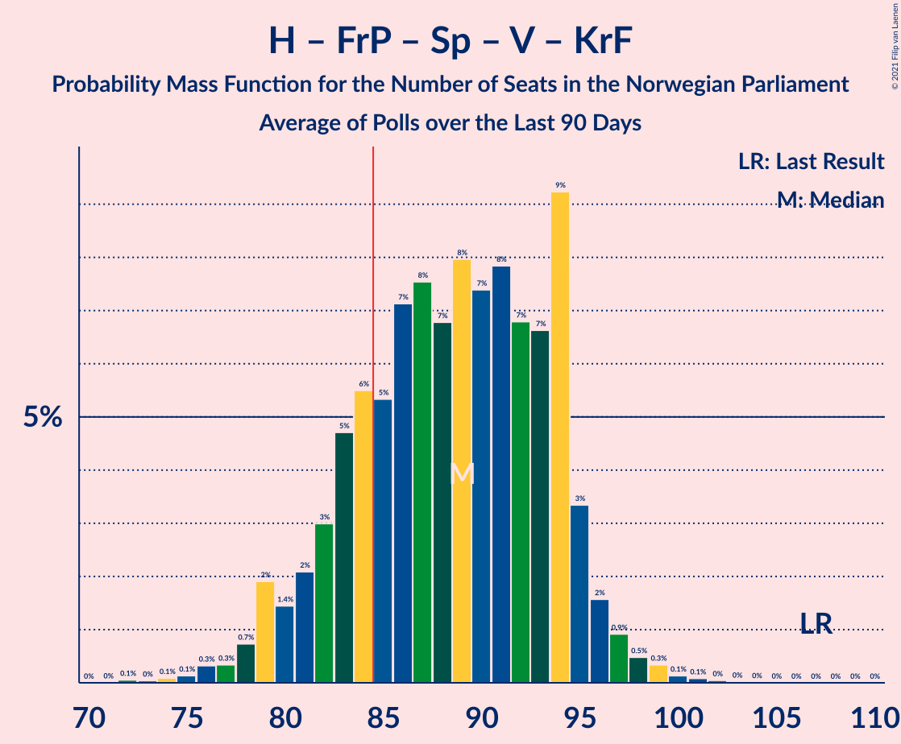

# Poll Average

<a href="#voting-intentions">Voting Intentions</a> | <a href="#seats">Seats</a> | <a href="#coalitions">Coalitions</a> | <a href="#technical-information">Technical Information</a>

## Summary

The table below lists the polls on which the average is based. They are the most recent polls (less than 90 days old) registered and analyzed so far.

| Period     | Polling firm/Commissioner(s) | Ap | H | FrP | Sp | SV | V | KrF | MDG | R |
|:----------:|:----------------------------:|:--:|:--:|:--:|:--:|:--:|:--:|:--:|:--:|:--:|
| 8–9 September 2013 | General Election | 27.4%   49 | 25.0%   45 | 15.2%   27 | 10.3%   19 | 6.0%   11 | 4.4%   8 | 4.2%   8 | 3.2%   1 | 2.4%   1 |
| N/A | Poll Average | 22–28%   40–50 | 17–25%   29–45 | 8–12%   14–22 | 15–21%   27–38 | 5–10%   10–19 | 2–5%   1–8 | 2–5%   1–8 | 2–6%   1–11 | 3–7%   2–14 |
| [15–20 June 2021](2021-06-20-Norstat.html) | Norstat   Vårt Land | 22–28%   38–50 | 20–25%   36–43 | 8–12%   14–22 | 15–20%   29–39 | 7–10%   13–19 | 2–4%   1–2 | 2–4%   1–3 | 2–4%   1–8 | 4–8%   7–15 |
| [9–14 June 2021](2021-06-14-Respons.html) | Respons   Bergens Tidende and VG | 21–26%   40–47 | 19–24%   34–44 | 9–13%   15–23 | 16–21%   30–39 | 7–10%   11–19 | 2–4%   1–2 | 2–5%   1–7 | 3–5%   1–9 | 3–6%   2–10 |
| [8–13 June 2021](2021-06-13-Sentio.html) | Sentio   Amedia and Nettavisen | 21–27%   40–48 | 19–25%   35–45 | 8–12%   15–23 | 16–21%   30–38 | 6–9%   9–16 | 2–4%   1–7 | 2–5%   1–8 | 4–7%   2–12 | 4–6%   2–11 |
| [1–7 June 2021](2021-06-07-OpinionPerduco.html) | Opinion Perduco   Avisenes Nyhetsbyrå, Dagsavisen and FriFagbevegelse | 21–28%   45 | 20–26%   41 | 8–13%   22 | 16–22%   31 | 5–8%   11 | 1–4%   1 | 2–5%   8 | 3–6%   2 | 3–6%   8 |
| [31 May–4 June 2021](2021-06-04-Norfakta.html) | Norfakta   Klassekampen and Nationen | 21–26%   39–48 | 20–25%   35–46 | 8–12%   15–22 | 15–20%   28–37 | 7–10%   12–18 | 2–4%   1–7 | 2–4%   0–7 | 3–5%   1–9 | 4–7%   8–13 |
| [25–31 May 2021](2021-05-31-KantarTNS.html) | Kantar TNS   TV2 | 22–27%   41–49 | 16–21%   28–36 | 8–12%   14–21 | 15–20%   28–37 | 7–10%   12–18 | 3–5%   2–9 | 2–5%   1–8 | 3–6%   2–10 | 5–8%   9–14 |
| [24–26 May 2021](2021-05-26-IpsosMMI.html) | Ipsos MMI   Dagbladet | 23–29%   42–53 | 18–24%   33–43 | 8–13%   13–22 | 14–19%   25–36 | 6–10%   9–17 | 2–4%   0–3 | 2–5%   1–8 | 3–7%   2–11 | 3–6%   2–10 |
| 8–9 September 2013 | General Election | 27.4%   49 | 25.0%   45 | 15.2%   27 | 10.3%   19 | 6.0%   11 | 4.4%   8 | 4.2%   8 | 3.2%   1 | 2.4%   1 |

Only polls for which at least the sample size has been published are included in the table above.

**Legend:**
+ **Top half of each row:** Voting intentions (95% confidence interval)
+ **Bottom half of each row:** Seat projections for the Norwegian Parliament (95% confidence interval)
+ **Ap:** Arbeiderpartiet
+ **H:** Høyre
+ **FrP:** Fremskrittspartiet
+ **Sp:** Senterpartiet
+ **SV:** Sosialistisk Venstreparti
+ **V:** Venstre
+ **KrF:** Kristelig Folkeparti
+ **MDG:** Miljøpartiet De Grønne
+ **R:** Rødt
+ **N/A (single party):** Party not included the published results
+ **N/A (entire row):** Calculation for this opinion poll not started yet

## Voting Intentions

### Confidence Intervals

| Party | Last Result | Median | 80% Confidence Interval | 90% Confidence Interval | 95% Confidence Interval | 99% Confidence Interval |
|:-----:|:-----------:|:------:|:-----------------------:|:-----------------------:|:-----------------------:|:-----------------------:|
| <a href="#arbeiderpartiet">Arbeiderpartiet</a> | 27.4% | 24.4% | 22.5–26.5% |21.9–27.1% | 21.5–27.7% | 20.6–28.9% |
| <a href="#høyre">Høyre</a> | 25.0% | 21.7% | 18.6–23.8% |17.8–24.4% | 17.2–24.9% | 16.3–26.0% |
| <a href="#fremskrittspartiet">Fremskrittspartiet</a> | 15.2% | 10.1% | 8.9–11.5% |8.5–11.9% | 8.2–12.3% | 7.7–13.1% |
| <a href="#senterpartiet">Senterpartiet</a> | 10.3% | 17.9% | 16.0–19.7% |15.5–20.3% | 15.0–20.8% | 14.0–21.8% |
| <a href="#sosialistisk-venstreparti">Sosialistisk Venstreparti</a> | 6.0% | 7.9% | 6.1–9.3% |5.7–9.7% | 5.3–10.0% | 4.6–10.7% |
| <a href="#venstre">Venstre</a> | 4.4% | 2.9% | 2.1–4.0% |1.9–4.4% | 1.7–4.7% | 1.4–5.3% |
| <a href="#kristelig-folkeparti">Kristelig Folkeparti</a> | 4.2% | 3.3% | 2.5–4.2% |2.3–4.5% | 2.1–4.7% | 1.8–5.3% |
| <a href="#miljøpartiet-de-grønne">Miljøpartiet De Grønne</a> | 3.2% | 4.3% | 3.0–5.5% |2.6–5.9% | 2.4–6.2% | 2.0–6.8% |
| <a href="#rødt">Rødt</a> | 2.4% | 5.2% | 3.9–6.7% |3.6–7.1% | 3.3–7.4% | 2.9–8.1% |

### Arbeiderpartiet

*For a full overview of the results for this party, see the [Arbeiderpartiet](party-arbeiderpartiet.html) page.*

| Voting Intentions | Probability | Accumulated | Special Marks |
|:-----------------:|:-----------:|:-----------:|:-------------:|
| 18.5–19.5% | 0% | 100% |  |
| 19.5–20.5% | 0.4% | 100% |  |
| 20.5–21.5% | 2% | 99.6% |  |
| 21.5–22.5% | 8% | 97% |  |
| 22.5–23.5% | 18% | 89% |  |
| 23.5–24.5% | 25% | 71% | Median |
| 24.5–25.5% | 22% | 46% |  |
| 25.5–26.5% | 14% | 23% |  |
| 26.5–27.5% | 6% | 9% | Last Result |
| 27.5–28.5% | 2% | 3% |  |
| 28.5–29.5% | 0.6% | 0.8% |  |
| 29.5–30.5% | 0.1% | 0.2% |  |
| 30.5–31.5% | 0% | 0% |  |

### Høyre

*For a full overview of the results for this party, see the [Høyre](party-høyre.html) page.*

| Voting Intentions | Probability | Accumulated | Special Marks |
|:-----------------:|:-----------:|:-----------:|:-------------:|
| 13.5–14.5% | 0% | 100% |  |
| 14.5–15.5% | 0.1% | 100% |  |
| 15.5–16.5% | 0.8% | 99.9% |  |
| 16.5–17.5% | 3% | 99.2% |  |
| 17.5–18.5% | 6% | 96% |  |
| 18.5–19.5% | 7% | 91% |  |
| 19.5–20.5% | 11% | 83% |  |
| 20.5–21.5% | 19% | 72% |  |
| 21.5–22.5% | 23% | 53% | Median |
| 22.5–23.5% | 17% | 30% |  |
| 23.5–24.5% | 9% | 13% |  |
| 24.5–25.5% | 3% | 4% | Last Result |
| 25.5–26.5% | 0.8% | 1.0% |  |
| 26.5–27.5% | 0.2% | 0.2% |  |
| 27.5–28.5% | 0% | 0% |  |

### Fremskrittspartiet

*For a full overview of the results for this party, see the [Fremskrittspartiet](party-fremskrittspartiet.html) page.*

| Voting Intentions | Probability | Accumulated | Special Marks |
|:-----------------:|:-----------:|:-----------:|:-------------:|
| 5.5–6.5% | 0% | 100% |  |
| 6.5–7.5% | 0.3% | 100% |  |
| 7.5–8.5% | 5% | 99.7% |  |
| 8.5–9.5% | 23% | 95% |  |
| 9.5–10.5% | 37% | 71% | Median |
| 10.5–11.5% | 25% | 34% |  |
| 11.5–12.5% | 8% | 9% |  |
| 12.5–13.5% | 1.4% | 2% |  |
| 13.5–14.5% | 0.1% | 0.2% |  |
| 14.5–15.5% | 0% | 0% | Last Result |

### Senterpartiet

*For a full overview of the results for this party, see the [Senterpartiet](party-senterpartiet.html) page.*

| Voting Intentions | Probability | Accumulated | Special Marks |
|:-----------------:|:-----------:|:-----------:|:-------------:|
| 9.5–10.5% | 0% | 100% | Last Result |
| 10.5–11.5% | 0% | 100% |  |
| 11.5–12.5% | 0% | 100% |  |
| 12.5–13.5% | 0.2% | 100% |  |
| 13.5–14.5% | 1.1% | 99.8% |  |
| 14.5–15.5% | 4% | 98.7% |  |
| 15.5–16.5% | 12% | 94% |  |
| 16.5–17.5% | 23% | 82% |  |
| 17.5–18.5% | 27% | 59% | Median |
| 18.5–19.5% | 20% | 32% |  |
| 19.5–20.5% | 9% | 13% |  |
| 20.5–21.5% | 3% | 4% |  |
| 21.5–22.5% | 0.6% | 0.7% |  |
| 22.5–23.5% | 0.1% | 0.1% |  |
| 23.5–24.5% | 0% | 0% |  |

### Sosialistisk Venstreparti

*For a full overview of the results for this party, see the [Sosialistisk Venstreparti](party-sosialistiskvenstreparti.html) page.*

| Voting Intentions | Probability | Accumulated | Special Marks |
|:-----------------:|:-----------:|:-----------:|:-------------:|
| 2.5–3.5% | 0% | 100% |  |
| 3.5–4.5% | 0.4% | 100% |  |
| 4.5–5.5% | 4% | 99.6% |  |
| 5.5–6.5% | 12% | 96% | Last Result |
| 6.5–7.5% | 23% | 84% |  |
| 7.5–8.5% | 33% | 61% | Median |
| 8.5–9.5% | 22% | 28% |  |
| 9.5–10.5% | 6% | 6% |  |
| 10.5–11.5% | 0.6% | 0.7% |  |
| 11.5–12.5% | 0% | 0% |  |

### Venstre

*For a full overview of the results for this party, see the [Venstre](party-venstre.html) page.*

| Voting Intentions | Probability | Accumulated | Special Marks |
|:-----------------:|:-----------:|:-----------:|:-------------:|
| 0.0–0.5% | 0% | 100% |  |
| 0.5–1.5% | 1.2% | 100% |  |
| 1.5–2.5% | 31% | 98.8% |  |
| 2.5–3.5% | 48% | 68% | Median |
| 3.5–4.5% | 16% | 20% | Last Result |
| 4.5–5.5% | 3% | 4% |  |
| 5.5–6.5% | 0.2% | 0.2% |  |
| 6.5–7.5% | 0% | 0% |  |

### Kristelig Folkeparti

*For a full overview of the results for this party, see the [Kristelig Folkeparti](party-kristeligfolkeparti.html) page.*

| Voting Intentions | Probability | Accumulated | Special Marks |
|:-----------------:|:-----------:|:-----------:|:-------------:|
| 0.5–1.5% | 0.1% | 100% |  |
| 1.5–2.5% | 12% | 99.9% |  |
| 2.5–3.5% | 54% | 88% | Median |
| 3.5–4.5% | 30% | 34% | Last Result |
| 4.5–5.5% | 4% | 4% |  |
| 5.5–6.5% | 0.2% | 0.2% |  |
| 6.5–7.5% | 0% | 0% |  |

### Miljøpartiet De Grønne

*For a full overview of the results for this party, see the [Miljøpartiet De Grønne](party-miljøpartietdegrønne.html) page.*

| Voting Intentions | Probability | Accumulated | Special Marks |
|:-----------------:|:-----------:|:-----------:|:-------------:|
| 0.5–1.5% | 0% | 100% |  |
| 1.5–2.5% | 4% | 100% |  |
| 2.5–3.5% | 18% | 96% | Last Result |
| 3.5–4.5% | 37% | 77% | Median |
| 4.5–5.5% | 31% | 40% |  |
| 5.5–6.5% | 9% | 10% |  |
| 6.5–7.5% | 0.9% | 0.9% |  |
| 7.5–8.5% | 0% | 0% |  |
| 8.5–9.5% | 0% | 0% |  |

### Rødt

*For a full overview of the results for this party, see the [Rødt](party-rødt.html) page.*

| Voting Intentions | Probability | Accumulated | Special Marks |
|:-----------------:|:-----------:|:-----------:|:-------------:|
| 0.5–1.5% | 0% | 100% |  |
| 1.5–2.5% | 0.1% | 100% | Last Result |
| 2.5–3.5% | 4% | 99.9% |  |
| 3.5–4.5% | 25% | 95% |  |
| 4.5–5.5% | 34% | 71% | Median |
| 5.5–6.5% | 25% | 37% |  |
| 6.5–7.5% | 10% | 12% |  |
| 7.5–8.5% | 2% | 2% |  |
| 8.5–9.5% | 0.1% | 0.1% |  |
| 9.5–10.5% | 0% | 0% |  |

## Seats

### Confidence Intervals

| Party | Last Result | Median | 80% Confidence Interval | 90% Confidence Interval | 95% Confidence Interval | 99% Confidence Interval |
|:-----:|:-----------:|:------:|:-----------------------:|:-----------------------:|:-----------------------:|:-----------------------:|
| <a href="#arbeiderpartiet">Arbeiderpartiet</a> | 49 | 44 | 42–46 |40–48 | 40–50 | 38–53 |
| <a href="#høyre">Høyre</a> | 45 | 39 | 33–42 |31–43 | 29–45 | 29–47 |
| <a href="#fremskrittspartiet">Fremskrittspartiet</a> | 27 | 18 | 15–22 |14–22 | 14–22 | 13–23 |
| <a href="#senterpartiet">Senterpartiet</a> | 19 | 33 | 30–36 |29–37 | 27–38 | 25–39 |
| <a href="#sosialistisk-venstreparti">Sosialistisk Venstreparti</a> | 11 | 13 | 11–17 |11–18 | 10–19 | 9–19 |
| <a href="#venstre">Venstre</a> | 8 | 2 | 1–7 |1–8 | 1–8 | 0–9 |
| <a href="#kristelig-folkeparti">Kristelig Folkeparti</a> | 8 | 2 | 1–8 |1–8 | 1–8 | 0–8 |
| <a href="#miljøpartiet-de-grønne">Miljøpartiet De Grønne</a> | 1 | 7 | 1–9 |1–10 | 1–11 | 1–12 |
| <a href="#rødt">Rødt</a> | 1 | 9 | 2–14 |2–14 | 2–14 | 2–15 |

### Arbeiderpartiet

*For a full overview of the results for this party, see the [Arbeiderpartiet](party-arbeiderpartiet.html) page.*

| Number of Seats | Probability | Accumulated | Special Marks |
|:---------------:|:-----------:|:-----------:|:-------------:|
| 37 | 0.1% | 100% |  |
| 38 | 0.9% | 99.9% |  |
| 39 | 0.7% | 99.0% |  |
| 40 | 4% | 98% |  |
| 41 | 4% | 94% |  |
| 42 | 8% | 90% |  |
| 43 | 10% | 82% |  |
| 44 | 27% | 73% | Median |
| 45 | 30% | 45% |  |
| 46 | 5% | 15% |  |
| 47 | 4% | 10% |  |
| 48 | 2% | 6% |  |
| 49 | 0.9% | 5% | Last Result |
| 50 | 1.4% | 4% |  |
| 51 | 1.0% | 2% |  |
| 52 | 0.4% | 1.3% |  |
| 53 | 0.5% | 0.9% |  |
| 54 | 0.1% | 0.4% |  |
| 55 | 0.1% | 0.3% |  |
| 56 | 0.1% | 0.2% |  |
| 57 | 0.1% | 0.1% |  |
| 58 | 0% | 0% |  |

### Høyre

*For a full overview of the results for this party, see the [Høyre](party-høyre.html) page.*

| Number of Seats | Probability | Accumulated | Special Marks |
|:---------------:|:-----------:|:-----------:|:-------------:|
| 27 | 0.1% | 100% |  |
| 28 | 0.3% | 99.9% |  |
| 29 | 2% | 99.6% |  |
| 30 | 1.3% | 97% |  |
| 31 | 2% | 96% |  |
| 32 | 2% | 94% |  |
| 33 | 3% | 93% |  |
| 34 | 4% | 90% |  |
| 35 | 7% | 85% |  |
| 36 | 5% | 78% |  |
| 37 | 5% | 73% |  |
| 38 | 7% | 68% |  |
| 39 | 18% | 61% | Median |
| 40 | 8% | 43% |  |
| 41 | 20% | 35% |  |
| 42 | 7% | 15% |  |
| 43 | 3% | 8% |  |
| 44 | 2% | 4% |  |
| 45 | 2% | 3% | Last Result |
| 46 | 0.4% | 0.9% |  |
| 47 | 0.4% | 0.5% |  |
| 48 | 0% | 0.2% |  |
| 49 | 0.1% | 0.1% |  |
| 50 | 0.1% | 0.1% |  |
| 51 | 0% | 0% |  |

### Fremskrittspartiet

*For a full overview of the results for this party, see the [Fremskrittspartiet](party-fremskrittspartiet.html) page.*

| Number of Seats | Probability | Accumulated | Special Marks |
|:---------------:|:-----------:|:-----------:|:-------------:|
| 12 | 0.4% | 100% |  |
| 13 | 0.6% | 99.6% |  |
| 14 | 5% | 99.0% |  |
| 15 | 14% | 94% |  |
| 16 | 13% | 79% |  |
| 17 | 15% | 67% |  |
| 18 | 13% | 52% | Median |
| 19 | 9% | 39% |  |
| 20 | 10% | 31% |  |
| 21 | 3% | 21% |  |
| 22 | 16% | 18% |  |
| 23 | 2% | 2% |  |
| 24 | 0.2% | 0.3% |  |
| 25 | 0.1% | 0.1% |  |
| 26 | 0% | 0% |  |
| 27 | 0% | 0% | Last Result |

### Senterpartiet

*For a full overview of the results for this party, see the [Senterpartiet](party-senterpartiet.html) page.*

| Number of Seats | Probability | Accumulated | Special Marks |
|:---------------:|:-----------:|:-----------:|:-------------:|
| 19 | 0% | 100% | Last Result |
| 20 | 0% | 100% |  |
| 21 | 0% | 100% |  |
| 22 | 0% | 100% |  |
| 23 | 0.1% | 100% |  |
| 24 | 0.1% | 99.9% |  |
| 25 | 0.6% | 99.8% |  |
| 26 | 1.1% | 99.2% |  |
| 27 | 1.1% | 98% |  |
| 28 | 2% | 97% |  |
| 29 | 4% | 95% |  |
| 30 | 4% | 92% |  |
| 31 | 19% | 87% |  |
| 32 | 10% | 68% |  |
| 33 | 19% | 58% | Median |
| 34 | 10% | 39% |  |
| 35 | 10% | 29% |  |
| 36 | 11% | 19% |  |
| 37 | 5% | 9% |  |
| 38 | 2% | 3% |  |
| 39 | 1.1% | 1.4% |  |
| 40 | 0.1% | 0.3% |  |
| 41 | 0.2% | 0.2% |  |
| 42 | 0% | 0% |  |

### Sosialistisk Venstreparti

*For a full overview of the results for this party, see the [Sosialistisk Venstreparti](party-sosialistiskvenstreparti.html) page.*

| Number of Seats | Probability | Accumulated | Special Marks |
|:---------------:|:-----------:|:-----------:|:-------------:|
| 8 | 0.2% | 100% |  |
| 9 | 1.0% | 99.8% |  |
| 10 | 3% | 98.8% |  |
| 11 | 20% | 95% | Last Result |
| 12 | 10% | 76% |  |
| 13 | 18% | 65% | Median |
| 14 | 13% | 47% |  |
| 15 | 11% | 34% |  |
| 16 | 13% | 23% |  |
| 17 | 4% | 10% |  |
| 18 | 2% | 6% |  |
| 19 | 4% | 4% |  |
| 20 | 0.1% | 0.2% |  |
| 21 | 0% | 0.1% |  |
| 22 | 0% | 0% |  |

### Venstre

*For a full overview of the results for this party, see the [Venstre](party-venstre.html) page.*

| Number of Seats | Probability | Accumulated | Special Marks |
|:---------------:|:-----------:|:-----------:|:-------------:|
| 0 | 1.3% | 100% |  |
| 1 | 31% | 98.7% |  |
| 2 | 57% | 68% | Median |
| 3 | 0.6% | 11% |  |
| 4 | 0% | 10% |  |
| 5 | 0% | 10% |  |
| 6 | 0.2% | 10% |  |
| 7 | 5% | 10% |  |
| 8 | 4% | 5% | Last Result |
| 9 | 0.9% | 1.1% |  |
| 10 | 0.2% | 0.2% |  |
| 11 | 0% | 0% |  |

### Kristelig Folkeparti

*For a full overview of the results for this party, see the [Kristelig Folkeparti](party-kristeligfolkeparti.html) page.*

| Number of Seats | Probability | Accumulated | Special Marks |
|:---------------:|:-----------:|:-----------:|:-------------:|
| 0 | 1.0% | 100% |  |
| 1 | 45% | 99.0% |  |
| 2 | 7% | 54% | Median |
| 3 | 24% | 47% |  |
| 4 | 0% | 23% |  |
| 5 | 0% | 23% |  |
| 6 | 2% | 23% |  |
| 7 | 6% | 22% |  |
| 8 | 16% | 16% | Last Result |
| 9 | 0.3% | 0.4% |  |
| 10 | 0% | 0% |  |

### Miljøpartiet De Grønne

*For a full overview of the results for this party, see the [Miljøpartiet De Grønne](party-miljøpartietdegrønne.html) page.*

| Number of Seats | Probability | Accumulated | Special Marks |
|:---------------:|:-----------:|:-----------:|:-------------:|
| 1 | 14% | 100% | Last Result |
| 2 | 25% | 86% |  |
| 3 | 6% | 61% |  |
| 4 | 1.0% | 55% |  |
| 5 | 0% | 54% |  |
| 6 | 0.3% | 54% |  |
| 7 | 14% | 54% | Median |
| 8 | 21% | 40% |  |
| 9 | 14% | 19% |  |
| 10 | 3% | 6% |  |
| 11 | 2% | 3% |  |
| 12 | 0.6% | 0.7% |  |
| 13 | 0.1% | 0.1% |  |
| 14 | 0% | 0% |  |

### Rødt

*For a full overview of the results for this party, see the [Rødt](party-rødt.html) page.*

| Number of Seats | Probability | Accumulated | Special Marks |
|:---------------:|:-----------:|:-----------:|:-------------:|
| 1 | 0.3% | 100% | Last Result |
| 2 | 12% | 99.7% |  |
| 3 | 0% | 88% |  |
| 4 | 0% | 88% |  |
| 5 | 0% | 88% |  |
| 6 | 1.2% | 88% |  |
| 7 | 8% | 87% |  |
| 8 | 27% | 79% |  |
| 9 | 13% | 52% | Median |
| 10 | 12% | 39% |  |
| 11 | 10% | 28% |  |
| 12 | 5% | 18% |  |
| 13 | 2% | 13% |  |
| 14 | 10% | 11% |  |
| 15 | 0.8% | 0.8% |  |
| 16 | 0% | 0% |  |

## Coalitions

### Confidence Intervals

| Coalition | Last Result | Median | Majority? | 80% Confidence Interval | 90% Confidence Interval | 95% Confidence Interval | 99% Confidence Interval |
|:---------:|:-----------:|:------:|:---------:|:-----------------------:|:-----------------------:|:-----------------------:|:-----------------------:|
| Arbeiderpartiet – Senterpartiet – Sosialistisk Venstreparti – Miljøpartiet De Grønne – Rødt | 81 | 105 | 100% | 97–111 | 97–113 | 97–115 | 94–117 |
| Arbeiderpartiet – Senterpartiet – Sosialistisk Venstreparti – Rødt | 80 | 100 | 100% | 94–105 | 92–107 | 91–108 | 89–110 |
| Arbeiderpartiet – Senterpartiet – Sosialistisk Venstreparti – Kristelig Folkeparti – Miljøpartiet De Grønne | 88 | 99 | 100% | 92–105 | 92–106 | 92–107 | 87–110 |
| Arbeiderpartiet – Senterpartiet – Sosialistisk Venstreparti – Miljøpartiet De Grønne | 80 | 97 | 99.9% | 89–102 | 89–104 | 89–105 | 86–107 |
| Høyre – Fremskrittspartiet – Senterpartiet – Venstre – Kristelig Folkeparti | 107 | 94 | 98.6% | 89–103 | 87–103 | 86–103 | 83–104 |
| Arbeiderpartiet – Senterpartiet – Sosialistisk Venstreparti | 79 | 90 | 98% | 87–96 | 87–96 | 85–97 | 83–101 |
| Arbeiderpartiet – Senterpartiet – Kristelig Folkeparti – Miljøpartiet De Grønne | 77 | 86 | 64% | 79–92 | 79–93 | 77–94 | 73–98 |
| Arbeiderpartiet – Senterpartiet – Kristelig Folkeparti | 76 | 80 | 8% | 76–84 | 75–85 | 73–86 | 71–90 |
| Arbeiderpartiet – Senterpartiet | 68 | 77 | 0.5% | 74–81 | 73–82 | 71–83 | 69–85 |
| Arbeiderpartiet – Sosialistisk Venstreparti – Miljøpartiet De Grønne – Rødt | 62 | 66 | 0% | 66–75 | 66–77 | 65–77 | 64–79 |
| Høyre – Fremskrittspartiet – Venstre – Kristelig Folkeparti – Miljøpartiet De Grønne | 89 | 67 | 0% | 58–74 | 57–74 | 57–75 | 57–78 |
| Høyre – Fremskrittspartiet – Venstre – Kristelig Folkeparti | 88 | 61 | 0% | 56–72 | 55–72 | 54–72 | 52–72 |
| Høyre – Fremskrittspartiet – Venstre | 80 | 58 | 0% | 54–64 | 52–64 | 51–66 | 49–68 |
| Arbeiderpartiet – Sosialistisk Venstreparti | 60 | 57 | 0% | 55–62 | 54–64 | 52–64 | 51–67 |
| Høyre – Fremskrittspartiet | 72 | 56 | 0% | 50–63 | 48–63 | 46–64 | 45–66 |
| Høyre – Venstre – Kristelig Folkeparti | 61 | 43 | 0% | 39–50 | 38–50 | 36–50 | 35–51 |
| Senterpartiet – Venstre – Kristelig Folkeparti | 35 | 38 | 0% | 34–43 | 33–45 | 31–46 | 28–48 |

### Arbeiderpartiet – Senterpartiet – Sosialistisk Venstreparti – Miljøpartiet De Grønne – Rødt

| Number of Seats | Probability | Accumulated | Special Marks |
|:---------------:|:-----------:|:-----------:|:-------------:|
| 81 | 0% | 100% | Last Result |
| 82 | 0% | 100% |  |
| 83 | 0% | 100% |  |
| 84 | 0% | 100% |  |
| 85 | 0% | 100% | Majority |
| 86 | 0% | 100% |  |
| 87 | 0% | 100% |  |
| 88 | 0% | 100% |  |
| 89 | 0% | 100% |  |
| 90 | 0% | 100% |  |
| 91 | 0.1% | 100% |  |
| 92 | 0.1% | 99.9% |  |
| 93 | 0.2% | 99.9% |  |
| 94 | 0.2% | 99.6% |  |
| 95 | 0.6% | 99.4% |  |
| 96 | 0.4% | 98.8% |  |
| 97 | 15% | 98% |  |
| 98 | 0.8% | 84% |  |
| 99 | 2% | 83% |  |
| 100 | 4% | 81% |  |
| 101 | 3% | 77% |  |
| 102 | 4% | 74% |  |
| 103 | 4% | 70% |  |
| 104 | 3% | 66% |  |
| 105 | 17% | 63% |  |
| 106 | 7% | 46% | Median |
| 107 | 7% | 40% |  |
| 108 | 7% | 33% |  |
| 109 | 6% | 26% |  |
| 110 | 8% | 20% |  |
| 111 | 3% | 12% |  |
| 112 | 4% | 9% |  |
| 113 | 2% | 6% |  |
| 114 | 1.3% | 4% |  |
| 115 | 0.7% | 3% |  |
| 116 | 1.2% | 2% |  |
| 117 | 0.4% | 0.6% |  |
| 118 | 0.1% | 0.3% |  |
| 119 | 0.1% | 0.1% |  |
| 120 | 0.1% | 0.1% |  |
| 121 | 0% | 0% |  |

### Arbeiderpartiet – Senterpartiet – Sosialistisk Venstreparti – Rødt

| Number of Seats | Probability | Accumulated | Special Marks |
|:---------------:|:-----------:|:-----------:|:-------------:|
| 80 | 0% | 100% | Last Result |
| 81 | 0% | 100% |  |
| 82 | 0% | 100% |  |
| 83 | 0% | 100% |  |
| 84 | 0% | 100% |  |
| 85 | 0% | 100% | Majority |
| 86 | 0.1% | 99.9% |  |
| 87 | 0.2% | 99.9% |  |
| 88 | 0.2% | 99.7% |  |
| 89 | 0.4% | 99.5% |  |
| 90 | 1.0% | 99.1% |  |
| 91 | 2% | 98% |  |
| 92 | 1.5% | 96% |  |
| 93 | 3% | 94% |  |
| 94 | 3% | 91% |  |
| 95 | 17% | 89% |  |
| 96 | 3% | 71% |  |
| 97 | 4% | 69% |  |
| 98 | 7% | 64% |  |
| 99 | 6% | 58% | Median |
| 100 | 4% | 52% |  |
| 101 | 6% | 48% |  |
| 102 | 6% | 42% |  |
| 103 | 10% | 35% |  |
| 104 | 13% | 25% |  |
| 105 | 3% | 12% |  |
| 106 | 2% | 9% |  |
| 107 | 4% | 7% |  |
| 108 | 1.4% | 3% |  |
| 109 | 0.5% | 1.5% |  |
| 110 | 0.7% | 1.0% |  |
| 111 | 0.1% | 0.3% |  |
| 112 | 0.1% | 0.1% |  |
| 113 | 0% | 0.1% |  |
| 114 | 0% | 0% |  |

### Arbeiderpartiet – Senterpartiet – Sosialistisk Venstreparti – Kristelig Folkeparti – Miljøpartiet De Grønne

| Number of Seats | Probability | Accumulated | Special Marks |
|:---------------:|:-----------:|:-----------:|:-------------:|
| 85 | 0.1% | 100% | Majority |
| 86 | 0% | 99.9% |  |
| 87 | 0.5% | 99.9% |  |
| 88 | 0% | 99.5% | Last Result |
| 89 | 0.1% | 99.4% |  |
| 90 | 0.2% | 99.3% |  |
| 91 | 0.6% | 99.1% |  |
| 92 | 10% | 98.6% |  |
| 93 | 2% | 89% |  |
| 94 | 1.4% | 87% |  |
| 95 | 2% | 86% |  |
| 96 | 3% | 84% |  |
| 97 | 19% | 80% |  |
| 98 | 6% | 61% |  |
| 99 | 9% | 55% | Median |
| 100 | 9% | 46% |  |
| 101 | 9% | 38% |  |
| 102 | 4% | 28% |  |
| 103 | 5% | 24% |  |
| 104 | 7% | 19% |  |
| 105 | 3% | 13% |  |
| 106 | 5% | 10% |  |
| 107 | 2% | 5% |  |
| 108 | 1.0% | 2% |  |
| 109 | 0.8% | 1.3% |  |
| 110 | 0.2% | 0.5% |  |
| 111 | 0.1% | 0.3% |  |
| 112 | 0% | 0.1% |  |
| 113 | 0% | 0.1% |  |
| 114 | 0% | 0.1% |  |
| 115 | 0% | 0% |  |

### Arbeiderpartiet – Senterpartiet – Sosialistisk Venstreparti – Miljøpartiet De Grønne

| Number of Seats | Probability | Accumulated | Special Marks |
|:---------------:|:-----------:|:-----------:|:-------------:|
| 80 | 0% | 100% | Last Result |
| 81 | 0% | 100% |  |
| 82 | 0% | 100% |  |
| 83 | 0% | 100% |  |
| 84 | 0% | 100% |  |
| 85 | 0.1% | 99.9% | Majority |
| 86 | 0.5% | 99.8% |  |
| 87 | 0.1% | 99.3% |  |
| 88 | 0.3% | 99.3% |  |
| 89 | 15% | 99.0% |  |
| 90 | 0.9% | 84% |  |
| 91 | 10% | 84% |  |
| 92 | 2% | 73% |  |
| 93 | 3% | 71% |  |
| 94 | 2% | 67% |  |
| 95 | 4% | 65% |  |
| 96 | 6% | 61% |  |
| 97 | 9% | 55% | Median |
| 98 | 13% | 46% |  |
| 99 | 7% | 34% |  |
| 100 | 8% | 27% |  |
| 101 | 6% | 19% |  |
| 102 | 3% | 13% |  |
| 103 | 5% | 10% |  |
| 104 | 2% | 5% |  |
| 105 | 3% | 4% |  |
| 106 | 0.3% | 0.8% |  |
| 107 | 0.3% | 0.5% |  |
| 108 | 0.1% | 0.3% |  |
| 109 | 0.1% | 0.1% |  |
| 110 | 0% | 0.1% |  |
| 111 | 0% | 0% |  |

### Høyre – Fremskrittspartiet – Senterpartiet – Venstre – Kristelig Folkeparti

| Number of Seats | Probability | Accumulated | Special Marks |
|:---------------:|:-----------:|:-----------:|:-------------:|
| 79 | 0.1% | 100% |  |
| 80 | 0.1% | 99.9% |  |
| 81 | 0.1% | 99.8% |  |
| 82 | 0.2% | 99.7% |  |
| 83 | 0.5% | 99.5% |  |
| 84 | 0.5% | 99.1% |  |
| 85 | 1.0% | 98.6% | Majority |
| 86 | 1.1% | 98% |  |
| 87 | 2% | 96% |  |
| 88 | 3% | 94% |  |
| 89 | 13% | 91% |  |
| 90 | 6% | 79% |  |
| 91 | 4% | 72% |  |
| 92 | 7% | 69% |  |
| 93 | 8% | 62% |  |
| 94 | 7% | 55% | Median |
| 95 | 8% | 48% |  |
| 96 | 4% | 40% |  |
| 97 | 5% | 36% |  |
| 98 | 3% | 31% |  |
| 99 | 3% | 28% |  |
| 100 | 5% | 25% |  |
| 101 | 3% | 20% |  |
| 102 | 2% | 17% |  |
| 103 | 14% | 15% |  |
| 104 | 0.7% | 1.0% |  |
| 105 | 0.1% | 0.2% |  |
| 106 | 0% | 0.1% |  |
| 107 | 0% | 0.1% | Last Result |
| 108 | 0% | 0.1% |  |
| 109 | 0% | 0% |  |

### Arbeiderpartiet – Senterpartiet – Sosialistisk Venstreparti

| Number of Seats | Probability | Accumulated | Special Marks |
|:---------------:|:-----------:|:-----------:|:-------------:|
| 79 | 0% | 100% | Last Result |
| 80 | 0% | 100% |  |
| 81 | 0.1% | 99.9% |  |
| 82 | 0.2% | 99.8% |  |
| 83 | 0.7% | 99.7% |  |
| 84 | 1.0% | 99.0% |  |
| 85 | 2% | 98% | Majority |
| 86 | 1.2% | 96% |  |
| 87 | 17% | 95% |  |
| 88 | 5% | 78% |  |
| 89 | 8% | 73% |  |
| 90 | 17% | 65% | Median |
| 91 | 9% | 48% |  |
| 92 | 8% | 39% |  |
| 93 | 9% | 32% |  |
| 94 | 5% | 23% |  |
| 95 | 7% | 18% |  |
| 96 | 7% | 11% |  |
| 97 | 2% | 4% |  |
| 98 | 0.8% | 2% |  |
| 99 | 0.4% | 1.5% |  |
| 100 | 0.4% | 1.0% |  |
| 101 | 0.1% | 0.6% |  |
| 102 | 0.4% | 0.5% |  |
| 103 | 0% | 0.1% |  |
| 104 | 0% | 0% |  |

### Arbeiderpartiet – Senterpartiet – Kristelig Folkeparti – Miljøpartiet De Grønne

| Number of Seats | Probability | Accumulated | Special Marks |
|:---------------:|:-----------:|:-----------:|:-------------:|
| 73 | 0.6% | 100% |  |
| 74 | 0.2% | 99.4% |  |
| 75 | 0.2% | 99.2% |  |
| 76 | 0.5% | 99.0% |  |
| 77 | 1.2% | 98% | Last Result |
| 78 | 0.7% | 97% |  |
| 79 | 11% | 97% |  |
| 80 | 0.9% | 85% |  |
| 81 | 5% | 84% |  |
| 82 | 3% | 80% |  |
| 83 | 8% | 77% |  |
| 84 | 5% | 69% |  |
| 85 | 6% | 64% | Majority |
| 86 | 19% | 57% | Median |
| 87 | 6% | 38% |  |
| 88 | 7% | 32% |  |
| 89 | 5% | 25% |  |
| 90 | 5% | 21% |  |
| 91 | 3% | 16% |  |
| 92 | 6% | 12% |  |
| 93 | 3% | 6% |  |
| 94 | 1.4% | 3% |  |
| 95 | 0.8% | 2% |  |
| 96 | 0.3% | 1.0% |  |
| 97 | 0.2% | 0.7% |  |
| 98 | 0.3% | 0.5% |  |
| 99 | 0.2% | 0.2% |  |
| 100 | 0% | 0.1% |  |
| 101 | 0% | 0% |  |

### Arbeiderpartiet – Senterpartiet – Kristelig Folkeparti

| Number of Seats | Probability | Accumulated | Special Marks |
|:---------------:|:-----------:|:-----------:|:-------------:|
| 69 | 0% | 100% |  |
| 70 | 0.2% | 99.9% |  |
| 71 | 0.3% | 99.7% |  |
| 72 | 1.2% | 99.4% |  |
| 73 | 1.1% | 98% |  |
| 74 | 2% | 97% |  |
| 75 | 4% | 95% |  |
| 76 | 4% | 91% | Last Result |
| 77 | 7% | 87% |  |
| 78 | 15% | 81% |  |
| 79 | 7% | 66% | Median |
| 80 | 14% | 59% |  |
| 81 | 8% | 45% |  |
| 82 | 5% | 36% |  |
| 83 | 4% | 32% |  |
| 84 | 20% | 27% |  |
| 85 | 4% | 8% | Majority |
| 86 | 2% | 4% |  |
| 87 | 0.9% | 2% |  |
| 88 | 0.6% | 1.4% |  |
| 89 | 0.2% | 0.9% |  |
| 90 | 0.5% | 0.7% |  |
| 91 | 0.1% | 0.2% |  |
| 92 | 0.1% | 0.1% |  |
| 93 | 0% | 0% |  |

### Arbeiderpartiet – Senterpartiet

| Number of Seats | Probability | Accumulated | Special Marks |
|:---------------:|:-----------:|:-----------:|:-------------:|
| 67 | 0.1% | 100% |  |
| 68 | 0.1% | 99.9% | Last Result |
| 69 | 0.3% | 99.8% |  |
| 70 | 0.7% | 99.5% |  |
| 71 | 2% | 98.8% |  |
| 72 | 2% | 97% |  |
| 73 | 3% | 96% |  |
| 74 | 6% | 93% |  |
| 75 | 5% | 87% |  |
| 76 | 22% | 82% |  |
| 77 | 21% | 60% | Median |
| 78 | 10% | 39% |  |
| 79 | 9% | 29% |  |
| 80 | 8% | 20% |  |
| 81 | 6% | 12% |  |
| 82 | 2% | 6% |  |
| 83 | 2% | 3% |  |
| 84 | 0.6% | 1.2% |  |
| 85 | 0.2% | 0.5% | Majority |
| 86 | 0.1% | 0.3% |  |
| 87 | 0.1% | 0.2% |  |
| 88 | 0.1% | 0.1% |  |
| 89 | 0% | 0% |  |

### Arbeiderpartiet – Sosialistisk Venstreparti – Miljøpartiet De Grønne – Rødt

| Number of Seats | Probability | Accumulated | Special Marks |
|:---------------:|:-----------:|:-----------:|:-------------:|
| 60 | 0% | 100% |  |
| 61 | 0.1% | 99.9% |  |
| 62 | 0% | 99.9% | Last Result |
| 63 | 0.1% | 99.8% |  |
| 64 | 0.3% | 99.8% |  |
| 65 | 2% | 99.5% |  |
| 66 | 49% | 97% |  |
| 67 | 0.3% | 48% |  |
| 68 | 5% | 48% |  |
| 69 | 1.3% | 43% |  |
| 70 | 7% | 41% |  |
| 71 | 4% | 34% |  |
| 72 | 2% | 31% |  |
| 73 | 5% | 28% | Median |
| 74 | 9% | 23% |  |
| 75 | 6% | 14% |  |
| 76 | 2% | 8% |  |
| 77 | 4% | 5% |  |
| 78 | 0.5% | 2% |  |
| 79 | 0.9% | 1.2% |  |
| 80 | 0.2% | 0.3% |  |
| 81 | 0.1% | 0.1% |  |
| 82 | 0% | 0% |  |

### Høyre – Fremskrittspartiet – Venstre – Kristelig Folkeparti – Miljøpartiet De Grønne

| Number of Seats | Probability | Accumulated | Special Marks |
|:---------------:|:-----------:|:-----------:|:-------------:|
| 55 | 0% | 100% |  |
| 56 | 0% | 99.9% |  |
| 57 | 9% | 99.9% |  |
| 58 | 0.9% | 90% |  |
| 59 | 1.0% | 90% |  |
| 60 | 0.8% | 89% |  |
| 61 | 2% | 88% |  |
| 62 | 6% | 86% |  |
| 63 | 3% | 80% |  |
| 64 | 4% | 77% |  |
| 65 | 6% | 73% |  |
| 66 | 11% | 66% |  |
| 67 | 9% | 55% |  |
| 68 | 8% | 47% | Median |
| 69 | 5% | 39% |  |
| 70 | 6% | 34% |  |
| 71 | 6% | 28% |  |
| 72 | 3% | 22% |  |
| 73 | 0.9% | 19% |  |
| 74 | 15% | 18% |  |
| 75 | 1.1% | 3% |  |
| 76 | 0.2% | 2% |  |
| 77 | 0.4% | 2% |  |
| 78 | 1.1% | 1.3% |  |
| 79 | 0.1% | 0.2% |  |
| 80 | 0% | 0.1% |  |
| 81 | 0.1% | 0.1% |  |
| 82 | 0% | 0% |  |
| 83 | 0% | 0% |  |
| 84 | 0% | 0% |  |
| 85 | 0% | 0% | Majority |
| 86 | 0% | 0% |  |
| 87 | 0% | 0% |  |
| 88 | 0% | 0% |  |
| 89 | 0% | 0% | Last Result |

### Høyre – Fremskrittspartiet – Venstre – Kristelig Folkeparti

| Number of Seats | Probability | Accumulated | Special Marks |
|:---------------:|:-----------:|:-----------:|:-------------:|
| 49 | 0.1% | 100% |  |
| 50 | 0.1% | 99.9% |  |
| 51 | 0.2% | 99.8% |  |
| 52 | 0.5% | 99.6% |  |
| 53 | 1.5% | 99.0% |  |
| 54 | 1.4% | 98% |  |
| 55 | 2% | 96% |  |
| 56 | 13% | 94% |  |
| 57 | 6% | 81% |  |
| 58 | 5% | 75% |  |
| 59 | 11% | 70% |  |
| 60 | 7% | 59% |  |
| 61 | 8% | 52% | Median |
| 62 | 8% | 44% |  |
| 63 | 6% | 36% |  |
| 64 | 5% | 30% |  |
| 65 | 3% | 25% |  |
| 66 | 2% | 21% |  |
| 67 | 1.2% | 20% |  |
| 68 | 2% | 18% |  |
| 69 | 2% | 17% |  |
| 70 | 0.5% | 15% |  |
| 71 | 0.2% | 14% |  |
| 72 | 14% | 14% |  |
| 73 | 0% | 0.1% |  |
| 74 | 0% | 0% |  |
| 75 | 0% | 0% |  |
| 76 | 0% | 0% |  |
| 77 | 0% | 0% |  |
| 78 | 0% | 0% |  |
| 79 | 0% | 0% |  |
| 80 | 0% | 0% |  |
| 81 | 0% | 0% |  |
| 82 | 0% | 0% |  |
| 83 | 0% | 0% |  |
| 84 | 0% | 0% |  |
| 85 | 0% | 0% | Majority |
| 86 | 0% | 0% |  |
| 87 | 0% | 0% |  |
| 88 | 0% | 0% | Last Result |

### Høyre – Fremskrittspartiet – Venstre

| Number of Seats | Probability | Accumulated | Special Marks |
|:---------------:|:-----------:|:-----------:|:-------------:|
| 46 | 0% | 100% |  |
| 47 | 0.1% | 99.9% |  |
| 48 | 0.1% | 99.8% |  |
| 49 | 0.6% | 99.8% |  |
| 50 | 1.4% | 99.1% |  |
| 51 | 1.1% | 98% |  |
| 52 | 2% | 97% |  |
| 53 | 3% | 94% |  |
| 54 | 5% | 91% |  |
| 55 | 15% | 86% |  |
| 56 | 7% | 71% |  |
| 57 | 6% | 64% |  |
| 58 | 10% | 58% |  |
| 59 | 6% | 47% | Median |
| 60 | 4% | 41% |  |
| 61 | 7% | 37% |  |
| 62 | 6% | 30% |  |
| 63 | 4% | 24% |  |
| 64 | 16% | 21% |  |
| 65 | 0.9% | 5% |  |
| 66 | 2% | 4% |  |
| 67 | 1.4% | 2% |  |
| 68 | 0.4% | 0.9% |  |
| 69 | 0.3% | 0.5% |  |
| 70 | 0.1% | 0.2% |  |
| 71 | 0% | 0.1% |  |
| 72 | 0% | 0% |  |
| 73 | 0% | 0% |  |
| 74 | 0% | 0% |  |
| 75 | 0% | 0% |  |
| 76 | 0% | 0% |  |
| 77 | 0% | 0% |  |
| 78 | 0% | 0% |  |
| 79 | 0% | 0% |  |
| 80 | 0% | 0% | Last Result |

### Arbeiderpartiet – Sosialistisk Venstreparti

| Number of Seats | Probability | Accumulated | Special Marks |
|:---------------:|:-----------:|:-----------:|:-------------:|
| 49 | 0.2% | 100% |  |
| 50 | 0.2% | 99.8% |  |
| 51 | 0.9% | 99.6% |  |
| 52 | 1.2% | 98.6% |  |
| 53 | 2% | 97% |  |
| 54 | 4% | 95% |  |
| 55 | 3% | 91% |  |
| 56 | 21% | 88% |  |
| 57 | 21% | 67% | Median |
| 58 | 14% | 45% |  |
| 59 | 8% | 31% |  |
| 60 | 6% | 23% | Last Result |
| 61 | 5% | 18% |  |
| 62 | 4% | 13% |  |
| 63 | 3% | 9% |  |
| 64 | 4% | 6% |  |
| 65 | 0.8% | 2% |  |
| 66 | 0.7% | 2% |  |
| 67 | 0.6% | 1.0% |  |
| 68 | 0.2% | 0.4% |  |
| 69 | 0.1% | 0.2% |  |
| 70 | 0% | 0.1% |  |
| 71 | 0% | 0.1% |  |
| 72 | 0% | 0.1% |  |
| 73 | 0.1% | 0.1% |  |
| 74 | 0% | 0% |  |

### Høyre – Fremskrittspartiet

| Number of Seats | Probability | Accumulated | Special Marks |
|:---------------:|:-----------:|:-----------:|:-------------:|
| 42 | 0.1% | 100% |  |
| 43 | 0.1% | 99.9% |  |
| 44 | 0.3% | 99.8% |  |
| 45 | 2% | 99.5% |  |
| 46 | 1.0% | 98% |  |
| 47 | 2% | 97% |  |
| 48 | 2% | 95% |  |
| 49 | 2% | 94% |  |
| 50 | 2% | 92% |  |
| 51 | 3% | 89% |  |
| 52 | 5% | 86% |  |
| 53 | 4% | 81% |  |
| 54 | 16% | 77% |  |
| 55 | 5% | 60% |  |
| 56 | 10% | 55% |  |
| 57 | 5% | 45% | Median |
| 58 | 4% | 40% |  |
| 59 | 6% | 36% |  |
| 60 | 6% | 30% |  |
| 61 | 4% | 24% |  |
| 62 | 2% | 20% |  |
| 63 | 15% | 19% |  |
| 64 | 2% | 4% |  |
| 65 | 1.5% | 2% |  |
| 66 | 0.3% | 0.7% |  |
| 67 | 0.3% | 0.4% |  |
| 68 | 0.1% | 0.1% |  |
| 69 | 0% | 0% |  |
| 70 | 0% | 0% |  |
| 71 | 0% | 0% |  |
| 72 | 0% | 0% | Last Result |

### Høyre – Venstre – Kristelig Folkeparti

| Number of Seats | Probability | Accumulated | Special Marks |
|:---------------:|:-----------:|:-----------:|:-------------:|
| 32 | 0% | 100% |  |
| 33 | 0.1% | 99.9% |  |
| 34 | 0.3% | 99.9% |  |
| 35 | 0.8% | 99.5% |  |
| 36 | 1.4% | 98.8% |  |
| 37 | 1.5% | 97% |  |
| 38 | 4% | 96% |  |
| 39 | 4% | 92% |  |
| 40 | 6% | 88% |  |
| 41 | 14% | 82% |  |
| 42 | 10% | 68% |  |
| 43 | 13% | 58% | Median |
| 44 | 8% | 45% |  |
| 45 | 6% | 37% |  |
| 46 | 6% | 32% |  |
| 47 | 6% | 26% |  |
| 48 | 2% | 20% |  |
| 49 | 1.3% | 18% |  |
| 50 | 16% | 17% |  |
| 51 | 0.5% | 1.0% |  |
| 52 | 0.3% | 0.5% |  |
| 53 | 0.1% | 0.1% |  |
| 54 | 0% | 0.1% |  |
| 55 | 0% | 0% |  |
| 56 | 0% | 0% |  |
| 57 | 0% | 0% |  |
| 58 | 0% | 0% |  |
| 59 | 0% | 0% |  |
| 60 | 0% | 0% |  |
| 61 | 0% | 0% | Last Result |

### Senterpartiet – Venstre – Kristelig Folkeparti

| Number of Seats | Probability | Accumulated | Special Marks |
|:---------------:|:-----------:|:-----------:|:-------------:|
| 26 | 0.1% | 100% |  |
| 27 | 0.1% | 99.9% |  |
| 28 | 0.4% | 99.8% |  |
| 29 | 0.4% | 99.4% |  |
| 30 | 0.7% | 99.0% |  |
| 31 | 1.0% | 98% |  |
| 32 | 2% | 97% |  |
| 33 | 3% | 95% |  |
| 34 | 4% | 92% |  |
| 35 | 14% | 88% | Last Result |
| 36 | 5% | 74% |  |
| 37 | 12% | 69% | Median |
| 38 | 8% | 57% |  |
| 39 | 6% | 49% |  |
| 40 | 22% | 43% |  |
| 41 | 7% | 20% |  |
| 42 | 2% | 14% |  |
| 43 | 3% | 11% |  |
| 44 | 2% | 8% |  |
| 45 | 2% | 6% |  |
| 46 | 2% | 4% |  |
| 47 | 1.3% | 2% |  |
| 48 | 0.6% | 1.1% |  |
| 49 | 0.2% | 0.5% |  |
| 50 | 0.2% | 0.3% |  |
| 51 | 0% | 0.1% |  |
| 52 | 0% | 0% |  |

## Technical Information

+ **Number of polls included in this average:** 7
+ **Lowest number of simulations done in a poll included in this average:** 1,024
+ **Total number of simulations done in the polls included in this average:** 3,410,944
+ **Error estimate:** 4.34%
