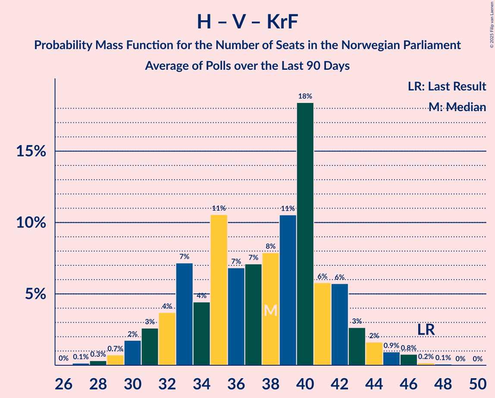

# Poll Average

<a href="#voting-intentions">Voting Intentions</a> | <a href="#seats">Seats</a> | <a href="#coalitions">Coalitions</a> | <a href="#technical-information">Technical Information</a>

## Summary

The table below lists the polls on which the average is based. They are the most recent polls (less than 90 days old) registered and analyzed so far.

| Period     | Polling firm/Commissioner(s) | Ap | H | FrP | Sp | SV | V | KrF | MDG | R |
|:----------:|:----------------------------:|:--:|:--:|:--:|:--:|:--:|:--:|:--:|:--:|:--:|
| 8–9 September 2013 | General Election | 27.4%   49 | 25.0%   45 | 15.2%   27 | 10.3%   19 | 6.0%   11 | 4.4%   8 | 4.2%   8 | 3.2%   1 | 2.4%   1 |
| N/A | Poll Average | 17–26%   30–48 | 21–29%   37–54 | 6–14%   10–26 | 16–24%   29–44 | 6–10%   11–18 | 2–6%   0–10 | 2–5%   0–8 | 3–6%   1–10 | 2–8%   1–13 |
| [5–10 March 2021](2021-03-10-ResponsAnalyse.html) | Respons Analyse   VG | 20–25%   36–45 | 25–31%   44–56 | 6–10%   11–17 | 16–21%   30–39 | 6–10%   11–17 | 2–5%   1–8 | 2–4%   0–3 | 3–5%   1–8 | 4–6%   2–11 |
| [1–8 March 2021](2021-03-08-OpinionPerduco.html) | Opinion Perduco | 20–26%   35–47 | 20–26%   35–47 | 7–12%   13–21 | 18–24%   33–44 | 6–10%   10–18 | 1–4%   0–2 | 2–4%   0–8 | 3–6%   1–10 | 4–7%   2–12 |
| [2–3 March 2021](2021-03-03-Norfakta.html) | Norfakta   Klassekampen and Nationen | 22–27%   40–51 | 21–27%   39–49 | 8–12%   15–22 | 15–20%   29–38 | 6–9%   11–17 | 3–5%   2–10 | 2–4%   0–3 | 3–5%   1–9 | 3–5%   1–9 |
| [22–28 February 2021](2021-02-28-Norstat.html) | Norstat   Aftenposten and NRK | 19–24%   33–43 | 22–27%   40–50 | 8–12%   14–22 | 20–25%   36–46 | 6–9%   11–17 | 2–4%   1–7 | 3–5%   1–10 | 3–5%   1–9 | 2–4%   1–7 |
| [22–26 February 2021](2021-02-26-KantarTNS.html) | Kantar TNS   TV2 | 16–21%   28–40 | 23–28%   41–53 | 6–9%   9–16 | 17–22%   33–42 | 7–10%   11–18 | 2–4%   1–6 | 2–5%   1–7 | 3–5%   2–9 | 5–9%   9–14 |
| [22–24 February 2021](2021-02-24-IpsosMMI.html) | Ipsos MMI   Dagbladet | 18–23%   31–43 | 20–26%   35–48 | 11–15%   18–29 | 15–21%   27–39 | 6–10%   10–18 | 3–6%   2–11 | 2–5%   1–8 | 3–5%   1–10 | 2–4%   1–7 |
| [9–14 February 2021](2021-02-14-Sentio.html) | Sentio   Amedia and Nettavisen | 19–24%   34–43 | 24–30%   43–55 | 6–9%   10–17 | 16–21%   29–39 | 7–11%   12–19 | 2–4%   0–3 | 2–5%   1–8 | 4–6%   2–11 | 3–5%   1–9 |
| 8–9 September 2013 | General Election | 27.4%   49 | 25.0%   45 | 15.2%   27 | 10.3%   19 | 6.0%   11 | 4.4%   8 | 4.2%   8 | 3.2%   1 | 2.4%   1 |

Only polls for which at least the sample size has been published are included in the table above.

**Legend:**
+ **Top half of each row:** Voting intentions (95% confidence interval)
+ **Bottom half of each row:** Seat projections for the Norwegian Parliament (95% confidence interval)
+ **Ap:** Arbeiderpartiet
+ **H:** Høyre
+ **FrP:** Fremskrittspartiet
+ **Sp:** Senterpartiet
+ **SV:** Sosialistisk Venstreparti
+ **V:** Venstre
+ **KrF:** Kristelig Folkeparti
+ **MDG:** Miljøpartiet De Grønne
+ **R:** Rødt
+ **N/A (single party):** Party not included the published results
+ **N/A (entire row):** Calculation for this opinion poll not started yet

## Voting Intentions

### Confidence Intervals

| Party | Last Result | Median | 80% Confidence Interval | 90% Confidence Interval | 95% Confidence Interval | 99% Confidence Interval |
|:-----:|:-----------:|:------:|:-----------------------:|:-----------------------:|:-----------------------:|:-----------------------:|
| <a href="#arbeiderpartiet">Arbeiderpartiet</a> | 27.4% | 21.4% | 18.5–24.4% |17.7–25.2% | 17.1–25.8% | 16.1–27.0% |
| <a href="#høyre">Høyre</a> | 25.0% | 24.9% | 22.1–28.1% |21.4–28.8% | 20.9–29.4% | 19.8–30.5% |
| <a href="#fremskrittspartiet">Fremskrittspartiet</a> | 15.2% | 9.0% | 6.9–12.4% |6.6–13.4% | 6.3–14.1% | 5.8–15.2% |
| <a href="#senterpartiet">Senterpartiet</a> | 10.3% | 19.0% | 16.9–22.2% |16.4–23.1% | 15.9–23.7% | 15.1–24.9% |
| <a href="#sosialistisk-venstreparti">Sosialistisk Venstreparti</a> | 6.0% | 8.0% | 6.7–9.3% |6.4–9.7% | 6.1–10.1% | 5.7–10.8% |
| <a href="#venstre">Venstre</a> | 4.4% | 3.2% | 2.2–4.7% |1.9–5.1% | 1.7–5.5% | 1.4–6.3% |
| <a href="#kristelig-folkeparti">Kristelig Folkeparti</a> | 4.2% | 3.2% | 2.3–4.2% |2.1–4.5% | 1.9–4.8% | 1.7–5.3% |
| <a href="#miljøpartiet-de-grønne">Miljøpartiet De Grønne</a> | 3.2% | 4.0% | 3.1–5.0% |2.9–5.4% | 2.7–5.7% | 2.4–6.3% |
| <a href="#rødt">Rødt</a> | 2.4% | 4.1% | 2.6–6.6% |2.3–7.2% | 2.1–7.7% | 1.7–8.5% |

### Arbeiderpartiet

*For a full overview of the results for this party, see the [Arbeiderpartiet](party-arbeiderpartiet.html) page.*

| Voting Intentions | Probability | Accumulated | Special Marks |
|:-----------------:|:-----------:|:-----------:|:-------------:|
| 13.5–14.5% | 0% | 100% |  |
| 14.5–15.5% | 0.1% | 100% |  |
| 15.5–16.5% | 1.0% | 99.9% |  |
| 16.5–17.5% | 3% | 98.9% |  |
| 17.5–18.5% | 6% | 96% |  |
| 18.5–19.5% | 10% | 89% |  |
| 19.5–20.5% | 14% | 80% |  |
| 20.5–21.5% | 18% | 66% | Median |
| 21.5–22.5% | 17% | 48% |  |
| 22.5–23.5% | 13% | 31% |  |
| 23.5–24.5% | 9% | 18% |  |
| 24.5–25.5% | 5% | 9% |  |
| 25.5–26.5% | 2% | 3% |  |
| 26.5–27.5% | 0.8% | 0.9% | Last Result |
| 27.5–28.5% | 0.2% | 0.2% |  |
| 28.5–29.5% | 0% | 0% |  |

### Høyre

*For a full overview of the results for this party, see the [Høyre](party-høyre.html) page.*

| Voting Intentions | Probability | Accumulated | Special Marks |
|:-----------------:|:-----------:|:-----------:|:-------------:|
| 17.5–18.5% | 0% | 100% |  |
| 18.5–19.5% | 0.3% | 100% |  |
| 19.5–20.5% | 1.3% | 99.7% |  |
| 20.5–21.5% | 4% | 98% |  |
| 21.5–22.5% | 9% | 94% |  |
| 22.5–23.5% | 13% | 86% |  |
| 23.5–24.5% | 16% | 72% |  |
| 24.5–25.5% | 16% | 56% | Last Result, Median |
| 25.5–26.5% | 14% | 40% |  |
| 26.5–27.5% | 12% | 26% |  |
| 27.5–28.5% | 8% | 14% |  |
| 28.5–29.5% | 4% | 6% |  |
| 29.5–30.5% | 2% | 2% |  |
| 30.5–31.5% | 0.4% | 0.5% |  |
| 31.5–32.5% | 0.1% | 0.1% |  |
| 32.5–33.5% | 0% | 0% |  |

### Fremskrittspartiet

*For a full overview of the results for this party, see the [Fremskrittspartiet](party-fremskrittspartiet.html) page.*

| Voting Intentions | Probability | Accumulated | Special Marks |
|:-----------------:|:-----------:|:-----------:|:-------------:|
| 3.5–4.5% | 0% | 100% |  |
| 4.5–5.5% | 0.2% | 100% |  |
| 5.5–6.5% | 5% | 99.8% |  |
| 6.5–7.5% | 17% | 95% |  |
| 7.5–8.5% | 21% | 78% |  |
| 8.5–9.5% | 18% | 57% | Median |
| 9.5–10.5% | 16% | 39% |  |
| 10.5–11.5% | 9% | 23% |  |
| 11.5–12.5% | 5% | 14% |  |
| 12.5–13.5% | 5% | 9% |  |
| 13.5–14.5% | 3% | 4% |  |
| 14.5–15.5% | 1.1% | 1.4% | Last Result |
| 15.5–16.5% | 0.3% | 0.3% |  |
| 16.5–17.5% | 0% | 0% |  |

### Senterpartiet

*For a full overview of the results for this party, see the [Senterpartiet](party-senterpartiet.html) page.*

| Voting Intentions | Probability | Accumulated | Special Marks |
|:-----------------:|:-----------:|:-----------:|:-------------:|
| 9.5–10.5% | 0% | 100% | Last Result |
| 10.5–11.5% | 0% | 100% |  |
| 11.5–12.5% | 0% | 100% |  |
| 12.5–13.5% | 0% | 100% |  |
| 13.5–14.5% | 0.1% | 100% |  |
| 14.5–15.5% | 1.1% | 99.9% |  |
| 15.5–16.5% | 5% | 98.7% |  |
| 16.5–17.5% | 13% | 94% |  |
| 17.5–18.5% | 21% | 80% |  |
| 18.5–19.5% | 20% | 60% | Median |
| 19.5–20.5% | 14% | 39% |  |
| 20.5–21.5% | 10% | 25% |  |
| 21.5–22.5% | 7% | 15% |  |
| 22.5–23.5% | 5% | 8% |  |
| 23.5–24.5% | 2% | 3% |  |
| 24.5–25.5% | 0.7% | 0.8% |  |
| 25.5–26.5% | 0.1% | 0.2% |  |
| 26.5–27.5% | 0% | 0% |  |

### Sosialistisk Venstreparti

*For a full overview of the results for this party, see the [Sosialistisk Venstreparti](party-sosialistiskvenstreparti.html) page.*

| Voting Intentions | Probability | Accumulated | Special Marks |
|:-----------------:|:-----------:|:-----------:|:-------------:|
| 3.5–4.5% | 0% | 100% |  |
| 4.5–5.5% | 0.3% | 100% |  |
| 5.5–6.5% | 7% | 99.7% | Last Result |
| 6.5–7.5% | 27% | 93% |  |
| 7.5–8.5% | 38% | 66% | Median |
| 8.5–9.5% | 22% | 29% |  |
| 9.5–10.5% | 6% | 7% |  |
| 10.5–11.5% | 0.8% | 0.9% |  |
| 11.5–12.5% | 0.1% | 0.1% |  |
| 12.5–13.5% | 0% | 0% |  |

### Venstre

*For a full overview of the results for this party, see the [Venstre](party-venstre.html) page.*

| Voting Intentions | Probability | Accumulated | Special Marks |
|:-----------------:|:-----------:|:-----------:|:-------------:|
| 0.0–0.5% | 0% | 100% |  |
| 0.5–1.5% | 1.3% | 100% |  |
| 1.5–2.5% | 21% | 98.7% |  |
| 2.5–3.5% | 43% | 77% | Median |
| 3.5–4.5% | 23% | 35% | Last Result |
| 4.5–5.5% | 9% | 11% |  |
| 5.5–6.5% | 2% | 2% |  |
| 6.5–7.5% | 0.2% | 0.2% |  |
| 7.5–8.5% | 0% | 0% |  |

### Kristelig Folkeparti

*For a full overview of the results for this party, see the [Kristelig Folkeparti](party-kristeligfolkeparti.html) page.*

| Voting Intentions | Probability | Accumulated | Special Marks |
|:-----------------:|:-----------:|:-----------:|:-------------:|
| 0.0–0.5% | 0% | 100% |  |
| 0.5–1.5% | 0.2% | 100% |  |
| 1.5–2.5% | 18% | 99.8% |  |
| 2.5–3.5% | 51% | 82% | Median |
| 3.5–4.5% | 27% | 31% | Last Result |
| 4.5–5.5% | 4% | 4% |  |
| 5.5–6.5% | 0.2% | 0.2% |  |
| 6.5–7.5% | 0% | 0% |  |

### Miljøpartiet De Grønne

*For a full overview of the results for this party, see the [Miljøpartiet De Grønne](party-miljøpartietdegrønne.html) page.*

| Voting Intentions | Probability | Accumulated | Special Marks |
|:-----------------:|:-----------:|:-----------:|:-------------:|
| 0.5–1.5% | 0% | 100% |  |
| 1.5–2.5% | 1.1% | 100% |  |
| 2.5–3.5% | 27% | 98.9% | Last Result |
| 3.5–4.5% | 49% | 72% | Median |
| 4.5–5.5% | 20% | 23% |  |
| 5.5–6.5% | 3% | 3% |  |
| 6.5–7.5% | 0.2% | 0.2% |  |
| 7.5–8.5% | 0% | 0% |  |

### Rødt

*For a full overview of the results for this party, see the [Rødt](party-rødt.html) page.*

| Voting Intentions | Probability | Accumulated | Special Marks |
|:-----------------:|:-----------:|:-----------:|:-------------:|
| 0.0–0.5% | 0% | 100% |  |
| 0.5–1.5% | 0.1% | 100% |  |
| 1.5–2.5% | 9% | 99.9% | Last Result |
| 2.5–3.5% | 25% | 91% |  |
| 3.5–4.5% | 28% | 65% | Median |
| 4.5–5.5% | 18% | 37% |  |
| 5.5–6.5% | 9% | 19% |  |
| 6.5–7.5% | 7% | 10% |  |
| 7.5–8.5% | 3% | 3% |  |
| 8.5–9.5% | 0.4% | 0.4% |  |
| 9.5–10.5% | 0% | 0% |  |

## Seats

### Confidence Intervals

| Party | Last Result | Median | 80% Confidence Interval | 90% Confidence Interval | 95% Confidence Interval | 99% Confidence Interval |
|:-----:|:-----------:|:------:|:-----------------------:|:-----------------------:|:-----------------------:|:-----------------------:|
| <a href="#arbeiderpartiet">Arbeiderpartiet</a> | 49 | 40 | 34–45 |32–47 | 30–48 | 28–50 |
| <a href="#høyre">Høyre</a> | 45 | 45 | 40–51 |38–52 | 37–54 | 35–57 |
| <a href="#fremskrittspartiet">Fremskrittspartiet</a> | 27 | 16 | 12–22 |11–24 | 10–26 | 9–28 |
| <a href="#senterpartiet">Senterpartiet</a> | 19 | 36 | 31–41 |30–43 | 29–44 | 27–46 |
| <a href="#sosialistisk-venstreparti">Sosialistisk Venstreparti</a> | 11 | 14 | 12–17 |11–17 | 11–18 | 10–20 |
| <a href="#venstre">Venstre</a> | 8 | 2 | 1–8 |1–9 | 0–10 | 0–11 |
| <a href="#kristelig-folkeparti">Kristelig Folkeparti</a> | 8 | 2 | 1–7 |0–8 | 0–8 | 0–9 |
| <a href="#miljøpartiet-de-grønne">Miljøpartiet De Grønne</a> | 1 | 3 | 2–9 |1–10 | 1–10 | 1–11 |
| <a href="#rødt">Rødt</a> | 1 | 7 | 1–11 |1–12 | 1–13 | 1–14 |

### Arbeiderpartiet

*For a full overview of the results for this party, see the [Arbeiderpartiet](party-arbeiderpartiet.html) page.*

| Number of Seats | Probability | Accumulated | Special Marks |
|:---------------:|:-----------:|:-----------:|:-------------:|
| 27 | 0.3% | 100% |  |
| 28 | 0.5% | 99.7% |  |
| 29 | 0.7% | 99.2% |  |
| 30 | 1.2% | 98.5% |  |
| 31 | 2% | 97% |  |
| 32 | 2% | 95% |  |
| 33 | 2% | 93% |  |
| 34 | 3% | 92% |  |
| 35 | 4% | 89% |  |
| 36 | 6% | 84% |  |
| 37 | 7% | 78% |  |
| 38 | 8% | 71% |  |
| 39 | 10% | 63% |  |
| 40 | 10% | 54% | Median |
| 41 | 12% | 44% |  |
| 42 | 8% | 32% |  |
| 43 | 7% | 24% |  |
| 44 | 5% | 17% |  |
| 45 | 4% | 11% |  |
| 46 | 2% | 8% |  |
| 47 | 2% | 5% |  |
| 48 | 2% | 3% |  |
| 49 | 0.7% | 1.4% | Last Result |
| 50 | 0.3% | 0.7% |  |
| 51 | 0.3% | 0.4% |  |
| 52 | 0.1% | 0.1% |  |
| 53 | 0% | 0.1% |  |
| 54 | 0% | 0% |  |

### Høyre

*For a full overview of the results for this party, see the [Høyre](party-høyre.html) page.*

| Number of Seats | Probability | Accumulated | Special Marks |
|:---------------:|:-----------:|:-----------:|:-------------:|
| 33 | 0.1% | 100% |  |
| 34 | 0.3% | 99.9% |  |
| 35 | 0.5% | 99.5% |  |
| 36 | 1.0% | 99.0% |  |
| 37 | 2% | 98% |  |
| 38 | 2% | 96% |  |
| 39 | 4% | 94% |  |
| 40 | 6% | 90% |  |
| 41 | 6% | 84% |  |
| 42 | 7% | 79% |  |
| 43 | 8% | 71% |  |
| 44 | 10% | 63% |  |
| 45 | 9% | 53% | Last Result, Median |
| 46 | 9% | 44% |  |
| 47 | 5% | 36% |  |
| 48 | 6% | 30% |  |
| 49 | 5% | 24% |  |
| 50 | 7% | 19% |  |
| 51 | 3% | 13% |  |
| 52 | 5% | 10% |  |
| 53 | 2% | 5% |  |
| 54 | 1.4% | 3% |  |
| 55 | 0.6% | 1.3% |  |
| 56 | 0.2% | 0.7% |  |
| 57 | 0.1% | 0.5% |  |
| 58 | 0.3% | 0.4% |  |
| 59 | 0.1% | 0.1% |  |
| 60 | 0% | 0% |  |

### Fremskrittspartiet

*For a full overview of the results for this party, see the [Fremskrittspartiet](party-fremskrittspartiet.html) page.*

| Number of Seats | Probability | Accumulated | Special Marks |
|:---------------:|:-----------:|:-----------:|:-------------:|
| 8 | 0.2% | 100% |  |
| 9 | 0.9% | 99.8% |  |
| 10 | 3% | 98.9% |  |
| 11 | 4% | 96% |  |
| 12 | 6% | 92% |  |
| 13 | 11% | 86% |  |
| 14 | 9% | 75% |  |
| 15 | 10% | 66% |  |
| 16 | 10% | 56% | Median |
| 17 | 10% | 45% |  |
| 18 | 7% | 35% |  |
| 19 | 7% | 28% |  |
| 20 | 5% | 21% |  |
| 21 | 4% | 16% |  |
| 22 | 3% | 12% |  |
| 23 | 2% | 8% |  |
| 24 | 2% | 6% |  |
| 25 | 1.0% | 4% |  |
| 26 | 1.3% | 3% |  |
| 27 | 0.9% | 2% | Last Result |
| 28 | 0.4% | 0.8% |  |
| 29 | 0.3% | 0.4% |  |
| 30 | 0.1% | 0.1% |  |
| 31 | 0% | 0% |  |

### Senterpartiet

*For a full overview of the results for this party, see the [Senterpartiet](party-senterpartiet.html) page.*

| Number of Seats | Probability | Accumulated | Special Marks |
|:---------------:|:-----------:|:-----------:|:-------------:|
| 19 | 0% | 100% | Last Result |
| 20 | 0% | 100% |  |
| 21 | 0% | 100% |  |
| 22 | 0% | 100% |  |
| 23 | 0% | 100% |  |
| 24 | 0% | 100% |  |
| 25 | 0% | 100% |  |
| 26 | 0.2% | 100% |  |
| 27 | 0.7% | 99.7% |  |
| 28 | 1.3% | 99.0% |  |
| 29 | 2% | 98% |  |
| 30 | 3% | 96% |  |
| 31 | 4% | 93% |  |
| 32 | 5% | 89% |  |
| 33 | 8% | 83% |  |
| 34 | 12% | 76% |  |
| 35 | 13% | 64% |  |
| 36 | 16% | 51% | Median |
| 37 | 9% | 35% |  |
| 38 | 6% | 27% |  |
| 39 | 4% | 21% |  |
| 40 | 5% | 17% |  |
| 41 | 3% | 12% |  |
| 42 | 3% | 9% |  |
| 43 | 2% | 6% |  |
| 44 | 2% | 4% |  |
| 45 | 0.9% | 1.5% |  |
| 46 | 0.3% | 0.6% |  |
| 47 | 0.1% | 0.2% |  |
| 48 | 0.1% | 0.1% |  |
| 49 | 0% | 0% |  |

### Sosialistisk Venstreparti

*For a full overview of the results for this party, see the [Sosialistisk Venstreparti](party-sosialistiskvenstreparti.html) page.*

| Number of Seats | Probability | Accumulated | Special Marks |
|:---------------:|:-----------:|:-----------:|:-------------:|
| 9 | 0.4% | 100% |  |
| 10 | 2% | 99.6% |  |
| 11 | 6% | 98% | Last Result |
| 12 | 12% | 92% |  |
| 13 | 20% | 80% |  |
| 14 | 22% | 60% | Median |
| 15 | 17% | 39% |  |
| 16 | 10% | 22% |  |
| 17 | 7% | 12% |  |
| 18 | 3% | 5% |  |
| 19 | 1.3% | 2% |  |
| 20 | 0.4% | 0.5% |  |
| 21 | 0.1% | 0.2% |  |
| 22 | 0% | 0% |  |

### Venstre

*For a full overview of the results for this party, see the [Venstre](party-venstre.html) page.*

| Number of Seats | Probability | Accumulated | Special Marks |
|:---------------:|:-----------:|:-----------:|:-------------:|
| 0 | 4% | 100% |  |
| 1 | 11% | 96% |  |
| 2 | 62% | 85% | Median |
| 3 | 3% | 24% |  |
| 4 | 0.2% | 21% |  |
| 5 | 0% | 21% |  |
| 6 | 0.4% | 21% |  |
| 7 | 4% | 20% |  |
| 8 | 9% | 16% | Last Result |
| 9 | 4% | 8% |  |
| 10 | 3% | 4% |  |
| 11 | 0.8% | 1.1% |  |
| 12 | 0.2% | 0.3% |  |
| 13 | 0.1% | 0.1% |  |
| 14 | 0% | 0% |  |

### Kristelig Folkeparti

*For a full overview of the results for this party, see the [Kristelig Folkeparti](party-kristeligfolkeparti.html) page.*

| Number of Seats | Probability | Accumulated | Special Marks |
|:---------------:|:-----------:|:-----------:|:-------------:|
| 0 | 7% | 100% |  |
| 1 | 38% | 93% |  |
| 2 | 17% | 55% | Median |
| 3 | 25% | 38% |  |
| 4 | 0% | 13% |  |
| 5 | 0% | 13% |  |
| 6 | 0.9% | 13% |  |
| 7 | 6% | 13% |  |
| 8 | 5% | 7% | Last Result |
| 9 | 1.3% | 2% |  |
| 10 | 0.4% | 0.5% |  |
| 11 | 0.1% | 0.1% |  |
| 12 | 0% | 0% |  |

### Miljøpartiet De Grønne

*For a full overview of the results for this party, see the [Miljøpartiet De Grønne](party-miljøpartietdegrønne.html) page.*

| Number of Seats | Probability | Accumulated | Special Marks |
|:---------------:|:-----------:|:-----------:|:-------------:|
| 1 | 6% | 100% | Last Result |
| 2 | 36% | 94% |  |
| 3 | 9% | 59% | Median |
| 4 | 0.8% | 50% |  |
| 5 | 0% | 49% |  |
| 6 | 1.4% | 49% |  |
| 7 | 14% | 47% |  |
| 8 | 19% | 34% |  |
| 9 | 9% | 15% |  |
| 10 | 4% | 6% |  |
| 11 | 0.9% | 1.2% |  |
| 12 | 0.2% | 0.3% |  |
| 13 | 0% | 0% |  |

### Rødt

*For a full overview of the results for this party, see the [Rødt](party-rødt.html) page.*

| Number of Seats | Probability | Accumulated | Special Marks |
|:---------------:|:-----------:|:-----------:|:-------------:|
| 1 | 13% | 100% | Last Result |
| 2 | 33% | 87% |  |
| 3 | 0% | 53% |  |
| 4 | 0% | 53% |  |
| 5 | 0% | 53% |  |
| 6 | 0.6% | 53% |  |
| 7 | 6% | 53% | Median |
| 8 | 15% | 46% |  |
| 9 | 10% | 31% |  |
| 10 | 7% | 21% |  |
| 11 | 6% | 13% |  |
| 12 | 4% | 8% |  |
| 13 | 2% | 4% |  |
| 14 | 1.3% | 2% |  |
| 15 | 0.3% | 0.4% |  |
| 16 | 0.1% | 0.1% |  |
| 17 | 0% | 0% |  |

## Coalitions

### Confidence Intervals

| Coalition | Last Result | Median | Majority? | 80% Confidence Interval | 90% Confidence Interval | 95% Confidence Interval | 99% Confidence Interval |
|:---------:|:-----------:|:------:|:---------:|:-----------------------:|:-----------------------:|:-----------------------:|:-----------------------:|
| Høyre – Fremskrittspartiet – Senterpartiet – Venstre – Kristelig Folkeparti | 107 | 103 | 100% | 96–111 | 95–113 | 93–115 | 91–117 |
| Arbeiderpartiet – Senterpartiet – Sosialistisk Venstreparti – Miljøpartiet De Grønne – Rødt | 81 | 101 | 98% | 92–108 | 89–110 | 86–112 | 81–114 |
| Arbeiderpartiet – Senterpartiet – Sosialistisk Venstreparti – Kristelig Folkeparti – Miljøpartiet De Grønne | 88 | 97 | 98.7% | 89–104 | 88–106 | 86–108 | 82–110 |
| Arbeiderpartiet – Senterpartiet – Sosialistisk Venstreparti – Rødt | 80 | 96 | 95% | 87–102 | 85–104 | 82–106 | 78–109 |
| Arbeiderpartiet – Senterpartiet – Sosialistisk Venstreparti – Miljøpartiet De Grønne | 80 | 95 | 96% | 87–101 | 85–103 | 83–104 | 79–107 |
| Arbeiderpartiet – Senterpartiet – Sosialistisk Venstreparti | 79 | 90 | 84% | 83–96 | 81–97 | 79–99 | 76–102 |
| Arbeiderpartiet – Senterpartiet – Kristelig Folkeparti – Miljøpartiet De Grønne | 77 | 83 | 39% | 75–91 | 73–92 | 71–94 | 68–96 |
| Arbeiderpartiet – Senterpartiet – Kristelig Folkeparti | 76 | 78 | 11% | 71–85 | 69–87 | 68–89 | 65–91 |
| Arbeiderpartiet – Senterpartiet | 68 | 76 | 2% | 69–81 | 67–83 | 65–84 | 62–87 |
| Høyre – Fremskrittspartiet – Venstre – Kristelig Folkeparti – Miljøpartiet De Grønne | 89 | 72 | 2% | 66–79 | 63–82 | 62–84 | 59–89 |
| Høyre – Fremskrittspartiet – Venstre – Kristelig Folkeparti | 88 | 68 | 0.3% | 60–74 | 58–77 | 57–80 | 54–83 |
| Høyre – Fremskrittspartiet – Venstre | 80 | 65 | 0% | 58–72 | 56–75 | 55–77 | 52–81 |
| Høyre – Fremskrittspartiet | 72 | 61 | 0% | 56–67 | 55–69 | 53–70 | 50–73 |
| Arbeiderpartiet – Sosialistisk Venstreparti | 60 | 54 | 0% | 48–59 | 46–61 | 44–62 | 42–65 |
| Høyre – Venstre – Kristelig Folkeparti | 61 | 51 | 0% | 44–56 | 42–58 | 41–59 | 39–62 |
| Senterpartiet – Venstre – Kristelig Folkeparti | 35 | 41 | 0% | 36–48 | 35–50 | 34–52 | 32–54 |

### Høyre – Fremskrittspartiet – Senterpartiet – Venstre – Kristelig Folkeparti

| Number of Seats | Probability | Accumulated | Special Marks |
|:---------------:|:-----------:|:-----------:|:-------------:|
| 89 | 0.1% | 100% |  |
| 90 | 0.1% | 99.9% |  |
| 91 | 0.3% | 99.7% |  |
| 92 | 0.5% | 99.5% |  |
| 93 | 1.5% | 99.0% |  |
| 94 | 1.4% | 97% |  |
| 95 | 3% | 96% |  |
| 96 | 4% | 93% |  |
| 97 | 5% | 89% |  |
| 98 | 4% | 84% |  |
| 99 | 7% | 80% |  |
| 100 | 7% | 72% |  |
| 101 | 8% | 65% | Median |
| 102 | 7% | 57% |  |
| 103 | 6% | 51% |  |
| 104 | 6% | 45% |  |
| 105 | 7% | 39% |  |
| 106 | 5% | 32% |  |
| 107 | 6% | 27% | Last Result |
| 108 | 4% | 21% |  |
| 109 | 2% | 17% |  |
| 110 | 3% | 14% |  |
| 111 | 2% | 11% |  |
| 112 | 3% | 9% |  |
| 113 | 2% | 6% |  |
| 114 | 1.2% | 4% |  |
| 115 | 1.3% | 3% |  |
| 116 | 0.5% | 2% |  |
| 117 | 0.7% | 1.2% |  |
| 118 | 0.2% | 0.5% |  |
| 119 | 0.2% | 0.3% |  |
| 120 | 0.1% | 0.1% |  |
| 121 | 0% | 0.1% |  |
| 122 | 0% | 0% |  |

### Arbeiderpartiet – Senterpartiet – Sosialistisk Venstreparti – Miljøpartiet De Grønne – Rødt

| Number of Seats | Probability | Accumulated | Special Marks |
|:---------------:|:-----------:|:-----------:|:-------------:|
| 79 | 0.1% | 100% |  |
| 80 | 0.2% | 99.9% |  |
| 81 | 0.3% | 99.7% | Last Result |
| 82 | 0.3% | 99.4% |  |
| 83 | 0.4% | 99.1% |  |
| 84 | 0.2% | 98.7% |  |
| 85 | 0.6% | 98% | Majority |
| 86 | 0.6% | 98% |  |
| 87 | 1.0% | 97% |  |
| 88 | 0.9% | 96% |  |
| 89 | 2% | 95% |  |
| 90 | 1.1% | 94% |  |
| 91 | 1.3% | 93% |  |
| 92 | 2% | 91% |  |
| 93 | 2% | 90% |  |
| 94 | 2% | 88% |  |
| 95 | 3% | 85% |  |
| 96 | 4% | 82% |  |
| 97 | 5% | 78% |  |
| 98 | 7% | 73% |  |
| 99 | 7% | 66% |  |
| 100 | 8% | 59% | Median |
| 101 | 9% | 51% |  |
| 102 | 6% | 42% |  |
| 103 | 7% | 36% |  |
| 104 | 6% | 29% |  |
| 105 | 4% | 23% |  |
| 106 | 5% | 19% |  |
| 107 | 3% | 14% |  |
| 108 | 3% | 12% |  |
| 109 | 2% | 8% |  |
| 110 | 2% | 6% |  |
| 111 | 1.4% | 4% |  |
| 112 | 1.0% | 3% |  |
| 113 | 0.7% | 2% |  |
| 114 | 0.6% | 1.0% |  |
| 115 | 0.2% | 0.4% |  |
| 116 | 0.1% | 0.2% |  |
| 117 | 0% | 0.1% |  |
| 118 | 0% | 0% |  |

### Arbeiderpartiet – Senterpartiet – Sosialistisk Venstreparti – Kristelig Folkeparti – Miljøpartiet De Grønne

| Number of Seats | Probability | Accumulated | Special Marks |
|:---------------:|:-----------:|:-----------:|:-------------:|
| 79 | 0% | 100% |  |
| 80 | 0.1% | 99.9% |  |
| 81 | 0.1% | 99.8% |  |
| 82 | 0.3% | 99.7% |  |
| 83 | 0.3% | 99.4% |  |
| 84 | 0.3% | 99.1% |  |
| 85 | 1.2% | 98.7% | Majority |
| 86 | 0.8% | 98% |  |
| 87 | 1.4% | 97% |  |
| 88 | 2% | 95% | Last Result |
| 89 | 4% | 93% |  |
| 90 | 3% | 90% |  |
| 91 | 4% | 87% |  |
| 92 | 6% | 83% |  |
| 93 | 5% | 77% |  |
| 94 | 5% | 71% |  |
| 95 | 7% | 66% | Median |
| 96 | 5% | 59% |  |
| 97 | 6% | 54% |  |
| 98 | 5% | 48% |  |
| 99 | 7% | 43% |  |
| 100 | 5% | 35% |  |
| 101 | 6% | 30% |  |
| 102 | 5% | 24% |  |
| 103 | 5% | 19% |  |
| 104 | 4% | 14% |  |
| 105 | 2% | 9% |  |
| 106 | 3% | 7% |  |
| 107 | 2% | 4% |  |
| 108 | 1.4% | 3% |  |
| 109 | 0.5% | 1.1% |  |
| 110 | 0.4% | 0.6% |  |
| 111 | 0.1% | 0.2% |  |
| 112 | 0.1% | 0.1% |  |
| 113 | 0% | 0% |  |

### Arbeiderpartiet – Senterpartiet – Sosialistisk Venstreparti – Rødt

| Number of Seats | Probability | Accumulated | Special Marks |
|:---------------:|:-----------:|:-----------:|:-------------:|
| 73 | 0.1% | 100% |  |
| 74 | 0% | 99.9% |  |
| 75 | 0% | 99.9% |  |
| 76 | 0.1% | 99.9% |  |
| 77 | 0.1% | 99.8% |  |
| 78 | 0.2% | 99.6% |  |
| 79 | 0.3% | 99.4% |  |
| 80 | 0.7% | 99.1% | Last Result |
| 81 | 0.6% | 98% |  |
| 82 | 0.5% | 98% |  |
| 83 | 1.1% | 97% |  |
| 84 | 0.8% | 96% |  |
| 85 | 2% | 95% | Majority |
| 86 | 1.5% | 94% |  |
| 87 | 3% | 92% |  |
| 88 | 2% | 90% |  |
| 89 | 3% | 88% |  |
| 90 | 3% | 85% |  |
| 91 | 5% | 82% |  |
| 92 | 4% | 77% |  |
| 93 | 5% | 73% |  |
| 94 | 7% | 67% |  |
| 95 | 6% | 60% |  |
| 96 | 10% | 54% |  |
| 97 | 9% | 45% | Median |
| 98 | 7% | 36% |  |
| 99 | 7% | 29% |  |
| 100 | 5% | 22% |  |
| 101 | 5% | 17% |  |
| 102 | 3% | 12% |  |
| 103 | 3% | 9% |  |
| 104 | 2% | 6% |  |
| 105 | 1.3% | 4% |  |
| 106 | 1.0% | 3% |  |
| 107 | 0.8% | 2% |  |
| 108 | 0.3% | 0.9% |  |
| 109 | 0.2% | 0.6% |  |
| 110 | 0.2% | 0.4% |  |
| 111 | 0.1% | 0.1% |  |
| 112 | 0% | 0.1% |  |
| 113 | 0% | 0.1% |  |
| 114 | 0% | 0% |  |

### Arbeiderpartiet – Senterpartiet – Sosialistisk Venstreparti – Miljøpartiet De Grønne

| Number of Seats | Probability | Accumulated | Special Marks |
|:---------------:|:-----------:|:-----------:|:-------------:|
| 77 | 0% | 100% |  |
| 78 | 0.2% | 99.9% |  |
| 79 | 0.2% | 99.7% |  |
| 80 | 0.3% | 99.4% | Last Result |
| 81 | 0.5% | 99.1% |  |
| 82 | 0.5% | 98.6% |  |
| 83 | 0.8% | 98% |  |
| 84 | 1.2% | 97% |  |
| 85 | 1.4% | 96% | Majority |
| 86 | 2% | 95% |  |
| 87 | 3% | 92% |  |
| 88 | 4% | 89% |  |
| 89 | 4% | 85% |  |
| 90 | 4% | 82% |  |
| 91 | 7% | 77% |  |
| 92 | 5% | 70% |  |
| 93 | 6% | 65% | Median |
| 94 | 8% | 59% |  |
| 95 | 5% | 52% |  |
| 96 | 9% | 47% |  |
| 97 | 5% | 38% |  |
| 98 | 7% | 32% |  |
| 99 | 6% | 26% |  |
| 100 | 5% | 19% |  |
| 101 | 4% | 14% |  |
| 102 | 3% | 10% |  |
| 103 | 3% | 7% |  |
| 104 | 2% | 4% |  |
| 105 | 1.0% | 2% |  |
| 106 | 0.4% | 1.0% |  |
| 107 | 0.4% | 0.6% |  |
| 108 | 0.1% | 0.2% |  |
| 109 | 0.1% | 0.1% |  |
| 110 | 0% | 0.1% |  |
| 111 | 0% | 0% |  |

### Arbeiderpartiet – Senterpartiet – Sosialistisk Venstreparti

| Number of Seats | Probability | Accumulated | Special Marks |
|:---------------:|:-----------:|:-----------:|:-------------:|
| 72 | 0.1% | 100% |  |
| 73 | 0% | 99.9% |  |
| 74 | 0.1% | 99.9% |  |
| 75 | 0.2% | 99.8% |  |
| 76 | 0.4% | 99.6% |  |
| 77 | 0.3% | 99.3% |  |
| 78 | 0.8% | 99.0% |  |
| 79 | 1.3% | 98% | Last Result |
| 80 | 1.4% | 97% |  |
| 81 | 1.5% | 96% |  |
| 82 | 2% | 94% |  |
| 83 | 4% | 92% |  |
| 84 | 4% | 88% |  |
| 85 | 5% | 84% | Majority |
| 86 | 6% | 79% |  |
| 87 | 6% | 73% |  |
| 88 | 7% | 67% |  |
| 89 | 8% | 60% |  |
| 90 | 6% | 52% | Median |
| 91 | 9% | 45% |  |
| 92 | 7% | 36% |  |
| 93 | 7% | 29% |  |
| 94 | 7% | 23% |  |
| 95 | 5% | 16% |  |
| 96 | 3% | 10% |  |
| 97 | 3% | 7% |  |
| 98 | 2% | 4% |  |
| 99 | 0.9% | 3% |  |
| 100 | 0.6% | 2% |  |
| 101 | 0.5% | 1.0% |  |
| 102 | 0.4% | 0.5% |  |
| 103 | 0.1% | 0.2% |  |
| 104 | 0.1% | 0.1% |  |
| 105 | 0% | 0.1% |  |
| 106 | 0% | 0% |  |

### Arbeiderpartiet – Senterpartiet – Kristelig Folkeparti – Miljøpartiet De Grønne

| Number of Seats | Probability | Accumulated | Special Marks |
|:---------------:|:-----------:|:-----------:|:-------------:|
| 66 | 0.1% | 100% |  |
| 67 | 0.2% | 99.8% |  |
| 68 | 0.3% | 99.7% |  |
| 69 | 0.4% | 99.3% |  |
| 70 | 0.7% | 98.9% |  |
| 71 | 0.8% | 98% |  |
| 72 | 1.3% | 97% |  |
| 73 | 1.2% | 96% |  |
| 74 | 2% | 95% |  |
| 75 | 3% | 92% |  |
| 76 | 4% | 90% |  |
| 77 | 3% | 86% | Last Result |
| 78 | 4% | 82% |  |
| 79 | 7% | 78% |  |
| 80 | 6% | 72% |  |
| 81 | 6% | 66% | Median |
| 82 | 7% | 60% |  |
| 83 | 7% | 53% |  |
| 84 | 8% | 46% |  |
| 85 | 6% | 39% | Majority |
| 86 | 4% | 33% |  |
| 87 | 6% | 29% |  |
| 88 | 4% | 23% |  |
| 89 | 5% | 19% |  |
| 90 | 3% | 14% |  |
| 91 | 4% | 11% |  |
| 92 | 3% | 7% |  |
| 93 | 2% | 4% |  |
| 94 | 0.9% | 3% |  |
| 95 | 0.6% | 2% |  |
| 96 | 0.9% | 1.3% |  |
| 97 | 0.2% | 0.4% |  |
| 98 | 0.1% | 0.2% |  |
| 99 | 0% | 0.1% |  |
| 100 | 0% | 0% |  |

### Arbeiderpartiet – Senterpartiet – Kristelig Folkeparti

| Number of Seats | Probability | Accumulated | Special Marks |
|:---------------:|:-----------:|:-----------:|:-------------:|
| 60 | 0% | 100% |  |
| 61 | 0% | 99.9% |  |
| 62 | 0% | 99.9% |  |
| 63 | 0.1% | 99.9% |  |
| 64 | 0.2% | 99.8% |  |
| 65 | 0.3% | 99.6% |  |
| 66 | 0.5% | 99.2% |  |
| 67 | 0.9% | 98.7% |  |
| 68 | 2% | 98% |  |
| 69 | 2% | 96% |  |
| 70 | 2% | 94% |  |
| 71 | 3% | 92% |  |
| 72 | 5% | 89% |  |
| 73 | 5% | 85% |  |
| 74 | 7% | 79% |  |
| 75 | 6% | 73% |  |
| 76 | 7% | 67% | Last Result |
| 77 | 9% | 59% |  |
| 78 | 6% | 51% | Median |
| 79 | 6% | 45% |  |
| 80 | 7% | 39% |  |
| 81 | 7% | 31% |  |
| 82 | 6% | 25% |  |
| 83 | 4% | 19% |  |
| 84 | 3% | 15% |  |
| 85 | 3% | 11% | Majority |
| 86 | 2% | 9% |  |
| 87 | 2% | 7% |  |
| 88 | 1.2% | 5% |  |
| 89 | 2% | 3% |  |
| 90 | 0.5% | 1.0% |  |
| 91 | 0.2% | 0.5% |  |
| 92 | 0.2% | 0.3% |  |
| 93 | 0.1% | 0.1% |  |
| 94 | 0% | 0% |  |

### Arbeiderpartiet – Senterpartiet

| Number of Seats | Probability | Accumulated | Special Marks |
|:---------------:|:-----------:|:-----------:|:-------------:|
| 58 | 0.1% | 100% |  |
| 59 | 0% | 99.9% |  |
| 60 | 0.1% | 99.9% |  |
| 61 | 0.2% | 99.9% |  |
| 62 | 0.2% | 99.7% |  |
| 63 | 0.4% | 99.4% |  |
| 64 | 0.9% | 99.0% |  |
| 65 | 1.1% | 98% |  |
| 66 | 2% | 97% |  |
| 67 | 2% | 95% |  |
| 68 | 2% | 93% | Last Result |
| 69 | 4% | 91% |  |
| 70 | 4% | 87% |  |
| 71 | 5% | 83% |  |
| 72 | 6% | 78% |  |
| 73 | 8% | 72% |  |
| 74 | 6% | 64% |  |
| 75 | 6% | 58% |  |
| 76 | 8% | 52% | Median |
| 77 | 8% | 44% |  |
| 78 | 8% | 37% |  |
| 79 | 5% | 28% |  |
| 80 | 7% | 23% |  |
| 81 | 7% | 16% |  |
| 82 | 3% | 9% |  |
| 83 | 2% | 6% |  |
| 84 | 2% | 4% |  |
| 85 | 0.8% | 2% | Majority |
| 86 | 0.8% | 1.5% |  |
| 87 | 0.4% | 0.7% |  |
| 88 | 0.1% | 0.3% |  |
| 89 | 0.1% | 0.2% |  |
| 90 | 0% | 0.1% |  |
| 91 | 0% | 0% |  |

### Høyre – Fremskrittspartiet – Venstre – Kristelig Folkeparti – Miljøpartiet De Grønne

| Number of Seats | Probability | Accumulated | Special Marks |
|:---------------:|:-----------:|:-----------:|:-------------:|
| 56 | 0.1% | 100% |  |
| 57 | 0.1% | 99.9% |  |
| 58 | 0.1% | 99.8% |  |
| 59 | 0.4% | 99.7% |  |
| 60 | 0.5% | 99.4% |  |
| 61 | 0.7% | 98.8% |  |
| 62 | 1.3% | 98% |  |
| 63 | 2% | 97% |  |
| 64 | 2% | 95% |  |
| 65 | 2% | 93% |  |
| 66 | 4% | 91% |  |
| 67 | 4% | 87% |  |
| 68 | 6% | 83% | Median |
| 69 | 5% | 77% |  |
| 70 | 7% | 72% |  |
| 71 | 7% | 64% |  |
| 72 | 10% | 58% |  |
| 73 | 10% | 48% |  |
| 74 | 7% | 38% |  |
| 75 | 6% | 31% |  |
| 76 | 5% | 25% |  |
| 77 | 4% | 20% |  |
| 78 | 4% | 16% |  |
| 79 | 2% | 12% |  |
| 80 | 3% | 9% |  |
| 81 | 1.4% | 7% |  |
| 82 | 1.4% | 5% |  |
| 83 | 1.1% | 4% |  |
| 84 | 1.0% | 3% |  |
| 85 | 0.4% | 2% | Majority |
| 86 | 0.3% | 1.4% |  |
| 87 | 0.2% | 1.2% |  |
| 88 | 0.4% | 0.9% |  |
| 89 | 0.4% | 0.5% | Last Result |
| 90 | 0.1% | 0.2% |  |
| 91 | 0% | 0.1% |  |
| 92 | 0% | 0% |  |

### Høyre – Fremskrittspartiet – Venstre – Kristelig Folkeparti

| Number of Seats | Probability | Accumulated | Special Marks |
|:---------------:|:-----------:|:-----------:|:-------------:|
| 51 | 0% | 100% |  |
| 52 | 0.1% | 99.9% |  |
| 53 | 0.2% | 99.8% |  |
| 54 | 0.3% | 99.7% |  |
| 55 | 0.7% | 99.4% |  |
| 56 | 0.9% | 98.7% |  |
| 57 | 1.2% | 98% |  |
| 58 | 2% | 97% |  |
| 59 | 3% | 95% |  |
| 60 | 3% | 92% |  |
| 61 | 6% | 89% |  |
| 62 | 3% | 83% |  |
| 63 | 6% | 80% |  |
| 64 | 5% | 74% |  |
| 65 | 7% | 69% | Median |
| 66 | 7% | 63% |  |
| 67 | 6% | 56% |  |
| 68 | 8% | 50% |  |
| 69 | 8% | 42% |  |
| 70 | 7% | 34% |  |
| 71 | 8% | 28% |  |
| 72 | 5% | 20% |  |
| 73 | 3% | 15% |  |
| 74 | 3% | 12% |  |
| 75 | 2% | 9% |  |
| 76 | 2% | 7% |  |
| 77 | 1.0% | 6% |  |
| 78 | 0.9% | 5% |  |
| 79 | 0.8% | 4% |  |
| 80 | 0.7% | 3% |  |
| 81 | 0.7% | 2% |  |
| 82 | 0.7% | 1.4% |  |
| 83 | 0.3% | 0.7% |  |
| 84 | 0.1% | 0.4% |  |
| 85 | 0.1% | 0.3% | Majority |
| 86 | 0.1% | 0.2% |  |
| 87 | 0.1% | 0.1% |  |
| 88 | 0% | 0% | Last Result |

### Høyre – Fremskrittspartiet – Venstre

| Number of Seats | Probability | Accumulated | Special Marks |
|:---------------:|:-----------:|:-----------:|:-------------:|
| 49 | 0.1% | 100% |  |
| 50 | 0.1% | 99.9% |  |
| 51 | 0.2% | 99.8% |  |
| 52 | 0.4% | 99.6% |  |
| 53 | 0.4% | 99.2% |  |
| 54 | 0.7% | 98.8% |  |
| 55 | 1.4% | 98% |  |
| 56 | 2% | 97% |  |
| 57 | 3% | 95% |  |
| 58 | 5% | 92% |  |
| 59 | 5% | 86% |  |
| 60 | 5% | 82% |  |
| 61 | 6% | 77% |  |
| 62 | 7% | 71% |  |
| 63 | 7% | 64% | Median |
| 64 | 6% | 58% |  |
| 65 | 7% | 51% |  |
| 66 | 6% | 44% |  |
| 67 | 6% | 38% |  |
| 68 | 7% | 32% |  |
| 69 | 6% | 25% |  |
| 70 | 5% | 18% |  |
| 71 | 3% | 14% |  |
| 72 | 2% | 11% |  |
| 73 | 2% | 9% |  |
| 74 | 1.4% | 7% |  |
| 75 | 1.4% | 5% |  |
| 76 | 0.6% | 4% |  |
| 77 | 1.0% | 3% |  |
| 78 | 0.6% | 2% |  |
| 79 | 0.4% | 2% |  |
| 80 | 0.5% | 1.1% | Last Result |
| 81 | 0.3% | 0.6% |  |
| 82 | 0.1% | 0.2% |  |
| 83 | 0.1% | 0.2% |  |
| 84 | 0.1% | 0.1% |  |
| 85 | 0% | 0% | Majority |

### Høyre – Fremskrittspartiet

| Number of Seats | Probability | Accumulated | Special Marks |
|:---------------:|:-----------:|:-----------:|:-------------:|
| 47 | 0% | 100% |  |
| 48 | 0.1% | 99.9% |  |
| 49 | 0.1% | 99.9% |  |
| 50 | 0.3% | 99.8% |  |
| 51 | 0.3% | 99.4% |  |
| 52 | 0.5% | 99.1% |  |
| 53 | 1.1% | 98.6% |  |
| 54 | 2% | 97% |  |
| 55 | 3% | 96% |  |
| 56 | 5% | 93% |  |
| 57 | 5% | 88% |  |
| 58 | 8% | 82% |  |
| 59 | 7% | 75% |  |
| 60 | 9% | 68% |  |
| 61 | 9% | 59% | Median |
| 62 | 8% | 50% |  |
| 63 | 9% | 42% |  |
| 64 | 6% | 33% |  |
| 65 | 6% | 27% |  |
| 66 | 7% | 22% |  |
| 67 | 6% | 15% |  |
| 68 | 3% | 9% |  |
| 69 | 2% | 6% |  |
| 70 | 1.5% | 4% |  |
| 71 | 0.9% | 2% |  |
| 72 | 0.6% | 1.3% | Last Result |
| 73 | 0.4% | 0.7% |  |
| 74 | 0.1% | 0.3% |  |
| 75 | 0.1% | 0.2% |  |
| 76 | 0.1% | 0.1% |  |
| 77 | 0% | 0% |  |

### Arbeiderpartiet – Sosialistisk Venstreparti

| Number of Seats | Probability | Accumulated | Special Marks |
|:---------------:|:-----------:|:-----------:|:-------------:|
| 39 | 0.1% | 100% |  |
| 40 | 0.1% | 99.9% |  |
| 41 | 0.2% | 99.8% |  |
| 42 | 0.7% | 99.5% |  |
| 43 | 0.7% | 98.9% |  |
| 44 | 0.8% | 98% |  |
| 45 | 1.0% | 97% |  |
| 46 | 3% | 96% |  |
| 47 | 3% | 93% |  |
| 48 | 3% | 91% |  |
| 49 | 5% | 88% |  |
| 50 | 7% | 83% |  |
| 51 | 6% | 76% |  |
| 52 | 8% | 70% |  |
| 53 | 10% | 62% |  |
| 54 | 7% | 52% | Median |
| 55 | 11% | 45% |  |
| 56 | 7% | 35% |  |
| 57 | 7% | 28% |  |
| 58 | 7% | 21% |  |
| 59 | 4% | 14% |  |
| 60 | 4% | 10% | Last Result |
| 61 | 2% | 6% |  |
| 62 | 1.5% | 4% |  |
| 63 | 1.4% | 2% |  |
| 64 | 0.3% | 1.1% |  |
| 65 | 0.6% | 0.8% |  |
| 66 | 0.1% | 0.2% |  |
| 67 | 0.1% | 0.1% |  |
| 68 | 0% | 0% |  |

### Høyre – Venstre – Kristelig Folkeparti

| Number of Seats | Probability | Accumulated | Special Marks |
|:---------------:|:-----------:|:-----------:|:-------------:|
| 36 | 0.1% | 100% |  |
| 37 | 0.1% | 99.9% |  |
| 38 | 0.2% | 99.8% |  |
| 39 | 0.4% | 99.6% |  |
| 40 | 1.1% | 99.1% |  |
| 41 | 2% | 98% |  |
| 42 | 2% | 96% |  |
| 43 | 2% | 94% |  |
| 44 | 3% | 93% |  |
| 45 | 4% | 90% |  |
| 46 | 4% | 86% |  |
| 47 | 4% | 82% |  |
| 48 | 7% | 78% |  |
| 49 | 8% | 71% | Median |
| 50 | 8% | 63% |  |
| 51 | 8% | 55% |  |
| 52 | 7% | 46% |  |
| 53 | 8% | 39% |  |
| 54 | 7% | 31% |  |
| 55 | 10% | 24% |  |
| 56 | 5% | 14% |  |
| 57 | 3% | 9% |  |
| 58 | 3% | 6% |  |
| 59 | 1.0% | 3% |  |
| 60 | 0.9% | 2% |  |
| 61 | 0.8% | 1.4% | Last Result |
| 62 | 0.3% | 0.6% |  |
| 63 | 0.2% | 0.4% |  |
| 64 | 0.1% | 0.1% |  |
| 65 | 0% | 0.1% |  |
| 66 | 0% | 0% |  |

### Senterpartiet – Venstre – Kristelig Folkeparti

| Number of Seats | Probability | Accumulated | Special Marks |
|:---------------:|:-----------:|:-----------:|:-------------:|
| 30 | 0.1% | 100% |  |
| 31 | 0.2% | 99.9% |  |
| 32 | 0.5% | 99.8% |  |
| 33 | 1.4% | 99.2% |  |
| 34 | 2% | 98% |  |
| 35 | 2% | 96% | Last Result |
| 36 | 5% | 94% |  |
| 37 | 6% | 89% |  |
| 38 | 8% | 83% |  |
| 39 | 13% | 74% |  |
| 40 | 9% | 62% | Median |
| 41 | 9% | 53% |  |
| 42 | 8% | 44% |  |
| 43 | 6% | 35% |  |
| 44 | 6% | 29% |  |
| 45 | 7% | 24% |  |
| 46 | 4% | 17% |  |
| 47 | 2% | 13% |  |
| 48 | 3% | 11% |  |
| 49 | 2% | 8% |  |
| 50 | 2% | 7% |  |
| 51 | 0.7% | 4% |  |
| 52 | 2% | 4% |  |
| 53 | 0.5% | 2% |  |
| 54 | 1.0% | 1.4% |  |
| 55 | 0.2% | 0.4% |  |
| 56 | 0.1% | 0.3% |  |
| 57 | 0.1% | 0.1% |  |
| 58 | 0% | 0.1% |  |
| 59 | 0% | 0% |  |

## Technical Information

+ **Number of polls included in this average:** 7
+ **Lowest number of simulations done in a poll included in this average:** 1,048,576
+ **Total number of simulations done in the polls included in this average:** 7,340,032
+ **Error estimate:** 2.13%
