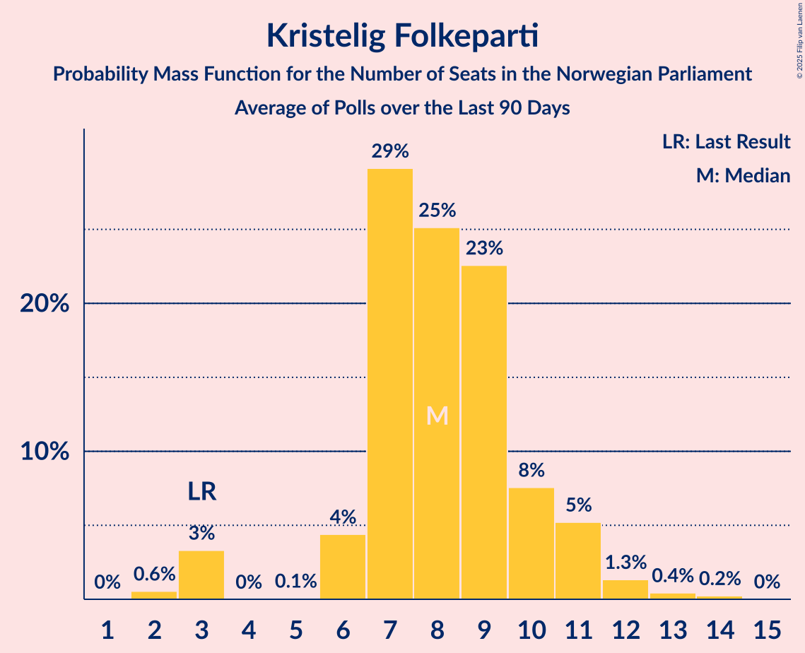

# Poll Average

<a href="#voting-intentions">Voting Intentions</a> | <a href="#seats">Seats</a> | <a href="#coalitions">Coalitions</a> | <a href="#technical-information">Technical Information</a>

## Summary

The table below lists the polls on which the average is based. They are the most recent polls (less than 90 days old) registered and analyzed so far.

| Period     | Polling firm/Commissioner(s) | Ap | H | FrP | Sp | SV | V | KrF | MDG | R |
|:----------:|:----------------------------:|:--:|:--:|:--:|:--:|:--:|:--:|:--:|:--:|:--:|
| 8–9 September 2013 | General Election | 27.4%   49 | 25.0%   45 | 15.2%   27 | 10.3%   19 | 6.0%   11 | 4.4%   8 | 4.2%   8 | 3.2%   1 | 2.4%   1 |
| N/A | Poll Average | 21–26%   39–49 | 18–24%   31–43 | 8–14%   13–25 | 11–21%   19–39 | 7–12%   11–22 | 3–7%   2–11 | 2–5%   0–9 | 3–8%   1–13 | 3–7%   1–11 |
| [27 August–2 September 2021](2021-09-02-KantarTNS.html) | Kantar TNS   TV2 | 21–25%   40–47 | 19–23%   35–44 | 8–11%   11–18 | 11–14%   18–26 | 8–11%   12–18 | 4–6%   2–9 | 3–5%   3–8 | 4–6%   2–10 | 4–6%   6–9 |
| [27 August–1 September 2021](2021-09-01-ResponsAnalyse.html) | Respons Analyse   Bergens Tidende and VG | 20–26%   41–43 | 17–23%   35–39 | 9–14%   16–22 | 10–15%   20–26 | 8–13%   15–22 | 4–7%   8–14 | 2–5%   1–10 | 4–7%   2–9 | 3–6%   1–10 |
| [24–28 August 2021](2021-08-28-Norstat.html) | Norstat   Vårt Land | N/A   N/A | N/A   N/A | N/A   N/A | N/A   N/A | N/A   N/A | N/A   N/A | N/A   N/A | N/A   N/A | N/A   N/A |
| [23–25 August 2021](2021-08-25-IpsosMMI.html) | Ipsos MMI   Dagbladet | 21–27%   39–49 | 17–23%   30–42 | 10–15%   17–27 | 10–15%   17–28 | 8–12%   12–21 | 2–5%   2–8 | 2–4%   0–3 | 5–8%   8–14 | 3–6%   2–11 |
| [17–21 August 2021](2021-08-21-Sentio.html) | Sentio   Nettavisen | 21–27%   41–50 | 17–22%   29–38 | 8–12%   13–20 | 11–15%   20–31 | 7–11%   11–18 | 3–5%   2–8 | 3–5%   1–8 | 6–9%   9–14 | 4–7%   6–11 |
| [3–8 August 2021](2021-08-08-OpinionPerduco.html) | Opinion Perduco   Avisenes Nyhetsbyrå, Dagsavisen and FriFagbevegelse | 20–26%   37–48 | 18–24%   33–45 | 7–12%   12–21 | 17–22%   31–41 | 7–11%   11–20 | 3–5%   2–10 | 3–6%   1–10 | 2–5%   1–9 | 3–5%   1–10 |
| [3–4 August 2021](2021-08-04-Norfakta.html) | Norfakta   Klassekampen and Nationen | 21–27%   38–49 | 18–24%   32–43 | 9–13%   15–24 | 13–19%   24–35 | 7–11%   12–19 | 3–6%   2–11 | 2–4%   0–7 | 3–6%   2–11 | 4–7%   2–12 |
| 8–9 September 2013 | General Election | 27.4%   49 | 25.0%   45 | 15.2%   27 | 10.3%   19 | 6.0%   11 | 4.4%   8 | 4.2%   8 | 3.2%   1 | 2.4%   1 |

Only polls for which at least the sample size has been published are included in the table above.

**Legend:**
+ **Top half of each row:** Voting intentions (95% confidence interval)
+ **Bottom half of each row:** Seat projections for the Norwegian Parliament (95% confidence interval)
+ **Ap:** Arbeiderpartiet
+ **H:** Høyre
+ **FrP:** Fremskrittspartiet
+ **Sp:** Senterpartiet
+ **SV:** Sosialistisk Venstreparti
+ **V:** Venstre
+ **KrF:** Kristelig Folkeparti
+ **MDG:** Miljøpartiet De Grønne
+ **R:** Rødt
+ **N/A (single party):** Party not included the published results
+ **N/A (entire row):** Calculation for this opinion poll not started yet

## Voting Intentions

### Confidence Intervals

| Party | Last Result | Median | 80% Confidence Interval | 90% Confidence Interval | 95% Confidence Interval | 99% Confidence Interval |
|:-----:|:-----------:|:------:|:-----------------------:|:-----------------------:|:-----------------------:|:-----------------------:|
| <a href="#arbeiderpartiet">Arbeiderpartiet</a> | 27.4% | 23.4% | 21.6–25.4% |21.0–25.9% | 20.6–26.4% | 19.6–27.4% |
| <a href="#høyre">Høyre</a> | 25.0% | 20.5% | 18.5–22.5% |17.9–23.0% | 17.5–23.5% | 16.6–24.5% |
| <a href="#fremskrittspartiet">Fremskrittspartiet</a> | 15.2% | 10.4% | 8.6–12.9% |8.2–13.5% | 7.9–14.0% | 7.3–15.0% |
| <a href="#senterpartiet">Senterpartiet</a> | 10.3% | 13.5% | 11.6–19.0% |11.2–20.1% | 10.9–20.8% | 10.2–22.1% |
| <a href="#sosialistisk-venstreparti">Sosialistisk Venstreparti</a> | 6.0% | 9.4% | 7.9–10.9% |7.6–11.4% | 7.2–11.9% | 6.7–12.7% |
| <a href="#venstre">Venstre</a> | 4.4% | 4.4% | 3.2–5.8% |2.9–6.2% | 2.7–6.6% | 2.4–7.3% |
| <a href="#kristelig-folkeparti">Kristelig Folkeparti</a> | 4.2% | 3.7% | 2.5–4.7% |2.2–5.0% | 2.0–5.3% | 1.7–5.8% |
| <a href="#miljøpartiet-de-grønne">Miljøpartiet De Grønne</a> | 3.2% | 5.2% | 3.6–7.4% |3.2–7.8% | 2.9–8.2% | 2.5–9.0% |
| <a href="#rødt">Rødt</a> | 2.4% | 4.9% | 3.7–6.0% |3.4–6.4% | 3.1–6.7% | 2.7–7.3% |

### Arbeiderpartiet

*For a full overview of the results for this party, see the [Arbeiderpartiet](party-arbeiderpartiet.html) page.*

| Voting Intentions | Probability | Accumulated | Special Marks |
|:-----------------:|:-----------:|:-----------:|:-------------:|
| 17.5–18.5% | 0% | 100% |  |
| 18.5–19.5% | 0.4% | 99.9% |  |
| 19.5–20.5% | 2% | 99.5% |  |
| 20.5–21.5% | 7% | 98% |  |
| 21.5–22.5% | 17% | 90% |  |
| 22.5–23.5% | 26% | 73% | Median |
| 23.5–24.5% | 24% | 47% |  |
| 24.5–25.5% | 14% | 22% |  |
| 25.5–26.5% | 6% | 8% |  |
| 26.5–27.5% | 2% | 2% | Last Result |
| 27.5–28.5% | 0.3% | 0.4% |  |
| 28.5–29.5% | 0.1% | 0.1% |  |
| 29.5–30.5% | 0% | 0% |  |

### Høyre

*For a full overview of the results for this party, see the [Høyre](party-høyre.html) page.*

| Voting Intentions | Probability | Accumulated | Special Marks |
|:-----------------:|:-----------:|:-----------:|:-------------:|
| 14.5–15.5% | 0% | 100% |  |
| 15.5–16.5% | 0.4% | 100% |  |
| 16.5–17.5% | 2% | 99.6% |  |
| 17.5–18.5% | 8% | 97% |  |
| 18.5–19.5% | 17% | 89% |  |
| 19.5–20.5% | 23% | 72% | Median |
| 20.5–21.5% | 24% | 49% |  |
| 21.5–22.5% | 16% | 25% |  |
| 22.5–23.5% | 7% | 9% |  |
| 23.5–24.5% | 2% | 2% |  |
| 24.5–25.5% | 0.4% | 0.5% | Last Result |
| 25.5–26.5% | 0.1% | 0.1% |  |
| 26.5–27.5% | 0% | 0% |  |

### Fremskrittspartiet

*For a full overview of the results for this party, see the [Fremskrittspartiet](party-fremskrittspartiet.html) page.*

| Voting Intentions | Probability | Accumulated | Special Marks |
|:-----------------:|:-----------:|:-----------:|:-------------:|
| 5.5–6.5% | 0% | 100% |  |
| 6.5–7.5% | 0.9% | 100% |  |
| 7.5–8.5% | 8% | 99.0% |  |
| 8.5–9.5% | 21% | 91% |  |
| 9.5–10.5% | 22% | 69% | Median |
| 10.5–11.5% | 19% | 47% |  |
| 11.5–12.5% | 15% | 28% |  |
| 12.5–13.5% | 9% | 14% |  |
| 13.5–14.5% | 4% | 5% |  |
| 14.5–15.5% | 0.9% | 1.1% | Last Result |
| 15.5–16.5% | 0.2% | 0.2% |  |
| 16.5–17.5% | 0% | 0% |  |

### Senterpartiet

*For a full overview of the results for this party, see the [Senterpartiet](party-senterpartiet.html) page.*

| Voting Intentions | Probability | Accumulated | Special Marks |
|:-----------------:|:-----------:|:-----------:|:-------------:|
| 7.5–8.5% | 0% | 100% |  |
| 8.5–9.5% | 0.1% | 100% |  |
| 9.5–10.5% | 1.2% | 99.9% | Last Result |
| 10.5–11.5% | 8% | 98.8% |  |
| 11.5–12.5% | 20% | 91% |  |
| 12.5–13.5% | 23% | 71% | Median |
| 13.5–14.5% | 14% | 49% |  |
| 14.5–15.5% | 8% | 35% |  |
| 15.5–16.5% | 6% | 27% |  |
| 16.5–17.5% | 5% | 21% |  |
| 17.5–18.5% | 5% | 17% |  |
| 18.5–19.5% | 5% | 12% |  |
| 19.5–20.5% | 4% | 7% |  |
| 20.5–21.5% | 2% | 3% |  |
| 21.5–22.5% | 0.8% | 1.1% |  |
| 22.5–23.5% | 0.2% | 0.3% |  |
| 23.5–24.5% | 0% | 0% |  |

### Sosialistisk Venstreparti

*For a full overview of the results for this party, see the [Sosialistisk Venstreparti](party-sosialistiskvenstreparti.html) page.*

| Voting Intentions | Probability | Accumulated | Special Marks |
|:-----------------:|:-----------:|:-----------:|:-------------:|
| 4.5–5.5% | 0% | 100% |  |
| 5.5–6.5% | 0.4% | 100% | Last Result |
| 6.5–7.5% | 4% | 99.6% |  |
| 7.5–8.5% | 19% | 95% |  |
| 8.5–9.5% | 33% | 76% | Median |
| 9.5–10.5% | 27% | 43% |  |
| 10.5–11.5% | 12% | 16% |  |
| 11.5–12.5% | 3% | 4% |  |
| 12.5–13.5% | 0.6% | 0.7% |  |
| 13.5–14.5% | 0.1% | 0.1% |  |
| 14.5–15.5% | 0% | 0% |  |

### Venstre

*For a full overview of the results for this party, see the [Venstre](party-venstre.html) page.*

| Voting Intentions | Probability | Accumulated | Special Marks |
|:-----------------:|:-----------:|:-----------:|:-------------:|
| 0.5–1.5% | 0% | 100% |  |
| 1.5–2.5% | 1.2% | 100% |  |
| 2.5–3.5% | 19% | 98.8% |  |
| 3.5–4.5% | 38% | 80% | Last Result, Median |
| 4.5–5.5% | 29% | 43% |  |
| 5.5–6.5% | 11% | 13% |  |
| 6.5–7.5% | 2% | 3% |  |
| 7.5–8.5% | 0.3% | 0.3% |  |
| 8.5–9.5% | 0% | 0% |  |

### Kristelig Folkeparti

*For a full overview of the results for this party, see the [Kristelig Folkeparti](party-kristeligfolkeparti.html) page.*

| Voting Intentions | Probability | Accumulated | Special Marks |
|:-----------------:|:-----------:|:-----------:|:-------------:|
| 0.0–0.5% | 0% | 100% |  |
| 0.5–1.5% | 0.3% | 100% |  |
| 1.5–2.5% | 12% | 99.7% |  |
| 2.5–3.5% | 33% | 88% |  |
| 3.5–4.5% | 40% | 55% | Last Result, Median |
| 4.5–5.5% | 14% | 15% |  |
| 5.5–6.5% | 1.1% | 1.1% |  |
| 6.5–7.5% | 0% | 0% |  |

### Miljøpartiet De Grønne

*For a full overview of the results for this party, see the [Miljøpartiet De Grønne](party-miljøpartietdegrønne.html) page.*

| Voting Intentions | Probability | Accumulated | Special Marks |
|:-----------------:|:-----------:|:-----------:|:-------------:|
| 0.5–1.5% | 0% | 100% |  |
| 1.5–2.5% | 0.7% | 100% |  |
| 2.5–3.5% | 8% | 99.3% | Last Result |
| 3.5–4.5% | 22% | 91% |  |
| 4.5–5.5% | 30% | 69% | Median |
| 5.5–6.5% | 19% | 40% |  |
| 6.5–7.5% | 13% | 21% |  |
| 7.5–8.5% | 6% | 8% |  |
| 8.5–9.5% | 1.2% | 1.3% |  |
| 9.5–10.5% | 0.1% | 0.1% |  |
| 10.5–11.5% | 0% | 0% |  |

### Rødt

*For a full overview of the results for this party, see the [Rødt](party-rødt.html) page.*

| Voting Intentions | Probability | Accumulated | Special Marks |
|:-----------------:|:-----------:|:-----------:|:-------------:|
| 0.5–1.5% | 0% | 100% |  |
| 1.5–2.5% | 0.3% | 100% | Last Result |
| 2.5–3.5% | 7% | 99.7% |  |
| 3.5–4.5% | 27% | 93% |  |
| 4.5–5.5% | 42% | 66% | Median |
| 5.5–6.5% | 20% | 24% |  |
| 6.5–7.5% | 3% | 3% |  |
| 7.5–8.5% | 0.2% | 0.2% |  |
| 8.5–9.5% | 0% | 0% |  |

## Seats

### Confidence Intervals

| Party | Last Result | Median | 80% Confidence Interval | 90% Confidence Interval | 95% Confidence Interval | 99% Confidence Interval |
|:-----:|:-----------:|:------:|:-----------------------:|:-----------------------:|:-----------------------:|:-----------------------:|
| <a href="#arbeiderpartiet">Arbeiderpartiet</a> | 49 | 43 | 40–46 |40–47 | 39–49 | 36–51 |
| <a href="#høyre">Høyre</a> | 45 | 36 | 33–40 |32–42 | 31–43 | 29–45 |
| <a href="#fremskrittspartiet">Fremskrittspartiet</a> | 27 | 18 | 15–22 |14–24 | 13–25 | 11–27 |
| <a href="#senterpartiet">Senterpartiet</a> | 19 | 25 | 21–36 |20–37 | 19–39 | 17–41 |
| <a href="#sosialistisk-venstreparti">Sosialistisk Venstreparti</a> | 11 | 16 | 13–22 |12–22 | 11–22 | 10–22 |
| <a href="#venstre">Venstre</a> | 8 | 7 | 2–11 |2–11 | 2–11 | 2–14 |
| <a href="#kristelig-folkeparti">Kristelig Folkeparti</a> | 8 | 3 | 1–7 |0–8 | 0–9 | 0–10 |
| <a href="#miljøpartiet-de-grønne">Miljøpartiet De Grønne</a> | 1 | 8 | 2–12 |2–13 | 1–13 | 1–15 |
| <a href="#rødt">Rødt</a> | 1 | 7 | 1–10 |1–11 | 1–11 | 1–12 |

### Arbeiderpartiet

*For a full overview of the results for this party, see the [Arbeiderpartiet](party-arbeiderpartiet.html) page.*

| Number of Seats | Probability | Accumulated | Special Marks |
|:---------------:|:-----------:|:-----------:|:-------------:|
| 34 | 0.1% | 100% |  |
| 35 | 0.1% | 99.9% |  |
| 36 | 0.3% | 99.8% |  |
| 37 | 0.5% | 99.5% |  |
| 38 | 0.7% | 99.0% |  |
| 39 | 2% | 98% |  |
| 40 | 9% | 96% |  |
| 41 | 11% | 88% |  |
| 42 | 11% | 77% |  |
| 43 | 29% | 65% | Median |
| 44 | 13% | 37% |  |
| 45 | 11% | 23% |  |
| 46 | 5% | 12% |  |
| 47 | 3% | 7% |  |
| 48 | 1.4% | 5% |  |
| 49 | 2% | 3% | Last Result |
| 50 | 0.8% | 2% |  |
| 51 | 0.4% | 0.8% |  |
| 52 | 0.1% | 0.4% |  |
| 53 | 0.2% | 0.3% |  |
| 54 | 0.1% | 0.1% |  |
| 55 | 0% | 0% |  |

### Høyre

*For a full overview of the results for this party, see the [Høyre](party-høyre.html) page.*

| Number of Seats | Probability | Accumulated | Special Marks |
|:---------------:|:-----------:|:-----------:|:-------------:|
| 27 | 0% | 100% |  |
| 28 | 0.2% | 99.9% |  |
| 29 | 0.7% | 99.8% |  |
| 30 | 1.2% | 99.1% |  |
| 31 | 2% | 98% |  |
| 32 | 2% | 96% |  |
| 33 | 4% | 94% |  |
| 34 | 6% | 90% |  |
| 35 | 13% | 84% |  |
| 36 | 21% | 71% | Median |
| 37 | 10% | 50% |  |
| 38 | 21% | 40% |  |
| 39 | 8% | 20% |  |
| 40 | 4% | 12% |  |
| 41 | 3% | 8% |  |
| 42 | 2% | 5% |  |
| 43 | 1.3% | 3% |  |
| 44 | 0.8% | 1.5% |  |
| 45 | 0.3% | 0.6% | Last Result |
| 46 | 0.2% | 0.3% |  |
| 47 | 0.1% | 0.1% |  |
| 48 | 0% | 0.1% |  |
| 49 | 0% | 0% |  |

### Fremskrittspartiet

*For a full overview of the results for this party, see the [Fremskrittspartiet](party-fremskrittspartiet.html) page.*

| Number of Seats | Probability | Accumulated | Special Marks |
|:---------------:|:-----------:|:-----------:|:-------------:|
| 10 | 0.1% | 100% |  |
| 11 | 0.9% | 99.9% |  |
| 12 | 1.1% | 98.9% |  |
| 13 | 2% | 98% |  |
| 14 | 4% | 96% |  |
| 15 | 13% | 92% |  |
| 16 | 11% | 79% |  |
| 17 | 11% | 68% |  |
| 18 | 9% | 56% | Median |
| 19 | 9% | 47% |  |
| 20 | 6% | 39% |  |
| 21 | 4% | 32% |  |
| 22 | 19% | 28% |  |
| 23 | 3% | 9% |  |
| 24 | 3% | 6% |  |
| 25 | 2% | 3% |  |
| 26 | 0.6% | 1.3% |  |
| 27 | 0.5% | 0.7% | Last Result |
| 28 | 0.2% | 0.3% |  |
| 29 | 0.1% | 0.1% |  |
| 30 | 0% | 0.1% |  |
| 31 | 0% | 0% |  |

### Senterpartiet

*For a full overview of the results for this party, see the [Senterpartiet](party-senterpartiet.html) page.*

| Number of Seats | Probability | Accumulated | Special Marks |
|:---------------:|:-----------:|:-----------:|:-------------:|
| 16 | 0.1% | 100% |  |
| 17 | 0.5% | 99.9% |  |
| 18 | 2% | 99.4% |  |
| 19 | 2% | 98% | Last Result |
| 20 | 5% | 96% |  |
| 21 | 8% | 91% |  |
| 22 | 7% | 83% |  |
| 23 | 21% | 76% |  |
| 24 | 5% | 55% |  |
| 25 | 10% | 50% | Median |
| 26 | 5% | 41% |  |
| 27 | 4% | 36% |  |
| 28 | 2% | 32% |  |
| 29 | 4% | 29% |  |
| 30 | 2% | 25% |  |
| 31 | 3% | 24% |  |
| 32 | 3% | 20% |  |
| 33 | 2% | 17% |  |
| 34 | 2% | 15% |  |
| 35 | 3% | 14% |  |
| 36 | 4% | 11% |  |
| 37 | 3% | 7% |  |
| 38 | 1.3% | 4% |  |
| 39 | 1.4% | 3% |  |
| 40 | 0.6% | 1.3% |  |
| 41 | 0.3% | 0.7% |  |
| 42 | 0.1% | 0.4% |  |
| 43 | 0.1% | 0.2% |  |
| 44 | 0.1% | 0.1% |  |
| 45 | 0% | 0% |  |

### Sosialistisk Venstreparti

*For a full overview of the results for this party, see the [Sosialistisk Venstreparti](party-sosialistiskvenstreparti.html) page.*

| Number of Seats | Probability | Accumulated | Special Marks |
|:---------------:|:-----------:|:-----------:|:-------------:|
| 9 | 0.1% | 100% |  |
| 10 | 0.6% | 99.9% |  |
| 11 | 2% | 99.3% | Last Result |
| 12 | 6% | 97% |  |
| 13 | 8% | 92% |  |
| 14 | 10% | 83% |  |
| 15 | 16% | 73% |  |
| 16 | 16% | 57% | Median |
| 17 | 13% | 41% |  |
| 18 | 7% | 28% |  |
| 19 | 3% | 21% |  |
| 20 | 2% | 18% |  |
| 21 | 0.6% | 16% |  |
| 22 | 16% | 16% |  |
| 23 | 0.1% | 0.1% |  |
| 24 | 0% | 0% |  |

### Venstre

*For a full overview of the results for this party, see the [Venstre](party-venstre.html) page.*

| Number of Seats | Probability | Accumulated | Special Marks |
|:---------------:|:-----------:|:-----------:|:-------------:|
| 1 | 0.4% | 100% |  |
| 2 | 35% | 99.6% |  |
| 3 | 2% | 65% |  |
| 4 | 0.1% | 63% |  |
| 5 | 0.1% | 63% |  |
| 6 | 5% | 63% |  |
| 7 | 18% | 58% | Median |
| 8 | 14% | 40% | Last Result |
| 9 | 7% | 25% |  |
| 10 | 2% | 19% |  |
| 11 | 16% | 17% |  |
| 12 | 0.2% | 0.7% |  |
| 13 | 0% | 0.5% |  |
| 14 | 0.4% | 0.5% |  |
| 15 | 0.2% | 0.2% |  |
| 16 | 0% | 0% |  |

### Kristelig Folkeparti

*For a full overview of the results for this party, see the [Kristelig Folkeparti](party-kristeligfolkeparti.html) page.*

| Number of Seats | Probability | Accumulated | Special Marks |
|:---------------:|:-----------:|:-----------:|:-------------:|
| 0 | 5% | 100% |  |
| 1 | 33% | 95% |  |
| 2 | 10% | 62% |  |
| 3 | 22% | 52% | Median |
| 4 | 0% | 30% |  |
| 5 | 0.1% | 30% |  |
| 6 | 11% | 30% |  |
| 7 | 11% | 19% |  |
| 8 | 5% | 8% | Last Result |
| 9 | 1.4% | 3% |  |
| 10 | 1.1% | 1.3% |  |
| 11 | 0.2% | 0.2% |  |
| 12 | 0% | 0% |  |

### Miljøpartiet De Grønne

*For a full overview of the results for this party, see the [Miljøpartiet De Grønne](party-miljøpartietdegrønne.html) page.*

| Number of Seats | Probability | Accumulated | Special Marks |
|:---------------:|:-----------:|:-----------:|:-------------:|
| 1 | 3% | 100% | Last Result |
| 2 | 12% | 97% |  |
| 3 | 1.1% | 85% |  |
| 4 | 0.7% | 84% |  |
| 5 | 0% | 83% |  |
| 6 | 4% | 83% |  |
| 7 | 9% | 79% |  |
| 8 | 31% | 70% | Median |
| 9 | 9% | 40% |  |
| 10 | 8% | 31% |  |
| 11 | 11% | 23% |  |
| 12 | 6% | 11% |  |
| 13 | 4% | 6% |  |
| 14 | 1.3% | 2% |  |
| 15 | 0.4% | 0.6% |  |
| 16 | 0.1% | 0.2% |  |
| 17 | 0% | 0% |  |

### Rødt

*For a full overview of the results for this party, see the [Rødt](party-rødt.html) page.*

| Number of Seats | Probability | Accumulated | Special Marks |
|:---------------:|:-----------:|:-----------:|:-------------:|
| 1 | 16% | 100% | Last Result |
| 2 | 13% | 84% |  |
| 3 | 0.1% | 71% |  |
| 4 | 0% | 71% |  |
| 5 | 0.1% | 71% |  |
| 6 | 8% | 71% |  |
| 7 | 13% | 63% | Median |
| 8 | 19% | 50% |  |
| 9 | 17% | 31% |  |
| 10 | 8% | 14% |  |
| 11 | 4% | 6% |  |
| 12 | 1.2% | 2% |  |
| 13 | 0.4% | 0.5% |  |
| 14 | 0.1% | 0.1% |  |
| 15 | 0% | 0% |  |

## Coalitions

### Confidence Intervals

| Coalition | Last Result | Median | Majority? | 80% Confidence Interval | 90% Confidence Interval | 95% Confidence Interval | 99% Confidence Interval |
|:---------:|:-----------:|:------:|:---------:|:-----------------------:|:-----------------------:|:-----------------------:|:-----------------------:|
| Arbeiderpartiet – Senterpartiet – Sosialistisk Venstreparti – Miljøpartiet De Grønne – Rødt | 81 | 100 | 100% | 94–107 | 93–108 | 91–110 | 89–113 |
| Arbeiderpartiet – Senterpartiet – Sosialistisk Venstreparti – Kristelig Folkeparti – Miljøpartiet De Grønne | 88 | 97 | 99.6% | 92–103 | 90–105 | 88–107 | 85–111 |
| Høyre – Fremskrittspartiet – Senterpartiet – Venstre – Kristelig Folkeparti | 107 | 92 | 80% | 82–100 | 80–102 | 79–105 | 76–109 |
| Arbeiderpartiet – Senterpartiet – Sosialistisk Venstreparti – Rødt | 80 | 91 | 95% | 87–100 | 84–102 | 82–104 | 80–108 |
| Arbeiderpartiet – Senterpartiet – Sosialistisk Venstreparti – Miljøpartiet De Grønne | 80 | 95 | 97% | 88–99 | 86–101 | 84–103 | 82–106 |
| Arbeiderpartiet – Senterpartiet – Sosialistisk Venstreparti | 79 | 86 | 57% | 79–93 | 78–95 | 76–98 | 74–102 |
| Arbeiderpartiet – Senterpartiet – Kristelig Folkeparti – Miljøpartiet De Grønne | 77 | 80 | 26% | 75–88 | 74–90 | 73–92 | 70–95 |
| Arbeiderpartiet – Senterpartiet – Kristelig Folkeparti | 76 | 72 | 7% | 66–83 | 64–85 | 63–87 | 60–90 |
| Arbeiderpartiet – Sosialistisk Venstreparti – Miljøpartiet De Grønne – Rødt | 62 | 74 | 1.4% | 67–80 | 63–82 | 60–83 | 58–87 |
| Arbeiderpartiet – Senterpartiet | 68 | 68 | 0.6% | 63–78 | 62–80 | 60–81 | 59–85 |
| Høyre – Fremskrittspartiet – Venstre – Kristelig Folkeparti – Miljøpartiet De Grønne | 89 | 72 | 0.1% | 66–80 | 65–80 | 63–80 | 60–82 |
| Høyre – Fremskrittspartiet – Venstre – Kristelig Folkeparti | 88 | 64 | 0% | 58–72 | 56–72 | 54–72 | 52–75 |
| Høyre – Fremskrittspartiet – Venstre | 80 | 61 | 0% | 54–71 | 51–71 | 51–71 | 48–71 |
| Arbeiderpartiet – Sosialistisk Venstreparti | 60 | 59 | 0% | 55–65 | 54–65 | 53–65 | 51–68 |
| Høyre – Fremskrittspartiet | 72 | 55 | 0% | 49–60 | 48–61 | 47–62 | 45–65 |
| Høyre – Venstre – Kristelig Folkeparti | 61 | 47 | 0% | 39–52 | 38–53 | 37–55 | 34–57 |
| Senterpartiet – Venstre – Kristelig Folkeparti | 35 | 35 | 0% | 27–45 | 25–48 | 24–50 | 22–54 |

### Arbeiderpartiet – Senterpartiet – Sosialistisk Venstreparti – Miljøpartiet De Grønne – Rødt

| Number of Seats | Probability | Accumulated | Special Marks |
|:---------------:|:-----------:|:-----------:|:-------------:|
| 81 | 0% | 100% | Last Result |
| 82 | 0% | 100% |  |
| 83 | 0% | 100% |  |
| 84 | 0% | 100% |  |
| 85 | 0% | 100% | Majority |
| 86 | 0% | 99.9% |  |
| 87 | 0% | 99.9% |  |
| 88 | 0.1% | 99.8% |  |
| 89 | 1.0% | 99.8% |  |
| 90 | 0.9% | 98.7% |  |
| 91 | 0.5% | 98% |  |
| 92 | 0.9% | 97% |  |
| 93 | 2% | 96% |  |
| 94 | 5% | 94% |  |
| 95 | 4% | 89% |  |
| 96 | 4% | 86% |  |
| 97 | 22% | 82% |  |
| 98 | 5% | 60% |  |
| 99 | 5% | 55% | Median |
| 100 | 6% | 50% |  |
| 101 | 7% | 44% |  |
| 102 | 7% | 38% |  |
| 103 | 5% | 31% |  |
| 104 | 6% | 26% |  |
| 105 | 5% | 21% |  |
| 106 | 6% | 16% |  |
| 107 | 4% | 10% |  |
| 108 | 2% | 7% |  |
| 109 | 1.2% | 4% |  |
| 110 | 1.5% | 3% |  |
| 111 | 0.6% | 2% |  |
| 112 | 0.4% | 1.0% |  |
| 113 | 0.4% | 0.6% |  |
| 114 | 0.1% | 0.2% |  |
| 115 | 0% | 0.1% |  |
| 116 | 0% | 0% |  |

### Arbeiderpartiet – Senterpartiet – Sosialistisk Venstreparti – Kristelig Folkeparti – Miljøpartiet De Grønne

| Number of Seats | Probability | Accumulated | Special Marks |
|:---------------:|:-----------:|:-----------:|:-------------:|
| 83 | 0.1% | 100% |  |
| 84 | 0.3% | 99.9% |  |
| 85 | 0.1% | 99.6% | Majority |
| 86 | 0.4% | 99.5% |  |
| 87 | 0.6% | 99.1% |  |
| 88 | 1.3% | 98% | Last Result |
| 89 | 1.4% | 97% |  |
| 90 | 3% | 96% |  |
| 91 | 2% | 93% |  |
| 92 | 5% | 91% |  |
| 93 | 6% | 86% |  |
| 94 | 7% | 80% |  |
| 95 | 5% | 72% | Median |
| 96 | 8% | 67% |  |
| 97 | 22% | 59% |  |
| 98 | 5% | 37% |  |
| 99 | 7% | 32% |  |
| 100 | 5% | 25% |  |
| 101 | 4% | 20% |  |
| 102 | 4% | 16% |  |
| 103 | 3% | 12% |  |
| 104 | 3% | 9% |  |
| 105 | 2% | 6% |  |
| 106 | 1.3% | 5% |  |
| 107 | 1.2% | 3% |  |
| 108 | 0.7% | 2% |  |
| 109 | 0.6% | 1.5% |  |
| 110 | 0.3% | 0.9% |  |
| 111 | 0.2% | 0.6% |  |
| 112 | 0.1% | 0.4% |  |
| 113 | 0.1% | 0.2% |  |
| 114 | 0.1% | 0.1% |  |
| 115 | 0.1% | 0.1% |  |
| 116 | 0% | 0% |  |

### Høyre – Fremskrittspartiet – Senterpartiet – Venstre – Kristelig Folkeparti

| Number of Seats | Probability | Accumulated | Special Marks |
|:---------------:|:-----------:|:-----------:|:-------------:|
| 72 | 0.1% | 100% |  |
| 73 | 0% | 99.9% |  |
| 74 | 0.1% | 99.9% |  |
| 75 | 0.1% | 99.8% |  |
| 76 | 0.4% | 99.6% |  |
| 77 | 0.5% | 99.3% |  |
| 78 | 0.7% | 98.8% |  |
| 79 | 2% | 98% |  |
| 80 | 2% | 96% |  |
| 81 | 3% | 94% |  |
| 82 | 3% | 91% |  |
| 83 | 4% | 88% |  |
| 84 | 4% | 84% |  |
| 85 | 3% | 80% | Majority |
| 86 | 7% | 77% |  |
| 87 | 5% | 69% |  |
| 88 | 5% | 65% |  |
| 89 | 3% | 60% | Median |
| 90 | 4% | 57% |  |
| 91 | 3% | 53% |  |
| 92 | 6% | 50% |  |
| 93 | 2% | 45% |  |
| 94 | 2% | 42% |  |
| 95 | 21% | 40% |  |
| 96 | 3% | 20% |  |
| 97 | 2% | 17% |  |
| 98 | 2% | 15% |  |
| 99 | 2% | 13% |  |
| 100 | 2% | 11% |  |
| 101 | 2% | 9% |  |
| 102 | 2% | 7% |  |
| 103 | 1.2% | 5% |  |
| 104 | 0.7% | 4% |  |
| 105 | 0.7% | 3% |  |
| 106 | 0.4% | 2% |  |
| 107 | 0.9% | 2% | Last Result |
| 108 | 0.3% | 1.1% |  |
| 109 | 0.3% | 0.7% |  |
| 110 | 0.2% | 0.4% |  |
| 111 | 0.2% | 0.3% |  |
| 112 | 0% | 0.1% |  |
| 113 | 0% | 0.1% |  |
| 114 | 0% | 0% |  |

### Arbeiderpartiet – Senterpartiet – Sosialistisk Venstreparti – Rødt

| Number of Seats | Probability | Accumulated | Special Marks |
|:---------------:|:-----------:|:-----------:|:-------------:|
| 77 | 0.1% | 100% |  |
| 78 | 0.1% | 99.9% |  |
| 79 | 0.2% | 99.8% |  |
| 80 | 0.3% | 99.7% | Last Result |
| 81 | 0.5% | 99.4% |  |
| 82 | 2% | 98.9% |  |
| 83 | 1.5% | 97% |  |
| 84 | 1.3% | 96% |  |
| 85 | 1.2% | 95% | Majority |
| 86 | 3% | 93% |  |
| 87 | 4% | 91% |  |
| 88 | 7% | 87% |  |
| 89 | 22% | 79% |  |
| 90 | 4% | 57% |  |
| 91 | 7% | 53% | Median |
| 92 | 4% | 45% |  |
| 93 | 5% | 41% |  |
| 94 | 4% | 36% |  |
| 95 | 6% | 32% |  |
| 96 | 5% | 26% |  |
| 97 | 4% | 21% |  |
| 98 | 3% | 17% |  |
| 99 | 3% | 14% |  |
| 100 | 3% | 11% |  |
| 101 | 2% | 8% |  |
| 102 | 1.4% | 6% |  |
| 103 | 1.1% | 5% |  |
| 104 | 2% | 4% |  |
| 105 | 0.8% | 2% |  |
| 106 | 0.2% | 1.3% |  |
| 107 | 0.5% | 1.1% |  |
| 108 | 0.3% | 0.6% |  |
| 109 | 0.2% | 0.3% |  |
| 110 | 0.1% | 0.1% |  |
| 111 | 0% | 0% |  |

### Arbeiderpartiet – Senterpartiet – Sosialistisk Venstreparti – Miljøpartiet De Grønne

| Number of Seats | Probability | Accumulated | Special Marks |
|:---------------:|:-----------:|:-----------:|:-------------:|
| 79 | 0.1% | 100% |  |
| 80 | 0.1% | 99.9% | Last Result |
| 81 | 0.1% | 99.8% |  |
| 82 | 0.9% | 99.8% |  |
| 83 | 0.9% | 98.9% |  |
| 84 | 0.8% | 98% |  |
| 85 | 1.2% | 97% | Majority |
| 86 | 2% | 96% |  |
| 87 | 3% | 94% |  |
| 88 | 5% | 91% |  |
| 89 | 5% | 86% |  |
| 90 | 5% | 81% |  |
| 91 | 5% | 76% |  |
| 92 | 6% | 71% | Median |
| 93 | 9% | 65% |  |
| 94 | 5% | 56% |  |
| 95 | 7% | 51% |  |
| 96 | 22% | 44% |  |
| 97 | 6% | 22% |  |
| 98 | 4% | 16% |  |
| 99 | 3% | 12% |  |
| 100 | 2% | 9% |  |
| 101 | 2% | 7% |  |
| 102 | 1.5% | 4% |  |
| 103 | 1.1% | 3% |  |
| 104 | 0.8% | 2% |  |
| 105 | 0.3% | 0.8% |  |
| 106 | 0.2% | 0.5% |  |
| 107 | 0.1% | 0.3% |  |
| 108 | 0.1% | 0.2% |  |
| 109 | 0% | 0.1% |  |
| 110 | 0% | 0% |  |

### Arbeiderpartiet – Senterpartiet – Sosialistisk Venstreparti

| Number of Seats | Probability | Accumulated | Special Marks |
|:---------------:|:-----------:|:-----------:|:-------------:|
| 71 | 0% | 100% |  |
| 72 | 0% | 99.9% |  |
| 73 | 0.2% | 99.9% |  |
| 74 | 0.4% | 99.7% |  |
| 75 | 0.9% | 99.3% |  |
| 76 | 1.3% | 98% |  |
| 77 | 2% | 97% |  |
| 78 | 3% | 95% |  |
| 79 | 4% | 93% | Last Result |
| 80 | 7% | 89% |  |
| 81 | 5% | 82% |  |
| 82 | 10% | 77% |  |
| 83 | 5% | 67% |  |
| 84 | 5% | 62% | Median |
| 85 | 7% | 57% | Majority |
| 86 | 4% | 50% |  |
| 87 | 4% | 46% |  |
| 88 | 18% | 42% |  |
| 89 | 3% | 24% |  |
| 90 | 3% | 21% |  |
| 91 | 2% | 18% |  |
| 92 | 2% | 16% |  |
| 93 | 4% | 14% |  |
| 94 | 3% | 10% |  |
| 95 | 2% | 7% |  |
| 96 | 1.3% | 5% |  |
| 97 | 0.6% | 4% |  |
| 98 | 0.5% | 3% |  |
| 99 | 0.8% | 2% |  |
| 100 | 0.6% | 2% |  |
| 101 | 0.6% | 1.1% |  |
| 102 | 0.2% | 0.5% |  |
| 103 | 0.2% | 0.4% |  |
| 104 | 0.1% | 0.2% |  |
| 105 | 0.1% | 0.1% |  |
| 106 | 0% | 0% |  |

### Arbeiderpartiet – Senterpartiet – Kristelig Folkeparti – Miljøpartiet De Grønne

| Number of Seats | Probability | Accumulated | Special Marks |
|:---------------:|:-----------:|:-----------:|:-------------:|
| 68 | 0.1% | 100% |  |
| 69 | 0.4% | 99.9% |  |
| 70 | 0.3% | 99.6% |  |
| 71 | 0.4% | 99.2% |  |
| 72 | 1.1% | 98.8% |  |
| 73 | 2% | 98% |  |
| 74 | 3% | 96% |  |
| 75 | 18% | 93% |  |
| 76 | 4% | 75% |  |
| 77 | 8% | 71% | Last Result |
| 78 | 4% | 63% |  |
| 79 | 5% | 59% | Median |
| 80 | 7% | 54% |  |
| 81 | 5% | 48% |  |
| 82 | 7% | 43% |  |
| 83 | 5% | 36% |  |
| 84 | 5% | 31% |  |
| 85 | 5% | 26% | Majority |
| 86 | 4% | 21% |  |
| 87 | 6% | 17% |  |
| 88 | 3% | 11% |  |
| 89 | 3% | 9% |  |
| 90 | 2% | 6% |  |
| 91 | 1.4% | 4% |  |
| 92 | 1.2% | 3% |  |
| 93 | 0.5% | 2% |  |
| 94 | 0.4% | 1.0% |  |
| 95 | 0.2% | 0.7% |  |
| 96 | 0.2% | 0.5% |  |
| 97 | 0.1% | 0.2% |  |
| 98 | 0.1% | 0.1% |  |
| 99 | 0% | 0% |  |

### Arbeiderpartiet – Senterpartiet – Kristelig Folkeparti

| Number of Seats | Probability | Accumulated | Special Marks |
|:---------------:|:-----------:|:-----------:|:-------------:|
| 58 | 0.1% | 100% |  |
| 59 | 0.3% | 99.9% |  |
| 60 | 0.2% | 99.7% |  |
| 61 | 0.3% | 99.4% |  |
| 62 | 1.0% | 99.1% |  |
| 63 | 1.1% | 98% |  |
| 64 | 2% | 97% |  |
| 65 | 2% | 95% |  |
| 66 | 4% | 93% |  |
| 67 | 19% | 89% |  |
| 68 | 5% | 70% |  |
| 69 | 5% | 65% |  |
| 70 | 4% | 61% |  |
| 71 | 7% | 57% | Median |
| 72 | 5% | 50% |  |
| 73 | 4% | 45% |  |
| 74 | 6% | 41% |  |
| 75 | 5% | 35% |  |
| 76 | 6% | 30% | Last Result |
| 77 | 2% | 24% |  |
| 78 | 4% | 22% |  |
| 79 | 2% | 18% |  |
| 80 | 2% | 16% |  |
| 81 | 2% | 14% |  |
| 82 | 2% | 12% |  |
| 83 | 2% | 10% |  |
| 84 | 2% | 8% |  |
| 85 | 2% | 7% | Majority |
| 86 | 1.4% | 5% |  |
| 87 | 0.8% | 3% |  |
| 88 | 0.9% | 2% |  |
| 89 | 0.8% | 2% |  |
| 90 | 0.3% | 0.7% |  |
| 91 | 0.2% | 0.4% |  |
| 92 | 0.1% | 0.2% |  |
| 93 | 0% | 0.1% |  |
| 94 | 0% | 0.1% |  |
| 95 | 0% | 0% |  |

### Arbeiderpartiet – Sosialistisk Venstreparti – Miljøpartiet De Grønne – Rødt

| Number of Seats | Probability | Accumulated | Special Marks |
|:---------------:|:-----------:|:-----------:|:-------------:|
| 55 | 0% | 100% |  |
| 56 | 0.1% | 99.9% |  |
| 57 | 0.2% | 99.9% |  |
| 58 | 0.3% | 99.7% |  |
| 59 | 0.5% | 99.4% |  |
| 60 | 1.5% | 98.9% |  |
| 61 | 0.7% | 97% |  |
| 62 | 1.5% | 97% | Last Result |
| 63 | 1.0% | 95% |  |
| 64 | 1.0% | 94% |  |
| 65 | 1.1% | 93% |  |
| 66 | 1.5% | 92% |  |
| 67 | 2% | 91% |  |
| 68 | 3% | 89% |  |
| 69 | 5% | 86% |  |
| 70 | 3% | 81% |  |
| 71 | 5% | 78% |  |
| 72 | 3% | 74% |  |
| 73 | 6% | 70% |  |
| 74 | 23% | 64% | Median |
| 75 | 5% | 41% |  |
| 76 | 6% | 36% |  |
| 77 | 7% | 29% |  |
| 78 | 5% | 23% |  |
| 79 | 5% | 17% |  |
| 80 | 4% | 13% |  |
| 81 | 4% | 9% |  |
| 82 | 2% | 5% |  |
| 83 | 1.1% | 3% |  |
| 84 | 0.9% | 2% |  |
| 85 | 0.5% | 1.4% | Majority |
| 86 | 0.4% | 0.9% |  |
| 87 | 0.1% | 0.5% |  |
| 88 | 0.2% | 0.4% |  |
| 89 | 0.1% | 0.2% |  |
| 90 | 0.1% | 0.1% |  |
| 91 | 0% | 0% |  |

### Arbeiderpartiet – Senterpartiet

| Number of Seats | Probability | Accumulated | Special Marks |
|:---------------:|:-----------:|:-----------:|:-------------:|
| 57 | 0.1% | 100% |  |
| 58 | 0.2% | 99.9% |  |
| 59 | 1.1% | 99.7% |  |
| 60 | 1.2% | 98.6% |  |
| 61 | 2% | 97% |  |
| 62 | 2% | 96% |  |
| 63 | 4% | 93% |  |
| 64 | 3% | 89% |  |
| 65 | 8% | 86% |  |
| 66 | 21% | 78% |  |
| 67 | 6% | 58% |  |
| 68 | 6% | 52% | Last Result, Median |
| 69 | 5% | 46% |  |
| 70 | 4% | 41% |  |
| 71 | 5% | 36% |  |
| 72 | 3% | 31% |  |
| 73 | 4% | 28% |  |
| 74 | 4% | 25% |  |
| 75 | 3% | 21% |  |
| 76 | 4% | 18% |  |
| 77 | 3% | 14% |  |
| 78 | 3% | 11% |  |
| 79 | 2% | 8% |  |
| 80 | 3% | 6% |  |
| 81 | 2% | 4% |  |
| 82 | 0.8% | 2% |  |
| 83 | 0.5% | 1.3% |  |
| 84 | 0.2% | 0.8% |  |
| 85 | 0.1% | 0.6% | Majority |
| 86 | 0.3% | 0.5% |  |
| 87 | 0.1% | 0.2% |  |
| 88 | 0.1% | 0.1% |  |
| 89 | 0% | 0% |  |

### Høyre – Fremskrittspartiet – Venstre – Kristelig Folkeparti – Miljøpartiet De Grønne

| Number of Seats | Probability | Accumulated | Special Marks |
|:---------------:|:-----------:|:-----------:|:-------------:|
| 57 | 0% | 100% |  |
| 58 | 0.1% | 99.9% |  |
| 59 | 0.2% | 99.9% |  |
| 60 | 0.6% | 99.6% |  |
| 61 | 0.5% | 99.0% |  |
| 62 | 0.8% | 98% |  |
| 63 | 1.0% | 98% |  |
| 64 | 2% | 97% |  |
| 65 | 3% | 95% |  |
| 66 | 4% | 92% |  |
| 67 | 4% | 88% |  |
| 68 | 5% | 84% |  |
| 69 | 6% | 79% |  |
| 70 | 7% | 73% |  |
| 71 | 9% | 66% |  |
| 72 | 7% | 57% | Median |
| 73 | 11% | 50% |  |
| 74 | 6% | 39% |  |
| 75 | 4% | 33% |  |
| 76 | 5% | 29% |  |
| 77 | 2% | 25% |  |
| 78 | 2% | 23% |  |
| 79 | 3% | 21% |  |
| 80 | 16% | 18% |  |
| 81 | 0.9% | 2% |  |
| 82 | 0.4% | 0.8% |  |
| 83 | 0.2% | 0.4% |  |
| 84 | 0.1% | 0.3% |  |
| 85 | 0.1% | 0.1% | Majority |
| 86 | 0% | 0.1% |  |
| 87 | 0% | 0% |  |
| 88 | 0% | 0% |  |
| 89 | 0% | 0% | Last Result |

### Høyre – Fremskrittspartiet – Venstre – Kristelig Folkeparti

| Number of Seats | Probability | Accumulated | Special Marks |
|:---------------:|:-----------:|:-----------:|:-------------:|
| 49 | 0% | 100% |  |
| 50 | 0.1% | 99.9% |  |
| 51 | 0.3% | 99.9% |  |
| 52 | 0.2% | 99.5% |  |
| 53 | 0.5% | 99.3% |  |
| 54 | 1.3% | 98.8% |  |
| 55 | 2% | 97% |  |
| 56 | 2% | 96% |  |
| 57 | 2% | 94% |  |
| 58 | 4% | 92% |  |
| 59 | 4% | 87% |  |
| 60 | 5% | 84% |  |
| 61 | 7% | 78% |  |
| 62 | 7% | 72% |  |
| 63 | 8% | 65% |  |
| 64 | 7% | 57% | Median |
| 65 | 6% | 49% |  |
| 66 | 7% | 43% |  |
| 67 | 7% | 36% |  |
| 68 | 4% | 29% |  |
| 69 | 3% | 26% |  |
| 70 | 2% | 23% |  |
| 71 | 2% | 21% |  |
| 72 | 17% | 19% |  |
| 73 | 0.5% | 1.3% |  |
| 74 | 0.3% | 0.8% |  |
| 75 | 0.2% | 0.5% |  |
| 76 | 0.1% | 0.3% |  |
| 77 | 0.1% | 0.2% |  |
| 78 | 0% | 0.1% |  |
| 79 | 0% | 0.1% |  |
| 80 | 0.1% | 0.1% |  |
| 81 | 0% | 0% |  |
| 82 | 0% | 0% |  |
| 83 | 0% | 0% |  |
| 84 | 0% | 0% |  |
| 85 | 0% | 0% | Majority |
| 86 | 0% | 0% |  |
| 87 | 0% | 0% |  |
| 88 | 0% | 0% | Last Result |

### Høyre – Fremskrittspartiet – Venstre

| Number of Seats | Probability | Accumulated | Special Marks |
|:---------------:|:-----------:|:-----------:|:-------------:|
| 46 | 0.1% | 100% |  |
| 47 | 0.1% | 99.9% |  |
| 48 | 0.6% | 99.8% |  |
| 49 | 0.6% | 99.2% |  |
| 50 | 0.9% | 98.6% |  |
| 51 | 3% | 98% |  |
| 52 | 1.3% | 95% |  |
| 53 | 2% | 93% |  |
| 54 | 3% | 91% |  |
| 55 | 4% | 88% |  |
| 56 | 5% | 84% |  |
| 57 | 5% | 79% |  |
| 58 | 8% | 74% |  |
| 59 | 6% | 66% |  |
| 60 | 8% | 60% |  |
| 61 | 10% | 52% | Median |
| 62 | 5% | 42% |  |
| 63 | 5% | 38% |  |
| 64 | 4% | 33% |  |
| 65 | 4% | 29% |  |
| 66 | 2% | 25% |  |
| 67 | 2% | 23% |  |
| 68 | 2% | 20% |  |
| 69 | 1.1% | 18% |  |
| 70 | 0.9% | 17% |  |
| 71 | 16% | 16% |  |
| 72 | 0.2% | 0.4% |  |
| 73 | 0.1% | 0.2% |  |
| 74 | 0.1% | 0.1% |  |
| 75 | 0% | 0% |  |
| 76 | 0% | 0% |  |
| 77 | 0% | 0% |  |
| 78 | 0% | 0% |  |
| 79 | 0% | 0% |  |
| 80 | 0% | 0% | Last Result |

### Arbeiderpartiet – Sosialistisk Venstreparti

| Number of Seats | Probability | Accumulated | Special Marks |
|:---------------:|:-----------:|:-----------:|:-------------:|
| 48 | 0% | 100% |  |
| 49 | 0.1% | 99.9% |  |
| 50 | 0.2% | 99.9% |  |
| 51 | 0.5% | 99.7% |  |
| 52 | 0.5% | 99.1% |  |
| 53 | 2% | 98.6% |  |
| 54 | 2% | 97% |  |
| 55 | 5% | 95% |  |
| 56 | 7% | 90% |  |
| 57 | 15% | 83% |  |
| 58 | 11% | 68% |  |
| 59 | 13% | 57% | Median |
| 60 | 10% | 44% | Last Result |
| 61 | 7% | 34% |  |
| 62 | 4% | 27% |  |
| 63 | 3% | 23% |  |
| 64 | 2% | 20% |  |
| 65 | 17% | 18% |  |
| 66 | 0.5% | 1.5% |  |
| 67 | 0.4% | 0.9% |  |
| 68 | 0.2% | 0.5% |  |
| 69 | 0.1% | 0.3% |  |
| 70 | 0.2% | 0.2% |  |
| 71 | 0% | 0.1% |  |
| 72 | 0% | 0% |  |

### Høyre – Fremskrittspartiet

| Number of Seats | Probability | Accumulated | Special Marks |
|:---------------:|:-----------:|:-----------:|:-------------:|
| 43 | 0.1% | 100% |  |
| 44 | 0.2% | 99.9% |  |
| 45 | 0.4% | 99.7% |  |
| 46 | 0.8% | 99.3% |  |
| 47 | 2% | 98.5% |  |
| 48 | 2% | 97% |  |
| 49 | 6% | 95% |  |
| 50 | 3% | 89% |  |
| 51 | 6% | 86% |  |
| 52 | 7% | 80% |  |
| 53 | 9% | 73% |  |
| 54 | 10% | 63% | Median |
| 55 | 6% | 53% |  |
| 56 | 6% | 47% |  |
| 57 | 7% | 41% |  |
| 58 | 5% | 34% |  |
| 59 | 4% | 30% |  |
| 60 | 19% | 25% |  |
| 61 | 2% | 6% |  |
| 62 | 2% | 4% |  |
| 63 | 0.8% | 2% |  |
| 64 | 0.8% | 2% |  |
| 65 | 0.3% | 0.8% |  |
| 66 | 0.2% | 0.5% |  |
| 67 | 0.1% | 0.3% |  |
| 68 | 0% | 0.1% |  |
| 69 | 0% | 0.1% |  |
| 70 | 0% | 0% |  |
| 71 | 0% | 0% |  |
| 72 | 0% | 0% | Last Result |

### Høyre – Venstre – Kristelig Folkeparti

| Number of Seats | Probability | Accumulated | Special Marks |
|:---------------:|:-----------:|:-----------:|:-------------:|
| 32 | 0% | 100% |  |
| 33 | 0.3% | 99.9% |  |
| 34 | 0.5% | 99.6% |  |
| 35 | 0.6% | 99.1% |  |
| 36 | 0.6% | 98% |  |
| 37 | 2% | 98% |  |
| 38 | 3% | 96% |  |
| 39 | 4% | 93% |  |
| 40 | 4% | 89% |  |
| 41 | 4% | 84% |  |
| 42 | 5% | 80% |  |
| 43 | 5% | 75% |  |
| 44 | 5% | 70% |  |
| 45 | 7% | 65% |  |
| 46 | 8% | 58% | Median |
| 47 | 5% | 51% |  |
| 48 | 7% | 46% |  |
| 49 | 6% | 39% |  |
| 50 | 19% | 33% |  |
| 51 | 3% | 14% |  |
| 52 | 5% | 11% |  |
| 53 | 2% | 6% |  |
| 54 | 1.5% | 4% |  |
| 55 | 0.7% | 3% |  |
| 56 | 0.4% | 2% |  |
| 57 | 1.1% | 2% |  |
| 58 | 0.2% | 0.4% |  |
| 59 | 0.1% | 0.2% |  |
| 60 | 0.1% | 0.1% |  |
| 61 | 0% | 0% | Last Result |

### Senterpartiet – Venstre – Kristelig Folkeparti

| Number of Seats | Probability | Accumulated | Special Marks |
|:---------------:|:-----------:|:-----------:|:-------------:|
| 19 | 0.1% | 100% |  |
| 20 | 0.1% | 99.9% |  |
| 21 | 0.2% | 99.8% |  |
| 22 | 0.4% | 99.6% |  |
| 23 | 0.9% | 99.3% |  |
| 24 | 2% | 98% |  |
| 25 | 3% | 96% |  |
| 26 | 3% | 93% |  |
| 27 | 2% | 90% |  |
| 28 | 3% | 88% |  |
| 29 | 2% | 85% |  |
| 30 | 4% | 83% |  |
| 31 | 3% | 79% |  |
| 32 | 4% | 76% |  |
| 33 | 4% | 72% |  |
| 34 | 6% | 68% |  |
| 35 | 19% | 62% | Last Result, Median |
| 36 | 5% | 43% |  |
| 37 | 3% | 38% |  |
| 38 | 8% | 36% |  |
| 39 | 4% | 28% |  |
| 40 | 3% | 24% |  |
| 41 | 3% | 21% |  |
| 42 | 3% | 18% |  |
| 43 | 2% | 15% |  |
| 44 | 2% | 13% |  |
| 45 | 1.4% | 11% |  |
| 46 | 2% | 9% |  |
| 47 | 2% | 7% |  |
| 48 | 1.4% | 5% |  |
| 49 | 0.8% | 4% |  |
| 50 | 0.7% | 3% |  |
| 51 | 0.6% | 2% |  |
| 52 | 0.8% | 2% |  |
| 53 | 0.5% | 1.0% |  |
| 54 | 0.1% | 0.6% |  |
| 55 | 0.2% | 0.5% |  |
| 56 | 0.1% | 0.2% |  |
| 57 | 0% | 0.1% |  |
| 58 | 0% | 0.1% |  |
| 59 | 0% | 0% |  |

## Technical Information

+ **Number of polls included in this average:** 7
+ **Lowest number of simulations done in a poll included in this average:** 0
+ **Total number of simulations done in the polls included in this average:** 4,326,400
+ **Error estimate:** 2.30%
