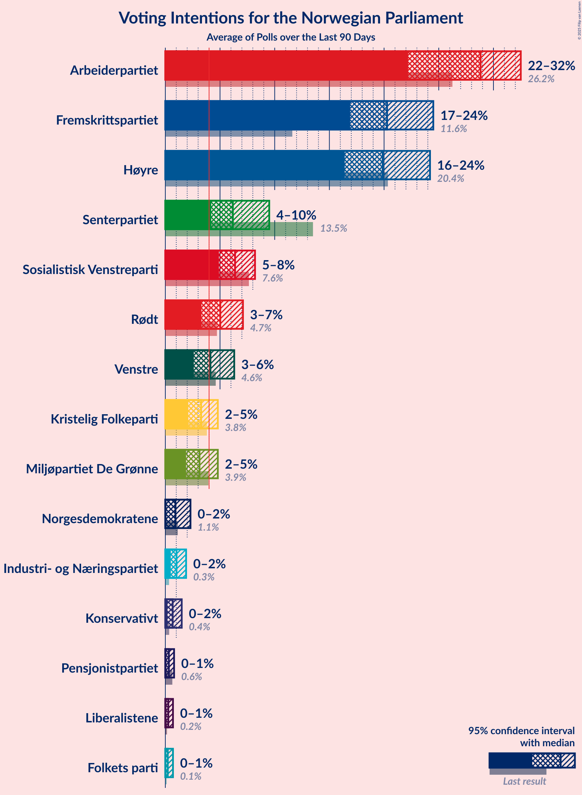
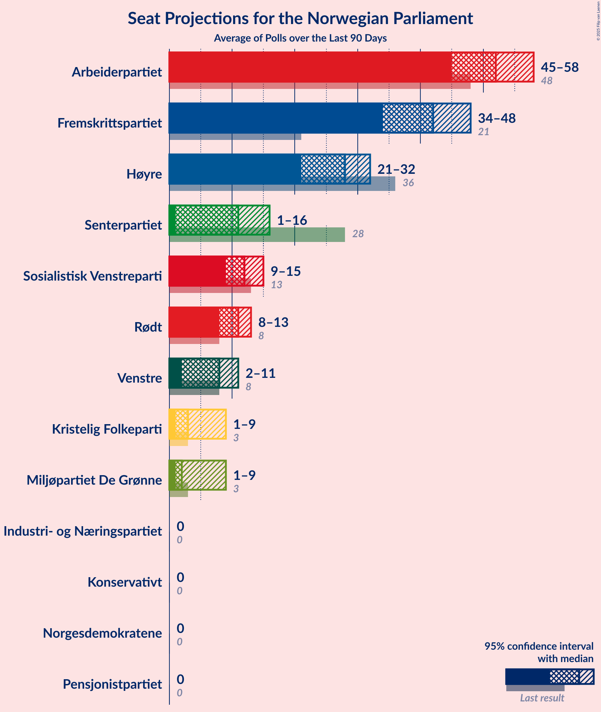
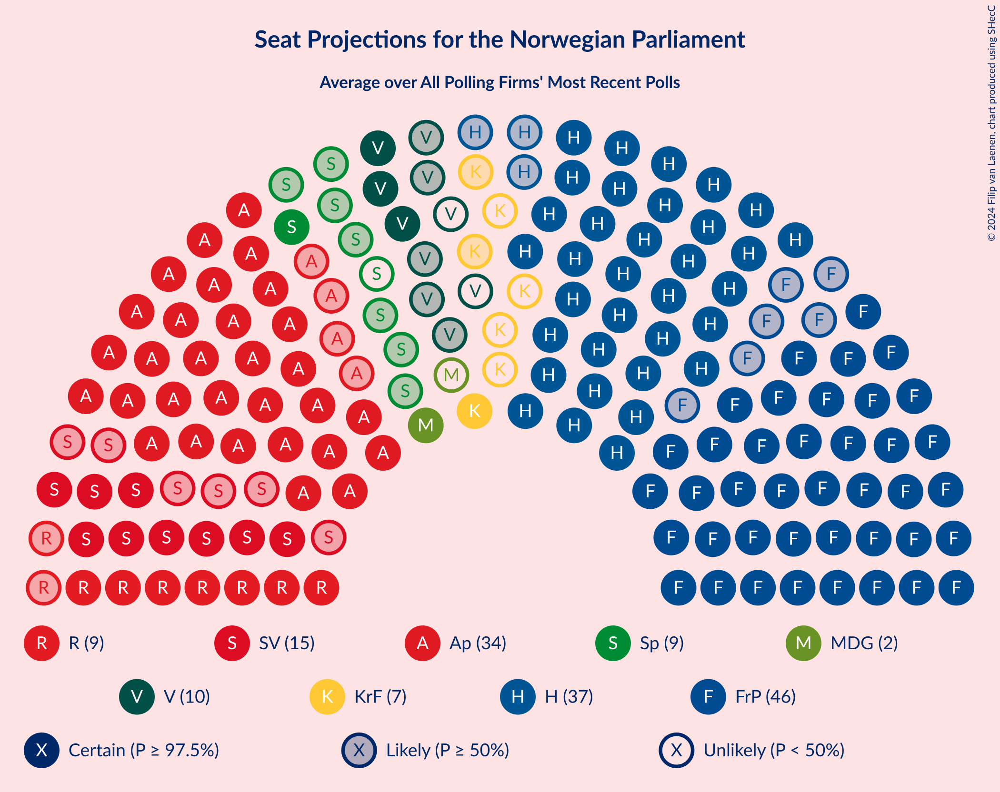
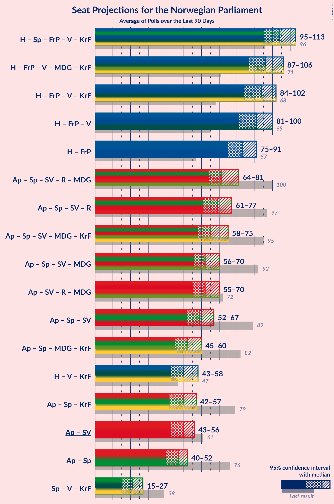

# Overview

The table below lists the most recent polls (less than 90 days old) registered and analyzed so far.

| Period     | Polling firm/Commissioner(s) | Ap | H | FrP | Sp | SV | V | KrF | MDG | R |
|:----------:|:----------------------------:|:--:|:--:|:--:|:--:|:--:|:--:|:--:|:--:|:--:|
| 8–9 September 2013 | General Election | 27.4%   49 | 25.0%   45 | 15.2%   27 | 10.3%   19 | 6.0%   11 | 4.4%   8 | 4.2%   8 | 3.2%   1 | 2.4%   1 |
| N/A | [Poll Average](average.html) | 19–27%   33–49 | 18–29%   33–52 | 9–16%   15–29 | 12–17%   21–34 | 6–11%   10–19 | 2–5%   0–8 | 3–5%   1–10 | 3–8%   1–14 | 3–6%   1–11 |
| [14–20 September 2020](2020-09-20-Norstat.html) | Norstat   Aftenposten and NRK | 20–25%   36–46 | 23–28%   40–52 | 11–16%   20–29 | 12–17%   22–31 | 6–10%   11–18 | 2–4%   1–8 | 3–6%   2–10 | 3–6%   1–10 | 2–5%   1–8 |
| [8–14 September 2020](2020-09-14-Sentio.html) | Sentio   Amedia and Nettavisen | 19–24%   36–46 | 22–28%   40–50 | 13–17%   23–31 | 13–17%   22–31 | 6–9%   10–16 | 2–4%   0–2 | 3–5%   1–9 | 3–6%   1–10 | 3–5%   1–10 |
| [1–7 September 2020](2020-09-07-OpinionPerduco.html) | Opinion Perduco   Avisenes Nyhetsbyrå, Dagsavisen and FriFagbevegelse | 18–23%   31–41 | 24–30%   42–54 | 9–12%   14–22 | 14–18%   23–36 | 5–9%   9–15 | 2–4%   0–2 | 3–5%   1–9 | 6–9%   10–16 | 3–6%   2–10 |
| [1–2 September 2020](2020-09-02-Norfakta.html) | Norfakta   Klassekampen and Nationen | 22–28%   40–51 | 23–29%   40–53 | 11–15%   19–29 | 11–16%   20–29 | 6–10%   12–19 | 2–4%   1–8 | 3–6%   1–11 | 2–5%   1–9 | 2–5%   1–9 |
| [25 August–1 September 2020](2020-09-01-KantarTNS.html) | Kantar TNS   TV2 | 22–28%   41–50 | 17–22%   30–39 | 9–14%   17–25 | 12–16%   21–30 | 8–12%   13–20 | 2–5%   1–8 | 3–5%   1–9 | 4–7%   8–13 | 4–7%   7–13 |
| [26–31 August 2020](2020-08-31-ResponsAnalyse.html) | Respons Analyse   VG | 22–27%   40–50 | 22–28%   38–50 | 10–14%   17–25 | 13–17%   22–33 | 5–9%   10–16 | 3–5%   2–10 | 2–5%   1–8 | 3–6%   1–11 | 3–5%   1–10 |
| 8–9 September 2013 | General Election | 27.4%   49 | 25.0%   45 | 15.2%   27 | 10.3%   19 | 6.0%   11 | 4.4%   8 | 4.2%   8 | 3.2%   1 | 2.4%   1 |

Only polls for which at least the sample size has been published are included in the table above.

**Legend:**
+ **Top half of each row:** Voting intentions (95% confidence interval)
+ **Bottom half of each row:** Seat projections for the Norwegian Parliament (95% confidence interval)
+ **Ap:** Arbeiderpartiet
+ **H:** Høyre
+ **FrP:** Fremskrittspartiet
+ **Sp:** Senterpartiet
+ **SV:** Sosialistisk Venstreparti
+ **V:** Venstre
+ **KrF:** Kristelig Folkeparti
+ **MDG:** Miljøpartiet De Grønne
+ **R:** Rødt
+ **N/A (single party):** Party not included the published results
+ **N/A (entire row):** Calculation for this opinion poll not started yet

