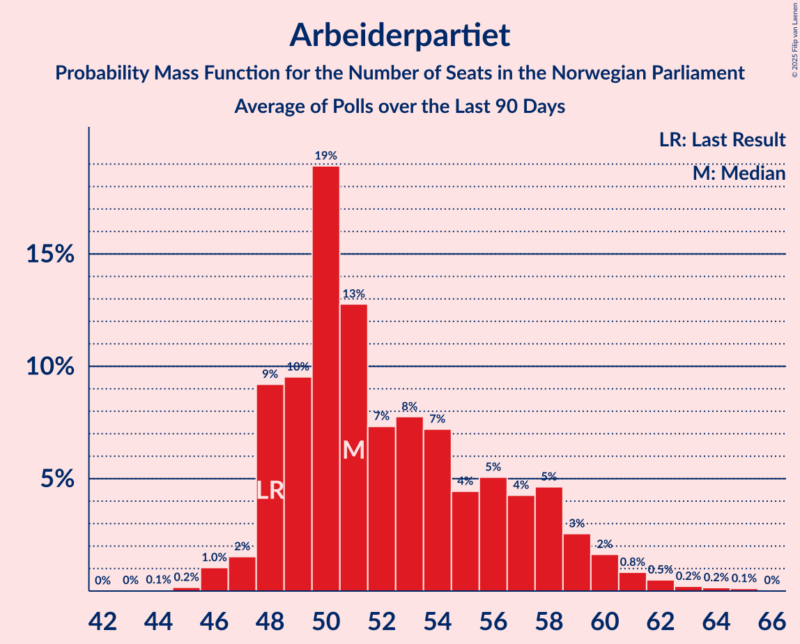

# Arbeiderpartiet

<a href="#voting-intentions">Voting Intentions</a> | <a href="#seats">Seats</a>

## Voting Intentions

Last result: **27.4%** (General Election of 8–9 September 2013)

### Confidence Intervals

| Period     | Polling firm/Commissioner(s) | Median | 80% Confidence Interval | 90% Confidence Interval | 95% Confidence Interval | 99% Confidence Interval |
|:----------:|:----------------:|:-----------:|:-----------------------:|:-----------------------:|:-----------------------:|:-----------------------:|
| N/A | [Poll Average](average.html) | 24.2% | 21.8–26.7% | 21.2–27.3% | 20.7–27.8% | 19.9–28.8% |
| [9–15 December 2019](2019-12-15-Norstat.html) | Norstat | 25.5% | 23.8–27.3% | 23.3–27.8% | 22.9–28.3% | 22.1–29.2% |
| [3–8 December 2019](2019-12-08-OpinionPerduco.html) | Opinion Perduco | 22.9% | 21.2–24.7% | 20.7–25.2% | 20.3–25.6% | 19.6–26.5% |
| [3–4 December 2019](2019-12-04-Norfakta.html) | Norfakta | 21.4% | N/A | N/A | N/A | N/A |
| [26 November–2 December 2019](2019-12-02-Sentio.html) | Sentio | 24.2% | N/A | N/A | N/A | N/A |
| [28 November–2 December 2019](2019-12-02-ResponsAnalyse.html) | Respons Analyse | 23.0% | N/A | N/A | N/A | N/A |
| [25–29 November 2019](2019-11-29-KantarTNS.html) | Kantar TNS | 21.9% | N/A | N/A | N/A | N/A |

### Probability Mass Function

The following table shows the probability mass function per percentage block of voting intentions for the [poll average](average.html) for Arbeiderpartiet.

| Voting Intentions | Probability | Accumulated | Special Marks |
|:-----------------:|:-----------:|:-----------:|:-------------:|
| 17.5–18.5% | 0% | 100% |  |
| 18.5–19.5% | 0.2% | 100% |  |
| 19.5–20.5% | 2% | 99.8% |  |
| 20.5–21.5% | 6% | 98% |  |
| 21.5–22.5% | 13% | 92% |  |
| 22.5–23.5% | 17% | 80% |  |
| 23.5–24.5% | 19% | 62% | Median |
| 24.5–25.5% | 18% | 44% |  |
| 25.5–26.5% | 14% | 26% |  |
| 26.5–27.5% | 8% | 12% | Last Result |
| 27.5–28.5% | 3% | 4% |  |
| 28.5–29.5% | 0.7% | 0.8% |  |
| 29.5–30.5% | 0.1% | 0.1% |  |
| 30.5–31.5% | 0% | 0% |  |

## Seats

Last result: **49** seats (General Election of 8–9 September 2013)

### Confidence Intervals

| Period     | Polling firm/Commissioner(s) | Median | 80% Confidence Interval | 90% Confidence Interval | 95% Confidence Interval | 99% Confidence Interval |
|:----------:|:----------------:|:------:|:-----------------------:|:-----------------------:|:-----------------------:|:-----------------------:|
| N/A | [Poll Average](average.html) | 44 | 38–48 | 38–49 | 38–50 | 36–54 |
| [9–15 December 2019](2019-12-15-Norstat.html) | Norstat | 46 | 43–49 | 42–50 | 41–51 | 40–54 |
| [3–8 December 2019](2019-12-08-OpinionPerduco.html) | Opinion Perduco | 40 | 38–46 | 38–46 | 37–46 | 36–46 |
| [3–4 December 2019](2019-12-04-Norfakta.html) | Norfakta |  |  |  |  |  |
| [26 November–2 December 2019](2019-12-02-Sentio.html) | Sentio |  |  |  |  |  |
| [28 November–2 December 2019](2019-12-02-ResponsAnalyse.html) | Respons Analyse |  |  |  |  |  |
| [25–29 November 2019](2019-11-29-KantarTNS.html) | Kantar TNS |  |  |  |  |  |

### Probability Mass Function

The following table shows the probability mass function per seat for the [poll average](average.html) for Arbeiderpartiet.

| Number of Seats | Probability | Accumulated | Special Marks |
|:---------------:|:-----------:|:-----------:|:-------------:|
| 34 | 0.1% | 100% |  |
| 35 | 0.1% | 99.8% |  |
| 36 | 0.5% | 99.8% |  |
| 37 | 1.3% | 99.2% |  |
| 38 | 9% | 98% |  |
| 39 | 12% | 89% |  |
| 40 | 11% | 77% |  |
| 41 | 2% | 66% |  |
| 42 | 7% | 65% |  |
| 43 | 7% | 57% |  |
| 44 | 8% | 51% | Median |
| 45 | 10% | 43% |  |
| 46 | 15% | 33% |  |
| 47 | 5% | 18% |  |
| 48 | 5% | 13% |  |
| 49 | 3% | 8% | Last Result |
| 50 | 2% | 5% |  |
| 51 | 1.3% | 2% |  |
| 52 | 0.4% | 1.1% |  |
| 53 | 0.2% | 0.7% |  |
| 54 | 0.5% | 0.5% |  |
| 55 | 0.1% | 0.1% |  |
| 56 | 0% | 0% |  |

