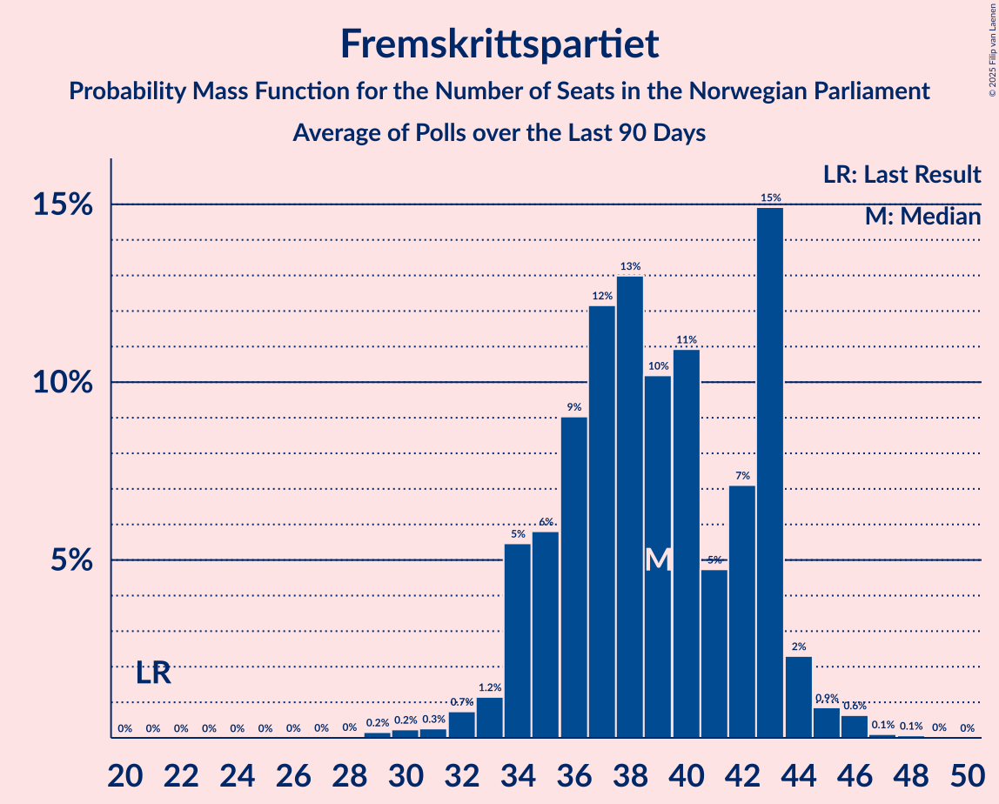

# Fremskrittspartiet

<a href="#voting-intentions">Voting Intentions</a> | <a href="#seats">Seats</a>

## Voting Intentions

Last result: **15.2%** (General Election of 8–9 September 2013)

### Confidence Intervals

| Period     | Polling firm/Commissioner(s) | Median | 80% Confidence Interval | 90% Confidence Interval | 95% Confidence Interval | 99% Confidence Interval |
|:----------:|:----------------:|:-----------:|:-----------------------:|:-----------------------:|:-----------------------:|:-----------------------:|
| N/A | [Poll Average](average.html) | 10.9% | 9.4–12.6% | 9.0–13.0% | 8.6–13.4% | 8.0–14.2% |
| [9–15 December 2019](2019-12-15-Norstat.html) | Norstat | 11.8% | 10.6–13.2% | 10.2–13.6% | 9.9–14.0% | 9.4–14.6% |
| [3–8 December 2019](2019-12-08-OpinionPerduco.html) | Opinion Perduco | 10.7% | 9.5–12.0% | 9.1–12.4% | 8.9–12.8% | 8.3–13.5% |
| [3–4 December 2019](2019-12-04-Norfakta.html) | Norfakta | 10.1% | 8.9–11.6% | 8.5–12.0% | 8.2–12.4% | 7.7–13.1% |
| [26 November–2 December 2019](2019-12-02-Sentio.html) | Sentio | 11.1% | N/A | N/A | N/A | N/A |
| [28 November–2 December 2019](2019-12-02-ResponsAnalyse.html) | Respons Analyse | 10.3% | N/A | N/A | N/A | N/A |
| [25–29 November 2019](2019-11-29-KantarTNS.html) | Kantar TNS | 9.8% | N/A | N/A | N/A | N/A |

### Probability Mass Function

The following table shows the probability mass function per percentage block of voting intentions for the [poll average](average.html) for Fremskrittspartiet.

| Voting Intentions | Probability | Accumulated | Special Marks |
|:-----------------:|:-----------:|:-----------:|:-------------:|
| 5.5–6.5% | 0% | 100% |  |
| 6.5–7.5% | 0.1% | 100% |  |
| 7.5–8.5% | 2% | 99.9% |  |
| 8.5–9.5% | 11% | 98% |  |
| 9.5–10.5% | 25% | 87% |  |
| 10.5–11.5% | 31% | 61% | Median |
| 11.5–12.5% | 21% | 31% |  |
| 12.5–13.5% | 8% | 10% |  |
| 13.5–14.5% | 2% | 2% |  |
| 14.5–15.5% | 0.2% | 0.2% | Last Result |
| 15.5–16.5% | 0% | 0% |  |

## Seats

Last result: **27** seats (General Election of 8–9 September 2013)

### Confidence Intervals

| Period     | Polling firm/Commissioner(s) | Median | 80% Confidence Interval | 90% Confidence Interval | 95% Confidence Interval | 99% Confidence Interval |
|:----------:|:----------------:|:------:|:-----------------------:|:-----------------------:|:-----------------------:|:-----------------------:|
| N/A | [Poll Average](average.html) | 19 | 15–22 | 15–24 | 14–24 | 12–26 |
| [9–15 December 2019](2019-12-15-Norstat.html) | Norstat | 21 | 18–24 | 18–25 | 17–25 | 16–27 |
| [3–8 December 2019](2019-12-08-OpinionPerduco.html) | Opinion Perduco | 19 | 16–21 | 16–22 | 15–22 | 14–24 |
| [3–4 December 2019](2019-12-04-Norfakta.html) | Norfakta | 16 | 14–18 | 14–20 | 13–21 | 11–24 |
| [26 November–2 December 2019](2019-12-02-Sentio.html) | Sentio |  |  |  |  |  |
| [28 November–2 December 2019](2019-12-02-ResponsAnalyse.html) | Respons Analyse |  |  |  |  |  |
| [25–29 November 2019](2019-11-29-KantarTNS.html) | Kantar TNS |  |  |  |  |  |

### Probability Mass Function

The following table shows the probability mass function per seat for the [poll average](average.html) for Fremskrittspartiet.

| Number of Seats | Probability | Accumulated | Special Marks |
|:---------------:|:-----------:|:-----------:|:-------------:|
| 11 | 0.2% | 100% |  |
| 12 | 0.5% | 99.8% |  |
| 13 | 0.8% | 99.3% |  |
| 14 | 2% | 98.5% |  |
| 15 | 13% | 96% |  |
| 16 | 6% | 84% |  |
| 17 | 7% | 78% |  |
| 18 | 18% | 70% |  |
| 19 | 13% | 52% | Median |
| 20 | 13% | 39% |  |
| 21 | 10% | 26% |  |
| 22 | 6% | 16% |  |
| 23 | 5% | 10% |  |
| 24 | 3% | 5% |  |
| 25 | 1.0% | 2% |  |
| 26 | 0.6% | 0.8% |  |
| 27 | 0.1% | 0.2% | Last Result |
| 28 | 0% | 0% |  |

