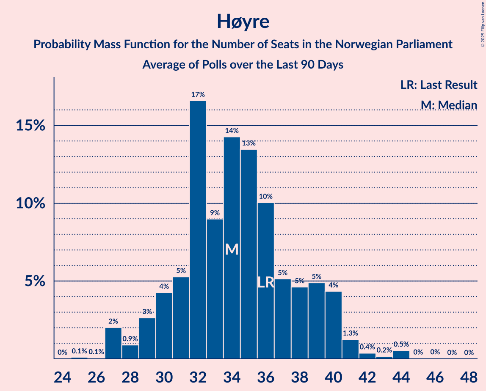

# Høyre

<a href="#voting-intentions">Voting Intentions</a> | <a href="#seats">Seats</a>

## Voting Intentions

Last result: **25.0%** (General Election of 8–9 September 2013)

### Confidence Intervals

| Period     | Polling firm/Commissioner(s) | Median | 80% Confidence Interval | 90% Confidence Interval | 95% Confidence Interval | 99% Confidence Interval |
|:----------:|:----------------:|:-----------:|:-----------------------:|:-----------------------:|:-----------------------:|:-----------------------:|
| N/A | [Poll Average](average.html) | 25.4% | 22.5–28.9% | 21.9–29.7% | 21.4–30.4% | 20.4–31.6% |
| [17–23 August 2020](2020-08-23-Norstat.html) | Norstat   Aftenposten and NRK | 26.8% | 25.0–28.7% | 24.5–29.2% | 24.1–29.7% | 23.2–30.6% |
| [17–19 August 2020](2020-08-19-IpsosMMI.html) | Ipsos MMI   Dagbladet | 24.3% | 22.4–26.5% | 21.8–27.1% | 21.3–27.6% | 20.4–28.7% |
| [11–16 August 2020](2020-08-16-Sentio.html) | Sentio   Amedia and Nettavisen | 28.7% | 26.9–30.6% | 26.4–31.1% | 26.0–31.6% | 25.1–32.5% |
| [6–11 August 2020](2020-08-11-ResponsAnalyse.html) | Respons Analyse   VG | 23.0% | 21.3–24.8% | 20.9–25.3% | 20.5–25.7% | 19.7–26.6% |
| [4–10 August 2020](2020-08-10-Norstat.html) | Norstat   Aftenposten and NRK | 24.6% | 22.9–26.5% | 22.4–27.0% | 22.0–27.5% | 21.2–28.4% |
| [4–7 August 2020](2020-08-07-KantarTNS.html) | Kantar TNS   TV2 | 24.9% | 22.9–27.0% | 22.4–27.6% | 21.9–28.1% | 21.0–29.1% |
| [4–5 August 2020](2020-08-05-Norfakta.html) | Norfakta   Klassekampen and Nationen | 23.5% | 21.8–25.3% | 21.4–25.8% | 20.9–26.2% | 20.2–27.1% |
| [4 August 2020](2020-08-04-InFact.html) | InFact   Avisa Nordland, Bergensavisen, iFinnmark and Nidaros | 25.1% | 23.4–26.9% | 22.9–27.4% | 22.5–27.8% | 21.7–28.7% |
| [29 July–3 August 2020](2020-08-03-OpinionPerduco.html) | Opinion Perduco   Avisenes Nyhetsbyrå, Dagsavisen and FriFagbevegelse | 27.7% | 25.6–30.0% | 25.0–30.6% | 24.5–31.2% | 23.5–32.3% |
| [7–8 July 2020](2020-07-08-Norfakta.html) | Norfakta   Klassekampen and Nationen | 23.9% | 22.2–25.7% | 21.8–26.2% | 21.4–26.6% | 20.6–27.5% |
| [24–30 June 2020](2020-06-30-KantarTNS.html) | Kantar TNS   TV2 | 27.6% | 25.7–29.8% | 25.1–30.4% | 24.6–30.9% | 23.7–31.9% |
| [22–24 June 2020](2020-06-24-IpsosMMI.html) | Ipsos MMI   Dagbladet | 25.2% | 23.5–27.0% | 23.0–27.5% | 22.6–28.0% | 21.8–28.9% |
| [15–21 June 2020](2020-06-21-Norstat.html) | Norstat   Aftenposten and NRK | 24.8% | 23.1–26.6% | 22.6–27.1% | 22.2–27.6% | 21.4–28.5% |
| [9–13 June 2020](2020-06-13-Sentio.html) | Sentio   Amedia and Nettavisen | 24.2% | 22.5–26.0% | 22.1–26.5% | 21.6–27.0% | 20.9–27.8% |
| [2–8 June 2020](2020-06-08-OpinionPerduco.html) | Opinion Perduco | 24.4% | 22.4–26.5% | 21.8–27.1% | 21.3–27.7% | 20.4–28.7% |
| [2–4 June 2020](2020-06-04-ResponsAnalyse.html) | Respons Analyse   VG | 24.2% | 22.5–26.0% | 22.0–26.5% | 21.6–26.9% | 20.8–27.8% |
| [2–3 June 2020](2020-06-03-Norfakta.html) | Norfakta   Klassekampen and Nationen | 24.1% | 22.4–25.8% | 21.9–26.4% | 21.5–26.8% | 20.7–27.7% |
| [26 May–1 June 2020](2020-06-01-Norstat.html) | Norstat   Aftenposten and NRK | 25.9% | 23.8–28.1% | 23.2–28.7% | 22.7–29.3% | 21.8–30.3% |
| [25–29 May 2020](2020-05-29-KantarTNS.html) | Kantar TNS   TV2 | 27.3% | 25.3–29.5% | 24.8–30.1% | 24.3–30.6% | 23.4–31.6% |
| [25–28 May 2020](2020-05-28-IpsosMMI.html) | Ipsos MMI   Dagbladet | 25.4% | 23.3–27.6% | 22.8–28.2% | 22.3–28.7% | 21.3–29.8% |
| [19–25 May 2020](2020-05-25-Norstat.html) | Norstat   Aftenposten and NRK | 26.2% | 24.5–28.1% | 24.0–28.7% | 23.5–29.1% | 22.7–30.0% |
| [12–16 May 2020](2020-05-16-Sentio.html) | Sentio   Amedia and Nettavisen | 26.0% | 24.3–27.8% | 23.8–28.4% | 23.4–28.8% | 22.6–29.7% |
| [5–10 May 2020](2020-05-10-OpinionPerduco.html) | Opinion Perduco | 28.2% | 26.4–30.2% | 25.9–30.7% | 25.5–31.2% | 24.6–32.1% |
| [5–6 May 2020](2020-05-06-Norfakta.html) | Norfakta   Klassekampen and Nationen | 26.9% | 25.0–29.0% | 24.4–29.6% | 24.0–30.1% | 23.1–31.1% |
| [30 April–5 May 2020](2020-05-05-ResponsAnalyse.html) | Respons Analyse   VG | 26.5% | 24.8–28.3% | 24.3–28.9% | 23.9–29.3% | 23.0–30.2% |
| [27 April–4 May 2020](2020-05-04-Norstat.html) | Norstat   Aftenposten and NRK | 26.5% | 24.8–28.4% | 24.3–29.0% | 23.8–29.4% | 23.0–30.4% |
| [27–29 April 2020](2020-04-29-KantarTNS.html) | Kantar TNS   TV2 | 28.0% | 26.2–29.9% | 25.8–30.5% | 25.3–30.9% | 24.5–31.8% |
| [20–26 April 2020](2020-04-26-Norstat.html) | Norstat   Aftenposten and NRK | 26.8% | 25.0–28.7% | 24.5–29.2% | 24.1–29.7% | 23.3–30.6% |
| [20–22 April 2020](2020-04-22-IpsosMMI.html) | Ipsos MMI   Dagbladet | 25.3% | 23.3–27.4% | 22.7–28.0% | 22.2–28.6% | 21.3–29.6% |
| [14–20 April 2020](2020-04-20-Sentio.html) | Sentio   Amedia and Nettavisen | 26.6% | 24.9–28.5% | 24.4–29.0% | 23.9–29.4% | 23.1–30.3% |
| [31 March–5 April 2020](2020-04-05-OpinionPerduco.html) | Opinion Perduco | 27.3% | 25.5–29.2% | 25.0–29.7% | 24.6–30.1% | 23.8–31.1% |
| [26 March–1 April 2020](2020-04-01-ResponsAnalyse.html) | Respons Analyse   VG | 25.2% | 23.5–27.0% | 23.0–27.5% | 22.6–28.0% | 21.8–28.9% |
| [31 March–1 April 2020](2020-04-01-Norfakta.html) | Norfakta   Klassekampen and Nationen | 25.9% | 24.2–27.7% | 23.7–28.3% | 23.3–28.7% | 22.5–29.6% |
| [25–31 March 2020](2020-03-31-KantarTNS.html) | Kantar TNS   TV2 | 24.7% | 22.7–26.8% | 22.1–27.4% | 21.7–27.9% | 20.7–29.0% |
| [23–29 March 2020](2020-03-29-Norstat.html) | Norstat   Aftenposten and NRK | 25.0% | 23.0–27.1% | 22.4–27.7% | 21.9–28.3% | 21.0–29.3% |
| [16–23 March 2020](2020-03-23-Norstat.html) | Norstat   Aftenposten and NRK | 23.2% | 21.5–25.0% | 21.0–25.6% | 20.6–26.0% | 19.8–26.9% |
| [18–20 March 2020](2020-03-20-IpsosMMI.html) | Ipsos MMI   Dagbladet | 20.8% | 18.9–23.0% | 18.3–23.6% | 17.8–24.1% | 17.0–25.2% |
| [10–16 March 2020](2020-03-16-Sentio.html) | Sentio   Amedia and Nettavisen | 18.8% | 17.3–20.5% | 16.9–20.9% | 16.5–21.4% | 15.8–22.2% |
| [3–9 March 2020](2020-03-09-OpinionPerduco.html) | Opinion Perduco | 18.9% | 17.3–20.6% | 16.9–21.0% | 16.5–21.5% | 15.8–22.3% |
| [3–4 March 2020](2020-03-04-Norfakta.html) | Norfakta   Klassekampen and Nationen | 20.6% | 19.0–22.3% | 18.6–22.8% | 18.2–23.2% | 17.5–24.1% |
| [27 February–2 March 2020](2020-03-02-ResponsAnalyse.html) | Respons Analyse   VG | 17.9% | 16.4–19.5% | 16.0–20.0% | 15.6–20.4% | 15.0–21.2% |
| [24 February–2 March 2020](2020-03-02-Norstat.html) | Norstat   Aftenposten and NRK | 19.9% | 18.0–21.9% | 17.5–22.5% | 17.0–23.0% | 16.2–24.0% |
| [24–28 February 2020](2020-02-28-KantarTNS.html) | Kantar TNS   TV2 | 19.8% | 18.0–21.7% | 17.5–22.3% | 17.1–22.8% | 16.3–23.8% |
| [17–23 February 2020](2020-02-23-Norstat.html) | Norstat   Vårt Land | 18.9% | 17.1–21.1% | 16.5–21.7% | 16.1–22.2% | 15.2–23.3% |
| [17–19 February 2020](2020-02-19-IpsosMMI.html) | Ipsos MMI   Dagbladet | 18.7% | 17.0–20.7% | 16.5–21.3% | 16.0–21.7% | 15.2–22.7% |
| [11–17 February 2020](2020-02-17-Sentio.html) | Sentio   Amedia and Nettavisen | 19.7% | 18.2–21.4% | 17.7–21.9% | 17.3–22.3% | 16.6–23.1% |
| [4–10 February 2020](2020-02-10-OpinionPerduco.html) | Opinion Perduco   Avisenes Nyhetsbyrå and Dagsavisen and FriFagbevegelse | 19.4% | 17.8–21.1% | 17.4–21.6% | 17.0–22.0% | 16.3–22.9% |
| [4–5 February 2020](2020-02-05-Norfakta.html) | Norfakta   Klassekampen and Nationen | 19.4% | 17.9–21.1% | 17.4–21.6% | 17.1–22.0% | 16.4–22.8% |
| [30 January–3 February 2020](2020-02-03-ResponsAnalyse.html) | Respons Analyse   VG | 19.9% | 18.3–21.6% | 17.9–22.0% | 17.5–22.5% | 16.8–23.3% |
| [27 January–2 February 2020](2020-02-02-Norstat.html) | Norstat   Aftenposten and NRK | 18.3% | 16.8–20.0% | 16.3–20.5% | 15.9–20.9% | 15.2–21.7% |
| [27–31 January 2020](2020-01-31-KantarTNS.html) | Kantar TNS   TV2 | 17.9% | 16.2–19.7% | 15.7–20.2% | 15.3–20.7% | 14.6–21.6% |
| [24–27 January 2020](2020-01-27-Sentio.html) | Sentio   Amedia and Nettavisen | 16.2% | 14.8–17.8% | 14.4–18.2% | 14.0–18.6% | 13.4–19.4% |
| [21–27 January 2020](2020-01-27-Norstat.html) | Norstat   Vårt Land | 21.0% | 19.0–23.2% | 18.5–23.8% | 18.0–24.4% | 17.1–25.5% |
| [20–22 January 2020](2020-01-22-IpsosMMI.html) | Ipsos MMI   Dagbladet | 19.7% | 17.9–21.6% | 17.4–22.2% | 17.0–22.7% | 16.2–23.6% |
| [20–21 January 2020](2020-01-21-ResponsAnalyse.html) | Respons Analyse   VG | 20.9% | 19.4–22.5% | 19.0–22.9% | 18.7–23.3% | 18.0–24.1% |
| [21 January 2020](2020-01-21-KantarTNS.html) | Kantar TNS   TV2 | 20.5% | 18.5–22.6% | 18.0–23.2% | 17.5–23.8% | 16.6–24.8% |
| [14–18 January 2020](2020-01-18-Sentio.html) | Sentio   Amedia and Nettavisen | 20.6% | 19.0–22.3% | 18.6–22.8% | 18.2–23.2% | 17.5–24.1% |
| [15 January 2020](2020-01-15-OpinionPerduco.html) | Opinion Perduco   Avisenes Nyhetsbyrå and Dagsavisen and FriFagbevegelse | 18.7% | 17.2–20.4% | 16.7–20.9% | 16.4–21.3% | 15.7–22.1% |
| [6–10 January 2020](2020-01-10-KantarTNS.html) | Kantar TNS   TV2 | 22.3% | 20.5–24.3% | 20.0–24.9% | 19.6–25.4% | 18.7–26.3% |
| [7–8 January 2020](2020-01-08-Norfakta.html) | Norfakta   Klassekampen and Nationen | 21.3% | 19.5–23.3% | 19.0–23.8% | 18.5–24.3% | 17.7–25.3% |
| [6 January 2020](2020-01-06-ResponsAnalyse.html) | Respons Analyse   VG | 22.4% | 20.7–24.1% | 20.3–24.6% | 19.9–25.1% | 19.1–25.9% |
| [30 December 2019–5 January 2020](2020-01-05-Norstat.html) | Norstat   Aftenposten and NRK | 22.4% | 20.7–24.2% | 20.3–24.7% | 19.9–25.1% | 19.1–26.0% |
| [16–18 December 2019](2019-12-18-IpsosMMI.html) | Ipsos MMI | 22.1% | 20.2–24.2% | 19.7–24.8% | 19.2–25.3% | 18.4–26.3% |
| [9–15 December 2019](2019-12-15-Norstat.html) | Norstat | 20.9% | 19.3–22.6% | 18.9–23.1% | 18.5–23.5% | 17.8–24.4% |
| [3–8 December 2019](2019-12-08-OpinionPerduco.html) | Opinion Perduco | 20.6% | 19.0–22.3% | 18.5–22.8% | 18.2–23.3% | 17.4–24.1% |
| [3–4 December 2019](2019-12-04-Norfakta.html) | Norfakta | 22.6% | 20.8–24.6% | 20.3–25.1% | 19.8–25.6% | 19.0–26.6% |
| [26 November–2 December 2019](2019-12-02-Sentio.html) | Sentio | 20.8% | 19.2–22.5% | 18.8–23.0% | 18.4–23.4% | 17.7–24.3% |
| [28 November–2 December 2019](2019-12-02-ResponsAnalyse.html) | Respons Analyse | 22.0% | 20.4–23.7% | 19.9–24.2% | 19.5–24.7% | 18.8–25.5% |
| [25–29 November 2019](2019-11-29-KantarTNS.html) | Kantar TNS | 19.1% | 17.4–21.0% | 17.0–21.6% | 16.6–22.0% | 15.8–23.0% |
| [19–25 November 2019](2019-11-25-Norstat.html) | Norstat | 19.6% | 17.9–21.6% | 17.4–22.1% | 16.9–22.6% | 16.1–23.6% |
| [18–20 November 2019](2019-11-20-IpsosMMI.html) | Ipsos MMI | 20.9% | 19.0–22.9% | 18.5–23.5% | 18.0–24.0% | 17.2–25.0% |
| [12–18 November 2019](2019-11-18-Norstat.html) | Norstat | 20.9% | 18.9–23.1% | 18.3–23.7% | 17.9–24.2% | 16.9–25.3% |
| [5–11 November 2019](2019-11-11-OpinionPerduco.html) | Opinion Perduco | 20.6% | 19.0–22.4% | 18.6–22.9% | 18.2–23.3% | 17.5–24.2% |
| [5–6 November 2019](2019-11-06-Norfakta.html) | Norfakta | 22.9% | 21.1–24.9% | 20.6–25.5% | 20.1–26.0% | 19.3–27.0% |
| [31 October–4 November 2019](2019-11-04-ResponsAnalyse.html) | Respons Analyse | 21.3% | 19.7–23.1% | 19.3–23.6% | 18.9–24.0% | 18.2–24.8% |
| [29 October–2 November 2019](2019-11-02-Sentio.html) | Sentio | 20.8% | 19.2–22.5% | 18.8–23.0% | 18.4–23.4% | 17.7–24.3% |
| [28 October–1 November 2019](2019-11-01-KantarTNS.html) | Kantar TNS | 21.1% | 19.4–23.1% | 18.9–23.6% | 18.5–24.1% | 17.6–25.1% |
| [22–28 October 2019](2019-10-28-Norstat.html) | Norstat | 21.8% | 19.9–23.9% | 19.3–24.4% | 18.9–25.0% | 18.0–26.0% |
| [21–23 October 2019](2019-10-23-IpsosMMI.html) | Ipsos MMI | 21.1% | 19.3–23.1% | 18.8–23.6% | 18.3–24.1% | 17.5–25.1% |
| [15–21 October 2019](2019-10-21-Norstat.html) | Norstat | 20.1% | 18.5–21.9% | 18.1–22.4% | 17.7–22.8% | 16.9–23.7% |
| [8–14 October 2019](2019-10-14-Sentio.html) | Sentio | 20.9% | 19.3–22.6% | 18.9–23.1% | 18.5–23.5% | 17.8–24.4% |
| [1–7 October 2019](2019-10-07-OpinionPerduco.html) | Opinion Perduco | 22.8% | 21.1–24.6% | 20.7–25.1% | 20.3–25.6% | 19.5–26.5% |
| [30 September–4 October 2019](2019-10-04-KantarTNS.html) | Kantar TNS | 20.1% | 18.4–22.0% | 18.0–22.6% | 17.5–23.0% | 16.8–23.9% |
| [1–2 October 2019](2019-10-02-Norfakta.html) | Norfakta | 21.4% | 19.6–23.3% | 19.1–23.8% | 18.7–24.3% | 17.8–25.3% |
| [24–30 September 2019](2019-09-30-Norstat.html) | Norstat | 19.7% | 17.8–21.9% | 17.3–22.5% | 16.8–23.0% | 15.9–24.1% |
| [23–25 September 2019](2019-09-25-ResponsAnalyse.html) | Respons Analyse | 20.6% | 19.0–22.3% | 18.6–22.8% | 18.2–23.2% | 17.5–24.1% |
| [23–25 September 2019](2019-09-25-IpsosMMI.html) | Ipsos MMI | 21.3% | 19.7–23.1% | 19.2–23.6% | 18.8–24.0% | 18.0–24.9% |
| [17–19 September 2019](2019-09-19-Norstat.html) | Norstat | 21.1% | 19.2–23.1% | 18.7–23.7% | 18.2–24.2% | 17.4–25.2% |
| [10–16 September 2019](2019-09-16-Sentio.html) | Sentio | 21.1% | 19.5–22.8% | 19.1–23.3% | 18.7–23.7% | 17.9–24.6% |
| [3–4 September 2019](2019-09-04-Norfakta.html) | Norfakta | 22.1% | 20.5–23.9% | 20.1–24.4% | 19.7–24.8% | 18.9–25.7% |
| [27 August–2 September 2019](2019-09-02-Norstat.html) | Norstat | 20.9% | N/A | N/A | N/A | N/A |
| [20–26 August 2019](2019-08-26-Norstat.html) | Norstat | 22.8% | N/A | N/A | N/A | N/A |
| [19–21 August 2019](2019-08-21-IpsosMMI.html) | Ipsos MMI | 20.9% | N/A | N/A | N/A | N/A |
| [13–18 August 2019](2019-08-18-Sentio.html) | Sentio | 20.9% | N/A | N/A | N/A | N/A |
| [6–12 August 2019](2019-08-12-Norstat.html) | Norstat | 22.8% | N/A | N/A | N/A | N/A |
| [5–9 August 2019](2019-08-09-KantarTNS.html) | Kantar TNS | 22.8% | N/A | N/A | N/A | N/A |
| [6–7 August 2019](2019-08-07-Norfakta.html) | Norfakta | 24.1% | N/A | N/A | N/A | N/A |
| [30 July–5 August 2019](2019-08-05-OpinionPerduco.html) | Opinion Perduco | 22.1% | N/A | N/A | N/A | N/A |
| [2–3 July 2019](2019-07-03-Norfakta.html) | Norfakta | 21.2% | N/A | N/A | N/A | N/A |
| [24–28 June 2019](2019-06-28-KantarTNS.html) | Kantar TNS | 22.1% | N/A | N/A | N/A | N/A |
| [24–26 June 2019](2019-06-26-IpsosMMI.html) | Ipsos MMI | 20.5% | N/A | N/A | N/A | N/A |
| [18–24 June 2019](2019-06-24-Norstat.html) | Norstat | 22.9% | N/A | N/A | N/A | N/A |
| [11–17 June 2019](2019-06-17-Sentio.html) | Sentio | 22.7% | N/A | N/A | N/A | N/A |
| [4–10 June 2019](2019-06-10-OpinionPerduco.html) | Opinion Perduco | 19.1% | N/A | N/A | N/A | N/A |
| [3–6 June 2019](2019-06-06-ResponsAnalyse.html) | Respons Analyse | 23.1% | N/A | N/A | N/A | N/A |
| [4–5 June 2019](2019-06-05-Norfakta.html) | Norfakta | 24.3% | N/A | N/A | N/A | N/A |
| [28 May–3 June 2019](2019-06-03-Norstat.html) | Norstat | 21.0% | N/A | N/A | N/A | N/A |
| [27–29 May 2019](2019-05-29-IpsosMMI.html) | Ipsos MMI | 20.7% | N/A | N/A | N/A | N/A |
| [21–27 May 2019](2019-05-27-Norstat.html) | Norstat | 22.9% | N/A | N/A | N/A | N/A |
| [14–18 May 2019](2019-05-18-Sentio.html) | Sentio | 22.6% | N/A | N/A | N/A | N/A |
| [7–13 May 2019](2019-05-13-OpinionPerduco.html) | Opinion Perduco | 21.1% | N/A | N/A | N/A | N/A |
| [7–8 May 2019](2019-05-08-Norfakta.html) | Norfakta | 24.4% | N/A | N/A | N/A | N/A |
| [30 April–6 May 2019](2019-05-06-Norstat.html) | Norstat | 20.2% | N/A | N/A | N/A | N/A |
| [29 April–3 May 2019](2019-05-03-KantarTNS.html) | Kantar TNS | 20.9% | N/A | N/A | N/A | N/A |
| [29 April–2 May 2019](2019-05-02-ResponsAnalyse.html) | Respons Analyse | 21.6% | N/A | N/A | N/A | N/A |
| [2 May 2019](2019-05-02-Norstat.html) | Norstat | 20.4% | N/A | N/A | N/A | N/A |
| [23–25 April 2019](2019-04-25-IpsosMMI.html) | Ipsos MMI | 23.8% | N/A | N/A | N/A | N/A |
| [16 April 2019](2019-04-16-Sentio.html) | Sentio | 23.2% | N/A | N/A | N/A | N/A |
| [2–8 April 2019](2019-04-08-OpinionPerduco.html) | Opinion Perduco | 21.5% | N/A | N/A | N/A | N/A |
| [2–4 April 2019](2019-04-04-ResponsAnalyse.html) | Respons Analyse | 22.4% | N/A | N/A | N/A | N/A |
| [2–3 April 2019](2019-04-03-Norfakta.html) | Norfakta | 22.5% | N/A | N/A | N/A | N/A |
| [26 March–1 April 2019](2019-04-01-Norstat.html) | Norstat | 22.3% | N/A | N/A | N/A | N/A |
| [25–29 March 2019](2019-03-29-KantarTNS.html) | Kantar TNS | 21.6% | N/A | N/A | N/A | N/A |
| [27 March 2019](2019-03-27-Norstat.html) | Norstat | 24.5% | N/A | N/A | N/A | N/A |
| [18–20 March 2019](2019-03-20-IpsosMMI.html) | Ipsos MMI | 21.3% | N/A | N/A | N/A | N/A |
| [12–18 March 2019](2019-03-18-Sentio.html) | Sentio | 24.7% | N/A | N/A | N/A | N/A |
| [5–11 March 2019](2019-03-11-OpinionPerduco.html) | Opinion Perduco | 26.1% | N/A | N/A | N/A | N/A |
| [5–6 March 2019](2019-03-06-Norfakta.html) | Norfakta | 24.6% | N/A | N/A | N/A | N/A |
| [28 February–4 March 2019](2019-03-04-ResponsAnalyse.html) | Respons Analyse | 24.3% | N/A | N/A | N/A | N/A |
| [26 February–4 March 2019](2019-03-04-Norstat.html) | Norstat | 24.3% | N/A | N/A | N/A | N/A |
| [25 February–1 March 2019](2019-03-01-KantarTNS.html) | Kantar TNS | 24.7% | N/A | N/A | N/A | N/A |
| [19–25 February 2019](2019-02-25-Norstat.html) | Norstat | 22.3% | N/A | N/A | N/A | N/A |
| [18–20 February 2019](2019-02-20-IpsosMMI.html) | Ipsos MMI | 25.1% | N/A | N/A | N/A | N/A |
| [12–19 February 2019](2019-02-19-Sentio.html) | Sentio | 21.1% | N/A | N/A | N/A | N/A |
| [5–11 February 2019](2019-02-11-OpinionPerduco.html) | Opinion Perduco | 22.1% | N/A | N/A | N/A | N/A |
| [5–6 February 2019](2019-02-06-Norfakta.html) | Norfakta | 23.0% | N/A | N/A | N/A | N/A |
| [31 January–4 February 2019](2019-02-04-ResponsAnalyse.html) | Respons Analyse | 22.9% | N/A | N/A | N/A | N/A |
| [29 January–4 February 2019](2019-02-04-Norstat.html) | Norstat | 22.9% | N/A | N/A | N/A | N/A |
| [28 January–2 February 2019](2019-02-02-KantarTNS.html) | Kantar TNS | 23.7% | N/A | N/A | N/A | N/A |
| [22–28 January 2019](2019-01-28-Norstat.html) | Norstat | 22.4% | N/A | N/A | N/A | N/A |
| [21–23 January 2019](2019-01-23-IpsosMMI.html) | Ipsos MMI | 22.8% | N/A | N/A | N/A | N/A |
| [15–21 January 2019](2019-01-21-Sentio.html) | Sentio | 23.6% | N/A | N/A | N/A | N/A |
| [8–14 January 2019](2019-01-14-OpinionPerduco.html) | Opinion Perduco | 22.9% | N/A | N/A | N/A | N/A |
| [3–10 January 2019](2019-01-10-KantarTNS.html) | Kantar TNS | 24.4% | N/A | N/A | N/A | N/A |
| [8–9 January 2019](2019-01-09-Norfakta.html) | Norfakta | 24.7% | N/A | N/A | N/A | N/A |
| [3–7 January 2019](2019-01-07-ResponsAnalyse.html) | Respons Analyse | 26.0% | N/A | N/A | N/A | N/A |
| [2–7 January 2019](2019-01-07-Norstat.html) | Norstat | 27.0% | N/A | N/A | N/A | N/A |
| [17–19 December 2018](2018-12-19-IpsosMMI.html) | Ipsos MMI | 24.7% | N/A | N/A | N/A | N/A |
| [11–17 December 2018](2018-12-17-Norstat.html) | Norstat | 26.5% | N/A | N/A | N/A | N/A |
| [4–10 December 2018](2018-12-10-OpinionPerduco.html) | Opinion Perduco | 22.9% | N/A | N/A | N/A | N/A |
| [4–5 December 2018](2018-12-05-Norfakta.html) | Norfakta | 25.9% | N/A | N/A | N/A | N/A |
| [28 November–4 December 2018](2018-12-04-Sentio.html) | Sentio | 24.3% | N/A | N/A | N/A | N/A |
| [29 November–4 December 2018](2018-12-04-ResponsAnalyse.html) | Respons Analyse | 25.7% | N/A | N/A | N/A | N/A |
| [3 December 2018](2018-12-03-KantarTNS.html) | Kantar TNS | 24.9% | N/A | N/A | N/A | N/A |
| [20–25 November 2018](2018-11-25-Norstat.html) | Norstat | 24.7% | N/A | N/A | N/A | N/A |
| [19–21 November 2018](2018-11-21-IpsosMMI.html) | Ipsos MMI | 23.1% | N/A | N/A | N/A | N/A |
| [13–19 November 2018](2018-11-19-Norstat.html) | Norstat | 24.4% | N/A | N/A | N/A | N/A |
| [6–12 November 2018](2018-11-12-OpinionPerduco.html) | Opinion Perduco | 26.2% | N/A | N/A | N/A | N/A |
| [5–7 November 2018](2018-11-07-ResponsAnalyse.html) | Respons Analyse | 26.5% | N/A | N/A | N/A | N/A |
| [30 October–5 November 2018](2018-11-05-Sentio.html) | Sentio | 26.9% | N/A | N/A | N/A | N/A |
| [5 November 2018](2018-11-05-Norfakta.html) | Norfakta | 26.1% | N/A | N/A | N/A | N/A |
| [24–30 October 2018](2018-10-30-KantarTNS.html) | Kantar TNS | 26.8% | N/A | N/A | N/A | N/A |
| [23–28 October 2018](2018-10-28-Norstat.html) | Norstat | 24.2% | N/A | N/A | N/A | N/A |
| [22–24 October 2018](2018-10-24-IpsosMMI.html) | Ipsos MMI | 26.3% | N/A | N/A | N/A | N/A |
| [16–22 October 2018](2018-10-22-Norstat.html) | Norstat | 25.4% | N/A | N/A | N/A | N/A |
| [9–18 October 2018](2018-10-18-Sentio.html) | Sentio | 25.6% | N/A | N/A | N/A | N/A |
| [4–10 October 2018](2018-10-10-OpinionPerduco.html) | Opinion Perduco | 25.0% | N/A | N/A | N/A | N/A |
| [9–10 October 2018](2018-10-10-InFact.html) | InFact | 26.1% | N/A | N/A | N/A | N/A |
| [1–3 October 2018](2018-10-03-ResponsAnalyse.html) | Respons Analyse | 25.5% | N/A | N/A | N/A | N/A |
| [2–3 October 2018](2018-10-03-Norfakta.html) | Norfakta | 26.0% | N/A | N/A | N/A | N/A |
| [24–29 September 2018](2018-09-29-Norstat.html) | Norstat | 24.7% | N/A | N/A | N/A | N/A |
| [24–28 September 2018](2018-09-28-KantarTNS.html) | Kantar TNS | 26.8% | N/A | N/A | N/A | N/A |
| [24–26 September 2018](2018-09-26-IpsosMMI.html) | Ipsos MMI | 25.8% | N/A | N/A | N/A | N/A |
| [18–24 September 2018](2018-09-24-Norstat.html) | Norstat | 24.4% | N/A | N/A | N/A | N/A |
| [11–17 September 2018](2018-09-17-Sentio.html) | Sentio | 27.4% | N/A | N/A | N/A | N/A |
| [6–10 September 2018](2018-09-10-ResponsAnalyse.html) | Respons Analyse | 26.0% | N/A | N/A | N/A | N/A |
| [4–10 September 2018](2018-09-10-OpinionPerduco.html) | Opinion Perduco | 26.5% | N/A | N/A | N/A | N/A |
| [6 September 2018](2018-09-06-KantarTNS.html) | Kantar TNS | 29.0% | N/A | N/A | N/A | N/A |
| [4–5 September 2018](2018-09-05-Norfakta.html) | Norfakta | 24.1% | N/A | N/A | N/A | N/A |
| [28 August–2 September 2018](2018-09-02-Norstat.html) | Norstat | 26.5% | N/A | N/A | N/A | N/A |
| [20–26 August 2018](2018-08-26-Norstat.html) | Norstat | 27.5% | N/A | N/A | N/A | N/A |
| [20–25 August 2018](2018-08-25-IpsosMMI.html) | Ipsos MMI | 24.8% | N/A | N/A | N/A | N/A |
| [14–20 August 2018](2018-08-20-Sentio.html) | Sentio | 26.7% | N/A | N/A | N/A | N/A |
| [16–20 August 2018](2018-08-20-ResponsAnalyse.html) | Respons Analyse | 25.6% | N/A | N/A | N/A | N/A |
| [7–12 August 2018](2018-08-12-Norstat.html) | Norstat | 27.5% | N/A | N/A | N/A | N/A |
| [7–8 August 2018](2018-08-08-Norfakta.html) | Norfakta | 24.5% | N/A | N/A | N/A | N/A |
| [1–7 August 2018](2018-08-07-KantarTNS.html) | Kantar TNS | 26.1% | N/A | N/A | N/A | N/A |
| [31 July–6 August 2018](2018-08-06-OpinionPerduco.html) | Opinion Perduco | 23.6% | N/A | N/A | N/A | N/A |
| [3–4 July 2018](2018-07-04-Norfakta.html) | Norfakta | 26.3% | N/A | N/A | N/A | N/A |
| [25–27 June 2018](2018-06-27-IpsosMMI.html) | Ipsos MMI | 27.9% | N/A | N/A | N/A | N/A |
| [19–25 June 2018](2018-06-25-Norstat.html) | Norstat | 27.8% | N/A | N/A | N/A | N/A |
| [12–16 June 2018](2018-06-16-Sentio.html) | Sentio | 27.0% | N/A | N/A | N/A | N/A |
| [5–11 June 2018](2018-06-11-OpinionPerduco.html) | Opinion Perduco | 27.2% | N/A | N/A | N/A | N/A |
| [5–6 June 2018](2018-06-06-Norfakta.html) | Norfakta | 29.4% | N/A | N/A | N/A | N/A |
| [31 May–4 June 2018](2018-06-04-ResponsAnalyse.html) | Respons Analyse | 26.4% | N/A | N/A | N/A | N/A |
| [27 May–4 June 2018](2018-06-04-Norstat.html) | Norstat | 27.5% | N/A | N/A | N/A | N/A |
| [28 May–1 June 2018](2018-06-01-KantarTNS.html) | Kantar TNS | 24.5% | N/A | N/A | N/A | N/A |
| [28–30 May 2018](2018-05-30-IpsosMMI.html) | Ipsos MMI | 27.1% | N/A | N/A | N/A | N/A |
| [22–28 May 2018](2018-05-28-Norstat.html) | Norstat | 26.4% | N/A | N/A | N/A | N/A |
| [14–22 May 2018](2018-05-22-Sentio.html) | Sentio | 28.4% | N/A | N/A | N/A | N/A |
| [8–14 May 2018](2018-05-14-OpinionPerduco.html) | Opinion Perduco | 26.5% | N/A | N/A | N/A | N/A |
| [8–9 May 2018](2018-05-09-Norfakta.html) | Norfakta | 26.7% | N/A | N/A | N/A | N/A |
| [3–7 May 2018](2018-05-07-ResponsAnalyse.html) | Respons Analyse | 26.2% | N/A | N/A | N/A | N/A |
| [30 April–7 May 2018](2018-05-07-Norstat.html) | Norstat | 25.5% | N/A | N/A | N/A | N/A |
| [30 April–2 May 2018](2018-05-02-KantarTNS.html) | Kantar TNS | 28.1% | N/A | N/A | N/A | N/A |
| [26–30 April 2018](2018-04-30-Norstat.html) | Norstat | 26.4% | N/A | N/A | N/A | N/A |
| [23–25 April 2018](2018-04-25-IpsosMMI.html) | Ipsos MMI | 25.0% | N/A | N/A | N/A | N/A |
| [17–23 April 2018](2018-04-23-Sentio.html) | Sentio | 25.2% | N/A | N/A | N/A | N/A |
| [10–16 April 2018](2018-04-16-OpinionPerduco.html) | Opinion Perduco | 26.9% | N/A | N/A | N/A | N/A |
| [5–9 April 2018](2018-04-09-ResponsAnalyse.html) | Respons Analyse | 25.9% | N/A | N/A | N/A | N/A |
| [3–9 April 2018](2018-04-09-Norstat.html) | Norstat | 25.1% | N/A | N/A | N/A | N/A |
| [3–6 April 2018](2018-04-06-KantarTNS.html) | Kantar TNS | 26.3% | N/A | N/A | N/A | N/A |
| [3–4 April 2018](2018-04-04-Norfakta.html) | Norfakta | 26.4% | N/A | N/A | N/A | N/A |
| [20–24 March 2018](2018-03-24-Norstat.html) | Norstat | 25.3% | N/A | N/A | N/A | N/A |
| [19–21 March 2018](2018-03-21-IpsosMMI.html) | Ipsos MMI | 23.9% | N/A | N/A | N/A | N/A |
| [20 March 2018](2018-03-20-KantarTNS.html) | Kantar TNS | 25.9% | N/A | N/A | N/A | N/A |
| [13–19 March 2018](2018-03-19-Sentio.html) | Sentio | 26.6% | N/A | N/A | N/A | N/A |
| [15–16 March 2018](2018-03-16-ResponsAnalyse.html) | Respons Analyse | 26.9% | N/A | N/A | N/A | N/A |
| [6–12 March 2018](2018-03-12-OpinionPerduco.html) | Opinion Perduco | 27.3% | N/A | N/A | N/A | N/A |
| [6–7 March 2018](2018-03-07-Norfakta.html) | Norfakta | 28.4% | N/A | N/A | N/A | N/A |
| [1–5 March 2018](2018-03-05-ResponsAnalyse.html) | Respons Analyse | 28.0% | N/A | N/A | N/A | N/A |
| [27 February–5 March 2018](2018-03-05-Norstat.html) | Norstat | 27.4% | N/A | N/A | N/A | N/A |
| [26 February–3 March 2018](2018-03-03-KantarTNS.html) | Kantar TNS | 29.3% | N/A | N/A | N/A | N/A |
| [20–25 February 2018](2018-02-25-Norstat.html) | Norstat | 28.8% | N/A | N/A | N/A | N/A |
| [19–21 February 2018](2018-02-21-IpsosMMI.html) | Ipsos MMI | 27.3% | N/A | N/A | N/A | N/A |
| [13–19 February 2018](2018-02-19-Sentio.html) | Sentio | 28.7% | N/A | N/A | N/A | N/A |
| [6–12 February 2018](2018-02-12-OpinionPerduco.html) | Opinion Perduco | 29.2% | N/A | N/A | N/A | N/A |
| [5–7 February 2018](2018-02-07-ResponsAnalyse.html) | Respons Analyse | 27.9% | N/A | N/A | N/A | N/A |
| [30 January–5 February 2018](2018-02-05-Norstat.html) | Norstat | 29.0% | N/A | N/A | N/A | N/A |
| [29 January–5 February 2018](2018-02-05-KantarTNS.html) | Kantar TNS | 29.2% | N/A | N/A | N/A | N/A |
| [30–31 January 2018](2018-01-31-Norfakta.html) | Norfakta | 27.8% | N/A | N/A | N/A | N/A |
| [23–28 January 2018](2018-01-28-Norstat.html) | Norstat | 29.9% | N/A | N/A | N/A | N/A |
| [22–24 January 2018](2018-01-24-IpsosMMI.html) | Ipsos MMI | 26.2% | N/A | N/A | N/A | N/A |
| [16–21 January 2018](2018-01-21-Sentio.html) | Sentio | 30.5% | N/A | N/A | N/A | N/A |
| [9–15 January 2018](2018-01-15-OpinionPerduco.html) | Opinion Perduco | 30.3% | N/A | N/A | N/A | N/A |
| [10–12 January 2018](2018-01-12-ResponsAnalyse.html) | Respons Analyse | 29.4% | N/A | N/A | N/A | N/A |
| [8–10 January 2018](2018-01-10-ResponsAnalyse.html) | Respons Analyse | 27.2% | N/A | N/A | N/A | N/A |
| [3–9 January 2018](2018-01-09-KantarTNS.html) | Kantar TNS | 30.5% | N/A | N/A | N/A | N/A |
| [2–8 January 2018](2018-01-08-Norstat.html) | Norstat | 28.7% | N/A | N/A | N/A | N/A |
| [2–3 January 2018](2018-01-03-Norfakta.html) | Norfakta | 29.1% | N/A | N/A | N/A | N/A |
| [18–20 December 2017](2017-12-20-IpsosMMI.html) | Ipsos MMI | 26.5% | N/A | N/A | N/A | N/A |
| [12–18 December 2017](2017-12-18-Norstat.html) | Norstat | 26.4% | N/A | N/A | N/A | N/A |
| [5–11 December 2017](2017-12-11-Sentio.html) | Sentio | 26.6% | N/A | N/A | N/A | N/A |
| [4–8 December 2017](2017-12-08-KantarTNS.html) | Kantar TNS | 26.6% | N/A | N/A | N/A | N/A |
| [5–6 December 2017](2017-12-06-Norfakta.html) | Norfakta | 27.5% | N/A | N/A | N/A | N/A |
| [28 November–4 December 2017](2017-12-04-OpinionPerduco.html) | Opinion Perduco | 25.9% | N/A | N/A | N/A | N/A |
| [21–27 November 2017](2017-11-27-Norstat.html) | Norstat | 26.8% | N/A | N/A | N/A | N/A |
| [20–22 November 2017](2017-11-22-IpsosMMI.html) | Ipsos MMI | 25.1% | N/A | N/A | N/A | N/A |
| [14–20 November 2017](2017-11-20-Norstat.html) | Norstat | 26.1% | N/A | N/A | N/A | N/A |
| [7–13 November 2017](2017-11-13-Sentio.html) | Sentio | 28.2% | N/A | N/A | N/A | N/A |
| [6–10 November 2017](2017-11-10-KantarTNS.html) | Kantar TNS | 26.9% | N/A | N/A | N/A | N/A |
| [7–8 November 2017](2017-11-08-Norfakta.html) | Norfakta | 27.0% | N/A | N/A | N/A | N/A |
| [31 October–6 November 2017](2017-11-06-OpinionPerduco.html) | Opinion Perduco | 25.7% | N/A | N/A | N/A | N/A |
| [25–31 October 2017](2017-10-31-Norstat.html) | Norstat | 25.8% | N/A | N/A | N/A | N/A |
| [23–25 October 2017](2017-10-25-IpsosMMI.html) | Ipsos MMI | 25.8% | N/A | N/A | N/A | N/A |
| [17–23 October 2017](2017-10-23-Norstat.html) | Norstat | 25.6% | N/A | N/A | N/A | N/A |
| [10–16 October 2017](2017-10-16-Sentio.html) | Sentio | 25.2% | N/A | N/A | N/A | N/A |
| [3–9 October 2017](2017-10-09-OpinionPerduco.html) | Opinion Perduco | 26.8% | N/A | N/A | N/A | N/A |
| [2–6 October 2017](2017-10-06-KantarTNS.html) | Kantar TNS | 29.1% | N/A | N/A | N/A | N/A |
| [3–4 October 2017](2017-10-04-Norfakta.html) | Norfakta | 27.6% | N/A | N/A | N/A | N/A |
| [27 September–1 October 2017](2017-10-01-Norstat.html) | Norstat | 25.6% | N/A | N/A | N/A | N/A |
| [25–27 September 2017](2017-09-27-IpsosMMI.html) | Ipsos MMI | 24.4% | N/A | N/A | N/A | N/A |
| [19–25 September 2017](2017-09-25-Norstat.html) | Norstat | 25.1% | N/A | N/A | N/A | N/A |
| [12–18 September 2017](2017-09-18-Sentio.html) | Sentio | 26.8% | N/A | N/A | N/A | N/A |

### Probability Mass Function

The following table shows the probability mass function per percentage block of voting intentions for the [poll average](average.html) for Høyre.

| Voting Intentions | Probability | Accumulated | Special Marks |
|:-----------------:|:-----------:|:-----------:|:-------------:|
| 17.5–18.5% | 0% | 100% |  |
| 18.5–19.5% | 0.1% | 100% |  |
| 19.5–20.5% | 0.5% | 99.9% |  |
| 20.5–21.5% | 3% | 99.4% |  |
| 21.5–22.5% | 7% | 97% |  |
| 22.5–23.5% | 12% | 90% |  |
| 23.5–24.5% | 15% | 78% |  |
| 24.5–25.5% | 15% | 62% | Last Result, Median |
| 25.5–26.5% | 14% | 47% |  |
| 26.5–27.5% | 12% | 34% |  |
| 27.5–28.5% | 9% | 22% |  |
| 28.5–29.5% | 7% | 13% |  |
| 29.5–30.5% | 4% | 6% |  |
| 30.5–31.5% | 2% | 2% |  |
| 31.5–32.5% | 0.4% | 0.5% |  |
| 32.5–33.5% | 0.1% | 0.1% |  |
| 33.5–34.5% | 0% | 0% |  |

## Seats

Last result: **45** seats (General Election of 8–9 September 2013)

### Confidence Intervals

| Period     | Polling firm/Commissioner(s) | Median | 80% Confidence Interval | 90% Confidence Interval | 95% Confidence Interval | 99% Confidence Interval |
|:----------:|:----------------:|:------:|:-----------------------:|:-----------------------:|:-----------------------:|:-----------------------:|
| N/A | [Poll Average](average.html) | 45 | 39–53 | 38–55 | 37–56 | 36–58 |
| [17–23 August 2020](2020-08-23-Norstat.html) | Norstat   Aftenposten and NRK | 49 | 44–53 | 43–54 | 42–55 | 40–56 |
| [17–19 August 2020](2020-08-19-IpsosMMI.html) | Ipsos MMI   Dagbladet | 44 | 39–48 | 38–49 | 37–50 | 36–52 |
| [11–16 August 2020](2020-08-16-Sentio.html) | Sentio   Amedia and Nettavisen | 53 | 49–56 | 47–58 | 47–59 | 45–61 |
| [6–11 August 2020](2020-08-11-ResponsAnalyse.html) | Respons Analyse   VG | 41 | 38–45 | 37–47 | 36–47 | 34–49 |
| [4–10 August 2020](2020-08-10-Norstat.html) | Norstat   Aftenposten and NRK | 44 | 41–48 | 39–49 | 38–50 | 36–52 |
| [4–7 August 2020](2020-08-07-KantarTNS.html) | Kantar TNS   TV2 | 43 | 39–48 | 37–50 | 37–51 | 36–53 |
| [4–5 August 2020](2020-08-05-Norfakta.html) | Norfakta   Klassekampen and Nationen | 41 | 38–46 | 37–46 | 36–47 | 36–48 |
| [4 August 2020](2020-08-04-InFact.html) | InFact   Avisa Nordland, Bergensavisen, iFinnmark and Nidaros | 44 | 40–49 | 39–50 | 39–51 | 37–53 |
| [29 July–3 August 2020](2020-08-03-OpinionPerduco.html) | Opinion Perduco   Avisenes Nyhetsbyrå, Dagsavisen and FriFagbevegelse | 49 | 45–54 | 43–56 | 42–57 | 40–58 |
| [7–8 July 2020](2020-07-08-Norfakta.html) | Norfakta   Klassekampen and Nationen | 42 | 38–46 | 37–47 | 37–48 | 35–50 |
| [24–30 June 2020](2020-06-30-KantarTNS.html) | Kantar TNS   TV2 | 50 | 45–53 | 45–55 | 43–56 | 41–58 |
| [22–24 June 2020](2020-06-24-IpsosMMI.html) | Ipsos MMI   Dagbladet | 46 | 43–50 | 41–51 | 41–52 | 39–54 |
| [15–21 June 2020](2020-06-21-Norstat.html) | Norstat   Aftenposten and NRK | 45 | 41–47 | 39–48 | 38–49 | 37–51 |
| [9–13 June 2020](2020-06-13-Sentio.html) | Sentio   Amedia and Nettavisen | 43 | 38–46 | 37–48 | 36–48 | 35–50 |
| [2–8 June 2020](2020-06-08-OpinionPerduco.html) | Opinion Perduco | 44 | 37–48 | 36–49 | 35–50 | 34–52 |
| [2–4 June 2020](2020-06-04-ResponsAnalyse.html) | Respons Analyse   VG | 44 | 40–46 | 40–46 | 38–47 | 36–49 |
| [2–3 June 2020](2020-06-03-Norfakta.html) | Norfakta   Klassekampen and Nationen | 43 | 40–47 | 38–48 | 37–48 | 36–50 |
| [26 May–1 June 2020](2020-06-01-Norstat.html) | Norstat   Aftenposten and NRK | 45 | 41–52 | 40–52 | 39–52 | 38–54 |
| [25–29 May 2020](2020-05-29-KantarTNS.html) | Kantar TNS   TV2 | 49 | 44–53 | 43–54 | 43–54 | 41–57 |
| [25–28 May 2020](2020-05-28-IpsosMMI.html) | Ipsos MMI   Dagbladet | 48 | 41–52 | 39–52 | 39–52 | 38–55 |
| [19–25 May 2020](2020-05-25-Norstat.html) | Norstat   Aftenposten and NRK | 45 | 42–51 | 40–53 | 39–53 | 39–53 |
| [12–16 May 2020](2020-05-16-Sentio.html) | Sentio   Amedia and Nettavisen | 48 | 44–52 | 42–52 | 42–53 | 39–55 |
| [5–10 May 2020](2020-05-10-OpinionPerduco.html) | Opinion Perduco | 51 | 47–55 | 46–55 | 45–56 | 44–58 |
| [5–6 May 2020](2020-05-06-Norfakta.html) | Norfakta   Klassekampen and Nationen | 48 | 43–51 | 42–53 | 38–54 | 38–57 |
| [30 April–5 May 2020](2020-05-05-ResponsAnalyse.html) | Respons Analyse   VG | 47 | 43–51 | 42–53 | 41–53 | 39–55 |
| [27 April–4 May 2020](2020-05-04-Norstat.html) | Norstat   Aftenposten and NRK | 48 | 44–52 | 43–52 | 42–53 | 41–54 |
| [27–29 April 2020](2020-04-29-KantarTNS.html) | Kantar TNS   TV2 | 51 | 46–54 | 44–55 | 43–56 | 42–58 |
| [20–26 April 2020](2020-04-26-Norstat.html) | Norstat   Aftenposten and NRK | 50 | 45–52 | 44–53 | 42–53 | 41–56 |
| [20–22 April 2020](2020-04-22-IpsosMMI.html) | Ipsos MMI   Dagbladet | 46 | 41–49 | 39–51 | 39–51 | 37–54 |
| [14–20 April 2020](2020-04-20-Sentio.html) | Sentio   Amedia and Nettavisen | 48 | 46–51 | 44–52 | 43–52 | 41–53 |
| [31 March–5 April 2020](2020-04-05-OpinionPerduco.html) | Opinion Perduco | 51 | 46–54 | 46–55 | 45–56 | 43–56 |
| [26 March–1 April 2020](2020-04-01-ResponsAnalyse.html) | Respons Analyse   VG | 46 | 42–49 | 41–50 | 40–51 | 39–53 |
| [31 March–1 April 2020](2020-04-01-Norfakta.html) | Norfakta   Klassekampen and Nationen | 46 | 43–49 | 42–51 | 41–52 | 39–53 |
| [25–31 March 2020](2020-03-31-KantarTNS.html) | Kantar TNS   TV2 | 43 | 40–47 | 39–48 | 38–50 | 36–53 |
| [23–29 March 2020](2020-03-29-Norstat.html) | Norstat   Aftenposten and NRK | 45 | 41–50 | 40–51 | 39–52 | 37–54 |
| [16–23 March 2020](2020-03-23-Norstat.html) | Norstat   Aftenposten and NRK | 42 | 38–46 | 37–47 | 37–48 | 35–50 |
| [18–20 March 2020](2020-03-20-IpsosMMI.html) | Ipsos MMI   Dagbladet | 36 | 33–40 | 32–41 | 31–43 | 29–45 |
| [10–16 March 2020](2020-03-16-Sentio.html) | Sentio   Amedia and Nettavisen | 35 | 32–37 | 31–38 | 30–38 | 28–41 |
| [3–9 March 2020](2020-03-09-OpinionPerduco.html) | Opinion Perduco | 33 | 30–38 | 29–38 | 29–38 | 27–40 |
| [3–4 March 2020](2020-03-04-Norfakta.html) | Norfakta   Klassekampen and Nationen | 36 | 34–39 | 32–40 | 32–41 | 30–42 |
| [27 February–2 March 2020](2020-03-02-ResponsAnalyse.html) | Respons Analyse   VG | 32 | 29–35 | 28–35 | 28–35 | 26–37 |
| [24 February–2 March 2020](2020-03-02-Norstat.html) | Norstat   Aftenposten and NRK | 35 | 31–39 | 31–39 | 29–41 | 28–43 |
| [24–28 February 2020](2020-02-28-KantarTNS.html) | Kantar TNS   TV2 | 35 | 32–39 | 31–40 | 30–41 | 28–43 |
| [17–23 February 2020](2020-02-23-Norstat.html) | Norstat   Vårt Land | 32 | 29–36 | 28–38 | 28–39 | 26–41 |
| [17–19 February 2020](2020-02-19-IpsosMMI.html) | Ipsos MMI   Dagbladet | 34 | 30–38 | 29–39 | 29–40 | 27–41 |
| [11–17 February 2020](2020-02-17-Sentio.html) | Sentio   Amedia and Nettavisen | 35 | 33–39 | 32–40 | 31–40 | 29–41 |
| [4–10 February 2020](2020-02-10-OpinionPerduco.html) | Opinion Perduco   Avisenes Nyhetsbyrå and Dagsavisen and FriFagbevegelse | 34 | 31–36 | 30–37 | 30–38 | 28–40 |
| [4–5 February 2020](2020-02-05-Norfakta.html) | Norfakta   Klassekampen and Nationen | 33 | 30–37 | 30–38 | 29–38 | 28–41 |
| [30 January–3 February 2020](2020-02-03-ResponsAnalyse.html) | Respons Analyse   VG | 35 | 32–38 | 32–39 | 31–40 | 29–41 |
| [27 January–2 February 2020](2020-02-02-Norstat.html) | Norstat   Aftenposten and NRK | 32 | 30–37 | 29–37 | 27–37 | 27–40 |
| [27–31 January 2020](2020-01-31-KantarTNS.html) | Kantar TNS   TV2 | 31 | 28–35 | 27–35 | 27–36 | 24–38 |
| [24–27 January 2020](2020-01-27-Sentio.html) | Sentio   Amedia and Nettavisen | 29 | 26–31 | 24–31 | 24–33 | 23–34 |
| [21–27 January 2020](2020-01-27-Norstat.html) | Norstat   Vårt Land | 38 | 33–42 | 32–44 | 32–44 | 31–46 |
| [20–22 January 2020](2020-01-22-IpsosMMI.html) | Ipsos MMI   Dagbladet | 35 | 32–39 | 31–40 | 31–41 | 29–43 |
| [20–21 January 2020](2020-01-21-ResponsAnalyse.html) | Respons Analyse   VG | 38 | 36–41 | 35–42 | 34–42 | 33–43 |
| [21 January 2020](2020-01-21-KantarTNS.html) | Kantar TNS   TV2 | 35 | 31–40 | 31–41 | 29–42 | 28–46 |
| [14–18 January 2020](2020-01-18-Sentio.html) | Sentio   Amedia and Nettavisen | 37 | 33–39 | 33–41 | 33–41 | 31–41 |
| [15 January 2020](2020-01-15-OpinionPerduco.html) | Opinion Perduco   Avisenes Nyhetsbyrå and Dagsavisen and FriFagbevegelse | 34 | 32–36 | 31–38 | 30–38 | 28–40 |
| [6–10 January 2020](2020-01-10-KantarTNS.html) | Kantar TNS   TV2 | 39 | 34–44 | 34–46 | 34–46 | 33–48 |
| [7–8 January 2020](2020-01-08-Norfakta.html) | Norfakta   Klassekampen and Nationen | 37 | 35–41 | 34–41 | 33–42 | 31–45 |
| [6 January 2020](2020-01-06-ResponsAnalyse.html) | Respons Analyse   VG | 38 | 34–42 | 34–42 | 33–44 | 32–45 |
| [30 December 2019–5 January 2020](2020-01-05-Norstat.html) | Norstat   Aftenposten and NRK | 40 | 37–44 | 36–44 | 35–45 | 33–47 |
| [16–18 December 2019](2019-12-18-IpsosMMI.html) | Ipsos MMI | 39 | 36–43 | 34–44 | 33–44 | 32–47 |
| [9–15 December 2019](2019-12-15-Norstat.html) | Norstat | 37 | 33–40 | 33–41 | 32–42 | 31–44 |
| [3–8 December 2019](2019-12-08-OpinionPerduco.html) | Opinion Perduco | 36 | 33–39 | 32–40 | 32–41 | 31–42 |
| [3–4 December 2019](2019-12-04-Norfakta.html) | Norfakta | 39 | 35–43 | 33–44 | 33–45 | 32–47 |
| [26 November–2 December 2019](2019-12-02-Sentio.html) | Sentio | 36 | 33–40 | 31–41 | 30–41 | 30–43 |
| [28 November–2 December 2019](2019-12-02-ResponsAnalyse.html) | Respons Analyse | 38 | 34–42 | 33–43 | 33–43 | 32–45 |
| [25–29 November 2019](2019-11-29-KantarTNS.html) | Kantar TNS | 33 | 30–36 | 29–38 | 29–39 | 28–41 |
| [19–25 November 2019](2019-11-25-Norstat.html) | Norstat | 34 | 28–44 | 28–44 | 28–44 | 25–44 |
| [18–20 November 2019](2019-11-20-IpsosMMI.html) | Ipsos MMI | 35 | 29–35 | 29–35 | 29–35 | 29–35 |
| [12–18 November 2019](2019-11-18-Norstat.html) | Norstat | 39 | 31–39 | 31–39 | 29–39 | 28–43 |
| [5–11 November 2019](2019-11-11-OpinionPerduco.html) | Opinion Perduco | 35 | 33–40 | 32–40 | 31–41 | 30–42 |
| [5–6 November 2019](2019-11-06-Norfakta.html) | Norfakta | 38 | 36–44 | 35–46 | 34–47 | 33–47 |
| [31 October–4 November 2019](2019-11-04-ResponsAnalyse.html) | Respons Analyse | 36 | 35–42 | 35–42 | 35–42 | 33–42 |
| [29 October–2 November 2019](2019-11-02-Sentio.html) | Sentio | 35 | 34–41 | 34–41 | 34–41 | 34–43 |
| [28 October–1 November 2019](2019-11-01-KantarTNS.html) | Kantar TNS | 41 | 41 | 29–41 | 29–41 | 29–41 |
| [22–28 October 2019](2019-10-28-Norstat.html) | Norstat | 39 | 38–46 | 33–46 | 33–46 | 33–46 |
| [21–23 October 2019](2019-10-23-IpsosMMI.html) | Ipsos MMI | 36 | 34–40 | 32–41 | 31–42 | 29–44 |
| [15–21 October 2019](2019-10-21-Norstat.html) | Norstat | 29 | 29–36 | 29–36 | 29–36 | 29–40 |
| [8–14 October 2019](2019-10-14-Sentio.html) | Sentio | 37 | 34–40 | 33–41 | 32–42 | 31–45 |
| [1–7 October 2019](2019-10-07-OpinionPerduco.html) | Opinion Perduco | 41 | 38–43 | 37–43 | 35–44 | 33–46 |
| [30 September–4 October 2019](2019-10-04-KantarTNS.html) | Kantar TNS | 35 | 32–38 | 31–40 | 31–40 | 29–41 |
| [1–2 October 2019](2019-10-02-Norfakta.html) | Norfakta | 37 | 35–42 | 33–45 | 33–45 | 32–45 |
| [24–30 September 2019](2019-09-30-Norstat.html) | Norstat | 35 | 32–37 | 31–39 | 31–40 | 29–42 |
| [23–25 September 2019](2019-09-25-ResponsAnalyse.html) | Respons Analyse | 36 | 33–41 | 33–42 | 32–42 | 30–42 |
| [23–25 September 2019](2019-09-25-IpsosMMI.html) | Ipsos MMI | 37 | 33–40 | 32–42 | 32–42 | 31–44 |
| [17–19 September 2019](2019-09-19-Norstat.html) | Norstat | 37 | 33–41 | 32–42 | 31–43 | 30–45 |
| [10–16 September 2019](2019-09-16-Sentio.html) | Sentio | 38 | 33–41 | 33–41 | 33–43 | 32–44 |
| [3–4 September 2019](2019-09-04-Norfakta.html) | Norfakta | 43 | 37–44 | 36–45 | 35–46 | 33–48 |
| [27 August–2 September 2019](2019-09-02-Norstat.html) | Norstat |  |  |  |  |  |
| [20–26 August 2019](2019-08-26-Norstat.html) | Norstat |  |  |  |  |  |
| [19–21 August 2019](2019-08-21-IpsosMMI.html) | Ipsos MMI |  |  |  |  |  |
| [13–18 August 2019](2019-08-18-Sentio.html) | Sentio |  |  |  |  |  |
| [6–12 August 2019](2019-08-12-Norstat.html) | Norstat |  |  |  |  |  |
| [5–9 August 2019](2019-08-09-KantarTNS.html) | Kantar TNS |  |  |  |  |  |
| [6–7 August 2019](2019-08-07-Norfakta.html) | Norfakta |  |  |  |  |  |
| [30 July–5 August 2019](2019-08-05-OpinionPerduco.html) | Opinion Perduco |  |  |  |  |  |
| [2–3 July 2019](2019-07-03-Norfakta.html) | Norfakta |  |  |  |  |  |
| [24–28 June 2019](2019-06-28-KantarTNS.html) | Kantar TNS |  |  |  |  |  |
| [24–26 June 2019](2019-06-26-IpsosMMI.html) | Ipsos MMI |  |  |  |  |  |
| [18–24 June 2019](2019-06-24-Norstat.html) | Norstat |  |  |  |  |  |
| [11–17 June 2019](2019-06-17-Sentio.html) | Sentio |  |  |  |  |  |
| [4–10 June 2019](2019-06-10-OpinionPerduco.html) | Opinion Perduco |  |  |  |  |  |
| [3–6 June 2019](2019-06-06-ResponsAnalyse.html) | Respons Analyse |  |  |  |  |  |
| [4–5 June 2019](2019-06-05-Norfakta.html) | Norfakta |  |  |  |  |  |
| [28 May–3 June 2019](2019-06-03-Norstat.html) | Norstat |  |  |  |  |  |
| [27–29 May 2019](2019-05-29-IpsosMMI.html) | Ipsos MMI |  |  |  |  |  |
| [21–27 May 2019](2019-05-27-Norstat.html) | Norstat |  |  |  |  |  |
| [14–18 May 2019](2019-05-18-Sentio.html) | Sentio |  |  |  |  |  |
| [7–13 May 2019](2019-05-13-OpinionPerduco.html) | Opinion Perduco |  |  |  |  |  |
| [7–8 May 2019](2019-05-08-Norfakta.html) | Norfakta |  |  |  |  |  |
| [30 April–6 May 2019](2019-05-06-Norstat.html) | Norstat |  |  |  |  |  |
| [29 April–3 May 2019](2019-05-03-KantarTNS.html) | Kantar TNS |  |  |  |  |  |
| [29 April–2 May 2019](2019-05-02-ResponsAnalyse.html) | Respons Analyse |  |  |  |  |  |
| [2 May 2019](2019-05-02-Norstat.html) | Norstat |  |  |  |  |  |
| [23–25 April 2019](2019-04-25-IpsosMMI.html) | Ipsos MMI |  |  |  |  |  |
| [16 April 2019](2019-04-16-Sentio.html) | Sentio |  |  |  |  |  |
| [2–8 April 2019](2019-04-08-OpinionPerduco.html) | Opinion Perduco |  |  |  |  |  |
| [2–4 April 2019](2019-04-04-ResponsAnalyse.html) | Respons Analyse |  |  |  |  |  |
| [2–3 April 2019](2019-04-03-Norfakta.html) | Norfakta |  |  |  |  |  |
| [26 March–1 April 2019](2019-04-01-Norstat.html) | Norstat |  |  |  |  |  |
| [25–29 March 2019](2019-03-29-KantarTNS.html) | Kantar TNS |  |  |  |  |  |
| [27 March 2019](2019-03-27-Norstat.html) | Norstat |  |  |  |  |  |
| [18–20 March 2019](2019-03-20-IpsosMMI.html) | Ipsos MMI |  |  |  |  |  |
| [12–18 March 2019](2019-03-18-Sentio.html) | Sentio |  |  |  |  |  |
| [5–11 March 2019](2019-03-11-OpinionPerduco.html) | Opinion Perduco |  |  |  |  |  |
| [5–6 March 2019](2019-03-06-Norfakta.html) | Norfakta |  |  |  |  |  |
| [28 February–4 March 2019](2019-03-04-ResponsAnalyse.html) | Respons Analyse |  |  |  |  |  |
| [26 February–4 March 2019](2019-03-04-Norstat.html) | Norstat |  |  |  |  |  |
| [25 February–1 March 2019](2019-03-01-KantarTNS.html) | Kantar TNS |  |  |  |  |  |
| [19–25 February 2019](2019-02-25-Norstat.html) | Norstat |  |  |  |  |  |
| [18–20 February 2019](2019-02-20-IpsosMMI.html) | Ipsos MMI |  |  |  |  |  |
| [12–19 February 2019](2019-02-19-Sentio.html) | Sentio |  |  |  |  |  |
| [5–11 February 2019](2019-02-11-OpinionPerduco.html) | Opinion Perduco |  |  |  |  |  |
| [5–6 February 2019](2019-02-06-Norfakta.html) | Norfakta |  |  |  |  |  |
| [31 January–4 February 2019](2019-02-04-ResponsAnalyse.html) | Respons Analyse |  |  |  |  |  |
| [29 January–4 February 2019](2019-02-04-Norstat.html) | Norstat |  |  |  |  |  |
| [28 January–2 February 2019](2019-02-02-KantarTNS.html) | Kantar TNS |  |  |  |  |  |
| [22–28 January 2019](2019-01-28-Norstat.html) | Norstat |  |  |  |  |  |
| [21–23 January 2019](2019-01-23-IpsosMMI.html) | Ipsos MMI |  |  |  |  |  |
| [15–21 January 2019](2019-01-21-Sentio.html) | Sentio |  |  |  |  |  |
| [8–14 January 2019](2019-01-14-OpinionPerduco.html) | Opinion Perduco |  |  |  |  |  |
| [3–10 January 2019](2019-01-10-KantarTNS.html) | Kantar TNS |  |  |  |  |  |
| [8–9 January 2019](2019-01-09-Norfakta.html) | Norfakta |  |  |  |  |  |
| [3–7 January 2019](2019-01-07-ResponsAnalyse.html) | Respons Analyse |  |  |  |  |  |
| [2–7 January 2019](2019-01-07-Norstat.html) | Norstat |  |  |  |  |  |
| [17–19 December 2018](2018-12-19-IpsosMMI.html) | Ipsos MMI |  |  |  |  |  |
| [11–17 December 2018](2018-12-17-Norstat.html) | Norstat |  |  |  |  |  |
| [4–10 December 2018](2018-12-10-OpinionPerduco.html) | Opinion Perduco |  |  |  |  |  |
| [4–5 December 2018](2018-12-05-Norfakta.html) | Norfakta |  |  |  |  |  |
| [28 November–4 December 2018](2018-12-04-Sentio.html) | Sentio |  |  |  |  |  |
| [29 November–4 December 2018](2018-12-04-ResponsAnalyse.html) | Respons Analyse |  |  |  |  |  |
| [3 December 2018](2018-12-03-KantarTNS.html) | Kantar TNS |  |  |  |  |  |
| [20–25 November 2018](2018-11-25-Norstat.html) | Norstat |  |  |  |  |  |
| [19–21 November 2018](2018-11-21-IpsosMMI.html) | Ipsos MMI |  |  |  |  |  |
| [13–19 November 2018](2018-11-19-Norstat.html) | Norstat |  |  |  |  |  |
| [6–12 November 2018](2018-11-12-OpinionPerduco.html) | Opinion Perduco |  |  |  |  |  |
| [5–7 November 2018](2018-11-07-ResponsAnalyse.html) | Respons Analyse |  |  |  |  |  |
| [30 October–5 November 2018](2018-11-05-Sentio.html) | Sentio |  |  |  |  |  |
| [5 November 2018](2018-11-05-Norfakta.html) | Norfakta |  |  |  |  |  |
| [24–30 October 2018](2018-10-30-KantarTNS.html) | Kantar TNS |  |  |  |  |  |
| [23–28 October 2018](2018-10-28-Norstat.html) | Norstat |  |  |  |  |  |
| [22–24 October 2018](2018-10-24-IpsosMMI.html) | Ipsos MMI |  |  |  |  |  |
| [16–22 October 2018](2018-10-22-Norstat.html) | Norstat |  |  |  |  |  |
| [9–18 October 2018](2018-10-18-Sentio.html) | Sentio |  |  |  |  |  |
| [4–10 October 2018](2018-10-10-OpinionPerduco.html) | Opinion Perduco |  |  |  |  |  |
| [9–10 October 2018](2018-10-10-InFact.html) | InFact |  |  |  |  |  |
| [1–3 October 2018](2018-10-03-ResponsAnalyse.html) | Respons Analyse |  |  |  |  |  |
| [2–3 October 2018](2018-10-03-Norfakta.html) | Norfakta |  |  |  |  |  |
| [24–29 September 2018](2018-09-29-Norstat.html) | Norstat |  |  |  |  |  |
| [24–28 September 2018](2018-09-28-KantarTNS.html) | Kantar TNS |  |  |  |  |  |
| [24–26 September 2018](2018-09-26-IpsosMMI.html) | Ipsos MMI |  |  |  |  |  |
| [18–24 September 2018](2018-09-24-Norstat.html) | Norstat |  |  |  |  |  |
| [11–17 September 2018](2018-09-17-Sentio.html) | Sentio |  |  |  |  |  |
| [6–10 September 2018](2018-09-10-ResponsAnalyse.html) | Respons Analyse |  |  |  |  |  |
| [4–10 September 2018](2018-09-10-OpinionPerduco.html) | Opinion Perduco |  |  |  |  |  |
| [6 September 2018](2018-09-06-KantarTNS.html) | Kantar TNS |  |  |  |  |  |
| [4–5 September 2018](2018-09-05-Norfakta.html) | Norfakta |  |  |  |  |  |
| [28 August–2 September 2018](2018-09-02-Norstat.html) | Norstat |  |  |  |  |  |
| [20–26 August 2018](2018-08-26-Norstat.html) | Norstat |  |  |  |  |  |
| [20–25 August 2018](2018-08-25-IpsosMMI.html) | Ipsos MMI |  |  |  |  |  |
| [14–20 August 2018](2018-08-20-Sentio.html) | Sentio |  |  |  |  |  |
| [16–20 August 2018](2018-08-20-ResponsAnalyse.html) | Respons Analyse |  |  |  |  |  |
| [7–12 August 2018](2018-08-12-Norstat.html) | Norstat |  |  |  |  |  |
| [7–8 August 2018](2018-08-08-Norfakta.html) | Norfakta |  |  |  |  |  |
| [1–7 August 2018](2018-08-07-KantarTNS.html) | Kantar TNS |  |  |  |  |  |
| [31 July–6 August 2018](2018-08-06-OpinionPerduco.html) | Opinion Perduco |  |  |  |  |  |
| [3–4 July 2018](2018-07-04-Norfakta.html) | Norfakta |  |  |  |  |  |
| [25–27 June 2018](2018-06-27-IpsosMMI.html) | Ipsos MMI |  |  |  |  |  |
| [19–25 June 2018](2018-06-25-Norstat.html) | Norstat |  |  |  |  |  |
| [12–16 June 2018](2018-06-16-Sentio.html) | Sentio |  |  |  |  |  |
| [5–11 June 2018](2018-06-11-OpinionPerduco.html) | Opinion Perduco |  |  |  |  |  |
| [5–6 June 2018](2018-06-06-Norfakta.html) | Norfakta |  |  |  |  |  |
| [31 May–4 June 2018](2018-06-04-ResponsAnalyse.html) | Respons Analyse |  |  |  |  |  |
| [27 May–4 June 2018](2018-06-04-Norstat.html) | Norstat |  |  |  |  |  |
| [28 May–1 June 2018](2018-06-01-KantarTNS.html) | Kantar TNS |  |  |  |  |  |
| [28–30 May 2018](2018-05-30-IpsosMMI.html) | Ipsos MMI |  |  |  |  |  |
| [22–28 May 2018](2018-05-28-Norstat.html) | Norstat |  |  |  |  |  |
| [14–22 May 2018](2018-05-22-Sentio.html) | Sentio |  |  |  |  |  |
| [8–14 May 2018](2018-05-14-OpinionPerduco.html) | Opinion Perduco |  |  |  |  |  |
| [8–9 May 2018](2018-05-09-Norfakta.html) | Norfakta |  |  |  |  |  |
| [3–7 May 2018](2018-05-07-ResponsAnalyse.html) | Respons Analyse |  |  |  |  |  |
| [30 April–7 May 2018](2018-05-07-Norstat.html) | Norstat |  |  |  |  |  |
| [30 April–2 May 2018](2018-05-02-KantarTNS.html) | Kantar TNS |  |  |  |  |  |
| [26–30 April 2018](2018-04-30-Norstat.html) | Norstat |  |  |  |  |  |
| [23–25 April 2018](2018-04-25-IpsosMMI.html) | Ipsos MMI |  |  |  |  |  |
| [17–23 April 2018](2018-04-23-Sentio.html) | Sentio |  |  |  |  |  |
| [10–16 April 2018](2018-04-16-OpinionPerduco.html) | Opinion Perduco |  |  |  |  |  |
| [5–9 April 2018](2018-04-09-ResponsAnalyse.html) | Respons Analyse |  |  |  |  |  |
| [3–9 April 2018](2018-04-09-Norstat.html) | Norstat |  |  |  |  |  |
| [3–6 April 2018](2018-04-06-KantarTNS.html) | Kantar TNS |  |  |  |  |  |
| [3–4 April 2018](2018-04-04-Norfakta.html) | Norfakta |  |  |  |  |  |
| [20–24 March 2018](2018-03-24-Norstat.html) | Norstat |  |  |  |  |  |
| [19–21 March 2018](2018-03-21-IpsosMMI.html) | Ipsos MMI |  |  |  |  |  |
| [20 March 2018](2018-03-20-KantarTNS.html) | Kantar TNS |  |  |  |  |  |
| [13–19 March 2018](2018-03-19-Sentio.html) | Sentio |  |  |  |  |  |
| [15–16 March 2018](2018-03-16-ResponsAnalyse.html) | Respons Analyse |  |  |  |  |  |
| [6–12 March 2018](2018-03-12-OpinionPerduco.html) | Opinion Perduco |  |  |  |  |  |
| [6–7 March 2018](2018-03-07-Norfakta.html) | Norfakta |  |  |  |  |  |
| [1–5 March 2018](2018-03-05-ResponsAnalyse.html) | Respons Analyse |  |  |  |  |  |
| [27 February–5 March 2018](2018-03-05-Norstat.html) | Norstat |  |  |  |  |  |
| [26 February–3 March 2018](2018-03-03-KantarTNS.html) | Kantar TNS |  |  |  |  |  |
| [20–25 February 2018](2018-02-25-Norstat.html) | Norstat |  |  |  |  |  |
| [19–21 February 2018](2018-02-21-IpsosMMI.html) | Ipsos MMI |  |  |  |  |  |
| [13–19 February 2018](2018-02-19-Sentio.html) | Sentio |  |  |  |  |  |
| [6–12 February 2018](2018-02-12-OpinionPerduco.html) | Opinion Perduco |  |  |  |  |  |
| [5–7 February 2018](2018-02-07-ResponsAnalyse.html) | Respons Analyse |  |  |  |  |  |
| [30 January–5 February 2018](2018-02-05-Norstat.html) | Norstat |  |  |  |  |  |
| [29 January–5 February 2018](2018-02-05-KantarTNS.html) | Kantar TNS |  |  |  |  |  |
| [30–31 January 2018](2018-01-31-Norfakta.html) | Norfakta |  |  |  |  |  |
| [23–28 January 2018](2018-01-28-Norstat.html) | Norstat |  |  |  |  |  |
| [22–24 January 2018](2018-01-24-IpsosMMI.html) | Ipsos MMI |  |  |  |  |  |
| [16–21 January 2018](2018-01-21-Sentio.html) | Sentio |  |  |  |  |  |
| [9–15 January 2018](2018-01-15-OpinionPerduco.html) | Opinion Perduco |  |  |  |  |  |
| [10–12 January 2018](2018-01-12-ResponsAnalyse.html) | Respons Analyse |  |  |  |  |  |
| [8–10 January 2018](2018-01-10-ResponsAnalyse.html) | Respons Analyse |  |  |  |  |  |
| [3–9 January 2018](2018-01-09-KantarTNS.html) | Kantar TNS |  |  |  |  |  |
| [2–8 January 2018](2018-01-08-Norstat.html) | Norstat |  |  |  |  |  |
| [2–3 January 2018](2018-01-03-Norfakta.html) | Norfakta |  |  |  |  |  |
| [18–20 December 2017](2017-12-20-IpsosMMI.html) | Ipsos MMI |  |  |  |  |  |
| [12–18 December 2017](2017-12-18-Norstat.html) | Norstat |  |  |  |  |  |
| [5–11 December 2017](2017-12-11-Sentio.html) | Sentio |  |  |  |  |  |
| [4–8 December 2017](2017-12-08-KantarTNS.html) | Kantar TNS |  |  |  |  |  |
| [5–6 December 2017](2017-12-06-Norfakta.html) | Norfakta |  |  |  |  |  |
| [28 November–4 December 2017](2017-12-04-OpinionPerduco.html) | Opinion Perduco |  |  |  |  |  |
| [21–27 November 2017](2017-11-27-Norstat.html) | Norstat |  |  |  |  |  |
| [20–22 November 2017](2017-11-22-IpsosMMI.html) | Ipsos MMI |  |  |  |  |  |
| [14–20 November 2017](2017-11-20-Norstat.html) | Norstat |  |  |  |  |  |
| [7–13 November 2017](2017-11-13-Sentio.html) | Sentio |  |  |  |  |  |
| [6–10 November 2017](2017-11-10-KantarTNS.html) | Kantar TNS |  |  |  |  |  |
| [7–8 November 2017](2017-11-08-Norfakta.html) | Norfakta |  |  |  |  |  |
| [31 October–6 November 2017](2017-11-06-OpinionPerduco.html) | Opinion Perduco |  |  |  |  |  |
| [25–31 October 2017](2017-10-31-Norstat.html) | Norstat |  |  |  |  |  |
| [23–25 October 2017](2017-10-25-IpsosMMI.html) | Ipsos MMI |  |  |  |  |  |
| [17–23 October 2017](2017-10-23-Norstat.html) | Norstat |  |  |  |  |  |
| [10–16 October 2017](2017-10-16-Sentio.html) | Sentio |  |  |  |  |  |
| [3–9 October 2017](2017-10-09-OpinionPerduco.html) | Opinion Perduco |  |  |  |  |  |
| [2–6 October 2017](2017-10-06-KantarTNS.html) | Kantar TNS |  |  |  |  |  |
| [3–4 October 2017](2017-10-04-Norfakta.html) | Norfakta |  |  |  |  |  |
| [27 September–1 October 2017](2017-10-01-Norstat.html) | Norstat |  |  |  |  |  |
| [25–27 September 2017](2017-09-27-IpsosMMI.html) | Ipsos MMI |  |  |  |  |  |
| [19–25 September 2017](2017-09-25-Norstat.html) | Norstat |  |  |  |  |  |
| [12–18 September 2017](2017-09-18-Sentio.html) | Sentio |  |  |  |  |  |

### Probability Mass Function

The following table shows the probability mass function per seat for the [poll average](average.html) for Høyre.

| Number of Seats | Probability | Accumulated | Special Marks |
|:---------------:|:-----------:|:-----------:|:-------------:|
| 34 | 0.1% | 100% |  |
| 35 | 0.2% | 99.9% |  |
| 36 | 0.9% | 99.7% |  |
| 37 | 2% | 98.8% |  |
| 38 | 4% | 97% |  |
| 39 | 4% | 93% |  |
| 40 | 6% | 89% |  |
| 41 | 8% | 83% |  |
| 42 | 7% | 75% |  |
| 43 | 6% | 68% |  |
| 44 | 7% | 62% |  |
| 45 | 8% | 55% | Last Result, Median |
| 46 | 7% | 47% |  |
| 47 | 7% | 41% |  |
| 48 | 4% | 34% |  |
| 49 | 7% | 29% |  |
| 50 | 4% | 23% |  |
| 51 | 4% | 19% |  |
| 52 | 3% | 14% |  |
| 53 | 4% | 11% |  |
| 54 | 2% | 7% |  |
| 55 | 2% | 5% |  |
| 56 | 1.0% | 3% |  |
| 57 | 0.7% | 2% |  |
| 58 | 0.5% | 1.0% |  |
| 59 | 0.2% | 0.4% |  |
| 60 | 0.1% | 0.2% |  |
| 61 | 0.1% | 0.1% |  |
| 62 | 0% | 0% |  |

