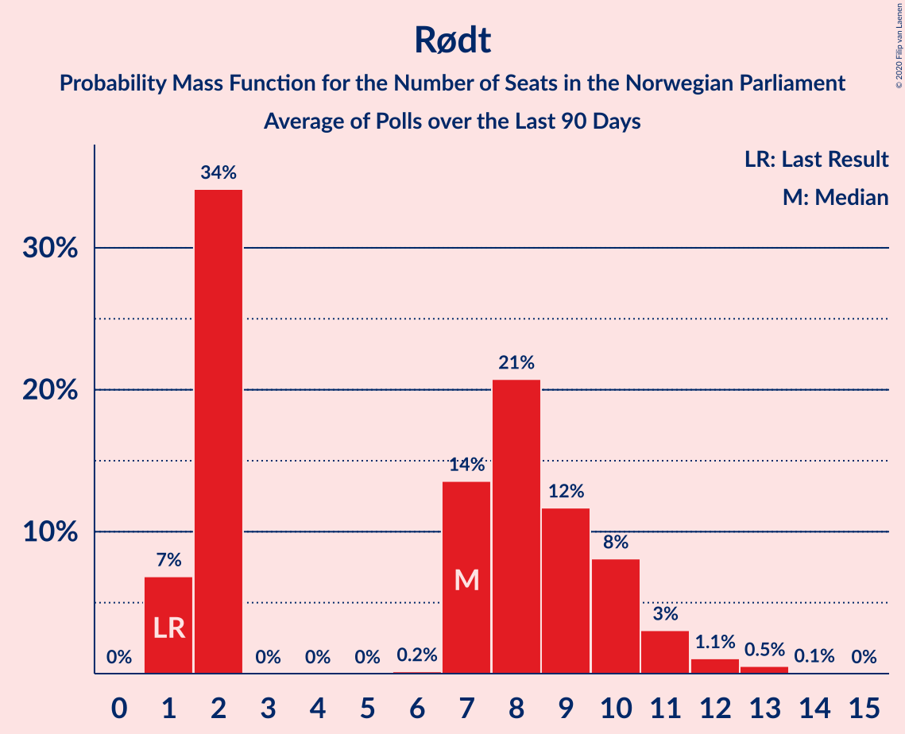

# Rødt

<a href="#voting-intentions">Voting Intentions</a> | <a href="#seats">Seats</a>

## Voting Intentions

Last result: **2.4%** (General Election of 8–9 September 2013)

### Confidence Intervals

| Period     | Polling firm/Commissioner(s) | Median | 80% Confidence Interval | 90% Confidence Interval | 95% Confidence Interval | 99% Confidence Interval |
|:----------:|:----------------:|:-----------:|:-----------------------:|:-----------------------:|:-----------------------:|:-----------------------:|
| N/A | [Poll Average](average.html) | 5.0% | 3.8–6.6% | 3.6–7.0% | 3.3–7.4% | 2.9–8.0% |
| [17–23 June 2021](2021-06-23-Norstat.html) | Norstat   Dagens Næringsliv | 4.9% | 4.1–6.1% | 3.8–6.4% | 3.6–6.7% | 3.2–7.3% |
| [15–20 June 2021](2021-06-20-Norstat.html) | Norstat   Vårt Land | 5.8% | 4.9–6.9% | 4.7–7.2% | 4.5–7.5% | 4.1–8.1% |
| [9–14 June 2021](2021-06-14-Respons.html) | Respons   Bergens Tidende and VG | 4.5% | 3.8–5.5% | 3.6–5.7% | 3.4–6.0% | 3.0–6.5% |
| [8–13 June 2021](2021-06-13-Sentio.html) | Sentio   Amedia and Nettavisen | 4.8% | 4.0–5.8% | 3.8–6.1% | 3.6–6.3% | 3.3–6.8% |
| [26 May–11 June 2021](2021-06-11-Norstat.html) | Norstat   NRK | 4.2% | 3.9–4.5% | 3.9–4.5% | 3.8–4.6% | 3.7–4.7% |
| [1–7 June 2021](2021-06-07-OpinionPerduco.html) | Opinion Perduco   Avisenes Nyhetsbyrå, Dagsavisen and FriFagbevegelse | 4.6% | 3.8–5.8% | 3.5–6.1% | 3.3–6.4% | 2.9–7.0% |
| [31 May–4 June 2021](2021-06-04-Norfakta.html) | Norfakta   Klassekampen and Nationen | 5.6% | 4.8–6.6% | 4.5–7.0% | 4.3–7.2% | 4.0–7.7% |
| [25–31 May 2021](2021-05-31-Norstat.html) | Norstat   NRK | 5.9% | 5.0–7.0% | 4.8–7.3% | 4.5–7.6% | 4.2–8.1% |
| [25–31 May 2021](2021-05-31-KantarTNS.html) | Kantar TNS   TV2 | 6.5% | 5.7–7.6% | 5.5–7.8% | 5.3–8.1% | 4.9–8.6% |
| [24–26 May 2021](2021-05-26-IpsosMMI.html) | Ipsos MMI   Dagbladet | 4.1% | 3.3–5.2% | 3.0–5.5% | 2.9–5.7% | 2.5–6.3% |
| [18–25 May 2021](2021-05-25-Norstat.html) | Norstat   Vårt Land | 4.9% | 4.1–5.9% | 3.9–6.2% | 3.7–6.4% | 3.3–6.9% |
| [20–24 May 2021](2021-05-24-Norstat.html) | Norstat   Dagens Næringsliv | 3.9% | 3.2–4.8% | 3.0–5.1% | 2.9–5.3% | 2.6–5.8% |
| [11–16 May 2021](2021-05-16-Sentio.html) | Sentio   Amedia and Nettavisen | 4.6% | 3.9–5.6% | 3.6–5.9% | 3.5–6.1% | 3.1–6.6% |
| [13 May 2021](2021-05-13-OpinionPerduco.html) | Opinion Perduco   Avisenes Nyhetsbyrå, Dagsavisen and FriFagbevegelse | 4.4% | 3.6–5.3% | 3.4–5.6% | 3.2–5.9% | 2.9–6.4% |
| [5–10 May 2021](2021-05-10-ResponsAnalyse.html) | Respons Analyse   VG | 4.0% | 3.3–4.9% | 3.1–5.2% | 2.9–5.4% | 2.6–5.9% |
| [4–5 May 2021](2021-05-05-Norfakta.html) | Norfakta   Klassekampen and Nationen | 4.2% | 3.5–5.1% | 3.3–5.4% | 3.1–5.6% | 2.8–6.1% |
| [27 April–3 May 2021](2021-05-03-Norstat.html) | Norstat   Aftenposten and NRK | 4.4% | 3.6–5.4% | 3.4–5.6% | 3.3–5.9% | 2.9–6.4% |
| [26–30 April 2021](2021-04-30-KantarTNS.html) | Kantar TNS   TV2 | 4.6% | 3.9–5.6% | 3.6–5.9% | 3.5–6.1% | 3.1–6.6% |
| [26–28 April 2021](2021-04-28-IpsosMMI.html) | Ipsos MMI   Dagbladet | 4.5% | 3.7–5.7% | 3.4–6.0% | 3.2–6.3% | 2.9–6.9% |
| [20–24 April 2021](2021-04-24-Norstat.html) | Norstat   Vårt Land | 3.7% | 3.1–4.6% | 2.9–4.9% | 2.7–5.1% | 2.4–5.6% |
| [7–20 April 2021](2021-04-20-Norstat.html) | Norstat   NRK | 3.7% | 3.5–3.9% | 3.4–4.0% | 3.4–4.1% | 3.3–4.2% |
| [13–19 April 2021](2021-04-19-Sentio.html) | Sentio   Amedia and Nettavisen | 4.1% | 3.4–5.0% | 3.2–5.3% | 3.0–5.5% | 2.7–6.0% |
| [14 April 2021](2021-04-14-OpinionPerduco.html) | Opinion Perduco   Avisenes Nyhetsbyrå, Dagsavisen and FriFagbevegelse | 4.0% | 3.3–5.0% | 3.1–5.3% | 3.0–5.5% | 2.6–6.0% |
| [7–12 April 2021](2021-04-12-ResponsAnalyse.html) | Respons Analyse   VG | 4.8% | 3.9–6.0% | 3.7–6.3% | 3.5–6.6% | 3.1–7.2% |
| [6–7 April 2021](2021-04-07-Norfakta.html) | Norfakta   Klassekampen and Nationen | 4.1% | 3.3–5.2% | 3.0–5.5% | 2.9–5.7% | 2.5–6.3% |
| [29 March–7 April 2021](2021-04-07-KantarTNS.html) | Kantar TNS   TV2 | 4.0% | 3.3–4.9% | 3.1–5.2% | 2.9–5.4% | 2.6–5.9% |
| [23–28 March 2021](2021-03-28-Norstat.html) | Norstat   Aftenposten and NRK | 3.8% | 3.1–4.7% | 2.9–5.0% | 2.8–5.2% | 2.5–5.7% |
| [22–24 March 2021](2021-03-24-IpsosMMI.html) | Ipsos MMI   Dagbladet | 4.9% | 4.1–6.1% | 3.8–6.4% | 3.6–6.7% | 3.2–7.3% |
| [16–21 March 2021](2021-03-21-Norstat.html) | Norstat   Aftenposten and NRK | 4.1% | 3.3–5.0% | 3.1–5.3% | 3.0–5.5% | 2.7–6.0% |
| [9–14 March 2021](2021-03-14-Sentio.html) | Sentio   Amedia and Nettavisen | 4.1% | 3.4–5.0% | 3.2–5.3% | 3.0–5.5% | 2.7–6.0% |
| [5–10 March 2021](2021-03-10-ResponsAnalyse.html) | Respons Analyse   VG | 4.7% | 3.9–5.7% | 3.7–5.9% | 3.6–6.2% | 3.2–6.7% |
| [1–8 March 2021](2021-03-08-OpinionPerduco.html) | Opinion Perduco | 4.9% | 4.0–6.1% | 3.7–6.4% | 3.5–6.8% | 3.1–7.4% |
| [2–3 March 2021](2021-03-03-Norfakta.html) | Norfakta   Klassekampen and Nationen | 3.8% | 3.1–4.7% | 2.9–5.0% | 2.8–5.2% | 2.5–5.6% |
| [22–28 February 2021](2021-02-28-Norstat.html) | Norstat   Aftenposten and NRK | 2.8% | 2.2–3.6% | 2.1–3.9% | 1.9–4.1% | 1.7–4.5% |
| [22–26 February 2021](2021-02-26-KantarTNS.html) | Kantar TNS   TV2 | 6.8% | 5.9–8.0% | 5.6–8.3% | 5.4–8.6% | 5.0–9.2% |
| [22–24 February 2021](2021-02-24-IpsosMMI.html) | Ipsos MMI   Dagbladet | 2.6% | 2.0–3.6% | 1.9–3.8% | 1.7–4.1% | 1.5–4.5% |
| [15–21 February 2021](2021-02-21-Norstat.html) | Norstat   Aftenposten and NRK | 4.8% | 4.0–5.8% | 3.8–6.1% | 3.6–6.3% | 3.3–6.8% |
| [9–14 February 2021](2021-02-14-Sentio.html) | Sentio   Amedia and Nettavisen | 3.8% | 3.1–4.7% | 2.9–5.0% | 2.8–5.2% | 2.5–5.6% |
| [1–8 February 2021](2021-02-08-OpinionPerduco.html) | Opinion Perduco   Avisenes Nyhetsbyrå, Dagsavisen and FriFagbevegelse | 2.9% | 2.3–3.7% | 2.1–4.0% | 2.0–4.2% | 1.8–4.6% |
| [2–3 February 2021](2021-02-03-Norfakta.html) | Norfakta   Klassekampen and Nationen | 3.8% | 3.1–4.7% | 2.9–5.0% | 2.8–5.2% | 2.5–5.6% |
| [27 January–2 February 2021](2021-02-02-ResponsAnalyse.html) | Respons Analyse   VG | 4.2% | 3.5–5.1% | 3.3–5.4% | 3.1–5.6% | 2.8–6.1% |
| [25–31 January 2021](2021-01-31-Norstat.html) | Norstat   Aftenposten and NRK | 4.0% | 3.2–5.1% | 2.9–5.4% | 2.8–5.7% | 2.4–6.3% |
| [25–29 January 2021](2021-01-29-KantarTNS.html) | Kantar TNS   TV2 | 5.3% | 4.3–6.5% | 4.1–6.8% | 3.9–7.1% | 3.5–7.7% |
| [25–27 January 2021](2021-01-27-IpsosMMI.html) | Ipsos MMI   Dagbladet | 5.3% | 4.4–6.5% | 4.1–6.9% | 3.9–7.2% | 3.5–7.8% |
| [18–24 January 2021](2021-01-24-Norstat.html) | Norstat   Aftenposten and NRK | 3.8% | 3.1–4.7% | 2.9–5.0% | 2.7–5.2% | 2.4–5.7% |
| [12–16 January 2021](2021-01-16-Sentio.html) | Sentio   Amedia and Nettavisen | 3.3% | 2.7–4.1% | 2.5–4.4% | 2.4–4.6% | 2.1–5.0% |
| [13 January 2021](2021-01-13-OpinionPerduco.html) | Opinion Perduco   Avisenes Nyhetsbyrå, Dagsavisen and FriFagbevegelse | 4.4% | 3.6–5.3% | 3.4–5.6% | 3.2–5.9% | 2.9–6.4% |
| [13 January 2021](2021-01-13-InFact.html) | InFact   Amedia and Nettavisen | 4.0% | 3.6–4.5% | 3.5–4.6% | 3.4–4.7% | 3.2–5.0% |
| [4–8 January 2021](2021-01-08-KantarTNS.html) | Kantar TNS   TV2 | 5.3% | 4.5–6.4% | 4.3–6.7% | 4.1–6.9% | 3.7–7.5% |
| [4–6 January 2021](2021-01-06-ResponsAnalyse.html) | Respons Analyse   VG | 3.4% | 2.8–4.3% | 2.6–4.5% | 2.4–4.7% | 2.2–5.2% |
| [5–6 January 2021](2021-01-06-Norfakta.html) | Norfakta   Klassekampen and Nationen | 3.1% | 2.4–4.0% | 2.2–4.3% | 2.1–4.5% | 1.8–5.0% |
| [28 December 2020–2 January 2021](2021-01-02-Norstat.html) | Norstat   Aftenposten and NRK | 3.7% | 3.1–4.6% | 2.9–4.9% | 2.7–5.2% | 2.4–5.6% |
| [14–16 December 2020](2020-12-16-IpsosMMI.html) | Ipsos MMI   Dagbladet | 3.7% | 2.9–4.8% | 2.7–5.0% | 2.5–5.3% | 2.2–5.9% |
| [7–13 December 2020](2020-12-13-Norstat.html) | Norstat   Aftenposten and NRK | 3.3% | 2.6–4.1% | 2.5–4.4% | 2.3–4.6% | 2.0–5.0% |
| [1–7 December 2020](2020-12-07-OpinionPerduco.html) | Opinion Perduco   Avisenes Nyhetsbyrå, Dagsavisen and FriFagbevegelse | 3.8% | 3.0–4.9% | 2.8–5.2% | 2.6–5.4% | 2.2–6.0% |
| [1–2 December 2020](2020-12-02-Norfakta.html) | Norfakta   Klassekampen and Nationen | 4.1% | 3.3–5.1% | 3.1–5.4% | 2.9–5.7% | 2.6–6.2% |
| [25–30 November 2020](2020-11-30-ResponsAnalyse.html) | Respons Analyse   VG | 3.7% | 3.0–4.6% | 2.9–4.8% | 2.7–5.1% | 2.4–5.5% |
| [24–30 November 2020](2020-11-30-KantarTNS.html) | Kantar TNS   TV2 | 6.4% | 5.4–7.7% | 5.1–8.0% | 4.9–8.3% | 4.5–9.0% |
| [24–29 November 2020](2020-11-29-Sentio.html) | Sentio   Amedia and Nettavisen | 4.0% | 3.3–4.9% | 3.1–5.2% | 2.9–5.4% | 2.7–5.9% |
| [16–18 November 2020](2020-11-18-IpsosMMI.html) | Ipsos MMI   Dagbladet | 3.1% | 2.4–4.2% | 2.2–4.5% | 2.1–4.7% | 1.8–5.2% |
| [9–15 November 2020](2020-11-15-Norstat.html) | Norstat   Aftenposten and NRK | 4.0% | 3.3–4.9% | 3.1–5.2% | 2.9–5.4% | 2.6–5.9% |
| [3–9 November 2020](2020-11-09-OpinionPerduco.html) | Opinion Perduco   Avisenes Nyhetsbyrå, Dagsavisen and FriFagbevegelse | 4.2% | 3.5–5.2% | 3.3–5.5% | 3.1–5.7% | 2.8–6.2% |
| [3–4 November 2020](2020-11-04-Norfakta.html) | Norfakta   Klassekampen and Nationen | 4.1% | 3.4–5.0% | 3.2–5.3% | 3.0–5.5% | 2.7–6.0% |
| [27 October–3 November 2020](2020-11-03-Sentio.html) | Sentio   Amedia and Nettavisen | 3.4% | 2.8–4.3% | 2.6–4.5% | 2.4–4.7% | 2.2–5.2% |
| [28–31 October 2020](2020-10-31-ResponsAnalyse.html) | Respons Analyse   VG | 4.1% | 3.4–5.0% | 3.2–5.3% | 3.0–5.5% | 2.7–6.0% |
| [26–30 October 2020](2020-10-30-KantarTNS.html) | Kantar TNS   TV2 | 4.9% | 4.0–6.0% | 3.8–6.3% | 3.6–6.6% | 3.2–7.2% |
| [20–25 October 2020](2020-10-25-Norstat.html) | Norstat   Aftenposten and NRK | 3.3% | 2.5–4.3% | 2.3–4.6% | 2.2–4.8% | 1.9–5.4% |
| [19–21 October 2020](2020-10-21-IpsosMMI.html) | Ipsos MMI   Dagbladet | 5.4% | 4.4–6.6% | 4.2–7.0% | 3.9–7.3% | 3.6–7.9% |
| [12–18 October 2020](2020-10-18-Norstat.html) | Norstat   Aftenposten and NRK | 4.1% | 3.3–5.0% | 3.1–5.3% | 3.0–5.5% | 2.7–6.0% |
| [6–12 October 2020](2020-10-12-Sentio.html) | Sentio   Amedia and Nettavisen | 3.3% | 2.7–4.1% | 2.5–4.4% | 2.4–4.6% | 2.1–5.0% |
| [6–7 October 2020](2020-10-07-Norfakta.html) | Norfakta   Klassekampen and Nationen | 4.4% | 3.6–5.5% | 3.4–5.8% | 3.2–6.1% | 2.8–6.7% |
| [29 September–4 October 2020](2020-10-04-OpinionPerduco.html) | Opinion Perduco   Avisenes Nyhetsbyrå, Dagsavisen and FriFagbevegelse | 4.6% | 3.8–5.6% | 3.6–5.9% | 3.4–6.1% | 3.1–6.6% |
| [28 September–2 October 2020](2020-10-02-KantarTNS.html) | Kantar TNS   TV2 | 6.2% | 5.2–7.5% | 4.9–7.9% | 4.6–8.2% | 4.2–8.9% |
| [28–30 September 2020](2020-09-30-ResponsAnalyse.html) | Respons Analyse   VG | 4.3% | 3.6–5.2% | 3.4–5.5% | 3.2–5.7% | 2.9–6.2% |
| [21–27 September 2020](2020-09-27-Norstat.html) | Norstat   Aftenposten and NRK | 5.2% | 4.2–6.4% | 4.0–6.8% | 3.8–7.1% | 3.4–7.7% |
| [21–25 September 2020](2020-09-25-IpsosMMI.html) | Ipsos MMI   Dagbladet | 3.6% | 2.9–4.7% | 2.7–5.0% | 2.5–5.3% | 2.2–5.9% |
| [14–20 September 2020](2020-09-20-Norstat.html) | Norstat   Aftenposten and NRK | 3.4% | 2.7–4.3% | 2.5–4.5% | 2.4–4.7% | 2.1–5.2% |
| [8–14 September 2020](2020-09-14-Sentio.html) | Sentio   Amedia and Nettavisen | 4.0% | 3.3–4.9% | 3.1–5.2% | 2.9–5.4% | 2.7–5.9% |
| [1–7 September 2020](2020-09-07-OpinionPerduco.html) | Opinion Perduco   Avisenes Nyhetsbyrå, Dagsavisen and FriFagbevegelse | 4.4% | 3.7–5.4% | 3.5–5.7% | 3.3–5.9% | 3.0–6.4% |
| [1–2 September 2020](2020-09-02-Norfakta.html) | Norfakta   Klassekampen and Nationen | 3.3% | 2.6–4.3% | 2.4–4.6% | 2.3–4.8% | 2.0–5.4% |
| [25 August–1 September 2020](2020-09-01-KantarTNS.html) | Kantar TNS   TV2 | 5.5% | 4.7–6.6% | 4.4–6.9% | 4.2–7.2% | 3.9–7.7% |
| [26–31 August 2020](2020-08-31-ResponsAnalyse.html) | Respons Analyse   VG | 3.9% | 3.2–4.8% | 3.0–5.1% | 2.9–5.3% | 2.6–5.8% |
| [24–31 August 2020](2020-08-31-Norstat.html) | Norstat   Aftenposten and NRK | 3.8% | 3.1–4.7% | 2.9–5.0% | 2.8–5.2% | 2.5–5.7% |
| [17–23 August 2020](2020-08-23-Norstat.html) | Norstat   Aftenposten and NRK | 4.2% | 3.5–5.2% | 3.3–5.4% | 3.1–5.7% | 2.8–6.2% |
| [17–19 August 2020](2020-08-19-IpsosMMI.html) | Ipsos MMI   Dagbladet | 4.3% | 3.5–5.5% | 3.3–5.8% | 3.1–6.1% | 2.7–6.7% |
| [11–16 August 2020](2020-08-16-Sentio.html) | Sentio   Amedia and Nettavisen | 4.1% | 3.4–5.0% | 3.2–5.3% | 3.0–5.5% | 2.7–6.0% |
| [6–11 August 2020](2020-08-11-ResponsAnalyse.html) | Respons Analyse   VG | 3.8% | 3.1–4.7% | 2.9–5.0% | 2.8–5.2% | 2.5–5.6% |
| [4–10 August 2020](2020-08-10-Norstat.html) | Norstat   Aftenposten and NRK | 3.8% | 3.1–4.7% | 2.9–5.0% | 2.7–5.2% | 2.5–5.7% |
| [4–7 August 2020](2020-08-07-KantarTNS.html) | Kantar TNS   TV2 | 4.5% | 3.7–5.7% | 3.4–6.0% | 3.2–6.3% | 2.9–6.8% |
| [4–5 August 2020](2020-08-05-Norfakta.html) | Norfakta   Klassekampen and Nationen | 4.1% | 3.4–5.0% | 3.2–5.3% | 3.0–5.5% | 2.7–6.0% |
| [4 August 2020](2020-08-04-InFact.html) | InFact   Avisa Nordland, Bergensavisen, iFinnmark and Nidaros | 5.8% | 4.9–6.8% | 4.7–7.1% | 4.5–7.4% | 4.1–7.9% |
| [29 July–3 August 2020](2020-08-03-OpinionPerduco.html) | Opinion Perduco   Avisenes Nyhetsbyrå, Dagsavisen and FriFagbevegelse | 4.3% | 3.5–5.5% | 3.2–5.8% | 3.0–6.1% | 2.7–6.7% |
| [7–8 July 2020](2020-07-08-Norfakta.html) | Norfakta   Klassekampen and Nationen | 4.2% | 3.5–5.1% | 3.3–5.4% | 3.1–5.6% | 2.8–6.1% |
| [24–30 June 2020](2020-06-30-KantarTNS.html) | Kantar TNS   TV2 | 5.8% | 4.9–7.0% | 4.6–7.4% | 4.4–7.7% | 3.9–8.3% |
| [22–24 June 2020](2020-06-24-IpsosMMI.html) | Ipsos MMI   Dagbladet | 3.0% | 2.4–3.8% | 2.2–4.1% | 2.1–4.3% | 1.9–4.7% |
| [15–21 June 2020](2020-06-21-Norstat.html) | Norstat   Aftenposten and NRK | 4.9% | 4.1–5.9% | 3.9–6.2% | 3.7–6.4% | 3.4–6.9% |
| [9–13 June 2020](2020-06-13-Sentio.html) | Sentio   Amedia and Nettavisen | 5.1% | 4.3–6.1% | 4.1–6.4% | 3.9–6.6% | 3.6–7.2% |
| [2–8 June 2020](2020-06-08-OpinionPerduco.html) | Opinion Perduco | 4.3% | 3.5–5.5% | 3.2–5.8% | 3.0–6.1% | 2.7–6.7% |
| [2–4 June 2020](2020-06-04-ResponsAnalyse.html) | Respons Analyse   VG | 4.7% | 3.9–5.7% | 3.7–5.9% | 3.5–6.2% | 3.2–6.7% |
| [2–3 June 2020](2020-06-03-Norfakta.html) | Norfakta   Klassekampen and Nationen | 4.9% | 4.1–5.9% | 3.9–6.2% | 3.7–6.4% | 3.4–6.9% |
| [26 May–1 June 2020](2020-06-01-Norstat.html) | Norstat   Aftenposten and NRK | 4.8% | 3.9–6.0% | 3.6–6.3% | 3.4–6.6% | 3.0–7.3% |
| [25–29 May 2020](2020-05-29-KantarTNS.html) | Kantar TNS   TV2 | 4.7% | 3.8–5.8% | 3.6–6.1% | 3.4–6.4% | 3.0–7.0% |
| [25–28 May 2020](2020-05-28-IpsosMMI.html) | Ipsos MMI   Dagbladet | 3.8% | 3.1–5.0% | 2.8–5.3% | 2.7–5.5% | 2.3–6.1% |
| [19–25 May 2020](2020-05-25-Norstat.html) | Norstat   Aftenposten and NRK | 4.6% | 3.8–5.6% | 3.6–5.9% | 3.4–6.1% | 3.1–6.6% |
| [12–16 May 2020](2020-05-16-Sentio.html) | Sentio   Amedia and Nettavisen | 3.3% | 2.7–4.1% | 2.5–4.4% | 2.4–4.6% | 2.1–5.0% |
| [5–10 May 2020](2020-05-10-OpinionPerduco.html) | Opinion Perduco | 3.7% | 3.0–4.6% | 2.9–4.9% | 2.7–5.1% | 2.4–5.6% |
| [5–6 May 2020](2020-05-06-Norfakta.html) | Norfakta   Klassekampen and Nationen | 4.3% | 3.5–5.4% | 3.3–5.7% | 3.1–6.0% | 2.8–6.5% |
| [30 April–5 May 2020](2020-05-05-ResponsAnalyse.html) | Respons Analyse   VG | 3.5% | 2.9–4.4% | 2.7–4.6% | 2.5–4.8% | 2.2–5.3% |
| [27 April–4 May 2020](2020-05-04-Norstat.html) | Norstat   Aftenposten and NRK | 3.3% | 2.7–4.2% | 2.5–4.5% | 2.4–4.7% | 2.1–5.1% |
| [27–29 April 2020](2020-04-29-KantarTNS.html) | Kantar TNS   TV2 | 5.3% | 4.5–6.3% | 4.2–6.6% | 4.0–6.8% | 3.7–7.4% |
| [20–26 April 2020](2020-04-26-Norstat.html) | Norstat   Aftenposten and NRK | 3.7% | 3.0–4.6% | 2.8–4.8% | 2.6–5.1% | 2.3–5.5% |
| [20–22 April 2020](2020-04-22-IpsosMMI.html) | Ipsos MMI   Dagbladet | 4.8% | 3.9–6.0% | 3.7–6.4% | 3.5–6.7% | 3.1–7.3% |
| [14–20 April 2020](2020-04-20-Sentio.html) | Sentio   Amedia and Nettavisen | 3.2% | 2.6–4.0% | 2.4–4.3% | 2.3–4.5% | 2.0–4.9% |
| [31 March–5 April 2020](2020-04-05-OpinionPerduco.html) | Opinion Perduco | 3.7% | 3.0–4.6% | 2.9–4.8% | 2.7–5.1% | 2.4–5.5% |
| [26 March–1 April 2020](2020-04-01-ResponsAnalyse.html) | Respons Analyse   VG | 3.5% | 2.9–4.4% | 2.7–4.6% | 2.5–4.8% | 2.2–5.3% |
| [31 March–1 April 2020](2020-04-01-Norfakta.html) | Norfakta   Klassekampen and Nationen | 2.5% | 2.0–3.3% | 1.8–3.5% | 1.7–3.7% | 1.5–4.1% |
| [25–31 March 2020](2020-03-31-KantarTNS.html) | Kantar TNS   TV2 | 3.9% | 3.1–4.9% | 2.9–5.2% | 2.7–5.5% | 2.3–6.1% |
| [23–29 March 2020](2020-03-29-Norstat.html) | Norstat   Aftenposten and NRK | 3.7% | 3.0–4.8% | 2.8–5.1% | 2.6–5.4% | 2.3–6.0% |
| [16–23 March 2020](2020-03-23-Norstat.html) | Norstat   Aftenposten and NRK | 4.1% | 3.4–5.0% | 3.2–5.3% | 3.0–5.6% | 2.7–6.1% |
| [18–20 March 2020](2020-03-20-IpsosMMI.html) | Ipsos MMI   Dagbladet | 4.8% | 3.9–6.0% | 3.6–6.4% | 3.4–6.7% | 3.0–7.4% |
| [10–16 March 2020](2020-03-16-Sentio.html) | Sentio   Amedia and Nettavisen | 2.7% | 2.1–3.5% | 2.0–3.7% | 1.9–3.9% | 1.6–4.3% |
| [3–9 March 2020](2020-03-09-OpinionPerduco.html) | Opinion Perduco | 3.9% | 3.2–4.8% | 3.0–5.1% | 2.9–5.3% | 2.6–5.8% |
| [3–4 March 2020](2020-03-04-Norfakta.html) | Norfakta   Klassekampen and Nationen | 5.1% | 4.3–6.1% | 4.1–6.4% | 3.9–6.6% | 3.6–7.2% |
| [27 February–2 March 2020](2020-03-02-ResponsAnalyse.html) | Respons Analyse   VG | 5.4% | 4.6–6.4% | 4.3–6.7% | 4.2–7.0% | 3.8–7.5% |
| [24 February–2 March 2020](2020-03-02-Norstat.html) | Norstat   Aftenposten and NRK | 4.6% | 3.7–5.8% | 3.5–6.2% | 3.3–6.5% | 2.9–7.1% |
| [24–28 February 2020](2020-02-28-KantarTNS.html) | Kantar TNS   TV2 | 4.1% | 3.3–5.2% | 3.1–5.5% | 2.9–5.8% | 2.6–6.4% |
| [17–23 February 2020](2020-02-23-Norstat.html) | Norstat   Vårt Land | 4.8% | 3.8–6.1% | 3.6–6.4% | 3.4–6.8% | 3.0–7.4% |
| [17–19 February 2020](2020-02-19-IpsosMMI.html) | Ipsos MMI   Dagbladet | 3.4% | 2.7–4.5% | 2.5–4.8% | 2.3–5.0% | 2.0–5.6% |
| [11–17 February 2020](2020-02-17-Sentio.html) | Sentio   Amedia and Nettavisen | 3.9% | 3.2–4.8% | 3.0–5.1% | 2.9–5.3% | 2.6–5.8% |
| [4–10 February 2020](2020-02-10-OpinionPerduco.html) | Opinion Perduco   Avisenes Nyhetsbyrå and Dagsavisen and FriFagbevegelse | 5.3% | 4.5–6.3% | 4.2–6.6% | 4.0–6.9% | 3.7–7.4% |
| [4–5 February 2020](2020-02-05-Norfakta.html) | Norfakta   Klassekampen and Nationen | 4.2% | 3.5–5.1% | 3.3–5.4% | 3.1–5.6% | 2.8–6.1% |
| [30 January–3 February 2020](2020-02-03-ResponsAnalyse.html) | Respons Analyse   VG | 4.6% | 3.8–5.6% | 3.6–5.8% | 3.5–6.1% | 3.1–6.6% |
| [27 January–2 February 2020](2020-02-02-Norstat.html) | Norstat   Aftenposten and NRK | 5.0% | 4.2–6.1% | 4.0–6.4% | 3.8–6.6% | 3.5–7.2% |
| [27–31 January 2020](2020-01-31-KantarTNS.html) | Kantar TNS   TV2 | 4.3% | 3.5–5.3% | 3.3–5.7% | 3.1–5.9% | 2.7–6.5% |
| [24–27 January 2020](2020-01-27-Sentio.html) | Sentio   Amedia and Nettavisen | 7.0% | 6.0–8.1% | 5.8–8.4% | 5.5–8.7% | 5.1–9.3% |
| [21–27 January 2020](2020-01-27-Norstat.html) | Norstat   Vårt Land | 3.7% | 2.9–4.8% | 2.6–5.2% | 2.5–5.4% | 2.1–6.1% |
| [20–22 January 2020](2020-01-22-IpsosMMI.html) | Ipsos MMI   Dagbladet | 4.1% | 3.3–5.2% | 3.1–5.5% | 2.9–5.8% | 2.6–6.4% |
| [20–21 January 2020](2020-01-21-ResponsAnalyse.html) | Respons Analyse   VG | 3.8% | 3.2–4.6% | 3.0–4.9% | 2.9–5.1% | 2.6–5.5% |
| [21 January 2020](2020-01-21-KantarTNS.html) | Kantar TNS   TV2 | 5.2% | 4.2–6.5% | 3.9–6.8% | 3.7–7.2% | 3.3–7.8% |
| [14–18 January 2020](2020-01-18-Sentio.html) | Sentio   Amedia and Nettavisen | 4.5% | 3.8–5.5% | 3.6–5.7% | 3.4–6.0% | 3.0–6.5% |
| [15 January 2020](2020-01-15-OpinionPerduco.html) | Opinion Perduco   Avisenes Nyhetsbyrå and Dagsavisen and FriFagbevegelse | 4.4% | 3.6–5.3% | 3.4–5.6% | 3.2–5.9% | 2.9–6.4% |
| [6–10 January 2020](2020-01-10-KantarTNS.html) | Kantar TNS   TV2 | 4.6% | 3.8–5.7% | 3.6–6.1% | 3.4–6.3% | 3.0–6.9% |
| [7–8 January 2020](2020-01-08-Norfakta.html) | Norfakta   Klassekampen and Nationen | 4.7% | 3.9–5.9% | 3.7–6.2% | 3.5–6.5% | 3.1–7.1% |
| [6 January 2020](2020-01-06-ResponsAnalyse.html) | Respons Analyse   VG | 5.1% | 4.3–6.1% | 4.1–6.4% | 3.9–6.6% | 3.6–7.2% |
| [30 December 2019–5 January 2020](2020-01-05-Norstat.html) | Norstat   Aftenposten and NRK | 3.6% | 3.0–4.6% | 2.8–4.8% | 2.6–5.0% | 2.3–5.5% |
| [16–18 December 2019](2019-12-18-IpsosMMI.html) | Ipsos MMI | 5.8% | 4.9–7.1% | 4.6–7.5% | 4.3–7.8% | 3.9–8.5% |
| [9–15 December 2019](2019-12-15-Norstat.html) | Norstat | 4.6% | 3.9–5.6% | 3.6–5.9% | 3.5–6.1% | 3.1–6.6% |
| [3–8 December 2019](2019-12-08-OpinionPerduco.html) | Opinion Perduco | 5.7% | 4.8–6.8% | 4.6–7.1% | 4.4–7.3% | 4.0–7.9% |
| [3–4 December 2019](2019-12-04-Norfakta.html) | Norfakta | 4.0% | 3.2–5.0% | 3.0–5.3% | 2.8–5.5% | 2.5–6.1% |
| [26 November–2 December 2019](2019-12-02-Sentio.html) | Sentio | 5.6% | 4.8–6.6% | 4.5–7.0% | 4.3–7.2% | 4.0–7.7% |
| [28 November–2 December 2019](2019-12-02-ResponsAnalyse.html) | Respons Analyse | 5.3% | 4.5–6.3% | 4.3–6.6% | 4.1–6.9% | 3.7–7.4% |
| [25–29 November 2019](2019-11-29-KantarTNS.html) | Kantar TNS | 5.0% | 4.2–6.2% | 3.9–6.5% | 3.7–6.8% | 3.3–7.4% |
| [19–25 November 2019](2019-11-25-Norstat.html) | Norstat | 4.5% | 3.7–5.7% | 3.5–6.0% | 3.3–6.3% | 2.9–6.9% |
| [18–20 November 2019](2019-11-20-IpsosMMI.html) | Ipsos MMI | 5.0% | 4.1–6.2% | 3.8–6.6% | 3.6–6.9% | 3.2–7.5% |
| [12–18 November 2019](2019-11-18-Norstat.html) | Norstat | 4.1% | 3.3–5.3% | 3.0–5.7% | 2.8–6.0% | 2.5–6.6% |
| [5–11 November 2019](2019-11-11-OpinionPerduco.html) | Opinion Perduco | 4.4% | 3.6–5.3% | 3.4–5.6% | 3.2–5.8% | 2.9–6.3% |
| [5–6 November 2019](2019-11-06-Norfakta.html) | Norfakta | 4.2% | 3.4–5.2% | 3.2–5.5% | 3.0–5.8% | 2.7–6.4% |
| [31 October–4 November 2019](2019-11-04-ResponsAnalyse.html) | Respons Analyse | 6.0% | 5.1–7.1% | 4.9–7.4% | 4.7–7.6% | 4.3–8.2% |
| [29 October–2 November 2019](2019-11-02-Sentio.html) | Sentio | 3.9% | 3.2–4.8% | 3.0–5.1% | 2.9–5.3% | 2.6–5.8% |
| [28 October–1 November 2019](2019-11-01-KantarTNS.html) | Kantar TNS | 6.6% | 5.6–7.8% | 5.3–8.2% | 5.1–8.5% | 4.6–9.2% |
| [22–28 October 2019](2019-10-28-Norstat.html) | Norstat | 6.0% | 5.0–7.3% | 4.7–7.7% | 4.5–8.0% | 4.0–8.7% |
| [21–23 October 2019](2019-10-23-IpsosMMI.html) | Ipsos MMI | 6.2% | 5.2–7.4% | 4.9–7.8% | 4.6–8.1% | 4.2–8.7% |
| [15–21 October 2019](2019-10-21-Norstat.html) | Norstat | 5.0% | 4.1–6.0% | 3.9–6.3% | 3.7–6.6% | 3.4–7.1% |
| [8–14 October 2019](2019-10-14-Sentio.html) | Sentio | 3.2% | 2.6–4.0% | 2.4–4.3% | 2.3–4.5% | 2.0–4.9% |
| [1–7 October 2019](2019-10-07-OpinionPerduco.html) | Opinion Perduco | 4.6% | 3.9–5.6% | 3.6–5.9% | 3.5–6.2% | 3.1–6.7% |
| [30 September–4 October 2019](2019-10-04-KantarTNS.html) | Kantar TNS | 6.2% | 5.2–7.4% | 4.9–7.7% | 4.7–8.0% | 4.3–8.6% |
| [1–2 October 2019](2019-10-02-Norfakta.html) | Norfakta | 4.0% | 3.2–5.0% | 3.0–5.3% | 2.8–5.5% | 2.5–6.1% |
| [24–30 September 2019](2019-09-30-Norstat.html) | Norstat | 3.7% | 2.9–4.8% | 2.6–5.2% | 2.5–5.4% | 2.1–6.1% |
| [23–25 September 2019](2019-09-25-ResponsAnalyse.html) | Respons Analyse | 3.3% | 2.7–4.1% | 2.5–4.4% | 2.4–4.6% | 2.1–5.0% |
| [23–25 September 2019](2019-09-25-IpsosMMI.html) | Ipsos MMI | 4.0% | 3.3–5.0% | 3.1–5.3% | 3.0–5.5% | 2.7–6.0% |
| [17–19 September 2019](2019-09-19-Norstat.html) | Norstat | 4.4% | 3.5–5.5% | 3.3–5.8% | 3.1–6.1% | 2.7–6.7% |
| [10–16 September 2019](2019-09-16-Sentio.html) | Sentio | 4.0% | 3.3–4.9% | 3.1–5.2% | 2.9–5.4% | 2.7–5.9% |
| [3–4 September 2019](2019-09-04-Norfakta.html) | Norfakta | 3.3% | 2.7–4.1% | 2.5–4.4% | 2.3–4.6% | 2.1–5.0% |
| [27 August–2 September 2019](2019-09-02-Norstat.html) | Norstat | 4.4% | 3.5–5.7% | 3.2–6.0% | 3.0–6.4% | 2.6–7.0% |
| [20–26 August 2019](2019-08-26-Norstat.html) | Norstat | 5.0% | 4.2–6.0% | 3.9–6.3% | 3.8–6.6% | 3.4–7.1% |
| [19–21 August 2019](2019-08-21-IpsosMMI.html) | Ipsos MMI | 4.5% | 3.6–5.6% | 3.4–5.9% | 3.2–6.2% | 2.8–6.8% |
| [13–18 August 2019](2019-08-18-Sentio.html) | Sentio | 4.8% | 4.0–5.8% | 3.8–6.1% | 3.6–6.3% | 3.3–6.8% |
| [6–12 August 2019](2019-08-12-Norstat.html) | Norstat | 6.5% | 5.4–7.8% | 5.1–8.2% | 4.9–8.5% | 4.4–9.2% |
| [5–9 August 2019](2019-08-09-KantarTNS.html) | Kantar TNS | 5.2% | 4.3–6.4% | 4.1–6.8% | 3.9–7.1% | 3.5–7.7% |
| [6–7 August 2019](2019-08-07-Norfakta.html) | Norfakta | 5.0% | 4.1–6.1% | 3.9–6.4% | 3.7–6.7% | 3.3–7.3% |
| [30 July–5 August 2019](2019-08-05-OpinionPerduco.html) | Opinion Perduco | 5.1% | 4.2–6.4% | 3.9–6.8% | 3.7–7.1% | 3.3–7.8% |
| [2–3 July 2019](2019-07-03-Norfakta.html) | Norfakta | 4.3% | 3.4–5.4% | 3.2–5.7% | 3.0–6.0% | 2.7–6.5% |
| [24–28 June 2019](2019-06-28-KantarTNS.html) | Kantar TNS | 5.6% | 4.7–6.8% | 4.5–7.2% | 4.2–7.5% | 3.8–8.1% |
| [24–26 June 2019](2019-06-26-IpsosMMI.html) | Ipsos MMI | 5.1% | 4.2–6.3% | 3.9–6.7% | 3.7–7.0% | 3.3–7.6% |
| [18–24 June 2019](2019-06-24-Norstat.html) | Norstat | 5.4% | 4.5–6.4% | 4.3–6.7% | 4.1–7.0% | 3.7–7.5% |
| [11–17 June 2019](2019-06-17-Sentio.html) | Sentio | 4.5% | 3.8–5.5% | 3.6–5.7% | 3.4–6.0% | 3.0–6.5% |
| [4–10 June 2019](2019-06-10-OpinionPerduco.html) | Opinion Perduco | 7.1% | 6.0–8.5% | 5.7–8.9% | 5.4–9.2% | 4.9–9.9% |
| [3–6 June 2019](2019-06-06-ResponsAnalyse.html) | Respons Analyse | 5.2% | 4.3–6.4% | 4.1–6.8% | 3.9–7.0% | 3.5–7.7% |
| [4–5 June 2019](2019-06-05-Norfakta.html) | Norfakta | 5.9% | 5.0–7.0% | 4.8–7.3% | 4.6–7.5% | 4.2–8.1% |
| [28 May–3 June 2019](2019-06-03-Norstat.html) | Norstat | 5.0% | 4.2–6.1% | 4.0–6.4% | 3.8–6.6% | 3.5–7.2% |
| [27–29 May 2019](2019-05-29-IpsosMMI.html) | Ipsos MMI | 5.1% | 4.2–6.3% | 4.0–6.7% | 3.8–7.0% | 3.4–7.6% |
| [21–27 May 2019](2019-05-27-Norstat.html) | Norstat | 4.8% | 4.0–5.8% | 3.8–6.1% | 3.6–6.4% | 3.2–6.9% |
| [14–18 May 2019](2019-05-18-Sentio.html) | Sentio | 6.6% | 5.7–7.7% | 5.4–8.0% | 5.2–8.3% | 4.8–8.9% |
| [7–13 May 2019](2019-05-13-OpinionPerduco.html) | Opinion Perduco | 5.0% | 4.2–6.1% | 4.0–6.4% | 3.8–6.6% | 3.5–7.2% |
| [7–8 May 2019](2019-05-08-Norfakta.html) | Norfakta | 4.9% | 4.1–5.9% | 3.9–6.2% | 3.7–6.4% | 3.4–6.9% |
| [30 April–6 May 2019](2019-05-06-Norstat.html) | Norstat | 5.0% | 4.2–6.0% | 4.0–6.3% | 3.8–6.5% | 3.5–7.1% |
| [29 April–3 May 2019](2019-05-03-KantarTNS.html) | Kantar TNS | 5.4% | 4.5–6.6% | 4.2–6.9% | 4.0–7.2% | 3.6–7.8% |
| [29 April–2 May 2019](2019-05-02-ResponsAnalyse.html) | Respons Analyse | 3.9% | 3.2–4.8% | 3.0–5.1% | 2.9–5.3% | 2.6–5.8% |
| [2 May 2019](2019-05-02-Norstat.html) | Norstat | 5.1% | 4.1–6.4% | 3.9–6.8% | 3.6–7.1% | 3.2–7.8% |
| [23–25 April 2019](2019-04-25-IpsosMMI.html) | Ipsos MMI | 4.5% | 3.7–5.5% | 3.5–5.7% | 3.3–6.0% | 3.0–6.5% |
| [16 April 2019](2019-04-16-Sentio.html) | Sentio | 4.6% | 3.9–5.6% | 3.6–5.9% | 3.5–6.1% | 3.1–6.6% |
| [2–8 April 2019](2019-04-08-OpinionPerduco.html) | Opinion Perduco | 4.5% | 3.7–5.5% | 3.5–5.8% | 3.4–6.0% | 3.0–6.5% |
| [2–4 April 2019](2019-04-04-ResponsAnalyse.html) | Respons Analyse | 4.7% | 3.9–5.7% | 3.7–5.9% | 3.6–6.2% | 3.2–6.7% |
| [2–3 April 2019](2019-04-03-Norfakta.html) | Norfakta | 4.3% | 3.6–5.2% | 3.4–5.5% | 3.2–5.7% | 2.9–6.2% |
| [26 March–1 April 2019](2019-04-01-Norstat.html) | Norstat | 3.7% | 2.9–4.8% | 2.6–5.2% | 2.5–5.4% | 2.1–6.1% |
| [25–29 March 2019](2019-03-29-KantarTNS.html) | Kantar TNS | 5.1% | 4.2–6.2% | 3.9–6.5% | 3.7–6.8% | 3.4–7.4% |
| [27 March 2019](2019-03-27-Norstat.html) | Norstat | 4.9% | 4.0–6.2% | 3.7–6.6% | 3.5–6.9% | 3.1–7.6% |
| [18–20 March 2019](2019-03-20-IpsosMMI.html) | Ipsos MMI | 5.6% | 4.8–6.7% | 4.5–7.0% | 4.3–7.3% | 3.9–7.8% |
| [12–18 March 2019](2019-03-18-Sentio.html) | Sentio | 5.4% | 4.6–6.4% | 4.3–6.7% | 4.2–7.0% | 3.8–7.5% |
| [5–11 March 2019](2019-03-11-OpinionPerduco.html) | Opinion Perduco | 4.9% | 4.1–5.9% | 3.9–6.2% | 3.7–6.5% | 3.4–7.0% |
| [5–6 March 2019](2019-03-06-Norfakta.html) | Norfakta | 4.5% | 3.6–5.6% | 3.4–5.9% | 3.2–6.2% | 2.8–6.8% |
| [28 February–4 March 2019](2019-03-04-ResponsAnalyse.html) | Respons Analyse | 5.0% | 4.2–6.0% | 4.0–6.3% | 3.8–6.5% | 3.5–7.1% |
| [26 February–4 March 2019](2019-03-04-Norstat.html) | Norstat | 4.7% | 3.8–6.0% | 3.6–6.4% | 3.4–6.7% | 3.0–7.3% |
| [25 February–1 March 2019](2019-03-01-KantarTNS.html) | Kantar TNS | 4.7% | 3.9–5.9% | 3.6–6.3% | 3.4–6.6% | 3.0–7.2% |
| [19–25 February 2019](2019-02-25-Norstat.html) | Norstat | 6.2% | 5.1–7.6% | 4.8–8.0% | 4.6–8.4% | 4.1–9.1% |
| [18–20 February 2019](2019-02-20-IpsosMMI.html) | Ipsos MMI | 6.7% | 5.7–7.8% | 5.4–8.2% | 5.2–8.4% | 4.8–9.0% |
| [12–19 February 2019](2019-02-19-Sentio.html) | Sentio | 5.1% | 4.3–6.1% | 4.1–6.4% | 3.9–6.6% | 3.6–7.2% |
| [5–11 February 2019](2019-02-11-OpinionPerduco.html) | Opinion Perduco | 7.6% | 6.4–9.0% | 6.1–9.4% | 5.8–9.8% | 5.3–10.5% |
| [5–6 February 2019](2019-02-06-Norfakta.html) | Norfakta | 4.0% | 3.2–5.0% | 3.0–5.3% | 2.8–5.6% | 2.5–6.1% |
| [31 January–4 February 2019](2019-02-04-ResponsAnalyse.html) | Respons Analyse | 3.6% | 2.9–4.7% | 2.7–5.0% | 2.5–5.2% | 2.1–5.8% |
| [29 January–4 February 2019](2019-02-04-Norstat.html) | Norstat | 4.9% | 3.9–6.1% | 3.7–6.5% | 3.5–6.8% | 3.1–7.5% |
| [28 January–2 February 2019](2019-02-02-KantarTNS.html) | Kantar TNS | 6.3% | 5.3–7.5% | 5.0–7.8% | 4.8–8.1% | 4.4–8.8% |
| [22–28 January 2019](2019-01-28-Norstat.html) | Norstat | 4.3% | 3.5–5.5% | 3.2–5.8% | 3.1–6.1% | 2.7–6.8% |
| [21–23 January 2019](2019-01-23-IpsosMMI.html) | Ipsos MMI | 4.2% | 3.4–5.1% | 3.2–5.4% | 3.1–5.7% | 2.7–6.2% |
| [15–21 January 2019](2019-01-21-Sentio.html) | Sentio | 3.1% | 2.4–4.1% | 2.2–4.4% | 2.0–4.7% | 1.7–5.3% |
| [8–14 January 2019](2019-01-14-OpinionPerduco.html) | Opinion Perduco | 5.5% | 4.5–6.8% | 4.3–7.2% | 4.0–7.5% | 3.6–8.2% |
| [3–10 January 2019](2019-01-10-KantarTNS.html) | Kantar TNS | 4.6% | 3.8–5.7% | 3.5–6.1% | 3.3–6.4% | 3.0–6.9% |
| [8–9 January 2019](2019-01-09-Norfakta.html) | Norfakta | 3.9% | 3.2–4.8% | 3.0–5.1% | 2.9–5.3% | 2.6–5.8% |
| [3–7 January 2019](2019-01-07-ResponsAnalyse.html) | Respons Analyse | 3.1% | 2.5–3.9% | 2.3–4.2% | 2.2–4.4% | 1.9–4.8% |
| [2–7 January 2019](2019-01-07-Norstat.html) | Norstat | 3.2% | 2.5–4.3% | 2.3–4.6% | 2.2–4.8% | 1.9–5.4% |
| [17–19 December 2018](2018-12-19-IpsosMMI.html) | Ipsos MMI | 2.6% | 2.1–3.5% | 1.9–3.7% | 1.8–3.9% | 1.6–4.3% |
| [11–17 December 2018](2018-12-17-Norstat.html) | Norstat | 4.1% | 3.4–5.1% | 3.2–5.3% | 3.0–5.6% | 2.7–6.1% |
| [4–10 December 2018](2018-12-10-OpinionPerduco.html) | Opinion Perduco | 5.1% | 4.1–6.3% | 3.9–6.7% | 3.7–7.0% | 3.3–7.6% |
| [4–5 December 2018](2018-12-05-Norfakta.html) | Norfakta | 3.2% | 2.5–4.1% | 2.3–4.4% | 2.1–4.7% | 1.8–5.2% |
| [28 November–4 December 2018](2018-12-04-Sentio.html) | Sentio | 4.8% | 3.9–6.0% | 3.7–6.3% | 3.5–6.6% | 3.1–7.3% |
| [29 November–4 December 2018](2018-12-04-ResponsAnalyse.html) | Respons Analyse | 3.9% | 3.2–4.8% | 3.0–5.1% | 2.9–5.3% | 2.6–5.8% |
| [3 December 2018](2018-12-03-KantarTNS.html) | Kantar TNS | 4.8% | 4.0–6.0% | 3.7–6.4% | 3.5–6.7% | 3.1–7.3% |
| [20–25 November 2018](2018-11-25-Norstat.html) | Norstat | 3.3% | 2.7–4.2% | 2.5–4.5% | 2.3–4.7% | 2.1–5.2% |
| [19–21 November 2018](2018-11-21-IpsosMMI.html) | Ipsos MMI | 3.6% | 2.9–4.5% | 2.7–4.8% | 2.6–5.0% | 2.3–5.5% |
| [13–19 November 2018](2018-11-19-Norstat.html) | Norstat | 3.3% | 2.7–4.2% | 2.5–4.4% | 2.3–4.7% | 2.1–5.1% |
| [6–12 November 2018](2018-11-12-OpinionPerduco.html) | Opinion Perduco | 4.8% | 3.9–6.1% | 3.7–6.4% | 3.5–6.7% | 3.1–7.3% |
| [5–7 November 2018](2018-11-07-ResponsAnalyse.html) | Respons Analyse | 3.9% | 3.2–4.8% | 3.0–5.1% | 2.9–5.3% | 2.6–5.8% |
| [30 October–5 November 2018](2018-11-05-Sentio.html) | Sentio | 4.4% | 3.5–5.5% | 3.3–5.9% | 3.1–6.2% | 2.7–6.8% |
| [5 November 2018](2018-11-05-Norfakta.html) | Norfakta | 3.9% | 3.1–4.9% | 2.9–5.2% | 2.7–5.4% | 2.4–6.0% |
| [24–30 October 2018](2018-10-30-KantarTNS.html) | Kantar TNS | 4.8% | 4.0–6.0% | 3.7–6.3% | 3.6–6.6% | 3.2–7.2% |
| [23–28 October 2018](2018-10-28-Norstat.html) | Norstat | 3.5% | 2.7–4.5% | 2.5–4.8% | 2.3–5.1% | 2.0–5.7% |
| [22–24 October 2018](2018-10-24-IpsosMMI.html) | Ipsos MMI | 4.0% | 3.3–5.0% | 3.1–5.2% | 2.9–5.5% | 2.6–6.0% |
| [16–22 October 2018](2018-10-22-Norstat.html) | Norstat | 3.9% | 3.2–4.9% | 3.0–5.1% | 2.9–5.4% | 2.6–5.9% |
| [9–18 October 2018](2018-10-18-Sentio.html) | Sentio | 3.6% | 2.8–4.6% | 2.6–4.9% | 2.4–5.2% | 2.1–5.8% |
| [4–10 October 2018](2018-10-10-OpinionPerduco.html) | Opinion Perduco | 5.1% | 4.2–6.4% | 3.9–6.8% | 3.7–7.1% | 3.3–7.7% |
| [9–10 October 2018](2018-10-10-InFact.html) | InFact | 4.1% | 3.4–5.0% | 3.2–5.2% | 3.0–5.5% | 2.7–5.9% |
| [1–3 October 2018](2018-10-03-ResponsAnalyse.html) | Respons Analyse | 3.0% | 2.4–3.8% | 2.2–4.1% | 2.1–4.3% | 1.9–4.7% |
| [2–3 October 2018](2018-10-03-Norfakta.html) | Norfakta | 4.0% | 3.3–4.9% | 3.1–5.2% | 2.9–5.4% | 2.6–5.9% |
| [24–29 September 2018](2018-09-29-Norstat.html) | Norstat | 3.2% | 2.6–4.1% | 2.4–4.4% | 2.3–4.6% | 2.0–5.1% |
| [24–28 September 2018](2018-09-28-KantarTNS.html) | Kantar TNS | 4.1% | 3.3–5.1% | 3.1–5.4% | 2.9–5.7% | 2.6–6.2% |
| [24–26 September 2018](2018-09-26-IpsosMMI.html) | Ipsos MMI | 4.6% | 3.8–5.6% | 3.6–5.9% | 3.4–6.2% | 3.1–6.7% |
| [18–24 September 2018](2018-09-24-Norstat.html) | Norstat | 5.0% | 4.2–6.1% | 4.0–6.4% | 3.8–6.6% | 3.5–7.2% |
| [11–17 September 2018](2018-09-17-Sentio.html) | Sentio | 4.8% | 3.9–6.0% | 3.7–6.4% | 3.5–6.7% | 3.1–7.3% |
| [6–10 September 2018](2018-09-10-ResponsAnalyse.html) | Respons Analyse | 4.7% | 3.9–5.7% | 3.7–5.9% | 3.5–6.2% | 3.2–6.7% |
| [4–10 September 2018](2018-09-10-OpinionPerduco.html) | Opinion Perduco | 3.5% | 2.8–4.6% | 2.6–4.9% | 2.4–5.2% | 2.1–5.8% |
| [6 September 2018](2018-09-06-KantarTNS.html) | Kantar TNS | 5.6% | 4.6–6.8% | 4.3–7.2% | 4.1–7.5% | 3.7–8.1% |
| [4–5 September 2018](2018-09-05-Norfakta.html) | Norfakta | 4.6% | 3.8–5.7% | 3.6–6.1% | 3.4–6.3% | 3.0–6.9% |
| [28 August–2 September 2018](2018-09-02-Norstat.html) | Norstat | 4.4% | 3.6–5.6% | 3.4–5.9% | 3.2–6.2% | 2.8–6.8% |
| [20–26 August 2018](2018-08-26-Norstat.html) | Norstat | 4.2% | 3.5–5.2% | 3.3–5.5% | 3.1–5.7% | 2.8–6.2% |
| [20–25 August 2018](2018-08-25-IpsosMMI.html) | Ipsos MMI | 3.7% | 3.0–4.6% | 2.8–4.9% | 2.7–5.1% | 2.4–5.6% |
| [14–20 August 2018](2018-08-20-Sentio.html) | Sentio | 4.4% | 3.6–5.6% | 3.3–6.0% | 3.1–6.2% | 2.7–6.9% |
| [16–20 August 2018](2018-08-20-ResponsAnalyse.html) | Respons Analyse | 4.1% | 3.4–5.0% | 3.2–5.3% | 3.0–5.5% | 2.7–6.0% |
| [7–12 August 2018](2018-08-12-Norstat.html) | Norstat | 5.3% | 4.3–6.6% | 4.1–7.0% | 3.8–7.3% | 3.4–8.0% |
| [7–8 August 2018](2018-08-08-Norfakta.html) | Norfakta | 3.7% | 3.0–4.6% | 2.8–4.8% | 2.7–5.0% | 2.4–5.5% |
| [1–7 August 2018](2018-08-07-KantarTNS.html) | Kantar TNS | 5.3% | 4.3–6.5% | 4.1–6.8% | 3.9–7.1% | 3.5–7.8% |
| [31 July–6 August 2018](2018-08-06-OpinionPerduco.html) | Opinion Perduco | 5.8% | 4.8–7.1% | 4.5–7.5% | 4.3–7.8% | 3.9–8.5% |
| [3–4 July 2018](2018-07-04-Norfakta.html) | Norfakta | 3.9% | 3.2–5.0% | 3.0–5.3% | 2.8–5.6% | 2.4–6.1% |
| [25–27 June 2018](2018-06-27-IpsosMMI.html) | Ipsos MMI | 3.8% | 3.1–4.8% | 2.9–5.0% | 2.8–5.3% | 2.5–5.7% |
| [19–25 June 2018](2018-06-25-Norstat.html) | Norstat | 4.9% | 4.1–5.9% | 3.9–6.2% | 3.7–6.5% | 3.3–7.0% |
| [12–16 June 2018](2018-06-16-Sentio.html) | Sentio | 5.3% | 4.3–6.5% | 4.1–6.9% | 3.8–7.2% | 3.4–7.8% |
| [5–11 June 2018](2018-06-11-OpinionPerduco.html) | Opinion Perduco | 4.7% | 3.9–5.9% | 3.6–6.3% | 3.4–6.6% | 3.0–7.2% |
| [5–6 June 2018](2018-06-06-Norfakta.html) | Norfakta | 4.4% | 3.6–5.5% | 3.4–5.8% | 3.2–6.1% | 2.9–6.7% |
| [31 May–4 June 2018](2018-06-04-ResponsAnalyse.html) | Respons Analyse | 4.8% | 4.0–5.8% | 3.8–6.1% | 3.6–6.3% | 3.3–6.8% |
| [27 May–4 June 2018](2018-06-04-Norstat.html) | Norstat | 4.5% | 3.7–5.5% | 3.5–5.8% | 3.4–6.1% | 3.0–6.6% |
| [28 May–1 June 2018](2018-06-01-KantarTNS.html) | Kantar TNS | 5.6% | 4.7–6.9% | 4.4–7.2% | 4.2–7.5% | 3.8–8.2% |
| [28–30 May 2018](2018-05-30-IpsosMMI.html) | Ipsos MMI | 3.2% | 2.6–4.1% | 2.4–4.3% | 2.2–4.5% | 2.0–5.0% |
| [22–28 May 2018](2018-05-28-Norstat.html) | Norstat | 4.0% | 3.3–4.9% | 3.1–5.2% | 2.9–5.5% | 2.6–5.9% |
| [14–22 May 2018](2018-05-22-Sentio.html) | Sentio | 3.5% | 2.7–4.5% | 2.5–4.8% | 2.3–5.1% | 2.0–5.6% |
| [8–14 May 2018](2018-05-14-OpinionPerduco.html) | Opinion Perduco | 4.3% | 3.5–5.5% | 3.3–5.9% | 3.1–6.1% | 2.7–6.8% |
| [8–9 May 2018](2018-05-09-Norfakta.html) | Norfakta | 3.2% | 2.5–4.2% | 2.3–4.4% | 2.2–4.7% | 1.9–5.2% |
| [3–7 May 2018](2018-05-07-ResponsAnalyse.html) | Respons Analyse | 3.5% | 2.9–4.4% | 2.7–4.6% | 2.5–4.8% | 2.2–5.3% |
| [30 April–7 May 2018](2018-05-07-Norstat.html) | Norstat | 3.6% | 2.8–4.6% | 2.6–4.9% | 2.4–5.2% | 2.1–5.8% |
| [30 April–2 May 2018](2018-05-02-KantarTNS.html) | Kantar TNS | 3.7% | 3.0–4.8% | 2.8–5.1% | 2.6–5.3% | 2.3–5.9% |
| [26–30 April 2018](2018-04-30-Norstat.html) | Norstat | 4.0% | 3.2–4.9% | 3.0–5.2% | 2.9–5.4% | 2.6–5.9% |
| [23–25 April 2018](2018-04-25-IpsosMMI.html) | Ipsos MMI | 4.7% | 3.9–5.7% | 3.7–6.0% | 3.5–6.2% | 3.2–6.7% |
| [17–23 April 2018](2018-04-23-Sentio.html) | Sentio | 2.8% | 2.1–3.8% | 1.9–4.1% | 1.8–4.3% | 1.5–4.8% |
| [10–16 April 2018](2018-04-16-OpinionPerduco.html) | Opinion Perduco | 4.9% | 4.0–6.1% | 3.8–6.5% | 3.6–6.8% | 3.2–7.4% |
| [5–9 April 2018](2018-04-09-ResponsAnalyse.html) | Respons Analyse | 3.9% | 3.2–4.8% | 3.0–5.1% | 2.9–5.3% | 2.6–5.8% |
| [3–9 April 2018](2018-04-09-Norstat.html) | Norstat | 3.8% | 3.1–4.7% | 2.9–5.0% | 2.7–5.2% | 2.4–5.7% |
| [3–6 April 2018](2018-04-06-KantarTNS.html) | Kantar TNS | 5.4% | 4.5–6.6% | 4.3–7.0% | 4.1–7.3% | 3.6–7.9% |
| [3–4 April 2018](2018-04-04-Norfakta.html) | Norfakta | 4.3% | 3.6–5.2% | 3.4–5.5% | 3.2–5.7% | 2.9–6.2% |
| [20–24 March 2018](2018-03-24-Norstat.html) | Norstat | 4.0% | 3.3–4.9% | 3.1–5.2% | 2.9–5.4% | 2.6–5.9% |
| [19–21 March 2018](2018-03-21-IpsosMMI.html) | Ipsos MMI | 3.3% | 2.7–4.2% | 2.5–4.5% | 2.3–4.7% | 2.1–5.1% |
| [20 March 2018](2018-03-20-KantarTNS.html) | Kantar TNS | 1.6% | 1.1–2.6% | 0.9–2.9% | 0.8–3.1% | 0.6–3.7% |
| [13–19 March 2018](2018-03-19-Sentio.html) | Sentio | 3.9% | 3.2–5.1% | 2.9–5.4% | 2.7–5.7% | 2.4–6.2% |
| [15–16 March 2018](2018-03-16-ResponsAnalyse.html) | Respons Analyse | 2.5% | 2.0–3.3% | 1.8–3.5% | 1.7–3.7% | 1.5–4.1% |
| [6–12 March 2018](2018-03-12-OpinionPerduco.html) | Opinion Perduco | 4.5% | 3.7–5.7% | 3.4–6.1% | 3.2–6.4% | 2.8–7.0% |
| [6–7 March 2018](2018-03-07-Norfakta.html) | Norfakta | 3.3% | 2.6–4.3% | 2.4–4.5% | 2.3–4.8% | 2.0–5.3% |
| [1–5 March 2018](2018-03-05-ResponsAnalyse.html) | Respons Analyse | 3.1% | 2.5–3.9% | 2.3–4.1% | 2.2–4.4% | 1.9–4.8% |
| [27 February–5 March 2018](2018-03-05-Norstat.html) | Norstat | 3.2% | 2.6–4.1% | 2.4–4.4% | 2.3–4.6% | 2.0–5.0% |
| [26 February–3 March 2018](2018-03-03-KantarTNS.html) | Kantar TNS | 3.8% | 3.1–4.8% | 2.9–5.1% | 2.7–5.4% | 2.4–5.9% |
| [20–25 February 2018](2018-02-25-Norstat.html) | Norstat | 3.1% | 2.5–4.0% | 2.3–4.2% | 2.2–4.4% | 1.9–4.9% |
| [19–21 February 2018](2018-02-21-IpsosMMI.html) | Ipsos MMI | 3.3% | 2.6–4.1% | 2.5–4.4% | 2.3–4.6% | 2.0–5.1% |
| [13–19 February 2018](2018-02-19-Sentio.html) | Sentio | 3.2% | 2.5–4.2% | 2.3–4.5% | 2.2–4.8% | 1.9–5.3% |
| [6–12 February 2018](2018-02-12-OpinionPerduco.html) | Opinion Perduco | 4.0% | 3.2–5.1% | 3.0–5.5% | 2.8–5.7% | 2.4–6.3% |
| [5–7 February 2018](2018-02-07-ResponsAnalyse.html) | Respons Analyse | 3.3% | 2.7–4.1% | 2.5–4.4% | 2.3–4.6% | 2.1–5.0% |
| [30 January–5 February 2018](2018-02-05-Norstat.html) | Norstat | 2.9% | 2.3–3.7% | 2.1–3.9% | 2.0–4.1% | 1.7–4.6% |
| [29 January–5 February 2018](2018-02-05-KantarTNS.html) | Kantar TNS | 3.6% | 2.9–4.7% | 2.7–4.9% | 2.5–5.2% | 2.2–5.7% |
| [30–31 January 2018](2018-01-31-Norfakta.html) | Norfakta | 2.6% | 2.0–3.5% | 1.8–3.7% | 1.7–4.0% | 1.4–4.5% |
| [23–28 January 2018](2018-01-28-Norstat.html) | Norstat | 2.8% | 2.2–3.6% | 2.0–3.8% | 1.9–4.1% | 1.7–4.5% |
| [22–24 January 2018](2018-01-24-IpsosMMI.html) | Ipsos MMI | 3.0% | 2.4–3.9% | 2.2–4.1% | 2.1–4.4% | 1.8–4.8% |
| [16–21 January 2018](2018-01-21-Sentio.html) | Sentio | 3.1% | 2.4–4.2% | 2.2–4.5% | 2.1–4.7% | 1.8–5.2% |
| [9–15 January 2018](2018-01-15-OpinionPerduco.html) | Opinion Perduco | 3.0% | 2.3–4.0% | 2.1–4.3% | 2.0–4.6% | 1.7–5.1% |
| [10–12 January 2018](2018-01-12-ResponsAnalyse.html) | Respons Analyse | 2.9% | 2.3–3.7% | 2.2–3.9% | 2.0–4.1% | 1.8–4.6% |
| [8–10 January 2018](2018-01-10-ResponsAnalyse.html) | Respons Analyse | 2.7% | 2.1–3.6% | 1.9–3.9% | 1.8–4.1% | 1.5–4.6% |
| [3–9 January 2018](2018-01-09-KantarTNS.html) | Kantar TNS | 2.9% | 2.3–3.9% | 2.1–4.2% | 2.0–4.4% | 1.7–4.9% |
| [2–8 January 2018](2018-01-08-Norstat.html) | Norstat | 2.9% | 2.3–3.7% | 2.1–3.9% | 2.0–4.1% | 1.7–4.5% |
| [2–3 January 2018](2018-01-03-Norfakta.html) | Norfakta | 3.1% | 2.5–3.9% | 2.3–4.2% | 2.2–4.4% | 1.9–4.8% |
| [18–20 December 2017](2017-12-20-IpsosMMI.html) | Ipsos MMI | 1.9% | 1.5–2.7% | 1.3–2.9% | 1.2–3.0% | 1.0–3.4% |
| [12–18 December 2017](2017-12-18-Norstat.html) | Norstat | 2.8% | 2.3–3.7% | 2.1–3.9% | 2.0–4.1% | 1.7–4.5% |
| [5–11 December 2017](2017-12-11-Sentio.html) | Sentio | 2.6% | 2.0–3.5% | 1.8–3.8% | 1.7–4.0% | 1.4–4.5% |
| [4–8 December 2017](2017-12-08-KantarTNS.html) | Kantar TNS | 2.8% | 2.2–3.8% | 2.0–4.0% | 1.9–4.3% | 1.6–4.8% |
| [5–6 December 2017](2017-12-06-Norfakta.html) | Norfakta | 2.0% | 1.5–2.8% | 1.4–3.1% | 1.3–3.3% | 1.1–3.7% |
| [28 November–4 December 2017](2017-12-04-OpinionPerduco.html) | Opinion Perduco | 2.5% | 1.9–3.4% | 1.7–3.6% | 1.6–3.9% | 1.3–4.4% |
| [21–27 November 2017](2017-11-27-Norstat.html) | Norstat | 1.7% | 1.3–2.4% | 1.1–2.6% | 1.1–2.8% | 0.9–3.1% |
| [20–22 November 2017](2017-11-22-IpsosMMI.html) | Ipsos MMI | 2.8% | 2.2–3.7% | 2.1–3.9% | 1.9–4.1% | 1.7–4.6% |
| [14–20 November 2017](2017-11-20-Norstat.html) | Norstat | 2.9% | 2.3–3.8% | 2.2–4.0% | 2.0–4.2% | 1.8–4.6% |
| [7–13 November 2017](2017-11-13-Sentio.html) | Sentio | 3.0% | 2.4–4.0% | 2.2–4.2% | 2.0–4.5% | 1.8–5.0% |
| [6–10 November 2017](2017-11-10-KantarTNS.html) | Kantar TNS | 3.9% | 3.1–4.9% | 2.9–5.2% | 2.7–5.4% | 2.4–5.9% |
| [7–8 November 2017](2017-11-08-Norfakta.html) | Norfakta | 3.3% | 2.6–4.2% | 2.4–4.5% | 2.3–4.7% | 2.0–5.2% |
| [31 October–6 November 2017](2017-11-06-OpinionPerduco.html) | Opinion Perduco | 2.8% | 2.1–3.7% | 2.0–4.0% | 1.8–4.2% | 1.6–4.7% |
| [25–31 October 2017](2017-10-31-Norstat.html) | Norstat | 2.3% | 1.8–3.1% | 1.7–3.3% | 1.6–3.5% | 1.3–3.9% |
| [23–25 October 2017](2017-10-25-IpsosMMI.html) | Ipsos MMI | 3.4% | 2.7–4.3% | 2.5–4.5% | 2.4–4.7% | 2.1–5.2% |
| [17–23 October 2017](2017-10-23-Norstat.html) | Norstat | 3.2% | 2.6–4.1% | 2.4–4.3% | 2.2–4.5% | 2.0–5.0% |
| [10–16 October 2017](2017-10-16-Sentio.html) | Sentio | 3.1% | 2.5–4.1% | 2.3–4.3% | 2.1–4.6% | 1.8–5.1% |
| [3–9 October 2017](2017-10-09-OpinionPerduco.html) | Opinion Perduco | 2.2% | 1.7–3.1% | 1.5–3.3% | 1.4–3.5% | 1.2–4.0% |
| [2–6 October 2017](2017-10-06-KantarTNS.html) | Kantar TNS | 3.7% | 3.0–4.6% | 2.8–4.8% | 2.7–5.1% | 2.4–5.5% |
| [3–4 October 2017](2017-10-04-Norfakta.html) | Norfakta | 1.8% | 1.3–2.5% | 1.2–2.7% | 1.1–2.9% | 0.9–3.3% |
| [27 September–1 October 2017](2017-10-01-Norstat.html) | Norstat | 2.6% | 2.0–3.4% | 1.8–3.6% | 1.7–3.8% | 1.5–4.2% |
| [25–27 September 2017](2017-09-27-IpsosMMI.html) | Ipsos MMI | 2.7% | 2.1–3.5% | 2.0–3.7% | 1.8–3.9% | 1.6–4.3% |
| [19–25 September 2017](2017-09-25-Norstat.html) | Norstat | 3.7% | 3.0–4.7% | 2.9–4.9% | 2.7–5.2% | 2.4–5.6% |
| [12–18 September 2017](2017-09-18-Sentio.html) | Sentio | 2.4% | 1.8–3.2% | 1.6–3.5% | 1.5–3.7% | 1.3–4.1% |

### Probability Mass Function

The following table shows the probability mass function per percentage block of voting intentions for the [poll average](average.html) for Rødt.

| Voting Intentions | Probability | Accumulated | Special Marks |
|:-----------------:|:-----------:|:-----------:|:-------------:|
| 0.5–1.5% | 0% | 100% |  |
| 1.5–2.5% | 0.1% | 100% | Last Result |
| 2.5–3.5% | 5% | 99.9% |  |
| 3.5–4.5% | 28% | 95% |  |
| 4.5–5.5% | 36% | 67% | Median |
| 5.5–6.5% | 21% | 31% |  |
| 6.5–7.5% | 9% | 10% |  |
| 7.5–8.5% | 2% | 2% |  |
| 8.5–9.5% | 0.1% | 0.1% |  |
| 9.5–10.5% | 0% | 0% |  |

## Seats

Last result: **1** seats (General Election of 8–9 September 2013)

### Confidence Intervals

| Period     | Polling firm/Commissioner(s) | Median | 80% Confidence Interval | 90% Confidence Interval | 95% Confidence Interval | 99% Confidence Interval |
|:----------:|:----------------:|:------:|:-----------------------:|:-----------------------:|:-----------------------:|:-----------------------:|
| N/A | [Poll Average](average.html) | 9 | 2–11 | 2–12 | 2–13 | 2–14 |
| [17–23 June 2021](2021-06-23-Norstat.html) | Norstat   Dagens Næringsliv | 9 | 7–11 | 2–11 | 2–12 | 2–12 |
| [15–20 June 2021](2021-06-20-Norstat.html) | Norstat   Vårt Land | 10 | 9–13 | 8–13 | 8–14 | 7–15 |
| [9–14 June 2021](2021-06-14-Respons.html) | Respons   Bergens Tidende and VG | 8 | 2–10 | 2–10 | 2–11 | 2–12 |
| [8–13 June 2021](2021-06-13-Sentio.html) | Sentio   Amedia and Nettavisen | 9 | 2–10 | 2–11 | 2–11 | 2–12 |
| [26 May–11 June 2021](2021-06-11-Norstat.html) | Norstat   NRK | 8 | 7–8 | 2–8 | 2–9 | 2–9 |
| [1–7 June 2021](2021-06-07-OpinionPerduco.html) | Opinion Perduco   Avisenes Nyhetsbyrå, Dagsavisen and FriFagbevegelse | 8 | 2–10 | 2–11 | 2–11 | 2–12 |
| [31 May–4 June 2021](2021-06-04-Norfakta.html) | Norfakta   Klassekampen and Nationen | 10 | 8–11 | 8–12 | 8–13 | 2–14 |
| [25–31 May 2021](2021-05-31-Norstat.html) | Norstat   NRK | 11 | 9–13 | 8–13 | 8–14 | 2–15 |
| [25–31 May 2021](2021-05-31-KantarTNS.html) | Kantar TNS   TV2 | 11 | 10–13 | 9–14 | 9–14 | 8–15 |
| [24–26 May 2021](2021-05-26-IpsosMMI.html) | Ipsos MMI   Dagbladet | 6 | 2–8 | 2–9 | 2–10 | 1–10 |
| [18–25 May 2021](2021-05-25-Norstat.html) | Norstat   Vårt Land | 9 | 7–10 | 2–11 | 2–11 | 2–12 |
| [20–24 May 2021](2021-05-24-Norstat.html) | Norstat   Dagens Næringsliv | 7 | 2–8 | 2–9 | 1–9 | 1–10 |
| [11–16 May 2021](2021-05-16-Sentio.html) | Sentio   Amedia and Nettavisen | 8 | 2–10 | 2–10 | 2–11 | 2–12 |
| [13 May 2021](2021-05-13-OpinionPerduco.html) | Opinion Perduco   Avisenes Nyhetsbyrå, Dagsavisen and FriFagbevegelse | 8 | 7–8 | 2–9 | 2–10 | 2–11 |
| [5–10 May 2021](2021-05-10-ResponsAnalyse.html) | Respons Analyse   VG | 7 | 2–8 | 2–9 | 2–9 | 1–10 |
| [4–5 May 2021](2021-05-05-Norfakta.html) | Norfakta   Klassekampen and Nationen | 7 | 2–9 | 2–10 | 2–10 | 1–11 |
| [27 April–3 May 2021](2021-05-03-Norstat.html) | Norstat   Aftenposten and NRK | 8 | 2–9 | 2–10 | 2–10 | 2–11 |
| [26–30 April 2021](2021-04-30-KantarTNS.html) | Kantar TNS   TV2 | 8 | 2–9 | 2–10 | 2–10 | 2–11 |
| [26–28 April 2021](2021-04-28-IpsosMMI.html) | Ipsos MMI   Dagbladet | 7 | 2–9 | 2–10 | 2–10 | 2–11 |
| [20–24 April 2021](2021-04-24-Norstat.html) | Norstat   Vårt Land | 2 | 2–8 | 2–9 | 1–9 | 1–10 |
| [7–20 April 2021](2021-04-20-Norstat.html) | Norstat   NRK | 2 | 2 | 2–7 | 2–8 | 2–8 |
| [13–19 April 2021](2021-04-19-Sentio.html) | Sentio   Amedia and Nettavisen | 7 | 2–9 | 2–9 | 2–10 | 1–11 |
| [14 April 2021](2021-04-14-OpinionPerduco.html) | Opinion Perduco   Avisenes Nyhetsbyrå, Dagsavisen and FriFagbevegelse | 7 | 2–9 | 2–10 | 1–10 | 1–11 |
| [7–12 April 2021](2021-04-12-ResponsAnalyse.html) | Respons Analyse   VG | 9 | 2–11 | 2–11 | 2–12 | 2–13 |
| [6–7 April 2021](2021-04-07-Norfakta.html) | Norfakta   Klassekampen and Nationen | 8 | 2–10 | 2–10 | 1–10 | 1–11 |
| [29 March–7 April 2021](2021-04-07-KantarTNS.html) | Kantar TNS   TV2 | 2 | 2–9 | 2–9 | 2–9 | 1–11 |
| [23–28 March 2021](2021-03-28-Norstat.html) | Norstat   Aftenposten and NRK | 2 | 2–8 | 2–9 | 1–9 | 1–10 |
| [22–24 March 2021](2021-03-24-IpsosMMI.html) | Ipsos MMI   Dagbladet | 9 | 6–10 | 2–11 | 2–11 | 2–12 |
| [16–21 March 2021](2021-03-21-Norstat.html) | Norstat   Aftenposten and NRK | 7 | 2–9 | 2–9 | 2–10 | 2–11 |
| [9–14 March 2021](2021-03-14-Sentio.html) | Sentio   Amedia and Nettavisen | 8 | 2–9 | 2–10 | 2–10 | 1–11 |
| [5–10 March 2021](2021-03-10-ResponsAnalyse.html) | Respons Analyse   VG | 8 | 7–10 | 2–11 | 2–11 | 2–12 |
| [1–8 March 2021](2021-03-08-OpinionPerduco.html) | Opinion Perduco | 9 | 7–11 | 2–11 | 2–12 | 2–13 |
| [2–3 March 2021](2021-03-03-Norfakta.html) | Norfakta   Klassekampen and Nationen | 2 | 2–8 | 2–9 | 1–9 | 1–10 |
| [22–28 February 2021](2021-02-28-Norstat.html) | Norstat   Aftenposten and NRK | 2 | 1–2 | 1–2 | 1–7 | 1–8 |
| [22–26 February 2021](2021-02-26-KantarTNS.html) | Kantar TNS   TV2 | 11 | 10–14 | 9–14 | 9–14 | 8–16 |
| [22–24 February 2021](2021-02-24-IpsosMMI.html) | Ipsos MMI   Dagbladet | 1 | 1–2 | 1–2 | 1–7 | 1–8 |
| [15–21 February 2021](2021-02-21-Norstat.html) | Norstat   Aftenposten and NRK | 8 | 2–10 | 2–11 | 2–11 | 2–12 |
| [9–14 February 2021](2021-02-14-Sentio.html) | Sentio   Amedia and Nettavisen | 2 | 2–8 | 2–9 | 1–9 | 1–10 |
| [1–8 February 2021](2021-02-08-OpinionPerduco.html) | Opinion Perduco   Avisenes Nyhetsbyrå, Dagsavisen and FriFagbevegelse | 2 | 1–2 | 1–2 | 1–7 | 1–8 |
| [2–3 February 2021](2021-02-03-Norfakta.html) | Norfakta   Klassekampen and Nationen | 2 | 2–8 | 1–8 | 1–9 | 1–10 |
| [27 January–2 February 2021](2021-02-02-ResponsAnalyse.html) | Respons Analyse   VG | 8 | 2–9 | 2–10 | 2–10 | 2–11 |
| [25–31 January 2021](2021-01-31-Norstat.html) | Norstat   Aftenposten and NRK | 7 | 2–9 | 2–9 | 1–10 | 1–11 |
| [25–29 January 2021](2021-01-29-KantarTNS.html) | Kantar TNS   TV2 | 9 | 7–11 | 6–11 | 2–12 | 2–13 |
| [25–27 January 2021](2021-01-27-IpsosMMI.html) | Ipsos MMI   Dagbladet | 10 | 8–12 | 7–12 | 2–13 | 2–14 |
| [18–24 January 2021](2021-01-24-Norstat.html) | Norstat   Aftenposten and NRK | 8 | 2–9 | 2–9 | 2–9 | 1–10 |
| [12–16 January 2021](2021-01-16-Sentio.html) | Sentio   Amedia and Nettavisen | 2 | 1–7 | 1–7 | 1–7 | 1–8 |
| [13 January 2021](2021-01-13-OpinionPerduco.html) | Opinion Perduco   Avisenes Nyhetsbyrå, Dagsavisen and FriFagbevegelse | 8 | 2–10 | 2–10 | 2–11 | 2–11 |
| [13 January 2021](2021-01-13-InFact.html) | InFact   Amedia and Nettavisen | 7 | 2–8 | 2–8 | 2–8 | 2–9 |
| [4–8 January 2021](2021-01-08-KantarTNS.html) | Kantar TNS   TV2 | 9 | 8–11 | 8–12 | 7–12 | 2–14 |
| [4–6 January 2021](2021-01-06-ResponsAnalyse.html) | Respons Analyse   VG | 7 | 1–8 | 1–8 | 1–8 | 1–9 |
| [5–6 January 2021](2021-01-06-Norfakta.html) | Norfakta   Klassekampen and Nationen | 2 | 1–2 | 1–7 | 1–8 | 1–9 |
| [28 December 2020–2 January 2021](2021-01-02-Norstat.html) | Norstat   Aftenposten and NRK | 2 | 2–8 | 2–9 | 2–9 | 1–10 |
| [14–16 December 2020](2020-12-16-IpsosMMI.html) | Ipsos MMI   Dagbladet | 2 | 2–8 | 1–9 | 1–9 | 1–10 |
| [7–13 December 2020](2020-12-13-Norstat.html) | Norstat   Aftenposten and NRK | 2 | 1–7 | 1–8 | 1–8 | 1–9 |
| [1–7 December 2020](2020-12-07-OpinionPerduco.html) | Opinion Perduco   Avisenes Nyhetsbyrå, Dagsavisen and FriFagbevegelse | 2 | 2–8 | 2–9 | 1–9 | 1–10 |
| [1–2 December 2020](2020-12-02-Norfakta.html) | Norfakta   Klassekampen and Nationen | 7 | 2–9 | 2–10 | 2–10 | 1–11 |
| [25–30 November 2020](2020-11-30-ResponsAnalyse.html) | Respons Analyse   VG | 2 | 2–8 | 1–8 | 1–9 | 1–10 |
| [24–30 November 2020](2020-11-30-KantarTNS.html) | Kantar TNS   TV2 | 11 | 9–14 | 9–14 | 8–15 | 8–16 |
| [24–29 November 2020](2020-11-29-Sentio.html) | Sentio   Amedia and Nettavisen | 7 | 2–9 | 2–9 | 2–10 | 1–10 |
| [16–18 November 2020](2020-11-18-IpsosMMI.html) | Ipsos MMI   Dagbladet | 2 | 1–6 | 1–7 | 1–8 | 1–9 |
| [9–15 November 2020](2020-11-15-Norstat.html) | Norstat   Aftenposten and NRK | 7 | 2–9 | 2–9 | 2–10 | 1–11 |
| [3–9 November 2020](2020-11-09-OpinionPerduco.html) | Opinion Perduco   Avisenes Nyhetsbyrå, Dagsavisen and FriFagbevegelse | 7 | 2–9 | 2–9 | 2–10 | 1–11 |
| [3–4 November 2020](2020-11-04-Norfakta.html) | Norfakta   Klassekampen and Nationen | 8 | 2–9 | 2–10 | 2–10 | 1–11 |
| [27 October–3 November 2020](2020-11-03-Sentio.html) | Sentio   Amedia and Nettavisen | 2 | 1–7 | 1–8 | 1–8 | 1–9 |
| [28–31 October 2020](2020-10-31-ResponsAnalyse.html) | Respons Analyse   VG | 7 | 2–9 | 2–9 | 2–10 | 1–10 |
| [26–30 October 2020](2020-10-30-KantarTNS.html) | Kantar TNS   TV2 | 8 | 7–10 | 2–11 | 2–11 | 2–13 |
| [20–25 October 2020](2020-10-25-Norstat.html) | Norstat   Aftenposten and NRK | 2 | 2–8 | 2–9 | 1–9 | 1–9 |
| [19–21 October 2020](2020-10-21-IpsosMMI.html) | Ipsos MMI   Dagbladet | 8 | 7–10 | 6–11 | 2–12 | 2–13 |
| [12–18 October 2020](2020-10-18-Norstat.html) | Norstat   Aftenposten and NRK | 7 | 2–9 | 2–10 | 2–10 | 1–11 |
| [6–12 October 2020](2020-10-12-Sentio.html) | Sentio   Amedia and Nettavisen | 2 | 1–7 | 1–7 | 1–7 | 1–9 |
| [6–7 October 2020](2020-10-07-Norfakta.html) | Norfakta   Klassekampen and Nationen | 8 | 2–9 | 2–10 | 2–11 | 1–12 |
| [29 September–4 October 2020](2020-10-04-OpinionPerduco.html) | Opinion Perduco   Avisenes Nyhetsbyrå, Dagsavisen and FriFagbevegelse | 8 | 2–10 | 2–11 | 2–11 | 2–12 |
| [28 September–2 October 2020](2020-10-02-KantarTNS.html) | Kantar TNS   TV2 | 10 | 8–13 | 8–13 | 7–14 | 6–15 |
| [28–30 September 2020](2020-09-30-ResponsAnalyse.html) | Respons Analyse   VG | 8 | 2–9 | 2–10 | 2–10 | 1–11 |
| [21–27 September 2020](2020-09-27-Norstat.html) | Norstat   Aftenposten and NRK | 9 | 7–12 | 2–12 | 2–12 | 2–14 |
| [21–25 September 2020](2020-09-25-IpsosMMI.html) | Ipsos MMI   Dagbladet | 2 | 1–8 | 1–9 | 1–10 | 1–10 |
| [14–20 September 2020](2020-09-20-Norstat.html) | Norstat   Aftenposten and NRK | 2 | 1–8 | 1–8 | 1–8 | 1–9 |
| [8–14 September 2020](2020-09-14-Sentio.html) | Sentio   Amedia and Nettavisen | 7 | 2–9 | 2–9 | 1–10 | 1–10 |
| [1–7 September 2020](2020-09-07-OpinionPerduco.html) | Opinion Perduco   Avisenes Nyhetsbyrå, Dagsavisen and FriFagbevegelse | 8 | 2–9 | 2–10 | 2–10 | 1–11 |
| [1–2 September 2020](2020-09-02-Norfakta.html) | Norfakta   Klassekampen and Nationen | 2 | 1–8 | 1–8 | 1–9 | 1–9 |
| [25 August–1 September 2020](2020-09-01-KantarTNS.html) | Kantar TNS   TV2 | 10 | 8–12 | 8–12 | 7–13 | 2–14 |
| [26–31 August 2020](2020-08-31-ResponsAnalyse.html) | Respons Analyse   VG | 7 | 2–8 | 1–9 | 1–10 | 1–10 |
| [24–31 August 2020](2020-08-31-Norstat.html) | Norstat   Aftenposten and NRK | 2 | 1–8 | 1–9 | 1–9 | 1–10 |
| [17–23 August 2020](2020-08-23-Norstat.html) | Norstat   Aftenposten and NRK | 7 | 2–9 | 2–9 | 2–10 | 1–11 |
| [17–19 August 2020](2020-08-19-IpsosMMI.html) | Ipsos MMI   Dagbladet | 7 | 2–10 | 2–10 | 2–11 | 1–12 |
| [11–16 August 2020](2020-08-16-Sentio.html) | Sentio   Amedia and Nettavisen | 7 | 2–9 | 2–10 | 1–10 | 1–11 |
| [6–11 August 2020](2020-08-11-ResponsAnalyse.html) | Respons Analyse   VG | 2 | 2–8 | 2–9 | 1–9 | 1–10 |
| [4–10 August 2020](2020-08-10-Norstat.html) | Norstat   Aftenposten and NRK | 2 | 2–8 | 1–9 | 1–9 | 1–10 |
| [4–7 August 2020](2020-08-07-KantarTNS.html) | Kantar TNS   TV2 | 8 | 2–9 | 2–10 | 2–10 | 1–12 |
| [4–5 August 2020](2020-08-05-Norfakta.html) | Norfakta   Klassekampen and Nationen | 7 | 2–9 | 2–9 | 1–9 | 1–10 |
| [4 August 2020](2020-08-04-InFact.html) | InFact   Avisa Nordland, Bergensavisen, iFinnmark and Nidaros | 10 | 8–11 | 7–12 | 7–12 | 6–13 |
| [29 July–3 August 2020](2020-08-03-OpinionPerduco.html) | Opinion Perduco   Avisenes Nyhetsbyrå, Dagsavisen and FriFagbevegelse | 8 | 2–10 | 2–10 | 1–11 | 1–12 |
| [7–8 July 2020](2020-07-08-Norfakta.html) | Norfakta   Klassekampen and Nationen | 8 | 2–9 | 2–10 | 1–10 | 1–11 |
| [24–30 June 2020](2020-06-30-KantarTNS.html) | Kantar TNS   TV2 | 10 | 8–13 | 7–13 | 7–14 | 2–15 |
| [22–24 June 2020](2020-06-24-IpsosMMI.html) | Ipsos MMI   Dagbladet | 1 | 1–2 | 1–2 | 1–7 | 1–8 |
| [15–21 June 2020](2020-06-21-Norstat.html) | Norstat   Aftenposten and NRK | 8 | 7–10 | 2–11 | 2–11 | 2–12 |
| [9–13 June 2020](2020-06-13-Sentio.html) | Sentio   Amedia and Nettavisen | 9 | 7–10 | 2–11 | 2–12 | 2–12 |
| [2–8 June 2020](2020-06-08-OpinionPerduco.html) | Opinion Perduco | 7 | 2–9 | 2–10 | 2–11 | 1–12 |
| [2–4 June 2020](2020-06-04-ResponsAnalyse.html) | Respons Analyse   VG | 8 | 2–10 | 2–10 | 2–11 | 2–12 |
| [2–3 June 2020](2020-06-03-Norfakta.html) | Norfakta   Klassekampen and Nationen | 9 | 7–10 | 2–11 | 2–11 | 2–12 |
| [26 May–1 June 2020](2020-06-01-Norstat.html) | Norstat   Aftenposten and NRK | 9 | 2–10 | 2–11 | 2–11 | 1–12 |
| [25–29 May 2020](2020-05-29-KantarTNS.html) | Kantar TNS   TV2 | 8 | 2–10 | 2–11 | 2–11 | 2–12 |
| [25–28 May 2020](2020-05-28-IpsosMMI.html) | Ipsos MMI   Dagbladet | 2 | 2–8 | 1–9 | 1–10 | 1–11 |
| [19–25 May 2020](2020-05-25-Norstat.html) | Norstat   Aftenposten and NRK | 8 | 2–10 | 2–10 | 2–11 | 2–12 |
| [12–16 May 2020](2020-05-16-Sentio.html) | Sentio   Amedia and Nettavisen | 2 | 1–8 | 1–8 | 1–8 | 1–9 |
| [5–10 May 2020](2020-05-10-OpinionPerduco.html) | Opinion Perduco | 2 | 1–8 | 1–8 | 1–9 | 1–10 |
| [5–6 May 2020](2020-05-06-Norfakta.html) | Norfakta   Klassekampen and Nationen | 8 | 2–9 | 2–9 | 2–9 | 1–11 |
| [30 April–5 May 2020](2020-05-05-ResponsAnalyse.html) | Respons Analyse   VG | 2 | 1–8 | 1–8 | 1–8 | 1–9 |
| [27 April–4 May 2020](2020-05-04-Norstat.html) | Norstat   Aftenposten and NRK | 2 | 1–7 | 1–8 | 1–8 | 1–9 |
| [27–29 April 2020](2020-04-29-KantarTNS.html) | Kantar TNS   TV2 | 9 | 7–11 | 7–12 | 2–12 | 2–13 |
| [20–26 April 2020](2020-04-26-Norstat.html) | Norstat   Aftenposten and NRK | 2 | 1–8 | 1–8 | 1–9 | 1–10 |
| [20–22 April 2020](2020-04-22-IpsosMMI.html) | Ipsos MMI   Dagbladet | 8 | 2–11 | 2–11 | 2–12 | 2–13 |
| [14–20 April 2020](2020-04-20-Sentio.html) | Sentio   Amedia and Nettavisen | 2 | 1–7 | 1–7 | 1–8 | 1–9 |
| [31 March–5 April 2020](2020-04-05-OpinionPerduco.html) | Opinion Perduco | 2 | 2–8 | 2–9 | 1–9 | 1–10 |
| [26 March–1 April 2020](2020-04-01-ResponsAnalyse.html) | Respons Analyse   VG | 2 | 1–8 | 1–8 | 1–9 | 1–10 |
| [31 March–1 April 2020](2020-04-01-Norfakta.html) | Norfakta   Klassekampen and Nationen | 1 | 1–2 | 1–2 | 1–2 | 1–2 |
| [25–31 March 2020](2020-03-31-KantarTNS.html) | Kantar TNS   TV2 | 7 | 2–8 | 1–9 | 1–10 | 1–11 |
| [23–29 March 2020](2020-03-29-Norstat.html) | Norstat   Aftenposten and NRK | 2 | 2–9 | 1–9 | 1–10 | 1–11 |
| [16–23 March 2020](2020-03-23-Norstat.html) | Norstat   Aftenposten and NRK | 8 | 2–9 | 2–10 | 2–10 | 1–11 |
| [18–20 March 2020](2020-03-20-IpsosMMI.html) | Ipsos MMI   Dagbladet | 8 | 2–11 | 2–11 | 2–12 | 2–13 |
| [10–16 March 2020](2020-03-16-Sentio.html) | Sentio   Amedia and Nettavisen | 1 | 1–2 | 1–2 | 1–2 | 1–8 |
| [3–9 March 2020](2020-03-09-OpinionPerduco.html) | Opinion Perduco | 2 | 2–9 | 1–9 | 1–9 | 1–10 |
| [3–4 March 2020](2020-03-04-Norfakta.html) | Norfakta   Klassekampen and Nationen | 9 | 7–10 | 2–11 | 2–11 | 2–13 |
| [27 February–2 March 2020](2020-03-02-ResponsAnalyse.html) | Respons Analyse   VG | 9 | 8–11 | 8–11 | 7–12 | 2–13 |
| [24 February–2 March 2020](2020-03-02-Norstat.html) | Norstat   Aftenposten and NRK | 8 | 2–10 | 2–11 | 2–11 | 2–12 |
| [24–28 February 2020](2020-02-28-KantarTNS.html) | Kantar TNS   TV2 | 7 | 2–9 | 2–10 | 1–10 | 1–11 |
| [17–23 February 2020](2020-02-23-Norstat.html) | Norstat   Vårt Land | 8 | 6–10 | 2–11 | 2–11 | 1–13 |
| [17–19 February 2020](2020-02-19-IpsosMMI.html) | Ipsos MMI   Dagbladet | 2 | 1–8 | 1–8 | 1–8 | 1–10 |
| [11–17 February 2020](2020-02-17-Sentio.html) | Sentio   Amedia and Nettavisen | 2 | 2–8 | 1–9 | 1–9 | 1–10 |
| [4–10 February 2020](2020-02-10-OpinionPerduco.html) | Opinion Perduco   Avisenes Nyhetsbyrå and Dagsavisen and FriFagbevegelse | 9 | 8–11 | 7–11 | 7–12 | 2–12 |
| [4–5 February 2020](2020-02-05-Norfakta.html) | Norfakta   Klassekampen and Nationen | 7 | 2–8 | 2–9 | 2–9 | 1–10 |
| [30 January–3 February 2020](2020-02-03-ResponsAnalyse.html) | Respons Analyse   VG | 8 | 2–10 | 2–10 | 2–11 | 2–11 |
| [27 January–2 February 2020](2020-02-02-Norstat.html) | Norstat   Aftenposten and NRK | 9 | 8–11 | 7–11 | 7–12 | 2–13 |
| [27–31 January 2020](2020-01-31-KantarTNS.html) | Kantar TNS   TV2 | 7 | 2–9 | 2–10 | 2–10 | 1–11 |
| [24–27 January 2020](2020-01-27-Sentio.html) | Sentio   Amedia and Nettavisen | 12 | 11–14 | 10–15 | 10–15 | 9–16 |
| [21–27 January 2020](2020-01-27-Norstat.html) | Norstat   Vårt Land | 2 | 2–8 | 1–9 | 1–9 | 1–10 |
| [20–22 January 2020](2020-01-22-IpsosMMI.html) | Ipsos MMI   Dagbladet | 7 | 2–9 | 2–10 | 2–10 | 1–11 |
| [20–21 January 2020](2020-01-21-ResponsAnalyse.html) | Respons Analyse   VG | 2 | 2–8 | 1–8 | 1–9 | 1–10 |
| [21 January 2020](2020-01-21-KantarTNS.html) | Kantar TNS   TV2 | 9 | 7–11 | 2–12 | 2–13 | 2–14 |
| [14–18 January 2020](2020-01-18-Sentio.html) | Sentio   Amedia and Nettavisen | 8 | 2–10 | 2–10 | 2–10 | 2–11 |
| [15 January 2020](2020-01-15-OpinionPerduco.html) | Opinion Perduco   Avisenes Nyhetsbyrå and Dagsavisen and FriFagbevegelse | 8 | 7–9 | 2–10 | 2–10 | 2–11 |
| [6–10 January 2020](2020-01-10-KantarTNS.html) | Kantar TNS   TV2 | 8 | 2–10 | 2–10 | 2–10 | 2–12 |
| [7–8 January 2020](2020-01-08-Norfakta.html) | Norfakta   Klassekampen and Nationen | 8 | 2–10 | 2–11 | 2–11 | 2–13 |
| [6 January 2020](2020-01-06-ResponsAnalyse.html) | Respons Analyse   VG | 8 | 7–11 | 7–12 | 7–12 | 2–12 |
| [30 December 2019–5 January 2020](2020-01-05-Norstat.html) | Norstat   Aftenposten and NRK | 2 | 2–8 | 1–8 | 1–9 | 1–9 |
| [16–18 December 2019](2019-12-18-IpsosMMI.html) | Ipsos MMI | 10 | 9–12 | 8–13 | 8–14 | 2–15 |
| [9–15 December 2019](2019-12-15-Norstat.html) | Norstat | 8 | 2–10 | 2–11 | 2–11 | 2–12 |
| [3–8 December 2019](2019-12-08-OpinionPerduco.html) | Opinion Perduco | 10 | 8–12 | 8–12 | 8–12 | 2–14 |
| [3–4 December 2019](2019-12-04-Norfakta.html) | Norfakta | 8 | 7–9 | 2–9 | 2–9 | 1–10 |
| [26 November–2 December 2019](2019-12-02-Sentio.html) | Sentio | 10 | 8–12 | 8–12 | 8–13 | 7–13 |
| [28 November–2 December 2019](2019-12-02-ResponsAnalyse.html) | Respons Analyse | 9 | 8–11 | 7–11 | 2–12 | 2–13 |
| [25–29 November 2019](2019-11-29-KantarTNS.html) | Kantar TNS | 8 | 6–10 | 6–10 | 2–11 | 2–12 |
| [19–25 November 2019](2019-11-25-Norstat.html) | Norstat | 7 | 2–10 | 2–10 | 2–10 | 2–11 |
| [18–20 November 2019](2019-11-20-IpsosMMI.html) | Ipsos MMI | 9 | 7–11 | 2–12 | 2–13 | 2–13 |
| [12–18 November 2019](2019-11-18-Norstat.html) | Norstat | 7 | 2–9 | 2–10 | 1–10 | 1–11 |
| [5–11 November 2019](2019-11-11-OpinionPerduco.html) | Opinion Perduco | 7 | 2–9 | 2–9 | 2–9 | 1–10 |
| [5–6 November 2019](2019-11-06-Norfakta.html) | Norfakta | 7 | 2–9 | 2–9 | 1–10 | 1–11 |
| [31 October–4 November 2019](2019-11-04-ResponsAnalyse.html) | Respons Analyse | 11 | 9–12 | 8–13 | 8–13 | 7–14 |
| [29 October–2 November 2019](2019-11-02-Sentio.html) | Sentio | 7 | 2–9 | 2–9 | 1–9 | 1–9 |
| [28 October–1 November 2019](2019-11-01-KantarTNS.html) | Kantar TNS | 12 | 10–13 | 10–14 | 9–15 | 8–15 |
| [22–28 October 2019](2019-10-28-Norstat.html) | Norstat | 10 | 9–12 | 8–12 | 7–13 | 7–15 |
| [21–23 October 2019](2019-10-23-IpsosMMI.html) | Ipsos MMI | 11 | 9–13 | 9–13 | 8–14 | 7–15 |
| [15–21 October 2019](2019-10-21-Norstat.html) | Norstat | 9 | 7–10 | 2–11 | 2–12 | 2–12 |
| [8–14 October 2019](2019-10-14-Sentio.html) | Sentio | 2 | 1–2 | 1–7 | 1–8 | 1–8 |
| [1–7 October 2019](2019-10-07-OpinionPerduco.html) | Opinion Perduco | 8 | 2–9 | 2–10 | 2–10 | 2–11 |
| [30 September–4 October 2019](2019-10-04-KantarTNS.html) | Kantar TNS | 11 | 9–12 | 9–13 | 8–13 | 7–15 |
| [1–2 October 2019](2019-10-02-Norfakta.html) | Norfakta | 2 | 2–9 | 2–9 | 1–10 | 1–10 |
| [24–30 September 2019](2019-09-30-Norstat.html) | Norstat | 2 | 2–8 | 1–8 | 1–8 | 1–10 |
| [23–25 September 2019](2019-09-25-ResponsAnalyse.html) | Respons Analyse | 2 | 1–7 | 1–7 | 1–7 | 1–8 |
| [23–25 September 2019](2019-09-25-IpsosMMI.html) | Ipsos MMI | 7 | 2–9 | 2–9 | 2–10 | 1–11 |
| [17–19 September 2019](2019-09-19-Norstat.html) | Norstat | 8 | 2–9 | 2–10 | 2–11 | 1–11 |
| [10–16 September 2019](2019-09-16-Sentio.html) | Sentio | 2 | 2–9 | 2–9 | 1–9 | 1–10 |
| [3–4 September 2019](2019-09-04-Norfakta.html) | Norfakta | 2 | 1–2 | 1–8 | 1–8 | 1–9 |
| [27 August–2 September 2019](2019-09-02-Norstat.html) | Norstat | 7 | 2–9 | 2–10 | 2–10 | 1–11 |
| [20–26 August 2019](2019-08-26-Norstat.html) | Norstat | 9 | 7–10 | 2–10 | 2–11 | 2–12 |
| [19–21 August 2019](2019-08-21-IpsosMMI.html) | Ipsos MMI | 8 | 2–9 | 2–10 | 2–11 | 2–12 |
| [13–18 August 2019](2019-08-18-Sentio.html) | Sentio | 7 | 6–10 | 6–10 | 2–10 | 2–11 |
| [6–12 August 2019](2019-08-12-Norstat.html) | Norstat | 11 | 9–13 | 8–14 | 8–15 | 7–16 |
| [5–9 August 2019](2019-08-09-KantarTNS.html) | Kantar TNS | 9 | 7–11 | 2–12 | 2–13 | 2–14 |
| [6–7 August 2019](2019-08-07-Norfakta.html) | Norfakta | 8 | 7–12 | 2–12 | 2–12 | 2–12 |
| [30 July–5 August 2019](2019-08-05-OpinionPerduco.html) | Opinion Perduco | 9 | 7–11 | 2–12 | 2–12 | 2–13 |
| [2–3 July 2019](2019-07-03-Norfakta.html) | Norfakta | 6 | 2–8 | 2–9 | 2–9 | 1–9 |
| [24–28 June 2019](2019-06-28-KantarTNS.html) | Kantar TNS | 9 | 7–10 | 6–11 | 6–11 | 2–13 |
| [24–26 June 2019](2019-06-26-IpsosMMI.html) | Ipsos MMI | 8 | 6–10 | 2–10 | 2–12 | 2–12 |
| [18–24 June 2019](2019-06-24-Norstat.html) | Norstat | 9 | 8–11 | 7–12 | 7–12 | 2–13 |
| [11–17 June 2019](2019-06-17-Sentio.html) | Sentio | 7 | 2–9 | 2–10 | 2–11 | 2–12 |
| [4–10 June 2019](2019-06-10-OpinionPerduco.html) | Opinion Perduco | 12 | 9–14 | 9–15 | 9–15 | 8–17 |
| [3–6 June 2019](2019-06-06-ResponsAnalyse.html) | Respons Analyse | 9 | 8–12 | 7–12 | 2–13 | 2–13 |
| [4–5 June 2019](2019-06-05-Norfakta.html) | Norfakta | 10 | 9–13 | 8–13 | 8–13 | 7–15 |
| [28 May–3 June 2019](2019-06-03-Norstat.html) | Norstat | 9 | 6–11 | 2–12 | 2–12 | 2–13 |
| [27–29 May 2019](2019-05-29-IpsosMMI.html) | Ipsos MMI | 9 | 7–10 | 6–11 | 2–12 | 2–13 |
| [21–27 May 2019](2019-05-27-Norstat.html) | Norstat | 9 | 6–10 | 2–10 | 2–11 | 2–12 |
| [14–18 May 2019](2019-05-18-Sentio.html) | Sentio | 12 | 10–13 | 9–14 | 9–14 | 8–16 |
| [7–13 May 2019](2019-05-13-OpinionPerduco.html) | Opinion Perduco | 10 | 8–11 | 8–11 | 2–11 | 2–13 |
| [7–8 May 2019](2019-05-08-Norfakta.html) | Norfakta | 9 | 2–10 | 2–11 | 2–12 | 2–13 |
| [30 April–6 May 2019](2019-05-06-Norstat.html) | Norstat | 9 | 7–11 | 2–11 | 2–12 | 2–13 |
| [29 April–3 May 2019](2019-05-03-KantarTNS.html) | Kantar TNS | 9 | 7–11 | 7–12 | 2–13 | 2–15 |
| [29 April–2 May 2019](2019-05-02-ResponsAnalyse.html) | Respons Analyse | 7 | 2–8 | 2–9 | 1–9 | 1–10 |
| [2 May 2019](2019-05-02-Norstat.html) | Norstat | 9 | 7–11 | 7–11 | 2–12 | 2–13 |
| [23–25 April 2019](2019-04-25-IpsosMMI.html) | Ipsos MMI | 8 | 2–10 | 2–10 | 2–11 | 2–12 |
| [16 April 2019](2019-04-16-Sentio.html) | Sentio | 8 | 7–10 | 2–10 | 2–11 | 2–12 |
| [2–8 April 2019](2019-04-08-OpinionPerduco.html) | Opinion Perduco | 8 | 2–9 | 2–10 | 2–11 | 2–12 |
| [2–4 April 2019](2019-04-04-ResponsAnalyse.html) | Respons Analyse | 9 | 2–9 | 2–10 | 2–11 | 2–11 |
| [2–3 April 2019](2019-04-03-Norfakta.html) | Norfakta | 8 | 2–10 | 2–10 | 2–11 | 1–11 |
| [26 March–1 April 2019](2019-04-01-Norstat.html) | Norstat | 2 | 2–8 | 1–9 | 1–9 | 1–10 |
| [25–29 March 2019](2019-03-29-KantarTNS.html) | Kantar TNS | 10 | 7–11 | 2–12 | 2–12 | 2–13 |
| [27 March 2019](2019-03-27-Norstat.html) | Norstat | 9 | 8–10 | 7–11 | 2–11 | 2–13 |
| [18–20 March 2019](2019-03-20-IpsosMMI.html) | Ipsos MMI | 10 | 9–12 | 8–13 | 8–13 | 2–14 |
| [12–18 March 2019](2019-03-18-Sentio.html) | Sentio | 10 | 9–11 | 8–13 | 8–13 | 7–14 |
| [5–11 March 2019](2019-03-11-OpinionPerduco.html) | Opinion Perduco | 8 | 7–9 | 2–10 | 2–11 | 2–12 |
| [5–6 March 2019](2019-03-06-Norfakta.html) | Norfakta | 8 | 2–10 | 2–10 | 2–11 | 2–12 |
| [28 February–4 March 2019](2019-03-04-ResponsAnalyse.html) | Respons Analyse | 9 | 8–11 | 2–11 | 2–12 | 2–13 |
| [26 February–4 March 2019](2019-03-04-Norstat.html) | Norstat | 8 | 7–10 | 2–11 | 2–11 | 2–13 |
| [25 February–1 March 2019](2019-03-01-KantarTNS.html) | Kantar TNS | 8 | 2–11 | 2–11 | 2–12 | 2–13 |
| [19–25 February 2019](2019-02-25-Norstat.html) | Norstat | 11 | 9–13 | 8–14 | 8–15 | 2–16 |
| [18–20 February 2019](2019-02-20-IpsosMMI.html) | Ipsos MMI | 13 | 11–14 | 10–14 | 9–15 | 9–16 |
| [12–19 February 2019](2019-02-19-Sentio.html) | Sentio | 9 | 8–11 | 8–12 | 7–12 | 2–13 |
| [5–11 February 2019](2019-02-11-OpinionPerduco.html) | Opinion Perduco | 13 | 11–15 | 11–17 | 10–17 | 10–19 |
| [5–6 February 2019](2019-02-06-Norfakta.html) | Norfakta | 2 | 2–9 | 2–9 | 1–10 | 1–11 |
| [31 January–4 February 2019](2019-02-04-ResponsAnalyse.html) | Respons Analyse | 2 | 1–8 | 1–9 | 1–9 | 1–10 |
| [29 January–4 February 2019](2019-02-04-Norstat.html) | Norstat | 9 | 8–11 | 2–12 | 2–12 | 2–13 |
| [28 January–2 February 2019](2019-02-02-KantarTNS.html) | Kantar TNS | 11 | 9–13 | 8–13 | 8–14 | 8–15 |
| [22–28 January 2019](2019-01-28-Norstat.html) | Norstat | 8 | 2–10 | 2–10 | 2–11 | 1–12 |
| [21–23 January 2019](2019-01-23-IpsosMMI.html) | Ipsos MMI | 8 | 2–9 | 2–10 | 2–10 | 1–11 |
| [15–21 January 2019](2019-01-21-Sentio.html) | Sentio | 2 | 1–6 | 1–8 | 1–8 | 1–9 |
| [8–14 January 2019](2019-01-14-OpinionPerduco.html) | Opinion Perduco | 10 | 8–13 | 8–13 | 2–14 | 2–15 |
| [3–10 January 2019](2019-01-10-KantarTNS.html) | Kantar TNS | 8 | 7–10 | 2–11 | 2–11 | 1–13 |
| [8–9 January 2019](2019-01-09-Norfakta.html) | Norfakta | 7 | 2–8 | 2–9 | 2–9 | 1–10 |
| [3–7 January 2019](2019-01-07-ResponsAnalyse.html) | Respons Analyse | 2 | 1–2 | 1–2 | 1–7 | 1–8 |
| [2–7 January 2019](2019-01-07-Norstat.html) | Norstat | 2 | 1–8 | 1–8 | 1–9 | 1–10 |
| [17–19 December 2018](2018-12-19-IpsosMMI.html) | Ipsos MMI | 1 | 1–2 | 1–2 | 1–2 | 1–8 |
| [11–17 December 2018](2018-12-17-Norstat.html) | Norstat | 7 | 2–9 | 2–9 | 2–10 | 1–11 |
| [4–10 December 2018](2018-12-10-OpinionPerduco.html) | Opinion Perduco | 9 | 7–11 | 2–11 | 2–12 | 2–13 |
| [4–5 December 2018](2018-12-05-Norfakta.html) | Norfakta | 2 | 1–7 | 1–8 | 1–9 | 1–9 |
| [28 November–4 December 2018](2018-12-04-Sentio.html) | Sentio | 9 | 7–10 | 2–11 | 2–11 | 2–12 |
| [29 November–4 December 2018](2018-12-04-ResponsAnalyse.html) | Respons Analyse | 8 | 2–8 | 2–9 | 2–10 | 1–10 |
| [3 December 2018](2018-12-03-KantarTNS.html) | Kantar TNS | 9 | 8–11 | 2–11 | 2–12 | 1–13 |
| [20–25 November 2018](2018-11-25-Norstat.html) | Norstat | 2 | 1–7 | 1–8 | 1–8 | 1–9 |
| [19–21 November 2018](2018-11-21-IpsosMMI.html) | Ipsos MMI | 2 | 2–8 | 2–8 | 1–9 | 1–9 |
| [13–19 November 2018](2018-11-19-Norstat.html) | Norstat | 2 | 1–7 | 1–8 | 1–8 | 1–9 |
| [6–12 November 2018](2018-11-12-OpinionPerduco.html) | Opinion Perduco | 8 | 7–11 | 7–12 | 2–12 | 2–13 |
| [5–7 November 2018](2018-11-07-ResponsAnalyse.html) | Respons Analyse | 2 | 2–8 | 1–9 | 1–9 | 1–10 |
| [30 October–5 November 2018](2018-11-05-Sentio.html) | Sentio | 8 | 2–9 | 2–10 | 2–10 | 1–11 |
| [5 November 2018](2018-11-05-Norfakta.html) | Norfakta | 2 | 1–8 | 1–8 | 1–9 | 1–10 |
| [24–30 October 2018](2018-10-30-KantarTNS.html) | Kantar TNS | 9 | 2–11 | 2–12 | 2–12 | 2–13 |
| [23–28 October 2018](2018-10-28-Norstat.html) | Norstat | 2 | 1–9 | 1–9 | 1–9 | 1–10 |
| [22–24 October 2018](2018-10-24-IpsosMMI.html) | Ipsos MMI | 7 | 2–8 | 2–9 | 2–9 | 1–10 |
| [16–22 October 2018](2018-10-22-Norstat.html) | Norstat | 2 | 2–9 | 1–9 | 1–10 | 1–10 |
| [9–18 October 2018](2018-10-18-Sentio.html) | Sentio | 2 | 1–8 | 1–10 | 1–10 | 1–10 |
| [4–10 October 2018](2018-10-10-OpinionPerduco.html) | Opinion Perduco | 11 | 8–12 | 2–12 | 2–14 | 2–14 |
| [9–10 October 2018](2018-10-10-InFact.html) | InFact | 2 | 2–8 | 2–9 | 2–10 | 1–10 |
| [1–3 October 2018](2018-10-03-ResponsAnalyse.html) | Respons Analyse | 2 | 1–2 | 1–7 | 1–7 | 1–9 |
| [2–3 October 2018](2018-10-03-Norfakta.html) | Norfakta | 7 | 2–9 | 2–9 | 2–9 | 1–10 |
| [24–29 September 2018](2018-09-29-Norstat.html) | Norstat | 1 | 1–7 | 1–8 | 1–9 | 1–9 |
| [24–28 September 2018](2018-09-28-KantarTNS.html) | Kantar TNS | 7 | 2–9 | 2–10 | 1–10 | 1–11 |
| [24–26 September 2018](2018-09-26-IpsosMMI.html) | Ipsos MMI | 9 | 2–10 | 2–11 | 2–11 | 2–12 |
| [18–24 September 2018](2018-09-24-Norstat.html) | Norstat | 9 | 7–12 | 2–12 | 2–13 | 2–13 |
| [11–17 September 2018](2018-09-17-Sentio.html) | Sentio | 8 | 2–11 | 2–11 | 2–12 | 1–13 |
| [6–10 September 2018](2018-09-10-ResponsAnalyse.html) | Respons Analyse | 9 | 2–10 | 2–10 | 2–11 | 2–12 |
| [4–10 September 2018](2018-09-10-OpinionPerduco.html) | Opinion Perduco | 2 | 1–8 | 1–9 | 1–9 | 1–10 |
| [6 September 2018](2018-09-06-KantarTNS.html) | Kantar TNS | 11 | 8–12 | 8–13 | 8–13 | 2–15 |
| [4–5 September 2018](2018-09-05-Norfakta.html) | Norfakta | 8 | 2–10 | 2–10 | 2–11 | 2–12 |
| [28 August–2 September 2018](2018-09-02-Norstat.html) | Norstat | 9 | 2–10 | 2–10 | 2–11 | 1–12 |
| [20–26 August 2018](2018-08-26-Norstat.html) | Norstat | 8 | 2–10 | 2–11 | 2–11 | 2–11 |
| [20–25 August 2018](2018-08-25-IpsosMMI.html) | Ipsos MMI | 2 | 2–8 | 1–8 | 1–9 | 1–10 |
| [14–20 August 2018](2018-08-20-Sentio.html) | Sentio | 8 | 2–10 | 2–10 | 2–11 | 1–12 |
| [16–20 August 2018](2018-08-20-ResponsAnalyse.html) | Respons Analyse | 7 | 2–9 | 2–10 | 2–10 | 1–10 |
| [7–12 August 2018](2018-08-12-Norstat.html) | Norstat | 10 | 8–12 | 7–12 | 2–13 | 2–14 |
| [7–8 August 2018](2018-08-08-Norfakta.html) | Norfakta | 2 | 1–7 | 1–8 | 1–8 | 1–10 |
| [1–7 August 2018](2018-08-07-KantarTNS.html) | Kantar TNS | 10 | 8–10 | 7–11 | 7–12 | 2–13 |
| [31 July–6 August 2018](2018-08-06-OpinionPerduco.html) | Opinion Perduco | 10 | 7–12 | 7–12 | 7–13 | 2–14 |
| [3–4 July 2018](2018-07-04-Norfakta.html) | Norfakta | 7 | 2–9 | 2–9 | 1–10 | 1–11 |
| [25–27 June 2018](2018-06-27-IpsosMMI.html) | Ipsos MMI | 7 | 2–9 | 2–9 | 2–10 | 1–10 |
| [19–25 June 2018](2018-06-25-Norstat.html) | Norstat | 9 | 7–11 | 2–11 | 2–11 | 2–12 |
| [12–16 June 2018](2018-06-16-Sentio.html) | Sentio | 11 | 8–12 | 2–12 | 2–12 | 2–13 |
| [5–11 June 2018](2018-06-11-OpinionPerduco.html) | Opinion Perduco | 8 | 2–11 | 2–11 | 2–12 | 2–12 |
| [5–6 June 2018](2018-06-06-Norfakta.html) | Norfakta | 8 | 2–10 | 2–10 | 2–11 | 1–11 |
| [31 May–4 June 2018](2018-06-04-ResponsAnalyse.html) | Respons Analyse | 9 | 2–11 | 2–12 | 2–12 | 2–12 |
| [27 May–4 June 2018](2018-06-04-Norstat.html) | Norstat | 8 | 2–10 | 2–10 | 2–11 | 2–12 |
| [28 May–1 June 2018](2018-06-01-KantarTNS.html) | Kantar TNS | 10 | 8–12 | 7–12 | 7–13 | 2–14 |
| [28–30 May 2018](2018-05-30-IpsosMMI.html) | Ipsos MMI | 2 | 1–7 | 1–8 | 1–8 | 1–9 |
| [22–28 May 2018](2018-05-28-Norstat.html) | Norstat | 2 | 2–8 | 2–9 | 1–10 | 1–11 |
| [14–22 May 2018](2018-05-22-Sentio.html) | Sentio | 2 | 2–9 | 1–9 | 1–9 | 1–10 |
| [8–14 May 2018](2018-05-14-OpinionPerduco.html) | Opinion Perduco | 8 | 2–9 | 2–10 | 2–11 | 1–12 |
| [8–9 May 2018](2018-05-09-Norfakta.html) | Norfakta | 2 | 1–7 | 1–8 | 1–8 | 1–9 |
| [3–7 May 2018](2018-05-07-ResponsAnalyse.html) | Respons Analyse | 2 | 1–8 | 1–8 | 1–8 | 1–10 |
| [30 April–7 May 2018](2018-05-07-Norstat.html) | Norstat | 2 | 1–8 | 1–9 | 1–9 | 1–10 |
| [30 April–2 May 2018](2018-05-02-KantarTNS.html) | Kantar TNS | 2 | 1–8 | 1–9 | 1–9 | 1–10 |
| [26–30 April 2018](2018-04-30-Norstat.html) | Norstat | 2 | 2–9 | 2–9 | 1–10 | 1–11 |
| [23–25 April 2018](2018-04-25-IpsosMMI.html) | Ipsos MMI | 8 | 2–10 | 2–10 | 2–10 | 2–12 |
| [17–23 April 2018](2018-04-23-Sentio.html) | Sentio | 2 | 1–7 | 1–8 | 1–8 | 1–8 |
| [10–16 April 2018](2018-04-16-OpinionPerduco.html) | Opinion Perduco | 9 | 7–11 | 2–11 | 2–12 | 2–13 |
| [5–9 April 2018](2018-04-09-ResponsAnalyse.html) | Respons Analyse | 7 | 2–8 | 2–9 | 2–9 | 1–10 |
| [3–9 April 2018](2018-04-09-Norstat.html) | Norstat | 2 | 2–9 | 2–9 | 1–9 | 1–10 |
| [3–6 April 2018](2018-04-06-KantarTNS.html) | Kantar TNS | 10 | 8–12 | 8–13 | 7–13 | 2–14 |
| [3–4 April 2018](2018-04-04-Norfakta.html) | Norfakta | 8 | 2–10 | 2–10 | 2–11 | 1–11 |
| [20–24 March 2018](2018-03-24-Norstat.html) | Norstat | 7 | 2–8 | 2–9 | 2–10 | 1–10 |
| [19–21 March 2018](2018-03-21-IpsosMMI.html) | Ipsos MMI | 2 | 2–8 | 1–8 | 1–9 | 1–10 |
| [20 March 2018](2018-03-20-KantarTNS.html) | Kantar TNS | 1 | 0–1 | 0–1 | 0–2 | 0–2 |
| [13–19 March 2018](2018-03-19-Sentio.html) | Sentio | 2 | 2–9 | 2–10 | 1–10 | 1–11 |
| [15–16 March 2018](2018-03-16-ResponsAnalyse.html) | Respons Analyse | 1 | 1–2 | 1–2 | 1–2 | 1–2 |
| [6–12 March 2018](2018-03-12-OpinionPerduco.html) | Opinion Perduco | 8 | 2–10 | 2–11 | 2–11 | 1–12 |
| [6–7 March 2018](2018-03-07-Norfakta.html) | Norfakta | 2 | 1–8 | 1–9 | 1–9 | 1–9 |
| [1–5 March 2018](2018-03-05-ResponsAnalyse.html) | Respons Analyse | 1 | 1–2 | 1–2 | 1–7 | 1–8 |
| [27 February–5 March 2018](2018-03-05-Norstat.html) | Norstat | 2 | 1–7 | 1–8 | 1–8 | 1–9 |
| [26 February–3 March 2018](2018-03-03-KantarTNS.html) | Kantar TNS | 2 | 2–8 | 2–9 | 1–9 | 1–10 |
| [20–25 February 2018](2018-02-25-Norstat.html) | Norstat | 2 | 1–2 | 1–7 | 1–8 | 1–9 |
| [19–21 February 2018](2018-02-21-IpsosMMI.html) | Ipsos MMI | 1 | 1–2 | 1–7 | 1–8 | 1–9 |
| [13–19 February 2018](2018-02-19-Sentio.html) | Sentio | 2 | 1–8 | 1–8 | 1–8 | 1–9 |
| [6–12 February 2018](2018-02-12-OpinionPerduco.html) | Opinion Perduco | 7 | 2–9 | 1–9 | 1–10 | 1–11 |
| [5–7 February 2018](2018-02-07-ResponsAnalyse.html) | Respons Analyse | 1 | 1–8 | 1–8 | 1–8 | 1–9 |
| [30 January–5 February 2018](2018-02-05-Norstat.html) | Norstat | 2 | 1–2 | 1–7 | 1–8 | 1–8 |
| [29 January–5 February 2018](2018-02-05-KantarTNS.html) | Kantar TNS | 2 | 1–8 | 1–9 | 1–9 | 1–10 |
| [30–31 January 2018](2018-01-31-Norfakta.html) | Norfakta | 1 | 1–2 | 1–2 | 1–2 | 1–8 |
| [23–28 January 2018](2018-01-28-Norstat.html) | Norstat | 1 | 1–2 | 1–2 | 1–2 | 1–7 |
| [22–24 January 2018](2018-01-24-IpsosMMI.html) | Ipsos MMI | 2 | 1–2 | 1–2 | 1–8 | 1–9 |
| [16–21 January 2018](2018-01-21-Sentio.html) | Sentio | 2 | 1–8 | 1–9 | 1–9 | 1–10 |
| [9–15 January 2018](2018-01-15-OpinionPerduco.html) | Opinion Perduco | 2 | 1–7 | 1–8 | 1–8 | 1–9 |
| [10–12 January 2018](2018-01-12-ResponsAnalyse.html) | Respons Analyse | 2 | 1–2 | 1–2 | 1–7 | 1–8 |
| [8–10 January 2018](2018-01-10-ResponsAnalyse.html) | Respons Analyse | 1 | 1–2 | 1–7 | 1–7 | 1–8 |
| [3–9 January 2018](2018-01-09-KantarTNS.html) | Kantar TNS | 2 | 1–2 | 1–7 | 1–8 | 1–8 |
| [2–8 January 2018](2018-01-08-Norstat.html) | Norstat | 2 | 1–2 | 1–2 | 1–7 | 1–8 |
| [2–3 January 2018](2018-01-03-Norfakta.html) | Norfakta | 2 | 1–2 | 1–6 | 1–8 | 1–8 |
| [18–20 December 2017](2017-12-20-IpsosMMI.html) | Ipsos MMI | 1 | 1 | 1 | 0–2 | 0–2 |
| [12–18 December 2017](2017-12-18-Norstat.html) | Norstat | 1 | 1–2 | 1–2 | 1–8 | 1–8 |
| [5–11 December 2017](2017-12-11-Sentio.html) | Sentio | 1 | 1–2 | 1–2 | 1–2 | 1–8 |
| [4–8 December 2017](2017-12-08-KantarTNS.html) | Kantar TNS | 1 | 1–2 | 1–6 | 1–8 | 1–8 |
| [5–6 December 2017](2017-12-06-Norfakta.html) | Norfakta | 1 | 1 | 1–2 | 0–2 | 0–2 |
| [28 November–4 December 2017](2017-12-04-OpinionPerduco.html) | Opinion Perduco | 1 | 1–2 | 1–2 | 1–2 | 1–8 |
| [21–27 November 2017](2017-11-27-Norstat.html) | Norstat | 1 | 1 | 0–1 | 0–2 | 0–2 |
| [20–22 November 2017](2017-11-22-IpsosMMI.html) | Ipsos MMI | 1 | 1–2 | 1–2 | 1–2 | 1–8 |
| [14–20 November 2017](2017-11-20-Norstat.html) | Norstat | 2 | 1–2 | 1–2 | 1–2 | 1–8 |
| [7–13 November 2017](2017-11-13-Sentio.html) | Sentio | 1 | 1–2 | 1–2 | 1–7 | 1–8 |
| [6–10 November 2017](2017-11-10-KantarTNS.html) | Kantar TNS | 2 | 2–8 | 1–9 | 1–9 | 1–10 |
| [7–8 November 2017](2017-11-08-Norfakta.html) | Norfakta | 2 | 2–8 | 2–9 | 1–9 | 1–10 |
| [31 October–6 November 2017](2017-11-06-OpinionPerduco.html) | Opinion Perduco | 2 | 1–2 | 1–7 | 1–7 | 1–8 |
| [25–31 October 2017](2017-10-31-Norstat.html) | Norstat | 1 | 1 | 1–2 | 1–2 | 1–2 |
| [23–25 October 2017](2017-10-25-IpsosMMI.html) | Ipsos MMI | 2 | 1–7 | 1–8 | 1–8 | 1–10 |
| [17–23 October 2017](2017-10-23-Norstat.html) | Norstat | 2 | 1–2 | 1–6 | 1–7 | 1–9 |
| [10–16 October 2017](2017-10-16-Sentio.html) | Sentio | 2 | 1–2 | 1–7 | 1–8 | 1–9 |
| [3–9 October 2017](2017-10-09-OpinionPerduco.html) | Opinion Perduco | 1 | 1 | 1–2 | 1–2 | 0–2 |
| [2–6 October 2017](2017-10-06-KantarTNS.html) | Kantar TNS | 2 | 1–8 | 1–8 | 1–9 | 1–10 |
| [3–4 October 2017](2017-10-04-Norfakta.html) | Norfakta | 1 | 0–1 | 0–1 | 0–2 | 0–2 |
| [27 September–1 October 2017](2017-10-01-Norstat.html) | Norstat | 1 | 1–2 | 1–2 | 1–2 | 1–7 |
| [25–27 September 2017](2017-09-27-IpsosMMI.html) | Ipsos MMI | 2 | 1–2 | 1–2 | 1–2 | 1–6 |
| [19–25 September 2017](2017-09-25-Norstat.html) | Norstat | 2 | 2–8 | 1–9 | 1–9 | 1–10 |
| [12–18 September 2017](2017-09-18-Sentio.html) | Sentio | 1 | 1–2 | 1–2 | 1–2 | 0–2 |

### Probability Mass Function

The following table shows the probability mass function per seat for the [poll average](average.html) for Rødt.

| Number of Seats | Probability | Accumulated | Special Marks |
|:---------------:|:-----------:|:-----------:|:-------------:|
| 1 | 0.3% | 100% | Last Result |
| 2 | 14% | 99.7% |  |
| 3 | 0.1% | 85% |  |
| 4 | 0% | 85% |  |
| 5 | 0% | 85% |  |
| 6 | 1.5% | 85% |  |
| 7 | 10% | 84% |  |
| 8 | 19% | 73% |  |
| 9 | 20% | 54% | Median |
| 10 | 17% | 34% |  |
| 11 | 9% | 17% |  |
| 12 | 5% | 9% |  |
| 13 | 2% | 4% |  |
| 14 | 1.0% | 1.2% |  |
| 15 | 0.2% | 0.3% |  |
| 16 | 0% | 0% |  |

