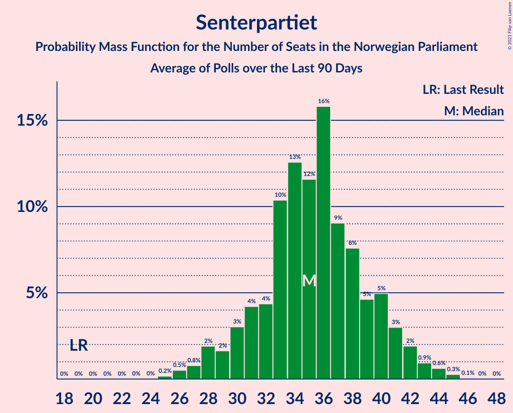

# Senterpartiet

<a href="#voting-intentions">Voting Intentions</a> | <a href="#seats">Seats</a>

## Voting Intentions

Last result: **10.3%** (General Election of 8–9 September 2013)

### Confidence Intervals

| Period     | Polling firm/Commissioner(s) | Median | 80% Confidence Interval | 90% Confidence Interval | 95% Confidence Interval | 99% Confidence Interval |
|:----------:|:----------------:|:-----------:|:-----------------------:|:-----------------------:|:-----------------------:|:-----------------------:|
| N/A | [Poll Average](average.html) | 17.7% | 15.1–19.8% | 14.4–20.3% | 13.8–20.8% | 12.9–21.7% |
| [5–10 May 2021](2021-05-10-ResponsAnalyse.html) | Respons Analyse   VG | 18.3% | 16.8–19.9% | 16.4–20.4% | 16.0–20.8% | 15.3–21.6% |
| [4–5 May 2021](2021-05-05-Norfakta.html) | Norfakta   Klassekampen and Nationen | 14.8% | 13.4–16.3% | 13.1–16.8% | 12.7–17.1% | 12.1–17.9% |
| [27 April–3 May 2021](2021-05-03-Norstat.html) | Norstat   Aftenposten and NRK | 17.5% | 16.0–19.2% | 15.6–19.7% | 15.3–20.1% | 14.6–20.9% |
| [26–30 April 2021](2021-04-30-KantarTNS.html) | Kantar TNS   TV2 | 18.4% | 16.9–20.1% | 16.5–20.6% | 16.1–21.0% | 15.4–21.8% |
| [26–28 April 2021](2021-04-28-IpsosMMI.html) | Ipsos MMI   Dagbladet | 17.5% | 15.8–19.4% | 15.3–20.0% | 14.9–20.5% | 14.2–21.4% |
| [20–24 April 2021](2021-04-24-Norstat.html) | Norstat   Vårt Land | 17.8% | 16.2–19.4% | 15.8–19.9% | 15.5–20.3% | 14.8–21.1% |
| [7–20 April 2021](2021-04-20-Norstat.html) | Norstat   NRK | 17.1% | 16.6–17.6% | 16.5–17.7% | 16.4–17.8% | 16.2–18.0% |
| [13–19 April 2021](2021-04-19-Sentio.html) | Sentio   Amedia and Nettavisen | 17.1% | 15.7–18.7% | 15.2–19.2% | 14.9–19.6% | 14.2–20.4% |
| [14 April 2021](2021-04-14-OpinionPerduco.html) | Opinion Perduco   Avisenes Nyhetsbyrå, Dagsavisen and FriFagbevegelse | 19.0% | 17.4–20.7% | 17.0–21.2% | 16.6–21.6% | 15.9–22.5% |
| [7–12 April 2021](2021-04-12-ResponsAnalyse.html) | Respons Analyse   VG | 14.0% | 12.5–15.7% | 12.1–16.2% | 11.7–16.7% | 11.0–17.5% |
| [6–7 April 2021](2021-04-07-Norfakta.html) | Norfakta   Klassekampen and Nationen | 18.8% | 17.0–20.7% | 16.6–21.3% | 16.1–21.8% | 15.3–22.7% |
| [29 March–7 April 2021](2021-04-07-KantarTNS.html) | Kantar TNS   TV2 | 18.8% | 17.3–20.4% | 16.8–20.9% | 16.5–21.3% | 15.8–22.1% |
| [23–28 March 2021](2021-03-28-Norstat.html) | Norstat   Aftenposten and NRK | 16.6% | 15.2–18.3% | 14.8–18.7% | 14.4–19.1% | 13.7–19.9% |
| [22–24 March 2021](2021-03-24-IpsosMMI.html) | Ipsos MMI   Dagbladet | 16.8% | 15.1–18.6% | 14.7–19.1% | 14.3–19.6% | 13.5–20.5% |
| [16–21 March 2021](2021-03-21-Norstat.html) | Norstat   Aftenposten and NRK | 20.5% | 18.9–22.3% | 18.4–22.7% | 18.1–23.2% | 17.3–24.0% |
| [9–14 March 2021](2021-03-14-Sentio.html) | Sentio   Amedia and Nettavisen | 18.6% | 17.1–20.3% | 16.7–20.7% | 16.3–21.1% | 15.6–21.9% |
| [5–10 March 2021](2021-03-10-ResponsAnalyse.html) | Respons Analyse   VG | 18.6% | 17.1–20.2% | 16.6–20.7% | 16.3–21.1% | 15.6–21.9% |
| [1–8 March 2021](2021-03-08-OpinionPerduco.html) | Opinion Perduco | 20.7% | 18.8–22.8% | 18.3–23.4% | 17.8–23.9% | 17.0–24.9% |
| [2–3 March 2021](2021-03-03-Norfakta.html) | Norfakta   Klassekampen and Nationen | 17.7% | 16.2–19.3% | 15.8–19.8% | 15.5–20.2% | 14.8–21.0% |
| [22–28 February 2021](2021-02-28-Norstat.html) | Norstat   Aftenposten and NRK | 22.3% | 20.6–24.1% | 20.1–24.6% | 19.7–25.0% | 19.0–25.9% |
| [22–26 February 2021](2021-02-26-KantarTNS.html) | Kantar TNS   TV2 | 19.2% | 17.6–20.9% | 17.2–21.3% | 16.8–21.7% | 16.1–22.6% |
| [22–24 February 2021](2021-02-24-IpsosMMI.html) | Ipsos MMI   Dagbladet | 17.7% | 16.1–19.6% | 15.6–20.2% | 15.2–20.6% | 14.4–21.6% |
| [15–21 February 2021](2021-02-21-Norstat.html) | Norstat   Aftenposten and NRK | 18.6% | 17.1–20.3% | 16.7–20.8% | 16.3–21.2% | 15.6–22.1% |
| [9–14 February 2021](2021-02-14-Sentio.html) | Sentio   Amedia and Nettavisen | 18.4% | 16.9–20.1% | 16.5–20.5% | 16.1–20.9% | 15.4–21.7% |
| [1–8 February 2021](2021-02-08-OpinionPerduco.html) | Opinion Perduco   Avisenes Nyhetsbyrå, Dagsavisen and FriFagbevegelse | 19.1% | 17.5–20.8% | 17.1–21.3% | 16.7–21.7% | 16.0–22.5% |
| [2–3 February 2021](2021-02-03-Norfakta.html) | Norfakta   Klassekampen and Nationen | 19.7% | 18.2–21.4% | 17.7–21.9% | 17.3–22.3% | 16.6–23.1% |
| [27 January–2 February 2021](2021-02-02-ResponsAnalyse.html) | Respons Analyse   VG | 18.8% | 17.3–20.5% | 16.9–20.9% | 16.5–21.4% | 15.8–22.2% |
| [25–31 January 2021](2021-01-31-Norstat.html) | Norstat   Aftenposten and NRK | 22.0% | 20.0–24.1% | 19.5–24.6% | 19.1–25.2% | 18.2–26.2% |
| [25–29 January 2021](2021-01-29-KantarTNS.html) | Kantar TNS   TV2 | 19.9% | 18.2–21.9% | 17.6–22.5% | 17.2–23.0% | 16.4–24.0% |
| [25–27 January 2021](2021-01-27-IpsosMMI.html) | Ipsos MMI   Dagbladet | 21.4% | 19.5–23.4% | 19.0–24.0% | 18.6–24.5% | 17.7–25.5% |
| [18–24 January 2021](2021-01-24-Norstat.html) | Norstat   Aftenposten and NRK | 19.6% | 18.0–21.3% | 17.6–21.8% | 17.2–22.3% | 16.5–23.1% |
| [12–16 January 2021](2021-01-16-Sentio.html) | Sentio   Amedia and Nettavisen | 19.6% | 18.1–21.3% | 17.6–21.8% | 17.3–22.2% | 16.5–23.0% |
| [13 January 2021](2021-01-13-OpinionPerduco.html) | Opinion Perduco   Avisenes Nyhetsbyrå, Dagsavisen and FriFagbevegelse | 20.1% | 18.5–21.8% | 18.0–22.3% | 17.6–22.8% | 16.9–23.6% |
| [13 January 2021](2021-01-13-InFact.html) | InFact   Amedia and Nettavisen | 20.5% | 19.6–21.4% | 19.4–21.7% | 19.1–21.9% | 18.7–22.4% |
| [4–8 January 2021](2021-01-08-KantarTNS.html) | Kantar TNS   TV2 | 21.7% | 20.1–23.5% | 19.6–24.0% | 19.2–24.4% | 18.5–25.3% |
| [4–6 January 2021](2021-01-06-ResponsAnalyse.html) | Respons Analyse   VG | 19.2% | 17.7–20.9% | 17.2–21.4% | 16.9–21.8% | 16.2–22.6% |
| [5–6 January 2021](2021-01-06-Norfakta.html) | Norfakta   Klassekampen and Nationen | 22.7% | 20.8–24.7% | 20.3–25.2% | 19.9–25.7% | 19.0–26.7% |
| [28 December 2020–2 January 2021](2021-01-02-Norstat.html) | Norstat   Aftenposten and NRK | 21.3% | 19.7–23.1% | 19.2–23.6% | 18.8–24.0% | 18.1–24.9% |
| [14–16 December 2020](2020-12-16-IpsosMMI.html) | Ipsos MMI   Dagbladet | 22.3% | 20.4–24.3% | 19.8–24.9% | 19.4–25.4% | 18.5–26.4% |
| [7–13 December 2020](2020-12-13-Norstat.html) | Norstat   Aftenposten and NRK | 21.3% | 19.7–23.1% | 19.2–23.6% | 18.8–24.1% | 18.1–24.9% |
| [1–7 December 2020](2020-12-07-OpinionPerduco.html) | Opinion Perduco   Avisenes Nyhetsbyrå, Dagsavisen and FriFagbevegelse | 22.2% | 20.3–24.4% | 19.7–25.0% | 19.3–25.5% | 18.4–26.5% |
| [1–2 December 2020](2020-12-02-Norfakta.html) | Norfakta   Klassekampen and Nationen | 20.1% | 18.4–22.0% | 17.9–22.6% | 17.5–23.0% | 16.7–24.0% |
| [25–30 November 2020](2020-11-30-ResponsAnalyse.html) | Respons Analyse   VG | 20.5% | 18.9–22.2% | 18.5–22.7% | 18.1–23.1% | 17.4–24.0% |
| [24–30 November 2020](2020-11-30-KantarTNS.html) | Kantar TNS   TV2 | 22.1% | 20.3–24.1% | 19.8–24.6% | 19.3–25.1% | 18.5–26.1% |
| [24–29 November 2020](2020-11-29-Sentio.html) | Sentio   Amedia and Nettavisen | 18.4% | 16.9–20.1% | 16.5–20.5% | 16.1–20.9% | 15.4–21.7% |
| [16–18 November 2020](2020-11-18-IpsosMMI.html) | Ipsos MMI   Dagbladet | 18.7% | 16.9–20.7% | 16.4–21.2% | 15.9–21.7% | 15.1–22.7% |
| [9–15 November 2020](2020-11-15-Norstat.html) | Norstat   Aftenposten and NRK | 19.3% | 17.8–21.0% | 17.3–21.5% | 16.9–22.0% | 16.2–22.8% |
| [3–9 November 2020](2020-11-09-OpinionPerduco.html) | Opinion Perduco   Avisenes Nyhetsbyrå, Dagsavisen and FriFagbevegelse | 17.8% | 16.2–19.4% | 15.8–19.9% | 15.5–20.3% | 14.8–21.1% |
| [3–4 November 2020](2020-11-04-Norfakta.html) | Norfakta   Klassekampen and Nationen | 17.7% | 16.2–19.3% | 15.8–19.8% | 15.5–20.2% | 14.8–21.0% |
| [27 October–3 November 2020](2020-11-03-Sentio.html) | Sentio   Amedia and Nettavisen | 16.4% | 15.0–18.0% | 14.6–18.4% | 14.2–18.8% | 13.6–19.6% |
| [28–31 October 2020](2020-10-31-ResponsAnalyse.html) | Respons Analyse   VG | 18.9% | 17.4–20.6% | 16.9–21.0% | 16.6–21.5% | 15.9–22.3% |
| [26–30 October 2020](2020-10-30-KantarTNS.html) | Kantar TNS   TV2 | 19.8% | 18.1–21.8% | 17.6–22.3% | 17.2–22.8% | 16.4–23.7% |
| [20–25 October 2020](2020-10-25-Norstat.html) | Norstat   Aftenposten and NRK | 14.9% | 13.2–16.7% | 12.8–17.2% | 12.4–17.7% | 11.7–18.6% |
| [19–21 October 2020](2020-10-21-IpsosMMI.html) | Ipsos MMI   Dagbladet | 17.8% | 16.0–19.7% | 15.6–20.2% | 15.2–20.7% | 14.4–21.7% |
| [12–18 October 2020](2020-10-18-Norstat.html) | Norstat   Aftenposten and NRK | 16.6% | 15.2–18.3% | 14.8–18.7% | 14.4–19.1% | 13.7–19.9% |
| [6–12 October 2020](2020-10-12-Sentio.html) | Sentio   Amedia and Nettavisen | 19.8% | 18.2–21.5% | 17.8–22.0% | 17.4–22.4% | 16.7–23.2% |
| [6–7 October 2020](2020-10-07-Norfakta.html) | Norfakta   Klassekampen and Nationen | 17.0% | 15.3–18.8% | 14.9–19.4% | 14.5–19.8% | 13.7–20.7% |
| [29 September–4 October 2020](2020-10-04-OpinionPerduco.html) | Opinion Perduco   Avisenes Nyhetsbyrå, Dagsavisen and FriFagbevegelse | 14.2% | 12.9–15.8% | 12.5–16.2% | 12.2–16.6% | 11.5–17.4% |
| [28 September–2 October 2020](2020-10-02-KantarTNS.html) | Kantar TNS   TV2 | 16.3% | 14.6–18.2% | 14.1–18.7% | 13.7–19.2% | 13.0–20.1% |
| [28–30 September 2020](2020-09-30-ResponsAnalyse.html) | Respons Analyse   VG | 14.0% | 12.7–15.5% | 12.3–15.9% | 12.0–16.3% | 11.4–17.0% |
| [21–27 September 2020](2020-09-27-Norstat.html) | Norstat   Aftenposten and NRK | 13.1% | 11.6–14.8% | 11.1–15.3% | 10.8–15.8% | 10.1–16.7% |
| [21–25 September 2020](2020-09-25-IpsosMMI.html) | Ipsos MMI   Dagbladet | 15.1% | 13.5–17.0% | 13.1–17.5% | 12.7–18.0% | 12.0–18.9% |
| [14–20 September 2020](2020-09-20-Norstat.html) | Norstat   Aftenposten and NRK | 14.3% | 13.0–15.9% | 12.6–16.3% | 12.3–16.7% | 11.6–17.5% |
| [8–14 September 2020](2020-09-14-Sentio.html) | Sentio   Amedia and Nettavisen | 14.6% | 13.2–16.1% | 12.9–16.6% | 12.5–16.9% | 11.9–17.7% |
| [1–7 September 2020](2020-09-07-OpinionPerduco.html) | Opinion Perduco   Avisenes Nyhetsbyrå, Dagsavisen and FriFagbevegelse | 16.0% | 14.6–17.6% | 14.2–18.0% | 13.8–18.4% | 13.2–19.2% |
| [1–2 September 2020](2020-09-02-Norfakta.html) | Norfakta   Klassekampen and Nationen | 13.5% | 12.0–15.2% | 11.6–15.6% | 11.2–16.0% | 10.6–16.9% |
| [25 August–1 September 2020](2020-09-01-KantarTNS.html) | Kantar TNS   TV2 | 13.6% | 12.3–15.1% | 11.9–15.6% | 11.6–16.0% | 10.9–16.7% |
| [26–31 August 2020](2020-08-31-ResponsAnalyse.html) | Respons Analyse   VG | 14.7% | 13.3–16.2% | 13.0–16.7% | 12.6–17.0% | 12.0–17.8% |
| [24–31 August 2020](2020-08-31-Norstat.html) | Norstat   Aftenposten and NRK | 12.2% | 10.9–13.7% | 10.5–14.1% | 10.2–14.4% | 9.7–15.2% |
| [17–23 August 2020](2020-08-23-Norstat.html) | Norstat   Aftenposten and NRK | 14.0% | 12.6–15.5% | 12.2–15.9% | 11.9–16.3% | 11.3–17.1% |
| [17–19 August 2020](2020-08-19-IpsosMMI.html) | Ipsos MMI   Dagbladet | 13.8% | 12.3–15.6% | 11.9–16.1% | 11.5–16.6% | 10.8–17.5% |
| [11–16 August 2020](2020-08-16-Sentio.html) | Sentio   Amedia and Nettavisen | 12.6% | 11.3–14.0% | 11.0–14.4% | 10.7–14.8% | 10.1–15.5% |
| [6–11 August 2020](2020-08-11-ResponsAnalyse.html) | Respons Analyse   VG | 14.4% | 13.0–15.9% | 12.7–16.3% | 12.3–16.7% | 11.7–17.5% |
| [4–10 August 2020](2020-08-10-Norstat.html) | Norstat   Aftenposten and NRK | 13.8% | 12.4–15.3% | 12.1–15.8% | 11.7–16.1% | 11.1–16.9% |
| [4–7 August 2020](2020-08-07-KantarTNS.html) | Kantar TNS   TV2 | 14.9% | 13.3–16.7% | 12.9–17.2% | 12.5–17.6% | 11.8–18.5% |
| [4–5 August 2020](2020-08-05-Norfakta.html) | Norfakta   Klassekampen and Nationen | 13.2% | 11.9–14.6% | 11.5–15.1% | 11.2–15.4% | 10.6–16.2% |
| [4 August 2020](2020-08-04-InFact.html) | InFact   Avisa Nordland, Bergensavisen, iFinnmark and Nidaros | 14.1% | 12.7–15.5% | 12.4–16.0% | 12.1–16.3% | 11.5–17.1% |
| [29 July–3 August 2020](2020-08-03-OpinionPerduco.html) | Opinion Perduco   Avisenes Nyhetsbyrå, Dagsavisen and FriFagbevegelse | 15.1% | 13.5–16.9% | 13.0–17.5% | 12.6–17.9% | 11.9–18.9% |
| [7–8 July 2020](2020-07-08-Norfakta.html) | Norfakta   Klassekampen and Nationen | 13.7% | 12.4–15.2% | 12.0–15.6% | 11.7–16.0% | 11.1–16.7% |
| [24–30 June 2020](2020-06-30-KantarTNS.html) | Kantar TNS   TV2 | 12.7% | 11.2–14.3% | 10.8–14.8% | 10.5–15.2% | 9.8–16.0% |
| [22–24 June 2020](2020-06-24-IpsosMMI.html) | Ipsos MMI   Dagbladet | 13.3% | 12.0–14.8% | 11.6–15.2% | 11.3–15.6% | 10.7–16.3% |
| [15–21 June 2020](2020-06-21-Norstat.html) | Norstat   Aftenposten and NRK | 13.0% | 11.7–14.5% | 11.4–14.9% | 11.1–15.2% | 10.5–16.0% |
| [9–13 June 2020](2020-06-13-Sentio.html) | Sentio   Amedia and Nettavisen | 14.0% | 12.7–15.5% | 12.3–15.9% | 12.0–16.3% | 11.4–17.0% |
| [2–8 June 2020](2020-06-08-OpinionPerduco.html) | Opinion Perduco | 14.6% | 13.0–16.5% | 12.6–17.0% | 12.2–17.4% | 11.5–18.4% |
| [2–4 June 2020](2020-06-04-ResponsAnalyse.html) | Respons Analyse   VG | 14.5% | 13.1–16.0% | 12.7–16.4% | 12.4–16.8% | 11.8–17.5% |
| [2–3 June 2020](2020-06-03-Norfakta.html) | Norfakta   Klassekampen and Nationen | 14.6% | 13.2–16.1% | 12.8–16.5% | 12.5–16.9% | 11.9–17.6% |
| [26 May–1 June 2020](2020-06-01-Norstat.html) | Norstat   Aftenposten and NRK | 14.6% | 13.0–16.4% | 12.5–17.0% | 12.2–17.4% | 11.4–18.4% |
| [25–29 May 2020](2020-05-29-KantarTNS.html) | Kantar TNS   TV2 | 13.7% | 12.3–15.4% | 11.8–15.9% | 11.5–16.4% | 10.8–17.2% |
| [25–28 May 2020](2020-05-28-IpsosMMI.html) | Ipsos MMI   Dagbladet | 13.0% | 11.5–14.7% | 11.0–15.2% | 10.7–15.7% | 10.0–16.5% |
| [19–25 May 2020](2020-05-25-Norstat.html) | Norstat   Aftenposten and NRK | 15.0% | 13.6–16.6% | 13.3–17.1% | 12.9–17.5% | 12.3–18.2% |
| [12–16 May 2020](2020-05-16-Sentio.html) | Sentio   Amedia and Nettavisen | 13.5% | 12.2–15.0% | 11.8–15.4% | 11.5–15.8% | 10.9–16.5% |
| [5–10 May 2020](2020-05-10-OpinionPerduco.html) | Opinion Perduco | 12.0% | 10.7–13.4% | 10.4–13.8% | 10.1–14.2% | 9.5–14.9% |
| [5–6 May 2020](2020-05-06-Norfakta.html) | Norfakta   Klassekampen and Nationen | 13.5% | 12.0–15.1% | 11.6–15.6% | 11.3–16.0% | 10.6–16.8% |
| [30 April–5 May 2020](2020-05-05-ResponsAnalyse.html) | Respons Analyse   VG | 14.7% | 13.3–16.2% | 13.0–16.7% | 12.6–17.0% | 12.0–17.8% |
| [27 April–4 May 2020](2020-05-04-Norstat.html) | Norstat   Aftenposten and NRK | 15.4% | 13.9–16.9% | 13.5–17.4% | 13.2–17.8% | 12.6–18.6% |
| [27–29 April 2020](2020-04-29-KantarTNS.html) | Kantar TNS   TV2 | 14.6% | 13.2–16.1% | 12.8–16.5% | 12.5–16.9% | 11.9–17.7% |
| [20–26 April 2020](2020-04-26-Norstat.html) | Norstat   Aftenposten and NRK | 15.6% | 14.2–17.2% | 13.8–17.6% | 13.4–18.0% | 12.8–18.8% |
| [20–22 April 2020](2020-04-22-IpsosMMI.html) | Ipsos MMI   Dagbladet | 14.2% | 12.7–16.0% | 12.2–16.5% | 11.9–17.0% | 11.2–17.9% |
| [14–20 April 2020](2020-04-20-Sentio.html) | Sentio   Amedia and Nettavisen | 14.0% | 12.7–15.5% | 12.3–15.9% | 12.0–16.3% | 11.4–17.0% |
| [31 March–5 April 2020](2020-04-05-OpinionPerduco.html) | Opinion Perduco | 13.8% | 12.5–15.3% | 12.1–15.7% | 11.8–16.1% | 11.2–16.8% |
| [26 March–1 April 2020](2020-04-01-ResponsAnalyse.html) | Respons Analyse   VG | 13.5% | 12.2–15.0% | 11.8–15.4% | 11.5–15.8% | 10.9–16.5% |
| [31 March–1 April 2020](2020-04-01-Norfakta.html) | Norfakta   Klassekampen and Nationen | 14.7% | 13.3–16.2% | 13.0–16.7% | 12.6–17.0% | 12.0–17.8% |
| [25–31 March 2020](2020-03-31-KantarTNS.html) | Kantar TNS   TV2 | 14.9% | 13.3–16.7% | 12.8–17.2% | 12.5–17.7% | 11.8–18.6% |
| [23–29 March 2020](2020-03-29-Norstat.html) | Norstat   Aftenposten and NRK | 15.3% | 13.7–17.1% | 13.2–17.6% | 12.8–18.1% | 12.1–19.0% |
| [16–23 March 2020](2020-03-23-Norstat.html) | Norstat   Aftenposten and NRK | 14.6% | 13.2–16.2% | 12.8–16.6% | 12.5–17.0% | 11.9–17.8% |
| [18–20 March 2020](2020-03-20-IpsosMMI.html) | Ipsos MMI   Dagbladet | 17.4% | 15.6–19.4% | 15.1–20.0% | 14.7–20.5% | 13.9–21.5% |
| [10–16 March 2020](2020-03-16-Sentio.html) | Sentio   Amedia and Nettavisen | 17.5% | 16.0–19.1% | 15.6–19.6% | 15.3–20.0% | 14.6–20.8% |
| [3–9 March 2020](2020-03-09-OpinionPerduco.html) | Opinion Perduco | 18.4% | 16.8–20.0% | 16.4–20.5% | 16.0–20.9% | 15.3–21.7% |
| [3–4 March 2020](2020-03-04-Norfakta.html) | Norfakta   Klassekampen and Nationen | 15.9% | 14.5–17.5% | 14.1–17.9% | 13.8–18.3% | 13.1–19.1% |
| [27 February–2 March 2020](2020-03-02-ResponsAnalyse.html) | Respons Analyse   VG | 16.7% | 15.3–18.3% | 14.9–18.7% | 14.5–19.1% | 13.9–19.9% |
| [24 February–2 March 2020](2020-03-02-Norstat.html) | Norstat   Aftenposten and NRK | 16.4% | 14.7–18.3% | 14.2–18.9% | 13.8–19.3% | 13.0–20.3% |
| [24–28 February 2020](2020-02-28-KantarTNS.html) | Kantar TNS   TV2 | 17.5% | 15.9–19.4% | 15.4–20.0% | 15.0–20.4% | 14.2–21.4% |
| [17–23 February 2020](2020-02-23-Norstat.html) | Norstat   Vårt Land | 15.8% | 14.0–17.8% | 13.5–18.3% | 13.1–18.8% | 12.3–19.8% |
| [17–19 February 2020](2020-02-19-IpsosMMI.html) | Ipsos MMI   Dagbladet | 14.7% | 13.2–16.6% | 12.7–17.1% | 12.3–17.5% | 11.6–18.4% |
| [11–17 February 2020](2020-02-17-Sentio.html) | Sentio   Amedia and Nettavisen | 14.1% | 12.8–15.6% | 12.4–16.0% | 12.1–16.4% | 11.5–17.1% |
| [4–10 February 2020](2020-02-10-OpinionPerduco.html) | Opinion Perduco   Avisenes Nyhetsbyrå and Dagsavisen and FriFagbevegelse | 15.2% | 13.8–16.7% | 13.4–17.2% | 13.0–17.6% | 12.4–18.4% |
| [4–5 February 2020](2020-02-05-Norfakta.html) | Norfakta   Klassekampen and Nationen | 15.9% | 14.5–17.5% | 14.1–17.9% | 13.8–18.3% | 13.1–19.1% |
| [30 January–3 February 2020](2020-02-03-ResponsAnalyse.html) | Respons Analyse   VG | 13.9% | 12.6–15.4% | 12.2–15.8% | 11.9–16.2% | 11.3–16.9% |
| [27 January–2 February 2020](2020-02-02-Norstat.html) | Norstat   Aftenposten and NRK | 17.3% | 15.8–19.0% | 15.4–19.5% | 15.1–19.9% | 14.4–20.7% |
| [27–31 January 2020](2020-01-31-KantarTNS.html) | Kantar TNS   TV2 | 15.0% | 13.4–16.7% | 13.0–17.2% | 12.7–17.6% | 11.9–18.5% |
| [24–27 January 2020](2020-01-27-Sentio.html) | Sentio   Amedia and Nettavisen | 12.5% | 11.3–13.9% | 10.9–14.4% | 10.6–14.7% | 10.0–15.4% |
| [21–27 January 2020](2020-01-27-Norstat.html) | Norstat   Vårt Land | 12.7% | 11.2–14.6% | 10.7–15.1% | 10.3–15.6% | 9.6–16.5% |
| [20–22 January 2020](2020-01-22-IpsosMMI.html) | Ipsos MMI   Dagbladet | 16.4% | 14.7–18.2% | 14.3–18.7% | 13.9–19.2% | 13.1–20.1% |
| [20–21 January 2020](2020-01-21-ResponsAnalyse.html) | Respons Analyse   VG | 14.8% | 13.5–16.2% | 13.2–16.6% | 12.9–16.9% | 12.3–17.6% |
| [21 January 2020](2020-01-21-KantarTNS.html) | Kantar TNS   TV2 | 14.5% | 12.9–16.5% | 12.4–17.0% | 12.0–17.5% | 11.2–18.4% |
| [14–18 January 2020](2020-01-18-Sentio.html) | Sentio   Amedia and Nettavisen | 16.8% | 15.4–18.4% | 15.0–18.9% | 14.6–19.3% | 13.9–20.0% |
| [15 January 2020](2020-01-15-OpinionPerduco.html) | Opinion Perduco   Avisenes Nyhetsbyrå and Dagsavisen and FriFagbevegelse | 20.9% | 19.3–22.6% | 18.8–23.2% | 18.4–23.6% | 17.7–24.4% |
| [6–10 January 2020](2020-01-10-KantarTNS.html) | Kantar TNS   TV2 | 17.9% | 16.3–19.8% | 15.8–20.3% | 15.4–20.8% | 14.7–21.7% |
| [7–8 January 2020](2020-01-08-Norfakta.html) | Norfakta   Klassekampen and Nationen | 16.5% | 14.9–18.4% | 14.5–18.9% | 14.1–19.3% | 13.4–20.2% |
| [6 January 2020](2020-01-06-ResponsAnalyse.html) | Respons Analyse   VG | 15.8% | 14.4–17.3% | 14.0–17.8% | 13.7–18.2% | 13.0–19.0% |
| [30 December 2019–5 January 2020](2020-01-05-Norstat.html) | Norstat   Aftenposten and NRK | 15.7% | 14.3–17.3% | 13.9–17.8% | 13.6–18.2% | 12.9–19.0% |
| [16–18 December 2019](2019-12-18-IpsosMMI.html) | Ipsos MMI | 15.9% | 14.2–17.7% | 13.8–18.2% | 13.4–18.7% | 12.6–19.6% |
| [9–15 December 2019](2019-12-15-Norstat.html) | Norstat | 18.5% | 17.0–20.1% | 16.6–20.6% | 16.2–21.0% | 15.5–21.8% |
| [3–8 December 2019](2019-12-08-OpinionPerduco.html) | Opinion Perduco | 20.2% | 18.6–21.9% | 18.2–22.4% | 17.8–22.8% | 17.0–23.7% |
| [3–4 December 2019](2019-12-04-Norfakta.html) | Norfakta | 19.3% | 17.6–21.1% | 17.1–21.7% | 16.7–22.1% | 15.9–23.0% |
| [26 November–2 December 2019](2019-12-02-Sentio.html) | Sentio | 15.6% | 14.2–17.2% | 13.8–17.6% | 13.5–18.0% | 12.8–18.8% |
| [28 November–2 December 2019](2019-12-02-ResponsAnalyse.html) | Respons Analyse | 17.4% | 15.9–19.0% | 15.5–19.5% | 15.2–19.9% | 14.5–20.7% |
| [25–29 November 2019](2019-11-29-KantarTNS.html) | Kantar TNS | 17.6% | 16.0–19.5% | 15.5–20.0% | 15.1–20.5% | 14.4–21.4% |
| [19–25 November 2019](2019-11-25-Norstat.html) | Norstat | 18.0% | 16.3–19.9% | 15.8–20.5% | 15.4–20.9% | 14.6–21.9% |
| [18–20 November 2019](2019-11-20-IpsosMMI.html) | Ipsos MMI | 19.2% | 17.4–21.2% | 16.9–21.7% | 16.5–22.2% | 15.7–23.2% |
| [12–18 November 2019](2019-11-18-Norstat.html) | Norstat | 20.1% | 18.1–22.2% | 17.6–22.8% | 17.1–23.4% | 16.2–24.4% |
| [5–11 November 2019](2019-11-11-OpinionPerduco.html) | Opinion Perduco | 20.9% | 19.2–22.6% | 18.8–23.1% | 18.4–23.5% | 17.6–24.4% |
| [5–6 November 2019](2019-11-06-Norfakta.html) | Norfakta | 19.2% | 17.5–21.1% | 17.1–21.7% | 16.6–22.1% | 15.9–23.1% |
| [31 October–4 November 2019](2019-11-04-ResponsAnalyse.html) | Respons Analyse | 16.5% | 15.0–18.0% | 14.6–18.5% | 14.3–18.9% | 13.6–19.7% |
| [29 October–2 November 2019](2019-11-02-Sentio.html) | Sentio | 20.0% | 18.4–21.7% | 18.0–22.2% | 17.6–22.6% | 16.9–23.4% |
| [28 October–1 November 2019](2019-11-01-KantarTNS.html) | Kantar TNS | 19.5% | 17.8–21.4% | 17.3–21.9% | 16.9–22.4% | 16.1–23.4% |
| [22–28 October 2019](2019-10-28-Norstat.html) | Norstat | 17.5% | 15.8–19.4% | 15.3–20.0% | 14.9–20.5% | 14.1–21.5% |
| [21–23 October 2019](2019-10-23-IpsosMMI.html) | Ipsos MMI | 17.7% | 16.0–19.6% | 15.5–20.1% | 15.1–20.5% | 14.4–21.5% |
| [15–21 October 2019](2019-10-21-Norstat.html) | Norstat | 18.1% | 16.5–19.8% | 16.1–20.3% | 15.7–20.7% | 15.0–21.5% |
| [8–14 October 2019](2019-10-14-Sentio.html) | Sentio | 17.6% | 16.1–19.2% | 15.7–19.7% | 15.4–20.1% | 14.7–20.9% |
| [1–7 October 2019](2019-10-07-OpinionPerduco.html) | Opinion Perduco | 18.7% | 17.2–20.4% | 16.7–20.9% | 16.4–21.3% | 15.6–22.2% |
| [30 September–4 October 2019](2019-10-04-KantarTNS.html) | Kantar TNS | 15.6% | 14.0–17.3% | 13.6–17.8% | 13.2–18.2% | 12.5–19.1% |
| [1–2 October 2019](2019-10-02-Norfakta.html) | Norfakta | 17.2% | 15.5–19.0% | 15.1–19.5% | 14.7–19.9% | 14.0–20.8% |
| [24–30 September 2019](2019-09-30-Norstat.html) | Norstat | 18.6% | 16.8–20.7% | 16.2–21.4% | 15.8–21.9% | 14.9–22.9% |
| [23–25 September 2019](2019-09-25-ResponsAnalyse.html) | Respons Analyse | 14.8% | 13.4–16.3% | 13.1–16.8% | 12.7–17.1% | 12.1–17.9% |
| [23–25 September 2019](2019-09-25-IpsosMMI.html) | Ipsos MMI | 17.3% | 15.7–18.9% | 15.3–19.4% | 15.0–19.8% | 14.3–20.6% |
| [17–19 September 2019](2019-09-19-Norstat.html) | Norstat | 15.7% | 14.1–17.6% | 13.6–18.1% | 13.2–18.6% | 12.5–19.5% |
| [10–16 September 2019](2019-09-16-Sentio.html) | Sentio | 16.8% | 15.4–18.4% | 15.0–18.9% | 14.6–19.3% | 13.9–20.0% |
| [3–4 September 2019](2019-09-04-Norfakta.html) | Norfakta | 17.1% | 15.7–18.8% | 15.3–19.2% | 14.9–19.6% | 14.3–20.4% |
| [27 August–2 September 2019](2019-09-02-Norstat.html) | Norstat | 15.9% | 14.1–17.9% | 13.6–18.5% | 13.1–19.0% | 12.3–20.0% |
| [20–26 August 2019](2019-08-26-Norstat.html) | Norstat | 16.0% | 14.6–17.6% | 14.2–18.1% | 13.8–18.5% | 13.1–19.3% |
| [19–21 August 2019](2019-08-21-IpsosMMI.html) | Ipsos MMI | 16.1% | 14.5–18.0% | 14.0–18.5% | 13.6–19.0% | 12.9–19.9% |
| [13–18 August 2019](2019-08-18-Sentio.html) | Sentio | 14.4% | 13.1–15.9% | 12.7–16.3% | 12.4–16.7% | 11.7–17.5% |
| [6–12 August 2019](2019-08-12-Norstat.html) | Norstat | 14.1% | 12.6–15.9% | 12.2–16.4% | 11.8–16.9% | 11.1–17.8% |
| [5–9 August 2019](2019-08-09-KantarTNS.html) | Kantar TNS | 15.3% | 13.7–17.1% | 13.3–17.6% | 12.9–18.1% | 12.2–19.0% |
| [6–7 August 2019](2019-08-07-Norfakta.html) | Norfakta | 15.9% | 14.3–17.6% | 13.9–18.1% | 13.5–18.5% | 12.8–19.4% |
| [30 July–5 August 2019](2019-08-05-OpinionPerduco.html) | Opinion Perduco | 14.7% | 13.0–16.6% | 12.5–17.1% | 12.2–17.6% | 11.4–18.5% |
| [2–3 July 2019](2019-07-03-Norfakta.html) | Norfakta | 15.0% | 13.5–16.8% | 13.0–17.3% | 12.7–17.8% | 11.9–18.7% |
| [24–28 June 2019](2019-06-28-KantarTNS.html) | Kantar TNS | 13.3% | 11.9–15.0% | 11.5–15.5% | 11.1–15.9% | 10.5–16.8% |
| [24–26 June 2019](2019-06-26-IpsosMMI.html) | Ipsos MMI | 14.4% | 12.8–16.2% | 12.4–16.7% | 12.0–17.1% | 11.3–18.0% |
| [18–24 June 2019](2019-06-24-Norstat.html) | Norstat | 14.3% | 12.9–15.9% | 12.6–16.3% | 12.2–16.7% | 11.6–17.5% |
| [11–17 June 2019](2019-06-17-Sentio.html) | Sentio | 15.2% | 13.8–16.8% | 13.4–17.2% | 13.1–17.6% | 12.5–18.3% |
| [4–10 June 2019](2019-06-10-OpinionPerduco.html) | Opinion Perduco | 16.8% | 15.1–18.8% | 14.7–19.3% | 14.3–19.8% | 13.5–20.7% |
| [3–6 June 2019](2019-06-06-ResponsAnalyse.html) | Respons Analyse | 13.3% | 11.8–15.0% | 11.4–15.5% | 11.1–15.9% | 10.4–16.7% |
| [4–5 June 2019](2019-06-05-Norfakta.html) | Norfakta | 15.8% | 14.4–17.4% | 14.0–17.8% | 13.7–18.2% | 13.0–19.0% |
| [28 May–3 June 2019](2019-06-03-Norstat.html) | Norstat | 14.9% | 13.5–16.5% | 13.1–16.9% | 12.8–17.3% | 12.2–18.1% |
| [27–29 May 2019](2019-05-29-IpsosMMI.html) | Ipsos MMI | 15.2% | 13.6–17.0% | 13.1–17.5% | 12.7–17.9% | 12.0–18.8% |
| [21–27 May 2019](2019-05-27-Norstat.html) | Norstat | 13.3% | 12.0–14.8% | 11.6–15.3% | 11.3–15.6% | 10.7–16.4% |
| [14–18 May 2019](2019-05-18-Sentio.html) | Sentio | 15.8% | 14.4–17.4% | 14.0–17.8% | 13.7–18.2% | 13.0–19.0% |
| [7–13 May 2019](2019-05-13-OpinionPerduco.html) | Opinion Perduco | 14.1% | 12.7–15.6% | 12.3–16.1% | 12.0–16.5% | 11.4–17.2% |
| [7–8 May 2019](2019-05-08-Norfakta.html) | Norfakta | 14.4% | 13.0–15.9% | 12.6–16.3% | 12.3–16.7% | 11.7–17.4% |
| [30 April–6 May 2019](2019-05-06-Norstat.html) | Norstat | 15.0% | 13.6–16.5% | 13.2–17.0% | 12.9–17.4% | 12.3–18.1% |
| [29 April–3 May 2019](2019-05-03-KantarTNS.html) | Kantar TNS | 14.7% | 13.2–16.4% | 12.7–16.9% | 12.4–17.3% | 11.7–18.2% |
| [29 April–2 May 2019](2019-05-02-ResponsAnalyse.html) | Respons Analyse | 12.5% | 11.2–13.9% | 10.9–14.3% | 10.6–14.7% | 10.0–15.4% |
| [2 May 2019](2019-05-02-Norstat.html) | Norstat | 15.6% | 13.9–17.6% | 13.4–18.2% | 13.0–18.7% | 12.2–19.6% |
| [23–25 April 2019](2019-04-25-IpsosMMI.html) | Ipsos MMI | 14.4% | 13.0–16.0% | 12.7–16.4% | 12.3–16.8% | 11.7–17.6% |
| [16 April 2019](2019-04-16-Sentio.html) | Sentio | 15.4% | 14.0–16.9% | 13.6–17.4% | 13.3–17.8% | 12.7–18.5% |
| [2–8 April 2019](2019-04-08-OpinionPerduco.html) | Opinion Perduco | 16.7% | 15.2–18.3% | 14.8–18.8% | 14.4–19.2% | 13.7–20.0% |
| [2–4 April 2019](2019-04-04-ResponsAnalyse.html) | Respons Analyse | 15.6% | 14.2–17.1% | 13.8–17.6% | 13.5–18.0% | 12.8–18.7% |
| [2–3 April 2019](2019-04-03-Norfakta.html) | Norfakta | 15.2% | 13.9–16.7% | 13.5–17.2% | 13.2–17.5% | 12.5–18.3% |
| [26 March–1 April 2019](2019-04-01-Norstat.html) | Norstat | 16.9% | 15.1–18.9% | 14.6–19.5% | 14.1–20.0% | 13.3–21.0% |
| [25–29 March 2019](2019-03-29-KantarTNS.html) | Kantar TNS | 16.9% | 15.3–18.8% | 14.9–19.3% | 14.5–19.7% | 13.7–20.6% |
| [27 March 2019](2019-03-27-Norstat.html) | Norstat | 14.3% | 12.7–16.3% | 12.2–16.8% | 11.8–17.3% | 11.1–18.3% |
| [18–20 March 2019](2019-03-20-IpsosMMI.html) | Ipsos MMI | 14.4% | 13.0–16.0% | 12.7–16.4% | 12.3–16.8% | 11.7–17.6% |
| [12–18 March 2019](2019-03-18-Sentio.html) | Sentio | 14.5% | 13.2–16.0% | 12.8–16.4% | 12.5–16.8% | 11.8–17.6% |
| [5–11 March 2019](2019-03-11-OpinionPerduco.html) | Opinion Perduco | 12.6% | 11.4–14.1% | 11.0–14.5% | 10.7–14.9% | 10.1–15.6% |
| [5–6 March 2019](2019-03-06-Norfakta.html) | Norfakta | 14.0% | 12.5–15.8% | 12.1–16.3% | 11.7–16.7% | 11.0–17.6% |
| [28 February–4 March 2019](2019-03-04-ResponsAnalyse.html) | Respons Analyse | 14.6% | 13.2–16.1% | 12.9–16.6% | 12.5–16.9% | 11.9–17.7% |
| [26 February–4 March 2019](2019-03-04-Norstat.html) | Norstat | 12.4% | 10.9–14.2% | 10.5–14.7% | 10.1–15.2% | 9.4–16.1% |
| [25 February–1 March 2019](2019-03-01-KantarTNS.html) | Kantar TNS | 12.7% | 11.2–14.4% | 10.8–14.9% | 10.5–15.4% | 9.8–16.2% |
| [19–25 February 2019](2019-02-25-Norstat.html) | Norstat | 15.9% | 14.2–17.9% | 13.7–18.5% | 13.3–19.0% | 12.5–20.0% |
| [18–20 February 2019](2019-02-20-IpsosMMI.html) | Ipsos MMI | 13.0% | 11.7–14.5% | 11.3–14.9% | 11.0–15.3% | 10.4–16.0% |
| [12–19 February 2019](2019-02-19-Sentio.html) | Sentio | 15.6% | 14.2–17.2% | 13.8–17.6% | 13.5–18.0% | 12.8–18.8% |
| [5–11 February 2019](2019-02-11-OpinionPerduco.html) | Opinion Perduco | 14.0% | 12.4–15.8% | 11.9–16.3% | 11.6–16.8% | 10.9–17.7% |
| [5–6 February 2019](2019-02-06-Norfakta.html) | Norfakta | 12.8% | 11.3–14.4% | 10.9–14.9% | 10.6–15.3% | 10.0–16.1% |
| [31 January–4 February 2019](2019-02-04-ResponsAnalyse.html) | Respons Analyse | 12.2% | 10.8–13.9% | 10.3–14.4% | 10.0–14.8% | 9.4–15.7% |
| [29 January–4 February 2019](2019-02-04-Norstat.html) | Norstat | 11.7% | 10.3–13.5% | 9.8–14.0% | 9.5–14.4% | 8.8–15.3% |
| [28 January–2 February 2019](2019-02-02-KantarTNS.html) | Kantar TNS | 10.4% | 9.2–11.9% | 8.8–12.3% | 8.5–12.7% | 7.9–13.5% |
| [22–28 January 2019](2019-01-28-Norstat.html) | Norstat | 11.1% | 9.7–12.8% | 9.3–13.3% | 9.0–13.7% | 8.4–14.6% |
| [21–23 January 2019](2019-01-23-IpsosMMI.html) | Ipsos MMI | 10.9% | 9.7–12.3% | 9.4–12.7% | 9.1–13.1% | 8.5–13.8% |
| [15–21 January 2019](2019-01-21-Sentio.html) | Sentio | 13.3% | 11.8–15.2% | 11.3–15.7% | 10.9–16.2% | 10.2–17.1% |
| [8–14 January 2019](2019-01-14-OpinionPerduco.html) | Opinion Perduco | 12.6% | 11.1–14.4% | 10.7–14.9% | 10.3–15.3% | 9.7–16.2% |
| [3–10 January 2019](2019-01-10-KantarTNS.html) | Kantar TNS | 12.3% | 10.8–13.9% | 10.4–14.4% | 10.1–14.8% | 9.5–15.6% |
| [8–9 January 2019](2019-01-09-Norfakta.html) | Norfakta | 12.5% | 11.2–13.9% | 10.9–14.3% | 10.6–14.7% | 10.0–15.4% |
| [3–7 January 2019](2019-01-07-ResponsAnalyse.html) | Respons Analyse | 10.5% | 9.3–11.8% | 9.0–12.2% | 8.7–12.5% | 8.2–13.2% |
| [2–7 January 2019](2019-01-07-Norstat.html) | Norstat | 12.1% | 10.7–13.9% | 10.3–14.3% | 9.9–14.8% | 9.3–15.6% |
| [17–19 December 2018](2018-12-19-IpsosMMI.html) | Ipsos MMI | 10.4% | 9.2–11.8% | 8.9–12.1% | 8.6–12.5% | 8.0–13.2% |
| [11–17 December 2018](2018-12-17-Norstat.html) | Norstat | 11.2% | 10.0–12.7% | 9.6–13.1% | 9.3–13.4% | 8.8–14.1% |
| [4–10 December 2018](2018-12-10-OpinionPerduco.html) | Opinion Perduco | 11.9% | 10.4–13.6% | 10.0–14.1% | 9.7–14.5% | 9.0–15.4% |
| [4–5 December 2018](2018-12-05-Norfakta.html) | Norfakta | 11.6% | 10.2–13.2% | 9.8–13.7% | 9.5–14.1% | 8.9–14.9% |
| [28 November–4 December 2018](2018-12-04-Sentio.html) | Sentio | 12.1% | 10.7–13.9% | 10.3–14.3% | 9.9–14.8% | 9.3–15.6% |
| [29 November–4 December 2018](2018-12-04-ResponsAnalyse.html) | Respons Analyse | 10.5% | 9.3–11.8% | 9.0–12.2% | 8.7–12.6% | 8.2–13.2% |
| [3 December 2018](2018-12-03-KantarTNS.html) | Kantar TNS | 12.0% | 10.6–13.7% | 10.2–14.2% | 9.9–14.6% | 9.2–15.5% |
| [20–25 November 2018](2018-11-25-Norstat.html) | Norstat | 11.4% | 10.1–12.8% | 9.8–13.2% | 9.5–13.6% | 8.9–14.3% |
| [19–21 November 2018](2018-11-21-IpsosMMI.html) | Ipsos MMI | 11.7% | 10.4–13.1% | 10.0–13.5% | 9.7–13.9% | 9.2–14.6% |
| [13–19 November 2018](2018-11-19-Norstat.html) | Norstat | 12.0% | 10.7–13.4% | 10.3–13.8% | 10.0–14.2% | 9.4–14.9% |
| [6–12 November 2018](2018-11-12-OpinionPerduco.html) | Opinion Perduco | 11.9% | 10.5–13.7% | 10.1–14.1% | 9.8–14.6% | 9.1–15.4% |
| [5–7 November 2018](2018-11-07-ResponsAnalyse.html) | Respons Analyse | 10.3% | 9.2–11.6% | 8.8–12.0% | 8.6–12.3% | 8.0–13.0% |
| [30 October–5 November 2018](2018-11-05-Sentio.html) | Sentio | 10.0% | 8.7–11.6% | 8.3–12.1% | 8.0–12.5% | 7.4–13.3% |
| [5 November 2018](2018-11-05-Norfakta.html) | Norfakta | 11.7% | 10.3–13.3% | 10.0–13.7% | 9.6–14.1% | 9.0–14.9% |
| [24–30 October 2018](2018-10-30-KantarTNS.html) | Kantar TNS | 9.1% | 7.9–10.5% | 7.5–10.9% | 7.2–11.3% | 6.7–12.0% |
| [23–28 October 2018](2018-10-28-Norstat.html) | Norstat | 12.1% | 10.7–13.9% | 10.2–14.3% | 9.9–14.8% | 9.2–15.6% |
| [22–24 October 2018](2018-10-24-IpsosMMI.html) | Ipsos MMI | 12.4% | 11.1–13.8% | 10.7–14.3% | 10.4–14.6% | 9.8–15.3% |
| [16–22 October 2018](2018-10-22-Norstat.html) | Norstat | 10.3% | 9.1–11.7% | 8.8–12.1% | 8.5–12.4% | 8.0–13.1% |
| [9–18 October 2018](2018-10-18-Sentio.html) | Sentio | 10.5% | 9.2–12.2% | 8.8–12.6% | 8.5–13.0% | 7.8–13.8% |
| [4–10 October 2018](2018-10-10-OpinionPerduco.html) | Opinion Perduco | 12.6% | 11.1–14.4% | 10.7–14.9% | 10.3–15.4% | 9.7–16.2% |
| [9–10 October 2018](2018-10-10-InFact.html) | InFact | 11.2% | 10.0–12.6% | 9.7–13.0% | 9.4–13.3% | 8.9–14.0% |
| [1–3 October 2018](2018-10-03-ResponsAnalyse.html) | Respons Analyse | 9.8% | 8.7–11.1% | 8.4–11.5% | 8.1–11.8% | 7.6–12.5% |
| [2–3 October 2018](2018-10-03-Norfakta.html) | Norfakta | 11.2% | 10.0–12.6% | 9.7–13.0% | 9.4–13.3% | 8.8–14.0% |
| [24–29 September 2018](2018-09-29-Norstat.html) | Norstat | 11.1% | 9.9–12.6% | 9.6–13.0% | 9.3–13.4% | 8.7–14.1% |
| [24–28 September 2018](2018-09-28-KantarTNS.html) | Kantar TNS | 10.4% | 9.1–11.9% | 8.8–12.4% | 8.5–12.8% | 7.9–13.5% |
| [24–26 September 2018](2018-09-26-IpsosMMI.html) | Ipsos MMI | 10.1% | 8.9–11.5% | 8.6–11.9% | 8.3–12.2% | 7.8–12.9% |
| [18–24 September 2018](2018-09-24-Norstat.html) | Norstat | 12.0% | 10.7–13.5% | 10.4–13.9% | 10.1–14.3% | 9.5–15.0% |
| [11–17 September 2018](2018-09-17-Sentio.html) | Sentio | 9.1% | 7.8–10.6% | 7.5–11.0% | 7.1–11.4% | 6.6–12.2% |
| [6–10 September 2018](2018-09-10-ResponsAnalyse.html) | Respons Analyse | 10.4% | 9.2–11.7% | 8.9–12.1% | 8.6–12.4% | 8.1–13.1% |
| [4–10 September 2018](2018-09-10-OpinionPerduco.html) | Opinion Perduco | 10.6% | 9.2–12.3% | 8.8–12.7% | 8.5–13.1% | 7.9–14.0% |
| [6 September 2018](2018-09-06-KantarTNS.html) | Kantar TNS | 11.5% | 10.1–13.2% | 9.7–13.7% | 9.4–14.1% | 8.8–14.9% |
| [4–5 September 2018](2018-09-05-Norfakta.html) | Norfakta | 11.2% | 9.8–12.7% | 9.4–13.2% | 9.1–13.6% | 8.5–14.4% |
| [28 August–2 September 2018](2018-09-02-Norstat.html) | Norstat | 11.2% | 9.8–12.9% | 9.5–13.4% | 9.1–13.8% | 8.5–14.6% |
| [20–26 August 2018](2018-08-26-Norstat.html) | Norstat | 12.5% | 11.2–14.0% | 10.8–14.4% | 10.5–14.8% | 9.9–15.5% |
| [20–25 August 2018](2018-08-25-IpsosMMI.html) | Ipsos MMI | 11.5% | 10.2–12.9% | 9.9–13.3% | 9.6–13.7% | 9.0–14.4% |
| [14–20 August 2018](2018-08-20-Sentio.html) | Sentio | 10.8% | 9.4–12.4% | 9.0–12.9% | 8.6–13.3% | 8.0–14.2% |
| [16–20 August 2018](2018-08-20-ResponsAnalyse.html) | Respons Analyse | 10.3% | 9.1–11.6% | 8.8–12.0% | 8.6–12.3% | 8.0–13.0% |
| [7–12 August 2018](2018-08-12-Norstat.html) | Norstat | 11.8% | 10.3–13.6% | 9.9–14.1% | 9.6–14.5% | 8.9–15.4% |
| [7–8 August 2018](2018-08-08-Norfakta.html) | Norfakta | 12.3% | 11.0–13.7% | 10.7–14.1% | 10.4–14.4% | 9.8–15.2% |
| [1–7 August 2018](2018-08-07-KantarTNS.html) | Kantar TNS | 13.6% | 12.1–15.4% | 11.7–15.9% | 11.4–16.3% | 10.7–17.2% |
| [31 July–6 August 2018](2018-08-06-OpinionPerduco.html) | Opinion Perduco | 11.2% | 9.8–12.9% | 9.4–13.4% | 9.1–13.8% | 8.4–14.7% |
| [3–4 July 2018](2018-07-04-Norfakta.html) | Norfakta | 9.7% | 8.5–11.2% | 8.1–11.7% | 7.8–12.0% | 7.3–12.8% |
| [25–27 June 2018](2018-06-27-IpsosMMI.html) | Ipsos MMI | 11.4% | 10.1–12.8% | 9.8–13.2% | 9.5–13.6% | 8.9–14.3% |
| [19–25 June 2018](2018-06-25-Norstat.html) | Norstat | 10.7% | 9.5–12.1% | 9.2–12.5% | 8.9–12.9% | 8.4–13.6% |
| [12–16 June 2018](2018-06-16-Sentio.html) | Sentio | 10.2% | 8.9–11.8% | 8.5–12.3% | 8.2–12.7% | 7.6–13.5% |
| [5–11 June 2018](2018-06-11-OpinionPerduco.html) | Opinion Perduco | 10.6% | 9.3–12.3% | 8.9–12.7% | 8.6–13.2% | 7.9–14.0% |
| [5–6 June 2018](2018-06-06-Norfakta.html) | Norfakta | 11.2% | 9.9–12.8% | 9.5–13.2% | 9.2–13.6% | 8.6–14.4% |
| [31 May–4 June 2018](2018-06-04-ResponsAnalyse.html) | Respons Analyse | 11.0% | 9.8–12.4% | 9.5–12.8% | 9.2–13.1% | 8.7–13.8% |
| [27 May–4 June 2018](2018-06-04-Norstat.html) | Norstat | 11.0% | 9.8–12.4% | 9.4–12.8% | 9.1–13.2% | 8.6–13.9% |
| [28 May–1 June 2018](2018-06-01-KantarTNS.html) | Kantar TNS | 11.3% | 9.9–12.9% | 9.5–13.4% | 9.2–13.8% | 8.6–14.6% |
| [28–30 May 2018](2018-05-30-IpsosMMI.html) | Ipsos MMI | 11.1% | 9.9–12.5% | 9.5–12.9% | 9.2–13.3% | 8.7–14.0% |
| [22–28 May 2018](2018-05-28-Norstat.html) | Norstat | 11.7% | 10.5–13.2% | 10.1–13.6% | 9.8–14.0% | 9.2–14.7% |
| [14–22 May 2018](2018-05-22-Sentio.html) | Sentio | 10.7% | 9.3–12.3% | 8.9–12.7% | 8.6–13.1% | 8.0–13.9% |
| [8–14 May 2018](2018-05-14-OpinionPerduco.html) | Opinion Perduco | 10.4% | 9.1–12.1% | 8.7–12.5% | 8.4–13.0% | 7.8–13.8% |
| [8–9 May 2018](2018-05-09-Norfakta.html) | Norfakta | 10.5% | 9.2–12.0% | 8.9–12.4% | 8.6–12.8% | 8.0–13.5% |
| [3–7 May 2018](2018-05-07-ResponsAnalyse.html) | Respons Analyse | 9.5% | 8.4–10.8% | 8.1–11.1% | 7.8–11.5% | 7.3–12.1% |
| [30 April–7 May 2018](2018-05-07-Norstat.html) | Norstat | 11.0% | 9.6–12.6% | 9.2–13.1% | 8.9–13.5% | 8.2–14.3% |
| [30 April–2 May 2018](2018-05-02-KantarTNS.html) | Kantar TNS | 10.3% | 9.0–11.9% | 8.7–12.3% | 8.4–12.7% | 7.8–13.4% |
| [26–30 April 2018](2018-04-30-Norstat.html) | Norstat | 10.9% | 9.7–12.3% | 9.4–12.8% | 9.1–13.1% | 8.5–13.8% |
| [23–25 April 2018](2018-04-25-IpsosMMI.html) | Ipsos MMI | 11.9% | 10.6–13.4% | 10.3–13.8% | 10.0–14.1% | 9.4–14.9% |
| [17–23 April 2018](2018-04-23-Sentio.html) | Sentio | 11.9% | 10.4–13.6% | 10.0–14.1% | 9.6–14.5% | 9.0–15.4% |
| [10–16 April 2018](2018-04-16-OpinionPerduco.html) | Opinion Perduco | 11.6% | 10.2–13.2% | 9.8–13.7% | 9.4–14.1% | 8.8–15.0% |
| [5–9 April 2018](2018-04-09-ResponsAnalyse.html) | Respons Analyse | 10.9% | 9.7–12.3% | 9.4–12.6% | 9.1–13.0% | 8.6–13.7% |
| [3–9 April 2018](2018-04-09-Norstat.html) | Norstat | 10.7% | 9.5–12.1% | 9.2–12.5% | 8.9–12.9% | 8.3–13.6% |
| [3–6 April 2018](2018-04-06-KantarTNS.html) | Kantar TNS | 8.9% | 7.7–10.4% | 7.4–10.8% | 7.1–11.2% | 6.6–11.9% |
| [3–4 April 2018](2018-04-04-Norfakta.html) | Norfakta | 10.6% | 9.4–11.9% | 9.1–12.3% | 8.8–12.7% | 8.3–13.3% |
| [20–24 March 2018](2018-03-24-Norstat.html) | Norstat | 11.0% | 9.8–12.4% | 9.4–12.8% | 9.2–13.2% | 8.6–13.8% |
| [19–21 March 2018](2018-03-21-IpsosMMI.html) | Ipsos MMI | 10.2% | 9.0–11.5% | 8.7–11.9% | 8.4–12.3% | 7.8–13.0% |
| [20 March 2018](2018-03-20-KantarTNS.html) | Kantar TNS | 10.2% | 8.7–12.2% | 8.2–12.7% | 7.9–13.2% | 7.2–14.2% |
| [13–19 March 2018](2018-03-19-Sentio.html) | Sentio | 11.8% | 10.4–13.5% | 10.0–14.0% | 9.6–14.4% | 9.0–15.3% |
| [15–16 March 2018](2018-03-16-ResponsAnalyse.html) | Respons Analyse | 10.8% | 9.6–12.1% | 9.3–12.5% | 9.0–12.9% | 8.5–13.5% |
| [6–12 March 2018](2018-03-12-OpinionPerduco.html) | Opinion Perduco | 10.9% | 9.5–12.6% | 9.2–13.1% | 8.8–13.5% | 8.2–14.4% |
| [6–7 March 2018](2018-03-07-Norfakta.html) | Norfakta | 12.8% | 11.4–14.4% | 11.0–14.9% | 10.6–15.3% | 10.0–16.1% |
| [1–5 March 2018](2018-03-05-ResponsAnalyse.html) | Respons Analyse | 11.6% | 10.3–13.0% | 10.0–13.4% | 9.7–13.7% | 9.2–14.4% |
| [27 February–5 March 2018](2018-03-05-Norstat.html) | Norstat | 12.3% | 11.0–13.7% | 10.6–14.2% | 10.3–14.5% | 9.7–15.3% |
| [26 February–3 March 2018](2018-03-03-KantarTNS.html) | Kantar TNS | 12.1% | 10.7–13.7% | 10.3–14.1% | 10.0–14.5% | 9.4–15.3% |
| [20–25 February 2018](2018-02-25-Norstat.html) | Norstat | 10.8% | 9.6–12.2% | 9.3–12.6% | 9.0–13.0% | 8.4–13.7% |
| [19–21 February 2018](2018-02-21-IpsosMMI.html) | Ipsos MMI | 9.7% | 8.6–11.0% | 8.2–11.4% | 8.0–11.7% | 7.4–12.4% |
| [13–19 February 2018](2018-02-19-Sentio.html) | Sentio | 10.4% | 9.1–11.9% | 8.7–12.4% | 8.4–12.8% | 7.8–13.6% |
| [6–12 February 2018](2018-02-12-OpinionPerduco.html) | Opinion Perduco | 10.0% | 8.7–11.6% | 8.3–12.1% | 8.0–12.5% | 7.4–13.3% |
| [5–7 February 2018](2018-02-07-ResponsAnalyse.html) | Respons Analyse | 10.9% | 9.7–12.2% | 9.4–12.6% | 9.1–13.0% | 8.6–13.6% |
| [30 January–5 February 2018](2018-02-05-Norstat.html) | Norstat | 11.2% | 10.0–12.7% | 9.7–13.1% | 9.4–13.4% | 8.8–14.1% |
| [29 January–5 February 2018](2018-02-05-KantarTNS.html) | Kantar TNS | 11.2% | 9.9–12.8% | 9.5–13.2% | 9.2–13.6% | 8.6–14.4% |
| [30–31 January 2018](2018-01-31-Norfakta.html) | Norfakta | 11.0% | 9.7–12.6% | 9.3–13.0% | 9.0–13.4% | 8.4–14.2% |
| [23–28 January 2018](2018-01-28-Norstat.html) | Norstat | 11.0% | 9.8–12.4% | 9.4–12.8% | 9.1–13.2% | 8.6–13.9% |
| [22–24 January 2018](2018-01-24-IpsosMMI.html) | Ipsos MMI | 12.1% | 10.8–13.6% | 10.4–14.0% | 10.1–14.4% | 9.5–15.2% |
| [16–21 January 2018](2018-01-21-Sentio.html) | Sentio | 10.1% | 8.8–11.7% | 8.4–12.2% | 8.1–12.6% | 7.5–13.4% |
| [9–15 January 2018](2018-01-15-OpinionPerduco.html) | Opinion Perduco | 10.9% | 9.5–12.6% | 9.1–13.0% | 8.8–13.4% | 8.2–14.3% |
| [10–12 January 2018](2018-01-12-ResponsAnalyse.html) | Respons Analyse | 11.3% | 10.1–12.7% | 9.8–13.1% | 9.5–13.4% | 8.9–14.1% |
| [8–10 January 2018](2018-01-10-ResponsAnalyse.html) | Respons Analyse | 10.7% | 9.4–12.3% | 9.1–12.7% | 8.8–13.1% | 8.2–13.8% |
| [3–9 January 2018](2018-01-09-KantarTNS.html) | Kantar TNS | 10.9% | 9.6–12.5% | 9.2–12.9% | 8.9–13.3% | 8.3–14.1% |
| [2–8 January 2018](2018-01-08-Norstat.html) | Norstat | 12.2% | 10.9–13.6% | 10.6–14.0% | 10.3–14.4% | 9.7–15.1% |
| [2–3 January 2018](2018-01-03-Norfakta.html) | Norfakta | 10.3% | 9.2–11.6% | 8.8–12.0% | 8.6–12.3% | 8.0–13.0% |
| [18–20 December 2017](2017-12-20-IpsosMMI.html) | Ipsos MMI | 10.1% | 8.9–11.5% | 8.6–11.9% | 8.3–12.2% | 7.8–12.9% |
| [12–18 December 2017](2017-12-18-Norstat.html) | Norstat | 10.5% | 9.4–11.9% | 9.0–12.3% | 8.7–12.7% | 8.2–13.4% |
| [5–11 December 2017](2017-12-11-Sentio.html) | Sentio | 10.5% | 9.2–12.1% | 8.9–12.5% | 8.6–12.9% | 8.0–13.7% |
| [4–8 December 2017](2017-12-08-KantarTNS.html) | Kantar TNS | 9.7% | 8.4–11.2% | 8.1–11.6% | 7.8–12.0% | 7.2–12.7% |
| [5–6 December 2017](2017-12-06-Norfakta.html) | Norfakta | 10.2% | 9.0–11.7% | 8.7–12.1% | 8.4–12.5% | 7.8–13.2% |
| [28 November–4 December 2017](2017-12-04-OpinionPerduco.html) | Opinion Perduco | 11.5% | 10.1–13.2% | 9.7–13.6% | 9.4–14.0% | 8.8–14.9% |
| [21–27 November 2017](2017-11-27-Norstat.html) | Norstat | 11.2% | 10.0–12.6% | 9.6–13.0% | 9.3–13.4% | 8.8–14.1% |
| [20–22 November 2017](2017-11-22-IpsosMMI.html) | Ipsos MMI | 8.6% | 7.5–9.9% | 7.2–10.3% | 7.0–10.6% | 6.5–11.3% |
| [14–20 November 2017](2017-11-20-Norstat.html) | Norstat | 9.3% | 8.2–10.6% | 7.9–11.0% | 7.6–11.3% | 7.1–12.0% |
| [7–13 November 2017](2017-11-13-Sentio.html) | Sentio | 10.9% | 9.6–12.4% | 9.2–12.8% | 8.9–13.2% | 8.3–14.0% |
| [6–10 November 2017](2017-11-10-KantarTNS.html) | Kantar TNS | 11.4% | 10.1–13.0% | 9.8–13.4% | 9.4–13.8% | 8.9–14.6% |
| [7–8 November 2017](2017-11-08-Norfakta.html) | Norfakta | 10.6% | 9.3–12.0% | 9.0–12.4% | 8.7–12.8% | 8.1–13.5% |
| [31 October–6 November 2017](2017-11-06-OpinionPerduco.html) | Opinion Perduco | 11.3% | 9.9–12.9% | 9.5–13.3% | 9.2–13.7% | 8.6–14.5% |
| [25–31 October 2017](2017-10-31-Norstat.html) | Norstat | 11.7% | 10.5–13.2% | 10.1–13.6% | 9.8–14.0% | 9.3–14.7% |
| [23–25 October 2017](2017-10-25-IpsosMMI.html) | Ipsos MMI | 10.9% | 9.7–12.3% | 9.3–12.7% | 9.0–13.0% | 8.5–13.7% |
| [17–23 October 2017](2017-10-23-Norstat.html) | Norstat | 10.7% | 9.5–12.1% | 9.2–12.5% | 8.9–12.9% | 8.4–13.6% |
| [10–16 October 2017](2017-10-16-Sentio.html) | Sentio | 10.1% | 8.9–11.6% | 8.5–12.1% | 8.2–12.4% | 7.7–13.2% |
| [3–9 October 2017](2017-10-09-OpinionPerduco.html) | Opinion Perduco | 10.6% | 9.3–12.1% | 8.9–12.6% | 8.6–13.0% | 8.0–13.7% |
| [2–6 October 2017](2017-10-06-KantarTNS.html) | Kantar TNS | 9.3% | 8.2–10.6% | 7.9–11.0% | 7.7–11.3% | 7.2–12.0% |
| [3–4 October 2017](2017-10-04-Norfakta.html) | Norfakta | 11.4% | 10.1–12.9% | 9.8–13.4% | 9.4–13.7% | 8.9–14.5% |
| [27 September–1 October 2017](2017-10-01-Norstat.html) | Norstat | 10.6% | 9.4–12.0% | 9.1–12.4% | 8.8–12.8% | 8.3–13.5% |
| [25–27 September 2017](2017-09-27-IpsosMMI.html) | Ipsos MMI | 10.2% | 9.0–11.5% | 8.7–11.9% | 8.4–12.3% | 7.8–13.0% |
| [19–25 September 2017](2017-09-25-Norstat.html) | Norstat | 11.3% | 10.1–12.8% | 9.7–13.2% | 9.4–13.5% | 8.9–14.2% |
| [12–18 September 2017](2017-09-18-Sentio.html) | Sentio | 11.4% | 10.0–12.9% | 9.7–13.4% | 9.3–13.7% | 8.7–14.5% |

### Probability Mass Function

The following table shows the probability mass function per percentage block of voting intentions for the [poll average](average.html) for Senterpartiet.

| Voting Intentions | Probability | Accumulated | Special Marks |
|:-----------------:|:-----------:|:-----------:|:-------------:|
| 9.5–10.5% | 0% | 100% | Last Result |
| 10.5–11.5% | 0% | 100% |  |
| 11.5–12.5% | 0.2% | 100% |  |
| 12.5–13.5% | 1.5% | 99.8% |  |
| 13.5–14.5% | 4% | 98% |  |
| 14.5–15.5% | 7% | 94% |  |
| 15.5–16.5% | 12% | 87% |  |
| 16.5–17.5% | 20% | 74% |  |
| 17.5–18.5% | 24% | 54% | Median |
| 18.5–19.5% | 18% | 31% |  |
| 19.5–20.5% | 9% | 13% |  |
| 20.5–21.5% | 3% | 4% |  |
| 21.5–22.5% | 0.6% | 0.7% |  |
| 22.5–23.5% | 0.1% | 0.1% |  |
| 23.5–24.5% | 0% | 0% |  |

## Seats

Last result: **19** seats (General Election of 8–9 September 2013)

### Confidence Intervals

| Period     | Polling firm/Commissioner(s) | Median | 80% Confidence Interval | 90% Confidence Interval | 95% Confidence Interval | 99% Confidence Interval |
|:----------:|:----------------:|:------:|:-----------------------:|:-----------------------:|:-----------------------:|:-----------------------:|
| N/A | [Poll Average](average.html) | 33 | 28–37 | 26–38 | 25–39 | 23–40 |
| [5–10 May 2021](2021-05-10-ResponsAnalyse.html) | Respons Analyse   VG | 33 | 31–37 | 30–38 | 30–39 | 28–40 |
| [4–5 May 2021](2021-05-05-Norfakta.html) | Norfakta   Klassekampen and Nationen | 27 | 24–31 | 23–32 | 23–33 | 21–35 |
| [27 April–3 May 2021](2021-05-03-Norstat.html) | Norstat   Aftenposten and NRK | 32 | 29–35 | 28–36 | 27–37 | 26–39 |
| [26–30 April 2021](2021-04-30-KantarTNS.html) | Kantar TNS   TV2 | 35 | 32–38 | 31–38 | 30–39 | 28–41 |
| [26–28 April 2021](2021-04-28-IpsosMMI.html) | Ipsos MMI   Dagbladet | 34 | 30–36 | 28–37 | 28–38 | 26–40 |
| [20–24 April 2021](2021-04-24-Norstat.html) | Norstat   Vårt Land | 33 | 31–37 | 29–38 | 29–38 | 27–39 |
| [7–20 April 2021](2021-04-20-Norstat.html) | Norstat   NRK | 33 | 32–34 | 31–34 | 31–34 | 30–34 |
| [13–19 April 2021](2021-04-19-Sentio.html) | Sentio   Amedia and Nettavisen | 33 | 29–35 | 28–36 | 27–36 | 26–37 |
| [14 April 2021](2021-04-14-OpinionPerduco.html) | Opinion Perduco   Avisenes Nyhetsbyrå, Dagsavisen and FriFagbevegelse | 36 | 34–38 | 33–39 | 32–40 | 30–42 |
| [7–12 April 2021](2021-04-12-ResponsAnalyse.html) | Respons Analyse   VG | 26 | 21–30 | 20–31 | 20–32 | 19–35 |
| [6–7 April 2021](2021-04-07-Norfakta.html) | Norfakta   Klassekampen and Nationen | 34 | 31–38 | 29–39 | 29–40 | 28–42 |
| [29 March–7 April 2021](2021-04-07-KantarTNS.html) | Kantar TNS   TV2 | 35 | 31–37 | 31–38 | 29–40 | 28–42 |
| [23–28 March 2021](2021-03-28-Norstat.html) | Norstat   Aftenposten and NRK | 31 | 28–35 | 27–36 | 26–36 | 24–36 |
| [22–24 March 2021](2021-03-24-IpsosMMI.html) | Ipsos MMI   Dagbladet | 32 | 28–35 | 27–36 | 26–36 | 25–38 |
| [16–21 March 2021](2021-03-21-Norstat.html) | Norstat   Aftenposten and NRK | 38 | 35–42 | 34–43 | 33–44 | 32–45 |
| [9–14 March 2021](2021-03-14-Sentio.html) | Sentio   Amedia and Nettavisen | 35 | 31–39 | 31–40 | 30–40 | 28–41 |
| [5–10 March 2021](2021-03-10-ResponsAnalyse.html) | Respons Analyse   VG | 35 | 31–37 | 30–38 | 30–39 | 28–40 |
| [1–8 March 2021](2021-03-08-OpinionPerduco.html) | Opinion Perduco | 38 | 35–42 | 34–43 | 33–44 | 32–45 |
| [2–3 March 2021](2021-03-03-Norfakta.html) | Norfakta   Klassekampen and Nationen | 34 | 31–36 | 30–37 | 29–38 | 27–39 |
| [22–28 February 2021](2021-02-28-Norstat.html) | Norstat   Aftenposten and NRK | 41 | 37–44 | 36–45 | 36–46 | 35–48 |
| [22–26 February 2021](2021-02-26-KantarTNS.html) | Kantar TNS   TV2 | 36 | 34–39 | 33–41 | 33–42 | 30–44 |
| [22–24 February 2021](2021-02-24-IpsosMMI.html) | Ipsos MMI   Dagbladet | 33 | 28–36 | 27–38 | 27–39 | 26–42 |
| [15–21 February 2021](2021-02-21-Norstat.html) | Norstat   Aftenposten and NRK | 36 | 32–37 | 31–38 | 30–39 | 28–40 |
| [9–14 February 2021](2021-02-14-Sentio.html) | Sentio   Amedia and Nettavisen | 35 | 31–37 | 30–38 | 29–39 | 28–41 |
| [1–8 February 2021](2021-02-08-OpinionPerduco.html) | Opinion Perduco   Avisenes Nyhetsbyrå, Dagsavisen and FriFagbevegelse | 36 | 34–38 | 33–39 | 32–40 | 30–42 |
| [2–3 February 2021](2021-02-03-Norfakta.html) | Norfakta   Klassekampen and Nationen | 36 | 34–40 | 33–41 | 33–42 | 31–43 |
| [27 January–2 February 2021](2021-02-02-ResponsAnalyse.html) | Respons Analyse   VG | 35 | 32–38 | 31–38 | 30–40 | 29–41 |
| [25–31 January 2021](2021-01-31-Norstat.html) | Norstat   Aftenposten and NRK | 41 | 37–44 | 36–45 | 36–45 | 35–48 |
| [25–29 January 2021](2021-01-29-KantarTNS.html) | Kantar TNS   TV2 | 37 | 36–42 | 35–44 | 34–44 | 31–46 |
| [25–27 January 2021](2021-01-27-IpsosMMI.html) | Ipsos MMI   Dagbladet | 39 | 36–43 | 35–44 | 34–45 | 33–46 |
| [18–24 January 2021](2021-01-24-Norstat.html) | Norstat   Aftenposten and NRK | 36 | 34–39 | 32–40 | 32–41 | 30–43 |
| [12–16 January 2021](2021-01-16-Sentio.html) | Sentio   Amedia and Nettavisen | 37 | 35–40 | 34–41 | 33–42 | 31–43 |
| [13 January 2021](2021-01-13-OpinionPerduco.html) | Opinion Perduco   Avisenes Nyhetsbyrå, Dagsavisen and FriFagbevegelse | 37 | 35–41 | 34–42 | 33–43 | 31–44 |
| [13 January 2021](2021-01-13-InFact.html) | InFact   Amedia and Nettavisen | 38 | 37–40 | 36–41 | 36–42 | 35–43 |
| [4–8 January 2021](2021-01-08-KantarTNS.html) | Kantar TNS   TV2 | 40 | 37–43 | 36–44 | 35–45 | 35–46 |
| [4–6 January 2021](2021-01-06-ResponsAnalyse.html) | Respons Analyse   VG | 36 | 33–39 | 32–40 | 31–41 | 29–42 |
| [5–6 January 2021](2021-01-06-Norfakta.html) | Norfakta   Klassekampen and Nationen | 43 | 39–46 | 37–46 | 36–48 | 34–50 |
| [28 December 2020–2 January 2021](2021-01-02-Norstat.html) | Norstat   Aftenposten and NRK | 39 | 36–44 | 35–44 | 34–45 | 32–46 |
| [14–16 December 2020](2020-12-16-IpsosMMI.html) | Ipsos MMI   Dagbladet | 41 | 37–45 | 36–46 | 35–46 | 34–49 |
| [7–13 December 2020](2020-12-13-Norstat.html) | Norstat   Aftenposten and NRK | 39 | 36–43 | 35–44 | 34–45 | 32–46 |
| [1–7 December 2020](2020-12-07-OpinionPerduco.html) | Opinion Perduco   Avisenes Nyhetsbyrå, Dagsavisen and FriFagbevegelse | 41 | 36–44 | 36–45 | 35–46 | 34–47 |
| [1–2 December 2020](2020-12-02-Norfakta.html) | Norfakta   Klassekampen and Nationen | 37 | 34–41 | 33–42 | 32–43 | 30–44 |
| [25–30 November 2020](2020-11-30-ResponsAnalyse.html) | Respons Analyse   VG | 38 | 34–41 | 33–43 | 33–44 | 31–45 |
| [24–30 November 2020](2020-11-30-KantarTNS.html) | Kantar TNS   TV2 | 41 | 37–45 | 37–45 | 36–46 | 35–47 |
| [24–29 November 2020](2020-11-29-Sentio.html) | Sentio   Amedia and Nettavisen | 35 | 32–37 | 31–38 | 29–38 | 28–40 |
| [16–18 November 2020](2020-11-18-IpsosMMI.html) | Ipsos MMI   Dagbladet | 34 | 31–39 | 30–40 | 29–41 | 27–44 |
| [9–15 November 2020](2020-11-15-Norstat.html) | Norstat   Aftenposten and NRK | 35 | 33–39 | 31–40 | 31–42 | 30–44 |
| [3–9 November 2020](2020-11-09-OpinionPerduco.html) | Opinion Perduco   Avisenes Nyhetsbyrå, Dagsavisen and FriFagbevegelse | 33 | 29–36 | 28–36 | 27–37 | 26–39 |
| [3–4 November 2020](2020-11-04-Norfakta.html) | Norfakta   Klassekampen and Nationen | 33 | 29–36 | 28–36 | 28–37 | 27–39 |
| [27 October–3 November 2020](2020-11-03-Sentio.html) | Sentio   Amedia and Nettavisen | 30 | 27–32 | 27–34 | 26–34 | 25–36 |
| [28–31 October 2020](2020-10-31-ResponsAnalyse.html) | Respons Analyse   VG | 34 | 31–38 | 30–39 | 29–40 | 29–41 |
| [26–30 October 2020](2020-10-30-KantarTNS.html) | Kantar TNS   TV2 | 38 | 33–40 | 32–42 | 31–43 | 30–45 |
| [20–25 October 2020](2020-10-25-Norstat.html) | Norstat   Aftenposten and NRK | 27 | 24–31 | 23–32 | 22–33 | 21–35 |
| [19–21 October 2020](2020-10-21-IpsosMMI.html) | Ipsos MMI   Dagbladet | 33 | 29–38 | 28–39 | 27–40 | 26–42 |
| [12–18 October 2020](2020-10-18-Norstat.html) | Norstat   Aftenposten and NRK | 31 | 28–34 | 27–35 | 26–36 | 25–37 |
| [6–12 October 2020](2020-10-12-Sentio.html) | Sentio   Amedia and Nettavisen | 36 | 33–40 | 33–41 | 32–42 | 30–44 |
| [6–7 October 2020](2020-10-07-Norfakta.html) | Norfakta   Klassekampen and Nationen | 31 | 27–35 | 27–36 | 26–37 | 24–39 |
| [29 September–4 October 2020](2020-10-04-OpinionPerduco.html) | Opinion Perduco   Avisenes Nyhetsbyrå, Dagsavisen and FriFagbevegelse | 26 | 23–30 | 22–30 | 22–31 | 20–33 |
| [28 September–2 October 2020](2020-10-02-KantarTNS.html) | Kantar TNS   TV2 | 28 | 26–33 | 25–34 | 23–36 | 21–38 |
| [28–30 September 2020](2020-09-30-ResponsAnalyse.html) | Respons Analyse   VG | 25 | 22–28 | 22–30 | 21–31 | 20–32 |
| [21–27 September 2020](2020-09-27-Norstat.html) | Norstat   Aftenposten and NRK | 23 | 20–27 | 19–28 | 19–29 | 18–31 |
| [21–25 September 2020](2020-09-25-IpsosMMI.html) | Ipsos MMI   Dagbladet | 27 | 24–31 | 23–32 | 23–33 | 21–35 |
| [14–20 September 2020](2020-09-20-Norstat.html) | Norstat   Aftenposten and NRK | 27 | 23–29 | 23–30 | 22–30 | 20–32 |
| [8–14 September 2020](2020-09-14-Sentio.html) | Sentio   Amedia and Nettavisen | 27 | 24–30 | 23–30 | 22–31 | 21–33 |
| [1–7 September 2020](2020-09-07-OpinionPerduco.html) | Opinion Perduco   Avisenes Nyhetsbyrå, Dagsavisen and FriFagbevegelse | 30 | 26–35 | 25–36 | 23–36 | 22–37 |
| [1–2 September 2020](2020-09-02-Norfakta.html) | Norfakta   Klassekampen and Nationen | 25 | 22–28 | 21–28 | 20–29 | 19–31 |
| [25 August–1 September 2020](2020-09-01-KantarTNS.html) | Kantar TNS   TV2 | 24 | 22–28 | 21–29 | 21–30 | 20–32 |
| [26–31 August 2020](2020-08-31-ResponsAnalyse.html) | Respons Analyse   VG | 28 | 24–31 | 23–33 | 22–33 | 21–34 |
| [24–31 August 2020](2020-08-31-Norstat.html) | Norstat   Aftenposten and NRK | 22 | 20–26 | 19–26 | 19–27 | 18–29 |
| [17–23 August 2020](2020-08-23-Norstat.html) | Norstat   Aftenposten and NRK | 25 | 21–30 | 21–31 | 20–32 | 19–33 |
| [17–19 August 2020](2020-08-19-IpsosMMI.html) | Ipsos MMI   Dagbladet | 25 | 22–28 | 21–30 | 20–30 | 19–33 |
| [11–16 August 2020](2020-08-16-Sentio.html) | Sentio   Amedia and Nettavisen | 23 | 21–26 | 20–27 | 19–27 | 18–29 |
| [6–11 August 2020](2020-08-11-ResponsAnalyse.html) | Respons Analyse   VG | 26 | 24–31 | 22–32 | 22–33 | 20–34 |
| [4–10 August 2020](2020-08-10-Norstat.html) | Norstat   Aftenposten and NRK | 25 | 22–28 | 21–29 | 20–29 | 19–31 |
| [4–7 August 2020](2020-08-07-KantarTNS.html) | Kantar TNS   TV2 | 27 | 22–33 | 21–33 | 21–35 | 20–36 |
| [4–5 August 2020](2020-08-05-Norfakta.html) | Norfakta   Klassekampen and Nationen | 23 | 21–26 | 20–27 | 19–28 | 19–30 |
| [4 August 2020](2020-08-04-InFact.html) | InFact   Avisa Nordland, Bergensavisen, iFinnmark and Nidaros | 26 | 21–30 | 21–32 | 20–33 | 19–35 |
| [29 July–3 August 2020](2020-08-03-OpinionPerduco.html) | Opinion Perduco   Avisenes Nyhetsbyrå, Dagsavisen and FriFagbevegelse | 28 | 24–33 | 23–33 | 22–34 | 20–36 |
| [7–8 July 2020](2020-07-08-Norfakta.html) | Norfakta   Klassekampen and Nationen | 25 | 21–28 | 20–29 | 19–30 | 19–33 |
| [24–30 June 2020](2020-06-30-KantarTNS.html) | Kantar TNS   TV2 | 22 | 19–26 | 19–26 | 18–28 | 18–31 |
| [22–24 June 2020](2020-06-24-IpsosMMI.html) | Ipsos MMI   Dagbladet | 24 | 21–27 | 21–28 | 20–30 | 19–31 |
| [15–21 June 2020](2020-06-21-Norstat.html) | Norstat   Aftenposten and NRK | 23 | 20–27 | 19–27 | 19–28 | 18–31 |
| [9–13 June 2020](2020-06-13-Sentio.html) | Sentio   Amedia and Nettavisen | 25 | 21–30 | 20–31 | 20–32 | 19–34 |
| [2–8 June 2020](2020-06-08-OpinionPerduco.html) | Opinion Perduco | 26 | 22–32 | 21–33 | 20–34 | 19–36 |
| [2–4 June 2020](2020-06-04-ResponsAnalyse.html) | Respons Analyse   VG | 27 | 23–29 | 22–29 | 21–30 | 21–32 |
| [2–3 June 2020](2020-06-03-Norfakta.html) | Norfakta   Klassekampen and Nationen | 26 | 23–30 | 23–31 | 22–32 | 20–34 |
| [26 May–1 June 2020](2020-06-01-Norstat.html) | Norstat   Aftenposten and NRK | 26 | 22–32 | 21–32 | 21–32 | 19–33 |
| [25–29 May 2020](2020-05-29-KantarTNS.html) | Kantar TNS   TV2 | 24 | 22–28 | 20–30 | 20–30 | 18–32 |
| [25–28 May 2020](2020-05-28-IpsosMMI.html) | Ipsos MMI   Dagbladet | 24 | 20–27 | 19–29 | 19–29 | 18–32 |
| [19–25 May 2020](2020-05-25-Norstat.html) | Norstat   Aftenposten and NRK | 27 | 24–31 | 23–32 | 22–33 | 21–34 |
| [12–16 May 2020](2020-05-16-Sentio.html) | Sentio   Amedia and Nettavisen | 24 | 21–28 | 21–29 | 20–29 | 19–32 |
| [5–10 May 2020](2020-05-10-OpinionPerduco.html) | Opinion Perduco | 21 | 19–24 | 19–26 | 18–27 | 17–27 |
| [5–6 May 2020](2020-05-06-Norfakta.html) | Norfakta   Klassekampen and Nationen | 23 | 20–26 | 19–31 | 19–31 | 18–33 |
| [30 April–5 May 2020](2020-05-05-ResponsAnalyse.html) | Respons Analyse   VG | 27 | 24–32 | 23–33 | 22–33 | 21–35 |
| [27 April–4 May 2020](2020-05-04-Norstat.html) | Norstat   Aftenposten and NRK | 28 | 25–33 | 24–33 | 23–34 | 22–36 |
| [27–29 April 2020](2020-04-29-KantarTNS.html) | Kantar TNS   TV2 | 25 | 24–29 | 22–31 | 22–33 | 20–33 |
| [20–26 April 2020](2020-04-26-Norstat.html) | Norstat   Aftenposten and NRK | 31 | 26–33 | 25–34 | 24–35 | 23–36 |
| [20–22 April 2020](2020-04-22-IpsosMMI.html) | Ipsos MMI   Dagbladet | 26 | 23–31 | 21–31 | 20–32 | 19–34 |
| [14–20 April 2020](2020-04-20-Sentio.html) | Sentio   Amedia and Nettavisen | 26 | 24–29 | 23–30 | 23–30 | 21–32 |
| [31 March–5 April 2020](2020-04-05-OpinionPerduco.html) | Opinion Perduco | 25 | 22–27 | 22–29 | 21–30 | 20–32 |
| [26 March–1 April 2020](2020-04-01-ResponsAnalyse.html) | Respons Analyse   VG | 25 | 22–28 | 21–29 | 21–29 | 20–31 |
| [31 March–1 April 2020](2020-04-01-Norfakta.html) | Norfakta   Klassekampen and Nationen | 26 | 24–30 | 23–30 | 22–31 | 21–33 |
| [25–31 March 2020](2020-03-31-KantarTNS.html) | Kantar TNS   TV2 | 27 | 24–31 | 23–32 | 22–33 | 20–35 |
| [23–29 March 2020](2020-03-29-Norstat.html) | Norstat   Aftenposten and NRK | 28 | 25–32 | 24–33 | 23–34 | 21–36 |
| [16–23 March 2020](2020-03-23-Norstat.html) | Norstat   Aftenposten and NRK | 27 | 24–30 | 24–31 | 23–32 | 21–35 |
| [18–20 March 2020](2020-03-20-IpsosMMI.html) | Ipsos MMI   Dagbladet | 32 | 28–35 | 26–36 | 25–37 | 24–39 |
| [10–16 March 2020](2020-03-16-Sentio.html) | Sentio   Amedia and Nettavisen | 33 | 30–35 | 29–36 | 28–37 | 27–38 |
| [3–9 March 2020](2020-03-09-OpinionPerduco.html) | Opinion Perduco | 33 | 30–37 | 29–38 | 29–39 | 28–40 |
| [3–4 March 2020](2020-03-04-Norfakta.html) | Norfakta   Klassekampen and Nationen | 30 | 26–34 | 25–34 | 24–34 | 23–35 |
| [27 February–2 March 2020](2020-03-02-ResponsAnalyse.html) | Respons Analyse   VG | 30 | 28–33 | 27–33 | 26–34 | 24–36 |
| [24 February–2 March 2020](2020-03-02-Norstat.html) | Norstat   Aftenposten and NRK | 29 | 26–33 | 25–34 | 24–35 | 23–37 |
| [24–28 February 2020](2020-02-28-KantarTNS.html) | Kantar TNS   TV2 | 31 | 29–36 | 28–37 | 27–38 | 25–40 |
| [17–23 February 2020](2020-02-23-Norstat.html) | Norstat   Vårt Land | 29 | 25–31 | 24–32 | 23–34 | 21–36 |
| [17–19 February 2020](2020-02-19-IpsosMMI.html) | Ipsos MMI   Dagbladet | 27 | 24–30 | 23–31 | 22–32 | 21–34 |
| [11–17 February 2020](2020-02-17-Sentio.html) | Sentio   Amedia and Nettavisen | 25 | 23–28 | 23–29 | 22–29 | 20–31 |
| [4–10 February 2020](2020-02-10-OpinionPerduco.html) | Opinion Perduco   Avisenes Nyhetsbyrå and Dagsavisen and FriFagbevegelse | 26 | 25–30 | 24–30 | 23–31 | 22–32 |
| [4–5 February 2020](2020-02-05-Norfakta.html) | Norfakta   Klassekampen and Nationen | 29 | 26–30 | 25–32 | 25–33 | 23–35 |
| [30 January–3 February 2020](2020-02-03-ResponsAnalyse.html) | Respons Analyse   VG | 24 | 22–28 | 21–29 | 21–29 | 20–30 |
| [27 January–2 February 2020](2020-02-02-Norstat.html) | Norstat   Aftenposten and NRK | 31 | 29–34 | 28–35 | 27–36 | 26–38 |
| [27–31 January 2020](2020-01-31-KantarTNS.html) | Kantar TNS   TV2 | 28 | 23–30 | 22–31 | 21–32 | 20–33 |
| [24–27 January 2020](2020-01-27-Sentio.html) | Sentio   Amedia and Nettavisen | 23 | 20–26 | 20–26 | 19–26 | 19–28 |
| [21–27 January 2020](2020-01-27-Norstat.html) | Norstat   Vårt Land | 23 | 20–27 | 19–28 | 17–28 | 17–30 |
| [20–22 January 2020](2020-01-22-IpsosMMI.html) | Ipsos MMI   Dagbladet | 30 | 27–32 | 27–33 | 26–35 | 25–37 |
| [20–21 January 2020](2020-01-21-ResponsAnalyse.html) | Respons Analyse   VG | 27 | 25–30 | 23–31 | 23–33 | 22–33 |
| [21 January 2020](2020-01-21-KantarTNS.html) | Kantar TNS   TV2 | 25 | 22–30 | 21–31 | 21–32 | 20–34 |
| [14–18 January 2020](2020-01-18-Sentio.html) | Sentio   Amedia and Nettavisen | 31 | 28–34 | 26–34 | 26–35 | 24–36 |
| [15 January 2020](2020-01-15-OpinionPerduco.html) | Opinion Perduco   Avisenes Nyhetsbyrå and Dagsavisen and FriFagbevegelse | 37 | 35–40 | 34–41 | 34–43 | 32–44 |
| [6–10 January 2020](2020-01-10-KantarTNS.html) | Kantar TNS   TV2 | 35 | 30–36 | 27–37 | 27–37 | 27–39 |
| [7–8 January 2020](2020-01-08-Norfakta.html) | Norfakta   Klassekampen and Nationen | 32 | 27–34 | 25–35 | 25–36 | 24–37 |
| [6 January 2020](2020-01-06-ResponsAnalyse.html) | Respons Analyse   VG | 29 | 26–33 | 25–33 | 24–34 | 22–35 |
| [30 December 2019–5 January 2020](2020-01-05-Norstat.html) | Norstat   Aftenposten and NRK | 28 | 26–33 | 26–34 | 25–35 | 23–36 |
| [16–18 December 2019](2019-12-18-IpsosMMI.html) | Ipsos MMI | 29 | 26–34 | 24–34 | 24–35 | 22–38 |
| [9–15 December 2019](2019-12-15-Norstat.html) | Norstat | 35 | 31–37 | 30–39 | 30–39 | 28–41 |
| [3–8 December 2019](2019-12-08-OpinionPerduco.html) | Opinion Perduco | 38 | 35–41 | 34–42 | 33–42 | 32–44 |
| [3–4 December 2019](2019-12-04-Norfakta.html) | Norfakta | 38 | 33–40 | 32–41 | 31–41 | 29–43 |
| [26 November–2 December 2019](2019-12-02-Sentio.html) | Sentio | 28 | 25–33 | 24–34 | 24–34 | 23–35 |
| [28 November–2 December 2019](2019-12-02-ResponsAnalyse.html) | Respons Analyse | 34 | 31–37 | 29–38 | 27–38 | 26–39 |
| [25–29 November 2019](2019-11-29-KantarTNS.html) | Kantar TNS | 35 | 32–38 | 30–39 | 29–39 | 27–41 |
| [19–25 November 2019](2019-11-25-Norstat.html) | Norstat | 33 | 31–38 | 30–38 | 29–39 | 27–41 |
| [18–20 November 2019](2019-11-20-IpsosMMI.html) | Ipsos MMI | 36 | 33–39 | 33–40 | 31–40 | 28–43 |
| [12–18 November 2019](2019-11-18-Norstat.html) | Norstat | 37 | 34–41 | 33–43 | 32–43 | 30–45 |
| [5–11 November 2019](2019-11-11-OpinionPerduco.html) | Opinion Perduco | 39 | 36–41 | 36–42 | 35–43 | 34–45 |
| [5–6 November 2019](2019-11-06-Norfakta.html) | Norfakta | 38 | 34–40 | 34–41 | 32–43 | 31–44 |
| [31 October–4 November 2019](2019-11-04-ResponsAnalyse.html) | Respons Analyse | 32 | 26–34 | 24–34 | 24–35 | 24–36 |
| [29 October–2 November 2019](2019-11-02-Sentio.html) | Sentio | 38 | 35–40 | 34–41 | 34–42 | 31–43 |
| [28 October–1 November 2019](2019-11-01-KantarTNS.html) | Kantar TNS | 36 | 34–38 | 34–39 | 32–41 | 32–43 |
| [22–28 October 2019](2019-10-28-Norstat.html) | Norstat | 34 | 31–36 | 30–36 | 29–37 | 25–39 |
| [21–23 October 2019](2019-10-23-IpsosMMI.html) | Ipsos MMI | 33 | 30–38 | 28–39 | 28–40 | 25–41 |
| [15–21 October 2019](2019-10-21-Norstat.html) | Norstat | 33 | 30–37 | 29–37 | 29–38 | 27–40 |
| [8–14 October 2019](2019-10-14-Sentio.html) | Sentio | 34 | 31–36 | 30–36 | 29–37 | 27–39 |
| [1–7 October 2019](2019-10-07-OpinionPerduco.html) | Opinion Perduco | 34 | 31–37 | 30–37 | 30–38 | 29–40 |
| [30 September–4 October 2019](2019-10-04-KantarTNS.html) | Kantar TNS | 30 | 24–34 | 24–37 | 24–37 | 23–37 |
| [1–2 October 2019](2019-10-02-Norfakta.html) | Norfakta | 33 | 29–36 | 28–36 | 27–37 | 25–39 |
| [24–30 September 2019](2019-09-30-Norstat.html) | Norstat | 36 | 34–40 | 32–41 | 31–41 | 29–42 |
| [23–25 September 2019](2019-09-25-ResponsAnalyse.html) | Respons Analyse | 27 | 25–30 | 24–34 | 23–34 | 22–35 |
| [23–25 September 2019](2019-09-25-IpsosMMI.html) | Ipsos MMI | 34 | 31–36 | 30–38 | 29–38 | 27–40 |
| [17–19 September 2019](2019-09-19-Norstat.html) | Norstat | 30 | 26–33 | 24–34 | 23–35 | 22–37 |
| [10–16 September 2019](2019-09-16-Sentio.html) | Sentio | 30 | 27–33 | 26–34 | 26–35 | 25–37 |
| [3–4 September 2019](2019-09-04-Norfakta.html) | Norfakta | 35 | 28–37 | 28–38 | 27–39 | 25–40 |
| [27 August–2 September 2019](2019-09-02-Norstat.html) | Norstat | 29 | 26–34 | 24–35 | 23–35 | 21–37 |
| [20–26 August 2019](2019-08-26-Norstat.html) | Norstat | 30 | 26–33 | 25–33 | 25–34 | 22–37 |
| [19–21 August 2019](2019-08-21-IpsosMMI.html) | Ipsos MMI | 31 | 26–33 | 26–34 | 25–36 | 23–37 |
| [13–18 August 2019](2019-08-18-Sentio.html) | Sentio | 26 | 23–31 | 22–31 | 22–33 | 20–35 |
| [6–12 August 2019](2019-08-12-Norstat.html) | Norstat | 25 | 22–31 | 21–32 | 19–33 | 18–34 |
| [5–9 August 2019](2019-08-09-KantarTNS.html) | Kantar TNS | 26 | 23–32 | 21–34 | 21–36 | 20–36 |
| [6–7 August 2019](2019-08-07-Norfakta.html) | Norfakta | 31 | 27–35 | 25–35 | 25–36 | 22–37 |
| [30 July–5 August 2019](2019-08-05-OpinionPerduco.html) | Opinion Perduco | 27 | 23–32 | 22–33 | 20–34 | 19–36 |
| [2–3 July 2019](2019-07-03-Norfakta.html) | Norfakta | 29 | 25–34 | 24–35 | 23–36 | 20–38 |
| [24–28 June 2019](2019-06-28-KantarTNS.html) | Kantar TNS | 23 | 19–34 | 19–34 | 19–35 | 19–36 |
| [24–26 June 2019](2019-06-26-IpsosMMI.html) | Ipsos MMI | 27 | 23–30 | 21–33 | 21–33 | 18–34 |
| [18–24 June 2019](2019-06-24-Norstat.html) | Norstat | 28 | 23–33 | 22–33 | 21–34 | 20–35 |
| [11–17 June 2019](2019-06-17-Sentio.html) | Sentio | 28 | 25–32 | 24–33 | 23–34 | 22–35 |
| [4–10 June 2019](2019-06-10-OpinionPerduco.html) | Opinion Perduco | 32 | 28–36 | 27–36 | 27–37 | 24–41 |
| [3–6 June 2019](2019-06-06-ResponsAnalyse.html) | Respons Analyse | 24 | 20–28 | 20–30 | 19–30 | 18–33 |
| [4–5 June 2019](2019-06-05-Norfakta.html) | Norfakta | 29 | 26–34 | 25–34 | 24–34 | 22–35 |
| [28 May–3 June 2019](2019-06-03-Norstat.html) | Norstat | 27 | 24–32 | 23–32 | 23–33 | 21–35 |
| [27–29 May 2019](2019-05-29-IpsosMMI.html) | Ipsos MMI | 28 | 24–33 | 23–33 | 22–34 | 20–35 |
| [21–27 May 2019](2019-05-27-Norstat.html) | Norstat | 24 | 20–27 | 19–28 | 18–29 | 17–31 |
| [14–18 May 2019](2019-05-18-Sentio.html) | Sentio | 29 | 26–33 | 25–34 | 24–34 | 22–35 |
| [7–13 May 2019](2019-05-13-OpinionPerduco.html) | Opinion Perduco | 26 | 23–28 | 23–29 | 21–30 | 21–31 |
| [7–8 May 2019](2019-05-08-Norfakta.html) | Norfakta | 27 | 23–30 | 23–30 | 23–31 | 21–34 |
| [30 April–6 May 2019](2019-05-06-Norstat.html) | Norstat | 28 | 25–30 | 24–32 | 23–34 | 21–34 |
| [29 April–3 May 2019](2019-05-03-KantarTNS.html) | Kantar TNS | 26 | 24–32 | 22–32 | 22–34 | 20–35 |
| [29 April–2 May 2019](2019-05-02-ResponsAnalyse.html) | Respons Analyse | 23 | 20–24 | 19–26 | 18–26 | 17–27 |
| [2 May 2019](2019-05-02-Norstat.html) | Norstat | 28 | 24–32 | 23–34 | 23–35 | 21–36 |
| [23–25 April 2019](2019-04-25-IpsosMMI.html) | Ipsos MMI | 26 | 22–30 | 22–32 | 22–33 | 21–34 |
| [16 April 2019](2019-04-16-Sentio.html) | Sentio | 27 | 26–31 | 24–33 | 24–34 | 23–35 |
| [2–8 April 2019](2019-04-08-OpinionPerduco.html) | Opinion Perduco | 31 | 28–34 | 27–35 | 26–35 | 25–37 |
| [2–4 April 2019](2019-04-04-ResponsAnalyse.html) | Respons Analyse | 31 | 27–33 | 26–34 | 25–34 | 23–35 |
| [2–3 April 2019](2019-04-03-Norfakta.html) | Norfakta | 28 | 25–31 | 24–31 | 23–32 | 23–34 |
| [26 March–1 April 2019](2019-04-01-Norstat.html) | Norstat | 31 | 27–34 | 26–36 | 25–37 | 24–39 |
| [25–29 March 2019](2019-03-29-KantarTNS.html) | Kantar TNS | 33 | 29–35 | 28–36 | 26–36 | 25–37 |
| [27 March 2019](2019-03-27-Norstat.html) | Norstat | 27 | 22–30 | 22–32 | 21–33 | 20–34 |
| [18–20 March 2019](2019-03-20-IpsosMMI.html) | Ipsos MMI | 26 | 23–29 | 23–31 | 23–33 | 21–34 |
| [12–18 March 2019](2019-03-18-Sentio.html) | Sentio | 26 | 22–30 | 21–33 | 21–33 | 20–34 |
| [5–11 March 2019](2019-03-11-OpinionPerduco.html) | Opinion Perduco | 20 | 19–25 | 18–26 | 18–26 | 18–30 |
| [5–6 March 2019](2019-03-06-Norfakta.html) | Norfakta | 28 | 23–29 | 22–29 | 21–31 | 20–34 |
| [28 February–4 March 2019](2019-03-04-ResponsAnalyse.html) | Respons Analyse | 25 | 23–30 | 23–30 | 23–30 | 21–33 |
| [26 February–4 March 2019](2019-03-04-Norstat.html) | Norstat | 20 | 19–24 | 18–25 | 18–26 | 17–28 |
| [25 February–1 March 2019](2019-03-01-KantarTNS.html) | Kantar TNS | 24 | 20–27 | 19–27 | 18–28 | 18–30 |
| [19–25 February 2019](2019-02-25-Norstat.html) | Norstat | 29 | 25–34 | 24–35 | 23–35 | 21–38 |
| [18–20 February 2019](2019-02-20-IpsosMMI.html) | Ipsos MMI | 23 | 22–25 | 21–26 | 21–27 | 19–30 |
| [12–19 February 2019](2019-02-19-Sentio.html) | Sentio | 28 | 26–31 | 25–33 | 25–33 | 22–35 |
| [5–11 February 2019](2019-02-11-OpinionPerduco.html) | Opinion Perduco | 24 | 24–26 | 22–27 | 21–28 | 19–31 |
| [5–6 February 2019](2019-02-06-Norfakta.html) | Norfakta | 23 | 20–25 | 19–26 | 19–26 | 18–29 |
| [31 January–4 February 2019](2019-02-04-ResponsAnalyse.html) | Respons Analyse | 22 | 18–25 | 17–26 | 17–27 | 17–30 |
| [29 January–4 February 2019](2019-02-04-Norstat.html) | Norstat | 20 | 18–24 | 17–26 | 16–26 | 16–28 |
| [28 January–2 February 2019](2019-02-02-KantarTNS.html) | Kantar TNS | 20 | 17–23 | 16–24 | 15–24 | 14–25 |
| [22–28 January 2019](2019-01-28-Norstat.html) | Norstat | 19 | 17–23 | 16–23 | 16–26 | 15–26 |
| [21–23 January 2019](2019-01-23-IpsosMMI.html) | Ipsos MMI | 20 | 18–23 | 17–24 | 17–24 | 15–26 |
| [15–21 January 2019](2019-01-21-Sentio.html) | Sentio | 24 | 19–27 | 19–28 | 19–30 | 18–32 |
| [8–14 January 2019](2019-01-14-OpinionPerduco.html) | Opinion Perduco | 22 | 20–26 | 19–26 | 18–28 | 17–30 |
| [3–10 January 2019](2019-01-10-KantarTNS.html) | Kantar TNS | 22 | 20–25 | 19–26 | 18–26 | 17–29 |
| [8–9 January 2019](2019-01-09-Norfakta.html) | Norfakta | 21 | 20–25 | 20–26 | 20–27 | 18–28 |
| [3–7 January 2019](2019-01-07-ResponsAnalyse.html) | Respons Analyse | 19 | 17–22 | 16–23 | 15–23 | 14–25 |
| [2–7 January 2019](2019-01-07-Norstat.html) | Norstat | 23 | 19–26 | 18–27 | 18–27 | 17–29 |
| [17–19 December 2018](2018-12-19-IpsosMMI.html) | Ipsos MMI | 19 | 17–21 | 17–21 | 16–22 | 15–24 |
| [11–17 December 2018](2018-12-17-Norstat.html) | Norstat | 20 | 17–23 | 17–25 | 17–25 | 16–25 |
| [4–10 December 2018](2018-12-10-OpinionPerduco.html) | Opinion Perduco | 21 | 18–24 | 18–25 | 17–26 | 15–28 |
| [4–5 December 2018](2018-12-05-Norfakta.html) | Norfakta | 21 | 18–24 | 18–25 | 17–26 | 16–28 |
| [28 November–4 December 2018](2018-12-04-Sentio.html) | Sentio | 21 | 18–24 | 18–25 | 18–27 | 17–28 |
| [29 November–4 December 2018](2018-12-04-ResponsAnalyse.html) | Respons Analyse | 20 | 17–21 | 17–23 | 16–23 | 15–24 |
| [3 December 2018](2018-12-03-KantarTNS.html) | Kantar TNS | 21 | 19–23 | 19–24 | 18–26 | 17–27 |
| [20–25 November 2018](2018-11-25-Norstat.html) | Norstat | 22 | 18–23 | 18–24 | 17–25 | 16–25 |
| [19–21 November 2018](2018-11-21-IpsosMMI.html) | Ipsos MMI | 22 | 21–23 | 20–24 | 19–24 | 18–28 |
| [13–19 November 2018](2018-11-19-Norstat.html) | Norstat | 22 | 19–25 | 18–26 | 18–26 | 17–27 |
| [6–12 November 2018](2018-11-12-OpinionPerduco.html) | Opinion Perduco | 19 | 18–24 | 18–25 | 17–26 | 16–29 |
| [5–7 November 2018](2018-11-07-ResponsAnalyse.html) | Respons Analyse | 18 | 16–20 | 15–21 | 15–21 | 14–23 |
| [30 October–5 November 2018](2018-11-05-Sentio.html) | Sentio | 19 | 15–21 | 14–22 | 14–22 | 13–23 |
| [5 November 2018](2018-11-05-Norfakta.html) | Norfakta | 22 | 19–26 | 18–26 | 17–26 | 16–27 |
| [24–30 October 2018](2018-10-30-KantarTNS.html) | Kantar TNS | 17 | 15–18 | 15–19 | 14–19 | 13–21 |
| [23–28 October 2018](2018-10-28-Norstat.html) | Norstat | 22 | 19–25 | 18–26 | 17–26 | 17–29 |
| [22–24 October 2018](2018-10-24-IpsosMMI.html) | Ipsos MMI | 20 | 19–25 | 18–26 | 18–26 | 17–28 |
| [16–22 October 2018](2018-10-22-Norstat.html) | Norstat | 19 | 16–22 | 16–22 | 15–23 | 15–24 |
| [9–18 October 2018](2018-10-18-Sentio.html) | Sentio | 19 | 17–22 | 16–23 | 15–23 | 15–25 |
| [4–10 October 2018](2018-10-10-OpinionPerduco.html) | Opinion Perduco | 22 | 21–25 | 20–26 | 19–26 | 17–28 |
| [9–10 October 2018](2018-10-10-InFact.html) | InFact | 20 | 18–23 | 17–23 | 17–25 | 16–27 |
| [1–3 October 2018](2018-10-03-ResponsAnalyse.html) | Respons Analyse | 18 | 15–20 | 14–21 | 14–21 | 14–21 |
| [2–3 October 2018](2018-10-03-Norfakta.html) | Norfakta | 20 | 19–21 | 18–22 | 17–23 | 16–25 |
| [24–29 September 2018](2018-09-29-Norstat.html) | Norstat | 20 | 17–23 | 17–23 | 16–24 | 15–25 |
| [24–28 September 2018](2018-09-28-KantarTNS.html) | Kantar TNS | 19 | 16–22 | 16–22 | 15–23 | 14–25 |
| [24–26 September 2018](2018-09-26-IpsosMMI.html) | Ipsos MMI | 18 | 16–21 | 16–22 | 16–22 | 15–23 |
| [18–24 September 2018](2018-09-24-Norstat.html) | Norstat | 22 | 19–25 | 18–26 | 18–26 | 17–28 |
| [11–17 September 2018](2018-09-17-Sentio.html) | Sentio | 16 | 14–19 | 13–20 | 12–20 | 11–22 |
| [6–10 September 2018](2018-09-10-ResponsAnalyse.html) | Respons Analyse | 19 | 17–22 | 16–22 | 16–22 | 15–24 |
| [4–10 September 2018](2018-09-10-OpinionPerduco.html) | Opinion Perduco | 19 | 17–23 | 16–24 | 15–26 | 14–28 |
| [6 September 2018](2018-09-06-KantarTNS.html) | Kantar TNS | 21 | 19–23 | 18–24 | 18–24 | 17–26 |
| [4–5 September 2018](2018-09-05-Norfakta.html) | Norfakta | 18 | 17–21 | 16–23 | 16–24 | 15–26 |
| [28 August–2 September 2018](2018-09-02-Norstat.html) | Norstat | 21 | 19–22 | 19–23 | 18–24 | 16–25 |
| [20–26 August 2018](2018-08-26-Norstat.html) | Norstat | 22 | 20–25 | 19–27 | 19–27 | 18–28 |
| [20–25 August 2018](2018-08-25-IpsosMMI.html) | Ipsos MMI | 21 | 18–22 | 18–23 | 18–24 | 17–27 |
| [14–20 August 2018](2018-08-20-Sentio.html) | Sentio | 19 | 17–22 | 16–23 | 15–24 | 14–25 |
| [16–20 August 2018](2018-08-20-ResponsAnalyse.html) | Respons Analyse | 18 | 16–19 | 15–20 | 15–22 | 14–24 |
| [7–12 August 2018](2018-08-12-Norstat.html) | Norstat | 20 | 17–26 | 17–26 | 17–26 | 16–29 |
| [7–8 August 2018](2018-08-08-Norfakta.html) | Norfakta | 21 | 19–24 | 19–24 | 18–25 | 17–27 |
| [1–7 August 2018](2018-08-07-KantarTNS.html) | Kantar TNS | 23 | 23–28 | 21–28 | 20–28 | 19–30 |
| [31 July–6 August 2018](2018-08-06-OpinionPerduco.html) | Opinion Perduco | 19 | 17–22 | 17–23 | 16–23 | 15–25 |
| [3–4 July 2018](2018-07-04-Norfakta.html) | Norfakta | 17 | 15–20 | 14–20 | 14–22 | 13–23 |
| [25–27 June 2018](2018-06-27-IpsosMMI.html) | Ipsos MMI | 20 | 17–23 | 17–24 | 17–25 | 17–26 |
| [19–25 June 2018](2018-06-25-Norstat.html) | Norstat | 18 | 17–20 | 16–21 | 16–22 | 14–24 |
| [12–16 June 2018](2018-06-16-Sentio.html) | Sentio | 18 | 16–20 | 15–21 | 15–23 | 13–24 |
| [5–11 June 2018](2018-06-11-OpinionPerduco.html) | Opinion Perduco | 18 | 16–22 | 15–22 | 15–22 | 14–24 |
| [5–6 June 2018](2018-06-06-Norfakta.html) | Norfakta | 22 | 18–23 | 17–24 | 17–24 | 16–26 |
| [31 May–4 June 2018](2018-06-04-ResponsAnalyse.html) | Respons Analyse | 20 | 17–23 | 17–24 | 17–24 | 15–26 |
| [27 May–4 June 2018](2018-06-04-Norstat.html) | Norstat | 20 | 17–22 | 17–22 | 17–24 | 15–26 |
| [28 May–1 June 2018](2018-06-01-KantarTNS.html) | Kantar TNS | 19 | 17–23 | 17–23 | 16–24 | 15–26 |
| [28–30 May 2018](2018-05-30-IpsosMMI.html) | Ipsos MMI | 20 | 18–22 | 17–23 | 17–24 | 16–25 |
| [22–28 May 2018](2018-05-28-Norstat.html) | Norstat | 22 | 19–24 | 18–25 | 17–26 | 16–27 |
| [14–22 May 2018](2018-05-22-Sentio.html) | Sentio | 21 | 18–23 | 17–23 | 16–24 | 15–26 |
| [8–14 May 2018](2018-05-14-OpinionPerduco.html) | Opinion Perduco | 18 | 17–21 | 16–23 | 15–23 | 14–24 |
| [8–9 May 2018](2018-05-09-Norfakta.html) | Norfakta | 19 | 17–22 | 16–22 | 16–23 | 14–24 |
| [3–7 May 2018](2018-05-07-ResponsAnalyse.html) | Respons Analyse | 17 | 16–20 | 15–21 | 14–21 | 13–22 |
| [30 April–7 May 2018](2018-05-07-Norstat.html) | Norstat | 21 | 17–23 | 17–23 | 16–24 | 15–26 |
| [30 April–2 May 2018](2018-05-02-KantarTNS.html) | Kantar TNS | 19 | 16–20 | 15–22 | 15–23 | 14–23 |
| [26–30 April 2018](2018-04-30-Norstat.html) | Norstat | 20 | 18–22 | 17–24 | 16–24 | 16–25 |
| [23–25 April 2018](2018-04-25-IpsosMMI.html) | Ipsos MMI | 21 | 19–24 | 18–25 | 18–26 | 17–26 |
| [17–23 April 2018](2018-04-23-Sentio.html) | Sentio | 22 | 18–26 | 18–26 | 17–26 | 16–28 |
| [10–16 April 2018](2018-04-16-OpinionPerduco.html) | Opinion Perduco | 20 | 17–23 | 17–24 | 16–25 | 16–27 |
| [5–9 April 2018](2018-04-09-ResponsAnalyse.html) | Respons Analyse | 19 | 17–22 | 17–23 | 17–24 | 15–24 |
| [3–9 April 2018](2018-04-09-Norstat.html) | Norstat | 19 | 17–23 | 17–23 | 16–24 | 15–25 |
| [3–6 April 2018](2018-04-06-KantarTNS.html) | Kantar TNS | 16 | 14–18 | 13–19 | 13–19 | 12–21 |
| [3–4 April 2018](2018-04-04-Norfakta.html) | Norfakta | 18 | 17–20 | 16–22 | 15–23 | 14–24 |
| [20–24 March 2018](2018-03-24-Norstat.html) | Norstat | 19 | 17–22 | 17–23 | 16–24 | 15–25 |
| [19–21 March 2018](2018-03-21-IpsosMMI.html) | Ipsos MMI | 19 | 16–20 | 15–21 | 15–22 | 14–24 |
| [20 March 2018](2018-03-20-KantarTNS.html) | Kantar TNS | 19 | 15–23 | 14–23 | 14–24 | 13–25 |
| [13–19 March 2018](2018-03-19-Sentio.html) | Sentio | 21 | 18–24 | 18–25 | 17–26 | 16–28 |
| [15–16 March 2018](2018-03-16-ResponsAnalyse.html) | Respons Analyse | 20 | 17–22 | 17–22 | 16–23 | 15–25 |
| [6–12 March 2018](2018-03-12-OpinionPerduco.html) | Opinion Perduco | 19 | 17–22 | 16–23 | 15–23 | 14–25 |
| [6–7 March 2018](2018-03-07-Norfakta.html) | Norfakta | 22 | 20–26 | 20–26 | 20–27 | 17–28 |
| [1–5 March 2018](2018-03-05-ResponsAnalyse.html) | Respons Analyse | 19 | 18–23 | 17–24 | 17–25 | 17–27 |
| [27 February–5 March 2018](2018-03-05-Norstat.html) | Norstat | 25 | 20–25 | 19–25 | 19–25 | 18–26 |
| [26 February–3 March 2018](2018-03-03-KantarTNS.html) | Kantar TNS | 21 | 18–24 | 18–24 | 18–25 | 16–28 |
| [20–25 February 2018](2018-02-25-Norstat.html) | Norstat | 19 | 17–24 | 17–24 | 16–24 | 15–26 |
| [19–21 February 2018](2018-02-21-IpsosMMI.html) | Ipsos MMI | 18 | 16–21 | 15–21 | 15–21 | 14–23 |
| [13–19 February 2018](2018-02-19-Sentio.html) | Sentio | 19 | 16–20 | 15–21 | 14–23 | 14–24 |
| [6–12 February 2018](2018-02-12-OpinionPerduco.html) | Opinion Perduco | 17 | 16–20 | 15–21 | 14–23 | 13–23 |
| [5–7 February 2018](2018-02-07-ResponsAnalyse.html) | Respons Analyse | 19 | 18–23 | 18–23 | 17–25 | 16–25 |
| [30 January–5 February 2018](2018-02-05-Norstat.html) | Norstat | 20 | 17–24 | 17–24 | 16–25 | 15–26 |
| [29 January–5 February 2018](2018-02-05-KantarTNS.html) | Kantar TNS | 20 | 17–24 | 16–24 | 16–25 | 15–26 |
| [30–31 January 2018](2018-01-31-Norfakta.html) | Norfakta | 19 | 18–21 | 17–23 | 16–25 | 14–26 |
| [23–28 January 2018](2018-01-28-Norstat.html) | Norstat | 20 | 19–23 | 18–23 | 17–24 | 16–25 |
| [22–24 January 2018](2018-01-24-IpsosMMI.html) | Ipsos MMI | 22 | 20–25 | 19–26 | 18–26 | 17–28 |
| [16–21 January 2018](2018-01-21-Sentio.html) | Sentio | 19 | 15–21 | 15–21 | 14–22 | 13–24 |
| [9–15 January 2018](2018-01-15-OpinionPerduco.html) | Opinion Perduco | 20 | 16–22 | 16–22 | 15–23 | 14–26 |
| [10–12 January 2018](2018-01-12-ResponsAnalyse.html) | Respons Analyse | 21 | 19–23 | 18–24 | 17–25 | 17–26 |
| [8–10 January 2018](2018-01-10-ResponsAnalyse.html) | Respons Analyse | 20 | 17–22 | 17–22 | 16–23 | 15–26 |
| [3–9 January 2018](2018-01-09-KantarTNS.html) | Kantar TNS | 21 | 18–23 | 17–23 | 16–23 | 14–25 |
| [2–8 January 2018](2018-01-08-Norstat.html) | Norstat | 21 | 20–25 | 19–26 | 19–27 | 18–27 |
| [2–3 January 2018](2018-01-03-Norfakta.html) | Norfakta | 19 | 17–20 | 16–21 | 15–21 | 14–23 |
| [18–20 December 2017](2017-12-20-IpsosMMI.html) | Ipsos MMI | 16 | 16–20 | 15–21 | 15–21 | 14–23 |
| [12–18 December 2017](2017-12-18-Norstat.html) | Norstat | 19 | 16–21 | 16–22 | 15–22 | 15–26 |
| [5–11 December 2017](2017-12-11-Sentio.html) | Sentio | 19 | 17–22 | 17–23 | 16–23 | 14–25 |
| [4–8 December 2017](2017-12-08-KantarTNS.html) | Kantar TNS | 19 | 16–20 | 15–21 | 14–21 | 13–22 |
| [5–6 December 2017](2017-12-06-Norfakta.html) | Norfakta | 18 | 16–21 | 15–23 | 15–23 | 14–24 |
| [28 November–4 December 2017](2017-12-04-OpinionPerduco.html) | Opinion Perduco | 21 | 18–24 | 17–26 | 16–26 | 16–27 |
| [21–27 November 2017](2017-11-27-Norstat.html) | Norstat | 19 | 19–22 | 17–23 | 17–23 | 16–25 |
| [20–22 November 2017](2017-11-22-IpsosMMI.html) | Ipsos MMI | 15 | 14–18 | 14–18 | 13–18 | 12–19 |
| [14–20 November 2017](2017-11-20-Norstat.html) | Norstat | 18 | 15–19 | 15–19 | 13–21 | 13–23 |
| [7–13 November 2017](2017-11-13-Sentio.html) | Sentio | 20 | 19–23 | 18–24 | 17–24 | 16–25 |
| [6–10 November 2017](2017-11-10-KantarTNS.html) | Kantar TNS | 20 | 18–24 | 17–25 | 17–25 | 16–27 |
| [7–8 November 2017](2017-11-08-Norfakta.html) | Norfakta | 19 | 17–22 | 17–22 | 16–23 | 15–25 |
| [31 October–6 November 2017](2017-11-06-OpinionPerduco.html) | Opinion Perduco | 20 | 18–22 | 17–23 | 17–24 | 15–25 |
| [25–31 October 2017](2017-10-31-Norstat.html) | Norstat | 21 | 20–22 | 20–25 | 18–25 | 17–26 |
| [23–25 October 2017](2017-10-25-IpsosMMI.html) | Ipsos MMI | 21 | 18–24 | 17–24 | 17–25 | 16–26 |
| [17–23 October 2017](2017-10-23-Norstat.html) | Norstat | 19 | 17–21 | 17–22 | 17–22 | 15–25 |
| [10–16 October 2017](2017-10-16-Sentio.html) | Sentio | 18 | 15–21 | 15–21 | 15–22 | 14–23 |
| [3–9 October 2017](2017-10-09-OpinionPerduco.html) | Opinion Perduco | 19 | 16–21 | 16–22 | 15–23 | 13–25 |
| [2–6 October 2017](2017-10-06-KantarTNS.html) | Kantar TNS | 17 | 15–20 | 14–20 | 14–20 | 13–22 |
| [3–4 October 2017](2017-10-04-Norfakta.html) | Norfakta | 21 | 18–24 | 17–24 | 17–25 | 16–26 |
| [27 September–1 October 2017](2017-10-01-Norstat.html) | Norstat | 19 | 17–22 | 17–23 | 16–24 | 14–25 |
| [25–27 September 2017](2017-09-27-IpsosMMI.html) | Ipsos MMI | 19 | 17–21 | 16–22 | 15–22 | 14–23 |
| [19–25 September 2017](2017-09-25-Norstat.html) | Norstat | 20 | 18–23 | 17–23 | 17–24 | 16–26 |
| [12–18 September 2017](2017-09-18-Sentio.html) | Sentio | 20 | 18–24 | 17–24 | 17–25 | 16–26 |

### Probability Mass Function

The following table shows the probability mass function per seat for the [poll average](average.html) for Senterpartiet.

| Number of Seats | Probability | Accumulated | Special Marks |
|:---------------:|:-----------:|:-----------:|:-------------:|
| 19 | 0% | 100% | Last Result |
| 20 | 0% | 100% |  |
| 21 | 0.1% | 100% |  |
| 22 | 0.2% | 99.9% |  |
| 23 | 0.5% | 99.8% |  |
| 24 | 1.0% | 99.3% |  |
| 25 | 1.3% | 98% |  |
| 26 | 4% | 97% |  |
| 27 | 3% | 93% |  |
| 28 | 3% | 90% |  |
| 29 | 4% | 87% |  |
| 30 | 6% | 83% |  |
| 31 | 10% | 78% |  |
| 32 | 8% | 68% |  |
| 33 | 11% | 60% | Median |
| 34 | 12% | 49% |  |
| 35 | 11% | 37% |  |
| 36 | 14% | 26% |  |
| 37 | 6% | 12% |  |
| 38 | 3% | 6% |  |
| 39 | 2% | 3% |  |
| 40 | 0.5% | 1.0% |  |
| 41 | 0.3% | 0.5% |  |
| 42 | 0.1% | 0.2% |  |
| 43 | 0.1% | 0.1% |  |
| 44 | 0% | 0% |  |

