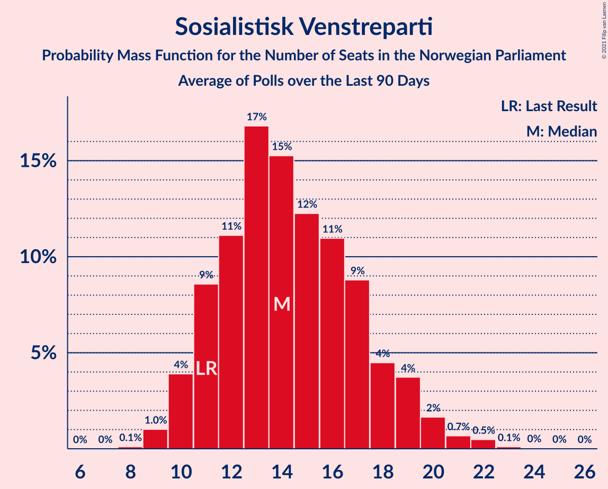

# Sosialistisk Venstreparti

<a href="#voting-intentions">Voting Intentions</a> | <a href="#seats">Seats</a>

## Voting Intentions

Last result: **6.0%** (General Election of 8–9 September 2013)

### Confidence Intervals

| Period     | Polling firm/Commissioner(s) | Median | 80% Confidence Interval | 90% Confidence Interval | 95% Confidence Interval | 99% Confidence Interval |
|:----------:|:----------------:|:-----------:|:-----------------------:|:-----------------------:|:-----------------------:|:-----------------------:|
| N/A | [Poll Average](average.html) | 8.9% | 7.6–10.2% | 7.3–10.6% | 7.0–11.0% | 6.5–11.7% |
| [5–11 August 2021](2021-08-11-ResponsAnalyse.html) | Respons Analyse   VG | 9.4% | 8.3–10.7% | 8.0–11.1% | 7.7–11.4% | 7.2–12.0% |
| [6–11 August 2021](2021-08-11-Norstat.html) | Norstat   Dagens Næringsliv | 8.6% | 7.4–10.0% | 7.1–10.4% | 6.8–10.8% | 6.3–11.5% |
| [3–8 August 2021](2021-08-08-OpinionPerduco.html) | Opinion Perduco   Avisenes Nyhetsbyrå, Dagsavisen and FriFagbevegelse | 8.9% | 7.7–10.4% | 7.3–10.8% | 7.0–11.2% | 6.5–11.9% |
| [2–6 August 2021](2021-08-06-KantarTNS.html) | Kantar TNS   TV2 | 8.6% | 7.5–9.9% | 7.2–10.2% | 7.0–10.5% | 6.5–11.2% |
| [3–4 August 2021](2021-08-04-Norfakta.html) | Norfakta   Klassekampen and Nationen | 8.6% | 7.4–10.0% | 7.1–10.4% | 6.8–10.8% | 6.3–11.5% |
| [22–28 July 2021](2021-07-28-Norstat.html) | Norstat   Dagens Næringsliv | 8.0% | 6.8–9.4% | 6.5–9.8% | 6.2–10.2% | 5.7–10.9% |
| [6–7 July 2021](2021-07-07-Norfakta.html) | Norfakta   Klassekampen and Nationen | 8.8% | 7.6–10.3% | 7.3–10.7% | 7.0–11.1% | 6.5–11.8% |
| [28 June–2 July 2021](2021-07-02-KantarTNS.html) | Kantar TNS   TV2 | 7.3% | 6.4–8.5% | 6.1–8.8% | 5.9–9.1% | 5.4–9.7% |
| [28–30 June 2021](2021-06-30-IpsosMMI.html) | Ipsos MMI   Dagbladet | 6.6% | 5.7–7.7% | 5.4–8.0% | 5.2–8.3% | 4.8–8.9% |
| [17–23 June 2021](2021-06-23-Norstat.html) | Norstat   Dagens Næringsliv | 8.8% | 7.6–10.3% | 7.3–10.7% | 7.0–11.1% | 6.4–11.8% |
| [15–20 June 2021](2021-06-20-Norstat.html) | Norstat   Vårt Land | 8.4% | 7.3–9.7% | 7.0–10.0% | 6.8–10.3% | 6.3–11.0% |
| [9–14 June 2021](2021-06-14-ResponsAnalyse.html) | Respons Analyse   Bergens Tidende and VG | 8.2% | 7.2–9.4% | 6.9–9.8% | 6.6–10.1% | 6.2–10.7% |
| [8–13 June 2021](2021-06-13-Sentio.html) | Sentio   Amedia and Nettavisen | 7.0% | 6.1–8.2% | 5.8–8.5% | 5.6–8.8% | 5.2–9.3% |
| [26 May–11 June 2021](2021-06-11-Norstat.html) | Norstat   NRK | 7.8% | 7.5–8.1% | 7.4–8.2% | 7.3–8.3% | 7.1–8.5% |
| [1–7 June 2021](2021-06-07-OpinionPerduco.html) | Opinion Perduco   Avisenes Nyhetsbyrå, Dagsavisen and FriFagbevegelse | 6.0% | 5.0–7.3% | 4.7–7.7% | 4.5–8.0% | 4.1–8.7% |
| [31 May–4 June 2021](2021-06-04-Norfakta.html) | Norfakta   Klassekampen and Nationen | 8.2% | 7.2–9.4% | 6.9–9.8% | 6.6–10.1% | 6.2–10.7% |
| [25–31 May 2021](2021-05-31-Norstat.html) | Norstat   NRK | 7.2% | 6.3–8.4% | 6.0–8.8% | 5.8–9.1% | 5.3–9.7% |
| [25–31 May 2021](2021-05-31-KantarTNS.html) | Kantar TNS   TV2 | 8.6% | 7.6–9.7% | 7.3–10.0% | 7.1–10.3% | 6.7–10.9% |
| [24–26 May 2021](2021-05-26-IpsosMMI.html) | Ipsos MMI   Dagbladet | 7.6% | 6.4–9.0% | 6.1–9.4% | 5.9–9.7% | 5.4–10.4% |
| [18–25 May 2021](2021-05-25-Norstat.html) | Norstat   Vårt Land | 7.4% | 6.5–8.6% | 6.2–9.0% | 5.9–9.3% | 5.5–9.9% |
| [20–24 May 2021](2021-05-24-Norstat.html) | Norstat   Dagens Næringsliv | 7.8% | 6.8–9.0% | 6.5–9.3% | 6.3–9.6% | 5.9–10.2% |
| [11–16 May 2021](2021-05-16-Sentio.html) | Sentio   Amedia and Nettavisen | 7.3% | 6.3–8.5% | 6.1–8.8% | 5.8–9.1% | 5.4–9.7% |
| [13 May 2021](2021-05-13-OpinionPerduco.html) | Opinion Perduco   Avisenes Nyhetsbyrå, Dagsavisen and FriFagbevegelse | 9.3% | 8.2–10.7% | 7.9–11.1% | 7.6–11.4% | 7.1–12.0% |
| [5–10 May 2021](2021-05-10-ResponsAnalyse.html) | Respons Analyse   VG | 8.0% | 7.0–9.2% | 6.7–9.5% | 6.5–9.8% | 6.0–10.5% |
| [4–5 May 2021](2021-05-05-Norfakta.html) | Norfakta   Klassekampen and Nationen | 8.0% | 7.0–9.2% | 6.7–9.6% | 6.5–9.9% | 6.0–10.5% |
| [27 April–3 May 2021](2021-05-03-Norstat.html) | Norstat   Aftenposten and NRK | 8.8% | 7.7–10.1% | 7.4–10.4% | 7.1–10.7% | 6.6–11.4% |
| [26–30 April 2021](2021-04-30-KantarTNS.html) | Kantar TNS   TV2 | 8.1% | 7.1–9.3% | 6.8–9.7% | 6.5–10.0% | 6.1–10.6% |
| [26–28 April 2021](2021-04-28-IpsosMMI.html) | Ipsos MMI   Dagbladet | 8.5% | 7.3–10.0% | 7.0–10.4% | 6.7–10.7% | 6.1–11.5% |
| [20–24 April 2021](2021-04-24-Norstat.html) | Norstat   Vårt Land | 7.4% | 6.4–8.6% | 6.1–8.9% | 5.9–9.2% | 5.4–9.8% |
| [7–20 April 2021](2021-04-20-Norstat.html) | Norstat   NRK | 7.0% | 6.7–7.3% | 6.6–7.4% | 6.5–7.5% | 6.4–7.6% |
| [13–19 April 2021](2021-04-19-Sentio.html) | Sentio   Amedia and Nettavisen | 7.3% | 6.3–8.5% | 6.1–8.8% | 5.8–9.1% | 5.4–9.7% |
| [14 April 2021](2021-04-14-OpinionPerduco.html) | Opinion Perduco   Avisenes Nyhetsbyrå, Dagsavisen and FriFagbevegelse | 7.6% | 6.6–8.9% | 6.4–9.2% | 6.1–9.5% | 5.7–10.2% |
| [7–12 April 2021](2021-04-12-ResponsAnalyse.html) | Respons Analyse   VG | 7.7% | 6.6–9.1% | 6.3–9.5% | 6.0–9.9% | 5.5–10.6% |
| [6–7 April 2021](2021-04-07-Norfakta.html) | Norfakta   Klassekampen and Nationen | 9.9% | 8.6–11.4% | 8.2–11.8% | 7.9–12.2% | 7.3–13.0% |
| [29 March–7 April 2021](2021-04-07-KantarTNS.html) | Kantar TNS   TV2 | 8.5% | 7.5–9.7% | 7.1–10.1% | 6.9–10.4% | 6.4–11.0% |
| [23–28 March 2021](2021-03-28-Norstat.html) | Norstat   Aftenposten and NRK | 6.9% | 6.0–8.1% | 5.7–8.4% | 5.5–8.7% | 5.1–9.3% |
| [22–24 March 2021](2021-03-24-IpsosMMI.html) | Ipsos MMI   Dagbladet | 7.4% | 6.3–8.8% | 6.0–9.1% | 5.8–9.5% | 5.3–10.2% |
| [16–21 March 2021](2021-03-21-Norstat.html) | Norstat   Aftenposten and NRK | 7.5% | 6.5–8.7% | 6.2–9.0% | 6.0–9.3% | 5.5–10.0% |
| [9–14 March 2021](2021-03-14-Sentio.html) | Sentio   Amedia and Nettavisen | 7.8% | 6.8–9.0% | 6.5–9.3% | 6.3–9.6% | 5.8–10.2% |
| [5–10 March 2021](2021-03-10-ResponsAnalyse.html) | Respons Analyse   VG | 7.7% | 6.7–8.9% | 6.4–9.2% | 6.2–9.5% | 5.7–10.1% |
| [1–8 March 2021](2021-03-08-OpinionPerduco.html) | Opinion Perduco | 7.8% | 6.6–9.2% | 6.3–9.6% | 6.0–10.0% | 5.5–10.7% |
| [2–3 March 2021](2021-03-03-Norfakta.html) | Norfakta   Klassekampen and Nationen | 7.5% | 6.5–8.7% | 6.2–9.0% | 6.0–9.3% | 5.6–9.9% |
| [22–28 February 2021](2021-02-28-Norstat.html) | Norstat   Aftenposten and NRK | 7.4% | 6.4–8.6% | 6.2–9.0% | 5.9–9.3% | 5.5–9.9% |
| [22–26 February 2021](2021-02-26-KantarTNS.html) | Kantar TNS   TV2 | 8.6% | 7.5–9.8% | 7.2–10.2% | 7.0–10.5% | 6.5–11.1% |
| [22–24 February 2021](2021-02-24-IpsosMMI.html) | Ipsos MMI   Dagbladet | 7.8% | 6.7–9.2% | 6.4–9.6% | 6.1–10.0% | 5.6–10.7% |
| [15–21 February 2021](2021-02-21-Norstat.html) | Norstat   Aftenposten and NRK | 6.1% | 5.2–7.3% | 5.0–7.6% | 4.8–7.8% | 4.4–8.4% |
| [9–14 February 2021](2021-02-14-Sentio.html) | Sentio   Amedia and Nettavisen | 8.6% | 7.6–9.8% | 7.3–10.2% | 7.0–10.5% | 6.5–11.1% |
| [1–8 February 2021](2021-02-08-OpinionPerduco.html) | Opinion Perduco   Avisenes Nyhetsbyrå, Dagsavisen and FriFagbevegelse | 7.4% | 6.4–8.6% | 6.1–8.9% | 5.9–9.2% | 5.4–9.8% |
| [2–3 February 2021](2021-02-03-Norfakta.html) | Norfakta   Klassekampen and Nationen | 7.5% | 6.5–8.7% | 6.2–9.0% | 6.0–9.3% | 5.6–9.9% |
| [27 January–2 February 2021](2021-02-02-ResponsAnalyse.html) | Respons Analyse   VG | 7.3% | 6.3–8.5% | 6.1–8.8% | 5.8–9.1% | 5.4–9.7% |
| [25–31 January 2021](2021-01-31-Norstat.html) | Norstat   Aftenposten and NRK | 8.4% | 7.1–9.8% | 6.8–10.3% | 6.5–10.6% | 6.0–11.4% |
| [25–29 January 2021](2021-01-29-KantarTNS.html) | Kantar TNS   TV2 | 5.9% | 5.0–7.2% | 4.7–7.6% | 4.5–7.9% | 4.0–8.5% |
| [25–27 January 2021](2021-01-27-IpsosMMI.html) | Ipsos MMI   Dagbladet | 7.8% | 6.6–9.2% | 6.3–9.6% | 6.0–9.9% | 5.5–10.7% |
| [18–24 January 2021](2021-01-24-Norstat.html) | Norstat   Aftenposten and NRK | 7.7% | 6.6–8.9% | 6.4–9.2% | 6.1–9.5% | 5.7–10.1% |
| [12–16 January 2021](2021-01-16-Sentio.html) | Sentio   Amedia and Nettavisen | 7.8% | 6.8–9.0% | 6.5–9.3% | 6.3–9.6% | 5.8–10.2% |
| [13 January 2021](2021-01-13-OpinionPerduco.html) | Opinion Perduco   Avisenes Nyhetsbyrå, Dagsavisen and FriFagbevegelse | 8.0% | 6.9–9.2% | 6.6–9.6% | 6.4–9.9% | 5.9–10.5% |
| [13 January 2021](2021-01-13-InFact.html) | InFact   Amedia and Nettavisen | 8.7% | 8.1–9.4% | 7.9–9.6% | 7.8–9.7% | 7.5–10.0% |
| [4–8 January 2021](2021-01-08-KantarTNS.html) | Kantar TNS   TV2 | 7.6% | 6.6–8.8% | 6.3–9.1% | 6.1–9.4% | 5.6–10.0% |
| [4–6 January 2021](2021-01-06-ResponsAnalyse.html) | Respons Analyse   VG | 7.7% | 6.7–8.9% | 6.4–9.2% | 6.2–9.5% | 5.8–10.1% |
| [5–6 January 2021](2021-01-06-Norfakta.html) | Norfakta   Klassekampen and Nationen | 8.2% | 7.1–9.6% | 6.7–10.0% | 6.5–10.3% | 6.0–11.1% |
| [28 December 2020–2 January 2021](2021-01-02-Norstat.html) | Norstat   Aftenposten and NRK | 8.9% | 7.8–10.2% | 7.5–10.6% | 7.3–10.9% | 6.8–11.6% |
| [14–16 December 2020](2020-12-16-IpsosMMI.html) | Ipsos MMI   Dagbladet | 7.5% | 6.4–8.9% | 6.1–9.3% | 5.8–9.7% | 5.3–10.4% |
| [7–13 December 2020](2020-12-13-Norstat.html) | Norstat   Aftenposten and NRK | 8.0% | 7.0–9.2% | 6.7–9.6% | 6.4–9.9% | 6.0–10.5% |
| [1–7 December 2020](2020-12-07-OpinionPerduco.html) | Opinion Perduco   Avisenes Nyhetsbyrå, Dagsavisen and FriFagbevegelse | 6.9% | 5.8–8.3% | 5.5–8.7% | 5.3–9.1% | 4.8–9.8% |
| [1–2 December 2020](2020-12-02-Norfakta.html) | Norfakta   Klassekampen and Nationen | 7.2% | 6.1–8.5% | 5.8–8.8% | 5.6–9.2% | 5.1–9.8% |
| [25–30 November 2020](2020-11-30-ResponsAnalyse.html) | Respons Analyse   VG | 8.1% | 7.1–9.3% | 6.8–9.7% | 6.6–10.0% | 6.1–10.6% |
| [24–30 November 2020](2020-11-30-KantarTNS.html) | Kantar TNS   TV2 | 8.0% | 6.9–9.4% | 6.6–9.8% | 6.3–10.1% | 5.8–10.8% |
| [24–29 November 2020](2020-11-29-Sentio.html) | Sentio   Amedia and Nettavisen | 7.0% | 6.1–8.2% | 5.8–8.5% | 5.6–8.8% | 5.2–9.3% |
| [16–18 November 2020](2020-11-18-IpsosMMI.html) | Ipsos MMI   Dagbladet | 7.4% | 6.3–8.8% | 6.0–9.2% | 5.7–9.6% | 5.2–10.3% |
| [9–15 November 2020](2020-11-15-Norstat.html) | Norstat   Aftenposten and NRK | 7.5% | 6.5–8.7% | 6.2–9.0% | 5.9–9.3% | 5.5–9.9% |
| [3–9 November 2020](2020-11-09-OpinionPerduco.html) | Opinion Perduco   Avisenes Nyhetsbyrå, Dagsavisen and FriFagbevegelse | 8.0% | 7.0–9.3% | 6.7–9.6% | 6.5–9.9% | 6.0–10.6% |
| [3–4 November 2020](2020-11-04-Norfakta.html) | Norfakta   Klassekampen and Nationen | 6.7% | 5.8–7.8% | 5.5–8.2% | 5.3–8.4% | 4.9–9.0% |
| [27 October–3 November 2020](2020-11-03-Sentio.html) | Sentio   Amedia and Nettavisen | 7.6% | 6.6–8.8% | 6.3–9.1% | 6.1–9.4% | 5.7–10.0% |
| [28–31 October 2020](2020-10-31-ResponsAnalyse.html) | Respons Analyse   VG | 5.7% | 4.9–6.8% | 4.6–7.1% | 4.4–7.3% | 4.1–7.9% |
| [26–30 October 2020](2020-10-30-KantarTNS.html) | Kantar TNS   TV2 | 7.8% | 6.7–9.2% | 6.4–9.6% | 6.1–9.9% | 5.6–10.6% |
| [20–25 October 2020](2020-10-25-Norstat.html) | Norstat   Aftenposten and NRK | 7.9% | 6.8–9.4% | 6.4–9.8% | 6.1–10.2% | 5.6–10.9% |
| [19–21 October 2020](2020-10-21-IpsosMMI.html) | Ipsos MMI   Dagbladet | 6.3% | 5.3–7.7% | 5.0–8.0% | 4.8–8.4% | 4.3–9.0% |
| [12–18 October 2020](2020-10-18-Norstat.html) | Norstat   Aftenposten and NRK | 6.0% | 5.2–7.1% | 4.9–7.5% | 4.7–7.7% | 4.3–8.3% |
| [6–12 October 2020](2020-10-12-Sentio.html) | Sentio   Amedia and Nettavisen | 6.6% | 5.7–7.7% | 5.4–8.0% | 5.2–8.3% | 4.8–8.9% |
| [6–7 October 2020](2020-10-07-Norfakta.html) | Norfakta   Klassekampen and Nationen | 6.6% | 5.6–7.9% | 5.3–8.3% | 5.1–8.6% | 4.6–9.3% |
| [29 September–4 October 2020](2020-10-04-OpinionPerduco.html) | Opinion Perduco   Avisenes Nyhetsbyrå, Dagsavisen and FriFagbevegelse | 7.3% | 6.3–8.5% | 6.1–8.9% | 5.8–9.2% | 5.4–9.8% |
| [28 September–2 October 2020](2020-10-02-KantarTNS.html) | Kantar TNS   TV2 | 7.2% | 6.1–8.6% | 5.7–8.9% | 5.5–9.3% | 5.0–10.0% |
| [28–30 September 2020](2020-09-30-ResponsAnalyse.html) | Respons Analyse   VG | 8.1% | 7.1–9.3% | 6.8–9.6% | 6.6–10.0% | 6.1–10.6% |
| [21–27 September 2020](2020-09-27-Norstat.html) | Norstat   Aftenposten and NRK | 7.0% | 5.9–8.4% | 5.6–8.8% | 5.4–9.2% | 4.9–9.9% |
| [21–25 September 2020](2020-09-25-IpsosMMI.html) | Ipsos MMI   Dagbladet | 8.4% | 7.2–9.9% | 6.9–10.3% | 6.6–10.7% | 6.1–11.4% |
| [14–20 September 2020](2020-09-20-Norstat.html) | Norstat   Aftenposten and NRK | 7.8% | 6.8–9.0% | 6.5–9.4% | 6.3–9.7% | 5.8–10.3% |
| [8–14 September 2020](2020-09-14-Sentio.html) | Sentio   Amedia and Nettavisen | 7.2% | 6.2–8.4% | 6.0–8.7% | 5.7–9.0% | 5.3–9.6% |
| [1–7 September 2020](2020-09-07-OpinionPerduco.html) | Opinion Perduco   Avisenes Nyhetsbyrå, Dagsavisen and FriFagbevegelse | 6.9% | 5.9–8.0% | 5.7–8.4% | 5.4–8.6% | 5.0–9.2% |
| [1–2 September 2020](2020-09-02-Norfakta.html) | Norfakta   Klassekampen and Nationen | 8.1% | 7.0–9.5% | 6.6–9.9% | 6.4–10.2% | 5.9–10.9% |
| [25 August–1 September 2020](2020-09-01-KantarTNS.html) | Kantar TNS   TV2 | 9.6% | 8.4–10.9% | 8.1–11.3% | 7.8–11.6% | 7.3–12.3% |
| [26–31 August 2020](2020-08-31-ResponsAnalyse.html) | Respons Analyse   VG | 6.8% | 5.9–7.9% | 5.6–8.3% | 5.4–8.5% | 5.0–9.1% |
| [24–31 August 2020](2020-08-31-Norstat.html) | Norstat   Aftenposten and NRK | 8.2% | 7.1–9.4% | 6.8–9.8% | 6.6–10.1% | 6.1–10.7% |
| [17–23 August 2020](2020-08-23-Norstat.html) | Norstat   Aftenposten and NRK | 7.9% | 6.9–9.1% | 6.6–9.5% | 6.3–9.8% | 5.9–10.4% |
| [17–19 August 2020](2020-08-19-IpsosMMI.html) | Ipsos MMI   Dagbladet | 7.1% | 6.0–8.5% | 5.7–8.9% | 5.5–9.3% | 5.0–10.0% |
| [11–16 August 2020](2020-08-16-Sentio.html) | Sentio   Amedia and Nettavisen | 8.0% | 7.0–9.2% | 6.7–9.6% | 6.5–9.9% | 6.0–10.5% |
| [6–11 August 2020](2020-08-11-ResponsAnalyse.html) | Respons Analyse   VG | 7.6% | 6.6–8.8% | 6.3–9.1% | 6.1–9.4% | 5.7–10.0% |
| [4–10 August 2020](2020-08-10-Norstat.html) | Norstat   Aftenposten and NRK | 6.8% | 5.9–8.0% | 5.6–8.3% | 5.4–8.6% | 5.0–9.2% |
| [4–7 August 2020](2020-08-07-KantarTNS.html) | Kantar TNS   TV2 | 7.4% | 6.3–8.8% | 6.0–9.2% | 5.8–9.6% | 5.3–10.3% |
| [4–5 August 2020](2020-08-05-Norfakta.html) | Norfakta   Klassekampen and Nationen | 7.2% | 6.2–8.4% | 6.0–8.7% | 5.7–9.0% | 5.3–9.6% |
| [4 August 2020](2020-08-04-InFact.html) | InFact   Avisa Nordland, Bergensavisen, iFinnmark and Nidaros | 7.3% | 6.4–8.5% | 6.1–8.8% | 5.9–9.1% | 5.5–9.7% |
| [29 July–3 August 2020](2020-08-03-OpinionPerduco.html) | Opinion Perduco   Avisenes Nyhetsbyrå, Dagsavisen and FriFagbevegelse | 6.0% | 5.0–7.4% | 4.7–7.7% | 4.5–8.1% | 4.1–8.7% |
| [7–8 July 2020](2020-07-08-Norfakta.html) | Norfakta   Klassekampen and Nationen | 6.9% | 6.0–8.0% | 5.7–8.4% | 5.5–8.7% | 5.1–9.2% |
| [24–30 June 2020](2020-06-30-KantarTNS.html) | Kantar TNS   TV2 | 8.1% | 7.0–9.5% | 6.7–9.9% | 6.4–10.3% | 5.9–11.0% |
| [22–24 June 2020](2020-06-24-IpsosMMI.html) | Ipsos MMI   Dagbladet | 8.2% | 7.2–9.4% | 6.9–9.8% | 6.6–10.1% | 6.2–10.7% |
| [15–21 June 2020](2020-06-21-Norstat.html) | Norstat   Aftenposten and NRK | 6.8% | 5.9–7.9% | 5.6–8.3% | 5.4–8.5% | 5.0–9.1% |
| [9–13 June 2020](2020-06-13-Sentio.html) | Sentio   Amedia and Nettavisen | 6.9% | 6.0–8.0% | 5.7–8.4% | 5.5–8.7% | 5.1–9.2% |
| [2–8 June 2020](2020-06-08-OpinionPerduco.html) | Opinion Perduco | 7.2% | 6.1–8.6% | 5.7–9.0% | 5.5–9.3% | 5.0–10.0% |
| [2–4 June 2020](2020-06-04-ResponsAnalyse.html) | Respons Analyse   VG | 6.8% | 5.9–7.9% | 5.6–8.2% | 5.4–8.5% | 5.0–9.1% |
| [2–3 June 2020](2020-06-03-Norfakta.html) | Norfakta   Klassekampen and Nationen | 7.2% | 6.2–8.4% | 6.0–8.7% | 5.7–9.0% | 5.3–9.5% |
| [26 May–1 June 2020](2020-06-01-Norstat.html) | Norstat   Aftenposten and NRK | 6.9% | 5.8–8.3% | 5.5–8.7% | 5.3–9.1% | 4.8–9.8% |
| [25–29 May 2020](2020-05-29-KantarTNS.html) | Kantar TNS   TV2 | 7.3% | 6.2–8.6% | 5.9–9.0% | 5.6–9.3% | 5.2–10.0% |
| [25–28 May 2020](2020-05-28-IpsosMMI.html) | Ipsos MMI   Dagbladet | 7.5% | 6.4–9.0% | 6.1–9.4% | 5.8–9.8% | 5.3–10.5% |
| [19–25 May 2020](2020-05-25-Norstat.html) | Norstat   Aftenposten and NRK | 5.5% | 4.7–6.6% | 4.5–6.9% | 4.3–7.2% | 3.9–7.7% |
| [12–16 May 2020](2020-05-16-Sentio.html) | Sentio   Amedia and Nettavisen | 7.1% | 6.2–8.3% | 5.9–8.6% | 5.7–8.9% | 5.2–9.4% |
| [5–10 May 2020](2020-05-10-OpinionPerduco.html) | Opinion Perduco | 6.6% | 5.7–7.7% | 5.4–8.1% | 5.2–8.4% | 4.8–8.9% |
| [5–6 May 2020](2020-05-06-Norfakta.html) | Norfakta   Klassekampen and Nationen | 8.0% | 6.9–9.4% | 6.6–9.8% | 6.3–10.1% | 5.9–10.8% |
| [30 April–5 May 2020](2020-05-05-ResponsAnalyse.html) | Respons Analyse   VG | 6.2% | 5.3–7.3% | 5.1–7.6% | 4.9–7.9% | 4.5–8.4% |
| [27 April–4 May 2020](2020-05-04-Norstat.html) | Norstat   Aftenposten and NRK | 6.6% | 5.7–7.7% | 5.4–8.1% | 5.2–8.3% | 4.8–8.9% |
| [27–29 April 2020](2020-04-29-KantarTNS.html) | Kantar TNS   TV2 | 5.6% | 4.7–6.6% | 4.5–6.9% | 4.3–7.2% | 3.9–7.7% |
| [20–26 April 2020](2020-04-26-Norstat.html) | Norstat   Aftenposten and NRK | 6.6% | 5.7–7.7% | 5.4–8.1% | 5.2–8.4% | 4.8–8.9% |
| [20–22 April 2020](2020-04-22-IpsosMMI.html) | Ipsos MMI   Dagbladet | 8.6% | 7.4–10.0% | 7.0–10.5% | 6.7–10.8% | 6.2–11.6% |
| [14–20 April 2020](2020-04-20-Sentio.html) | Sentio   Amedia and Nettavisen | 6.5% | 5.6–7.6% | 5.3–7.9% | 5.1–8.2% | 4.7–8.8% |
| [31 March–5 April 2020](2020-04-05-OpinionPerduco.html) | Opinion Perduco | 5.9% | 5.0–7.0% | 4.8–7.3% | 4.6–7.5% | 4.2–8.1% |
| [26 March–1 April 2020](2020-04-01-ResponsAnalyse.html) | Respons Analyse   VG | 7.3% | 6.3–8.5% | 6.1–8.8% | 5.8–9.1% | 5.4–9.7% |
| [31 March–1 April 2020](2020-04-01-Norfakta.html) | Norfakta   Klassekampen and Nationen | 9.1% | 8.0–10.4% | 7.7–10.7% | 7.5–11.1% | 7.0–11.7% |
| [25–31 March 2020](2020-03-31-KantarTNS.html) | Kantar TNS   TV2 | 7.0% | 5.9–8.4% | 5.6–8.8% | 5.4–9.1% | 4.9–9.8% |
| [23–29 March 2020](2020-03-29-Norstat.html) | Norstat   Aftenposten and NRK | 7.2% | 6.1–8.6% | 5.8–9.0% | 5.5–9.3% | 5.1–10.0% |
| [16–23 March 2020](2020-03-23-Norstat.html) | Norstat   Aftenposten and NRK | 7.6% | 6.6–8.8% | 6.3–9.1% | 6.1–9.4% | 5.6–10.0% |
| [18–20 March 2020](2020-03-20-IpsosMMI.html) | Ipsos MMI   Dagbladet | 8.9% | 7.6–10.5% | 7.3–11.0% | 7.0–11.4% | 6.4–12.2% |
| [10–16 March 2020](2020-03-16-Sentio.html) | Sentio   Amedia and Nettavisen | 7.1% | 6.2–8.3% | 5.9–8.6% | 5.7–8.9% | 5.2–9.4% |
| [3–9 March 2020](2020-03-09-OpinionPerduco.html) | Opinion Perduco | 6.9% | 6.0–8.1% | 5.7–8.4% | 5.5–8.7% | 5.0–9.3% |
| [3–4 March 2020](2020-03-04-Norfakta.html) | Norfakta   Klassekampen and Nationen | 7.0% | 6.1–8.2% | 5.8–8.5% | 5.6–8.8% | 5.2–9.3% |
| [27 February–2 March 2020](2020-03-02-ResponsAnalyse.html) | Respons Analyse   VG | 7.2% | 6.2–8.4% | 6.0–8.7% | 5.7–9.0% | 5.3–9.6% |
| [24 February–2 March 2020](2020-03-02-Norstat.html) | Norstat   Aftenposten and NRK | 8.4% | 7.2–9.9% | 6.8–10.3% | 6.6–10.7% | 6.0–11.5% |
| [24–28 February 2020](2020-02-28-KantarTNS.html) | Kantar TNS   TV2 | 8.5% | 7.3–10.0% | 7.0–10.3% | 6.7–10.7% | 6.2–11.4% |
| [17–23 February 2020](2020-02-23-Norstat.html) | Norstat   Vårt Land | 6.5% | 5.4–8.0% | 5.1–8.4% | 4.8–8.7% | 4.4–9.5% |
| [17–19 February 2020](2020-02-19-IpsosMMI.html) | Ipsos MMI   Dagbladet | 7.2% | 6.1–8.6% | 5.8–8.9% | 5.5–9.3% | 5.0–10.0% |
| [11–17 February 2020](2020-02-17-Sentio.html) | Sentio   Amedia and Nettavisen | 7.2% | 6.2–8.4% | 6.0–8.7% | 5.7–9.0% | 5.3–9.6% |
| [4–10 February 2020](2020-02-10-OpinionPerduco.html) | Opinion Perduco   Avisenes Nyhetsbyrå and Dagsavisen and FriFagbevegelse | 6.5% | 5.6–7.6% | 5.3–8.0% | 5.1–8.2% | 4.7–8.8% |
| [4–5 February 2020](2020-02-05-Norfakta.html) | Norfakta   Klassekampen and Nationen | 7.6% | 6.6–8.8% | 6.3–9.1% | 6.1–9.4% | 5.7–10.0% |
| [30 January–3 February 2020](2020-02-03-ResponsAnalyse.html) | Respons Analyse   VG | 6.7% | 5.8–7.8% | 5.5–8.1% | 5.3–8.4% | 4.9–9.0% |
| [27 January–2 February 2020](2020-02-02-Norstat.html) | Norstat   Aftenposten and NRK | 6.1% | 5.2–7.2% | 5.0–7.5% | 4.7–7.8% | 4.3–8.4% |
| [27–31 January 2020](2020-01-31-KantarTNS.html) | Kantar TNS   TV2 | 7.7% | 6.6–9.0% | 6.3–9.4% | 6.0–9.7% | 5.5–10.4% |
| [24–27 January 2020](2020-01-27-Sentio.html) | Sentio   Amedia and Nettavisen | 7.7% | 6.8–8.9% | 6.5–9.3% | 6.2–9.6% | 5.8–10.2% |
| [21–27 January 2020](2020-01-27-Norstat.html) | Norstat   Vårt Land | 7.6% | 6.4–9.2% | 6.1–9.6% | 5.8–10.0% | 5.3–10.8% |
| [20–22 January 2020](2020-01-22-IpsosMMI.html) | Ipsos MMI   Dagbladet | 5.9% | 4.9–7.1% | 4.6–7.5% | 4.4–7.8% | 4.0–8.4% |
| [20–21 January 2020](2020-01-21-ResponsAnalyse.html) | Respons Analyse   VG | 7.0% | 6.1–8.1% | 5.9–8.4% | 5.7–8.6% | 5.3–9.2% |
| [21 January 2020](2020-01-21-KantarTNS.html) | Kantar TNS   TV2 | 6.6% | 5.5–8.0% | 5.2–8.4% | 4.9–8.8% | 4.4–9.5% |
| [14–18 January 2020](2020-01-18-Sentio.html) | Sentio   Amedia and Nettavisen | 7.9% | 6.9–9.1% | 6.6–9.4% | 6.4–9.7% | 5.9–10.3% |
| [15 January 2020](2020-01-15-OpinionPerduco.html) | Opinion Perduco   Avisenes Nyhetsbyrå and Dagsavisen and FriFagbevegelse | 7.4% | 6.4–8.6% | 6.1–8.9% | 5.9–9.2% | 5.5–9.8% |
| [6–10 January 2020](2020-01-10-KantarTNS.html) | Kantar TNS   TV2 | 8.8% | 7.6–10.2% | 7.3–10.6% | 7.0–11.0% | 6.5–11.7% |
| [7–8 January 2020](2020-01-08-Norfakta.html) | Norfakta   Klassekampen and Nationen | 6.2% | 5.2–7.4% | 4.9–7.8% | 4.7–8.1% | 4.2–8.7% |
| [6 January 2020](2020-01-06-ResponsAnalyse.html) | Respons Analyse   VG | 6.6% | 5.7–7.7% | 5.4–8.0% | 5.2–8.3% | 4.8–8.9% |
| [30 December 2019–5 January 2020](2020-01-05-Norstat.html) | Norstat   Aftenposten and NRK | 7.2% | 6.2–8.4% | 5.9–8.7% | 5.7–9.0% | 5.3–9.6% |
| [16–18 December 2019](2019-12-18-IpsosMMI.html) | Ipsos MMI | 8.5% | 7.3–10.0% | 7.0–10.4% | 6.7–10.8% | 6.1–11.5% |
| [9–15 December 2019](2019-12-15-Norstat.html) | Norstat | 7.1% | 6.2–8.3% | 5.9–8.6% | 5.7–8.9% | 5.2–9.4% |
| [3–8 December 2019](2019-12-08-OpinionPerduco.html) | Opinion Perduco | 7.5% | 6.5–8.7% | 6.2–9.0% | 6.0–9.3% | 5.5–9.9% |
| [3–4 December 2019](2019-12-04-Norfakta.html) | Norfakta | 7.7% | 6.6–9.0% | 6.3–9.4% | 6.0–9.7% | 5.5–10.4% |
| [26 November–2 December 2019](2019-12-02-Sentio.html) | Sentio | 8.3% | 7.3–9.5% | 7.0–9.9% | 6.7–10.2% | 6.3–10.8% |
| [28 November–2 December 2019](2019-12-02-ResponsAnalyse.html) | Respons Analyse | 6.2% | 5.3–7.3% | 5.1–7.6% | 4.9–7.9% | 4.5–8.4% |
| [25–29 November 2019](2019-11-29-KantarTNS.html) | Kantar TNS | 7.9% | 6.8–9.3% | 6.5–9.7% | 6.2–10.0% | 5.7–10.7% |
| [19–25 November 2019](2019-11-25-Norstat.html) | Norstat | 6.5% | 5.5–7.8% | 5.2–8.2% | 5.0–8.6% | 4.5–9.2% |
| [18–20 November 2019](2019-11-20-IpsosMMI.html) | Ipsos MMI | 8.3% | 7.1–9.8% | 6.8–10.2% | 6.5–10.6% | 6.0–11.4% |
| [12–18 November 2019](2019-11-18-Norstat.html) | Norstat | 8.1% | 6.9–9.7% | 6.5–10.1% | 6.2–10.5% | 5.7–11.3% |
| [5–11 November 2019](2019-11-11-OpinionPerduco.html) | Opinion Perduco | 8.4% | 7.3–9.7% | 7.1–10.0% | 6.8–10.3% | 6.3–11.0% |
| [5–6 November 2019](2019-11-06-Norfakta.html) | Norfakta | 7.1% | 6.0–8.4% | 5.7–8.8% | 5.5–9.1% | 5.0–9.8% |
| [31 October–4 November 2019](2019-11-04-ResponsAnalyse.html) | Respons Analyse | 6.5% | 5.6–7.6% | 5.3–7.9% | 5.1–8.2% | 4.7–8.7% |
| [29 October–2 November 2019](2019-11-02-Sentio.html) | Sentio | 7.7% | 6.7–8.9% | 6.4–9.2% | 6.2–9.5% | 5.8–10.1% |
| [28 October–1 November 2019](2019-11-01-KantarTNS.html) | Kantar TNS | 5.6% | 4.7–6.8% | 4.4–7.1% | 4.2–7.4% | 3.8–8.0% |
| [22–28 October 2019](2019-10-28-Norstat.html) | Norstat | 7.4% | 6.3–8.8% | 5.9–9.2% | 5.7–9.6% | 5.2–10.3% |
| [21–23 October 2019](2019-10-23-IpsosMMI.html) | Ipsos MMI | 6.4% | 5.4–7.7% | 5.1–8.1% | 4.9–8.4% | 4.4–9.0% |
| [15–21 October 2019](2019-10-21-Norstat.html) | Norstat | 7.8% | 6.7–9.0% | 6.4–9.3% | 6.2–9.7% | 5.7–10.3% |
| [8–14 October 2019](2019-10-14-Sentio.html) | Sentio | 6.4% | 5.5–7.5% | 5.3–7.8% | 5.0–8.1% | 4.6–8.7% |
| [1–7 October 2019](2019-10-07-OpinionPerduco.html) | Opinion Perduco | 8.2% | 7.2–9.5% | 6.9–9.8% | 6.6–10.1% | 6.1–10.8% |
| [30 September–4 October 2019](2019-10-04-KantarTNS.html) | Kantar TNS | 8.9% | 7.8–10.3% | 7.4–10.7% | 7.2–11.1% | 6.6–11.8% |
| [1–2 October 2019](2019-10-02-Norfakta.html) | Norfakta | 7.0% | 6.0–8.3% | 5.7–8.7% | 5.5–9.0% | 5.0–9.7% |
| [24–30 September 2019](2019-09-30-Norstat.html) | Norstat | 6.5% | 5.4–8.0% | 5.1–8.4% | 4.8–8.7% | 4.4–9.5% |
| [23–25 September 2019](2019-09-25-ResponsAnalyse.html) | Respons Analyse | 6.7% | 5.8–7.8% | 5.5–8.2% | 5.3–8.4% | 4.9–9.0% |
| [23–25 September 2019](2019-09-25-IpsosMMI.html) | Ipsos MMI | 8.4% | 7.3–9.7% | 7.1–10.1% | 6.8–10.4% | 6.3–11.0% |
| [17–19 September 2019](2019-09-19-Norstat.html) | Norstat | 9.1% | 7.9–10.7% | 7.5–11.1% | 7.2–11.5% | 6.7–12.3% |
| [10–16 September 2019](2019-09-16-Sentio.html) | Sentio | 6.9% | 6.0–8.0% | 5.7–8.4% | 5.5–8.7% | 5.1–9.2% |
| [3–4 September 2019](2019-09-04-Norfakta.html) | Norfakta | 7.4% | 6.4–8.6% | 6.1–8.9% | 5.9–9.2% | 5.5–9.8% |
| [27 August–2 September 2019](2019-09-02-Norstat.html) | Norstat | 6.1% | 5.0–7.5% | 4.7–7.9% | 4.4–8.3% | 3.9–9.0% |
| [20–26 August 2019](2019-08-26-Norstat.html) | Norstat | 6.3% | 5.3–7.4% | 5.1–7.7% | 4.9–8.0% | 4.5–8.6% |
| [19–21 August 2019](2019-08-21-IpsosMMI.html) | Ipsos MMI | 7.9% | 6.8–9.4% | 6.4–9.8% | 6.2–10.1% | 5.7–10.9% |
| [13–18 August 2019](2019-08-18-Sentio.html) | Sentio | 6.5% | 5.6–7.6% | 5.3–7.9% | 5.1–8.2% | 4.7–8.8% |
| [6–12 August 2019](2019-08-12-Norstat.html) | Norstat | 5.9% | 4.9–7.2% | 4.6–7.5% | 4.4–7.9% | 4.0–8.5% |
| [5–9 August 2019](2019-08-09-KantarTNS.html) | Kantar TNS | 8.3% | 7.2–9.8% | 6.8–10.2% | 6.6–10.5% | 6.0–11.3% |
| [6–7 August 2019](2019-08-07-Norfakta.html) | Norfakta | 7.4% | 6.4–8.7% | 6.1–9.1% | 5.8–9.4% | 5.4–10.1% |
| [30 July–5 August 2019](2019-08-05-OpinionPerduco.html) | Opinion Perduco | 8.8% | 7.5–10.3% | 7.1–10.8% | 6.8–11.2% | 6.3–12.0% |
| [2–3 July 2019](2019-07-03-Norfakta.html) | Norfakta | 7.6% | 6.5–9.0% | 6.2–9.4% | 5.9–9.7% | 5.4–10.4% |
| [24–28 June 2019](2019-06-28-KantarTNS.html) | Kantar TNS | 7.8% | 6.7–9.2% | 6.4–9.6% | 6.1–9.9% | 5.6–10.6% |
| [24–26 June 2019](2019-06-26-IpsosMMI.html) | Ipsos MMI | 6.9% | 5.8–8.3% | 5.5–8.7% | 5.3–9.0% | 4.8–9.7% |
| [18–24 June 2019](2019-06-24-Norstat.html) | Norstat | 6.9% | 6.0–8.1% | 5.7–8.5% | 5.5–8.7% | 5.1–9.3% |
| [11–17 June 2019](2019-06-17-Sentio.html) | Sentio | 6.8% | 5.9–7.9% | 5.6–8.3% | 5.4–8.5% | 5.0–9.1% |
| [4–10 June 2019](2019-06-10-OpinionPerduco.html) | Opinion Perduco | 6.4% | 5.3–7.7% | 5.0–8.1% | 4.8–8.4% | 4.3–9.1% |
| [3–6 June 2019](2019-06-06-ResponsAnalyse.html) | Respons Analyse | 6.8% | 5.7–8.1% | 5.5–8.4% | 5.2–8.8% | 4.8–9.4% |
| [4–5 June 2019](2019-06-05-Norfakta.html) | Norfakta | 6.0% | 5.1–7.1% | 4.9–7.4% | 4.7–7.7% | 4.3–8.2% |
| [28 May–3 June 2019](2019-06-03-Norstat.html) | Norstat | 6.8% | 5.9–8.0% | 5.6–8.3% | 5.4–8.6% | 5.0–9.2% |
| [27–29 May 2019](2019-05-29-IpsosMMI.html) | Ipsos MMI | 6.4% | 5.3–7.7% | 5.1–8.0% | 4.8–8.4% | 4.4–9.0% |
| [21–27 May 2019](2019-05-27-Norstat.html) | Norstat | 6.5% | 5.6–7.6% | 5.3–8.0% | 5.1–8.3% | 4.7–8.8% |
| [14–18 May 2019](2019-05-18-Sentio.html) | Sentio | 6.1% | 5.2–7.2% | 5.0–7.5% | 4.8–7.8% | 4.4–8.3% |
| [7–13 May 2019](2019-05-13-OpinionPerduco.html) | Opinion Perduco | 8.3% | 7.3–9.6% | 7.0–9.9% | 6.7–10.2% | 6.2–10.9% |
| [7–8 May 2019](2019-05-08-Norfakta.html) | Norfakta | 7.4% | 6.4–8.6% | 6.1–8.9% | 5.9–9.2% | 5.5–9.8% |
| [30 April–6 May 2019](2019-05-06-Norstat.html) | Norstat | 6.2% | 5.3–7.3% | 5.1–7.6% | 4.9–7.9% | 4.5–8.4% |
| [29 April–3 May 2019](2019-05-03-KantarTNS.html) | Kantar TNS | 7.2% | 6.1–8.5% | 5.8–8.9% | 5.5–9.2% | 5.1–9.8% |
| [29 April–2 May 2019](2019-05-02-ResponsAnalyse.html) | Respons Analyse | 8.4% | 7.4–9.6% | 7.1–10.0% | 6.8–10.3% | 6.4–10.9% |
| [2 May 2019](2019-05-02-Norstat.html) | Norstat | 7.5% | 6.3–9.0% | 6.0–9.4% | 5.7–9.8% | 5.2–10.6% |
| [23–25 April 2019](2019-04-25-IpsosMMI.html) | Ipsos MMI | 6.8% | 5.8–8.0% | 5.6–8.3% | 5.3–8.6% | 4.9–9.2% |
| [16 April 2019](2019-04-16-Sentio.html) | Sentio | 7.0% | 6.1–8.2% | 5.8–8.5% | 5.6–8.8% | 5.2–9.3% |
| [2–8 April 2019](2019-04-08-OpinionPerduco.html) | Opinion Perduco | 8.2% | 7.1–9.4% | 6.8–9.8% | 6.6–10.1% | 6.1–10.7% |
| [2–4 April 2019](2019-04-04-ResponsAnalyse.html) | Respons Analyse | 7.6% | 6.6–8.8% | 6.3–9.1% | 6.1–9.4% | 5.7–10.0% |
| [2–3 April 2019](2019-04-03-Norfakta.html) | Norfakta | 8.4% | 7.4–9.6% | 7.1–10.0% | 6.9–10.3% | 6.4–10.9% |
| [26 March–1 April 2019](2019-04-01-Norstat.html) | Norstat | 7.0% | 5.9–8.5% | 5.5–8.9% | 5.3–9.3% | 4.8–10.0% |
| [25–29 March 2019](2019-03-29-KantarTNS.html) | Kantar TNS | 7.5% | 6.4–8.8% | 6.1–9.2% | 5.8–9.5% | 5.3–10.2% |
| [27 March 2019](2019-03-27-Norstat.html) | Norstat | 6.8% | 5.7–8.3% | 5.4–8.7% | 5.1–9.1% | 4.6–9.9% |
| [18–20 March 2019](2019-03-20-IpsosMMI.html) | Ipsos MMI | 7.0% | 6.0–8.2% | 5.8–8.5% | 5.5–8.8% | 5.1–9.4% |
| [12–18 March 2019](2019-03-18-Sentio.html) | Sentio | 7.3% | 6.3–8.5% | 6.1–8.8% | 5.8–9.1% | 5.4–9.7% |
| [5–11 March 2019](2019-03-11-OpinionPerduco.html) | Opinion Perduco | 7.1% | 6.1–8.3% | 5.9–8.6% | 5.6–8.9% | 5.2–9.5% |
| [5–6 March 2019](2019-03-06-Norfakta.html) | Norfakta | 8.1% | 6.9–9.5% | 6.6–9.9% | 6.3–10.3% | 5.8–11.0% |
| [28 February–4 March 2019](2019-03-04-ResponsAnalyse.html) | Respons Analyse | 7.6% | 6.6–8.8% | 6.3–9.1% | 6.1–9.4% | 5.7–10.0% |
| [26 February–4 March 2019](2019-03-04-Norstat.html) | Norstat | 8.0% | 6.8–9.5% | 6.4–9.9% | 6.1–10.3% | 5.6–11.1% |
| [25 February–1 March 2019](2019-03-01-KantarTNS.html) | Kantar TNS | 8.0% | 6.8–9.4% | 6.5–9.8% | 6.2–10.2% | 5.7–10.9% |
| [19–25 February 2019](2019-02-25-Norstat.html) | Norstat | 6.5% | 5.4–8.0% | 5.1–8.4% | 4.8–8.7% | 4.4–9.5% |
| [18–20 February 2019](2019-02-20-IpsosMMI.html) | Ipsos MMI | 7.0% | 6.0–8.2% | 5.7–8.5% | 5.5–8.8% | 5.1–9.4% |
| [12–19 February 2019](2019-02-19-Sentio.html) | Sentio | 8.0% | 7.0–9.2% | 6.7–9.6% | 6.5–9.9% | 6.0–10.5% |
| [5–11 February 2019](2019-02-11-OpinionPerduco.html) | Opinion Perduco | 8.0% | 6.8–9.5% | 6.5–9.9% | 6.2–10.3% | 5.7–11.0% |
| [5–6 February 2019](2019-02-06-Norfakta.html) | Norfakta | 7.1% | 6.1–8.5% | 5.8–8.8% | 5.5–9.2% | 5.1–9.8% |
| [31 January–4 February 2019](2019-02-04-ResponsAnalyse.html) | Respons Analyse | 7.8% | 6.6–9.2% | 6.3–9.6% | 6.0–10.0% | 5.5–10.7% |
| [29 January–4 February 2019](2019-02-04-Norstat.html) | Norstat | 7.8% | 6.6–9.3% | 6.2–9.7% | 6.0–10.1% | 5.4–10.9% |
| [28 January–2 February 2019](2019-02-02-KantarTNS.html) | Kantar TNS | 8.8% | 7.7–10.2% | 7.3–10.6% | 7.1–11.0% | 6.6–11.7% |
| [22–28 January 2019](2019-01-28-Norstat.html) | Norstat | 7.2% | 6.1–8.7% | 5.8–9.1% | 5.5–9.4% | 5.0–10.2% |
| [21–23 January 2019](2019-01-23-IpsosMMI.html) | Ipsos MMI | 8.0% | 7.0–9.3% | 6.7–9.6% | 6.4–10.0% | 6.0–10.6% |
| [15–21 January 2019](2019-01-21-Sentio.html) | Sentio | 6.9% | 5.8–8.4% | 5.5–8.7% | 5.2–9.1% | 4.7–9.9% |
| [8–14 January 2019](2019-01-14-OpinionPerduco.html) | Opinion Perduco | 7.8% | 6.7–9.3% | 6.3–9.7% | 6.1–10.1% | 5.5–10.8% |
| [3–10 January 2019](2019-01-10-KantarTNS.html) | Kantar TNS | 7.2% | 6.2–8.6% | 5.9–9.0% | 5.6–9.3% | 5.1–10.0% |
| [8–9 January 2019](2019-01-09-Norfakta.html) | Norfakta | 7.4% | 6.4–8.6% | 6.2–8.9% | 5.9–9.2% | 5.5–9.8% |
| [3–7 January 2019](2019-01-07-ResponsAnalyse.html) | Respons Analyse | 6.7% | 5.8–7.8% | 5.5–8.1% | 5.3–8.4% | 4.9–9.0% |
| [2–7 January 2019](2019-01-07-Norstat.html) | Norstat | 7.3% | 6.2–8.8% | 5.9–9.2% | 5.6–9.5% | 5.2–10.2% |
| [17–19 December 2018](2018-12-19-IpsosMMI.html) | Ipsos MMI | 8.1% | 7.0–9.3% | 6.7–9.7% | 6.5–10.0% | 6.0–10.6% |
| [11–17 December 2018](2018-12-17-Norstat.html) | Norstat | 6.9% | 5.9–8.1% | 5.7–8.4% | 5.4–8.7% | 5.0–9.3% |
| [4–10 December 2018](2018-12-10-OpinionPerduco.html) | Opinion Perduco | 5.8% | 4.8–7.1% | 4.5–7.5% | 4.3–7.8% | 3.8–8.5% |
| [4–5 December 2018](2018-12-05-Norfakta.html) | Norfakta | 7.4% | 6.3–8.7% | 6.0–9.1% | 5.7–9.4% | 5.2–10.2% |
| [28 November–4 December 2018](2018-12-04-Sentio.html) | Sentio | 5.5% | 4.5–6.8% | 4.3–7.1% | 4.1–7.5% | 3.6–8.1% |
| [29 November–4 December 2018](2018-12-04-ResponsAnalyse.html) | Respons Analyse | 8.8% | 7.7–10.1% | 7.4–10.4% | 7.2–10.7% | 6.7–11.4% |
| [3 December 2018](2018-12-03-KantarTNS.html) | Kantar TNS | 6.4% | 5.3–7.7% | 5.0–8.1% | 4.8–8.4% | 4.4–9.1% |
| [20–25 November 2018](2018-11-25-Norstat.html) | Norstat | 7.0% | 6.0–8.2% | 5.7–8.5% | 5.5–8.8% | 5.1–9.4% |
| [19–21 November 2018](2018-11-21-IpsosMMI.html) | Ipsos MMI | 6.1% | 5.2–7.3% | 4.9–7.6% | 4.7–7.8% | 4.3–8.4% |
| [13–19 November 2018](2018-11-19-Norstat.html) | Norstat | 6.5% | 5.6–7.7% | 5.3–8.0% | 5.1–8.3% | 4.7–8.9% |
| [6–12 November 2018](2018-11-12-OpinionPerduco.html) | Opinion Perduco | 6.0% | 5.0–7.3% | 4.7–7.7% | 4.5–8.0% | 4.0–8.7% |
| [5–7 November 2018](2018-11-07-ResponsAnalyse.html) | Respons Analyse | 6.0% | 5.1–7.1% | 4.9–7.4% | 4.7–7.7% | 4.3–8.2% |
| [30 October–5 November 2018](2018-11-05-Sentio.html) | Sentio | 7.5% | 6.4–9.0% | 6.1–9.4% | 5.8–9.8% | 5.3–10.5% |
| [5 November 2018](2018-11-05-Norfakta.html) | Norfakta | 5.0% | 4.1–6.1% | 3.9–6.4% | 3.7–6.7% | 3.3–7.3% |
| [24–30 October 2018](2018-10-30-KantarTNS.html) | Kantar TNS | 7.3% | 6.2–8.6% | 5.9–9.0% | 5.7–9.3% | 5.2–10.0% |
| [23–28 October 2018](2018-10-28-Norstat.html) | Norstat | 6.6% | 5.6–8.0% | 5.3–8.4% | 5.0–8.7% | 4.5–9.4% |
| [22–24 October 2018](2018-10-24-IpsosMMI.html) | Ipsos MMI | 7.7% | 6.7–8.9% | 6.4–9.3% | 6.2–9.6% | 5.7–10.2% |
| [16–22 October 2018](2018-10-22-Norstat.html) | Norstat | 7.2% | 6.2–8.4% | 6.0–8.8% | 5.7–9.1% | 5.3–9.7% |
| [9–18 October 2018](2018-10-18-Sentio.html) | Sentio | 6.5% | 5.5–7.9% | 5.2–8.3% | 4.9–8.6% | 4.5–9.3% |
| [4–10 October 2018](2018-10-10-OpinionPerduco.html) | Opinion Perduco | 5.9% | 4.9–7.2% | 4.6–7.6% | 4.3–7.9% | 3.9–8.6% |
| [9–10 October 2018](2018-10-10-InFact.html) | InFact | 5.7% | 4.9–6.8% | 4.7–7.1% | 4.5–7.4% | 4.1–7.9% |
| [1–3 October 2018](2018-10-03-ResponsAnalyse.html) | Respons Analyse | 6.7% | 5.8–7.8% | 5.5–8.2% | 5.3–8.4% | 4.9–9.0% |
| [2–3 October 2018](2018-10-03-Norfakta.html) | Norfakta | 6.6% | 5.7–7.7% | 5.4–8.0% | 5.2–8.3% | 4.8–8.9% |
| [24–29 September 2018](2018-09-29-Norstat.html) | Norstat | 7.1% | 6.2–8.4% | 5.9–8.7% | 5.7–9.0% | 5.2–9.6% |
| [24–28 September 2018](2018-09-28-KantarTNS.html) | Kantar TNS | 7.6% | 6.5–9.0% | 6.2–9.4% | 6.0–9.7% | 5.5–10.4% |
| [24–26 September 2018](2018-09-26-IpsosMMI.html) | Ipsos MMI | 6.1% | 5.2–7.2% | 5.0–7.6% | 4.7–7.8% | 4.3–8.4% |
| [18–24 September 2018](2018-09-24-Norstat.html) | Norstat | 6.2% | 5.3–7.4% | 5.1–7.7% | 4.8–8.0% | 4.4–8.6% |
| [11–17 September 2018](2018-09-17-Sentio.html) | Sentio | 6.4% | 5.3–7.7% | 5.0–8.1% | 4.8–8.4% | 4.3–9.1% |
| [6–10 September 2018](2018-09-10-ResponsAnalyse.html) | Respons Analyse | 6.3% | 5.4–7.4% | 5.2–7.7% | 4.9–8.0% | 4.5–8.5% |
| [4–10 September 2018](2018-09-10-OpinionPerduco.html) | Opinion Perduco | 7.1% | 5.9–8.5% | 5.6–8.9% | 5.4–9.3% | 4.9–10.0% |
| [6 September 2018](2018-09-06-KantarTNS.html) | Kantar TNS | 6.5% | 5.5–7.9% | 5.2–8.2% | 4.9–8.6% | 4.5–9.3% |
| [4–5 September 2018](2018-09-05-Norfakta.html) | Norfakta | 7.1% | 6.0–8.4% | 5.7–8.7% | 5.5–9.1% | 5.0–9.7% |
| [28 August–2 September 2018](2018-09-02-Norstat.html) | Norstat | 6.0% | 5.0–7.3% | 4.7–7.6% | 4.5–7.9% | 4.0–8.6% |
| [20–26 August 2018](2018-08-26-Norstat.html) | Norstat | 6.9% | 5.9–8.1% | 5.7–8.4% | 5.4–8.7% | 5.0–9.3% |
| [20–25 August 2018](2018-08-25-IpsosMMI.html) | Ipsos MMI | 6.0% | 5.2–7.2% | 4.9–7.5% | 4.7–7.8% | 4.3–8.3% |
| [14–20 August 2018](2018-08-20-Sentio.html) | Sentio | 6.3% | 5.3–7.7% | 5.0–8.1% | 4.7–8.4% | 4.3–9.1% |
| [16–20 August 2018](2018-08-20-ResponsAnalyse.html) | Respons Analyse | 7.7% | 6.7–8.9% | 6.4–9.2% | 6.2–9.5% | 5.7–10.1% |
| [7–12 August 2018](2018-08-12-Norstat.html) | Norstat | 6.1% | 5.0–7.4% | 4.7–7.8% | 4.5–8.1% | 4.0–8.8% |
| [7–8 August 2018](2018-08-08-Norfakta.html) | Norfakta | 5.8% | 4.9–6.8% | 4.7–7.1% | 4.5–7.4% | 4.1–8.0% |
| [1–7 August 2018](2018-08-07-KantarTNS.html) | Kantar TNS | 8.0% | 6.8–9.4% | 6.5–9.8% | 6.2–10.2% | 5.7–10.9% |
| [31 July–6 August 2018](2018-08-06-OpinionPerduco.html) | Opinion Perduco | 6.6% | 5.5–7.9% | 5.2–8.3% | 4.9–8.7% | 4.5–9.4% |
| [3–4 July 2018](2018-07-04-Norfakta.html) | Norfakta | 7.5% | 6.4–8.9% | 6.1–9.3% | 5.8–9.6% | 5.3–10.3% |
| [25–27 June 2018](2018-06-27-IpsosMMI.html) | Ipsos MMI | 7.1% | 6.1–8.3% | 5.9–8.7% | 5.6–8.9% | 5.2–9.6% |
| [19–25 June 2018](2018-06-25-Norstat.html) | Norstat | 7.5% | 6.5–8.8% | 6.3–9.1% | 6.0–9.4% | 5.6–10.0% |
| [12–16 June 2018](2018-06-16-Sentio.html) | Sentio | 7.2% | 6.1–8.7% | 5.8–9.1% | 5.5–9.4% | 5.1–10.1% |
| [5–11 June 2018](2018-06-11-OpinionPerduco.html) | Opinion Perduco | 6.5% | 5.4–7.8% | 5.1–8.2% | 4.9–8.6% | 4.4–9.3% |
| [5–6 June 2018](2018-06-06-Norfakta.html) | Norfakta | 6.1% | 5.1–7.3% | 4.8–7.6% | 4.6–8.0% | 4.2–8.6% |
| [31 May–4 June 2018](2018-06-04-ResponsAnalyse.html) | Respons Analyse | 7.6% | 6.6–8.8% | 6.3–9.1% | 6.1–9.4% | 5.7–10.0% |
| [27 May–4 June 2018](2018-06-04-Norstat.html) | Norstat | 7.5% | 6.5–8.8% | 6.2–9.1% | 6.0–9.4% | 5.5–10.0% |
| [28 May–1 June 2018](2018-06-01-KantarTNS.html) | Kantar TNS | 8.5% | 7.3–9.9% | 7.0–10.3% | 6.7–10.7% | 6.1–11.4% |
| [28–30 May 2018](2018-05-30-IpsosMMI.html) | Ipsos MMI | 7.7% | 6.7–8.9% | 6.4–9.3% | 6.1–9.6% | 5.7–10.2% |
| [22–28 May 2018](2018-05-28-Norstat.html) | Norstat | 7.2% | 6.2–8.4% | 5.9–8.8% | 5.7–9.1% | 5.3–9.7% |
| [14–22 May 2018](2018-05-22-Sentio.html) | Sentio | 8.0% | 6.9–9.5% | 6.5–9.9% | 6.2–10.2% | 5.7–11.0% |
| [8–14 May 2018](2018-05-14-OpinionPerduco.html) | Opinion Perduco | 7.1% | 6.0–8.5% | 5.7–8.9% | 5.4–9.3% | 4.9–10.0% |
| [8–9 May 2018](2018-05-09-Norfakta.html) | Norfakta | 6.9% | 5.9–8.2% | 5.6–8.6% | 5.4–8.9% | 4.9–9.5% |
| [3–7 May 2018](2018-05-07-ResponsAnalyse.html) | Respons Analyse | 7.3% | 6.3–8.4% | 6.1–8.8% | 5.8–9.1% | 5.4–9.7% |
| [30 April–7 May 2018](2018-05-07-Norstat.html) | Norstat | 6.5% | 5.5–7.9% | 5.2–8.3% | 4.9–8.6% | 4.5–9.3% |
| [30 April–2 May 2018](2018-05-02-KantarTNS.html) | Kantar TNS | 7.6% | 6.5–9.0% | 6.2–9.4% | 5.9–9.7% | 5.5–10.4% |
| [26–30 April 2018](2018-04-30-Norstat.html) | Norstat | 6.8% | 5.8–7.9% | 5.5–8.3% | 5.3–8.6% | 4.9–9.1% |
| [23–25 April 2018](2018-04-25-IpsosMMI.html) | Ipsos MMI | 6.1% | 5.2–7.2% | 4.9–7.5% | 4.7–7.8% | 4.3–8.3% |
| [17–23 April 2018](2018-04-23-Sentio.html) | Sentio | 7.3% | 6.2–8.8% | 5.9–9.2% | 5.6–9.5% | 5.1–10.3% |
| [10–16 April 2018](2018-04-16-OpinionPerduco.html) | Opinion Perduco | 7.8% | 6.6–9.2% | 6.3–9.6% | 6.0–10.0% | 5.5–10.7% |
| [5–9 April 2018](2018-04-09-ResponsAnalyse.html) | Respons Analyse | 6.2% | 5.3–7.3% | 5.1–7.6% | 4.9–7.9% | 4.5–8.4% |
| [3–9 April 2018](2018-04-09-Norstat.html) | Norstat | 7.5% | 6.4–8.7% | 6.2–9.0% | 5.9–9.3% | 5.5–10.0% |
| [3–6 April 2018](2018-04-06-KantarTNS.html) | Kantar TNS | 8.7% | 7.5–10.1% | 7.2–10.5% | 6.9–10.9% | 6.4–11.6% |
| [3–4 April 2018](2018-04-04-Norfakta.html) | Norfakta | 7.4% | 6.4–8.6% | 6.2–8.9% | 5.9–9.2% | 5.5–9.8% |
| [20–24 March 2018](2018-03-24-Norstat.html) | Norstat | 6.6% | 5.7–7.7% | 5.4–8.1% | 5.2–8.4% | 4.8–8.9% |
| [19–21 March 2018](2018-03-21-IpsosMMI.html) | Ipsos MMI | 6.6% | 5.7–7.8% | 5.4–8.1% | 5.2–8.4% | 4.8–9.0% |
| [20 March 2018](2018-03-20-KantarTNS.html) | Kantar TNS | 5.6% | 4.5–7.2% | 4.2–7.6% | 3.9–8.0% | 3.4–8.8% |
| [13–19 March 2018](2018-03-19-Sentio.html) | Sentio | 7.0% | 5.9–8.4% | 5.6–8.8% | 5.4–9.2% | 4.9–9.9% |
| [15–16 March 2018](2018-03-16-ResponsAnalyse.html) | Respons Analyse | 6.4% | 5.5–7.5% | 5.2–7.8% | 5.0–8.1% | 4.6–8.6% |
| [6–12 March 2018](2018-03-12-OpinionPerduco.html) | Opinion Perduco | 6.9% | 5.8–8.3% | 5.5–8.7% | 5.2–9.0% | 4.7–9.7% |
| [6–7 March 2018](2018-03-07-Norfakta.html) | Norfakta | 7.0% | 5.9–8.3% | 5.6–8.6% | 5.4–8.9% | 4.9–9.6% |
| [1–5 March 2018](2018-03-05-ResponsAnalyse.html) | Respons Analyse | 7.2% | 6.2–8.3% | 6.0–8.7% | 5.7–8.9% | 5.3–9.5% |
| [27 February–5 March 2018](2018-03-05-Norstat.html) | Norstat | 7.0% | 6.0–8.2% | 5.7–8.5% | 5.5–8.8% | 5.1–9.4% |
| [26 February–3 March 2018](2018-03-03-KantarTNS.html) | Kantar TNS | 6.7% | 5.7–7.9% | 5.4–8.3% | 5.1–8.6% | 4.7–9.2% |
| [20–25 February 2018](2018-02-25-Norstat.html) | Norstat | 6.0% | 5.1–7.1% | 4.9–7.4% | 4.6–7.7% | 4.3–8.3% |
| [19–21 February 2018](2018-02-21-IpsosMMI.html) | Ipsos MMI | 7.5% | 6.5–8.7% | 6.2–9.0% | 6.0–9.3% | 5.5–9.9% |
| [13–19 February 2018](2018-02-19-Sentio.html) | Sentio | 6.1% | 5.1–7.3% | 4.8–7.7% | 4.6–8.0% | 4.1–8.7% |
| [6–12 February 2018](2018-02-12-OpinionPerduco.html) | Opinion Perduco | 7.3% | 6.2–8.7% | 5.9–9.1% | 5.6–9.5% | 5.1–10.2% |
| [5–7 February 2018](2018-02-07-ResponsAnalyse.html) | Respons Analyse | 7.2% | 6.2–8.4% | 6.0–8.7% | 5.7–9.0% | 5.3–9.5% |
| [30 January–5 February 2018](2018-02-05-Norstat.html) | Norstat | 8.6% | 7.5–9.9% | 7.2–10.2% | 7.0–10.6% | 6.5–11.2% |
| [29 January–5 February 2018](2018-02-05-KantarTNS.html) | Kantar TNS | 6.3% | 5.3–7.5% | 5.0–7.9% | 4.8–8.2% | 4.4–8.8% |
| [30–31 January 2018](2018-01-31-Norfakta.html) | Norfakta | 7.6% | 6.5–9.0% | 6.2–9.4% | 6.0–9.7% | 5.5–10.4% |
| [23–28 January 2018](2018-01-28-Norstat.html) | Norstat | 7.4% | 6.4–8.6% | 6.1–8.9% | 5.9–9.2% | 5.4–9.8% |
| [22–24 January 2018](2018-01-24-IpsosMMI.html) | Ipsos MMI | 7.6% | 6.6–8.9% | 6.3–9.2% | 6.1–9.6% | 5.6–10.2% |
| [16–21 January 2018](2018-01-21-Sentio.html) | Sentio | 7.5% | 6.4–9.0% | 6.1–9.4% | 5.8–9.8% | 5.3–10.5% |
| [9–15 January 2018](2018-01-15-OpinionPerduco.html) | Opinion Perduco | 7.3% | 6.2–8.7% | 5.9–9.1% | 5.6–9.5% | 5.1–10.2% |
| [10–12 January 2018](2018-01-12-ResponsAnalyse.html) | Respons Analyse | 7.5% | 6.5–8.7% | 6.2–9.0% | 6.0–9.3% | 5.6–9.9% |
| [8–10 January 2018](2018-01-10-ResponsAnalyse.html) | Respons Analyse | 7.7% | 6.6–9.0% | 6.3–9.4% | 6.0–9.7% | 5.5–10.4% |
| [3–9 January 2018](2018-01-09-KantarTNS.html) | Kantar TNS | 8.6% | 7.4–10.0% | 7.1–10.4% | 6.8–10.8% | 6.3–11.5% |
| [2–8 January 2018](2018-01-08-Norstat.html) | Norstat | 8.3% | 7.3–9.5% | 7.0–9.9% | 6.7–10.2% | 6.2–10.8% |
| [2–3 January 2018](2018-01-03-Norfakta.html) | Norfakta | 5.7% | 4.9–6.8% | 4.6–7.1% | 4.4–7.3% | 4.1–7.9% |
| [18–20 December 2017](2017-12-20-IpsosMMI.html) | Ipsos MMI | 8.0% | 6.9–9.2% | 6.6–9.6% | 6.4–9.9% | 5.9–10.5% |
| [12–18 December 2017](2017-12-18-Norstat.html) | Norstat | 8.4% | 7.4–9.7% | 7.1–10.1% | 6.8–10.4% | 6.3–11.0% |
| [5–11 December 2017](2017-12-11-Sentio.html) | Sentio | 6.0% | 5.0–7.2% | 4.7–7.6% | 4.5–7.9% | 4.1–8.5% |
| [4–8 December 2017](2017-12-08-KantarTNS.html) | Kantar TNS | 6.8% | 5.8–8.2% | 5.5–8.5% | 5.3–8.8% | 4.8–9.5% |
| [5–6 December 2017](2017-12-06-Norfakta.html) | Norfakta | 7.0% | 6.0–8.3% | 5.7–8.6% | 5.4–8.9% | 5.0–9.6% |
| [28 November–4 December 2017](2017-12-04-OpinionPerduco.html) | Opinion Perduco | 6.0% | 5.0–7.3% | 4.8–7.7% | 4.5–8.0% | 4.1–8.7% |
| [21–27 November 2017](2017-11-27-Norstat.html) | Norstat | 7.1% | 6.2–8.3% | 5.9–8.7% | 5.7–9.0% | 5.2–9.6% |
| [20–22 November 2017](2017-11-22-IpsosMMI.html) | Ipsos MMI | 5.4% | 4.6–6.5% | 4.4–6.8% | 4.1–7.1% | 3.8–7.7% |
| [14–20 November 2017](2017-11-20-Norstat.html) | Norstat | 7.0% | 6.1–8.2% | 5.8–8.5% | 5.6–8.8% | 5.1–9.4% |
| [7–13 November 2017](2017-11-13-Sentio.html) | Sentio | 6.7% | 5.7–8.0% | 5.4–8.3% | 5.2–8.7% | 4.7–9.3% |
| [6–10 November 2017](2017-11-10-KantarTNS.html) | Kantar TNS | 7.3% | 6.3–8.6% | 6.0–9.0% | 5.8–9.3% | 5.3–10.0% |
| [7–8 November 2017](2017-11-08-Norfakta.html) | Norfakta | 7.3% | 6.2–8.5% | 5.9–8.9% | 5.7–9.2% | 5.2–9.9% |
| [31 October–6 November 2017](2017-11-06-OpinionPerduco.html) | Opinion Perduco | 7.3% | 6.2–8.6% | 5.9–9.0% | 5.6–9.4% | 5.2–10.1% |
| [25–31 October 2017](2017-10-31-Norstat.html) | Norstat | 7.5% | 6.5–8.7% | 6.2–9.0% | 5.9–9.3% | 5.5–10.0% |
| [23–25 October 2017](2017-10-25-IpsosMMI.html) | Ipsos MMI | 5.9% | 5.0–7.0% | 4.8–7.3% | 4.6–7.6% | 4.2–8.2% |
| [17–23 October 2017](2017-10-23-Norstat.html) | Norstat | 6.5% | 5.5–7.6% | 5.3–8.0% | 5.1–8.2% | 4.7–8.8% |
| [10–16 October 2017](2017-10-16-Sentio.html) | Sentio | 7.3% | 6.2–8.6% | 5.9–8.9% | 5.7–9.3% | 5.2–10.0% |
| [3–9 October 2017](2017-10-09-OpinionPerduco.html) | Opinion Perduco | 6.0% | 5.0–7.3% | 4.8–7.6% | 4.5–7.9% | 4.1–8.6% |
| [2–6 October 2017](2017-10-06-KantarTNS.html) | Kantar TNS | 6.4% | 5.5–7.5% | 5.2–7.8% | 5.0–8.1% | 4.6–8.6% |
| [3–4 October 2017](2017-10-04-Norfakta.html) | Norfakta | 6.5% | 5.5–7.7% | 5.2–8.0% | 5.0–8.3% | 4.6–8.9% |
| [27 September–1 October 2017](2017-10-01-Norstat.html) | Norstat | 7.5% | 6.5–8.8% | 6.3–9.1% | 6.0–9.4% | 5.6–10.0% |
| [25–27 September 2017](2017-09-27-IpsosMMI.html) | Ipsos MMI | 7.4% | 6.4–8.6% | 6.1–8.9% | 5.9–9.3% | 5.4–9.9% |
| [19–25 September 2017](2017-09-25-Norstat.html) | Norstat | 7.3% | 6.3–8.5% | 6.0–8.8% | 5.8–9.1% | 5.3–9.7% |
| [12–18 September 2017](2017-09-18-Sentio.html) | Sentio | 6.4% | 5.4–7.6% | 5.1–8.0% | 4.9–8.3% | 4.4–8.9% |

### Probability Mass Function

The following table shows the probability mass function per percentage block of voting intentions for the [poll average](average.html) for Sosialistisk Venstreparti.

| Voting Intentions | Probability | Accumulated | Special Marks |
|:-----------------:|:-----------:|:-----------:|:-------------:|
| 4.5–5.5% | 0% | 100% |  |
| 5.5–6.5% | 0.7% | 100% | Last Result |
| 6.5–7.5% | 8% | 99.3% |  |
| 7.5–8.5% | 29% | 91% |  |
| 8.5–9.5% | 37% | 62% | Median |
| 9.5–10.5% | 20% | 26% |  |
| 10.5–11.5% | 5% | 6% |  |
| 11.5–12.5% | 0.7% | 0.7% |  |
| 12.5–13.5% | 0.1% | 0.1% |  |
| 13.5–14.5% | 0% | 0% |  |

## Seats

Last result: **11** seats (General Election of 8–9 September 2013)

### Confidence Intervals

| Period     | Polling firm/Commissioner(s) | Median | 80% Confidence Interval | 90% Confidence Interval | 95% Confidence Interval | 99% Confidence Interval |
|:----------:|:----------------:|:------:|:-----------------------:|:-----------------------:|:-----------------------:|:-----------------------:|
| N/A | [Poll Average](average.html) | 15 | 12–18 | 11–19 | 11–19 | 10–21 |
| [5–11 August 2021](2021-08-11-ResponsAnalyse.html) | Respons Analyse   VG | 17 | 14–19 | 13–19 | 13–20 | 12–22 |
| [6–11 August 2021](2021-08-11-Norstat.html) | Norstat   Dagens Næringsliv | 14 | 12–17 | 11–18 | 10–18 | 9–19 |
| [3–8 August 2021](2021-08-08-OpinionPerduco.html) | Opinion Perduco   Avisenes Nyhetsbyrå, Dagsavisen and FriFagbevegelse | 16 | 13–19 | 12–20 | 11–20 | 10–22 |
| [2–6 August 2021](2021-08-06-KantarTNS.html) | Kantar TNS   TV2 | 13 | 11–16 | 11–17 | 10–17 | 9–19 |
| [3–4 August 2021](2021-08-04-Norfakta.html) | Norfakta   Klassekampen and Nationen | 15 | 13–17 | 12–18 | 12–19 | 10–20 |
| [22–28 July 2021](2021-07-28-Norstat.html) | Norstat   Dagens Næringsliv | 14 | 12–17 | 12–18 | 11–19 | 9–20 |
| [6–7 July 2021](2021-07-07-Norfakta.html) | Norfakta   Klassekampen and Nationen | 16 | 13–19 | 13–19 | 12–20 | 11–21 |
| [28 June–2 July 2021](2021-07-02-KantarTNS.html) | Kantar TNS   TV2 | 12 | 10–14 | 9–15 | 9–16 | 8–17 |
| [28–30 June 2021](2021-06-30-IpsosMMI.html) | Ipsos MMI   Dagbladet | 10 | 8–12 | 8–13 | 8–13 | 7–14 |
| [17–23 June 2021](2021-06-23-Norstat.html) | Norstat   Dagens Næringsliv | 15 | 13–18 | 13–19 | 12–20 | 11–21 |
| [15–20 June 2021](2021-06-20-Norstat.html) | Norstat   Vårt Land | 15 | 13–18 | 12–18 | 12–19 | 11–20 |
| [9–14 June 2021](2021-06-14-ResponsAnalyse.html) | Respons Analyse   Bergens Tidende and VG | 15 | 12–17 | 12–18 | 12–19 | 10–20 |
| [8–13 June 2021](2021-06-13-Sentio.html) | Sentio   Amedia and Nettavisen | 12 | 11–15 | 10–15 | 10–15 | 9–17 |
| [26 May–11 June 2021](2021-06-11-Norstat.html) | Norstat   NRK | 15 | 14–15 | 14–15 | 13–15 | 13–16 |
| [1–7 June 2021](2021-06-07-OpinionPerduco.html) | Opinion Perduco   Avisenes Nyhetsbyrå, Dagsavisen and FriFagbevegelse | 10 | 9–13 | 8–13 | 8–14 | 7–16 |
| [31 May–4 June 2021](2021-06-04-Norfakta.html) | Norfakta   Klassekampen and Nationen | 15 | 13–17 | 13–18 | 12–18 | 11–19 |
| [25–31 May 2021](2021-05-31-Norstat.html) | Norstat   NRK | 13 | 11–15 | 10–16 | 10–17 | 9–18 |
| [25–31 May 2021](2021-05-31-KantarTNS.html) | Kantar TNS   TV2 | 15 | 13–17 | 12–18 | 12–18 | 11–19 |
| [24–26 May 2021](2021-05-26-IpsosMMI.html) | Ipsos MMI   Dagbladet | 12 | 10–15 | 10–16 | 9–17 | 8–18 |
| [18–25 May 2021](2021-05-25-Norstat.html) | Norstat   Vårt Land | 13 | 11–16 | 11–16 | 10–17 | 9–18 |
| [20–24 May 2021](2021-05-24-Norstat.html) | Norstat   Dagens Næringsliv | 13 | 11–16 | 11–17 | 10–18 | 10–19 |
| [11–16 May 2021](2021-05-16-Sentio.html) | Sentio   Amedia and Nettavisen | 13 | 11–15 | 10–16 | 10–16 | 9–18 |
| [13 May 2021](2021-05-13-OpinionPerduco.html) | Opinion Perduco   Avisenes Nyhetsbyrå, Dagsavisen and FriFagbevegelse | 16 | 14–18 | 14–19 | 13–20 | 12–21 |
| [5–10 May 2021](2021-05-10-ResponsAnalyse.html) | Respons Analyse   VG | 14 | 11–16 | 11–17 | 11–18 | 10–19 |
| [4–5 May 2021](2021-05-05-Norfakta.html) | Norfakta   Klassekampen and Nationen | 15 | 12–17 | 12–17 | 11–18 | 10–19 |
| [27 April–3 May 2021](2021-05-03-Norstat.html) | Norstat   Aftenposten and NRK | 16 | 13–18 | 13–19 | 12–19 | 11–20 |
| [26–30 April 2021](2021-04-30-KantarTNS.html) | Kantar TNS   TV2 | 14 | 11–16 | 10–16 | 10–17 | 9–18 |
| [26–28 April 2021](2021-04-28-IpsosMMI.html) | Ipsos MMI   Dagbladet | 14 | 11–17 | 11–18 | 10–19 | 9–20 |
| [20–24 April 2021](2021-04-24-Norstat.html) | Norstat   Vårt Land | 14 | 12–16 | 11–16 | 10–17 | 10–18 |
| [7–20 April 2021](2021-04-20-Norstat.html) | Norstat   NRK | 13 | 12–14 | 12–14 | 12–14 | 12–14 |
| [13–19 April 2021](2021-04-19-Sentio.html) | Sentio   Amedia and Nettavisen | 14 | 11–16 | 11–16 | 10–17 | 10–18 |
| [14 April 2021](2021-04-14-OpinionPerduco.html) | Opinion Perduco   Avisenes Nyhetsbyrå, Dagsavisen and FriFagbevegelse | 13 | 12–15 | 11–16 | 11–16 | 10–18 |
| [7–12 April 2021](2021-04-12-ResponsAnalyse.html) | Respons Analyse   VG | 13 | 11–17 | 11–18 | 10–18 | 10–20 |
| [6–7 April 2021](2021-04-07-Norfakta.html) | Norfakta   Klassekampen and Nationen | 17 | 15–20 | 14–21 | 14–22 | 13–23 |
| [29 March–7 April 2021](2021-04-07-KantarTNS.html) | Kantar TNS   TV2 | 15 | 13–17 | 12–18 | 12–19 | 11–20 |
| [23–28 March 2021](2021-03-28-Norstat.html) | Norstat   Aftenposten and NRK | 12 | 10–15 | 10–15 | 9–16 | 9–17 |
| [22–24 March 2021](2021-03-24-IpsosMMI.html) | Ipsos MMI   Dagbladet | 13 | 10–15 | 10–16 | 9–16 | 9–18 |
| [16–21 March 2021](2021-03-21-Norstat.html) | Norstat   Aftenposten and NRK | 13 | 11–16 | 10–16 | 10–17 | 9–18 |
| [9–14 March 2021](2021-03-14-Sentio.html) | Sentio   Amedia and Nettavisen | 15 | 13–17 | 12–18 | 12–18 | 11–19 |
| [5–10 March 2021](2021-03-10-ResponsAnalyse.html) | Respons Analyse   VG | 13 | 12–16 | 11–17 | 11–17 | 10–18 |
| [1–8 March 2021](2021-03-08-OpinionPerduco.html) | Opinion Perduco | 14 | 12–16 | 11–17 | 10–18 | 9–19 |
| [2–3 March 2021](2021-03-03-Norfakta.html) | Norfakta   Klassekampen and Nationen | 14 | 12–16 | 12–17 | 11–17 | 10–18 |
| [22–28 February 2021](2021-02-28-Norstat.html) | Norstat   Aftenposten and NRK | 14 | 11–16 | 11–17 | 11–17 | 10–18 |
| [22–26 February 2021](2021-02-26-KantarTNS.html) | Kantar TNS   TV2 | 14 | 12–17 | 11–17 | 11–18 | 10–20 |
| [22–24 February 2021](2021-02-24-IpsosMMI.html) | Ipsos MMI   Dagbladet | 14 | 11–17 | 11–17 | 10–18 | 9–19 |
| [15–21 February 2021](2021-02-21-Norstat.html) | Norstat   Aftenposten and NRK | 10 | 9–12 | 8–13 | 8–14 | 7–15 |
| [9–14 February 2021](2021-02-14-Sentio.html) | Sentio   Amedia and Nettavisen | 15 | 13–18 | 12–19 | 12–19 | 10–21 |
| [1–8 February 2021](2021-02-08-OpinionPerduco.html) | Opinion Perduco   Avisenes Nyhetsbyrå, Dagsavisen and FriFagbevegelse | 14 | 12–16 | 11–16 | 11–17 | 10–18 |
| [2–3 February 2021](2021-02-03-Norfakta.html) | Norfakta   Klassekampen and Nationen | 13 | 11–15 | 11–16 | 10–17 | 9–18 |
| [27 January–2 February 2021](2021-02-02-ResponsAnalyse.html) | Respons Analyse   VG | 14 | 11–16 | 11–16 | 11–16 | 10–18 |
| [25–31 January 2021](2021-01-31-Norstat.html) | Norstat   Aftenposten and NRK | 15 | 12–17 | 12–18 | 11–19 | 10–20 |
| [25–29 January 2021](2021-01-29-KantarTNS.html) | Kantar TNS   TV2 | 10 | 8–12 | 7–13 | 7–13 | 6–15 |
| [25–27 January 2021](2021-01-27-IpsosMMI.html) | Ipsos MMI   Dagbladet | 14 | 12–16 | 11–17 | 11–18 | 10–19 |
| [18–24 January 2021](2021-01-24-Norstat.html) | Norstat   Aftenposten and NRK | 14 | 12–17 | 12–17 | 11–18 | 11–19 |
| [12–16 January 2021](2021-01-16-Sentio.html) | Sentio   Amedia and Nettavisen | 13 | 11–15 | 11–16 | 10–17 | 9–18 |
| [13 January 2021](2021-01-13-OpinionPerduco.html) | Opinion Perduco   Avisenes Nyhetsbyrå, Dagsavisen and FriFagbevegelse | 15 | 13–17 | 12–17 | 12–18 | 11–19 |
| [13 January 2021](2021-01-13-InFact.html) | InFact   Amedia and Nettavisen | 15 | 14–17 | 13–17 | 13–17 | 13–18 |
| [4–8 January 2021](2021-01-08-KantarTNS.html) | Kantar TNS   TV2 | 14 | 12–16 | 11–16 | 11–17 | 10–18 |
| [4–6 January 2021](2021-01-06-ResponsAnalyse.html) | Respons Analyse   VG | 14 | 12–16 | 11–17 | 11–17 | 10–18 |
| [5–6 January 2021](2021-01-06-Norfakta.html) | Norfakta   Klassekampen and Nationen | 15 | 13–17 | 12–18 | 12–19 | 11–20 |
| [28 December 2020–2 January 2021](2021-01-02-Norstat.html) | Norstat   Aftenposten and NRK | 16 | 14–19 | 13–19 | 13–20 | 12–21 |
| [14–16 December 2020](2020-12-16-IpsosMMI.html) | Ipsos MMI   Dagbladet | 14 | 11–16 | 11–17 | 10–18 | 9–19 |
| [7–13 December 2020](2020-12-13-Norstat.html) | Norstat   Aftenposten and NRK | 15 | 12–17 | 12–17 | 11–18 | 10–19 |
| [1–7 December 2020](2020-12-07-OpinionPerduco.html) | Opinion Perduco   Avisenes Nyhetsbyrå, Dagsavisen and FriFagbevegelse | 12 | 10–15 | 10–16 | 9–16 | 9–17 |
| [1–2 December 2020](2020-12-02-Norfakta.html) | Norfakta   Klassekampen and Nationen | 13 | 11–16 | 10–16 | 10–17 | 9–18 |
| [25–30 November 2020](2020-11-30-ResponsAnalyse.html) | Respons Analyse   VG | 14 | 12–16 | 11–17 | 11–18 | 10–19 |
| [24–30 November 2020](2020-11-30-KantarTNS.html) | Kantar TNS   TV2 | 14 | 12–17 | 11–18 | 11–18 | 10–19 |
| [24–29 November 2020](2020-11-29-Sentio.html) | Sentio   Amedia and Nettavisen | 13 | 11–15 | 10–15 | 10–16 | 9–18 |
| [16–18 November 2020](2020-11-18-IpsosMMI.html) | Ipsos MMI   Dagbladet | 12 | 10–15 | 9–16 | 9–17 | 8–18 |
| [9–15 November 2020](2020-11-15-Norstat.html) | Norstat   Aftenposten and NRK | 13 | 11–16 | 11–17 | 10–17 | 9–18 |
| [3–9 November 2020](2020-11-09-OpinionPerduco.html) | Opinion Perduco   Avisenes Nyhetsbyrå, Dagsavisen and FriFagbevegelse | 14 | 12–16 | 11–17 | 11–17 | 10–19 |
| [3–4 November 2020](2020-11-04-Norfakta.html) | Norfakta   Klassekampen and Nationen | 12 | 10–14 | 10–15 | 10–15 | 9–16 |
| [27 October–3 November 2020](2020-11-03-Sentio.html) | Sentio   Amedia and Nettavisen | 14 | 12–16 | 12–17 | 11–18 | 10–18 |
| [28–31 October 2020](2020-10-31-ResponsAnalyse.html) | Respons Analyse   VG | 10 | 8–12 | 8–12 | 8–13 | 7–14 |
| [26–30 October 2020](2020-10-30-KantarTNS.html) | Kantar TNS   TV2 | 14 | 12–16 | 11–17 | 11–18 | 10–19 |
| [20–25 October 2020](2020-10-25-Norstat.html) | Norstat   Aftenposten and NRK | 14 | 12–17 | 11–18 | 11–19 | 10–20 |
| [19–21 October 2020](2020-10-21-IpsosMMI.html) | Ipsos MMI   Dagbladet | 10 | 8–12 | 8–13 | 7–14 | 6–15 |
| [12–18 October 2020](2020-10-18-Norstat.html) | Norstat   Aftenposten and NRK | 11 | 9–13 | 9–13 | 9–14 | 8–15 |
| [6–12 October 2020](2020-10-12-Sentio.html) | Sentio   Amedia and Nettavisen | 12 | 10–14 | 10–15 | 9–15 | 9–17 |
| [6–7 October 2020](2020-10-07-Norfakta.html) | Norfakta   Klassekampen and Nationen | 11 | 9–14 | 9–15 | 8–15 | 8–16 |
| [29 September–4 October 2020](2020-10-04-OpinionPerduco.html) | Opinion Perduco   Avisenes Nyhetsbyrå, Dagsavisen and FriFagbevegelse | 13 | 11–15 | 11–16 | 10–17 | 10–18 |
| [28 September–2 October 2020](2020-10-02-KantarTNS.html) | Kantar TNS   TV2 | 12 | 10–14 | 9–15 | 9–16 | 8–17 |
| [28–30 September 2020](2020-09-30-ResponsAnalyse.html) | Respons Analyse   VG | 14 | 13–17 | 12–17 | 12–18 | 11–19 |
| [21–27 September 2020](2020-09-27-Norstat.html) | Norstat   Aftenposten and NRK | 12 | 10–15 | 10–16 | 9–16 | 8–18 |
| [21–25 September 2020](2020-09-25-IpsosMMI.html) | Ipsos MMI   Dagbladet | 15 | 13–18 | 12–19 | 11–19 | 10–21 |
| [14–20 September 2020](2020-09-20-Norstat.html) | Norstat   Aftenposten and NRK | 14 | 12–16 | 11–17 | 11–18 | 10–19 |
| [8–14 September 2020](2020-09-14-Sentio.html) | Sentio   Amedia and Nettavisen | 13 | 11–15 | 11–16 | 10–16 | 9–18 |
| [1–7 September 2020](2020-09-07-OpinionPerduco.html) | Opinion Perduco   Avisenes Nyhetsbyrå, Dagsavisen and FriFagbevegelse | 12 | 10–14 | 10–14 | 9–15 | 8–16 |
| [1–2 September 2020](2020-09-02-Norfakta.html) | Norfakta   Klassekampen and Nationen | 15 | 13–17 | 12–18 | 12–19 | 11–20 |
| [25 August–1 September 2020](2020-09-01-KantarTNS.html) | Kantar TNS   TV2 | 17 | 15–19 | 14–20 | 13–20 | 12–22 |
| [26–31 August 2020](2020-08-31-ResponsAnalyse.html) | Respons Analyse   VG | 12 | 11–14 | 10–15 | 10–16 | 9–17 |
| [24–31 August 2020](2020-08-31-Norstat.html) | Norstat   Aftenposten and NRK | 15 | 13–17 | 12–18 | 12–19 | 11–20 |
| [17–23 August 2020](2020-08-23-Norstat.html) | Norstat   Aftenposten and NRK | 14 | 12–16 | 11–17 | 11–18 | 10–19 |
| [17–19 August 2020](2020-08-19-IpsosMMI.html) | Ipsos MMI   Dagbladet | 12 | 10–15 | 10–16 | 9–16 | 8–18 |
| [11–16 August 2020](2020-08-16-Sentio.html) | Sentio   Amedia and Nettavisen | 15 | 13–17 | 12–18 | 12–18 | 11–20 |
| [6–11 August 2020](2020-08-11-ResponsAnalyse.html) | Respons Analyse   VG | 14 | 12–16 | 11–16 | 11–17 | 10–18 |
| [4–10 August 2020](2020-08-10-Norstat.html) | Norstat   Aftenposten and NRK | 12 | 11–14 | 10–15 | 10–15 | 9–17 |
| [4–7 August 2020](2020-08-07-KantarTNS.html) | Kantar TNS   TV2 | 12 | 11–15 | 10–16 | 10–17 | 9–18 |
| [4–5 August 2020](2020-08-05-Norfakta.html) | Norfakta   Klassekampen and Nationen | 13 | 11–14 | 10–15 | 10–16 | 9–17 |
| [4 August 2020](2020-08-04-InFact.html) | InFact   Avisa Nordland, Bergensavisen, iFinnmark and Nidaros | 12 | 10–14 | 10–15 | 9–16 | 9–17 |
| [29 July–3 August 2020](2020-08-03-OpinionPerduco.html) | Opinion Perduco   Avisenes Nyhetsbyrå, Dagsavisen and FriFagbevegelse | 11 | 9–13 | 8–14 | 8–15 | 7–16 |
| [7–8 July 2020](2020-07-08-Norfakta.html) | Norfakta   Klassekampen and Nationen | 12 | 10–14 | 10–15 | 9–15 | 8–17 |
| [24–30 June 2020](2020-06-30-KantarTNS.html) | Kantar TNS   TV2 | 14 | 12–17 | 11–18 | 11–18 | 10–20 |
| [22–24 June 2020](2020-06-24-IpsosMMI.html) | Ipsos MMI   Dagbladet | 15 | 13–18 | 12–18 | 12–19 | 11–19 |
| [15–21 June 2020](2020-06-21-Norstat.html) | Norstat   Aftenposten and NRK | 12 | 10–14 | 10–14 | 9–15 | 9–16 |
| [9–13 June 2020](2020-06-13-Sentio.html) | Sentio   Amedia and Nettavisen | 12 | 10–14 | 10–15 | 9–15 | 8–16 |
| [2–8 June 2020](2020-06-08-OpinionPerduco.html) | Opinion Perduco | 12 | 11–15 | 10–16 | 9–17 | 8–18 |
| [2–4 June 2020](2020-06-04-ResponsAnalyse.html) | Respons Analyse   VG | 12 | 10–14 | 10–14 | 10–15 | 9–15 |
| [2–3 June 2020](2020-06-03-Norfakta.html) | Norfakta   Klassekampen and Nationen | 13 | 11–14 | 11–15 | 10–16 | 9–17 |
| [26 May–1 June 2020](2020-06-01-Norstat.html) | Norstat   Aftenposten and NRK | 12 | 10–15 | 9–16 | 9–16 | 8–17 |
| [25–29 May 2020](2020-05-29-KantarTNS.html) | Kantar TNS   TV2 | 13 | 11–15 | 10–16 | 10–16 | 9–18 |
| [25–28 May 2020](2020-05-28-IpsosMMI.html) | Ipsos MMI   Dagbladet | 14 | 11–16 | 11–17 | 10–18 | 9–19 |
| [19–25 May 2020](2020-05-25-Norstat.html) | Norstat   Aftenposten and NRK | 10 | 8–12 | 8–13 | 8–13 | 2–13 |
| [12–16 May 2020](2020-05-16-Sentio.html) | Sentio   Amedia and Nettavisen | 12 | 11–15 | 10–16 | 10–16 | 9–18 |
| [5–10 May 2020](2020-05-10-OpinionPerduco.html) | Opinion Perduco | 12 | 10–14 | 9–14 | 9–15 | 8–16 |
| [5–6 May 2020](2020-05-06-Norfakta.html) | Norfakta   Klassekampen and Nationen | 14 | 11–17 | 11–17 | 11–18 | 10–19 |
| [30 April–5 May 2020](2020-05-05-ResponsAnalyse.html) | Respons Analyse   VG | 11 | 9–13 | 9–14 | 8–14 | 8–15 |
| [27 April–4 May 2020](2020-05-04-Norstat.html) | Norstat   Aftenposten and NRK | 12 | 10–14 | 9–14 | 9–15 | 9–16 |
| [27–29 April 2020](2020-04-29-KantarTNS.html) | Kantar TNS   TV2 | 10 | 8–12 | 8–12 | 7–13 | 2–13 |
| [20–26 April 2020](2020-04-26-Norstat.html) | Norstat   Aftenposten and NRK | 12 | 10–14 | 10–15 | 9–15 | 9–16 |
| [20–22 April 2020](2020-04-22-IpsosMMI.html) | Ipsos MMI   Dagbladet | 15 | 12–17 | 12–18 | 11–20 | 11–21 |
| [14–20 April 2020](2020-04-20-Sentio.html) | Sentio   Amedia and Nettavisen | 12 | 10–14 | 10–14 | 9–15 | 8–16 |
| [31 March–5 April 2020](2020-04-05-OpinionPerduco.html) | Opinion Perduco | 11 | 9–13 | 9–13 | 8–14 | 7–14 |
| [26 March–1 April 2020](2020-04-01-ResponsAnalyse.html) | Respons Analyse   VG | 14 | 11–16 | 11–16 | 10–17 | 10–18 |
| [31 March–1 April 2020](2020-04-01-Norfakta.html) | Norfakta   Klassekampen and Nationen | 16 | 14–19 | 14–19 | 13–20 | 12–21 |
| [25–31 March 2020](2020-03-31-KantarTNS.html) | Kantar TNS   TV2 | 12 | 11–15 | 10–16 | 9–17 | 9–18 |
| [23–29 March 2020](2020-03-29-Norstat.html) | Norstat   Aftenposten and NRK | 13 | 11–16 | 11–16 | 10–17 | 9–18 |
| [16–23 March 2020](2020-03-23-Norstat.html) | Norstat   Aftenposten and NRK | 14 | 12–16 | 11–17 | 11–18 | 10–19 |
| [18–20 March 2020](2020-03-20-IpsosMMI.html) | Ipsos MMI   Dagbladet | 16 | 13–18 | 12–19 | 12–20 | 11–21 |
| [10–16 March 2020](2020-03-16-Sentio.html) | Sentio   Amedia and Nettavisen | 13 | 11–15 | 11–16 | 10–16 | 9–17 |
| [3–9 March 2020](2020-03-09-OpinionPerduco.html) | Opinion Perduco | 12 | 10–14 | 10–15 | 9–16 | 9–17 |
| [3–4 March 2020](2020-03-04-Norfakta.html) | Norfakta   Klassekampen and Nationen | 12 | 11–14 | 10–15 | 10–16 | 9–16 |
| [27 February–2 March 2020](2020-03-02-ResponsAnalyse.html) | Respons Analyse   VG | 13 | 11–14 | 10–15 | 10–16 | 9–17 |
| [24 February–2 March 2020](2020-03-02-Norstat.html) | Norstat   Aftenposten and NRK | 15 | 12–18 | 12–18 | 11–19 | 10–20 |
| [24–28 February 2020](2020-02-28-KantarTNS.html) | Kantar TNS   TV2 | 15 | 13–17 | 12–18 | 11–19 | 10–21 |
| [17–23 February 2020](2020-02-23-Norstat.html) | Norstat   Vårt Land | 11 | 9–14 | 8–14 | 8–14 | 7–16 |
| [17–19 February 2020](2020-02-19-IpsosMMI.html) | Ipsos MMI   Dagbladet | 13 | 10–16 | 10–16 | 9–17 | 8–19 |
| [11–17 February 2020](2020-02-17-Sentio.html) | Sentio   Amedia and Nettavisen | 13 | 11–15 | 11–16 | 10–17 | 9–17 |
| [4–10 February 2020](2020-02-10-OpinionPerduco.html) | Opinion Perduco   Avisenes Nyhetsbyrå and Dagsavisen and FriFagbevegelse | 11 | 10–13 | 9–13 | 9–14 | 8–16 |
| [4–5 February 2020](2020-02-05-Norfakta.html) | Norfakta   Klassekampen and Nationen | 12 | 10–15 | 10–16 | 10–16 | 9–17 |
| [30 January–3 February 2020](2020-02-03-ResponsAnalyse.html) | Respons Analyse   VG | 12 | 10–14 | 9–14 | 9–15 | 9–16 |
| [27 January–2 February 2020](2020-02-02-Norstat.html) | Norstat   Aftenposten and NRK | 11 | 9–13 | 9–13 | 8–14 | 7–15 |
| [27–31 January 2020](2020-01-31-KantarTNS.html) | Kantar TNS   TV2 | 13 | 11–15 | 10–16 | 10–17 | 9–19 |
| [24–27 January 2020](2020-01-27-Sentio.html) | Sentio   Amedia and Nettavisen | 14 | 12–16 | 11–16 | 11–17 | 10–18 |
| [21–27 January 2020](2020-01-27-Norstat.html) | Norstat   Vårt Land | 14 | 11–16 | 11–17 | 10–17 | 9–20 |
| [20–22 January 2020](2020-01-22-IpsosMMI.html) | Ipsos MMI   Dagbladet | 11 | 9–13 | 8–14 | 8–14 | 3–15 |
| [20–21 January 2020](2020-01-21-ResponsAnalyse.html) | Respons Analyse   VG | 12 | 10–14 | 10–15 | 10–16 | 10–17 |
| [21 January 2020](2020-01-21-KantarTNS.html) | Kantar TNS   TV2 | 11 | 10–15 | 9–15 | 8–15 | 7–17 |
| [14–18 January 2020](2020-01-18-Sentio.html) | Sentio   Amedia and Nettavisen | 13 | 12–16 | 12–16 | 11–17 | 10–18 |
| [15 January 2020](2020-01-15-OpinionPerduco.html) | Opinion Perduco   Avisenes Nyhetsbyrå and Dagsavisen and FriFagbevegelse | 13 | 12–16 | 12–16 | 11–17 | 10–18 |
| [6–10 January 2020](2020-01-10-KantarTNS.html) | Kantar TNS   TV2 | 16 | 13–18 | 13–19 | 12–19 | 11–21 |
| [7–8 January 2020](2020-01-08-Norfakta.html) | Norfakta   Klassekampen and Nationen | 11 | 9–13 | 8–14 | 8–14 | 7–16 |
| [6 January 2020](2020-01-06-ResponsAnalyse.html) | Respons Analyse   VG | 11 | 9–14 | 9–14 | 9–14 | 8–15 |
| [30 December 2019–5 January 2020](2020-01-05-Norstat.html) | Norstat   Aftenposten and NRK | 13 | 11–15 | 11–16 | 10–16 | 9–18 |
| [16–18 December 2019](2019-12-18-IpsosMMI.html) | Ipsos MMI | 15 | 13–18 | 12–18 | 11–19 | 11–20 |
| [9–15 December 2019](2019-12-15-Norstat.html) | Norstat | 13 | 11–15 | 10–15 | 10–16 | 9–17 |
| [3–8 December 2019](2019-12-08-OpinionPerduco.html) | Opinion Perduco | 13 | 11–15 | 11–16 | 10–16 | 10–17 |
| [3–4 December 2019](2019-12-04-Norfakta.html) | Norfakta | 12 | 10–14 | 10–16 | 10–16 | 9–18 |
| [26 November–2 December 2019](2019-12-02-Sentio.html) | Sentio | 15 | 12–17 | 12–17 | 12–18 | 11–19 |
| [28 November–2 December 2019](2019-12-02-ResponsAnalyse.html) | Respons Analyse | 10 | 9–12 | 8–13 | 8–13 | 7–15 |
| [25–29 November 2019](2019-11-29-KantarTNS.html) | Kantar TNS | 12 | 10–15 | 9–16 | 9–17 | 8–18 |
| [19–25 November 2019](2019-11-25-Norstat.html) | Norstat | 11 | 10–14 | 9–14 | 9–15 | 8–16 |
| [18–20 November 2019](2019-11-20-IpsosMMI.html) | Ipsos MMI | 14 | 12–17 | 11–18 | 11–18 | 10–20 |
| [12–18 November 2019](2019-11-18-Norstat.html) | Norstat | 15 | 12–17 | 11–18 | 11–19 | 10–20 |
| [5–11 November 2019](2019-11-11-OpinionPerduco.html) | Opinion Perduco | 15 | 13–17 | 12–17 | 11–18 | 10–19 |
| [5–6 November 2019](2019-11-06-Norfakta.html) | Norfakta | 12 | 10–15 | 10–15 | 9–16 | 8–17 |
| [31 October–4 November 2019](2019-11-04-ResponsAnalyse.html) | Respons Analyse | 11 | 9–13 | 8–14 | 8–14 | 8–15 |
| [29 October–2 November 2019](2019-11-02-Sentio.html) | Sentio | 14 | 12–16 | 11–16 | 11–17 | 10–18 |
| [28 October–1 November 2019](2019-11-01-KantarTNS.html) | Kantar TNS | 10 | 8–11 | 8–12 | 8–13 | 7–13 |
| [22–28 October 2019](2019-10-28-Norstat.html) | Norstat | 13 | 10–15 | 10–16 | 9–16 | 8–18 |
| [21–23 October 2019](2019-10-23-IpsosMMI.html) | Ipsos MMI | 11 | 9–13 | 9–14 | 8–15 | 7–15 |
| [15–21 October 2019](2019-10-21-Norstat.html) | Norstat | 14 | 12–16 | 11–17 | 10–17 | 9–18 |
| [8–14 October 2019](2019-10-14-Sentio.html) | Sentio | 11 | 9–14 | 9–14 | 8–14 | 8–16 |
| [1–7 October 2019](2019-10-07-OpinionPerduco.html) | Opinion Perduco | 14 | 12–16 | 11–17 | 11–17 | 10–19 |
| [30 September–4 October 2019](2019-10-04-KantarTNS.html) | Kantar TNS | 15 | 13–17 | 13–19 | 12–20 | 11–20 |
| [1–2 October 2019](2019-10-02-Norfakta.html) | Norfakta | 12 | 10–15 | 10–15 | 9–16 | 8–17 |
| [24–30 September 2019](2019-09-30-Norstat.html) | Norstat | 11 | 9–14 | 8–14 | 8–15 | 7–16 |
| [23–25 September 2019](2019-09-25-ResponsAnalyse.html) | Respons Analyse | 12 | 10–14 | 10–15 | 9–15 | 9–16 |
| [23–25 September 2019](2019-09-25-IpsosMMI.html) | Ipsos MMI | 15 | 13–18 | 12–19 | 12–20 | 11–20 |
| [17–19 September 2019](2019-09-19-Norstat.html) | Norstat | 16 | 13–19 | 13–20 | 12–20 | 11–22 |
| [10–16 September 2019](2019-09-16-Sentio.html) | Sentio | 12 | 10–14 | 9–15 | 9–15 | 8–17 |
| [3–4 September 2019](2019-09-04-Norfakta.html) | Norfakta | 13 | 11–16 | 11–17 | 10–17 | 9–18 |
| [27 August–2 September 2019](2019-09-02-Norstat.html) | Norstat | 11 | 8–12 | 7–13 | 7–14 | 6–16 |
| [20–26 August 2019](2019-08-26-Norstat.html) | Norstat | 11 | 9–12 | 8–13 | 8–14 | 8–15 |
| [19–21 August 2019](2019-08-21-IpsosMMI.html) | Ipsos MMI | 14 | 11–17 | 10–17 | 10–18 | 9–20 |
| [13–18 August 2019](2019-08-18-Sentio.html) | Sentio | 10 | 8–12 | 8–13 | 7–13 | 7–15 |
| [6–12 August 2019](2019-08-12-Norstat.html) | Norstat | 10 | 8–12 | 8–13 | 7–13 | 3–15 |
| [5–9 August 2019](2019-08-09-KantarTNS.html) | Kantar TNS | 15 | 12–17 | 11–18 | 11–19 | 10–20 |
| [6–7 August 2019](2019-08-07-Norfakta.html) | Norfakta | 13 | 11–15 | 10–16 | 10–17 | 9–19 |
| [30 July–5 August 2019](2019-08-05-OpinionPerduco.html) | Opinion Perduco | 15 | 12–18 | 11–19 | 11–19 | 10–21 |
| [2–3 July 2019](2019-07-03-Norfakta.html) | Norfakta | 12 | 10–15 | 9–16 | 9–17 | 8–17 |
| [24–28 June 2019](2019-06-28-KantarTNS.html) | Kantar TNS | 12 | 10–15 | 9–16 | 9–16 | 8–18 |
| [24–26 June 2019](2019-06-26-IpsosMMI.html) | Ipsos MMI | 12 | 9–14 | 9–15 | 8–16 | 8–16 |
| [18–24 June 2019](2019-06-24-Norstat.html) | Norstat | 12 | 10–14 | 10–15 | 9–15 | 8–16 |
| [11–17 June 2019](2019-06-17-Sentio.html) | Sentio | 12 | 10–14 | 9–14 | 9–15 | 8–16 |
| [4–10 June 2019](2019-06-10-OpinionPerduco.html) | Opinion Perduco | 10 | 8–13 | 8–14 | 7–15 | 7–16 |
| [3–6 June 2019](2019-06-06-ResponsAnalyse.html) | Respons Analyse | 11 | 10–14 | 9–15 | 9–15 | 8–17 |
| [4–5 June 2019](2019-06-05-Norfakta.html) | Norfakta | 10 | 9–12 | 9–13 | 8–13 | 8–14 |
| [28 May–3 June 2019](2019-06-03-Norstat.html) | Norstat | 12 | 10–15 | 9–15 | 9–15 | 8–16 |
| [27–29 May 2019](2019-05-29-IpsosMMI.html) | Ipsos MMI | 10 | 9–13 | 8–14 | 8–14 | 7–16 |
| [21–27 May 2019](2019-05-27-Norstat.html) | Norstat | 11 | 9–12 | 8–13 | 8–14 | 7–15 |
| [14–18 May 2019](2019-05-18-Sentio.html) | Sentio | 11 | 9–13 | 9–13 | 8–14 | 8–15 |
| [7–13 May 2019](2019-05-13-OpinionPerduco.html) | Opinion Perduco | 16 | 14–18 | 13–18 | 12–19 | 11–20 |
| [7–8 May 2019](2019-05-08-Norfakta.html) | Norfakta | 14 | 12–16 | 11–16 | 11–17 | 10–18 |
| [30 April–6 May 2019](2019-05-06-Norstat.html) | Norstat | 11 | 9–13 | 9–13 | 8–14 | 7–16 |
| [29 April–3 May 2019](2019-05-03-KantarTNS.html) | Kantar TNS | 12 | 10–15 | 10–16 | 9–17 | 9–18 |
| [29 April–2 May 2019](2019-05-02-ResponsAnalyse.html) | Respons Analyse | 15 | 13–18 | 13–18 | 12–19 | 11–19 |
| [2 May 2019](2019-05-02-Norstat.html) | Norstat | 13 | 11–15 | 10–17 | 10–18 | 9–19 |
| [23–25 April 2019](2019-04-25-IpsosMMI.html) | Ipsos MMI | 13 | 10–14 | 10–15 | 9–16 | 9–17 |
| [16 April 2019](2019-04-16-Sentio.html) | Sentio | 13 | 11–14 | 10–15 | 10–15 | 9–17 |
| [2–8 April 2019](2019-04-08-OpinionPerduco.html) | Opinion Perduco | 15 | 14–18 | 13–18 | 12–18 | 11–20 |
| [2–4 April 2019](2019-04-04-ResponsAnalyse.html) | Respons Analyse | 14 | 11–15 | 11–16 | 11–17 | 10–18 |
| [2–3 April 2019](2019-04-03-Norfakta.html) | Norfakta | 16 | 13–18 | 13–18 | 12–19 | 11–20 |
| [26 March–1 April 2019](2019-04-01-Norstat.html) | Norstat | 13 | 10–15 | 10–16 | 9–16 | 8–19 |
| [25–29 March 2019](2019-03-29-KantarTNS.html) | Kantar TNS | 13 | 11–16 | 10–16 | 10–16 | 9–18 |
| [27 March 2019](2019-03-27-Norstat.html) | Norstat | 12 | 10–15 | 10–15 | 9–16 | 8–18 |
| [18–20 March 2019](2019-03-20-IpsosMMI.html) | Ipsos MMI | 13 | 11–15 | 10–16 | 10–16 | 9–17 |
| [12–18 March 2019](2019-03-18-Sentio.html) | Sentio | 13 | 11–15 | 11–16 | 10–16 | 9–18 |
| [5–11 March 2019](2019-03-11-OpinionPerduco.html) | Opinion Perduco | 12 | 11–14 | 10–14 | 9–15 | 9–16 |
| [5–6 March 2019](2019-03-06-Norfakta.html) | Norfakta | 15 | 12–17 | 12–18 | 11–19 | 10–20 |
| [28 February–4 March 2019](2019-03-04-ResponsAnalyse.html) | Respons Analyse | 14 | 12–16 | 11–17 | 11–17 | 10–18 |
| [26 February–4 March 2019](2019-03-04-Norstat.html) | Norstat | 14 | 12–17 | 11–17 | 10–18 | 9–20 |
| [25 February–1 March 2019](2019-03-01-KantarTNS.html) | Kantar TNS | 15 | 12–17 | 12–18 | 11–18 | 10–20 |
| [19–25 February 2019](2019-02-25-Norstat.html) | Norstat | 12 | 10–14 | 9–15 | 9–16 | 8–17 |
| [18–20 February 2019](2019-02-20-IpsosMMI.html) | Ipsos MMI | 13 | 11–15 | 10–15 | 10–16 | 9–17 |
| [12–19 February 2019](2019-02-19-Sentio.html) | Sentio | 14 | 13–16 | 12–17 | 12–18 | 11–19 |
| [5–11 February 2019](2019-02-11-OpinionPerduco.html) | Opinion Perduco | 14 | 12–16 | 12–17 | 11–18 | 10–20 |
| [5–6 February 2019](2019-02-06-Norfakta.html) | Norfakta | 13 | 11–16 | 10–16 | 10–17 | 9–18 |
| [31 January–4 February 2019](2019-02-04-ResponsAnalyse.html) | Respons Analyse | 14 | 11–17 | 11–18 | 10–18 | 10–20 |
| [29 January–4 February 2019](2019-02-04-Norstat.html) | Norstat | 14 | 12–16 | 11–17 | 11–18 | 10–20 |
| [28 January–2 February 2019](2019-02-02-KantarTNS.html) | Kantar TNS | 16 | 14–18 | 13–19 | 12–20 | 11–21 |
| [22–28 January 2019](2019-01-28-Norstat.html) | Norstat | 13 | 11–15 | 10–17 | 10–17 | 9–19 |
| [21–23 January 2019](2019-01-23-IpsosMMI.html) | Ipsos MMI | 15 | 12–17 | 12–18 | 12–18 | 11–20 |
| [15–21 January 2019](2019-01-21-Sentio.html) | Sentio | 13 | 10–15 | 10–16 | 9–17 | 8–18 |
| [8–14 January 2019](2019-01-14-OpinionPerduco.html) | Opinion Perduco | 14 | 12–17 | 11–18 | 11–18 | 10–20 |
| [3–10 January 2019](2019-01-10-KantarTNS.html) | Kantar TNS | 13 | 12–15 | 10–16 | 10–17 | 9–19 |
| [8–9 January 2019](2019-01-09-Norfakta.html) | Norfakta | 14 | 12–16 | 11–16 | 11–17 | 10–18 |
| [3–7 January 2019](2019-01-07-ResponsAnalyse.html) | Respons Analyse | 12 | 10–14 | 10–15 | 9–15 | 9–16 |
| [2–7 January 2019](2019-01-07-Norstat.html) | Norstat | 14 | 11–16 | 11–17 | 10–18 | 9–19 |
| [17–19 December 2018](2018-12-19-IpsosMMI.html) | Ipsos MMI | 15 | 13–17 | 13–18 | 12–19 | 11–20 |
| [11–17 December 2018](2018-12-17-Norstat.html) | Norstat | 13 | 11–14 | 10–15 | 10–16 | 9–17 |
| [4–10 December 2018](2018-12-10-OpinionPerduco.html) | Opinion Perduco | 10 | 8–12 | 8–13 | 8–14 | 2–15 |
| [4–5 December 2018](2018-12-05-Norfakta.html) | Norfakta | 14 | 12–16 | 11–17 | 10–18 | 9–19 |
| [28 November–4 December 2018](2018-12-04-Sentio.html) | Sentio | 10 | 8–12 | 7–13 | 7–13 | 1–14 |
| [29 November–4 December 2018](2018-12-04-ResponsAnalyse.html) | Respons Analyse | 16 | 14–18 | 14–19 | 13–20 | 12–21 |
| [3 December 2018](2018-12-03-KantarTNS.html) | Kantar TNS | 10 | 10–14 | 9–15 | 9–15 | 8–16 |
| [20–25 November 2018](2018-11-25-Norstat.html) | Norstat | 12 | 11–15 | 10–16 | 10–16 | 9–17 |
| [19–21 November 2018](2018-11-21-IpsosMMI.html) | Ipsos MMI | 12 | 11–13 | 9–13 | 9–13 | 8–15 |
| [13–19 November 2018](2018-11-19-Norstat.html) | Norstat | 12 | 10–14 | 10–15 | 9–15 | 8–16 |
| [6–12 November 2018](2018-11-12-OpinionPerduco.html) | Opinion Perduco | 11 | 8–13 | 8–13 | 8–13 | 7–15 |
| [5–7 November 2018](2018-11-07-ResponsAnalyse.html) | Respons Analyse | 11 | 9–13 | 8–14 | 8–14 | 7–15 |
| [30 October–5 November 2018](2018-11-05-Sentio.html) | Sentio | 13 | 11–15 | 10–16 | 10–17 | 9–19 |
| [5 November 2018](2018-11-05-Norfakta.html) | Norfakta | 9 | 7–11 | 2–12 | 2–12 | 1–13 |
| [24–30 October 2018](2018-10-30-KantarTNS.html) | Kantar TNS | 14 | 12–16 | 11–16 | 11–17 | 10–18 |
| [23–28 October 2018](2018-10-28-Norstat.html) | Norstat | 12 | 10–14 | 10–15 | 9–16 | 8–17 |
| [22–24 October 2018](2018-10-24-IpsosMMI.html) | Ipsos MMI | 14 | 11–15 | 11–16 | 10–17 | 10–18 |
| [16–22 October 2018](2018-10-22-Norstat.html) | Norstat | 14 | 11–16 | 10–16 | 10–17 | 9–17 |
| [9–18 October 2018](2018-10-18-Sentio.html) | Sentio | 12 | 10–14 | 10–16 | 9–16 | 8–16 |
| [4–10 October 2018](2018-10-10-OpinionPerduco.html) | Opinion Perduco | 10 | 9–12 | 8–13 | 7–13 | 2–15 |
| [9–10 October 2018](2018-10-10-InFact.html) | InFact | 11 | 9–12 | 8–12 | 8–13 | 8–14 |
| [1–3 October 2018](2018-10-03-ResponsAnalyse.html) | Respons Analyse | 12 | 11–14 | 10–15 | 9–15 | 9–16 |
| [2–3 October 2018](2018-10-03-Norfakta.html) | Norfakta | 11 | 11–14 | 10–15 | 10–15 | 9–16 |
| [24–29 September 2018](2018-09-29-Norstat.html) | Norstat | 13 | 11–15 | 10–16 | 10–17 | 9–17 |
| [24–28 September 2018](2018-09-28-KantarTNS.html) | Kantar TNS | 13 | 11–16 | 11–17 | 11–18 | 10–19 |
| [24–26 September 2018](2018-09-26-IpsosMMI.html) | Ipsos MMI | 11 | 10–13 | 10–14 | 9–14 | 8–16 |
| [18–24 September 2018](2018-09-24-Norstat.html) | Norstat | 12 | 10–14 | 9–14 | 9–14 | 8–15 |
| [11–17 September 2018](2018-09-17-Sentio.html) | Sentio | 11 | 10–14 | 9–14 | 8–15 | 8–17 |
| [6–10 September 2018](2018-09-10-ResponsAnalyse.html) | Respons Analyse | 11 | 9–13 | 9–14 | 9–14 | 8–15 |
| [4–10 September 2018](2018-09-10-OpinionPerduco.html) | Opinion Perduco | 13 | 11–15 | 10–16 | 10–17 | 9–19 |
| [6 September 2018](2018-09-06-KantarTNS.html) | Kantar TNS | 12 | 10–14 | 9–15 | 9–15 | 8–17 |
| [4–5 September 2018](2018-09-05-Norfakta.html) | Norfakta | 12 | 10–14 | 10–15 | 10–16 | 8–17 |
| [28 August–2 September 2018](2018-09-02-Norstat.html) | Norstat | 11 | 9–13 | 8–14 | 8–15 | 7–16 |
| [20–26 August 2018](2018-08-26-Norstat.html) | Norstat | 13 | 11–15 | 10–16 | 10–17 | 9–17 |
| [20–25 August 2018](2018-08-25-IpsosMMI.html) | Ipsos MMI | 11 | 10–13 | 9–14 | 8–14 | 8–15 |
| [14–20 August 2018](2018-08-20-Sentio.html) | Sentio | 11 | 9–14 | 9–15 | 8–15 | 7–16 |
| [16–20 August 2018](2018-08-20-ResponsAnalyse.html) | Respons Analyse | 14 | 11–16 | 11–16 | 11–17 | 10–18 |
| [7–12 August 2018](2018-08-12-Norstat.html) | Norstat | 11 | 9–14 | 8–14 | 8–14 | 2–16 |
| [7–8 August 2018](2018-08-08-Norfakta.html) | Norfakta | 10 | 8–12 | 8–13 | 8–13 | 7–14 |
| [1–7 August 2018](2018-08-07-KantarTNS.html) | Kantar TNS | 14 | 13–16 | 12–16 | 11–17 | 10–18 |
| [31 July–6 August 2018](2018-08-06-OpinionPerduco.html) | Opinion Perduco | 11 | 9–14 | 9–14 | 9–15 | 8–16 |
| [3–4 July 2018](2018-07-04-Norfakta.html) | Norfakta | 13 | 11–16 | 11–17 | 10–17 | 9–18 |
| [25–27 June 2018](2018-06-27-IpsosMMI.html) | Ipsos MMI | 13 | 11–15 | 10–16 | 9–16 | 9–17 |
| [19–25 June 2018](2018-06-25-Norstat.html) | Norstat | 13 | 12–15 | 11–16 | 10–16 | 9–18 |
| [12–16 June 2018](2018-06-16-Sentio.html) | Sentio | 13 | 11–16 | 10–16 | 10–16 | 9–18 |
| [5–11 June 2018](2018-06-11-OpinionPerduco.html) | Opinion Perduco | 11 | 9–14 | 8–15 | 8–15 | 7–16 |
| [5–6 June 2018](2018-06-06-Norfakta.html) | Norfakta | 11 | 9–13 | 8–14 | 8–14 | 7–15 |
| [31 May–4 June 2018](2018-06-04-ResponsAnalyse.html) | Respons Analyse | 14 | 11–16 | 10–17 | 10–17 | 10–18 |
| [27 May–4 June 2018](2018-06-04-Norstat.html) | Norstat | 13 | 12–16 | 11–16 | 10–16 | 9–18 |
| [28 May–1 June 2018](2018-06-01-KantarTNS.html) | Kantar TNS | 15 | 12–17 | 12–18 | 11–19 | 10–20 |
| [28–30 May 2018](2018-05-30-IpsosMMI.html) | Ipsos MMI | 14 | 12–16 | 11–16 | 11–17 | 10–18 |
| [22–28 May 2018](2018-05-28-Norstat.html) | Norstat | 13 | 11–16 | 11–16 | 10–17 | 9–17 |
| [14–22 May 2018](2018-05-22-Sentio.html) | Sentio | 15 | 13–17 | 12–18 | 12–19 | 10–20 |
| [8–14 May 2018](2018-05-14-OpinionPerduco.html) | Opinion Perduco | 12 | 10–15 | 10–16 | 9–16 | 8–18 |
| [8–9 May 2018](2018-05-09-Norfakta.html) | Norfakta | 13 | 11–15 | 10–15 | 10–16 | 9–17 |
| [3–7 May 2018](2018-05-07-ResponsAnalyse.html) | Respons Analyse | 13 | 11–15 | 11–16 | 11–17 | 10–18 |
| [30 April–7 May 2018](2018-05-07-Norstat.html) | Norstat | 12 | 10–14 | 9–15 | 9–16 | 8–17 |
| [30 April–2 May 2018](2018-05-02-KantarTNS.html) | Kantar TNS | 13 | 11–16 | 11–17 | 10–17 | 9–18 |
| [26–30 April 2018](2018-04-30-Norstat.html) | Norstat | 13 | 11–14 | 10–15 | 10–16 | 9–17 |
| [23–25 April 2018](2018-04-25-IpsosMMI.html) | Ipsos MMI | 11 | 9–13 | 8–13 | 8–14 | 7–15 |
| [17–23 April 2018](2018-04-23-Sentio.html) | Sentio | 13 | 11–16 | 11–17 | 10–18 | 9–19 |
| [10–16 April 2018](2018-04-16-OpinionPerduco.html) | Opinion Perduco | 14 | 11–16 | 11–17 | 10–17 | 9–20 |
| [5–9 April 2018](2018-04-09-ResponsAnalyse.html) | Respons Analyse | 11 | 9–13 | 9–14 | 9–14 | 8–15 |
| [3–9 April 2018](2018-04-09-Norstat.html) | Norstat | 14 | 12–16 | 11–17 | 11–17 | 10–18 |
| [3–6 April 2018](2018-04-06-KantarTNS.html) | Kantar TNS | 16 | 13–18 | 13–19 | 12–19 | 11–21 |
| [3–4 April 2018](2018-04-04-Norfakta.html) | Norfakta | 13 | 11–15 | 11–16 | 11–17 | 10–18 |
| [20–24 March 2018](2018-03-24-Norstat.html) | Norstat | 12 | 10–14 | 10–15 | 9–15 | 8–16 |
| [19–21 March 2018](2018-03-21-IpsosMMI.html) | Ipsos MMI | 13 | 11–15 | 10–15 | 9–15 | 9–17 |
| [20 March 2018](2018-03-20-KantarTNS.html) | Kantar TNS | 10 | 8–12 | 7–14 | 3–14 | 1–16 |
| [13–19 March 2018](2018-03-19-Sentio.html) | Sentio | 13 | 11–15 | 10–16 | 9–17 | 9–18 |
| [15–16 March 2018](2018-03-16-ResponsAnalyse.html) | Respons Analyse | 12 | 10–14 | 9–14 | 9–15 | 9–16 |
| [6–12 March 2018](2018-03-12-OpinionPerduco.html) | Opinion Perduco | 14 | 10–15 | 9–16 | 8–17 | 8–17 |
| [6–7 March 2018](2018-03-07-Norfakta.html) | Norfakta | 13 | 11–14 | 10–16 | 10–17 | 9–17 |
| [1–5 March 2018](2018-03-05-ResponsAnalyse.html) | Respons Analyse | 13 | 12–14 | 11–16 | 10–17 | 10–17 |
| [27 February–5 March 2018](2018-03-05-Norstat.html) | Norstat | 13 | 11–15 | 10–16 | 10–16 | 9–17 |
| [26 February–3 March 2018](2018-03-03-KantarTNS.html) | Kantar TNS | 12 | 9–14 | 9–15 | 9–15 | 9–16 |
| [20–25 February 2018](2018-02-25-Norstat.html) | Norstat | 11 | 9–13 | 9–13 | 8–14 | 8–15 |
| [19–21 February 2018](2018-02-21-IpsosMMI.html) | Ipsos MMI | 14 | 12–16 | 12–17 | 11–18 | 10–18 |
| [13–19 February 2018](2018-02-19-Sentio.html) | Sentio | 11 | 9–13 | 9–14 | 8–14 | 7–15 |
| [6–12 February 2018](2018-02-12-OpinionPerduco.html) | Opinion Perduco | 13 | 11–15 | 10–16 | 10–17 | 9–18 |
| [5–7 February 2018](2018-02-07-ResponsAnalyse.html) | Respons Analyse | 13 | 11–15 | 10–16 | 10–16 | 9–17 |
| [30 January–5 February 2018](2018-02-05-Norstat.html) | Norstat | 16 | 14–18 | 13–19 | 13–19 | 12–20 |
| [29 January–5 February 2018](2018-02-05-KantarTNS.html) | Kantar TNS | 11 | 9–14 | 9–14 | 9–14 | 7–16 |
| [30–31 January 2018](2018-01-31-Norfakta.html) | Norfakta | 14 | 12–16 | 11–17 | 11–18 | 10–19 |
| [23–28 January 2018](2018-01-28-Norstat.html) | Norstat | 13 | 12–15 | 11–16 | 11–17 | 10–18 |
| [22–24 January 2018](2018-01-24-IpsosMMI.html) | Ipsos MMI | 14 | 12–16 | 11–17 | 11–17 | 10–19 |
| [16–21 January 2018](2018-01-21-Sentio.html) | Sentio | 14 | 12–17 | 11–17 | 10–17 | 10–18 |
| [9–15 January 2018](2018-01-15-OpinionPerduco.html) | Opinion Perduco | 13 | 11–16 | 10–16 | 10–17 | 9–18 |
| [10–12 January 2018](2018-01-12-ResponsAnalyse.html) | Respons Analyse | 14 | 12–16 | 11–16 | 11–17 | 10–18 |
| [8–10 January 2018](2018-01-10-ResponsAnalyse.html) | Respons Analyse | 14 | 12–17 | 11–18 | 11–19 | 10–19 |
| [3–9 January 2018](2018-01-09-KantarTNS.html) | Kantar TNS | 16 | 13–18 | 12–19 | 12–20 | 11–21 |
| [2–8 January 2018](2018-01-08-Norstat.html) | Norstat | 16 | 13–17 | 13–18 | 12–19 | 11–20 |
| [2–3 January 2018](2018-01-03-Norfakta.html) | Norfakta | 10 | 8–12 | 8–13 | 8–13 | 7–14 |
| [18–20 December 2017](2017-12-20-IpsosMMI.html) | Ipsos MMI | 14 | 13–16 | 12–17 | 12–18 | 11–19 |
| [12–18 December 2017](2017-12-18-Norstat.html) | Norstat | 16 | 13–18 | 13–18 | 12–19 | 12–20 |
| [5–11 December 2017](2017-12-11-Sentio.html) | Sentio | 12 | 8–13 | 8–14 | 8–14 | 7–15 |
| [4–8 December 2017](2017-12-08-KantarTNS.html) | Kantar TNS | 12 | 10–15 | 10–15 | 9–16 | 9–17 |
| [5–6 December 2017](2017-12-06-Norfakta.html) | Norfakta | 13 | 11–15 | 10–15 | 10–16 | 9–17 |
| [28 November–4 December 2017](2017-12-04-OpinionPerduco.html) | Opinion Perduco | 11 | 9–13 | 8–14 | 8–14 | 2–16 |
| [21–27 November 2017](2017-11-27-Norstat.html) | Norstat | 13 | 11–15 | 11–15 | 10–16 | 10–17 |
| [20–22 November 2017](2017-11-22-IpsosMMI.html) | Ipsos MMI | 9 | 9–11 | 8–12 | 7–13 | 2–14 |
| [14–20 November 2017](2017-11-20-Norstat.html) | Norstat | 13 | 12–15 | 11–15 | 11–16 | 9–17 |
| [7–13 November 2017](2017-11-13-Sentio.html) | Sentio | 12 | 11–14 | 10–16 | 10–16 | 8–17 |
| [6–10 November 2017](2017-11-10-KantarTNS.html) | Kantar TNS | 13 | 11–16 | 11–16 | 10–17 | 9–18 |
| [7–8 November 2017](2017-11-08-Norfakta.html) | Norfakta | 13 | 11–16 | 11–16 | 11–17 | 10–18 |
| [31 October–6 November 2017](2017-11-06-OpinionPerduco.html) | Opinion Perduco | 13 | 11–14 | 11–16 | 10–16 | 9–17 |
| [25–31 October 2017](2017-10-31-Norstat.html) | Norstat | 14 | 12–16 | 11–16 | 11–17 | 10–18 |
| [23–25 October 2017](2017-10-25-IpsosMMI.html) | Ipsos MMI | 11 | 9–13 | 9–14 | 8–14 | 8–15 |
| [17–23 October 2017](2017-10-23-Norstat.html) | Norstat | 11 | 10–14 | 9–14 | 9–15 | 8–16 |
| [10–16 October 2017](2017-10-16-Sentio.html) | Sentio | 13 | 11–15 | 10–16 | 10–17 | 9–18 |
| [3–9 October 2017](2017-10-09-OpinionPerduco.html) | Opinion Perduco | 10 | 9–13 | 8–13 | 8–14 | 7–15 |
| [2–6 October 2017](2017-10-06-KantarTNS.html) | Kantar TNS | 11 | 10–14 | 9–14 | 9–15 | 8–16 |
| [3–4 October 2017](2017-10-04-Norfakta.html) | Norfakta | 12 | 10–14 | 10–15 | 9–15 | 8–16 |
| [27 September–1 October 2017](2017-10-01-Norstat.html) | Norstat | 14 | 12–16 | 11–17 | 11–17 | 10–18 |
| [25–27 September 2017](2017-09-27-IpsosMMI.html) | Ipsos MMI | 13 | 11–15 | 11–16 | 10–17 | 10–18 |
| [19–25 September 2017](2017-09-25-Norstat.html) | Norstat | 14 | 11–15 | 11–16 | 11–17 | 10–18 |
| [12–18 September 2017](2017-09-18-Sentio.html) | Sentio | 12 | 10–14 | 9–14 | 9–15 | 8–16 |

### Probability Mass Function

The following table shows the probability mass function per seat for the [poll average](average.html) for Sosialistisk Venstreparti.

| Number of Seats | Probability | Accumulated | Special Marks |
|:---------------:|:-----------:|:-----------:|:-------------:|
| 9 | 0.3% | 100% |  |
| 10 | 1.3% | 99.7% |  |
| 11 | 4% | 98% | Last Result |
| 12 | 6% | 95% |  |
| 13 | 16% | 88% |  |
| 14 | 15% | 72% |  |
| 15 | 16% | 57% | Median |
| 16 | 14% | 42% |  |
| 17 | 10% | 28% |  |
| 18 | 11% | 18% |  |
| 19 | 5% | 7% |  |
| 20 | 2% | 2% |  |
| 21 | 0.5% | 0.7% |  |
| 22 | 0.2% | 0.3% |  |
| 23 | 0.1% | 0.1% |  |
| 24 | 0% | 0% |  |

