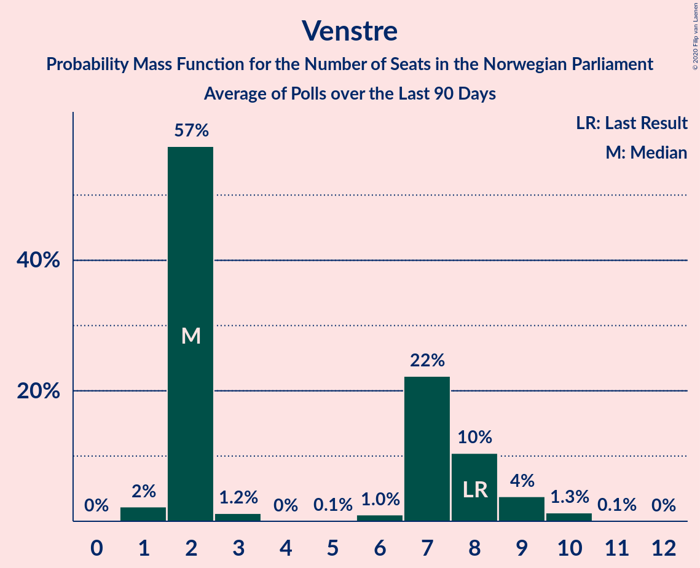

# Venstre

<a href="#voting-intentions">Voting Intentions</a> | <a href="#seats">Seats</a>

## Voting Intentions

Last result: **4.6%** (General Election of 13 September 2021)

### Confidence Intervals

| Period     | Polling firm/Commissioner(s) | Median | 80% Confidence Interval | 90% Confidence Interval | 95% Confidence Interval | 99% Confidence Interval |
|:----------:|:----------------:|:-----------:|:-----------------------:|:-----------------------:|:-----------------------:|:-----------------------:|
| N/A | [Poll Average](average.html) | 4.7% | 3.3–6.0% | 3.0–6.3% | 2.8–6.6% | 2.4–7.2% |
| [5–6 August 2025](2025-08-06-Norfakta.html) | Norfakta   Klassekampen and Nationen | 5.6% | 4.7–6.6% | 4.5–6.9% | 4.3–7.1% | 3.9–7.7% |
| [28 July–3 August 2025](2025-08-03-OpinionPerduco.html) | Opinion Perduco   ABC Nyheter and Altinget | 3.3% | 2.7–4.1% | 2.5–4.4% | 2.4–4.6% | 2.1–5.0% |
| [1–2 July 2025](2025-07-02-Norfakta.html) | Norfakta   Klassekampen and Nationen | 5.0% | 4.2–6.2% | 3.9–6.5% | 3.7–6.8% | 3.3–7.4% |
| [1 July 2025](2025-07-01-InFact.html) | InFact   Nettavisen | 4.4% | 3.7–5.3% | 3.5–5.5% | 3.3–5.8% | 3.0–6.2% |
| [24–30 June 2025](2025-06-30-Verian.html) | Verian   TV2 | 4.8% | 4.0–5.8% | 3.8–6.0% | 3.6–6.3% | 3.3–6.8% |
| [11–18 June 2025](2025-06-18-ResponsAnalyse.html) | Respons Analyse   Aftenposten, Bergens Tidende and VG | 4.8% | 3.9–5.9% | 3.7–6.3% | 3.5–6.6% | 3.1–7.1% |
| [10–16 June 2025](2025-06-16-OpinionPerduco.html) | Opinion Perduco   Avisenes Nyhetsbyrå, Dagsavisen and FriFagbevegelse | 5.1% | 4.2–6.4% | 4.0–6.7% | 3.7–7.0% | 3.4–7.6% |
| [10–14 June 2025](2025-06-14-Norstat.html) | Norstat   Dagbladet, NRK and Vårt Land | 4.2% | 3.5–5.1% | 3.3–5.4% | 3.1–5.6% | 2.8–6.1% |
| [3–4 June 2025](2025-06-04-Norfakta.html) | Norfakta   Klassekampen and Nationen | 4.6% | 3.7–5.7% | 3.5–6.0% | 3.3–6.2% | 3.0–6.8% |
| [3 June 2025](2025-06-03-InFact.html) | InFact   Nettavisen | 4.6% | 3.8–5.5% | 3.6–5.7% | 3.5–6.0% | 3.1–6.4% |
| [26–31 May 2025](2025-05-31-OpinionPerduco.html) | Opinion Perduco   ABC Nyheter and Altinget | 5.2% | 4.3–6.4% | 4.1–6.8% | 3.9–7.0% | 3.5–7.7% |
| [26–30 May 2025](2025-05-30-Verian.html) | Verian   TV2 | 2.7% | 2.2–3.6% | 2.0–3.8% | 1.9–4.0% | 1.7–4.4% |
| [12–19 May 2025](2025-05-19-OpinionPerduco.html) | Opinion Perduco   Avisenes Nyhetsbyrå, Dagsavisen and FriFagbevegelse | 4.2% | 3.5–5.1% | 3.3–5.4% | 3.1–5.6% | 2.8–6.1% |
| [29 April–16 May 2025](2025-05-16-Norstat.html) | Norstat   NRK | 4.0% | 3.8–4.2% | 3.7–4.3% | 3.7–4.3% | 3.6–4.4% |
| [7–12 May 2025](2025-05-12-ResponsAnalyse.html) | Respons Analyse   Aftenposten, Bergens Tidende and VG | 4.8% | 4.0–5.8% | 3.8–6.1% | 3.6–6.3% | 3.3–6.8% |
| [6–7 May 2025](2025-05-07-Norfakta.html) | Norfakta   Klassekampen and Nationen | 4.2% | 3.4–5.3% | 3.2–5.6% | 3.0–5.9% | 2.7–6.4% |
| [6 May 2025](2025-05-06-InFact.html) | InFact   Nettavisen | 3.0% | 2.4–3.8% | 2.3–4.0% | 2.1–4.2% | 1.9–4.6% |
| [28 April–5 May 2025](2025-05-05-OpinionPerduco.html) | Opinion Perduco   ABC Nyheter and Altinget | 4.5% | 3.7–5.7% | 3.5–6.0% | 3.3–6.3% | 2.9–6.8% |
| [29 April–5 May 2025](2025-05-05-Norstat.html) | Norstat   Dagbladet, NRK and Vårt Land | 4.0% | 3.3–4.9% | 3.1–5.2% | 3.0–5.4% | 2.7–5.9% |
| [28 March–2 May 2025](2025-05-02-Verian.html) | Verian   TV2 | 4.2% | 3.5–5.2% | 3.3–5.5% | 3.2–5.7% | 2.8–6.2% |
| [14–21 April 2025](2025-04-21-OpinionPerduco.html) | Opinion Perduco   Avisenes Nyhetsbyrå, Dagsavisen and FriFagbevegelse | 3.5% | 2.9–4.4% | 2.7–4.6% | 2.5–4.8% | 2.2–5.3% |
| [2–7 April 2025](2025-04-07-ResponsAnalyse.html) | Respons Analyse   Bergens Tidende and VG | 3.9% | 3.2–4.8% | 3.0–5.1% | 2.9–5.3% | 2.6–5.8% |
| [31 March–7 April 2025](2025-04-07-Norstat.html) | Norstat   Dagbladet, NRK and Vårt Land | 3.8% | 3.1–4.7% | 3.0–5.0% | 2.8–5.2% | 2.5–5.7% |
| [1–2 April 2025](2025-04-02-Norfakta.html) | Norfakta   Klassekampen and Nationen | 5.3% | 4.4–6.5% | 4.2–6.8% | 3.9–7.1% | 3.6–7.7% |
| [1 April 2025](2025-04-01-InFact.html) | InFact   Nettavisen | 3.1% | 2.5–3.8% | 2.3–4.1% | 2.2–4.3% | 1.9–4.7% |
| [25–31 March 2025](2025-03-31-Verian.html) | Verian   TV2 | 4.1% | 3.4–5.0% | 3.2–5.2% | 3.0–5.5% | 2.7–6.0% |
| [24–31 March 2025](2025-03-31-OpinionPerduco.html) | Opinion Perduco   ABC Nyheter and Altinget | 3.8% | 3.1–4.9% | 2.9–5.2% | 2.7–5.4% | 2.3–6.0% |
| [10–12 March 2025](2025-03-12-OpinionPerduco.html) | Opinion Perduco   Avisenes Nyhetsbyrå, Dagsavisen and FriFagbevegelse | 4.6% | 3.7–5.7% | 3.5–6.0% | 3.3–6.2% | 3.0–6.8% |
| [5–10 March 2025](2025-03-10-ResponsAnalyse.html) | Respons Analyse   Aftenposten, Bergens Tidende and VG | 5.4% | 4.6–6.4% | 4.3–6.7% | 4.2–7.0% | 3.8–7.5% |
| [4–8 March 2025](2025-03-08-Norstat.html) | Norstat   Dagbladet, NRK and Vårt Land | 4.4% | 3.6–5.3% | 3.4–5.6% | 3.3–5.9% | 2.9–6.3% |
| [4–5 March 2025](2025-03-05-Norfakta.html) | Norfakta   Klassekampen and Nationen | 4.1% | 3.3–5.1% | 3.1–5.4% | 2.9–5.7% | 2.6–6.2% |
| [4 March 2025](2025-03-04-InFact.html) | InFact   Nettavisen | 4.3% | 3.6–5.2% | 3.4–5.5% | 3.3–5.7% | 3.0–6.2% |
| [24 February–3 March 2025](2025-03-03-OpinionPerduco.html) | Opinion Perduco   ABC Nyheter and Altinget | 3.2% | 2.5–4.2% | 2.4–4.5% | 2.2–4.7% | 1.9–5.3% |
| [24–28 February 2025](2025-02-28-Verian.html) | Verian   TV2 | 4.1% | 3.4–5.0% | 3.2–5.3% | 3.0–5.5% | 2.7–6.0% |
| [10–16 February 2025](2025-02-16-OpinionPerduco.html) | Opinion Perduco   Avisens Nyhetsbyrå, Dagsavisen and FriFagbevegelse | 3.9% | 3.1–5.1% | 2.9–5.4% | 2.7–5.7% | 2.3–6.3% |
| [4–8 February 2025](2025-02-08-Norstat.html) | Norstat   Dagbladet, NRK and Vårt Land | 3.1% | 2.4–4.1% | 2.2–4.4% | 2.1–4.6% | 1.8–5.1% |
| [4–6 February 2025](2025-02-06-ResponsAnalyse.html) | Respons Analyse   Aftenposten, Bergens Tidende and VG | 4.9% | 4.1–5.9% | 3.9–6.2% | 3.7–6.4% | 3.4–6.9% |
| [4–5 February 2025](2025-02-05-Norfakta.html) | Norfakta   Klassekampen and Nationen | 4.5% | 3.7–5.7% | 3.5–6.0% | 3.3–6.2% | 2.9–6.8% |
| [5 February 2025](2025-02-05-InFact.html) | InFact   Nettavisen | 3.4% | 2.8–4.2% | 2.6–4.5% | 2.5–4.7% | 2.2–5.1% |
| [4 February 2025](2025-02-04-Verian.html) | Verian   TV2 | 3.2% | N/A | N/A | N/A | N/A |
| [30 January–3 February 2025](2025-02-03-ResponsAnalyse.html) | Respons Analyse   Aftenposten, Bergens Tidende and VG | 6.5% | 5.6–7.6% | 5.3–7.9% | 5.1–8.2% | 4.7–8.8% |
| [27 January–3 February 2025](2025-02-03-OpinionPerduco.html) | Opinion Perduco   ABC Nyheter and Altinget | 4.2% | N/A | N/A | N/A | N/A |
| [27–31 January 2025](2025-01-31-Verian.html) | Verian   TV2 | 4.2% | 3.6–5.0% | 3.4–5.2% | 3.3–5.4% | 3.0–5.8% |
| [30 January 2025](2025-01-30-InFact.html) | InFact   Nettavisen | 4.7% | 4.0–5.6% | 3.8–5.9% | 3.6–6.1% | 3.3–6.5% |
| [13–20 January 2025](2025-01-20-OpinionPerduco.html) | Opinion Perduco   Avisens Nyhetsbyrå, Dagsavisen and FriFagbevegelse | 2.9% | 2.2–3.8% | 2.0–4.1% | 1.9–4.3% | 1.6–4.8% |
| [8–13 January 2025](2025-01-13-ResponsAnalyse.html) | Respons Analyse   Aftenposten, Bergens Tidende and VG | 5.9% | 5.0–7.0% | 4.8–7.3% | 4.6–7.5% | 4.2–8.1% |
| [8–13 January 2025](2025-01-13-Norstat.html) | Norstat   NRK | 5.8% | 5.0–6.9% | 4.8–7.2% | 4.5–7.5% | 4.2–8.0% |
| [6–10 January 2025](2025-01-10-Verian.html) | Verian   TV2 | 3.4% | 2.8–4.3% | 2.6–4.5% | 2.5–4.8% | 2.2–5.2% |
| [7–8 January 2025](2025-01-08-Norfakta.html) | Norfakta   Klassekampen and Nationen | 4.3% | 3.6–5.2% | 3.4–5.5% | 3.2–5.7% | 2.9–6.2% |
| [2–6 January 2025](2025-01-06-OpinionPerduco.html) | Opinion Perduco   ABC Nyheter and Altinget | 4.7% | 3.9–5.7% | 3.7–5.9% | 3.5–6.2% | 3.2–6.7% |
| [6 January 2025](2025-01-06-InFact.html) | InFact   Nettavisen | 4.5% | 3.8–5.4% | 3.6–5.6% | 3.4–5.8% | 3.1–6.3% |
| [10–14 December 2024](2024-12-14-Norstat.html) | Norstat   Aftenposten and NRK | 4.8% | 4.0–5.8% | 3.8–6.1% | 3.6–6.3% | 3.3–6.8% |
| [4–9 December 2024](2024-12-09-ResponsAnalyse.html) | Respons Analyse   VG | 6.1% | 5.2–7.2% | 5.0–7.5% | 4.8–7.8% | 4.4–8.3% |
| [3–9 December 2024](2024-12-09-OpinionPerduco.html) | Opinion Perduco   Avisens Nyhetsbyrå, Dagsavisen and FriFagbevegelse | 5.8% | 5.0–6.9% | 4.7–7.2% | 4.5–7.4% | 4.1–8.0% |
| [2–9 December 2024](2024-12-09-Norstat.html) | Norstat   Dagbladet and Vårt Land | 4.7% | 3.9–5.7% | 3.7–6.0% | 3.6–6.2% | 3.2–6.7% |
| [3–4 December 2024](2024-12-04-Norfakta.html) | Norfakta   Klassekampen and Nationen | 4.6% | 3.8–5.7% | 3.6–6.0% | 3.4–6.3% | 3.0–6.9% |
| [3 December 2024](2024-12-03-InFact.html) | InFact   Nettavisen | 4.6% | 3.9–5.6% | 3.7–5.8% | 3.5–6.1% | 3.2–6.5% |
| [2 December 2024](2024-12-02-OpinionPerduco.html) | Opinion Perduco   ABC Nyheter and Altinget | 5.9% | 4.9–7.1% | 4.6–7.5% | 4.4–7.8% | 4.0–8.4% |
| [25–29 November 2024](2024-11-29-Verian.html) | Verian   TV2 | 6.1% | 5.3–7.2% | 5.0–7.5% | 4.8–7.8% | 4.4–8.4% |
| [12–16 November 2024](2024-11-16-Norstat.html) | Norstat   Aftenposten and NRK | 4.4% | 3.7–5.3% | 3.5–5.6% | 3.3–5.9% | 3.0–6.4% |
| [6–11 November 2024](2024-11-11-ResponsAnalyse.html) | Respons Analyse   VG | 6.3% | 5.4–7.4% | 5.2–7.7% | 4.9–8.0% | 4.5–8.5% |
| [5–11 November 2024](2024-11-11-OpinionPerduco.html) | Opinion Perduco   Avisens Nyhetsbyrå, Dagsavisen and FriFagbevegelse | 5.6% | 4.7–6.9% | 4.4–7.3% | 4.2–7.6% | 3.7–8.2% |
| [5–6 November 2024](2024-11-06-Norfakta.html) | Norfakta   Klassekampen and Nationen | 4.4% | 3.6–5.5% | 3.3–5.8% | 3.1–6.0% | 2.8–6.6% |
| [4 November 2024](2024-11-04-OpinionPerduco.html) | Opinion Perduco   ABC Nyheter and Altinget | 3.8% | 3.0–4.9% | 2.8–5.2% | 2.6–5.5% | 2.3–6.1% |
| [4 November 2024](2024-11-04-InFact.html) | InFact   Nettavisen | 5.1% | 4.3–6.0% | 4.1–6.3% | 3.9–6.5% | 3.6–7.0% |
| [1 November 2024](2024-11-01-Verian.html) | Verian   TV2 | 6.1% | 5.2–7.2% | 5.0–7.5% | 4.8–7.8% | 4.4–8.3% |
| [15–19 October 2024](2024-10-19-Norstat.html) | Norstat   Aftenposten and NRK | 5.9% | 5.1–7.0% | 4.8–7.3% | 4.6–7.6% | 4.3–8.2% |
| [10–14 October 2024](2024-10-14-ResponsAnalyse.html) | Respons Analyse   VG | 6.3% | 5.4–7.4% | 5.2–7.7% | 5.0–8.0% | 4.6–8.6% |
| [1–7 October 2024](2024-10-07-OpinionPerduco.html) | Opinion Perduco   Avisens Nyhetsbyrå, Dagsavisen and FriFagbevegelse | 5.5% | 4.5–6.8% | 4.3–7.1% | 4.0–7.4% | 3.6–8.1% |
| [4 October 2024](2024-10-04-Verian.html) | Verian   TV2 | 4.6% | 3.9–5.6% | 3.6–5.9% | 3.5–6.1% | 3.1–6.6% |
| [3 October 2024](2024-10-03-InFact.html) | InFact   Nettavisen | 5.0% | 4.3–6.0% | 4.1–6.3% | 3.9–6.5% | 3.5–7.0% |
| [1–2 October 2024](2024-10-02-Norfakta.html) | Norfakta   Klassekampen and Nationen | 5.4% | 4.6–6.4% | 4.3–6.7% | 4.2–7.0% | 3.8–7.5% |
| [23–30 September 2024](2024-09-30-OpinionPerduco.html) | Opinion Perduco   ABC Nyheter and Altinget | 6.0% | 5.0–7.3% | 4.7–7.7% | 4.5–8.0% | 4.0–8.7% |
| [17–21 September 2024](2024-09-21-Norstat.html) | Norstat   Aftenposten and NRK | 4.8% | 4.1–5.8% | 3.8–6.1% | 3.7–6.4% | 3.3–6.9% |
| [4–9 September 2024](2024-09-09-ResponsAnalyse.html) | Respons Analyse   VG | 5.0% | 4.2–6.0% | 4.0–6.3% | 3.8–6.5% | 3.5–7.1% |
| [3–9 September 2024](2024-09-09-OpinionPerduco.html) | Opinion Perduco   Dagsavisen, Fagbladet and FriFagbevegelse | 5.5% | 4.6–6.8% | 4.3–7.1% | 4.1–7.4% | 3.7–8.1% |
| [3–4 September 2024](2024-09-04-Norfakta.html) | Norfakta   Klassekampen and Nationen | 4.7% | 3.9–5.9% | 3.6–6.2% | 3.4–6.5% | 3.1–7.1% |
| [3–4 September 2024](2024-09-04-InFact.html) | InFact   Nettavisen | 4.2% | 3.5–5.1% | 3.3–5.3% | 3.2–5.5% | 2.9–5.9% |
| [2 September 2024](2024-09-02-OpinionPerduco.html) | Opinion Perduco   ABC Nyheter and Altinget | 5.5% | 4.6–6.8% | 4.3–7.1% | 4.1–7.4% | 3.7–8.1% |
| [26–30 August 2024](2024-08-30-Verian.html) | Verian   TV2 | 5.4% | 4.6–6.4% | 4.3–6.7% | 4.2–7.0% | 3.8–7.5% |
| [7–12 August 2024](2024-08-12-ResponsAnalyse.html) | Respons Analyse   VG | 5.3% | 4.5–6.3% | 4.3–6.6% | 4.1–6.9% | 3.7–7.4% |
| [6–12 August 2024](2024-08-12-OpinionPerduco.html) | Opinion Perduco   Dagsavisen, Fagbladet and FriFagbevegelse | 4.1% | 3.3–5.3% | 3.1–5.6% | 2.9–5.9% | 2.5–6.5% |
| [5–10 August 2024](2024-08-10-Norstat.html) | Norstat   Aftenposten and NRK | 5.7% | 4.1–5.9% | 3.9–6.1% | 3.7–6.4% | 3.3–6.9% |
| [5–9 August 2024](2024-08-09-Verian.html) | Verian   TV2 | 5.0% | 4.2–6.0% | 4.0–6.3% | 3.8–6.5% | 3.5–7.1% |
| [8 August 2024](2024-08-08-InFact.html) | InFact   Nettavisen | 4.6% | 3.9–5.5% | 3.7–5.8% | 3.5–6.0% | 3.2–6.5% |
| [7 August 2024](2024-08-07-OpinionPerduco.html) | Opinion Perduco   ABC Nyheter and Altinget | 6.8% | 5.8–8.2% | 5.5–8.5% | 5.3–8.9% | 4.8–9.5% |
| [6–7 August 2024](2024-08-07-Norfakta.html) | Norfakta   Klassekampen and Nationen | 4.8% | 3.9–5.9% | 3.7–6.3% | 3.5–6.6% | 3.1–7.1% |
| [30 July–1 August 2024](2024-08-01-OpinionPerduco.html) | Opinion Perduco   ABC Nyheter and Altinget | 6.8% | 5.8–8.2% | 5.5–8.5% | 5.3–8.9% | 4.8–9.5% |
| [2–4 July 2024](2024-07-04-Norfakta.html) | Norfakta   Klassekampen and Nationen | 4.9% | 4.1–6.1% | 3.8–6.4% | 3.6–6.7% | 3.2–7.3% |
| [4 July 2024](2024-07-04-InFact.html) | InFact   Nettavisen | 5.9% | 5.1–7.0% | 4.8–7.3% | 4.6–7.5% | 4.3–8.0% |
| [24–28 June 2024](2024-06-28-Verian.html) | Verian   TV2 | 5.9% | 5.0–7.0% | 4.8–7.3% | 4.6–7.6% | 4.2–8.1% |
| [11–15 June 2024](2024-06-15-Norstat.html) | Norstat   Aftenposten and NRK | 6.5% | 5.6–7.7% | 5.4–8.0% | 5.2–8.3% | 4.8–8.8% |
| [5–10 June 2024](2024-06-10-ResponsAnalyse.html) | Respons Analyse   VG | 5.9% | 4.9–7.2% | 4.6–7.5% | 4.4–7.8% | 4.0–8.5% |
| [4–10 June 2024](2024-06-10-OpinionPerduco.html) | Opinion Perduco   Dagsavisen, Fagbladet and FriFagbevegelse | 6.5% | 5.5–7.8% | 5.2–8.2% | 5.0–8.5% | 4.5–9.2% |
| [4–5 June 2024](2024-06-05-Norfakta.html) | Norfakta   Klassekampen and Nationen | 5.9% | 4.9–7.1% | 4.6–7.4% | 4.4–7.7% | 4.0–8.3% |
| [4 June 2024](2024-06-04-InFact.html) | InFact   Nettavisen | 5.8% | 5.0–6.9% | 4.8–7.1% | 4.6–7.4% | 4.2–7.9% |
| [27–31 May 2024](2024-05-31-Verian.html) | Verian   TV2 | 4.8% | 4.0–5.8% | 3.8–6.1% | 3.6–6.3% | 3.3–6.8% |
| [21–25 May 2024](2024-05-25-Norstat.html) | Norstat   Dagbladet and Vårt Land | 6.4% | 5.3–7.9% | 5.0–8.3% | 4.7–8.7% | 4.2–9.4% |
| [14–21 May 2024](2024-05-21-Norstat.html) | Norstat   Aftenposten and NRK | 6.5% | 5.5–7.6% | 5.3–7.9% | 5.1–8.2% | 4.7–8.7% |
| [7–8 May 2024](2024-05-08-Norfakta.html) | Norfakta   Klassekampen and Nationen | 6.7% | 5.6–7.9% | 5.3–8.3% | 5.1–8.6% | 4.7–9.3% |
| [2–7 May 2024](2024-05-07-ResponsAnalyse.html) | Respons Analyse   VG | 5.3% | 4.5–6.3% | 4.3–6.6% | 4.1–6.9% | 3.7–7.4% |
| [6 May 2024](2024-05-06-Verian.html) | Verian   TV2 | 6.8% | 5.9–7.9% | 5.6–8.2% | 5.4–8.5% | 5.0–9.0% |
| [6 May 2024](2024-05-06-OpinionPerduco.html) | Opinion Perduco   Dagsavisen, Fagbladet and FriFagbevegelse | 5.8% | 5.0–6.9% | 4.7–7.2% | 4.5–7.4% | 4.1–8.0% |
| [2 May 2024](2024-05-02-InFact.html) | InFact   Nettavisen | 4.4% | 3.7–5.3% | 3.5–5.6% | 3.3–5.8% | 3.0–6.3% |
| [23–29 April 2024](2024-04-29-OpinionPerduco.html) | Opinion Perduco   ABC Nyheter and Altinget | 5.5% | 4.6–6.8% | 4.3–7.1% | 4.1–7.4% | 3.7–8.1% |
| [9–15 April 2024](2024-04-15-OpinionPerduco.html) | Opinion Perduco   Dagsavisen, Fagbladet and FriFagbevegelse | 7.3% | 6.2–8.7% | 5.9–9.1% | 5.7–9.5% | 5.2–10.2% |
| [3–8 April 2024](2024-04-08-ResponsAnalyse.html) | Respons Analyse   VG | 5.5% | 4.7–6.5% | 4.4–6.8% | 4.2–7.1% | 3.9–7.6% |
| [2–8 April 2024](2024-04-08-Norfakta.html) | Norfakta   Klassekampen and Nationen | 5.2% | 4.4–6.2% | 4.2–6.5% | 4.0–6.8% | 3.6–7.3% |
| [2–6 April 2024](2024-04-06-Norstat.html) | Norstat   Aftenposten and NRK | 4.6% | 3.9–5.6% | 3.7–5.9% | 3.5–6.1% | 3.2–6.6% |
| [2–5 April 2024](2024-04-05-OpinionPerduco.html) | Opinion Perduco   ABC Nyheter and Altinget | 5.2% | 4.3–6.4% | 4.0–6.8% | 3.8–7.1% | 3.4–7.7% |
| [2–4 April 2024](2024-04-04-Verian.html) | Verian   TV2 | 5.2% | 4.4–6.2% | 4.2–6.5% | 4.0–6.8% | 3.6–7.3% |
| [4 April 2024](2024-04-04-InFact.html) | InFact   Nettavisen | 5.7% | 4.9–6.6% | 4.6–6.9% | 4.5–7.2% | 4.1–7.7% |
| [6–11 March 2024](2024-03-11-ResponsAnalyse.html) | Respons Analyse   VG | 5.8% | 5.0–6.9% | 4.7–7.2% | 4.5–7.4% | 4.1–8.0% |
| [5–9 March 2024](2024-03-09-Norstat.html) | Norstat   Aftenposten and NRK | 6.1% | 5.2–7.2% | 5.0–7.5% | 4.8–7.8% | 4.4–8.3% |
| [5–6 March 2024](2024-03-06-Norfakta.html) | Norfakta   Klassekampen and Nationen | 6.4% | 5.4–7.6% | 5.1–8.0% | 4.9–8.3% | 4.4–8.9% |
| [4 March 2024](2024-03-04-OpinionPerduco.html) | Opinion Perduco   ABC Nyheter and Altinget | 5.8% | 4.8–7.1% | 4.6–7.5% | 4.3–7.8% | 3.9–8.5% |
| [4 March 2024](2024-03-04-InFact.html) | InFact   Nettavisen | 5.7% | 4.8–6.7% | 4.6–7.0% | 4.4–7.2% | 4.1–7.7% |
| [26 February–1 March 2024](2024-03-01-Verian.html) | Verian   TV2 | 5.8% | 5.0–6.9% | 4.7–7.2% | 4.5–7.4% | 4.1–8.0% |
| [19–24 February 2024](2024-02-24-OpinionPerduco.html) | Opinion Perduco   Dagsavisen, Fagbladet and FriFagbevegelse | 5.5% | 4.6–6.5% | 4.4–6.8% | 4.2–7.1% | 3.9–7.6% |
| [19–24 February 2024](2024-02-24-Norstat.html) | Norstat   Vårt Land | 4.9% | 4.0–6.1% | 3.8–6.5% | 3.6–6.8% | 3.2–7.4% |
| [7–12 February 2024](2024-02-12-ResponsAnalyse.html) | Respons Analyse   VG | 5.8% | 4.9–6.9% | 4.7–7.2% | 4.5–7.4% | 4.1–8.0% |
| [6–12 February 2024](2024-02-12-OpinionPerduco.html) | Opinion Perduco   Dagsavisen, Fagbladet and FriFagbevegelse | 5.8% | 4.8–7.1% | 4.5–7.5% | 4.3–7.8% | 3.9–8.5% |
| [6–11 February 2024](2024-02-11-Norstat.html) | Norstat   Aftenposten and NRK | 6.6% | 5.7–7.7% | 5.4–8.0% | 5.2–8.3% | 4.8–8.9% |
| [6–7 February 2024](2024-02-07-Norfakta.html) | Norfakta   Klassekampen and Nationen | 5.7% | 4.9–6.8% | 4.7–7.1% | 4.5–7.4% | 4.1–7.9% |
| [29 January–5 February 2024](2024-02-05-OpinionPerduco.html) | Opinion Perduco   ABC Nyheter and Altinget | 5.9% | 4.9–7.2% | 4.6–7.6% | 4.4–7.9% | 4.0–8.6% |
| [27–4 February 2024](2024-02-04-OpinionPerduco.html) | Opinion Perduco   ABC Nyheter and Altinget | 5.8% | 4.8–7.1% | 4.6–7.5% | 4.3–7.8% | 3.9–8.5% |
| [29 January–3 February 2024](2024-02-03-Verian.html) | Verian   TV2 | 6.1% | 5.2–7.2% | 5.0–7.5% | 4.8–7.8% | 4.4–8.3% |
| [1 February 2024](2024-02-01-InFact.html) | InFact   Nettavisen | 5.9% | 5.0–6.9% | 4.8–7.2% | 4.6–7.5% | 4.2–8.0% |
| [10–13 January 2024](2024-01-13-Norstat.html) | Norstat   Aftenposten and NRK | 6.0% | 5.1–7.1% | 4.8–7.4% | 4.6–7.6% | 4.3–8.2% |
| [3–8 January 2024](2024-01-08-ResponsAnalyse.html) | Respons Analyse   VG | 5.9% | 5.0–7.0% | 4.8–7.3% | 4.6–7.5% | 4.2–8.1% |
| [2–8 January 2024](2024-01-08-OpinionPerduco.html) | Opinion Perduco   Dagsavisen, Fagbladet and FriFagbevegelse | 4.8% | 3.9–6.0% | 3.6–6.3% | 3.4–6.6% | 3.0–7.3% |
| [2–7 January 2024](2024-01-07-Verian.html) | Verian   TV2 | 7.2% | 6.2–8.4% | 6.0–8.7% | 5.7–9.0% | 5.3–9.6% |
| [3–4 January 2024](2024-01-04-Norfakta.html) | Norfakta   Klassekampen and Nationen | 5.9% | 5.0–7.1% | 4.7–7.5% | 4.5–7.8% | 4.1–8.4% |
| [3 January 2024](2024-01-03-InFact.html) | InFact   Nettavisen | 5.3% | 4.6–6.3% | 4.3–6.6% | 4.1–6.8% | 3.8–7.3% |
| [13 December 2023](2023-12-13-InFact.html) | InFact   Nettavisen | 6.0% | 5.2–7.0% | 5.0–7.3% | 4.8–7.6% | 4.4–8.1% |
| [6–11 December 2023](2023-12-11-ResponsAnalyse.html) | Respons Analyse   VG | 5.7% | 4.9–6.8% | 4.6–7.1% | 4.4–7.3% | 4.1–7.9% |
| [4–8 December 2023](2023-12-08-Norstat.html) | Norstat   Dagbladet and Vårt Land | 5.5% | 4.5–6.7% | 4.3–7.1% | 4.1–7.4% | 3.6–8.0% |
| [5–6 December 2023](2023-12-06-Norfakta.html) | Norfakta   Klassekampen and Nationen | 5.9% | 4.9–7.1% | 4.6–7.4% | 4.4–7.7% | 4.0–8.4% |
| [28 November–4 December 2023](2023-12-04-OpinionPerduco.html) | Opinion Perduco   Dagsavisen, Fagbladet and FriFagbevegelse | 6.1% | 5.1–7.4% | 4.8–7.8% | 4.6–8.1% | 4.1–8.8% |
| [27 November–2 December 2023](2023-12-02-Norstat.html) | Norstat   Aftenposten and NRK | 4.0% | 3.3–4.9% | 3.1–5.2% | 2.9–5.4% | 2.7–5.9% |
| [27 November–1 December 2023](2023-12-01-Verian.html) | Verian   TV2 | 4.7% | 3.9–5.6% | 3.7–5.9% | 3.5–6.2% | 3.2–6.7% |
| [21–25 November 2023](2023-11-25-OpinionPerduco.html) | Opinion Perduco   ABC Nyheter and Altinget | 7.2% | 6.1–8.5% | 5.8–8.9% | 5.5–9.3% | 5.0–10.0% |
| [8–13 November 2023](2023-11-13-ResponsAnalyse.html) | Respons Analyse   VG | 6.8% | 5.9–7.9% | 5.6–8.3% | 5.4–8.5% | 5.0–9.1% |
| [7–8 November 2023](2023-11-08-Norfakta.html) | Norfakta   Klassekampen and Nationen | 5.5% | 4.7–6.5% | 4.5–6.8% | 4.3–7.1% | 3.9–7.6% |
| [7 November 2023](2023-11-07-OpinionPerduco.html) | Opinion Perduco   Dagsavisen, Fagbladet and FriFagbevegelse | 6.6% | 5.7–7.7% | 5.4–8.0% | 5.2–8.3% | 4.8–8.9% |
| [3 November 2023](2023-11-03-Verian.html) | Verian   TV2 | 6.2% | 5.3–7.3% | 5.1–7.6% | 4.9–7.9% | 4.5–8.4% |
| [2 November 2023](2023-11-02-InFact.html) | InFact   Nettavisen | 5.0% | 4.2–6.0% | 4.0–6.3% | 3.8–6.5% | 3.5–7.0% |
| [24–30 October 2023](2023-10-30-OpinionPerduco.html) | Opinion Perduco   ABC Nyheter and Altinget | 5.8% | 4.8–7.0% | 4.5–7.4% | 4.3–7.7% | 3.9–8.3% |
| [23–30 October 2023](2023-10-30-Norstat.html) | Norstat   Aftenposten and NRK | 6.3% | 5.4–7.5% | 5.2–7.8% | 5.0–8.0% | 4.6–8.6% |
| [3–9 October 2023](2023-10-09-OpinionPerduco.html) | Opinion Perduco   Dagsavisen, Fagbladet and FriFagbevegelse | 5.2% | 4.4–6.2% | 4.2–6.5% | 4.0–6.8% | 3.6–7.3% |
| [3–4 October 2023](2023-10-04-Norfakta.html) | Norfakta   Klassekampen and Nationen | 5.6% | 4.7–6.8% | 4.4–7.1% | 4.2–7.4% | 3.8–8.0% |
| [2 October 2023](2023-10-02-Verian.html) | Verian   TV2 | 6.4% | 5.6–7.6% | 5.3–7.9% | 5.1–8.2% | 4.7–8.8% |
| [2 October 2023](2023-10-02-OpinionPerduco.html) | Opinion Perduco   ABC Nyheter and Altinget | 5.9% | 5.0–7.2% | 4.7–7.5% | 4.5–7.8% | 4.1–8.5% |
| [2 October 2023](2023-10-02-InFact.html) | InFact   Nettavisen | 5.3% | 4.5–6.3% | 4.3–6.5% | 4.1–6.8% | 3.7–7.3% |
| [21–27 September 2023](2023-09-27-Norstat.html) | Norstat   Aftenposten and NRK | 5.3% | 4.5–6.4% | 4.3–6.7% | 4.1–6.9% | 3.7–7.5% |
| [20–22 September 2023](2023-09-22-ResponsAnalyse.html) | Respons Analyse   VG | 7.2% | 6.2–8.4% | 6.0–8.7% | 5.7–9.0% | 5.3–9.6% |
| [4–7 September 2023](2023-09-07-ResponsAnalyse.html) | Respons Analyse   VG | 4.8% | 4.0–5.8% | 3.8–6.1% | 3.6–6.3% | 3.3–6.8% |
| [4–6 September 2023](2023-09-06-OpinionPerduco.html) | Opinion Perduco   Dagsavisen, Fagbladet and FriFagbevegelse | 5.1% | 4.2–6.3% | 3.9–6.6% | 3.7–6.9% | 3.3–7.5% |
| [5–6 September 2023](2023-09-06-Norfakta.html) | Norfakta   Klassekampen and Nationen | 6.1% | 5.2–7.4% | 4.9–7.7% | 4.7–8.0% | 4.3–8.6% |
| [5 September 2023](2023-09-05-Norstat.html) | Norstat   Aftenposten and NRK | 5.1% | 4.1–6.4% | 3.8–6.8% | 3.6–7.1% | 3.1–7.8% |
| [5 September 2023](2023-09-05-InFact.html) | InFact   Nettavisen | 5.0% | 4.3–6.0% | 4.0–6.3% | 3.9–6.5% | 3.5–7.0% |
| [29 August–1 September 2023](2023-09-01-Norstat.html) | Norstat   Dagbladet and Vårt Land | 5.4% | 4.5–6.7% | 4.2–7.0% | 4.0–7.4% | 3.6–8.0% |
| [24–30 August 2023](2023-08-30-OpinionPerduco.html) | Opinion Perduco   ABC Nyheter and Altinget | 4.6% | 3.9–5.6% | 3.6–5.9% | 3.5–6.1% | 3.1–6.6% |
| [23–28 August 2023](2023-08-28-Verian.html) | Verian   TV2 | 5.1% | 4.4–5.9% | 4.2–6.2% | 4.0–6.4% | 3.7–6.9% |
| [8–15 August 2023](2023-08-15-OpinionPerduco.html) | Opinion Perduco   Avisens Nyhetsbyrå, Dagsavisen and FriFagbevegelse | 4.6% | 3.8–5.6% | 3.6–5.8% | 3.5–6.1% | 3.1–6.6% |
| [9–14 August 2023](2023-08-14-ResponsAnalyse.html) | Respons Analyse   VG | 4.4% | 3.7–5.3% | 3.5–5.6% | 3.3–5.9% | 3.0–6.3% |
| [8–14 August 2023](2023-08-14-Norstat.html) | Norstat   Aftenposten and NRK | 4.6% | 3.7–5.7% | 3.5–6.1% | 3.2–6.4% | 2.9–7.0% |
| [1–7 August 2023](2023-08-07-OpinionPerduco.html) | Opinion Perduco   ABC Nyheter and Altinget | 3.1% | 2.4–4.1% | 2.2–4.4% | 2.0–4.7% | 1.7–5.2% |
| [31 July–4 August 2023](2023-08-04-KantarTNS.html) | Kantar TNS   TV2 | 5.2% | 4.4–6.2% | 4.1–6.5% | 3.9–6.8% | 3.6–7.3% |
| [3 August 2023](2023-08-03-InFact.html) | InFact   Nettavisen | 6.0% | 5.1–7.0% | 4.9–7.3% | 4.7–7.6% | 4.3–8.1% |
| [1–2 August 2023](2023-08-02-Norfakta.html) | Norfakta   Klassekampen and Nationen | 4.9% | 4.0–6.0% | 3.7–6.4% | 3.5–6.7% | 3.2–7.3% |
| [6 July 2023](2023-07-06-InFact.html) | InFact   Nettavisen | 3.8% | 3.1–4.7% | 2.9–5.0% | 2.8–5.2% | 2.5–5.6% |
| [4–5 July 2023](2023-07-05-Norfakta.html) | Norfakta   Klassekampen and Nationen | 5.7% | 4.8–7.0% | 4.5–7.3% | 4.3–7.6% | 3.8–8.2% |
| [12–17 June 2023](2023-06-17-Norstat.html) | Norstat   Dagbladet and Vårt Land | 4.7% | 3.9–5.6% | 3.7–5.9% | 3.5–6.2% | 3.2–6.7% |
| [7–12 June 2023](2023-06-12-ResponsAnalyse.html) | Respons Analyse   VG | 4.8% | 4.0–6.0% | 3.7–6.3% | 3.5–6.6% | 3.2–7.2% |
| [6–7 June 2023](2023-06-07-Norfakta.html) | Norfakta   Klassekampen and Nationen | 4.0% | 3.3–4.9% | 3.1–5.2% | 2.9–5.4% | 2.6–5.9% |
| [30 May–5 June 2023](2023-06-05-OpinionPerduco.html) | Opinion Perduco   Avisens Nyhetsbyrå, Dagsavisen and FriFagbevegelse | 4.6% | 3.7–5.8% | 3.4–6.1% | 3.2–6.4% | 2.9–7.0% |
| [5 June 2023](2023-06-05-InFact.html) | InFact   Nettavisen | 4.4% | 3.6–5.3% | 3.4–5.6% | 3.3–5.8% | 3.0–6.3% |
| [31 May–2 June 2023](2023-06-02-KantarTNS.html) | Kantar TNS   TV2 | 4.5% | 3.7–5.4% | 3.5–5.7% | 3.3–6.0% | 3.0–6.4% |
| [23–30 May 2023](2023-05-30-OpinionPerduco.html) | Opinion Perduco   ABC Nyheter and Altinget | 4.5% | 3.6–5.6% | 3.4–6.0% | 3.2–6.3% | 2.8–6.9% |
| [24–30 May 2023](2023-05-30-Norstat.html) | Norstat   Aftenposten and NRK | 4.6% | 3.7–5.8% | 3.4–6.1% | 3.2–6.4% | 2.9–7.0% |
| [15–19 May 2023](2023-05-19-Norstat.html) | Norstat   Vårt Land | 4.7% | 3.9–5.7% | 3.7–6.0% | 3.6–6.2% | 3.2–6.7% |
| [3–8 May 2023](2023-05-08-ResponsAnalyse.html) | Respons Analyse   VG | 4.7% | 3.9–5.7% | 3.7–6.0% | 3.6–6.2% | 3.2–6.7% |
| [2–8 May 2023](2023-05-08-OpinionPerduco.html) | Opinion Perduco   Avisens Nyhetsbyrå, Dagsavisen and FriFagbevegelse | 4.2% | 3.5–5.1% | 3.3–5.4% | 3.1–5.6% | 2.8–6.1% |
| [2–3 May 2023](2023-05-03-Norfakta.html) | Norfakta   Klassekampen and Nationen | 5.5% | 4.5–6.7% | 4.3–7.0% | 4.1–7.3% | 3.6–8.0% |
| [2 May 2023](2023-05-02-InFact.html) | InFact   Nettavisen | 3.7% | 3.0–4.6% | 2.8–4.8% | 2.7–5.0% | 2.4–5.5% |
| [24–30 April 2023](2023-04-30-KantarTNS.html) | Kantar TNS   TV2 | 4.7% | 4.1–5.5% | 3.9–5.7% | 3.8–5.9% | 3.5–6.3% |
| [25–29 April 2023](2023-04-29-OpinionPerduco.html) | Opinion Perduco   ABC Nyheter and Altinget | 4.7% | 3.9–5.7% | 3.7–6.0% | 3.6–6.2% | 3.2–6.7% |
| [24–29 April 2023](2023-04-29-Norstat.html) | Norstat   Aftenposten and NRK | 3.7% | 3.0–4.6% | 2.8–4.8% | 2.7–5.1% | 2.4–5.5% |
| [12–17 April 2023](2023-04-17-ResponsAnalyse.html) | Respons Analyse   VG | 4.6% | 3.9–5.6% | 3.6–5.9% | 3.5–6.1% | 3.1–6.6% |
| [12–15 April 2023](2023-04-15-Norstat.html) | Norstat   Dagbladet and Vårt Land | 5.3% | 4.5–6.4% | 4.3–6.7% | 4.1–6.9% | 3.7–7.5% |
| [11–12 April 2023](2023-04-12-Norfakta.html) | Norfakta   Klassekampen and Nationen | 4.9% | 4.1–5.9% | 3.9–6.2% | 3.7–6.4% | 3.4–6.9% |
| [11 April 2023](2023-04-11-InFact.html) | InFact   Nettavisen | 5.5% | 4.7–6.5% | 4.4–6.8% | 4.3–7.1% | 3.9–7.6% |
| [3–4 April 2023](2023-04-04-OpinionPerduco.html) | Opinion Perduco   Avisens Nyhetsbyrå, Dagsavisen and FriFagbevegelse | 4.6% | 3.7–5.8% | 3.4–6.1% | 3.2–6.4% | 2.9–7.0% |
| [27–31 March 2023](2023-03-31-KantarTNS.html) | Kantar TNS   TV2 | 4.3% | 3.6–5.3% | 3.4–5.5% | 3.2–5.8% | 2.9–6.3% |
| [22–29 March 2023](2023-03-29-Norstat.html) | Norstat   Aftenposten and NRK | 4.9% | 4.0–6.1% | 3.7–6.4% | 3.5–6.7% | 3.1–7.3% |
| [21–27 March 2023](2023-03-27-OpinionPerduco.html) | Opinion Perduco   ABC Nyheter and Altinget | 5.3% | 4.3–6.7% | 4.1–7.0% | 3.8–7.4% | 3.4–8.1% |
| [13–20 March 2023](2023-03-20-Norstat.html) | Norstat   Dagbladet and Vårt Land | 5.0% | 4.2–6.0% | 3.9–6.2% | 3.8–6.5% | 3.4–7.0% |
| [8–13 March 2023](2023-03-13-ResponsAnalyse.html) | Respons Analyse   VG | 5.5% | 4.7–6.5% | 4.4–6.8% | 4.3–7.1% | 3.9–7.6% |
| [7–8 March 2023](2023-03-08-Norfakta.html) | Norfakta   Klassekampen and Nationen | 3.6% | 2.9–4.7% | 2.7–5.0% | 2.5–5.3% | 2.2–5.8% |
| [28 February–6 March 2023](2023-03-06-OpinionPerduco.html) | Opinion Perduco   Avisens Nyhetsbyrå, Dagsavisen and FriFagbevegelse | 4.8% | 4.0–5.8% | 3.8–6.1% | 3.6–6.3% | 3.3–6.8% |
| [6 March 2023](2023-03-06-InFact.html) | InFact   Nettavisen | 4.9% | 4.1–5.9% | 3.9–6.2% | 3.7–6.4% | 3.4–6.9% |
| [27 February–3 March 2023](2023-03-03-KantarTNS.html) | Kantar TNS   TV2 | 4.7% | 4.0–5.7% | 3.8–6.0% | 3.6–6.2% | 3.2–6.8% |
| [23–28 February 2023](2023-02-28-Norstat.html) | Norstat   Aftenposten and NRK | 5.2% | 4.2–6.4% | 4.0–6.7% | 3.7–7.1% | 3.3–7.7% |
| [21–27 February 2023](2023-02-27-OpinionPerduco.html) | Opinion Perduco   ABC Nyheter and Altinget | 3.9% | 3.2–5.0% | 2.9–5.3% | 2.8–5.6% | 2.4–6.2% |
| [8–13 February 2023](2023-02-13-ResponsAnalyse.html) | Respons Analyse   VG | 4.8% | 4.0–5.8% | 3.8–6.1% | 3.6–6.3% | 3.3–6.8% |
| [7–8 February 2023](2023-02-08-Norfakta.html) | Norfakta   Klassekampen and Nationen | 4.2% | 3.4–5.4% | 3.2–5.7% | 3.0–6.0% | 2.7–6.5% |
| [6 February 2023](2023-02-06-OpinionPerduco.html) | Opinion Perduco   Avisens Nyhetsbyrå, Dagsavisen and FriFagbevegelse | 4.1% | 3.3–5.3% | 3.1–5.6% | 2.9–5.9% | 2.5–6.5% |
| [6 February 2023](2023-02-06-InFact.html) | InFact   Nettavisen | 3.1% | 2.5–3.9% | 2.3–4.1% | 2.2–4.4% | 2.0–4.8% |
| [5 February 2023](2023-02-05-KantarTNS.html) | Kantar TNS   TV2 | 4.6% | 3.8–5.6% | 3.6–5.9% | 3.5–6.1% | 3.1–6.6% |
| [25–31 January 2023](2023-01-31-Norstat.html) | Norstat   Aftenposten and NRK | 4.9% | 4.1–5.9% | 3.9–6.2% | 3.7–6.4% | 3.4–6.9% |
| [24–27 January 2023](2023-01-27-OpinionPerduco.html) | Opinion Perduco   ABC Nyheter and Altinget | 5.0% | 4.2–6.0% | 4.0–6.3% | 3.8–6.5% | 3.5–7.0% |
| [11 January 2023](2023-01-11-InFact.html) | InFact   Nettavisen | 3.9% | 3.2–4.8% | 3.1–5.1% | 2.9–5.3% | 2.6–5.7% |
| [4–9 January 2023](2023-01-09-ResponsAnalyse.html) | Respons Analyse   VG | 4.8% | 4.0–5.8% | 3.8–6.1% | 3.6–6.3% | 3.3–6.8% |
| [3–9 January 2023](2023-01-09-OpinionPerduco.html) | Opinion Perduco   Avisens Nyhetsbyrå, Dagsavisen and FriFagbevegelse | 3.4% | 2.8–4.3% | 2.6–4.5% | 2.4–4.7% | 2.2–5.2% |
| [3–6 January 2023](2023-01-06-KantarTNS.html) | Kantar TNS   TV2 | 4.5% | 3.8–5.5% | 3.6–5.8% | 3.4–6.0% | 3.1–6.5% |
| [3–4 January 2023](2023-01-04-OpinionPerduco.html) | Opinion Perduco   ABC Nyheter | 4.0% | 3.3–5.0% | 3.1–5.2% | 3.0–5.5% | 2.7–6.0% |
| [3–4 January 2023](2023-01-04-Norfakta.html) | Norfakta   Klassekampen and Nationen | 4.0% | 3.3–4.9% | 3.1–5.2% | 2.9–5.4% | 2.6–5.9% |
| [27 December 2022–2 January 2023](2023-01-02-Norstat.html) | Norstat   Aftenposten and NRK | 5.1% | 4.3–6.2% | 4.1–6.5% | 3.9–6.7% | 3.5–7.3% |
| [13–17 December 2022](2022-12-17-Norstat.html) | Norstat   Vårt Land | 4.2% | 3.5–5.2% | 3.3–5.5% | 3.1–5.7% | 2.8–6.2% |
| [12–14 December 2022](2022-12-14-Ipsos.html) | Ipsos   Dagbladet | 4.6% | 3.8–5.7% | 3.6–5.9% | 3.4–6.2% | 3.1–6.7% |
| [7–12 December 2022](2022-12-12-ResponsAnalyse.html) | Respons Analyse   VG | 3.6% | 2.9–4.5% | 2.8–4.7% | 2.6–5.0% | 2.3–5.4% |
| [6–10 December 2022](2022-12-10-Sentio.html) | Sentio   Amedia and Nettavisen | 4.6% | 3.9–5.6% | 3.6–5.9% | 3.5–6.1% | 3.1–6.6% |
| [6–7 December 2022](2022-12-07-Norfakta.html) | Norfakta   Klassekampen and Nationen | 4.5% | 3.7–5.4% | 3.5–5.7% | 3.4–5.9% | 3.0–6.4% |
| [29 November–5 December 2022](2022-12-05-OpinionPerduco.html) | Opinion Perduco   Avisens Nyhetsbyrå, Dagsavisen and FriFagbevegelse | 5.8% | 4.9–6.9% | 4.7–7.2% | 4.5–7.5% | 4.1–8.0% |
| [28 November–2 December 2022](2022-12-02-KantarTNS.html) | Kantar TNS   TV2 | 5.6% | 4.7–6.6% | 4.5–7.0% | 4.3–7.2% | 3.9–7.8% |
| [22–27 November 2022](2022-11-27-Norstat.html) | Norstat   Aftenposten and NRK | 4.6% | 3.8–5.6% | 3.6–5.9% | 3.4–6.1% | 3.1–6.7% |
| [22–24 November 2022](2022-11-24-OpinionPerduco.html) | Opinion Perduco   ABC Nyheter and Altinget | 3.5% | 2.7–4.6% | 2.5–4.9% | 2.3–5.2% | 2.0–5.8% |
| [21–23 November 2022](2022-11-23-Ipsos.html) | Ipsos   Dagbladet | 6.0% | 5.1–7.1% | 4.9–7.5% | 4.7–7.7% | 4.3–8.3% |
| [15–19 November 2022](2022-11-19-Norstat.html) | Norstat   Vårt Land | 4.9% | 4.1–5.9% | 3.9–6.2% | 3.7–6.5% | 3.4–7.0% |
| [8–14 November 2022](2022-11-14-Sentio.html) | Sentio   Amedia and Nettavisen | 4.4% | 3.7–5.3% | 3.5–5.6% | 3.3–5.9% | 3.0–6.4% |
| [5–10 November 2022](2022-11-10-ResponsAnalyse.html) | Respons Analyse   VG | 5.0% | 4.2–6.0% | 4.0–6.3% | 3.8–6.5% | 3.5–7.1% |
| [1–7 November 2022](2022-11-07-OpinionPerduco.html) | Opinion Perduco   Avisens Nyhetsbyrå, Dagsavisen and FriFagbevegelse | 3.0% | 2.3–4.1% | 2.1–4.4% | 2.0–4.6% | 1.7–5.2% |
| [1–4 November 2022](2022-11-04-Norfakta.html) | Norfakta   Klassekampen and Nationen | 5.3% | 4.5–6.4% | 4.3–6.7% | 4.1–6.9% | 3.7–7.4% |
| [24–31 October 2022](2022-10-31-KantarTNS.html) | Kantar TNS   TV2 | 4.6% | 3.9–5.5% | 3.7–5.7% | 3.5–5.9% | 3.2–6.4% |
| [25–30 October 2022](2022-10-30-Norstat.html) | Norstat   Aftenposten and NRK | 3.4% | 2.7–4.3% | 2.6–4.5% | 2.4–4.8% | 2.1–5.2% |
| [24–26 October 2022](2022-10-26-Ipsos.html) | Ipsos   Dagbladet | 3.8% | 3.0–4.9% | 2.8–5.2% | 2.7–5.5% | 2.3–6.0% |
| [18–23 October 2022](2022-10-23-Norstat.html) | Norstat   Vårt Land | 5.4% | 4.5–6.4% | 4.3–6.7% | 4.1–7.0% | 3.7–7.5% |
| [21 October 2022](2022-10-21-InFact.html) | InFact   Fiskeribladet | 5.0% | 4.2–6.0% | 4.0–6.3% | 3.8–6.5% | 3.4–7.0% |
| [11–17 October 2022](2022-10-17-Sentio.html) | Sentio   Nettavisen | 4.0% | 3.3–4.9% | 3.1–5.2% | 2.9–5.4% | 2.7–5.9% |
| [11–12 October 2022](2022-10-12-Norfakta.html) | Norfakta   Klassekampen and Nationen | 5.0% | 4.2–6.0% | 4.0–6.3% | 3.8–6.5% | 3.5–7.1% |
| [5–10 October 2022](2022-10-10-ResponsAnalyse.html) | Respons Analyse   VG | 4.1% | 3.4–5.0% | 3.2–5.3% | 3.0–5.5% | 2.7–6.0% |
| [4–10 October 2022](2022-10-10-OpinionPerduco.html) | Opinion Perduco   Avisens Nyhetsbyrå, Dagsavisen and FriFagbevegelse | 3.4% | 2.8–4.3% | 2.6–4.5% | 2.4–4.8% | 2.2–5.2% |
| [27 September–2 October 2022](2022-10-02-Norstat.html) | Norstat   Aftenposten and NRK | 3.4% | 2.8–4.3% | 2.6–4.6% | 2.5–4.8% | 2.2–5.3% |
| [26–30 September 2022](2022-09-30-KantarTNS.html) | Kantar TNS   TV2 | 4.4% | 3.6–5.3% | 3.4–5.6% | 3.3–5.8% | 2.9–6.3% |
| [29 September 2022](2022-09-29-Ipsos.html) | Ipsos   Dagbladet | 4.1% | 3.3–5.2% | 3.1–5.5% | 2.9–5.8% | 2.5–6.4% |
| [20–25 September 2022](2022-09-25-Norstat.html) | Norstat   Vårt Land | 4.3% | 3.6–5.3% | 3.4–5.6% | 3.2–5.8% | 2.9–6.3% |
| [13–19 September 2022](2022-09-19-Sentio.html) | Sentio   Nettavisen | 5.0% | 4.2–6.0% | 4.0–6.3% | 3.8–6.5% | 3.5–7.0% |
| [7–12 September 2022](2022-09-12-ResponsAnalyse.html) | Respons Analyse   VG | 4.9% | 4.1–5.9% | 3.9–6.2% | 3.7–6.4% | 3.4–6.9% |
| [6–12 September 2022](2022-09-12-OpinionPerduco.html) | Opinion Perduco   Avisens Nyhetsbyrå, Dagsavisen and FriFagbevegelse | 4.5% | 3.8–5.5% | 3.6–5.8% | 3.4–6.1% | 3.1–6.6% |
| [5–7 September 2022](2022-09-07-Norfakta.html) | Norfakta   Klassekampen and Nationen | 4.6% | 3.8–5.5% | 3.6–5.8% | 3.4–6.1% | 3.1–6.6% |
| [30 August–4 September 2022](2022-09-04-Norstat.html) | Norstat   Aftenposten and NRK | 5.3% | 4.5–6.4% | 4.3–6.7% | 4.1–7.0% | 3.7–7.5% |
| [29 August–2 September 2022](2022-09-02-KantarTNS.html) | Kantar TNS   TV2 | 4.5% | 3.8–5.5% | 3.6–5.8% | 3.4–6.0% | 3.0–6.5% |
| [23–29 August 2022](2022-08-29-Norstat.html) | Norstat   Vårt Land | 4.1% | 3.4–5.1% | 3.2–5.4% | 3.0–5.6% | 2.7–6.1% |
| [26 August 2022](2022-08-26-Ipsos.html) | Ipsos   Dagbladet | 4.2% | 3.4–5.3% | 3.2–5.7% | 3.0–6.0% | 2.7–6.5% |
| [16–22 August 2022](2022-08-22-Sentio.html) | Sentio   Amedia and Nettavisen | 3.8% | 3.1–4.7% | 2.9–5.0% | 2.8–5.2% | 2.5–5.6% |
| [10–15 August 2022](2022-08-15-ResponsAnalyse.html) | Respons Analyse   VG | 4.1% | 3.4–5.0% | 3.2–5.3% | 3.0–5.5% | 2.7–6.0% |
| [9–14 August 2022](2022-08-14-Norstat.html) | Norstat   Aftenposten and NRK | 4.6% | 3.8–5.6% | 3.6–5.9% | 3.4–6.1% | 3.1–6.6% |
| [2–8 August 2022](2022-08-08-OpinionPerduco.html) | Opinion Perduco   Avisens Nyhetsbyrå, Dagsavisen and FriFagbevegelse | 5.0% | 4.1–6.2% | 3.8–6.6% | 3.6–6.9% | 3.2–7.6% |
| [1–5 August 2022](2022-08-05-KantarTNS.html) | Kantar TNS   TV2 | 4.9% | 4.0–6.1% | 3.7–6.4% | 3.6–6.7% | 3.2–7.3% |
| [2–3 August 2022](2022-08-03-Norfakta.html) | Norfakta   Klassekampen and Nationen | 3.7% | 2.9–4.7% | 2.7–5.0% | 2.5–5.2% | 2.2–5.7% |
| [5–6 July 2022](2022-07-06-Norfakta.html) | Norfakta   Klassekampen and Nationen | 4.0% | 3.3–4.9% | 3.1–5.2% | 2.9–5.4% | 2.6–5.9% |
| [24–30 June 2022](2022-06-30-KantarTNS.html) | Kantar TNS   TV2 | 4.4% | 3.6–5.5% | 3.4–5.8% | 3.2–6.1% | 2.8–6.7% |
| [27–29 June 2022](2022-06-29-Ipsos.html) | Ipsos   Dagbladet | 4.0% | 3.2–5.1% | 3.0–5.4% | 2.8–5.6% | 2.4–6.2% |
| [13–20 June 2022](2022-06-20-Norstat.html) | Norstat   Vårt Land | 3.5% | 2.8–4.4% | 2.6–4.6% | 2.5–4.8% | 2.2–5.3% |
| [7–13 June 2022](2022-06-13-Sentio.html) | Sentio   Amedia and Nettavisen | 4.6% | 3.9–5.6% | 3.6–5.9% | 3.5–6.1% | 3.1–6.6% |
| [4–9 June 2022](2022-06-09-ResponsAnalyse.html) | Respons Analyse   VG | 4.9% | 4.1–5.9% | 3.9–6.2% | 3.7–6.4% | 3.4–6.9% |
| [7–8 June 2022](2022-06-08-Norfakta.html) | Norfakta   Klassekampen and Nationen | 5.3% | 4.5–6.3% | 4.3–6.6% | 4.1–6.9% | 3.7–7.4% |
| [31 May–5 June 2022](2022-06-05-OpinionPerduco.html) | Opinion Perduco   Avisens Nyhetsbyrå, Dagsavisen and FriFagbevegelse | 4.1% | 3.4–5.1% | 3.2–5.4% | 3.0–5.6% | 2.7–6.1% |
| [30 May–3 June 2022](2022-06-03-KantarTNS.html) | Kantar TNS   TV2 | 5.1% | 4.3–6.1% | 4.1–6.4% | 3.9–6.7% | 3.5–7.2% |
| [24–30 May 2022](2022-05-30-Norstat.html) | Norstat   Aftenposten and NRK | 5.4% | 4.5–6.4% | 4.3–6.7% | 4.1–7.0% | 3.7–7.5% |
| [23–25 May 2022](2022-05-25-Ipsos.html) | Ipsos   Dagbladet | 6.1% | 5.1–7.4% | 4.9–7.8% | 4.6–8.1% | 4.2–8.8% |
| [16–23 May 2022](2022-05-23-Norstat.html) | Norstat   Vårt Land | 4.6% | 3.8–5.8% | 3.5–6.1% | 3.3–6.4% | 3.0–7.0% |
| [9–15 May 2022](2022-05-15-Sentio.html) | Sentio   Amedia and Nettavisen | 4.9% | 4.1–5.9% | 3.9–6.2% | 3.7–6.4% | 3.4–6.9% |
| [4–9 May 2022](2022-05-09-ResponsAnalyse.html) | Respons Analyse   VG | 4.4% | 3.7–5.3% | 3.5–5.6% | 3.3–5.9% | 3.0–6.4% |
| [3–9 May 2022](2022-05-09-OpinionPerduco.html) | Opinion Perduco   Avisens Nyhetsbyrå, Dagsavisen and FriFagbevegelse | 3.8% | 3.0–4.9% | 2.8–5.2% | 2.6–5.5% | 2.3–6.1% |
| [3–4 May 2022](2022-05-04-Norfakta.html) | Norfakta   Klassekampen and Nationen | 4.9% | 4.1–5.9% | 3.9–6.2% | 3.7–6.4% | 3.4–6.9% |
| [3 May 2022](2022-05-03-KantarTNS.html) | Kantar TNS   TV2 | 4.4% | 3.4–5.8% | 3.2–6.2% | 2.9–6.6% | 2.5–7.3% |
| [26 April–2 May 2022](2022-05-02-Norstat.html) | Norstat   Aftenposten and NRK | 5.0% | 4.1–6.2% | 3.8–6.5% | 3.6–6.8% | 3.2–7.4% |
| [25–27 April 2022](2022-04-27-Ipsos.html) | Ipsos   Dagbladet | 5.4% | 4.6–6.5% | 4.4–6.8% | 4.2–7.1% | 3.8–7.7% |
| [19–25 April 2022](2022-04-25-Norstat.html) | Norstat   Vårt Land | 4.3% | 3.6–5.3% | 3.4–5.5% | 3.2–5.8% | 2.9–6.3% |
| [5–10 April 2022](2022-04-10-Sentio.html) | Sentio   Amedia and Nettavisen | 5.7% | 4.9–6.8% | 4.6–7.1% | 4.4–7.3% | 4.1–7.9% |
| [4–6 April 2022](2022-04-06-ResponsAnalyse.html) | Respons Analyse   VG | 3.7% | 3.0–4.6% | 2.8–4.8% | 2.7–5.0% | 2.4–5.5% |
| [6 April 2022](2022-04-06-OpinionPerduco.html) | Opinion Perduco   Avisens Nyhetsbyrå, Dagsavisen and FriFagbevegelse | 5.7% | 4.6–7.0% | 4.3–7.4% | 4.1–7.7% | 3.7–8.4% |
| [5–6 April 2022](2022-04-06-Norfakta.html) | Norfakta   Klassekampen and Nationen | 4.4% | 3.6–5.5% | 3.4–5.8% | 3.2–6.1% | 2.9–6.7% |
| [28 March–1 April 2022](2022-04-01-KantarTNS.html) | Kantar TNS   TV2 | 4.3% | 3.6–5.2% | 3.4–5.5% | 3.2–5.7% | 2.9–6.2% |
| [22–28 March 2022](2022-03-28-Norstat.html) | Norstat   Aftenposten and NRK | 4.1% | 3.4–5.1% | 3.2–5.4% | 3.0–5.6% | 2.7–6.1% |
| [21–23 March 2022](2022-03-23-Ipsos.html) | Ipsos   Dagbladet | 4.3% | 3.5–5.4% | 3.3–5.8% | 3.1–6.0% | 2.7–6.6% |
| [15–20 March 2022](2022-03-20-Norstat.html) | Norstat   Vårt Land | 3.9% | 3.2–4.8% | 3.0–5.0% | 2.8–5.3% | 2.5–5.8% |
| [8–14 March 2022](2022-03-14-Sentio.html) | Sentio   Nettavisen | 4.9% | 4.1–6.1% | 3.8–6.4% | 3.6–6.7% | 3.2–7.3% |
| [8–14 March 2022](2022-03-14-ResponsAnalyse.html) | Respons Analyse   VG | 4.9% | 4.1–5.9% | 3.9–6.2% | 3.7–6.4% | 3.4–6.9% |
| [2–7 March 2022](2022-03-07-OpinionPerduco.html) | Opinion Perduco   Avisens Nyhetsbyrå, Dagsavisen and FriFagbevegelse | 4.3% | 3.5–5.5% | 3.2–5.8% | 3.0–6.1% | 2.7–6.7% |
| [1–2 March 2022](2022-03-02-Norfakta.html) | Norfakta   Klassekampen and Nationen | 5.1% | 4.2–6.2% | 4.0–6.6% | 3.8–6.8% | 3.4–7.4% |
| [22–28 February 2022](2022-02-28-Norstat.html) | Norstat   Aftenposten and NRK | 4.3% | 3.5–5.5% | 3.3–5.8% | 3.1–6.1% | 2.7–6.7% |
| [22–28 February 2022](2022-02-28-KantarTNS.html) | Kantar TNS   TV2 | 5.1% | 4.4–5.9% | 4.2–6.2% | 4.0–6.4% | 3.7–6.8% |
| [21–23 February 2022](2022-02-23-Ipsos.html) | Ipsos   Dagbladet | 4.6% | 3.8–5.8% | 3.5–6.1% | 3.3–6.4% | 3.0–7.0% |
| [15–20 February 2022](2022-02-20-Norstat.html) | Norstat   Vårt Land | 4.6% | 3.9–5.6% | 3.6–5.9% | 3.5–6.2% | 3.1–6.7% |
| [9–14 February 2022](2022-02-14-ResponsAnalyse.html) | Respons Analyse   VG | 3.5% | 2.9–4.4% | 2.7–4.6% | 2.5–4.8% | 2.2–5.3% |
| [8–12 February 2022](2022-02-12-Sentio.html) | Sentio   Amedia and Nettavisen | 4.9% | 4.1–5.9% | 3.9–6.2% | 3.7–6.4% | 3.4–6.9% |
| [1–7 February 2022](2022-02-07-OpinionPerduco.html) | Opinion Perduco   Avisens Nyhetsbyrå, Dagsavisen and FriFagbevegelse | 4.4% | 3.6–5.6% | 3.4–6.0% | 3.2–6.2% | 2.8–6.9% |
| [1–2 February 2022](2022-02-02-Norfakta.html) | Norfakta   Klassekampen and Nationen | 5.0% | 4.1–6.1% | 3.9–6.4% | 3.7–6.7% | 3.3–7.3% |
| [25–31 January 2022](2022-01-31-Norstat.html) | Norstat   Aftenposten and NRK | 3.8% | 3.1–4.7% | 2.9–5.0% | 2.7–5.2% | 2.4–5.7% |
| [25–31 January 2022](2022-01-31-KantarTNS.html) | Kantar TNS   TV2 | 4.8% | 3.9–5.9% | 3.7–6.2% | 3.5–6.4% | 3.1–7.0% |
| [24–26 January 2022](2022-01-26-Ipsos.html) | Ipsos   Dagbladet | 3.4% | 2.7–4.5% | 2.5–4.7% | 2.3–5.0% | 2.0–5.5% |
| [18–24 January 2022](2022-01-24-Norstat.html) | Norstat   Vårt Land | 3.7% | 3.0–4.6% | 2.9–4.9% | 2.7–5.1% | 2.4–5.6% |
| [10–15 January 2022](2022-01-15-Sentio.html) | Sentio   Amedia and Nettavisen | 4.1% | 3.4–5.0% | 3.2–5.3% | 3.0–5.5% | 2.7–6.0% |
| [5–10 January 2022](2022-01-10-ResponsAnalyse.html) | Respons Analyse   VG | 4.4% | 3.7–5.3% | 3.5–5.6% | 3.3–5.9% | 3.0–6.4% |
| [4–9 January 2022](2022-01-09-OpinionPerduco.html) | Opinion Perduco   Avisens Nyhetsbyrå, Dagsavisen and FriFagbevegelse | 4.3% | 3.4–5.4% | 3.2–5.7% | 3.0–6.0% | 2.7–6.6% |
| [3–7 January 2022](2022-01-07-KantarTNS.html) | Kantar TNS   TV2 | 5.1% | 4.3–6.2% | 4.1–6.5% | 3.9–6.7% | 3.6–7.3% |
| [4–5 January 2022](2022-01-05-Norfakta.html) | Norfakta   Klassekampen and Nationen | 4.4% | 3.7–5.3% | 3.5–5.6% | 3.3–5.9% | 3.0–6.3% |
| [27 December 2021–3 January 2022](2022-01-03-Norstat.html) | Norstat   Aftenposten and NRK | 4.9% | 4.1–5.9% | 3.9–6.2% | 3.7–6.4% | 3.3–7.0% |
| [14–20 December 2021](2021-12-20-Norstat.html) | Norstat   Vårt Land | 5.3% | 4.5–6.4% | 4.3–6.7% | 4.1–7.0% | 3.7–7.5% |
| [20 December 2021](2021-12-20-InFact.html) | InFact   Nettavisen | 4.7% | 4.0–5.7% | 3.8–6.0% | 3.6–6.2% | 3.2–6.7% |
| [13–15 December 2021](2021-12-15-Ipsos.html) | Ipsos   Dagbladet | 6.3% | 5.3–7.5% | 5.0–7.9% | 4.8–8.2% | 4.4–8.8% |
| [7–13 December 2021](2021-12-13-Sentio.html) | Sentio   Amedia and Nettavisen | 5.8% | 5.0–6.9% | 4.7–7.2% | 4.5–7.4% | 4.1–8.0% |
| [8–13 December 2021](2021-12-13-ResponsAnalyse.html) | Respons Analyse   VG | 4.0% | 3.3–4.9% | 3.1–5.2% | 2.9–5.4% | 2.6–5.9% |
| [3–9 December 2021](2021-12-09-OpinionPerduco.html) | Opinion Perduco   Avisens Nyhetsbyrå, Dagsavisen and FriFagbevegelse | 4.9% | 3.9–6.1% | 3.7–6.5% | 3.4–6.8% | 3.0–7.5% |
| [7–8 December 2021](2021-12-08-Norfakta.html) | Norfakta   Klassekampen and Nationen | 5.1% | 4.3–6.1% | 4.1–6.4% | 3.9–6.6% | 3.5–7.1% |
| [2–7 December 2021](2021-12-07-KantarTNS.html) | Kantar TNS   TV2 | 5.0% | 4.0–6.5% | 3.7–6.9% | 3.4–7.3% | 3.0–8.1% |
| [23–27 November 2021](2021-11-27-Norstat.html) | Norstat   Aftenposten and NRK | 3.5% | 2.8–4.5% | 2.6–4.8% | 2.5–5.1% | 2.2–5.6% |
| [22–24 November 2021](2021-11-24-Ipsos.html) | Ipsos   Dagbladet | 4.5% | 3.7–5.5% | 3.5–5.7% | 3.3–6.0% | 3.0–6.5% |
| [16–22 November 2021](2021-11-22-Norstat.html) | Norstat   Vårt Land | 4.4% | 3.6–5.3% | 3.4–5.6% | 3.2–5.9% | 2.9–6.3% |
| [10–15 November 2021](2021-11-15-ResponsAnalyse.html) | Respons Analyse   VG | 5.2% | 4.4–6.2% | 4.2–6.5% | 4.0–6.8% | 3.6–7.3% |
| [9–14 November 2021](2021-11-14-Sentio.html) | Sentio   Amedia and Nettavisen | 5.0% | 4.2–6.0% | 4.0–6.3% | 3.8–6.5% | 3.5–7.1% |
| [2–8 November 2021](2021-11-08-OpinionPerduco.html) | Opinion Perduco   Avisens Nyhetsbyrå, Dagsavisen and FriFagbevegelse | 4.8% | 4.0–5.8% | 3.8–6.1% | 3.6–6.3% | 3.3–6.8% |
| [2–3 November 2021](2021-11-03-Norfakta.html) | Norfakta   Klassekampen and Nationen | 4.7% | 3.8–5.8% | 3.6–6.1% | 3.3–6.4% | 3.0–7.0% |
| [27 October–2 November 2021](2021-11-02-KantarTNS.html) | Kantar TNS   TV2 | 4.2% | 3.3–5.6% | 3.0–6.0% | 2.8–6.4% | 2.4–7.1% |
| [26–31 October 2021](2021-10-31-Norstat.html) | Norstat   Aftenposten and NRK | 4.4% | 3.7–5.4% | 3.4–5.7% | 3.3–5.9% | 2.9–6.4% |
| [31 October 2021](2021-10-31-Ipsos.html) | Ipsos   Dagbladet | 4.1% | 3.3–5.2% | 3.1–5.5% | 2.9–5.8% | 2.5–6.4% |
| [19–24 October 2021](2021-10-24-Norstat.html) | Norstat   Vårt Land | 4.7% | 3.9–5.7% | 3.7–6.0% | 3.6–6.3% | 3.2–6.8% |
| [11–19 October 2021](2021-10-19-Sentio.html) | Sentio   Amedia and Nettavisen | 4.6% | 3.9–5.6% | 3.6–5.9% | 3.5–6.1% | 3.1–6.6% |
| [13–18 October 2021](2021-10-18-ResponsAnalyse.html) | Respons Analyse   VG | 5.4% | 4.6–6.4% | 4.3–6.7% | 4.2–7.0% | 3.8–7.5% |
| [5–11 October 2021](2021-10-11-OpinionPerduco.html) | Opinion Perduco   Avisenes Nyhetsbyrå, Dagsavisen and FriFagbevegelse | 4.7% | 3.9–5.7% | 3.7–6.0% | 3.6–6.2% | 3.2–6.7% |
| [5–6 October 2021](2021-10-06-Norfakta.html) | Norfakta   Klassekampen and Nationen | 4.3% | 3.6–5.2% | 3.4–5.5% | 3.2–5.7% | 2.9–6.2% |
| [3 October 2021](2021-10-03-Norstat.html) | Norstat   Aftenposten and NRK | 4.5% | 3.7–5.5% | 3.4–5.8% | 3.2–6.1% | 2.9–6.6% |
| [1 October 2021](2021-10-01-KantarTNS.html) | Kantar TNS   TV2 | 4.3% | 3.6–5.3% | 3.4–5.5% | 3.2–5.8% | 2.9–6.2% |
| [21–25 September 2021](2021-09-25-Norstat.html) | Norstat   Aftenposten and NRK | 4.3% | 3.5–5.2% | 3.3–5.5% | 3.2–5.8% | 2.9–6.2% |
| [14–21 September 2021](2021-09-21-Sentio.html) | Sentio | 4.1% | 3.4–5.0% | 3.2–5.3% | 3.0–5.5% | 2.7–6.0% |
| [14–21 September 2021](2021-09-21-KantarTNS.html) | Kantar TNS   TV2 | 4.1% | 3.4–5.0% | 3.2–5.3% | 3.0–5.5% | 2.7–6.0% |

### Probability Mass Function

The following table shows the probability mass function per percentage block of voting intentions for the [poll average](average.html) for Venstre.

| Voting Intentions | Probability | Accumulated | Special Marks |
|:-----------------:|:-----------:|:-----------:|:-------------:|
| 0.5–1.5% | 0% | 100% |  |
| 1.5–2.5% | 1.2% | 100% |  |
| 2.5–3.5% | 14% | 98.8% |  |
| 3.5–4.5% | 31% | 85% |  |
| 4.5–5.5% | 36% | 54% | Last Result, Median |
| 5.5–6.5% | 16% | 19% |  |
| 6.5–7.5% | 3% | 3% |  |
| 7.5–8.5% | 0.2% | 0.2% |  |
| 8.5–9.5% | 0% | 0% |  |

## Seats

Last result: **8** seats (General Election of 13 September 2021)

### Confidence Intervals

| Period     | Polling firm/Commissioner(s) | Median | 80% Confidence Interval | 90% Confidence Interval | 95% Confidence Interval | 99% Confidence Interval |
|:----------:|:----------------:|:------:|:-----------------------:|:-----------------------:|:-----------------------:|:-----------------------:|
| N/A | [Poll Average](average.html) | 8 | 3–10 | 2–11 | 2–11 | 2–12 |
| [5–6 August 2025](2025-08-06-Norfakta.html) | Norfakta   Klassekampen and Nationen | 9 | 7–11 | 3–11 | 3–12 | 3–13 |
| [28 July–3 August 2025](2025-08-03-OpinionPerduco.html) | Opinion Perduco   ABC Nyheter and Altinget | 3 | 2–3 | 2–8 | 2–8 | 1–9 |
| [1–2 July 2025](2025-07-02-Norfakta.html) | Norfakta   Klassekampen and Nationen | 8 | 6–10 | 3–11 | 3–11 | 2–12 |
| [1 July 2025](2025-07-01-InFact.html) | InFact   Nettavisen | 8 | 3–9 | 3–10 | 3–10 | 2–11 |
| [24–30 June 2025](2025-06-30-Verian.html) | Verian   TV2 | 9 | 3–10 | 3–11 | 3–12 | 2–12 |
| [11–18 June 2025](2025-06-18-ResponsAnalyse.html) | Respons Analyse   Aftenposten, Bergens Tidende and VG | 8 | 3–10 | 3–11 | 2–12 | 2–12 |
| [10–16 June 2025](2025-06-16-OpinionPerduco.html) | Opinion Perduco   Avisenes Nyhetsbyrå, Dagsavisen and FriFagbevegelse | 9 | 3–11 | 3–12 | 3–12 | 2–13 |
| [10–14 June 2025](2025-06-14-Norstat.html) | Norstat   Dagbladet, NRK and Vårt Land | 3 | 3–7 | 3–9 | 3–9 | 2–10 |
| [3–4 June 2025](2025-06-04-Norfakta.html) | Norfakta   Klassekampen and Nationen | 8 | 3–9 | 3–9 | 3–9 | 2–11 |
| [3 June 2025](2025-06-03-InFact.html) | InFact   Nettavisen | 7 | 3–9 | 3–10 | 3–10 | 2–11 |
| [26–31 May 2025](2025-05-31-OpinionPerduco.html) | Opinion Perduco   ABC Nyheter and Altinget | 9 | 6–11 | 3–12 | 3–12 | 3–12 |
| [26–30 May 2025](2025-05-30-Verian.html) | Verian   TV2 | 2 | 1–3 | 1–3 | 1–3 | 1–7 |
| [12–19 May 2025](2025-05-19-OpinionPerduco.html) | Opinion Perduco   Avisenes Nyhetsbyrå, Dagsavisen and FriFagbevegelse | 3 | 3–8 | 3–9 | 3–9 | 2–11 |
| [29 April–16 May 2025](2025-05-16-Norstat.html) | Norstat   NRK | 3 | 3–7 | 3–7 | 3–7 | 3–7 |
| [7–12 May 2025](2025-05-12-ResponsAnalyse.html) | Respons Analyse   Aftenposten, Bergens Tidende and VG | 7 | 6–9 | 3–10 | 3–10 | 2–11 |
| [6–7 May 2025](2025-05-07-Norfakta.html) | Norfakta   Klassekampen and Nationen | 7 | 2–9 | 2–9 | 2–10 | 2–10 |
| [6 May 2025](2025-05-06-InFact.html) | InFact   Nettavisen | 2 | 2–3 | 1–3 | 1–3 | 1–9 |
| [28 April–5 May 2025](2025-05-05-OpinionPerduco.html) | Opinion Perduco   ABC Nyheter and Altinget | 8 | 8–10 | 3–12 | 3–12 | 2–12 |
| [29 April–5 May 2025](2025-05-05-Norstat.html) | Norstat   Dagbladet, NRK and Vårt Land | 8 | 2–9 | 2–9 | 2–10 | 2–11 |
| [28 March–2 May 2025](2025-05-02-Verian.html) | Verian   TV2 | 8 | 3–8 | 3–10 | 3–10 | 2–10 |
| [14–21 April 2025](2025-04-21-OpinionPerduco.html) | Opinion Perduco   Avisenes Nyhetsbyrå, Dagsavisen and FriFagbevegelse | 3 | 3 | 2–7 | 2–8 | 1–9 |
| [2–7 April 2025](2025-04-07-ResponsAnalyse.html) | Respons Analyse   Bergens Tidende and VG | 3 | 2–8 | 2–8 | 2–9 | 2–10 |
| [31 March–7 April 2025](2025-04-07-Norstat.html) | Norstat   Dagbladet, NRK and Vårt Land | 9 | 3–9 | 3–9 | 2–9 | 2–10 |
| [1–2 April 2025](2025-04-02-Norfakta.html) | Norfakta   Klassekampen and Nationen | 10 | 8–12 | 8–13 | 8–13 | 2–14 |
| [1 April 2025](2025-04-01-InFact.html) | InFact   Nettavisen | 2 | 2–8 | 2–8 | 1–8 | 1–9 |
| [25–31 March 2025](2025-03-31-Verian.html) | Verian   TV2 | 7 | 2–8 | 2–9 | 2–10 | 2–11 |
| [24–31 March 2025](2025-03-31-OpinionPerduco.html) | Opinion Perduco   ABC Nyheter and Altinget | 6 | 2–8 | 2–8 | 2–9 | 2–10 |
| [10–12 March 2025](2025-03-12-OpinionPerduco.html) | Opinion Perduco   Avisenes Nyhetsbyrå, Dagsavisen and FriFagbevegelse | 7 | 2–9 | 2–9 | 2–10 | 2–12 |
| [5–10 March 2025](2025-03-10-ResponsAnalyse.html) | Respons Analyse   Aftenposten, Bergens Tidende and VG | 9 | 7–12 | 7–12 | 7–12 | 7–13 |
| [4–8 March 2025](2025-03-08-Norstat.html) | Norstat   Dagbladet, NRK and Vårt Land | 8 | 3–9 | 3–10 | 2–10 | 2–11 |
| [4–5 March 2025](2025-03-05-Norfakta.html) | Norfakta   Klassekampen and Nationen | 7 | 2–9 | 2–9 | 2–10 | 2–11 |
| [4 March 2025](2025-03-04-InFact.html) | InFact   Nettavisen | 9 | 3–10 | 3–10 | 3–10 | 2–10 |
| [24 February–3 March 2025](2025-03-03-OpinionPerduco.html) | Opinion Perduco   ABC Nyheter and Altinget | 2 | 2–8 | 2–8 | 1–8 | 1–9 |
| [24–28 February 2025](2025-02-28-Verian.html) | Verian   TV2 | 8 | 3–9 | 2–9 | 2–10 | 2–12 |
| [10–16 February 2025](2025-02-16-OpinionPerduco.html) | Opinion Perduco   Avisens Nyhetsbyrå, Dagsavisen and FriFagbevegelse | 3 | 2–8 | 2–9 | 2–10 | 2–11 |
| [4–8 February 2025](2025-02-08-Norstat.html) | Norstat   Dagbladet, NRK and Vårt Land | 2 | 1–7 | 1–7 | 1–9 | 0–10 |
| [4–6 February 2025](2025-02-06-ResponsAnalyse.html) | Respons Analyse   Aftenposten, Bergens Tidende and VG | 10 | 7–11 | 7–11 | 3–11 | 3–11 |
| [4–5 February 2025](2025-02-05-Norfakta.html) | Norfakta   Klassekampen and Nationen | 8 | 3–10 | 3–10 | 2–11 | 2–12 |
| [5 February 2025](2025-02-05-InFact.html) | InFact   Nettavisen | 3 | 2–7 | 2–8 | 2–8 | 2–8 |
| [4 February 2025](2025-02-04-Verian.html) | Verian   TV2 |  |  |  |  |  |
| [30 January–3 February 2025](2025-02-03-ResponsAnalyse.html) | Respons Analyse   Aftenposten, Bergens Tidende and VG | 11 | 9–13 | 9–14 | 9–14 | 8–15 |
| [27 January–3 February 2025](2025-02-03-OpinionPerduco.html) | Opinion Perduco   ABC Nyheter and Altinget |  |  |  |  |  |
| [27–31 January 2025](2025-01-31-Verian.html) | Verian   TV2 | 7 | 3–8 | 3–9 | 2–9 | 2–10 |
| [30 January 2025](2025-01-30-InFact.html) | InFact   Nettavisen | 9 | 3–11 | 3–11 | 2–11 | 2–12 |
| [13–20 January 2025](2025-01-20-OpinionPerduco.html) | Opinion Perduco   Avisens Nyhetsbyrå, Dagsavisen and FriFagbevegelse | 2 | 1–3 | 1–3 | 1–8 | 1–9 |
| [8–13 January 2025](2025-01-13-ResponsAnalyse.html) | Respons Analyse   Aftenposten, Bergens Tidende and VG | 10 | 8–12 | 8–13 | 8–13 | 7–14 |
| [8–13 January 2025](2025-01-13-Norstat.html) | Norstat   NRK | 9 | 8–12 | 7–12 | 7–13 | 6–14 |
| [6–10 January 2025](2025-01-10-Verian.html) | Verian   TV2 | 7 | 3–7 | 2–8 | 2–8 | 2–8 |
| [7–8 January 2025](2025-01-08-Norfakta.html) | Norfakta   Klassekampen and Nationen | 7 | 3–8 | 3–9 | 2–9 | 2–9 |
| [2–6 January 2025](2025-01-06-OpinionPerduco.html) | Opinion Perduco   ABC Nyheter and Altinget | 8 | 3–10 | 3–10 | 3–11 | 2–12 |
| [6 January 2025](2025-01-06-InFact.html) | InFact   Nettavisen | 7 | 3–10 | 2–10 | 2–10 | 2–12 |
| [10–14 December 2024](2024-12-14-Norstat.html) | Norstat   Aftenposten and NRK | 7 | 5–9 | 3–10 | 3–10 | 2–11 |
| [4–9 December 2024](2024-12-09-ResponsAnalyse.html) | Respons Analyse   VG | 11 | 9–12 | 8–13 | 8–13 | 7–15 |
| [3–9 December 2024](2024-12-09-OpinionPerduco.html) | Opinion Perduco   Avisens Nyhetsbyrå, Dagsavisen and FriFagbevegelse | 10 | 8–12 | 7–12 | 7–13 | 6–13 |
| [2–9 December 2024](2024-12-09-Norstat.html) | Norstat   Dagbladet and Vårt Land | 8 | 3–10 | 3–10 | 2–10 | 2–12 |
| [3–4 December 2024](2024-12-04-Norfakta.html) | Norfakta   Klassekampen and Nationen | 7 | 3–9 | 3–10 | 2–10 | 2–12 |
| [3 December 2024](2024-12-03-InFact.html) | InFact   Nettavisen | 8 | 3–9 | 3–10 | 2–10 | 2–12 |
| [2 December 2024](2024-12-02-OpinionPerduco.html) | Opinion Perduco   ABC Nyheter and Altinget | 10 | 8–12 | 8–13 | 8–14 | 3–14 |
| [25–29 November 2024](2024-11-29-Verian.html) | Verian   TV2 | 12 | 9–12 | 9–12 | 8–14 | 8–15 |
| [12–16 November 2024](2024-11-16-Norstat.html) | Norstat   Aftenposten and NRK | 8 | 3–10 | 3–10 | 2–10 | 2–12 |
| [6–11 November 2024](2024-11-11-ResponsAnalyse.html) | Respons Analyse   VG | 11 | 10–13 | 9–13 | 9–14 | 8–15 |
| [5–11 November 2024](2024-11-11-OpinionPerduco.html) | Opinion Perduco   Avisens Nyhetsbyrå, Dagsavisen and FriFagbevegelse | 10 | 8–12 | 7–12 | 7–13 | 3–14 |
| [5–6 November 2024](2024-11-06-Norfakta.html) | Norfakta   Klassekampen and Nationen | 8 | 3–10 | 2–10 | 2–11 | 2–11 |
| [4 November 2024](2024-11-04-OpinionPerduco.html) | Opinion Perduco   ABC Nyheter and Altinget | 3 | 2–8 | 2–9 | 2–10 | 1–11 |
| [4 November 2024](2024-11-04-InFact.html) | InFact   Nettavisen | 8 | 7–10 | 7–10 | 7–11 | 3–12 |
| [1 November 2024](2024-11-01-Verian.html) | Verian   TV2 | 11 | 9–13 | 9–13 | 8–14 | 7–15 |
| [15–19 October 2024](2024-10-19-Norstat.html) | Norstat   Aftenposten and NRK | 11 | 10–11 | 9–11 | 9–13 | 8–14 |
| [10–14 October 2024](2024-10-14-ResponsAnalyse.html) | Respons Analyse   VG | 11 | 9–13 | 8–13 | 8–14 | 7–15 |
| [1–7 October 2024](2024-10-07-OpinionPerduco.html) | Opinion Perduco   Avisens Nyhetsbyrå, Dagsavisen and FriFagbevegelse | 9 | 8–12 | 7–12 | 7–13 | 3–14 |
| [4 October 2024](2024-10-04-Verian.html) | Verian   TV2 | 9 | 7–10 | 6–10 | 3–10 | 2–11 |
| [3 October 2024](2024-10-03-InFact.html) | InFact   Nettavisen | 8 | 8–9 | 8–11 | 7–12 | 3–12 |
| [1–2 October 2024](2024-10-02-Norfakta.html) | Norfakta   Klassekampen and Nationen | 10 | 8–12 | 7–12 | 7–12 | 3–14 |
| [23–30 September 2024](2024-09-30-OpinionPerduco.html) | Opinion Perduco   ABC Nyheter and Altinget | 12 | 8–12 | 8–12 | 8–13 | 7–14 |
| [17–21 September 2024](2024-09-21-Norstat.html) | Norstat   Aftenposten and NRK | 9 | 8–11 | 7–11 | 7–11 | 3–12 |
| [4–9 September 2024](2024-09-09-ResponsAnalyse.html) | Respons Analyse   VG | 9 | 8–11 | 8–11 | 8–11 | 3–11 |
| [3–9 September 2024](2024-09-09-OpinionPerduco.html) | Opinion Perduco   Dagsavisen, Fagbladet and FriFagbevegelse | 10 | 8–12 | 7–13 | 7–13 | 3–14 |
| [3–4 September 2024](2024-09-04-Norfakta.html) | Norfakta   Klassekampen and Nationen | 8 | 3–10 | 3–11 | 2–12 | 2–13 |
| [3–4 September 2024](2024-09-04-InFact.html) | InFact   Nettavisen | 3 | 2–9 | 2–9 | 2–10 | 2–11 |
| [2 September 2024](2024-09-02-OpinionPerduco.html) | Opinion Perduco   ABC Nyheter and Altinget | 9 | 9–14 | 9–14 | 8–14 | 7–14 |
| [26–30 August 2024](2024-08-30-Verian.html) | Verian   TV2 | 8 | 8–12 | 8–12 | 8–13 | 7–14 |
| [7–12 August 2024](2024-08-12-ResponsAnalyse.html) | Respons Analyse   VG | 6 | 6–10 | 6–10 | 6–11 | 2–12 |
| [6–12 August 2024](2024-08-12-OpinionPerduco.html) | Opinion Perduco   Dagsavisen, Fagbladet and FriFagbevegelse | 7 | 2–9 | 2–9 | 2–9 | 2–11 |
| [5–10 August 2024](2024-08-10-Norstat.html) | Norstat   Aftenposten and NRK | 8 | 7–9 | 7–10 | 3–11 | 2–12 |
| [5–9 August 2024](2024-08-09-Verian.html) | Verian   TV2 | 8 | 8–10 | 7–11 | 3–11 | 3–13 |
| [8 August 2024](2024-08-08-InFact.html) | InFact   Nettavisen | 8 | 7–10 | 6–10 | 3–10 | 2–11 |
| [7 August 2024](2024-08-07-OpinionPerduco.html) | Opinion Perduco   ABC Nyheter and Altinget | 13 | 13 | 13 | 11–13 | 9–14 |
| [6–7 August 2024](2024-08-07-Norfakta.html) | Norfakta   Klassekampen and Nationen | 8 | 7–10 | 3–11 | 2–11 | 2–12 |
| [30 July–1 August 2024](2024-08-01-OpinionPerduco.html) | Opinion Perduco   ABC Nyheter and Altinget | 13 | 13 | 13 | 11–13 | 9–14 |
| [2–4 July 2024](2024-07-04-Norfakta.html) | Norfakta   Klassekampen and Nationen | 10 | 8–10 | 8–11 | 7–12 | 2–13 |
| [4 July 2024](2024-07-04-InFact.html) | InFact   Nettavisen | 9 | 8–13 | 8–13 | 8–13 | 8–13 |
| [24–28 June 2024](2024-06-28-Verian.html) | Verian   TV2 | 10 | 10–13 | 9–13 | 9–13 | 8–14 |
| [11–15 June 2024](2024-06-15-Norstat.html) | Norstat   Aftenposten and NRK | 11 | 9–13 | 8–13 | 8–14 | 7–15 |
| [5–10 June 2024](2024-06-10-ResponsAnalyse.html) | Respons Analyse   VG | 9 | 9–11 | 9–12 | 8–12 | 7–14 |
| [4–10 June 2024](2024-06-10-OpinionPerduco.html) | Opinion Perduco   Dagsavisen, Fagbladet and FriFagbevegelse | 10 | 9–13 | 8–14 | 8–14 | 7–15 |
| [4–5 June 2024](2024-06-05-Norfakta.html) | Norfakta   Klassekampen and Nationen | 8 | 8–10 | 2–11 | 2–12 | 2–13 |
| [4 June 2024](2024-06-04-InFact.html) | InFact   Nettavisen | 10 | 9–11 | 8–12 | 8–12 | 8–13 |
| [27–31 May 2024](2024-05-31-Verian.html) | Verian   TV2 | 9 | 8–11 | 2–11 | 2–13 | 2–13 |
| [21–25 May 2024](2024-05-25-Norstat.html) | Norstat   Dagbladet and Vårt Land | 12 | 8–14 | 8–15 | 8–16 | 3–17 |
| [14–21 May 2024](2024-05-21-Norstat.html) | Norstat   Aftenposten and NRK | 11 | 8–12 | 8–13 | 7–13 | 7–14 |
| [7–8 May 2024](2024-05-08-Norfakta.html) | Norfakta   Klassekampen and Nationen | 13 | 11–13 | 10–15 | 10–16 | 8–16 |
| [2–7 May 2024](2024-05-07-ResponsAnalyse.html) | Respons Analyse   VG | 9 | 8–11 | 7–11 | 3–12 | 3–12 |
| [6 May 2024](2024-05-06-Verian.html) | Verian   TV2 | 13 | 10–13 | 10–13 | 10–14 | 9–16 |
| [6 May 2024](2024-05-06-OpinionPerduco.html) | Opinion Perduco   Dagsavisen, Fagbladet and FriFagbevegelse | 9 | 8–12 | 8–12 | 7–13 | 7–14 |
| [2 May 2024](2024-05-02-InFact.html) | InFact   Nettavisen | 7 | 2–9 | 2–9 | 2–10 | 2–10 |
| [23–29 April 2024](2024-04-29-OpinionPerduco.html) | Opinion Perduco   ABC Nyheter and Altinget | 8 | 7–11 | 7–12 | 7–12 | 2–12 |
| [9–15 April 2024](2024-04-15-OpinionPerduco.html) | Opinion Perduco   Dagsavisen, Fagbladet and FriFagbevegelse | 14 | 11–15 | 10–16 | 10–17 | 9–18 |
| [3–8 April 2024](2024-04-08-ResponsAnalyse.html) | Respons Analyse   VG | 10 | 8–11 | 8–11 | 7–12 | 3–12 |
| [2–8 April 2024](2024-04-08-Norfakta.html) | Norfakta   Klassekampen and Nationen | 9 | 7–11 | 7–11 | 3–12 | 2–13 |
| [2–6 April 2024](2024-04-06-Norstat.html) | Norstat   Aftenposten and NRK | 8 | 7–9 | 3–10 | 2–10 | 2–11 |
| [2–5 April 2024](2024-04-05-OpinionPerduco.html) | Opinion Perduco   ABC Nyheter and Altinget | 10 | 8–11 | 7–13 | 3–13 | 2–14 |
| [2–4 April 2024](2024-04-04-Verian.html) | Verian   TV2 | 10 | 9–10 | 8–10 | 6–11 | 2–12 |
| [4 April 2024](2024-04-04-InFact.html) | InFact   Nettavisen | 8 | 7–12 | 7–12 | 7–12 | 7–12 |
| [6–11 March 2024](2024-03-11-ResponsAnalyse.html) | Respons Analyse   VG | 11 | 11 | 9–12 | 8–13 | 8–13 |
| [5–9 March 2024](2024-03-09-Norstat.html) | Norstat   Aftenposten and NRK | 11 | 9–12 | 8–13 | 8–13 | 7–15 |
| [5–6 March 2024](2024-03-06-Norfakta.html) | Norfakta   Klassekampen and Nationen | 11 | 10–13 | 9–13 | 9–13 | 8–14 |
| [4 March 2024](2024-03-04-OpinionPerduco.html) | Opinion Perduco   ABC Nyheter and Altinget | 9 | 9–13 | 9–13 | 8–13 | 7–14 |
| [4 March 2024](2024-03-04-InFact.html) | InFact   Nettavisen | 10 | 8–11 | 8–11 | 8–13 | 3–14 |
| [26 February–1 March 2024](2024-03-01-Verian.html) | Verian   TV2 | 12 | 11–12 | 9–12 | 8–12 | 3–14 |
| [19–24 February 2024](2024-02-24-OpinionPerduco.html) | Opinion Perduco   Dagsavisen, Fagbladet and FriFagbevegelse | 10 | 8–11 | 8–12 | 8–12 | 3–14 |
| [19–24 February 2024](2024-02-24-Norstat.html) | Norstat   Vårt Land | 8 | 7–10 | 3–10 | 3–11 | 2–12 |
| [7–12 February 2024](2024-02-12-ResponsAnalyse.html) | Respons Analyse   VG | 10 | 8–12 | 8–13 | 7–13 | 6–14 |
| [6–12 February 2024](2024-02-12-OpinionPerduco.html) | Opinion Perduco   Dagsavisen, Fagbladet and FriFagbevegelse | 10 | 8–12 | 7–13 | 7–13 | 3–15 |
| [6–11 February 2024](2024-02-11-Norstat.html) | Norstat   Aftenposten and NRK | 12 | 10–13 | 9–15 | 9–15 | 8–16 |
| [6–7 February 2024](2024-02-07-Norfakta.html) | Norfakta   Klassekampen and Nationen | 11 | 9–13 | 8–13 | 8–13 | 7–14 |
| [29 January–5 February 2024](2024-02-05-OpinionPerduco.html) | Opinion Perduco   ABC Nyheter and Altinget | 11 | 8–12 | 7–13 | 7–13 | 7–15 |
| [27–4 February 2024](2024-02-04-OpinionPerduco.html) | Opinion Perduco   ABC Nyheter and Altinget | 9 | 9–13 | 9–13 | 8–13 | 7–14 |
| [29 January–3 February 2024](2024-02-03-Verian.html) | Verian   TV2 | 11 | 9–14 | 9–14 | 9–14 | 8–14 |
| [1 February 2024](2024-02-01-InFact.html) | InFact   Nettavisen | 10 | 7–13 | 7–13 | 7–13 | 7–13 |
| [10–13 January 2024](2024-01-13-Norstat.html) | Norstat   Aftenposten and NRK | 11 | 8–12 | 8–13 | 8–14 | 7–15 |
| [3–8 January 2024](2024-01-08-ResponsAnalyse.html) | Respons Analyse   VG | 10 | 9–12 | 8–13 | 8–13 | 7–14 |
| [2–8 January 2024](2024-01-08-OpinionPerduco.html) | Opinion Perduco   Dagsavisen, Fagbladet and FriFagbevegelse | 8 | 3–11 | 3–11 | 2–11 | 2–13 |
| [2–7 January 2024](2024-01-07-Verian.html) | Verian   TV2 | 12 | 10–14 | 10–16 | 10–16 | 10–16 |
| [3–4 January 2024](2024-01-04-Norfakta.html) | Norfakta   Klassekampen and Nationen | 10 | 3–13 | 3–14 | 3–14 | 3–14 |
| [3 January 2024](2024-01-03-InFact.html) | InFact   Nettavisen | 9 | 7–11 | 7–11 | 7–11 | 3–12 |
| [13 December 2023](2023-12-13-InFact.html) | InFact   Nettavisen | 10 | 10–12 | 9–12 | 9–12 | 7–14 |
| [6–11 December 2023](2023-12-11-ResponsAnalyse.html) | Respons Analyse   VG | 9 | 8–11 | 8–12 | 7–12 | 7–13 |
| [4–8 December 2023](2023-12-08-Norstat.html) | Norstat   Dagbladet and Vårt Land | 9 | 8–11 | 7–12 | 3–13 | 2–13 |
| [5–6 December 2023](2023-12-06-Norfakta.html) | Norfakta   Klassekampen and Nationen | 10 | 8–12 | 8–13 | 7–13 | 6–14 |
| [28 November–4 December 2023](2023-12-04-OpinionPerduco.html) | Opinion Perduco   Dagsavisen, Fagbladet and FriFagbevegelse | 11 | 9–14 | 8–14 | 7–14 | 7–16 |
| [27 November–2 December 2023](2023-12-02-Norstat.html) | Norstat   Aftenposten and NRK | 3 | 2–8 | 2–8 | 2–9 | 2–10 |
| [27 November–1 December 2023](2023-12-01-Verian.html) | Verian   TV2 | 9 | 3–10 | 3–11 | 2–11 | 2–12 |
| [21–25 November 2023](2023-11-25-OpinionPerduco.html) | Opinion Perduco   ABC Nyheter and Altinget | 12 | 10–14 | 10–15 | 10–15 | 8–18 |
| [8–13 November 2023](2023-11-13-ResponsAnalyse.html) | Respons Analyse   VG | 11 | 10–14 | 9–14 | 9–14 | 8–16 |
| [7–8 November 2023](2023-11-08-Norfakta.html) | Norfakta   Klassekampen and Nationen | 10 | 8–12 | 8–12 | 7–12 | 3–13 |
| [7 November 2023](2023-11-07-OpinionPerduco.html) | Opinion Perduco   Dagsavisen, Fagbladet and FriFagbevegelse | 12 | 10–13 | 9–15 | 9–15 | 9–15 |
| [3 November 2023](2023-11-03-Verian.html) | Verian   TV2 | 10 | 8–12 | 8–12 | 7–12 | 7–13 |
| [2 November 2023](2023-11-02-InFact.html) | InFact   Nettavisen | 8 | 6–9 | 3–10 | 3–10 | 2–11 |
| [24–30 October 2023](2023-10-30-OpinionPerduco.html) | Opinion Perduco   ABC Nyheter and Altinget | 10 | 8–12 | 7–13 | 7–14 | 3–15 |
| [23–30 October 2023](2023-10-30-Norstat.html) | Norstat   Aftenposten and NRK | 10 | 8–12 | 8–13 | 8–14 | 7–15 |
| [3–9 October 2023](2023-10-09-OpinionPerduco.html) | Opinion Perduco   Dagsavisen, Fagbladet and FriFagbevegelse | 7 | 6–10 | 5–10 | 3–11 | 3–12 |
| [3–4 October 2023](2023-10-04-Norfakta.html) | Norfakta   Klassekampen and Nationen | 8 | 7–10 | 7–11 | 7–12 | 7–13 |
| [2 October 2023](2023-10-02-Verian.html) | Verian   TV2 | 11 | 9–12 | 8–12 | 8–13 | 7–15 |
| [2 October 2023](2023-10-02-OpinionPerduco.html) | Opinion Perduco   ABC Nyheter and Altinget | 10 | 8–12 | 7–13 | 7–13 | 7–15 |
| [2 October 2023](2023-10-02-InFact.html) | InFact   Nettavisen | 9 | 7–10 | 6–11 | 3–11 | 3–12 |
| [21–27 September 2023](2023-09-27-Norstat.html) | Norstat   Aftenposten and NRK | 8 | 6–10 | 6–10 | 6–11 | 3–12 |
| [20–22 September 2023](2023-09-22-ResponsAnalyse.html) | Respons Analyse   VG | 12 | 12 | 11–15 | 10–15 | 10–15 |
| [4–7 September 2023](2023-09-07-ResponsAnalyse.html) | Respons Analyse   VG | 8 | 3–10 | 3–11 | 2–11 | 2–12 |
| [4–6 September 2023](2023-09-06-OpinionPerduco.html) | Opinion Perduco   Dagsavisen, Fagbladet and FriFagbevegelse | 7 | 6–9 | 3–10 | 3–10 | 2–11 |
| [5–6 September 2023](2023-09-06-Norfakta.html) | Norfakta   Klassekampen and Nationen | 11 | 10–12 | 9–12 | 8–13 | 8–15 |
| [5 September 2023](2023-09-05-Norstat.html) | Norstat   Aftenposten and NRK | 8 | 3–12 | 3–12 | 3–12 | 2–13 |
| [5 September 2023](2023-09-05-InFact.html) | InFact   Nettavisen | 8 | 7–10 | 6–10 | 3–10 | 2–12 |
| [29 August–1 September 2023](2023-09-01-Norstat.html) | Norstat   Dagbladet and Vårt Land | 10 | 8–11 | 7–12 | 3–13 | 2–14 |
| [24–30 August 2023](2023-08-30-OpinionPerduco.html) | Opinion Perduco   ABC Nyheter and Altinget | 7 | 3–9 | 2–9 | 2–10 | 2–11 |
| [23–28 August 2023](2023-08-28-Verian.html) | Verian   TV2 | 9 | 7–10 | 6–11 | 6–11 | 3–12 |
| [8–15 August 2023](2023-08-15-OpinionPerduco.html) | Opinion Perduco   Avisens Nyhetsbyrå, Dagsavisen and FriFagbevegelse | 7 | 3–9 | 3–9 | 2–10 | 2–10 |
| [9–14 August 2023](2023-08-14-ResponsAnalyse.html) | Respons Analyse   VG | 7 | 2–9 | 2–9 | 2–10 | 2–11 |
| [8–14 August 2023](2023-08-14-Norstat.html) | Norstat   Aftenposten and NRK | 8 | 3–11 | 3–12 | 2–12 | 2–13 |
| [1–7 August 2023](2023-08-07-OpinionPerduco.html) | Opinion Perduco   ABC Nyheter and Altinget | 2 | 1–6 | 1–7 | 1–7 | 1–9 |
| [31 July–4 August 2023](2023-08-04-KantarTNS.html) | Kantar TNS   TV2 | 10 | 10 | 8–10 | 8–11 | 3–11 |
| [3 August 2023](2023-08-03-InFact.html) | InFact   Nettavisen | 10 | 9–12 | 9–12 | 8–13 | 7–14 |
| [1–2 August 2023](2023-08-02-Norfakta.html) | Norfakta   Klassekampen and Nationen | 8 | 2–9 | 2–10 | 2–10 | 2–13 |
| [6 July 2023](2023-07-06-InFact.html) | InFact   Nettavisen | 6 | 2–8 | 2–8 | 2–9 | 2–10 |
| [4–5 July 2023](2023-07-05-Norfakta.html) | Norfakta   Klassekampen and Nationen | 9 | 8–13 | 3–13 | 3–13 | 3–14 |
| [12–17 June 2023](2023-06-17-Norstat.html) | Norstat   Dagbladet and Vårt Land | 8 | 3–10 | 3–10 | 2–11 | 2–12 |
| [7–12 June 2023](2023-06-12-ResponsAnalyse.html) | Respons Analyse   VG | 8 | 3–10 | 2–11 | 2–11 | 2–12 |
| [6–7 June 2023](2023-06-07-Norfakta.html) | Norfakta   Klassekampen and Nationen | 8 | 2–10 | 2–10 | 2–10 | 2–10 |
| [30 May–5 June 2023](2023-06-05-OpinionPerduco.html) | Opinion Perduco   Avisens Nyhetsbyrå, Dagsavisen and FriFagbevegelse | 7 | 3–9 | 2–9 | 2–10 | 2–11 |
| [5 June 2023](2023-06-05-InFact.html) | InFact   Nettavisen | 8 | 3–9 | 3–9 | 2–10 | 2–11 |
| [31 May–2 June 2023](2023-06-02-KantarTNS.html) | Kantar TNS   TV2 | 2 | 2–7 | 2–11 | 2–11 | 2–11 |
| [23–30 May 2023](2023-05-30-OpinionPerduco.html) | Opinion Perduco   ABC Nyheter and Altinget | 8 | 2–10 | 2–10 | 2–11 | 2–11 |
| [24–30 May 2023](2023-05-30-Norstat.html) | Norstat   Aftenposten and NRK | 8 | 3–10 | 3–11 | 2–11 | 2–13 |
| [15–19 May 2023](2023-05-19-Norstat.html) | Norstat   Vårt Land | 8 | 3–9 | 2–10 | 2–11 | 2–12 |
| [3–8 May 2023](2023-05-08-ResponsAnalyse.html) | Respons Analyse   VG | 8 | 3–10 | 3–10 | 2–11 | 2–12 |
| [2–8 May 2023](2023-05-08-OpinionPerduco.html) | Opinion Perduco   Avisens Nyhetsbyrå, Dagsavisen and FriFagbevegelse | 8 | 2–8 | 2–8 | 2–9 | 2–9 |
| [2–3 May 2023](2023-05-03-Norfakta.html) | Norfakta   Klassekampen and Nationen | 9 | 8–12 | 6–12 | 3–14 | 2–15 |
| [2 May 2023](2023-05-02-InFact.html) | InFact   Nettavisen | 2 | 2–3 | 2–8 | 2–8 | 2–9 |
| [24–30 April 2023](2023-04-30-KantarTNS.html) | Kantar TNS   TV2 | 9 | 8–9 | 7–10 | 2–11 | 2–11 |
| [25–29 April 2023](2023-04-29-OpinionPerduco.html) | Opinion Perduco   ABC Nyheter and Altinget | 7 | 3–8 | 3–8 | 2–9 | 2–10 |
| [24–29 April 2023](2023-04-29-Norstat.html) | Norstat   Aftenposten and NRK | 7 | 2–8 | 2–8 | 2–8 | 2–10 |
| [12–17 April 2023](2023-04-17-ResponsAnalyse.html) | Respons Analyse   VG | 8 | 6–11 | 3–11 | 2–11 | 2–12 |
| [12–15 April 2023](2023-04-15-Norstat.html) | Norstat   Dagbladet and Vårt Land | 9 | 7–11 | 7–11 | 6–11 | 2–13 |
| [11–12 April 2023](2023-04-12-Norfakta.html) | Norfakta   Klassekampen and Nationen | 10 | 8–10 | 8–10 | 3–10 | 3–11 |
| [11 April 2023](2023-04-11-InFact.html) | InFact   Nettavisen | 10 | 3–12 | 3–12 | 3–12 | 3–12 |
| [3–4 April 2023](2023-04-04-OpinionPerduco.html) | Opinion Perduco   Avisens Nyhetsbyrå, Dagsavisen and FriFagbevegelse | 7 | 2–8 | 2–9 | 2–10 | 2–11 |
| [27–31 March 2023](2023-03-31-KantarTNS.html) | Kantar TNS   TV2 | 8 | 2–8 | 2–10 | 2–11 | 2–11 |
| [22–29 March 2023](2023-03-29-Norstat.html) | Norstat   Aftenposten and NRK | 8 | 3–11 | 2–11 | 2–12 | 2–13 |
| [21–27 March 2023](2023-03-27-OpinionPerduco.html) | Opinion Perduco   ABC Nyheter and Altinget | 9 | 7–12 | 7–12 | 3–13 | 2–13 |
| [13–20 March 2023](2023-03-20-Norstat.html) | Norstat   Dagbladet and Vårt Land | 8 | 7–10 | 3–11 | 2–11 | 2–12 |
| [8–13 March 2023](2023-03-13-ResponsAnalyse.html) | Respons Analyse   VG | 9 | 8–11 | 7–12 | 7–13 | 2–13 |
| [7–8 March 2023](2023-03-08-Norfakta.html) | Norfakta   Klassekampen and Nationen | 2 | 2–8 | 2–9 | 2–10 | 2–11 |
| [28 February–6 March 2023](2023-03-06-OpinionPerduco.html) | Opinion Perduco   Avisens Nyhetsbyrå, Dagsavisen and FriFagbevegelse | 7 | 3–9 | 3–9 | 2–10 | 2–11 |
| [6 March 2023](2023-03-06-InFact.html) | InFact   Nettavisen | 7 | 6–9 | 3–9 | 3–9 | 2–10 |
| [27 February–3 March 2023](2023-03-03-KantarTNS.html) | Kantar TNS   TV2 | 8 | 3–10 | 3–10 | 2–11 | 2–11 |
| [23–28 February 2023](2023-02-28-Norstat.html) | Norstat   Aftenposten and NRK | 9 | 3–12 | 3–12 | 3–12 | 2–14 |
| [21–27 February 2023](2023-02-27-OpinionPerduco.html) | Opinion Perduco   ABC Nyheter and Altinget | 3 | 3–8 | 3–8 | 3–8 | 2–9 |
| [8–13 February 2023](2023-02-13-ResponsAnalyse.html) | Respons Analyse   VG | 8 | 3–9 | 3–10 | 2–10 | 2–11 |
| [7–8 February 2023](2023-02-08-Norfakta.html) | Norfakta   Klassekampen and Nationen | 6 | 2–8 | 2–9 | 2–9 | 2–10 |
| [6 February 2023](2023-02-06-OpinionPerduco.html) | Opinion Perduco   Avisens Nyhetsbyrå, Dagsavisen and FriFagbevegelse | 6 | 2–8 | 2–8 | 2–9 | 2–10 |
| [6 February 2023](2023-02-06-InFact.html) | InFact   Nettavisen | 2 | 2–8 | 2–8 | 2–8 | 1–8 |
| [5 February 2023](2023-02-05-KantarTNS.html) | Kantar TNS   TV2 | 7 | 3–9 | 3–9 | 2–10 | 2–10 |
| [25–31 January 2023](2023-01-31-Norstat.html) | Norstat   Aftenposten and NRK | 7 | 6–9 | 2–9 | 2–10 | 2–11 |
| [24–27 January 2023](2023-01-27-OpinionPerduco.html) | Opinion Perduco   ABC Nyheter and Altinget | 7 | 6–9 | 3–9 | 2–10 | 2–11 |
| [11 January 2023](2023-01-11-InFact.html) | InFact   Nettavisen | 7 | 3–9 | 2–11 | 2–11 | 2–11 |
| [4–9 January 2023](2023-01-09-ResponsAnalyse.html) | Respons Analyse   VG | 8 | 7–10 | 3–11 | 3–11 | 2–13 |
| [3–9 January 2023](2023-01-09-OpinionPerduco.html) | Opinion Perduco   Avisens Nyhetsbyrå, Dagsavisen and FriFagbevegelse | 2 | 2–7 | 2–7 | 2–7 | 1–8 |
| [3–6 January 2023](2023-01-06-KantarTNS.html) | Kantar TNS   TV2 | 8 | 3–10 | 3–10 | 3–10 | 3–10 |
| [3–4 January 2023](2023-01-04-OpinionPerduco.html) | Opinion Perduco   ABC Nyheter | 2 | 2–8 | 2–10 | 2–10 | 2–10 |
| [3–4 January 2023](2023-01-04-Norfakta.html) | Norfakta   Klassekampen and Nationen | 3 | 2–3 | 2–3 | 2–7 | 2–10 |
| [27 December 2022–2 January 2023](2023-01-02-Norstat.html) | Norstat   Aftenposten and NRK | 9 | 7–11 | 3–12 | 3–12 | 2–13 |
| [13–17 December 2022](2022-12-17-Norstat.html) | Norstat   Vårt Land | 7 | 2–9 | 2–10 | 2–10 | 2–11 |
| [12–14 December 2022](2022-12-14-Ipsos.html) | Ipsos   Dagbladet | 7 | 3–9 | 2–9 | 2–10 | 2–11 |
| [7–12 December 2022](2022-12-12-ResponsAnalyse.html) | Respons Analyse   VG | 3 | 2–8 | 2–8 | 2–8 | 2–9 |
| [6–10 December 2022](2022-12-10-Sentio.html) | Sentio   Amedia and Nettavisen | 9 | 8–10 | 3–11 | 3–11 | 2–11 |
| [6–7 December 2022](2022-12-07-Norfakta.html) | Norfakta   Klassekampen and Nationen | 9 | 2–9 | 2–9 | 2–9 | 2–11 |
| [29 November–5 December 2022](2022-12-05-OpinionPerduco.html) | Opinion Perduco   Avisens Nyhetsbyrå, Dagsavisen and FriFagbevegelse | 10 | 8–12 | 8–13 | 8–13 | 7–14 |
| [28 November–2 December 2022](2022-12-02-KantarTNS.html) | Kantar TNS   TV2 | 9 | 9 | 9 | 7–9 | 7–12 |
| [22–27 November 2022](2022-11-27-Norstat.html) | Norstat   Aftenposten and NRK | 8 | 8–9 | 3–11 | 2–11 | 2–12 |
| [22–24 November 2022](2022-11-24-OpinionPerduco.html) | Opinion Perduco   ABC Nyheter and Altinget | 3 | 2–8 | 2–9 | 1–9 | 1–12 |
| [21–23 November 2022](2022-11-23-Ipsos.html) | Ipsos   Dagbladet | 10 | 8–12 | 7–12 | 7–13 | 6–14 |
| [15–19 November 2022](2022-11-19-Norstat.html) | Norstat   Vårt Land | 9 | 7–11 | 3–11 | 2–12 | 2–13 |
| [8–14 November 2022](2022-11-14-Sentio.html) | Sentio   Amedia and Nettavisen | 8 | 2–8 | 2–9 | 2–10 | 2–10 |
| [5–10 November 2022](2022-11-10-ResponsAnalyse.html) | Respons Analyse   VG | 8 | 8–10 | 3–10 | 2–11 | 2–12 |
| [1–7 November 2022](2022-11-07-OpinionPerduco.html) | Opinion Perduco   Avisens Nyhetsbyrå, Dagsavisen and FriFagbevegelse | 2 | 2–6 | 1–7 | 1–7 | 1–8 |
| [1–4 November 2022](2022-11-04-Norfakta.html) | Norfakta   Klassekampen and Nationen | 9 | 7–11 | 6–11 | 6–11 | 3–12 |
| [24–31 October 2022](2022-10-31-KantarTNS.html) | Kantar TNS   TV2 | 8 | 2–10 | 2–11 | 2–12 | 2–12 |
| [25–30 October 2022](2022-10-30-Norstat.html) | Norstat   Aftenposten and NRK | 2 | 2–8 | 2–8 | 2–9 | 1–9 |
| [24–26 October 2022](2022-10-26-Ipsos.html) | Ipsos   Dagbladet | 3 | 2–8 | 2–9 | 2–9 | 1–10 |
| [18–23 October 2022](2022-10-23-Norstat.html) | Norstat   Vårt Land | 8 | 7–11 | 7–11 | 7–12 | 3–13 |
| [21 October 2022](2022-10-21-InFact.html) | InFact   Fiskeribladet | 7 | 6–9 | 3–9 | 3–10 | 2–11 |
| [11–17 October 2022](2022-10-17-Sentio.html) | Sentio   Nettavisen | 8 | 2–8 | 2–9 | 2–9 | 2–10 |
| [11–12 October 2022](2022-10-12-Norfakta.html) | Norfakta   Klassekampen and Nationen | 8 | 7–10 | 3–11 | 3–11 | 2–12 |
| [5–10 October 2022](2022-10-10-ResponsAnalyse.html) | Respons Analyse   VG | 3 | 2–9 | 2–9 | 2–10 | 2–10 |
| [4–10 October 2022](2022-10-10-OpinionPerduco.html) | Opinion Perduco   Avisens Nyhetsbyrå, Dagsavisen and FriFagbevegelse | 2 | 2–7 | 2–7 | 1–8 | 1–8 |
| [27 September–2 October 2022](2022-10-02-Norstat.html) | Norstat   Aftenposten and NRK | 2 | 2–8 | 2–8 | 2–9 | 1–9 |
| [26–30 September 2022](2022-09-30-KantarTNS.html) | Kantar TNS   TV2 | 2 | 2–10 | 2–10 | 2–10 | 2–11 |
| [29 September 2022](2022-09-29-Ipsos.html) | Ipsos   Dagbladet | 6 | 2–8 | 2–9 | 2–9 | 2–11 |
| [20–25 September 2022](2022-09-25-Norstat.html) | Norstat   Vårt Land | 6 | 2–8 | 2–9 | 2–9 | 2–10 |
| [13–19 September 2022](2022-09-19-Sentio.html) | Sentio   Nettavisen | 9 | 7–11 | 3–11 | 3–12 | 2–12 |
| [7–12 September 2022](2022-09-12-ResponsAnalyse.html) | Respons Analyse   VG | 10 | 9–10 | 8–10 | 2–11 | 2–11 |
| [6–12 September 2022](2022-09-12-OpinionPerduco.html) | Opinion Perduco   Avisens Nyhetsbyrå, Dagsavisen and FriFagbevegelse | 8 | 3–9 | 2–9 | 2–10 | 2–11 |
| [5–7 September 2022](2022-09-07-Norfakta.html) | Norfakta   Klassekampen and Nationen | 8 | 3–9 | 2–9 | 2–10 | 2–11 |
| [30 August–4 September 2022](2022-09-04-Norstat.html) | Norstat   Aftenposten and NRK | 9 | 8–11 | 7–11 | 7–12 | 3–13 |
| [29 August–2 September 2022](2022-09-02-KantarTNS.html) | Kantar TNS   TV2 | 8 | 3–9 | 2–10 | 2–11 | 2–11 |
| [23–29 August 2022](2022-08-29-Norstat.html) | Norstat   Vårt Land | 7 | 2–9 | 2–9 | 2–10 | 2–10 |
| [26 August 2022](2022-08-26-Ipsos.html) | Ipsos   Dagbladet | 7 | 2–8 | 2–9 | 2–10 | 2–10 |
| [16–22 August 2022](2022-08-22-Sentio.html) | Sentio   Amedia and Nettavisen | 3 | 2–8 | 2–8 | 2–9 | 1–10 |
| [10–15 August 2022](2022-08-15-ResponsAnalyse.html) | Respons Analyse   VG | 2 | 2–8 | 2–9 | 2–9 | 2–10 |
| [9–14 August 2022](2022-08-14-Norstat.html) | Norstat   Aftenposten and NRK | 7 | 3–9 | 3–9 | 3–10 | 2–10 |
| [2–8 August 2022](2022-08-08-OpinionPerduco.html) | Opinion Perduco   Avisens Nyhetsbyrå, Dagsavisen and FriFagbevegelse | 7 | 3–10 | 3–10 | 2–11 | 2–12 |
| [1–5 August 2022](2022-08-05-KantarTNS.html) | Kantar TNS   TV2 | 8 | 7–10 | 3–10 | 3–11 | 2–12 |
| [2–3 August 2022](2022-08-03-Norfakta.html) | Norfakta   Klassekampen and Nationen | 3 | 2–8 | 2–9 | 2–9 | 1–10 |
| [5–6 July 2022](2022-07-06-Norfakta.html) | Norfakta   Klassekampen and Nationen | 3 | 2–8 | 2–9 | 2–9 | 2–10 |
| [24–30 June 2022](2022-06-30-KantarTNS.html) | Kantar TNS   TV2 | 8 | 3–10 | 2–10 | 2–10 | 2–11 |
| [27–29 June 2022](2022-06-29-Ipsos.html) | Ipsos   Dagbladet | 5 | 2–8 | 2–8 | 2–9 | 2–10 |
| [13–20 June 2022](2022-06-20-Norstat.html) | Norstat   Vårt Land | 2 | 2–7 | 2–8 | 2–8 | 1–9 |
| [7–13 June 2022](2022-06-13-Sentio.html) | Sentio   Amedia and Nettavisen | 8 | 7–10 | 3–10 | 2–10 | 2–11 |
| [4–9 June 2022](2022-06-09-ResponsAnalyse.html) | Respons Analyse   VG | 8 | 7–10 | 3–10 | 3–11 | 2–12 |
| [7–8 June 2022](2022-06-08-Norfakta.html) | Norfakta   Klassekampen and Nationen | 9 | 7–11 | 7–11 | 7–12 | 3–13 |
| [31 May–5 June 2022](2022-06-05-OpinionPerduco.html) | Opinion Perduco   Avisens Nyhetsbyrå, Dagsavisen and FriFagbevegelse | 7 | 2–9 | 2–9 | 2–9 | 2–10 |
| [30 May–3 June 2022](2022-06-03-KantarTNS.html) | Kantar TNS   TV2 | 9 | 8–11 | 7–11 | 3–12 | 2–13 |
| [24–30 May 2022](2022-05-30-Norstat.html) | Norstat   Aftenposten and NRK | 9 | 7–11 | 7–11 | 7–12 | 6–13 |
| [23–25 May 2022](2022-05-25-Ipsos.html) | Ipsos   Dagbladet | 10 | 8–13 | 8–13 | 7–14 | 7–15 |
| [16–23 May 2022](2022-05-23-Norstat.html) | Norstat   Vårt Land | 7 | 3–9 | 3–10 | 2–10 | 2–11 |
| [9–15 May 2022](2022-05-15-Sentio.html) | Sentio   Amedia and Nettavisen | 9 | 7–10 | 3–11 | 3–11 | 2–12 |
| [4–9 May 2022](2022-05-09-ResponsAnalyse.html) | Respons Analyse   VG | 7 | 3–9 | 2–10 | 2–10 | 2–11 |
| [3–9 May 2022](2022-05-09-OpinionPerduco.html) | Opinion Perduco   Avisens Nyhetsbyrå, Dagsavisen and FriFagbevegelse | 3 | 2–8 | 2–9 | 2–9 | 1–10 |
| [3–4 May 2022](2022-05-04-Norfakta.html) | Norfakta   Klassekampen and Nationen | 8 | 7–10 | 3–11 | 3–12 | 2–12 |
| [3 May 2022](2022-05-03-KantarTNS.html) | Kantar TNS   TV2 | 8 | 2–10 | 2–10 | 2–11 | 2–13 |
| [26 April–2 May 2022](2022-05-02-Norstat.html) | Norstat   Aftenposten and NRK | 8 | 7–10 | 3–11 | 3–11 | 2–13 |
| [25–27 April 2022](2022-04-27-Ipsos.html) | Ipsos   Dagbladet | 9 | 8–11 | 7–12 | 7–12 | 3–13 |
| [19–25 April 2022](2022-04-25-Norstat.html) | Norstat   Vårt Land | 7 | 2–9 | 2–9 | 2–10 | 2–11 |
| [5–10 April 2022](2022-04-10-Sentio.html) | Sentio   Amedia and Nettavisen | 11 | 10–11 | 9–13 | 8–14 | 8–14 |
| [4–6 April 2022](2022-04-06-ResponsAnalyse.html) | Respons Analyse   VG | 7 | 2–8 | 2–9 | 2–9 | 2–9 |
| [6 April 2022](2022-04-06-OpinionPerduco.html) | Opinion Perduco   Avisens Nyhetsbyrå, Dagsavisen and FriFagbevegelse | 10 | 8–12 | 7–12 | 7–13 | 3–14 |
| [5–6 April 2022](2022-04-06-Norfakta.html) | Norfakta   Klassekampen and Nationen | 8 | 2–10 | 2–10 | 2–11 | 2–11 |
| [28 March–1 April 2022](2022-04-01-KantarTNS.html) | Kantar TNS   TV2 | 8 | 2–9 | 2–10 | 2–10 | 2–11 |
| [22–28 March 2022](2022-03-28-Norstat.html) | Norstat   Aftenposten and NRK | 7 | 2–8 | 2–9 | 2–9 | 2–10 |
| [21–23 March 2022](2022-03-23-Ipsos.html) | Ipsos   Dagbladet | 8 | 7–10 | 3–10 | 2–10 | 2–10 |
| [15–20 March 2022](2022-03-20-Norstat.html) | Norstat   Vårt Land | 3 | 2–7 | 2–7 | 2–8 | 2–9 |
| [8–14 March 2022](2022-03-14-Sentio.html) | Sentio   Nettavisen | 8 | 8–10 | 3–11 | 2–12 | 2–14 |
| [8–14 March 2022](2022-03-14-ResponsAnalyse.html) | Respons Analyse   VG | 8 | 6–10 | 3–10 | 3–10 | 2–12 |
| [2–7 March 2022](2022-03-07-OpinionPerduco.html) | Opinion Perduco   Avisens Nyhetsbyrå, Dagsavisen and FriFagbevegelse | 7 | 2–9 | 2–9 | 2–10 | 2–11 |
| [1–2 March 2022](2022-03-02-Norfakta.html) | Norfakta   Klassekampen and Nationen | 9 | 7–10 | 6–11 | 3–11 | 2–13 |
| [22–28 February 2022](2022-02-28-Norstat.html) | Norstat   Aftenposten and NRK | 7 | 2–9 | 2–9 | 2–10 | 2–11 |
| [22–28 February 2022](2022-02-28-KantarTNS.html) | Kantar TNS   TV2 | 9 | 7–10 | 7–11 | 3–11 | 2–12 |
| [21–23 February 2022](2022-02-23-Ipsos.html) | Ipsos   Dagbladet | 8 | 3–10 | 2–11 | 2–11 | 2–12 |
| [15–20 February 2022](2022-02-20-Norstat.html) | Norstat   Vårt Land | 8 | 3–9 | 2–10 | 2–10 | 2–11 |
| [9–14 February 2022](2022-02-14-ResponsAnalyse.html) | Respons Analyse   VG | 2 | 2–7 | 2–8 | 2–8 | 1–9 |
| [8–12 February 2022](2022-02-12-Sentio.html) | Sentio   Amedia and Nettavisen | 9 | 9–10 | 9–12 | 8–12 | 2–12 |
| [1–7 February 2022](2022-02-07-OpinionPerduco.html) | Opinion Perduco   Avisens Nyhetsbyrå, Dagsavisen and FriFagbevegelse | 8 | 2–10 | 2–10 | 2–11 | 2–12 |
| [1–2 February 2022](2022-02-02-Norfakta.html) | Norfakta   Klassekampen and Nationen | 9 | 7–10 | 3–11 | 3–11 | 2–12 |
| [25–31 January 2022](2022-01-31-Norstat.html) | Norstat   Aftenposten and NRK | 3 | 2–8 | 2–9 | 2–9 | 2–10 |
| [25–31 January 2022](2022-01-31-KantarTNS.html) | Kantar TNS   TV2 | 8 | 3–10 | 2–11 | 2–11 | 2–12 |
| [24–26 January 2022](2022-01-26-Ipsos.html) | Ipsos   Dagbladet | 2 | 2–7 | 2–8 | 1–8 | 1–9 |
| [18–24 January 2022](2022-01-24-Norstat.html) | Norstat   Vårt Land | 2 | 2–8 | 2–9 | 2–9 | 1–10 |
| [10–15 January 2022](2022-01-15-Sentio.html) | Sentio   Amedia and Nettavisen | 7 | 2–8 | 2–9 | 2–9 | 2–10 |
| [5–10 January 2022](2022-01-10-ResponsAnalyse.html) | Respons Analyse   VG | 8 | 3–9 | 2–10 | 2–10 | 2–11 |
| [4–9 January 2022](2022-01-09-OpinionPerduco.html) | Opinion Perduco   Avisens Nyhetsbyrå, Dagsavisen and FriFagbevegelse | 7 | 2–9 | 2–10 | 2–11 | 2–11 |
| [3–7 January 2022](2022-01-07-KantarTNS.html) | Kantar TNS   TV2 | 8 | 7–10 | 6–10 | 3–11 | 2–12 |
| [4–5 January 2022](2022-01-05-Norfakta.html) | Norfakta   Klassekampen and Nationen | 7 | 2–9 | 2–10 | 2–10 | 2–11 |
| [27 December 2021–3 January 2022](2022-01-03-Norstat.html) | Norstat   Aftenposten and NRK | 8 | 6–10 | 3–11 | 3–11 | 2–12 |
| [14–20 December 2021](2021-12-20-Norstat.html) | Norstat   Vårt Land | 9 | 8–11 | 7–12 | 3–12 | 3–13 |
| [20 December 2021](2021-12-20-InFact.html) | InFact   Nettavisen | 8 | 3–10 | 3–11 | 3–11 | 2–12 |
| [13–15 December 2021](2021-12-15-Ipsos.html) | Ipsos   Dagbladet | 11 | 9–13 | 9–14 | 8–14 | 7–16 |
| [7–13 December 2021](2021-12-13-Sentio.html) | Sentio   Amedia and Nettavisen | 9 | 8–12 | 8–12 | 7–12 | 6–13 |
| [8–13 December 2021](2021-12-13-ResponsAnalyse.html) | Respons Analyse   VG | 7 | 2–9 | 2–9 | 2–10 | 2–10 |
| [3–9 December 2021](2021-12-09-OpinionPerduco.html) | Opinion Perduco   Avisens Nyhetsbyrå, Dagsavisen and FriFagbevegelse | 9 | 3–11 | 3–11 | 2–12 | 2–13 |
| [7–8 December 2021](2021-12-08-Norfakta.html) | Norfakta   Klassekampen and Nationen | 9 | 7–11 | 6–11 | 3–12 | 2–13 |
| [2–7 December 2021](2021-12-07-KantarTNS.html) | Kantar TNS   TV2 | 8 | 3–11 | 3–11 | 3–12 | 2–13 |
| [23–27 November 2021](2021-11-27-Norstat.html) | Norstat   Aftenposten and NRK | 3 | 2–8 | 2–9 | 2–9 | 1–10 |
| [22–24 November 2021](2021-11-24-Ipsos.html) | Ipsos   Dagbladet | 8 | 3–9 | 2–9 | 2–10 | 2–11 |
| [16–22 November 2021](2021-11-22-Norstat.html) | Norstat   Vårt Land | 8 | 3–9 | 2–10 | 2–10 | 2–11 |
| [10–15 November 2021](2021-11-15-ResponsAnalyse.html) | Respons Analyse   VG | 9 | 9–10 | 8–10 | 3–10 | 2–12 |
| [9–14 November 2021](2021-11-14-Sentio.html) | Sentio   Amedia and Nettavisen | 9 | 7–10 | 7–10 | 3–11 | 2–12 |
| [2–8 November 2021](2021-11-08-OpinionPerduco.html) | Opinion Perduco   Avisens Nyhetsbyrå, Dagsavisen and FriFagbevegelse | 9 | 3–10 | 3–11 | 3–11 | 2–12 |
| [2–3 November 2021](2021-11-03-Norfakta.html) | Norfakta   Klassekampen and Nationen | 8 | 3–10 | 3–11 | 2–11 | 2–12 |
| [27 October–2 November 2021](2021-11-02-KantarTNS.html) | Kantar TNS   TV2 | 7 | 2–10 | 2–10 | 2–11 | 2–12 |
| [26–31 October 2021](2021-10-31-Norstat.html) | Norstat   Aftenposten and NRK | 8 | 3–9 | 2–9 | 2–10 | 2–11 |
| [31 October 2021](2021-10-31-Ipsos.html) | Ipsos   Dagbladet | 3 | 2–8 | 2–9 | 2–10 | 2–11 |
| [19–24 October 2021](2021-10-24-Norstat.html) | Norstat   Vårt Land | 8 | 3–10 | 3–11 | 3–11 | 2–12 |
| [11–19 October 2021](2021-10-19-Sentio.html) | Sentio   Amedia and Nettavisen | 8 | 3–10 | 3–10 | 2–10 | 2–11 |
| [13–18 October 2021](2021-10-18-ResponsAnalyse.html) | Respons Analyse   VG | 9 | 8–11 | 7–12 | 7–13 | 3–14 |
| [5–11 October 2021](2021-10-11-OpinionPerduco.html) | Opinion Perduco   Avisenes Nyhetsbyrå, Dagsavisen and FriFagbevegelse | 8 | 3–10 | 3–10 | 3–11 | 2–12 |
| [5–6 October 2021](2021-10-06-Norfakta.html) | Norfakta   Klassekampen and Nationen | 7 | 3–9 | 2–10 | 2–10 | 2–11 |
| [3 October 2021](2021-10-03-Norstat.html) | Norstat   Aftenposten and NRK | 8 | 3–10 | 3–10 | 2–10 | 2–11 |
| [1 October 2021](2021-10-01-KantarTNS.html) | Kantar TNS   TV2 | 7 | 3–9 | 2–10 | 2–10 | 2–11 |
| [21–25 September 2021](2021-09-25-Norstat.html) | Norstat   Aftenposten and NRK | 8 | 3–9 | 2–10 | 2–10 | 2–11 |
| [14–21 September 2021](2021-09-21-Sentio.html) | Sentio | 7 | 2–8 | 2–9 | 2–9 | 2–10 |
| [14–21 September 2021](2021-09-21-KantarTNS.html) | Kantar TNS   TV2 | 7 | 2–8 | 2–9 | 2–9 | 2–10 |

### Probability Mass Function

The following table shows the probability mass function per seat for the [poll average](average.html) for Venstre.

| Number of Seats | Probability | Accumulated | Special Marks |
|:---------------:|:-----------:|:-----------:|:-------------:|
| 1 | 0.2% | 100% |  |
| 2 | 8% | 99.8% |  |
| 3 | 21% | 92% |  |
| 4 | 0% | 71% |  |
| 5 | 0% | 71% |  |
| 6 | 0.4% | 71% |  |
| 7 | 7% | 70% |  |
| 8 | 26% | 63% | Last Result, Median |
| 9 | 18% | 37% |  |
| 10 | 12% | 19% |  |
| 11 | 4% | 7% |  |
| 12 | 2% | 2% |  |
| 13 | 0.3% | 0.3% |  |
| 14 | 0.1% | 0.1% |  |
| 15 | 0% | 0% |  |

